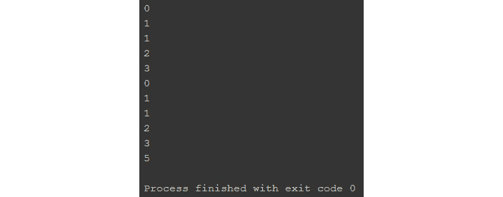
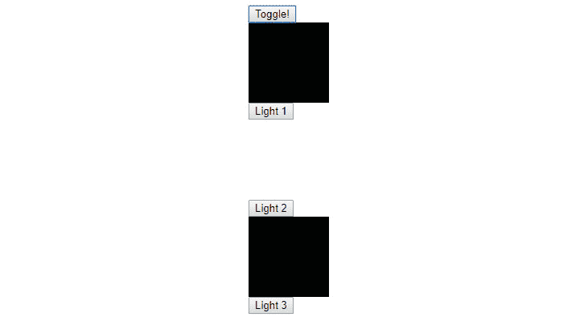

# 七、附录

## 关于

这一部分是为了帮助学生完成书中的活动。 它包括学生为达到活动目标所要执行的详细步骤。

## 第 1 章:介绍 ECMAScript 6

### 活动 1 -实现生成器

您的任务是建立一个简单的应用，生成在斐波那契数列的请求。 应用为每个请求生成序列中的下一个数字，并重置给定输入的序列。 使用生成器生成斐波那契序列。 如果一个值被传递到生成器，重置序列。 为了简单起见，可以从 n=1 开始计算斐波那契数列。

要突出显示生成器如何用于构建迭代数据集，请遵循以下步骤:

1.  查找斐波那契数列并理解下一个值是如何计算的。
2.  为斐波那契序列创建一个生成器。
3.  在生成器内部，使用变量`n2`和`n1`设置`current`和`next`(0,1)的默认值。
4.  创建一个无限的`while`循环。
5.  在`while`循环中，使用`yield`关键字提供序列中的当前值，并将 yield 语句的返回值保存到一个名为`input`的变量中。
6.  如果输入包含一个值，将变量`n2`和`n1`重置为初始值。
7.  在`while`循环中，计算`current`+`next`的下一个新值，并将其保存到 next 变量中。
8.  否则，更新`n2`以包含`n1`的值(`next`值)，并将`n1`设置为`while`循环顶部计算的`next`值。

**编码:**

##### **index.js**

```js
function* fibonacci () {
 let n2 = 0;x
 let n1 = 1;
 while ( true ) {
   let input = yield n2;
   if ( input ) {
     n1 = 1;
     n2 = 0;
   } else {
     let next = n1 + n2;
     [ n1, n2 ] = [ next, n1 ];
   }
 }
}
let gen = fibonacci();
```

###### 代码片段 1.87:实现一个生成器

https://bit.ly/2CV4KAi

**疗效:**



###### ．

###### 图 1.19:带有生成器的斐波那契序列

您已经成功地演示了如何使用生成器构建基于斐波那契序列的迭代数据集。

## 第二章:异步 JavaScript

### Activity 2 - Using Async/Await

您的任务是构建一个与数据库接口的服务器。 您必须编写一些代码来查找数据库中的集合和基本用户对象。 导入`simple_db.js`文件。 使用`get`和`insert`命令，使用 async/await 语法编写以下程序:

*   查找名为`john`的键，`sam`的键，以及您的名字作为数据库键。
*   如果数据库条目存在，记录结果对象的`age`字段。
*   如果数据库中不存在您的名字，请插入您的名字，并关联一个包含您的名、姓和年龄的对象。 查找新的数据关联并记录年龄。

对于任何失败的`db.get`操作，将键保存到数组中。 在程序的最后，打印失败的键。

**DB API:**

`db.get( index ):`

它接受一个索引并返回一个承诺。 该承诺通过与该索引相关联的`db`项实现。 如果索引不存在，db 查找失败，或者没有指定关键参数，promise 将被拒绝并返回错误。

`db.insert( index, insertData ):`

它接受一个索引和一些数据，并返回一个承诺。 如果操作完成，则通过插入键来实现承诺。 如果操作失败，或者没有指定键或插入数据，则拒绝 promise 并返回错误。

要使用 promise 和 async/await 语法来构建程序，请遵循以下步骤:

1.  使用`require( ‘./simple_db’ )`导入数据库 API，并保存到变量`db`中。
2.  编写一个异步主函数。 所有的操作都在这里。
3.  创建一个数组来跟踪导致`db`错误的键。 将其保存到变量`missingKeys`中。
4.  Create a try-catch block.

    在 try 部分中，使用 async/await 和`db.get()`函数从数据库中查找键`john`。

    将该值保存到变量`user`中。

    记录我们查找的用户的年龄。

    在 catch 段中，按`john`键到`missingKeys`数组。

5.  Create a second try-catch block.

    在 try 部分中使用 async/await 和`db.get()`函数从数据库中查找键`sam`

    将该值保存到变量`user`中。

    记录我们查找的用户的年龄。

    在 catch 段中，按`sam`键到`missingKeys`数组。

6.  Create a third try-catch block.

    在 try 部分中，使用 async/await 和`db.get()`函数从数据库中查找您的名字。

    将该值保存到变量`user`中。

    记录我们查找的用户的年龄。

    在 catch 部分，按下`missingKeys`数组的键。

    在 catch 部分，用 await 和`db.insert()`将你的`user`对象插入`db`。

    在 catch 部分中，在`catch`块中创建一个新的 try-catch 块。 在新的 try 部分中，使用 async/await 查找刚刚添加到 db 中的用户。 将找到的用户保存到`variable``user`中。 记录我们找到的用户的年龄。 在 catch 部分，按下键到`missingKeys`数组。

7.  在所有 try-catch 块的外面，在 main 函数的末尾，返回`missingKeys``array`。
8.  调用`main`函数并为返回的 promise 附加`then()`和`catch()`处理程序。
9.  应该向`then()`处理程序传递一个记录承诺解析值的函数。
10.  应该向`catch()`处理程序传递一个记录错误消息字段的函数。

**编码:**

##### **index.js**

```js
const db = require( './simple_db' );
async function main() {
 const missingKeys = [];
 try { const user = await db.get( 'john' ); } 
 catch ( err ) { missingKeys.push( 'john' ); }
 try { const user = await db.get( 'sam' ); }
 catch ( err ) { missingKeys.push( 'sam' ); }
 try { const user = await db.get( 'zach' ); }
 catch ( err ) {
   missingKeys.push( 'zach' );
   await db.insert('zach', { first: 'zach', last: 'smith', age: 25 });
   try { const user = await db.get( 'zach' ); }
   catch ( err ) { missingKeys.push( 'zach' ); }
 }
 return missingKeys;
}
main().then( console.log ).catch( console.log );
```

###### 代码片段 2.43:使用 async/await

https://bit.ly/2FvhPo2

**疗效:**


###### 图 2.12:显示的姓名和年龄

您已经成功地实现了文件跟踪命令并浏览了存储库的历史记录。

## 第三章:DOM 操作和事件处理

### 活动 3 -实现 jQuery

你想制作一个网络应用来控制家里的智能 LED 照明系统。 你有三个 led，可以单独打开或关闭，或全部切换在一起。 您必须构建一个简单的 HTML 和 jQuery 界面来显示灯的打开状态。 它还必须有控制灯光的按钮。

要使用 jQuery 来构建一个功能良好的应用，请遵循以下步骤:

1.  为该活动创建一个目录，并在该目录中，在命令提示符中运行`npm run init`以设置`package.json`。
2.  运行`npm install jquery -s`安装 jQuery。
3.  为活动创建一个 HTML 文件，并给 HTML 块一个主体。
4.  添加样式块。
5.  添加一个 div 来保存所有的按钮和灯。
6.  在`jQuery`文件中添加一个带有源文件的`script`标签。

    ```js
    <script src="./node_modules/jquery/dist/jquery.js"></script>
    ```

7.  添加一个`script`标签来保存主 JavaScript 代码。
8.  Add a `light` class to the CSS style sheet with the following settings:

    宽度和高度:`100px`

    背景色:`white`

9.  添加一个切换按钮到 div 使用`id=toggle.`
10.  添加一个 div 以保持灯的 id`lights`。
11.  Add three divs inside this div.

    #### 请注意

    每个 div 应该有一个带有`light`类的 div 和一个带有`lightButton`类`.`的按钮

12.  In the code script, set up a function to run when the DOM loads:

    `$( () => { ... } )`

13.  Select all the `lightButton` class buttons and add on-click handler that does the following:

    停止事件传播，选择元素目标并通过遍历 DOM 获取`light`div。

    检查`lit`属性。 如果打开，取消`lit`属性的设置。 否则，设置为`jQuery.attr()`

    用`jQuery.css().`更改`background-color css`样式以反映`lit`属性

14.  Select the `toggle` button by ID and add an on click handler that does the following:

    停止事件传播，并通过 CSS 类选择所有的 light 按钮，并在它们上触发一个单击事件:

**编码:**

##### **activity.html**

下面是压缩后的代码。 完整的解可以在`activities/activity3/index.html`处找到。

```js
$( '.lightButton' ).on( 'click', e => {
  e.stopPropagation();
  const element = $( e.target ).prev();
  if ( element.attr( 'lit' ) !== 'true' ) {
    element.attr( 'lit', 'true' );
    element.css( 'background-color', 'black' );
  } else {
    element.attr( 'lit', 'false' );
    element.css( 'background-color', 'white' );
  }
} );
$( '#toggle' ).on( 'click', e => {
  e.stopPropagation();
  $( '.lightButton' ).trigger( 'click' );
} );
```

###### 代码片段 3.32:jQuery 函数应用

https://bit.ly/2VV9DlB

**疗效****:**


###### 图 3.14:在每个 div 之后添加按钮



###### 图 3.15:添加切换按钮

您已经成功地使用 jQuery 构建了一个功能强大的应用。

## 第四章:测试 JavaScript

### 活动 4 -利用测试环境

您的任务是升级您的斐波那契序列测试代码以使用 Mocha 测试框架。 将为 Activity 1 创建的斐波那契序列代码和测试代码升级，以使用 Mocha 测试框架来测试代码。 您应该为 n=0 条件编写测试，然后实现 n=0 条件，然后为 n=1 条件编写测试并实现，然后为 n=2 条件编写测试并实现，最后为 n=5、n=7 和 n=9 条件编写测试。 如果`it()`测试通过，则不带参数调用`done`回调函数。 否则，调用带有错误或其他真值的`test done`回调函数。

要使用 Mocha 测试框架来编写和运行测试，请遵循以下步骤:

1.  使用`npm run init.`设置项目目录，使用`npm install mocha -s -g`全局安装 mocha。
2.  创建`index.js`以保存代码，创建`test.js`以保存测试。
3.  将测试脚本添加到`scripts`字段中的`package.json`。 测试应该调用`mocha`模块并通过`test.js`文件。
4.  将递归的斐波那契序列码加到`index.js`。 您可以使用内置的代码`Exercise 24`。
5.  使用`module.exports = { fibonacci }.`导出功能
6.  使用以下命令将 Fibonacci 函数导入到测试文件中:
7.  为测试写一个`describe`块。 传入字符串`fibonacci`和一个回调函数
8.  手工计算 fibonacci 序列中每个项的期望值(您还可以在谷歌上查找序列，以避免手工计算太多)。
9.  For each test condition (n=0, n=1, n=2, n=5, n=7, and n=9) do the following:

    创建一个带有`it()`功能的摩卡测试，并通过测试的描述作为第一个参数。

    传递一个回调函数作为第二个参数。 回调函数应该接受一个参数`done`。

    在回调函数内部调用 fibonacci 序列，并以不相等的比较将其结果与预期值进行比较。

    调用`done()`函数并通过测试比较结果。

    如果测试失败，返回`done( error )`。 否则，返回`done(null)`或`done(false)`。

10.  使用`npm run test`从命令行运行测试。

**编码:**

##### **test.js**

```js
'use strict';
const { fibonacci } = require( './index.js' );
describe( 'fibonacci', () => {
 it( 'n=0 should equal 0', ( done ) => {
   done( fibonacci( 0 ) !== 0 );
 } );
 it( 'n=1 should equal 1', ( done ) => {
   done( fibonacci( 1 ) !== 1 );
 } );
 it( 'n=2 should equal 1', ( done ) => {
   done( fibonacci( 2 ) !== 1 );
 } );
 it( 'n=5 should equal 5', ( done ) => {
   done( fibonacci( 5 ) !== 5 );
 } );
 it( 'n=7 should equal 13, ( done ) => {
   done( fibonacci( 7 ) !== 13 );
 } );
 it( 'n=9 should equal 34, ( done ) => {
   done( fibonacci( 9 ) !== 34 );
 } );
} );
```

###### 片段 4.9:利用测试环境

https://bit.ly/2CcDpJE

看看下面的输出截图:


###### 图 4.8:显示斐波那契数列

**结果**

您已经成功地利用了 Mocha 测试框架来编写和运行测试。

## 第五章:函数式编程

### 活动 1 -递归不变性

你正在用 JavaScript 构建一个应用，你的团队被告知出于安全原因不能使用任何第三方库。 您现在必须为这个应用使用函数式编程(FP)原则，并且您需要一个算法来创建不可变对象和数组。 创建一个递归函数，在`Object.freeze()`嵌套的所有层次强制对象和数组的不变性。 为简单起见，可以假设对象中没有嵌套的 null 或类。 用`activities/activity5/activity-test.js`写函数。 该文件包含测试实现的代码。

**演示物体的强迫不变性，遵循以下步骤:**

 **1.  在`activities/activity5/activity-test.js`处打开活动测试文件。
2.  创建一个名为`immutable`的函数，它只接受一个参数`data`。
3.  检查`data`是否为`object`类型。 如果不是，则返回。
4.  冻结`data`对象。 你不需要冻结非对象。
5.  使用`object.values`和`forEach()`循环遍历对象值。 递归地为每一个调用不可变函数。
6.  运行测试文件中包含的代码。 如果任何测试失败，修复 bug 并重新运行测试

**编码:**

##### **activity-solution.js**

```js
function immutable( data ) {
 if ( typeof data !== 'object' ) {
   return;
 }
 Object.freeze( data );
 Object.values( data ).forEach( immutable );
}
```

###### 代码片段 5.11:递归不变性

https://bit.ly/2H56ah1

看看下面的输出截图:


###### 图 5.7:通过测试输出显示

**疗效:**

您已经成功地演示了强制对象的不变性。

## 第六章:JavaScript 生态系统

### 活动 6 -用 React 构建前端

在练习 35 中负责你的笔记应用的前端团队意外地退出了。 您必须使用 React 为这个应用构建前端。 你的前端应该有两个视图:Home 视图和`Edit`视图。 为每个视图创建 React 组件。 `Home`视图应该有一个按钮，可以将视图更改为 Edit 视图。 Edit 视图应该有一个切换回 Home 视图的按钮，一个包含注释文本的文本输入，一个调用 API 加载路径的加载按钮，以及一个调用 API 保存路径的保存按钮。 提供了一个 Node.js 服务器。 用`activities/activity6/activity/src/index.js`编写 React 代码。 当您准备好测试代码时，在启动服务器之前运行构建脚本(在`package.json`中定义)。 您可以参考练习 35 中的`index.html`文件，以获得关于如何调用 API 路由的提示。

要构建一个有效的 React 前端并将其与 Node.js express 服务器集成，请遵循以下步骤:

1.  在“活动/活动 6/活动”中开始工作。 运行`npm install`安装所需的依赖项。
2.  在 src/index.js 中，创建 React 组件`Home`和`Editor`。
3.  Add a constructor to the App react component. In the constructor:

    取`props`变量。 呼叫`super`，将`props`传至`super`。

    在`this`范围内设置`state`对象。 它必须具有一个名为`view`的属性，其值为`home`。

4.  Add a `changeView` method to the app.

    `changeView`方法应该包含一个叫做`view`的参数。

    使用`setState`更新状态，并将`state`的`view`属性设置为提供的`view`参数。

    在构造函数中，添加一行将`this.changeView`设置为`this.changeView.bind(this)`。

5.  In App’s `render` function, create a conditional rendering based on the value of `this.state.view` that does the following:

    如果`state.view`等于`home`，显示主视图。 否则，显示编辑器视图。

    将`changeView`函数作为参数传给两个视图，分别是`<Editor``changeView={this.changeView}/>`和`<Home changeView={this.changeView}/>`。

6.  在`Home`组件中增加`goEdit()`功能，`calls`、`changeView`功能通过`props`(`this.props.changeView`)传入。 并将字符串`editor`传递给`changeView`函数。
7.  Create the `render` function in the `Home` component:

    返回一个 JSX 表达式。

    在返回的 JSX 表达式中，添加一个包含应用`Note Editor App`标题`title`的`div`，并添加一个按钮，将视图更改为`Edit`视图。

    按钮在点击时应调用`goEdit`功能。 请确保正确地将`this`状态绑定到`goEdit`函数。

8.  Add a constructor to the `Editor` component:

    接收`props`参数

    调用`super`并传入`props`变量。

    将`this`作用域中的`state`变量设置为等于`{value: ‘’}`对象。

9.  Add a function called `handleChage` to `Editor`:

    接受一个表示事件对象的参数`e`。

    使用`setState`更新状态，将状态属性`value`设置为事件目标的值:

    ```js
    this.setState( { value: e.target.value } );
    ```

10.  Create a `save` function in `Editor` that makes an HTTP request to the API save route.

    创建一个新的 XHR 请求并将其保存到`xhttp`变量中。

    将`xhttp`属性`onreadystatechange`设置为一个函数，用于检查是否为。 `readyState`等于`4`。 如果不是，则返回。 另外，检查`this.status`是否等于`200`。 如果不是，则抛出一个错误。

    通过调用`xhttp`上的`open`函数打开`xhr`请求。 输入参数`POST`、`/save`、`true`。

    通过调用`xhttp`对象上的`setRequestHeader`将请求头`Content-Type`设置为`application/json;charset=UTF-8`。 传入指定的值。

    使用`xhttp.send`发送文本输入的 JSON 数据。

    我们必须发送的值存储在`this.state`中。 在发送之前对值进行 Stringify。

11.  Create a `load` function in `Editor` that makes an HTTP request to the API load route.

    创建一个新的 XHR 请求并将其保存到`xhttp`变量中。

    将`this`范围保存到一个名为`that`的变量中，以便在`xhr`请求中使用它。

    将`xhttp`属性`onreadystatechange`设置为一个检查`this.readyState`是否等于`4`的函数。 如果不是，那么返回。 然后检查`this.status`是否等于`200`。 如果不是，则抛出一个错误。 它调用 React 组件作用域上的`setState`函数，该函数保存在`that`变量中。

    传入一个键值为`value`的对象，该值等于请求的解析响应。 使用`JSON.parse`函数解析`this.response`变量的 HTTP 响应值。

    通过对`xhttp`变量调用`open`函数打开 HTTP 请求。 输入参数`GET`、`/load`、`true`。

    通过调用`xhttp`对象上的`send()`方法发送 XHR 请求。

12.  Create a `goHome` function in `Editor`.

    调用通过 React 元素属性对象(`this.props.changeView()`)传入的`changeView`函数。

    传入字符串`home`。

13.  Create the `render` function in `Editor`.

    添加一个按钮，一旦点击，调用包含文本`Back to home`的`goHome`函数。 它在点击事件上调用`goHome`函数。 请确保正确地将`this`范围绑定到函数。

    添加一个包含注释文本的`text`输入。 文本输入从`state.value`字段加载其值。 `text`字段在一个变更事件上调用`handleChange`函数。 请确保正确地将`this`范围绑定到`handleChange`函数。

    添加一个按钮从服务器加载包含文本`Load`的注释数据。 它在点击事件上调用`load`函数。 请确保正确地将`this`作用域绑定到 load 函数调用。

    添加一个按钮以将注释数据保存到包含文本`Save`的服务器。 它在点击事件上调用`save`函数。 请确保正确地将`this`作用域绑定到 save 函数调用。

    请确保正确地将`this`状态绑定到所有的监听器。

14.  Test the code when ready by doing the following:

    在根项目文件夹中运行`npm run build`以从 JSX 编译代码。

    运行`npm start`启动服务器。

    加载服务器启动时指定的 URL(`127.0.0.1:PORT`)。

    通过点击**Edit**和`Back to home`按钮测试视图更改。

    测试`save`功能，输入文本到`text`输入，保存它，并检查在文件夹中创建的文本文件，看看它是否匹配。

    通过在文本文件中输入文本，加载文本文件，并确保`text`输入的值与文本文件中的值匹配，来测试`load`功能。

下面的代码片段提供了压缩的代码片段。 参考`activities/activity6/solution/src/index.js`获得完整的解决方案代码。

##### Index.js

```js
class Editor extends React.Component {
 constructor( props ) { ... }
 handleChange( e ) { ... }
 save() { ... }
 load() { ... }
 goHome() { ... }
 render() {
   return (
     <div>
       <button type="button" onClick={this.goHome.bind( this )}>Back to home</button>
       <input type="text" name="Note Text" value={this.state.value} onChange={this.handleChange.bind( this )}/>
       <button type="button" onClick={this.load.bind( this )}>Load</button>
       <button type="button" onClick={this.save.bind( this )}>Save</button>
     </div>
   );
 }
}
class Home extends React.Component {
 goEdit() { ... }
 render() {
   return (
     <div>
       <h1>Note Editor App</h1>
       <button type="button" onClick={this.goEdit.bind( this )}>Edit Note</button>
     </div>
   );
 }
}
//{…}
```

###### 代码片段 6.42:React 组件

https://bit.ly/2RzxKI2

**疗效:**

看看这里的输出截图:


###### 图 6.13:编辑视图


###### 图 6.14:服务器视图


###### 图 6.15:运行服务器来测试代码

你已经成功构建了一个有效的 React 前端，并将其与 Node.js express 服务器集成。**