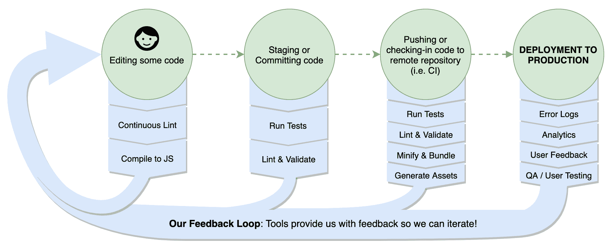

# 十五、简化代码的工具

我们使用的工具对我们编写代码时的习惯有很大的影响。 在编码的时候，就像在生活中一样，我们要养成好习惯，避免坏习惯。 一个好习惯的例子就是编写语法上有效的 JavaScript。 为了帮助我们加强这个好习惯，我们可以使用一个 linter 来通知我们代码是无效的。 我们应该这样考虑每一种工具。 它激发了什么好习惯? 它能阻止什么坏习惯?

如果我们回想一下我们最初的干净代码原则(*R.E.M.U*)，我们可以观察到各种工具是如何帮助我们遵守这些原则的。 以下是一些工具的收集，可以为这四项原则服务:

*   **可靠性**:测试工具，用户反馈，错误日志，分析，检查器，静态类型工具和语言
*   **效率**:性能测量、分析、用户反馈、用户体验评价、生态成本(例如*碳足迹*)
*   **可维护性**:格式化器、检查器、文档生成器、自动化构建和持续集成
*   **可用性**:分析，用户反馈，文档生成器，易用性检查，用户体验评论，以及*走廊测试*

激发良好习惯的工具通过增强我们的*反馈循环*发挥作用。 反馈回路是最终让你意识到你需要做出改变的东西。 也许您引入了一个导致错误被记录的错误。 也许你的实现不清晰，有同事抱怨。 如果工具能够及早发现这些情况，那么它就能够加快我们的反馈循环，使我们能够更快地工作并达到更高的质量水平。 在下图中，我们展示了**我们的反馈循环**以及它是如何在每个开发阶段通过工具获取信息的:



在我们的开发过程中，有许多反馈渠道。 有检查程序告诉我们什么时候语法有问题，有静态类型检查程序来确认我们正在正确使用类型，还有测试来确认我们的预期。 即使在部署之后，这种反馈也会继续。 我们有显示故障的错误日志，告诉我们用户行为的分析，以及来自终端用户和其他个人的反馈，告诉我们故障或需要改进的地方。

Different projects will operate in different ways. You may be a solo programmer or 1 of 100 programmers dedicated to a specific project. Regardless, there will likely be various stages of development, and the possibility of feedback exists at every stage. Tooling and communication is vital to an effective feedback loop. 

在本章中，我们将介绍一些工具，这些工具可以帮助我们建立良好的习惯和积极的反馈循环。 具体来说，我们将涵盖以下内容:

*   剥绒机和格式器
*   静态类型
*   E2E 测试工具
*   自动化构建和 CI

# 剥绒机和格式器

一个**linter**是一个工具，用来分析代码和发现错误，语法错误，风格不一致，和可疑的结构。 流行的 JavaScript 检查器包括*ESLint*，*JSLint*和*JSHint*。

大多数检查器允许我们指定想要查找的错误或不一致的类型。 例如，ESLint 将允许我们在根级`.eslintrc`(或`.eslintrc.json`)文件中为给定的代码库指定一个全局配置。 在它中，我们可以指定我们正在使用的语言的版本、我们正在使用的特性以及我们希望执行的检测规则。 下面是一个示例`.eslintrc.json`文件:

```js
{
  "parserOptions": {
    "ecmaVersion": 6,
    "sourceType": "module",
    "ecmaFeatures": {
      "jsx": true
     }
  },
  "extends": "eslint:recommended",
  "rules": {
    "semi": "error",
    "quotes": "single"
  }
}
```

下面是对我们的配置的解释:

*   `ecmaVersion`:这里，我们指定我们的代码库是用 ECMAScript 6(2016)版本的 JavaScript 编写的。 这意味着如果 linter 发现你在使用 ES6 特性，它不会抱怨。 然而，如果你使用 ES7/8 的特性，如你所料，它会抱怨。
*   `sourceType`:指定我们正在使用 ES 模块(导入和导出)。
*   `ecmaFeatures`:这告诉 ESLint 我们希望使用 JSX，这是一个语法扩展，允许我们指定类似 xml 的层次结构(这在组件框架中被大量使用，比如 React)。
*   `extends`:这里，我们指定了一个默认规则集`"eslint:recommended"`，这意味着我们很乐意让 ESLint 强制执行一组推荐的规则。 如果没有这个，ESLint 只会强制执行我们指定的规则。
*   `rules`:最后，我们正在配置我们希望在推荐配置之上设置的特定规则:
    *   `semi`:该规则与分号有关; 在我们的重写中，我们指定我们希望在缺少分号的情况下产生错误，而仅仅是警告。
    *   `quotes`:该规则与引号相关，并指定我们希望执行单引号，这意味着如果在代码中看到双引号，linter 将警告我们。

我们可以通过编写一段故意打破规则的代码来尝试我们的配置:

```js
const message = "hello"
const another = `what`

if (true) {}
```

如果我们在这段代码上安装并运行 ESLint(在 bash:`> eslint example.js`内)，那么我们将收到以下内容:

```js
/Users/me/code/example.js
 1:7 error 'message' is assigned a value but never used 
 1:17 error Strings must use singlequote 
 1:24 error Missing semicolon
 2:7 error 'another' is assigned a value but never used
 2:17 error Strings must use singlequote
 2:23 error Missing semicolon
 4:5 error Unexpected constant condition 
 4:11 error Empty block statement

 8 problems (8 errors, 0 warnings)
 4 errors and 0 warnings potentially fixable with the `--fix` option.
```

这将根据我们配置的规则详细说明语法中的所有错误。 如您所见，它详细说明了被破坏的规则和发现问题的行。 ESLint 和其他检测工具在查找难以发现的语法错误方面非常有帮助，如果不做任何改变，其中一些错误可能会导致在未来很难调试函数错误。 检测还使代码更加一致，使程序员能够感到熟悉并承受更少的认知负担，就像在具有许多不同语法约定的代码库中那样。

ESLint 还包括一个工具，通过它的`--fix`选项修复这些语法错误的子集，尽管你可能已经注意到，只有一个子集的错误可以通过这种方式修复。 其他的则需要手工完成。 不过，值得庆幸的是，有许多更高级的工具可以帮助我们。 格式化程序，如**Prettier**和**Standard JS**，将采用我们的语法首选项，并对我们的代码进行积极更改，以确保其保持一致。 这意味着程序员不必使用特定的语法规则，或者无休止地更改代码以响应检查程序。 他们可以按照自己希望的方式编写代码，当他们完成时，格式化程序将更改代码以符合商定的语法约定，或者在出现严重或无效的语法错误时警告程序员。

为了说明问题，让我们在一段简单的代码上运行带有默认配置的 Prettier:

```js
function reverse( str ) {
  return ( String( str ).split( '' ).reverse().join( '' ) );
}
```

当通过 Prettier 运行前面的代码时，我们会收到以下代码:

```js
function reverse(str) {
  return String(str)
    .split("")
    .reverse()
    .join("");
}
```

正如我们所看到的，Prettier 删除并更改了我们的一些语法习惯，以适应其配置的约定。 也就是说，它把单引号换成了双引号，去掉了多余的括号，并对空格做了重大修改。 格式化程序的神奇之处在于，它们让程序员不再感到痛苦。 它们的工作是纠正次要的语法习惯，让程序员可以自由地从事更重要的工作。 行业的总体趋势是不再使用简单的绒毛，而是使用功能更全面的工具，将绒毛和格式结合起来。

遵循何种语法约定是可配置的，完全由您决定。 关于这一点有很多强烈的观点，但最重要的原则是坚持一致性。 例如，我个人更喜欢单引号，而不是双引号，但如果我工作的代码库中双引号是既定的惯例，那么我将毫无疑问地改变我的习惯。 大多数时候，句法偏好只是主观的和继承的规范，所以重要的不是我们使用哪种规范，而是我们是否都遵守它。

我们在 JavaScript 语言中已经习惯的许多规范都是由它的动态类型本质指导的。 例如，我们已经习惯于手动检查特定类型，以便在接口中提供有意义的警告或错误。 对许多人来说，适应这些规范是一项挑战，他们渴望对自己使用的类型有更高的信心。 因此，人们给 JavaScript 带来了各种静态类型工具和语言扩展。 我们接下来将探讨这些问题，当我们这样做的时候，请注意这种静态类型工具可能会如何改变或改善您的个人发展反馈循环。

# 静态类型

正如我们已经详细探讨过的，JavaScript 是一种动态类型语言。 如果使用得当，这将是一个巨大的好处，它允许您快速地工作，并允许您的代码具有一定程度的灵活性，使同事能够更轻松地使用它。 然而，在某些情况下，动态类型可能会给程序员带来 bug 和不必要的认知负担。 静态类型编译语言，如 Java 或 Scala，强制程序员在声明点指定他们所期望的类型(或在执行之前通过如何使用来推断类型)。

静态类型有以下潜在的好处:

*   程序员可以**对他们将要处理的**类型有信心，因此可以对它们的值的功能和特征做出一些安全的假设，从而简化开发。
*   代码可以在执行之前进行静态类型检查，这意味着**可以很容易地捕获潜在的 bug**，而不会受到类型的特定(和意外)安排的影响。
*   代码(或它的 api)的维护者和用户有一个**更清晰的期望**来操作，而不是猜测什么可能工作，什么可能不工作。 类型说明本身可以作为一种文档。

即使 JavaScript 是动态类型的，也有人努力为 JavaScript 程序员提供静态类型系统的好处。 两个相关的例子是 Flow 和 TypeScript:

*   **Flow**([https://flow.org/](https://flow.org/))是一个静态类型检查器和 JavaScript 的语言扩展。 它允许您使用它自己的特定语法注释类型，尽管它并不被认为是一种独特的语言。
*   **TypeScript**([http://www.typescriptlang.org/](http://www.typescriptlang.org/))是微软开发的 JavaScript 超集语言(有效的 JavaScript 总是有效的 TypeScript)。 它本身就是一种语言，有自己的类型注释语法。

Flow 和 TypeScript 都允许你声明你要声明的类型，以及函数中的变量声明或形参声明。 下面是一个声明函数的示例，该函数接受`productName`(`string`)和`rating`(`number`):

```js
function addRating(productName: string, rating: number) {
  console.log(
    `Adding rating for product ${productName} of ${rating}`
  );
}
```

Flow 和 TypeScript 通常都允许在`IDENTIFIER: TYPE`形式的声明标识符后面注释类型，其中`TYPE`可以是`number`、`string`、`boolean`等任何类型。 但它们在很多方面确实不同，所以研究两者都很重要。 当然，无论是 Flow 还是 TypeScript，以及 JavaScript 的大多数其他静态类型检查技术，都需要经过*构建*或*编译*的步骤才能工作，因为它们包含语法扩展。

请注意，静态类型并不是万能药。 我们代码的整洁性不仅仅局限于它避免类型相关错误和困难的能力。 我们必须*缩小*，在我们的角度，并记住考虑用户和他们试图通过我们的软件实现什么。 很常见的情况是，热情的程序员迷失在语法的细节中，而放弃更大的图景。 因此，为了稍微改变策略，我们现在将探讨*端到端测试工具*，因为端到端测试对代码库质量的影响与我们使用的类型系统或语法一样重要，如果不是更多的话!

# E2E 测试工具

在前几章中，我们探讨了测试的好处和类型，包括对 E2E 测试的概述。 我们通常用来构建测试套件和进行断言的测试库很少包含 E2E 测试工具，因此我们有必要为此找到自己的工具。

端到端测试的目的是模拟应用上的用户行为，并在用户交互的各个阶段断言应用的状态。 通常，端到端测试将测试一个特定的用户流程，如*用户可以注册*新账号，*用户可以登录*购买产品。 无论我们是在服务器端还是客户端使用 JavaScript，如果我们正在构建一个 web 应用，进行这样的测试将是非常有益的。 为此，我们需要使用一个可以人工创建用户环境的工具。 在 web 应用中，用户环境是浏览器。 值得庆幸的是，有许多工具可以模拟或运行真正的(或*headles**s*)浏览器，我们可以通过 JavaScript 访问和控制这些浏览器。

A **headless** browser is a web browser without a graphic user interface. Imagine the Chrome or Firefox browser, but without any visible UI, entirely controllable via a CLI or a JavaScript library. Headless browsers allow us to load up our web application and make assertions about it without having to pointlessly expend hardware capabilities on rendering a GUI (meaning we can run such tests on our own computers or *in the cloud* as part of our *continuous integration/deployment* process).

这类工具的一个例子是**Puppeteer**，这是一个 Node.js 库，提供了一个 API 来控制 Chrome(或 Chromium)。 它可以无头或无头运行。 下面是一个例子，我们打开一个页面，并记录它的`<title>`:

```js
import puppeteer from 'puppeteer';

(async () => {
  const browser = await puppeteer.launch();
  const page = await browser.newPage();
  await page.goto('https://example.com');

  const titleElement = await page.$('title');
  const title = await page.evaluate(el => el.textContent, titleElement);

  console.log('Title of example.com is ', title);

  await browser.close();
})();
```

Puppeteer 提供了一个高级 API，允许创建和导航浏览器页面。 在这个上下文中，使用一个`page`实例，我们可以通过`evaluate()`方法评估特定的客户端 JavaScript。 传递给该方法的任何代码都将在文档的上下文中运行，因此可以访问 DOM 和其他浏览器 api。

这就是我们如何能够检索`<title>`元素的`textContent`属性。 您可能已经注意到，许多 Puppeteer 的 API 是异步的，这意味着我们必须使用`Promise#then`或`await`来等待每条指令完成。 这可能很麻烦，但考虑到代码正在运行并控制整个 web 浏览器的事实，有些任务是异步的是有意义的。

端到端测试很少被接受，因为它被认为是困难的。 虽然这种看法一度是正确的，但现在已不再正确。 使用像 Puppeteer 这样的 api，我们可以轻松地启动 web 应用，触发特定的动作，并对结果进行断言。 下面是一个使用 Jest(一个测试库)和 Puppeteer 对`<title>`元素在`https://google.com`中的文本进行断言的例子:

```js
import puppeteer from 'puppeteer';

describe('Google.com', () => {

  let page;

  beforeAll(async () => {
      const browser = await puppeteer.launch();
      page = await browser.newPage();
      await page.goto('https://google.com');
  });

  afterAll(async () => await browser.close());

  it('has a <title> of "Google"', async () => {
    const titleElement = await page.$('title');
    const title = await page.evaluate(el => el.textContent, titleElement);
    expect(title).toBe('Google');
  });
});
```

获取页面、解析其 HTML 并生成我们可以断言的 DOM 是一个非常复杂的过程。 浏览器在这方面非常有效，所以在我们的测试过程中使用它们是有意义的。 毕竟，浏览器看到的内容将决定终端用户看到的内容。 端到端测试为我们提供了对潜在漏洞的真实了解，编写或运行它们不再困难。 它们对于整洁的程序员来说尤其强大，因为它们让我们从更面向用户的角度来看待代码的可靠性。

与我们已经探索过的许多工具一样，通过自动化将 E2E 测试最好地集成到我们的开发经验中。 现在我们将简要地探讨这个问题。

# 自动化构建和 CI

正如我们所强调的，有大量的工具可以帮助我们编写干净的代码。 这些工具可以手动激活，通常通过**命令行界面**(**CLI**)或有时在我们的 ide 中。 然而，通常情况下，将它们作为我们不同开发阶段的一部分运行是谨慎的。 如果使用源代码控制，那么这个过程将包括一个*承诺*或*分段*过程，然后是*推*或*签入*过程。 当这些事件与对文件进行更改的简单操作结合在一起时，我们的工具可以使用这三个重要的开发阶段来生成它们的输出:

*   :这是典型的 JavaScript(或 CSS)翻译或编译发生在这个阶段。 例如，如果你正在编写包含 JSX 语言扩展(React)的 JS，那么你很可能依赖于*Babel*来不断地将你的 JS 混合编译为有效的 ECMAScript(参见 Babel 的`--watch`命令标志)。 当文件发生变化时，检测或其他代码格式化也很常见。
*   :检测、测试或其他代码验证通常发生在提交前或提交后阶段。 这很有用，因为任何无效或损坏的代码都可以在推入之前标记出来。 在这个阶段，资产生成或编译并不罕见(例如，从 SASS 生成有效的 CSS，一种替代的样式表语言)。
*   :当新代码被推送到特性分支或主分支时，所有过程(检测、测试、编译、资产生成等)通常都发生在远程机器中。 这被称为**持续集成**，允许程序员在部署到生产环境之前，查看他们的代码与同事的代码组合时的运行情况。 用于 CI 的工具和服务的例子包括**TravisCI**、**Jenkins**和**CircleCI**。

让您的工具自动激活可以极大地简化开发，但是，这不是必需的。 您可以通过 CLI 检查代码、运行测试、转换 CSS 或生成压缩资产，而不必担心自动化。 但是，您可能会发现这样做比较慢，而且如果您的工具没有标准化到一组自动化中，那么您的工具在团队中的使用就更有可能不一致。 例如，可能是这样的情况，您的同事总是在将 SCSS 转换为 CSS 之前运行测试，而您倾向于使用相反的方法。 这可能导致不一致的错误和*它在我的机器上工作*综合症。

# 总结

在这一章中，我们发现了工具的用处，强调了它在改善我们的反馈循环方面的能力，以及它如何使我们能够编写更干净的代码。 我们还探索了一些特定的库和实用程序，让我们了解了存在哪些类型的工具，以及如何以各种方式增强我们作为程序员的能力和习惯。 我们已经试用了检查器、格式化器、静态类型检查器和 E2E 测试工具，并且我们已经看到了工具在开发的每个阶段的优点。

下一章将开启我们探索合作艺术与科学的旅程; 对于想要编写干净代码的人来说，这是一个至关重要的因素。 我们将从如何编写清晰易懂的文档开始。