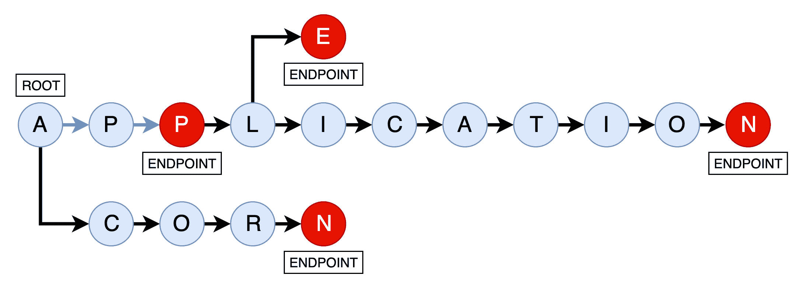
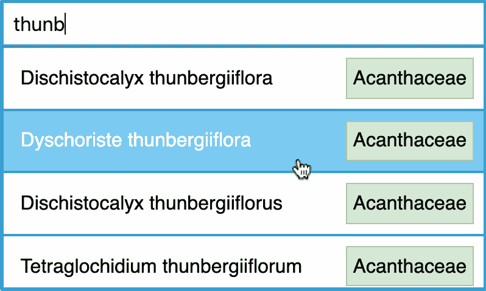

# 十九、案例研究

在这本书中，我们讨论了一连串的原则，几乎涵盖了 JavaScript 语言的每一个方面，并详细讨论了*整洁代码*的构成要素。 这一切都是朝着一个最终目标而努力，在这个最终目标中，我们完全有能力编写漂亮而干净的 JavaScript 代码，处理真实而具有挑战性的问题域。 然而，追求干净的代码永远不会完成; 新的挑战总是会出现，让我们以新的和范式转换的方式思考我们编写的代码。

在本章中，我们将逐步学习用 JavaScript 创建一个新功能的过程。 这将涉及到客户端和服务器端两部分，并将迫使我们应用在本书中收集的许多原则和知识。 我们要解决的具体问题是根据我负责的一个现实项目改编的，虽然我们不会深入到其实施的每一个角落和缝隙，但我们将涵盖最重要的部分。 您可以通过以下链接在 GitHub 上查看已完成的项目:[https://github.com/PacktPublishing/Clean-Code-in-JavaScript](https://github.com/PacktPublishing/Clean-Code-in-JavaScript)。

在本章中，我们将涵盖以下主题:

*   :我们将定义并探讨这个问题
*   :我们将设计一个 UX 和架构来解决这个问题
*   我们将实施我们的设计

# 这个问题

我们要解决的问题与 web 应用用户体验的核心部分有关。 我们将开发的 web 应用是一个大型植物数据库的前端，其中包含数万种不同的植物。 除其他功能外，它允许用户找到特定的植物，并将它们添加到收藏中，这样他们就可以跟踪自己的外来温室和植物研究清单。 图示如下:


目前，当用户希望找到一种植物时，他们必须使用搜索功能，包括在文本框中输入一个植物名称*(完整的拉丁名称*)，点击搜索，然后接收一组结果，如下图所示:


For the purposes of our case study, the plant names only exist as their full Latin names, which includes a family (for example, Acanthaceae), a genus (for example, Acanthus), and a species (for example, Carduaceus). This highlights the challenges involved in catering to complex problem domains.

这已经足够好了，但根据一些用户焦点小组和在线反馈，我们决定，我们需要为用户提供更好的用户体验，使他们能够更快地找到他们感兴趣的植物。 具体提出的几点如下:

*   我发现有时寻找物种是一件费时费力的事。 我希望它更直接、更灵活，这样我就不必不断返回来修改查询，特别是如果我拼错了的话。
*   通常情况下，当我知道一种植物的种类或属的名字时，我还是会稍微弄错，得不到任何结果。 然后我就得回去调整我的拼写或者在网上其他地方搜索。
*   我希望我能看到物种和属出现在我键入。 这样我可以更快地找到合适的植物，而不浪费任何时间。

这里有一些可用性方面的问题。 我们可以将其归纳为以下三个主题:

*   :当前的搜索工具是缓慢和笨重的使用
*   **Error****c****correction**:The process of having to correct typing errors is annoying and bur 赘
*   **反馈**:在分型时，收集现有*属*/*种*的反馈信息

任务现在越来越清晰了。 我们需要改进用户体验，让用户能够以更快的方式查询植物数据库，提供更即时的反馈，并让他们在此过程中防止或纠正输入错误。

# 设计

在头脑风暴之后，我们决定用一种传统的方法来解决问题; 我们可以简单地将输入字段转换为一个提供自动建议的下拉框。 这里有一个模型:


这个自动建议下拉框有以下特征:

*   当键入一个术语时，它将显示一个以该术语为前缀的优先级的植物名称列表，例如，搜索`car`将得到`carnea`而不是`encarea`的结果。
*   当一个术语被点击，箭头(向上/向下)，或*输入*键，它将运行一个指定的功能(以后可能用于添加所选的项目到用户的集合)
*   当找不到匹配的植物名称时，用户会被告知:`No plants with that name exist`

这些是我们组件的核心行为，为了实现它们，我们需要同时考虑客户端和服务器端部分。 我们的客户端将不得不渲染`<input>`给用户，当他们键入，它将不得不动态地调整建议列表。 服务器必须为每个潜在查询提供一个建议列表，同时考虑到需要快速交付结果这一事实。 任何明显的延迟都会大大降低我们正在努力创造的用户体验的好处。

# 实现

碰巧这个新工厂选择组件将是第一个重要的客户端代码在我们的 web 应用,这样,重要的是要注意,我们的设计决策不仅影响这特定的组件也是任何其他组件我们考虑在未来建筑。

帮助我们在我们的实现中,考虑其他潜在增加的可能性在不久的将来,我们决定采取一个 JavaScript 库,协助操纵 DOM,和一个支持工具集,使我们能够迅速和高层的质量工作。 在这个例子中，我们决定在客户端使用 React，使用 webpack 和 Babel 来帮助编译和绑定，在服务器端使用 Express 来进行 HTTP 路由。

# 植物选择的应用

如前所述，我们决定构建我们的*植物选择*功能，作为它自己的自包含应用，同时具有一个客户端(React 组件)和一个服务器端(植物数据 API)。 有了这种级别的隔离，我们就可以专注于选择植物的问题，但没有理由不能在以后将其集成到更大的代码库中。

我们的目录结构大致如下:

```js
EveryPlantSelectionApp/
├── server/
│   ├── package.json
|   ├── babel.config.js
│   ├── index.js
|   └── plantData/
│       ├── plantData.js
│       ├── plantData.test.js
|       └── data.json
└── client/
    ├── package.json
    ├── webpack.config.js
    ├── babel.config.js
    ├── app/
    |   ├── index.jsx
    |   └── components/
    |       └── PlantSelectionInput/
    └── dist/
        ├── main.js (bundling target)
        └── index.html
```

除了降低我们(程序员)的复杂性外，服务器端和客户端分离意味着服务器端应用(即 Plant Selection API)可以在必要时运行在自己的不同的服务器上，而客户端可以从 CDN 静态地提供服务， 只需要服务器端地址就可以访问它的 REST API。

# 创建 REST API

`EveryPlantSelectionApp`负责的服务器检索植物名称(植物*家庭*,*属种,*和*物种*)并将其转化为我们的客户端代码通过一个简单的 REST API。 为了做到这一点，我们可以使用`express`Node.js 库，它使我们能够将 HTTP 请求路由到特定的函数，轻松地将 JSON 传递给我们的客户端。

下面是我们服务器实现的基本框架:

```js
import express from 'express';

const app = express();
const port = process.env.PORT || 3000;

app.get('/plants/:query', (req, res) => {
  req.params.query; // => The query
  res.json({
    fakeData: 'We can later place some real data here...'
  });
});

app.listen(
  port,
  () => console.log(`App listening on port ${port}!`)
);
```

正如你所看到的，我们只实现了一条路由(`/plants/:query`)。 每当用户在`<input/>`中输入部分工厂名称时，客户端就会请求该请求，因此用户输入`Carduaceus`可能会向服务器产生以下一组请求:

```js
GET /plants/c
GET /plants/ca
GET /plants/car
GET /plants/card
GET /plants/cardu
GET /plants/cardua
...
```

您可以想象，这可能会导致大量昂贵且可能冗余的请求，特别是当用户快速输入时。 用户可能会在之前的任何请求完成之前输入`cardua`。 出于这个原因，当我们实现客户端时，使用某种类型的请求节流(或请求撤销)来确保我们只发出合理数量的请求是合适的。

**Request throttling** is the act of reducing the overall amount of requests by only allowing a new request to be performed at a specified time interval, meaning that 100 requests spanned over five seconds, throttled to an interval of one second, would produce only five requests. **Request debouncing** is similar, though instead of performing a single request on every interval, it'll wait a predesignated amount of time for incoming requests to stop being made before enacting an actual request. So, 100 requests over five seconds, debounced by five seconds, would only produce a single final request at the five second mark.

为了实现`/plants/`端点，我们需要考虑在超过*300,000 个*不同植物种类的名称中搜索匹配的最优方法。 为此，我们将使用一种特殊的内存数据结构，称为**try**。 这也被称为*前缀树*，通常用于需要出现自动建议或自动完成的情况。

try 是一种树状结构，它存储相邻的字母块，这些字母块是由分支连接的一系列节点组成的。 想象比描述要容易得多，所以让我们假设我们需要基于以下数据进行一次尝试:

```js
['APPLE', 'ACORN', 'APP', 'APPLICATION']
```

使用这些数据，生成的 try 可能看起来像这样:



如您所见，我们的四个单词的数据集被表示为一个树状结构，其中第一个常用字母`"A"`作为根。 `"CORN"`后缀从这个分支出来。 此外,`"PP"`分支(形成`"APP"`),分支,最后`"P"``"L"`然后分支,然后自己分支去`"E"`形成`"APPLE"`和【显示】(形成`"APPLICATION"`)。

这可能看起来很复杂，但对于这种 try 结构，我们可以通过简单地遍历树的节点，轻松地找到所有匹配的单词(`"APPLE"`和`"APPLICATION"`)，如果用户输入一个初始前缀，比如`"APPL"`。 这比任何线性搜索算法的性能都要好得多。 对于我们的目的，给定一个植物名称的前缀，我们希望能够有效地显示该前缀可能导致的每个植物名称。

我们的具体数据集将包括超过 30 万种不同的植物物种，但为了本案例研究的目的，我们将只使用`Acanthaceae`科的物种，这一科大约有 8000 种。 这些可以以 JSON 的形式使用，如下:

```js
[
  { id: 105,
    family: 'Acanthaceae',
    genus: 'Andrographis',
    species: 'alata' },
  { id: 106,
    family: 'Acanthaceae',
    genus: 'Justicia',
    species: 'alata' },
  { id: 107,
    family: 'Acanthaceae',
    genus: 'Pararuellia',
    species: 'alata' },
  { id: 108,
    family: 'Acanthaceae',
    genus: 'Thunbergia',
    species: 'alata' },
  // ...
]
```

我们将把这些数据输入到 NPM 上一个叫做**try -search**的第三方 try 实现中。 选择这个包是因为它满足了我们的要求，并且看起来像一个经过良好测试和维护的库。

为了使试验按我们的愿望进行，我们需要将每一种植物的*科*、*属*和*种*连接成一个单一的串。 这使得 try 可以同时包含完全限定的植物名称(例如，`"Acanthaceae Pararuellia alata"`)和分割名称(`["Acanthaceae", "Pararuellia", "alata"]`)。 *split*名称是由我们正在使用的 try 实现自动生成的(意思是它通过正则表达式`/\s/g`在空白上分割字符串):

```js
const trie = new TrieSearch(['name'], {
  ignoreCase: true // Make it case-insensitive
});

trie.addAll(
  data.map(({ family, genus, species, id }) => {
    return { name: family + ' ' + genus + ' ' + species, id };
  })
);
```

前面的代码将我们的数据集输入 try。 接下来，它可以通过简单地传递一个前缀字符串到它的`get(...)`方法来查询:

```js
trie.get('laxi');
```

这样的查询(对于前缀`laxi`)将从我们的数据集返回以下结果:

```js
[
  { id: 203,
    name: 'Acanthaceae Acanthopale laxiflora' },
  { id: 809,
    name: 'Acanthaceae Andrographis laxiflora' },
  { id: 390,
    name: 'Acanthaceae Isoglossa laxiflora' },
  //... (many more)
]
```

所以，对于我们的 REST 端点，`/photos/:query`，它所需要做的就是返回一个 JSON 有效负载，其中包含我们从`trie.get(query)`得到的任何内容:

```js
app.get('/plants/:query', (req, res) => {
  const queryString = req.params.query;
  if (queryString.length < 3) {
    return res.json([]);
  }
  res.json(
    trie.get(queryString)
  );
});
```

为了更好地分离我们的关注点，并确保我们没有混合太多不同的抽象层(可能违反了 Demeter 定律)，我们可以抽象掉我们的 try 数据结构，并将数据植入到它自己的模块中。 我们可以称它为`plantData`，以说明它封装并提供对植物数据的访问。 它如何工作的本质，它碰巧是通过内存中的 try 数据结构，不需要知道它的消费者:

```js
// server/plantData.js

import TrieSearch from 'trie-search';
import plantData from './data.json';

const MIN_QUERY_LENGTH = 3;

const trie = new TrieSearch(['fullyQualifiedName'], {
  ignoreCase: true
});

trie.addAll(
  plantData.map(plant => {
    return {
      ...plant,
      fullyQualifiedName:
        `${plant.family} ${plant.genus} ${plant.species}`
    };
  })
);

export default {
  query(partialString) {
    if (partialString.length < MIN_QUERY_LENGTH) {
      return [];
    }
    return trie.get(partialString);
  }
};
```

如你所见，该模块返回一个接口，该接口提供了一个方法`query()`，我们的主要 HTTP 路由代码可以利用它来交付`/plants/:query`的 JSON 结果:

```js
//...
import plantData from './plantData';
//...
app.get('/plants/:query', (req, res) => {
  const query = req.params.query;
  res.json( plantData.query(partial) );
});
```

因为我们已经隔离并包含了植物查询功能，所以现在对它进行断言要容易得多。 编写一些针对`plantData`抽象的测试将使我们对 HTTP 层使用的是可靠的抽象有很高的信心，从而最大限度地减少 HTTP 层本身可能出现的潜在错误。

At this point, since this is the first set of tests we'll be writing for our project, we'll be installing Jest (`npm install jest --save-dev`). There are a large number of testing frameworks available, with varying styles, but for our purposes, Jest is suitable.

我们可以在一个名为`plantData.test.js`的文件中为`plantData`模块编写测试:

```js
import plantData from './plantData';

describe('plantData', () => {

  describe('Family+Genus name search (Acanthaceae Thunbergia)', () => {
    it('Returns plants with family and genus of "Acanthaceae Thunbergia"', () =>{
      const results = plantData.query('Acanthaceae Thunbergia');
      expect(results.length).toBeGreaterThan(0);
      expect(
        results.filter(plant =>
          plant.family === 'Acanthaceae' &&
          plant.genus === 'Thunbergia'
        )
      ).toHaveLength(results.length);
    });
  });

});
```

There are a large number of tests within `plantData.test.js` that aren't included here for the sake of brevity; however, you can view them in the GitHub repository: [https://github.com/PacktPublishing/Clean-Code-in-JavaScript](https://github.com/PacktPublishing/Clean-Code-in-JavaScript).

如您所见，该测试断言`Acanthaceae Thunbergia`查询是否直观地返回具有包含这些术语的完全限定名称的植物。 在我们的数据集中，这将只包括具有`Acanthaceae`科和`Thunbergia`属的植物，所以我们可以简单地确认结果符合预期。 我们也可以检查局部搜索,比如`Acantu Thun`,也直观地返回任何植物,要么家庭*,【显示】属*,或*物种名称开始`Acantu`或【5】:*

```js
describe('Partial family & genus name search (Acantu Thun)', () => {
  it('Returns plants that have a fully-qualified name containing both "Acantu" and "Thunbe"', () => {
    const results = plantData.query('Acant Thun');
    expect(results.length).toBeGreaterThan(0);
    expect(
      results.filter(plant =>
        /\bAcant/i.test(plant.fullyQualifiedName) &&
        /\bThun/i.test(plant.fullyQualifiedName)
      )
    ).toHaveLength(results.length);
  });
});
```

我们通过断言每个返回的结果的`fullyQualifiedName`匹配正则的`/\bAcant/i`和`/\bThun/i`表达式来确认我们的期望。 `/i`表达表示大小写敏感。 这里的`\b`表达式表示单词边界，这样我们就可以确保`Acant`和`Thun`子串出现在单个单词的开头，而不是嵌入到单词中。 例如，想象一种叫做`Luathunder`的植物。 我们不希望我们的自暗示机制匹配这样的实例。 我们只希望它匹配前缀，因为这是用户将如何输入植物*科*，*属*，或*种*到`<input />`(从每个单词的开头)。

现在我们已经有了经过良好测试的独立的服务器端架构，我们可以开始转移到客户端，在那里我们将呈现由`/plants/:query`提供的植物名称以响应用户输入。

# 创建客户端构建流程

在客户端，我们的第一步是引入*React*和一个可以帮助我们开发的辅助工具集。 在过去的 web 开发时代，没有复杂的工具和构建步骤，完全有可能构建东西，而且现在仍有争议。 在过去，我们可以简单地创建一个 HTML 页面，内联包含任何第三方依赖项，然后开始编写 JavaScript，而不必担心其他任何事情:

```js
<body>
  ... Content
  <script src="//example.org/libraryFoo.js"></script>
  <script src="//example.org/libraryBaz.js"></script>
  <script>
    // Our JavaScript code...
  </script>
</body>
```

技术上讲，我们还是可以这样做的。 即使在使用 React 这样的现代前端框架时，我们也可以选择将它作为一个`<script>`依赖项，然后编写普通的 JavaScript 内联。 然而，这样做，我们不会得到以下好处:

*   (ES 2019 及以上):能够使用现代 JavaScript 语法，并将其编译为 JavaScript，在所有环境/浏览器中都可以安全使用。
*   :能够使用语言扩展(如 JSX 或 FlowJS)或其他编译成 JavaScript 的语言(如 TypeScript 或 CoffeeScript)。
*   **依赖关系树管理**:能够轻松地指定依赖关系(例如，使用`import`语句)，并将这些依赖关系自动协调并组合到一个 bundle 中，而无需手动处理`<script>`标签和版本控制噩梦。
*   **:智能编译和捆绑可以提供有意义的 HTTP 和运行时性能提高，减少 JavaScript 和 CSS 的总体占用。**
*   **:能够在你的 JavaScript(和你的 CSS 和 HTML)上使用检查器和其他形式的分析，让我们对代码质量和潜在 bug 有一个详细的了解。**

从根本上说，web 应用的本质现在更加复杂了，特别是在前端。 对于我们创建自动建议组件的目的，我们需要确保我们有一个良好的工具基础和构建步骤，以便进行的开发可以无缝且简单。 这在设置时可能会让人头疼，但从长远来看是值得的。

为了编译我们的 JavaScript(包括 React 的 JSX)，我们将使用*Babel*，它可以将我们的 JavaScript 转换为广泛支持的常规 JavaScript 语法。 要在`EveryPlantSelectionApp/client`中添加 Babel 作为依赖项，我们可以使用`npm`来安装它和它的各种预设配置:

```js
# Install babel's core dependencies:
npm install --save-dev @babel/core @babel/cli

# Install some smart presets for Babel, allowing us to not have
# to worry about which specific JS syntax we're using:
npm install --save-dev @babel/preset-env

# Install a smart preset for React (i.e. JSX) usage:
npm install --save-dev @babel/preset-react
```

Babel 将管理我们的 JavaScript 编译成广泛支持的语法。 但为了让这些文件准备好交付给浏览器，我们需要将它们捆绑成一个单独的文件，可以在我们的 HTML 中自己交付，像这样:

```js
<script src="./ourBundledJavaScript.js"></script>
```

为了实现这一点，我们需要使用捆绑器，比如 webpack。 Webpack 可以为我们完成以下任务:

*   它可以通过 Babel 编译 JavaScript
*   然后，它可以协调每个模块，包括它的任何依赖项
*   它可以生成一个包含所有依赖项的单一绑定 JavaScript 文件

为了使用 webpack，我们需要安装几个相关的依赖项:

```js
# Install Webpack and its CLI:
npm install --save-dev webpack webpack-cli

# Install Webpack's development server, which enables us to more easily
# develop without having to keep re-running the build process:
npm install --save-dev webpack-dev-server

# Install a couple of helpful packages that make it easier for
# Webpack to make use of Babel:
npm install --save-dev babel-loader babel-preset-react
```

Webpack 还需要自己的配置文件`webpack.config.js`。 在这个文件中，我们必须告诉它如何打包我们的代码，以及我们想要打包的代码输出到项目的哪个位置:

```js
const path = require('path');

module.exports = {
  entry: './app/index.jsx',
  module: {
    rules: [
      {
        test: /\.(js|jsx)$/,
        exclude: /node_modules/,
        use: {
          loader: 'babel-loader',
          options: {
            presets: ['@babel/react']
          }
        }
      }
    ]
  },
  devServer: {
    contentBase: path.join(__dirname, 'dist'),
    compress: true,
    port: 9000
  },
  output: {
    filename: 'main.js',
    path: path.resolve(__dirname, 'dist'),
  }
};
```

这个配置本质上告诉 webpack 如下:

*   请从`EveryPlantSelectionApp/client/app/index.jsx `开始
*   请使用 Babel 编译该模块及其所有以`.jsx`或`.js `结尾的依赖项
*   请将编译后的打包文件输出到`EveryPlantSelectionApp/client/dist/`

最后，我们需要安装 React，以便我们准备创建我们的植物选择组件:

```js
npm install --save react react-dom
```

似乎这是一个大量的工作只是为了渲染一个基本的 UI 组件,但实际上我们所做的就是创建了一个基础,我们可以容纳许多新功能,我们已经创建了一个构建管道,就能很容易地船生产我们的开发代码库。

# 创建组件

我们的组件的工作是显示一个增强的`<input>`元素，当被聚焦时，它将通过呈现一个下拉式的可用选项列表来对用户输入的内容做出反应，用户可以从中选择。

作为一个原始的大纲，我们可以将组件想象为包含`<div>`、`<input>`和`<ol>`，其中用户可以输入`<div>`、`<input>`和`<ol>`来显示建议:

```js
const PlantSelectionInput = () => {
  return (
    <div className="PlantSelectionInput">
      <input
        autoComplete="off"
        aria-autocomplete="inline"
        role="combobox" />
      <ol>
        <li>A plant name...</li>
        <li>A plant name...</li>
        <li>A plant name...</li>
      </ol>
    </div>
  );
};
```

The `role` and `aria-autocomplete` attributes on `<input>` are used to instruct the browser (and any screen readers) that the user will be provided with a set of predefined choices when typing. This is of vital importance to accessibility. The `autoComplete` attribute is used to simply enable or disable the browser's default autocompletion behavior. In our case, we want it disabled as we are providing our own custom autocompletion/suggestion functionality.

我们只希望`<input>`聚焦时`<ol>`显示。 为了做到这一点，我们需要绑定到`<input>`的焦点广告模糊事件，然后创建一个独特的状态块来跟踪我们是否应该考虑组件打开。 我们可以调用这段状态`isOpen`，并根据其布尔值有条件地渲染或不渲染`<ol>`:

```js
const PlantSelectionInput = () => {
  const [isOpen, setIsOpen] = useState(false);
  return (
    <div className="PlantSelectionInput">
      <input
        onFocus={() => setIsOpen(true)}
        onBlur={() => setIsOpen(false)}
        autoComplete="off"
        aria-autocomplete="inline"
        role="combobox" />
      {
        isOpen &&
          <ol>
             <li>A plant name...</li>
             <li>A plant name...</li>
             <li>A plant name...</li>
          </ol>
      }
    </div>
  );
};
```

React has its own conventions around state management, which may look rather bizarre if you've not been exposed before. The `const [foo, setFoo] = useState(null)` code creates a piece of state (called `foo`), which we can change in response to certain events. Whenever this state changes, React would then know to trigger a re-render of the related component. Flick back to [Chapter 12](12.html)*, Real-World Challenges*, and look at the *DOM binding and reconciliation* section for a refresher on this topic.

下一步是绑定到`<input>`的`change`事件，这样我们就可以获取用户输入的任何内容，并触发一个到`/plants/:query`端点的请求，以便辨别要向用户显示什么建议。 然而，首先，我们希望创建一种机制，通过这种机制可以发生请求。 在 React 世界中，它建议将该功能建模为自己的*Hook*。 记住，按照惯例，Hooks 是用一个*use*动词作为前缀的，我们可以把它叫做`usePlantLike`。 作为它唯一的参数，它可以接受一个`query`字段(用户输入的字符串)，它可以返回一个带有`loading`字段(表示当前加载状态)和`plants`字段(包含建议)的对象:

```js
// Example of calling usePlantsLike:
const {loading, plants} = usePlantsLike('Acantha');
```

我们的`usePlantsLike`的实现非常简单:

```js
// usePlantLike.js

import {useState, useEffect} from 'react';

export default (query) => {
  const [loading, setLoading] = useState(false);
  const [plants, setPlants] = useState([]);

  useEffect(() => {
    setLoading(true);
    fetch(`/plants/${query}`)
      .then(response => response.json())
      .then(data => {
        setLoading(false);
        setPlants(data);
      });
  }, [query]);

  return { loading, plants };
};
```

这里，我们使用另一个*React*状态管理模式`useEffect()`，在`query`参数改变时运行一个特定的函数。 因此，如果`usePlantLike`接收到一个新的`query`参数，例如`Acantha`，则加载状态将被设置为`true`，并启动一个新的`fetch()`，其结果将填充`plants`状态。 这可能很难理解，但为了进行案例研究，我们真正需要理解的是，这个`usePlantsLike`抽象封装了向服务器发出`/plants/:query`请求的复杂性。

**It is wise to separate rendering logic from data logic**. Doing so ensures a good hierarchy of abstraction and separation of concerns, and enshrines each module as an area of *single responsibility*. Conventional MVC and MVVM frameworks helpfully force this separation, while more modern rendering libraries such as React give you a little more choice. So here, we've chosen to isolate the data and server-communication logic within a React Hook, which is then utilized by our component.

现在，当用户在`<input>`中输入内容时，我们可以使用新的 React Hook。 为了做到这一点，我们可以绑定到它的`change`事件，每次它被触发时，获取它的`value`，然后将它作为`query`参数传递给`usePlantsLike`，以便为用户派生一组新的建议。 这些可以在我们的`<ol>`容器中渲染:

```js
const PlantSelectionInput = ({ isInitiallyOpen, value }) => {

  const inputRef = useRef();
  const [isOpen, setIsOpen] = useState(isInitiallyOpen || false);
  const [query, setQuery] = useState(value);
  const {loading, plants} = usePlantsLike(query);

  return (
    <div className="PlantSelectionInput">
      <input
        ref={inputRef}
        onFocus={() => setIsOpen(true)}
        onBlur={() => setIsOpen(false)}
        onChange={() => setQuery(inputRef.current.value)}
        autoComplete="off"
        aria-autocomplete="inline"
        role="combobox"
        value={value} />
      {
        isOpen &&
          <ol>{
            plants.map(plant =>
              <li key={plant.id}>{plant.fullyQualifiedName}</li>
            )
          }</ol>
      }
    </div>
  );
};
```

在这里，我们添加了一个新的状态`query`，我们通过`setQuery`在`<input>`的`onChange`处理器中设置它。 这个`query`突变将导致`usePlantsLike`从服务器发出一个新的请求，并用多个`<li>`元素填充`<ol>`，每个元素代表一个单独的植物名称建议。

这样，我们就完成了组件的基本实现。 为了使用它，我们可以在我们的`client/index.jsx`入口点渲染它:

```js
import ReactDOM from 'react-dom';
import React from 'react';
import PlantSelectionInput from './components/PlantSelectionInput';

ReactDOM.render(
  <PlantSelectionInput />,
  document.getElementById('root')
);
```

这段代码试图将`<PlantSelectionInput/>`渲染到具有`"root"`ID 的元素。 如前所述，webpack，我们的捆绑工具，将自动捆绑我们编译的 JavaScript 到一个单一的`main.js`文件，并将其放在`dist/`(即，分发)目录。 这将与我们的`index.html`文件放在一起，该文件将作为面向用户的应用门户。 对于我们的目的，这只需要一个简单的页面来演示`PlantSelectionInput`:

```js
<!DOCTYPE html>
<html>
<head>
  <title>EveryPlant Selection App</title>
  <style>
    /* our styles... */
  </style>
</head>
<body>
  <div id="root"></div>
  <script src="./main.js"></script>
</body>
</html>
```

我们可以在`index.html`的`<style>`标签中放置任何相关的 CSS:

```js
<style>
.PlantSelectionInput {
  width: 100%;
  display: flex;
  position: relative;
}
.PlantSelectionInput input {
  background: #fff;
  font-size: 1em;
  flex: 1 1;
  padding: .5em;
  outline: none;
}
/* ... more styles here ... */
</style>
```

In larger projects, it's wise to come up with a scaled CSS solution that works well with many different components. Examples that work well with *React* include *CSS modules* or s*tyled component**s*, both of which allow you to define CSS scoped just to individual components, avoiding the headache of juggling global CSS. 

组件的样式并不是特别具有挑战性，因为它只是一个文本项列表。 主要的挑战是确保当组件处于完全打开状态时，建议列表出现在页面上任何其他内容的顶部。 这可以通过相对定位`<input>`容器然后绝对定位`<ol>`来实现，如下图所示:



这就结束了我们组件的实现，但是我们还应该实现一个基本的测试级别(至少)。 为此，我们将使用测试库 Jest 及其快照匹配功能。 这将使我们能够确认我们的 React 组件生成了预期的 DOM 元素层次结构，并将保护我们免受未来的回归:

```js
// PlantSelectionInput.test.jsx

import React from 'react';
import renderer from 'react-test-renderer';
import PlantSelectionInput from './';

describe('PlantSelectionInput', () => {

  it('Should render deterministically to its snapshot', () => {
    expect(
      renderer
        .create(<PlantSelectionInput />)
        .toJSON()
    ).toMatchSnapshot();
  });

  describe('With configured isInitiallyOpen & value properties', () => {
    it('Should render deterministically to its snapshot', () => {
      expect(
        renderer
          .create(
            <PlantSelectionInput
              isInitiallyOpen={true}
              value="Example..."
            />
          )
          .toJSON()
      ).toMatchSnapshot();
    });
  });

});

```

Jest 很有帮助地将生成的快照保存到`__snapshots__`目录中，然后将以后执行的测试与这些保存的快照进行比较。 除了这些测试之外，我们还能够实现常规的功能测试，甚至端到端测试，这些测试可以对期望进行编码，比如*。当用户键入时，建议列表会相应更新*。

这就结束了组件的构建和案例研究。 如果您查看了我们的 GitHub 存储库，您可以看到已完成的项目，使用组件，自己运行测试，并且您也可以 fork 存储库来进行自己的更改。

这里是 GitHub 存储库的链接:[https://github.com/PacktPublishing/Clean-Code-in-JavaScript](https://github.com/PacktPublishing/Clean-Code-in-JavaScript)。

# 总结

在这最后一章中，我们通过书中所学到的原则和知识，探索了一个现实世界的问题。 我们提出了一个用户遇到的问题，然后设计并实现了一个用户体验，以一种干净利落的方式解决了他们的问题。 这包括服务器端和客户端部分，使我们能够看到，从开始到结束，自包含的 JavaScript 项目可能是什么样子。 虽然我们没能覆盖每一个细节,我希望这一章已经有助于巩固*干净代码背后的核心理念*,你现在感觉更好准备编写干净的 JavaScript 代码来处理所有类型的问题域。 我希望你们能够记住的一个核心原则是:**关注用户**。