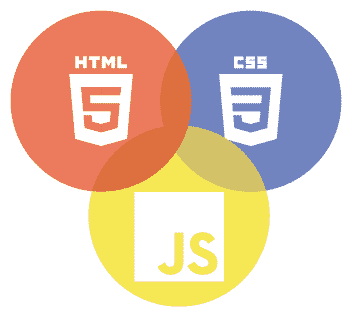
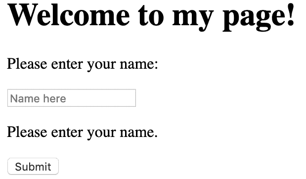
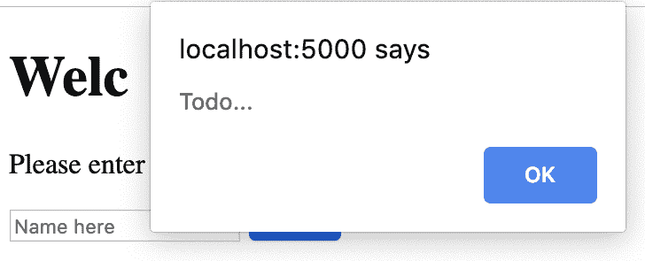

# 一、JavaScript 的主流编程入口

JavaScript 可以同时运行客户端和服务器端，这意味着使用 JavaScript 和 Python 的用例是不同的。 从一开始，JavaScript 凭借着它的特点、优势和局限性，现在已经成为我们所知的交互式 web 的主要支柱之一，从支持丰富的前端交互到 web 服务器。 它是如何成为最重要的无处不在的网络技术之一的? 为了掌握 JavaScript 在前端和后端都添加功能的强大能力，我们首先需要了解什么是前端，什么不是。 理解 JavaScript 的起源有助于澄清 JavaScript 的“为什么”，所以让我们看一看。

本章将涵盖以下主题:

*   **国家超级计算应用中心**(**NCSA**)与交互性的需求
*   早期的网络浏览器和 10 天的原型
*   进入 Ecma 国际
*   HTML、CSS 和 javascript——前端最好的朋友
*   JavaScript 如何融入前端生态系统

# 技术要求

你可以在 GitHub 上的[https://github.com/PacktPublishing/Hands-on-JavaScript-for-Python-Developers](https://github.com/PacktPublishing/Hands-on-JavaScript-for-Python-Developers)找到本章的代码文件。

# NCSA 和对互动性的需求

与我们在 21 世纪拥有的丰富媒体相比，早期的互联网是一个相当乏味的地方。 没有图形浏览器，只有相当初级(和深奥的)命令，早期采访者只能在一段时间内完成某些学术任务。 **ARPANET**(Advanced Research Projects Agency Network)是最早的分组交换网络之一，旨在促进基本通信和文件传输。 此外，它是第一个实现**传输控制协议/互联网协议**(**TCP/IP**)套件的网络，我们现在认为它是理所当然的，因为它运行在所有现代 web 应用的幕后。

为什么这很重要? 早期的互联网是为基本和简单的目的而设计的，但从那时起它已经发展起来了。 作为一个 Python 开发人员，你已经了解了现代 web 的力量，所以不需要完整的 web 历史。 让我们跳到我们现在所知的前端的起源。

1990 年 Tim Berners-Lee 发明了万维网。 他自己建立了第一个网络浏览器，并与欧洲核子研究组织(即**CERN**)一起创建了第一个网站，闸门打开了，世界从此不同了。 随着全球数以百万计的人依赖网络，一开始只是学术上的修修补补，现在已经成为全球的必需品。 不用说，在 21 世纪的今天，我们使用网络和多种形式的数字通信来进行我们的日常生活。

Berners-Lee 创建的项目之一是**HTML**-**超文本标记语言**。 作为网站的支柱，这种基本标记语言在计算社区中产生了显著的增长和发展。 仅仅过了几年(准确地说是 1993 年)Mosaic，我们现在称之为浏览器的第一个版本，就发布了。 它是由伊利诺伊大学厄巴纳-香槟分校(University of Illinois at Urbana-Champaign)的 NCSA 开发的，是互联网发展的重要组成部分。

# 早期的网络浏览器和 10 天的原型

因此,JavaScript 的原因吗? 显然，网络需要的不仅仅是静态数据，因此，1995 年，网景通信公司的布兰登·艾希出现了。 最初，这个想法并不是要创造一种全新的语言，而是要将 Scheme 与 Netscape 合并。 这个想法被 Sun Microsystems 用 Java 所做的工作所取代。 大家认为 Eich 正在创建的这种语言有点像 java，而不是 Scheme。 这个想法来自网景通讯公司的创始人马克·安德森。 他觉得有必要用一种语言把 HTML 和一种“粘合语言”结合起来，这种语言可以帮助处理图像、插件和交互性。

Eich 在 10 天内创建了一个 JavaScript 原型(最初称为 Mocha，后来称为 LiveScript)。 很难相信一个 10 天的原型已经成为网络的重要组成部分，但这些都是历史记录的事实。 当 Netscape 开发出可生产的版本后，JavaScript 于 1995 年随 Netscape Navigator 一起发布。 JavaScript 发布后不久，微软就创建了自己的 JavaScript 版本，简称为 JScript。 JScript 在 1996 年随微软的 Internet Explorer 3.0 一起发布。

现在，有两种技术在争夺同一个领域。 JScript 是逆向工程从网景的 JavaScript,但由于两种语言都有自己的怪癖,浏览器战争开始时,导致网站经常有一个标签“最佳从 Netscape Navigator”或“最佳在 Internet Explorer 中查看”,由于技术复杂性参与支持这两种技术在一个站点。 这预示着未来的事情，早期版本的差异只会增加。 有些网站在一种浏览器上可以完美运行，而在另一种浏览器上却崩溃得可怕——更不用说 Netscape 和微软浏览器的其他竞争对手带来的复杂性了! 早期的开发人员还发现，这两种技术之间的差异只会加剧军备竞赛。 如果您经历过这样的性能下降(或者，更糟糕的是，您在早期使用 JavaScript，就像我一样)，那么您肯定会感受到竞争版本的痛苦。 每家公司，以及其他第三方，都在竞相创造下一个最好的 JavaScript 版本。 在其核心，JavaScript 必须在客户端进行解释，浏览器之间的差异导致了混乱。 必须做点什么，网景有了一个解决方案，尽管它不是完美的。

我们将在下一节中学习这个解决方案。

# 进入 Ecma 国际

**欧洲计算机制造商协会**(**ECMA**)于 1994 年更名为 ECMA International，以反映其精炼的目的。 作为一个标准组织，它的目的是促进各种技术的现代化和一致性。 部分是为了响应微软的工作，网景在 1996 年与 Ecma 国际公司进行了合作，要求将该语言标准化。

JavaScript 被记录在 ECMA-262 规范中。 您可能见过术语**ECMAScript**或“基于 ECMAScript 的语言”。 除了 JavaScript，还有更多的 ECMAScript 语言! ActionScript 是另一种基于 ecmascript 的语言，它遵循与 JavaScript 类似的约定。 随着 Flash 作为一种网络技术的衰落，ActionScript 在实践中已经很少出现了，除了一些零散的应用，但事实仍然是:Ecma International 创建了一些标准，这些标准被用于创建不同的技术，这一度帮助缓解了浏览器之战。

关于 JavaScript, Ecma International 最有趣的部分可能是已经编码的各种版本。 到目前为止，有 9 个版本，各有不同。 在本书中，我们将使用 ECMAScript 2015(也称为 ES6)，因为它是当今 web 开发工作中最稳定的基线。 2016-2018 版本的功能可以被一些浏览器使用，并将被介绍。

# HTML, CSS 和 JavaScript -前端最好的朋友

支撑每个现代网站或 web 应用的至少有三种技术:HTML，**层叠样式表**(**CSS**)和 JavaScript。 它们是前端的“最好的朋友”，如下截图所示:



Figure 1.1 - The best friends: HTML, CSS, and JavaScript

这三种技术的交叉点就是我们现代网站的生存之处。 让我们在下面几节中看看这些。

## HTML，被忽视的英雄

当我们想到网络时，网站的基本结构——如果你愿意，也可以称之为骨架——就是 HTML。 然而，由于其(有目的的)简单性，它经常被忽视为一种简单的技术。 思考网站的一种方式是思考主体:HTML 是框架; CSS 是皮肤; 我们的朋友 JavaScript 就是肌肉。

HTML 的历史与网络本身密不可分，因为随着网络自身的发展，它会随着先进的规范、特性和语法而不断发展。 但是什么是 HTML 呢? 它不是一种成熟的编程语言:它不能进行逻辑操作或操作数据。 然而，作为一种标记语言，它对我们使用网络非常重要。 我们不会花太多时间讨论 HTML，但一些基础知识会让我们走上正确的轨道。

HTML 规范由**World Wide Web Consortium**(**W3C**)控制，当前版本为 HTML5。 HTML 的语法由称为标签的元素组成，这些元素具有特定的定义，并由尖括号包围。 在 JavaScript 中使用时，这些标记描述了 JavaScript 可以读取和操作的数据节点。

为什么 HTML 在 JavaScript 中对我们很重要? JavaScript 可以使用浏览器内部的**Application Programming Interface**(**API**)称为**Document Object Model**(**DOM**)触及 HTML。 DOM 是页面上所有 HTML 的编程表示，它规定了 JavaScript 如何操作呈现页面上的元素。 与 Python 不同，JavaScript 可以对用户输入做出响应，而无需与服务器通信; 它的执行逻辑可以发生在前端。 想想当你在网站上输入信息的时候。 有时，会有必需的字段，如果您试图提交表单，JavaScript 可以停止向服务器提交，并给出可视化提示(如必需框上的红色大纲和警告消息)，并向用户传递信息缺失的信息。 这是一个使用 DOM 进行交互的 JavaScript 示例。 我们将在随后的[第七章](07.html)、*事件、事件驱动设计和 api*中进一步深入。

以下是一个简单的 HTML5 模板示例:

```js
<!doctype html>

<html lang="en">
<head>
  <meta charset="utf-8">

  <title>My Page</title>

</head>

<body>
  <h1>Welcome to my page!</h1>
  <p>Here’s where you can learn all about me</p>
</body>
</html>
```

它本身是相当易读的:包含在标签标题`title`是一个字符串，包含一个简单的页面标题。 在`meta`标签中，除了标签名之外，我们还有一个元素:`charset`*属性*。 HTML5 还引入了*语义*标签，不仅为页面提供了视觉结构，还描述了标签的用途。 例如，`nav`和`footer`用来表示页面上的导航和页脚部分。 如果您想在我们的过程中尝试 HTML、CSS 和 JavaScript，您可以使用 Codepen 这样的工具。 io 或 JSFiddle.net。 因为到目前为止我们只处理客户端工作，所以您不需要在计算机上使用编译器或任何其他软件。 您还可以在本地使用您最喜欢的文本编辑器，然后在浏览器中加载 HTML。

另外一组对我们的 JavaScript 需求很重要的属性是`class`和`id`。 这些属性为 JavaScript 访问 HTML 提供了一个有效的渠道。 让我们看一下下面的代码块，它是一个更详细的 HTML 示例:

```js
<!doctype html>

<html lang="en">
<head>
  <meta charset="utf-8">

  <title>My Page</title>

</head>

<body>
  <h1 id="header">Welcome to my page!</h1>
  <label for="name">Please enter your name:</label>
  <form>
    <input type="text" placeholder="Name here" name="name" id="name" />
    <p class="error hidden" id="error">Please enter your name.</p>
    <button type="submit" id="submit">Submit</button>
  </form>
</body>
</html>
```

它的输出将给我们一个非常简单的页面，如下所示:



Figure 1.2 - A simple HTML page

非常基本的,对吧? 为什么重复“请输入您的名字”? 如果你注意到页面上的第二个`p`标签，其中一个类是`hidden`。 然而，我们仍然可以看到它。 我们需要 CSS 来帮助我们。

## CSS

如果 HTML 是我们页面的骨架结构，那么 CSS 就是它的*皮肤*，给它一个外观和感觉。 在前端使用 JavaScript 本质上也考虑到了 CSS。 在我们网站表单的例子中，红色的轮廓和警告信息通常是通过切换 CSS 类触发的。 下面是一个简短的 CSS 示例:

```js
.error {
  color: red;
  font-weight: bold;
}
```

在这个例子中，我们有一个 CSS 声明(类的`error`，在它的名字之前用句点表示为类)，花括号中有两个用于字体颜色和字体权重的 CSS 规则。 现在，完全精通 CSS 结构和规则并不重要，但作为前端的 JavaScript 开发人员，您可能会与 CSS 进行交互。 例如，切换我们的`error`类，使表单中的文本变成红色和粗体，这是 JavaScript 可以向用户触发消息的一种方式，通知他们表单提交有问题。

让我们将前面的 CSS 添加到前面的 HTML 工作中。 我们可以从以下变化中看到这一结果:


Figure 1.3 - Adding a bit of CSS

现在，我们可以看到红色和粗体的规则被反映出来了，但是我们仍然可以看到段落。 接下来的两个 CSS 规则如下:

```js
.hidden {
  display: none;
}

.show {
  display: block;
}
```

这更接近我们预期的结果。 但是为什么要用 CSS 来隐藏一个段落呢?

## JavaScript

输入我们的朋友，JavaScript。 如果 JavaScript 将成为身体的肌肉，那么它将负责操纵骨骼(HTML)和皮肤(CSS)。 我们人类的肌肉不能改变我们的外貌，但它们可以让我们处于不同的位置，扩张和收缩我们有弹性的皮肤，操纵我们骨骼的位置。 使用 JavaScript，可以重新安排页面上的内容、更改颜色、创建动画等等。 我们将深入探讨 JavaScript 如何与 HTML 和 CSS 交互，毕竟，JavaScript 就是我们现在在这里阅读这本书的原因!

关于 JavaScript 和 Python 最值得注意的一点是，为了更改页面，Python 程序必须从服务器响应客户端的输入，然后浏览器将重新呈现 HTML。 JavaScript 通过在浏览器中执行来避免这种情况。

例如，在前面显示的页面中，如果用户试图在不输入名称的情况下提交表单，JavaScript 可以删除`hidden`类并添加`show`类，此时会显示错误消息。 这是一个非常简单的示例，但它强调了 JavaScript 可以在浏览器*中执行更改，而无需*回调服务器。 让我们把碎片拼在一起。

HTML 如下所示:

```js
<!doctype html>

<html lang="en">
<head>
  <meta charset="utf-8">

  <title>My Page</title>

</head>

<body>
  <h1 id="header">Welcome to my page!</h1>
  <form>
    <label for="name">Please enter your name:</label>
    <input type="text" placeholder="Name here" name="name" id="name" />
    <p class="error hidden" id="error">Please enter your name.</p>
    <button type="submit" id="submit">Submit</button>
 </form>
</body>
</html>
```

CSS 的示例如下:

```js
.error {
  color: red;
  font-weight: bold;
}

.hidden {
  display: none;
}

.show {
  display: block;
}
```

现在，让我们编写一些 JavaScript。 这可能还没有意义，但如果你在一个编辑器，如 JSFiddle，尝试将以下 JavaScript 放在 JS 窗格中，并点击运行:

```js
document.getElementById('submit').onclick = e => {
  e.preventDefault()
  if (document.getElementById('name').value === '') {
    document.getElementById('error').classList.toggle('hidden')
    document.getElementById('error').classList.toggle('show')
  }
}
```

现在，如果您运行此命令并单击 Submit，而不向框中输入任何数据，则会显示错误消息。 到目前为止非常简单，但是祝贺你! 你刚刚写了一些 JavaScript! 现在，我们如何用 Python 来做这个呢? 我们必须将表单提交到后台，评估所提供的输入，并使用错误消息重新呈现页面。

相反，欢迎使用*前端*。

# JavaScript 如何融入前端生态系统

可以想象，JavaScript 不仅仅是隐藏和显示元素。 一个强大的应用不仅仅是一组脚本标记——javascript 适合于整个生命周期和生态系统，创建丰富的用户体验。 我们将深入**单页面应用**(**水疗)使用反应[第八章](08.html),*使用框架和库,所以,现在,让我们创造了条件。***

 *如果您不熟悉 SPA 这个术语，请不要担心—您至少已经使用过一些术语，但没有意识到它们是什么。 也许您使用谷歌的 Gmail 服务。 如果有，稍微浏览一下，就会发现页面并没有进行硬刷新以从服务器获取信息。 相反，它与服务器进行异步通信并动态呈现内容。 可能会有一段时间等待内容从服务器加载，通常会充满一个旋转的小图标。 这种从服务器异步加载内容并发回数据的底层范例的名称叫做**Ajax**。

Ajax 是**异步 JavaScript 和 XML**的缩写，它只是客户端使用的技术和技术的集合，通过允许数据在后台获取和发送来简化用户体验。 稍后我们将讨论使用 Ajax 从前端调用 api，但现在，让我们尝试一个小示例。

## 第一个 Ajax 应用

首先，我们将使用 Flask 创建一个非常简单的 Python 脚本。 如果你还不熟悉弗拉斯克，别担心——我们在这里就不详细讲了。

下面是一个`app.py`脚本的例子:

```js
from flask import Flask
import os

app = Flask(__name__, static_folder=os.getcwd())

@app.route('/')
def root():
    return app.send_static_file('index.html')

@app.route('/data')
def query():
    return 'Todo...'
```

这是我们的 HTML 与 JavaScript(`index.html`):

```js
<!doctype html>

<html lang="en">
<head>
  <meta charset="utf-8">

  <title>My Page</title>

</head>

<body>
 <h1 id="header">Welcome to my page!</h1>
 <form>
   <label for="name">Please enter your name:</label>
   <input type="text" placeholder="Name here" name="name" id="name" />
   <button type="submit" id="submit">Submit</button>
 </form>
 <script>
   document.getElementById('submit').onclick = event => {
     event.preventDefault()
     fetch('/data')
       .then(res => res.text())
       .then(response => alert(response))
       .catch(err => console.error(err))
   }
 </script>
</body>
</html>
```

在我们分解它之前，让我们试着运行它，通过执行以下代码:

```js
$ pip install flask
$ export FLASK_APP=my_application
$ export FLASK_DEBUG=1
$ flask run
```

我们应该看到如下画面:


Figure 1.4 - A basic Flask page

让我们点击 Submit，下面的屏幕会出现:



Figure 1.5 - Wiring Python to JavaScript!

我们成功地显示了文本 Todo…从 Python 在 JavaScript! 让我们快速看一下我们是怎么做的。

我们的基本路由(`/`路由)将服务于我们的静态`index.html`文件。 很好，现在我们可以看到 HTML 了。 那么第二条路线`/data`呢? 它只会返回文本。 到目前为止，它与任何基本的 Flask 应用没有太大的不同。

现在，让我们看看我们的 JavaScript。 首先要注意一件事:在我们的 HTML 文件中，我们可以用`<script>`标签包装 JavaScript。 在将 JavaScript 存储在带有自己的脚本标记的单独文件中(我们将对此进行讨论)时，为了小型、快速和非生产调试的目的，直接在 HTML 中包含代码是很方便的。 有时您会直接在 HTML 文件中插入代码，但这种情况并不经常发生。 现在，我们将打破我们的最佳实践，使用以下代码片段:

```js
document.getElementById('submit').onclick = event => {
```

嗯。 这句神秘的台词是什么? 它是 ES6 箭头函数的开头。 我们将在后面更深入地研究函数，但现在，让我们看看我们可以从这一行中收集到什么，如下所示:

*   `document.getElementById('submit')`:通过查看我们的 HTML，我们可以看到有一个带有 ID 属性的元素`'submit'`:按钮。 首先，我们在寻找我们的按钮。
*   `.onclick`:这是一个动作动词。 如果您猜测该函数的设计目的是在用户单击按钮时执行操作，那么您猜对了。

至于函数的其余内容，我们可以猜测我们正在用一个事件做一些事情——一些关于获取数据的事情，然后用它做一些事情。 那是什么东西?

`alert(response)`就是我们用它做的! 一个`alert`只是你在浏览器中看到的那些烦人的小弹出消息之一，并且，通过来自 Flask 的数据，我们将其显示在其中一个! 再一次，不完全*实用*，但希望你能看到我们要去的地方:前端并不存在于真空中——我们可以在客户端和服务器端之间来回通信，两边只需要几行代码。

在讨论 api 时，我们将更详细地了解`fetch`函数，但现在，让我们花点时间看看到目前为止我们在这个练习中做了什么，如下所示:

1.  我们使用 Python 和 Flask 创建了一个小型的 web 应用来提供一个简单的 HTML 页面。
2.  这个应用还有一个端点，它提供一个非常简单的消息作为输出:Todo....
3.  使用 JavaScript，我们在用户单击 Submit 按钮时采取操作。
4.  单击 Submit 按钮后，JavaScript 与 Python 应用通信以请求数据。
5.  返回的数据将在警报窗口中显示给用户。

这是它! 我们进行了第一次成功的 Ajax 调用。

### JavaScript 在实践中

现在，我们已经看到了如何将 JavaScript 与 Python 一起使用的实际示例，让我们讨论它在前端领域的使用。 剧透警告:我们将在服务器端使用 JavaScript，从下一章开始。 在我们的 Ajax 示例中，我们遇到了一些晦涩的命令，因此，虽然很容易忽略 JavaScript 的使用和需求，但我们看到它是一种具有实际应用的实际语言。

JavaScript 的部分魅力在于它在浏览器中几乎被普遍采用。 随着时间的推移，JavaScript 语法和特性已经慢慢演变，但对不同特性的支持(曾经在不同浏览器之间存在巨大差异)现在正在标准化。 然而，仍然存在一些差异，但 web 上有一些有用的工具，它们在浏览器可能支持或不支持的各种特性上保持最新。 其中一个网站是[caniuse.com](https://caniuse.com)，如下截图所示:


Figure 1.6: Screenshot of caniuse.com showing the selection for scroll methods on elements

在这个站点中，JavaScript 的各种方法和属性被各种流行的浏览器分解成一个矩阵，以显示每个浏览器都支持(和不支持)哪些方法和属性。 但是，一般情况下，您不需要太担心代码是否能在给定的浏览器上运行，除非您正在使用尖端功能。

现在，我们已经展示了一个使用 Flask 与 Python 交互作为后端的 JavaScript 示例，但实际上我们可以使用任何后端系统，只要它准备接受入站 HTTP 流量。 Python、PHP、Ruby、java——只要后端希望与前端一起工作，这些都是可能的。

关于 jQuery 等库的注意事项:在本书中我们不会使用 jQuery。 虽然它对一些方法的快捷方式和简化很有用，但它的主要吸引力之一(至少对像我这样的许多开发人员来说)是它在浏览器之间底层标准化的 JavaScript。 还记得我们打的 Ajax`fetch`电话吗? 以前的情况是，Ajax 调用必须用两种不同的方式编写，每种主要类型的 JavaScript 解释器使用一种方式。 然而，浏览器标准化已经缓解了大多数跨浏览器的噩梦。 jQuery 仍然提供了许多有用的工具，特别是对于**用户界面**(**UI**)，比如插件，这些插件使得从零开始编写组件变得不必要。 是否使用 jQuery 或类似的库取决于您自己，也取决于项目的需求。 我们*将*讨论的 React 等库，其设计目的是为了满足与 jQuery 等库截然不同的需求。

# 总结

JavaScript 在现代网络中占有重要地位。 从 NCSA 的简单开始，它现在是现代 web 应用的一个组成部分，无论是 UI, Ajax，还是其他需求。 它有官方的规范，并在不断发展，使 JavaScript 的工作变得更加令人兴奋。 与 HTML 和 CSS 协同工作，它可以做更多的事情，而不仅仅是简单的交互，它可以轻松地与(几乎)任何后端系统通信。 它的目的不仅仅是为我们提供静态页面——我们希望页面能够正常工作。 如果您继续编写代码，我们将创建一个简单的 Ajax 应用，虽然现在这些命令可能对您来说毫无意义，但您可以看到 JavaScript 是相当清晰的。 稍后我们将深入研究 JavaScript 的语法和构造。

我们还没有花时间讨论 JavaScript 的后端使用，但是不要担心——这是接下来的内容。

# 问题

试着回答下面的问题来测试一下你的知识:

1.  哪个国际组织维护 JavaScript 的官方规范?
    1.  W3C
    2.  Ecma 国际
    3.  网景
    4.  太阳
2.  哪些后端可以与 JavaScript 通信?
    1.  PHP
    2.  Python
    3.  Java
    4.  以上所有
3.  谁是 JavaScript 的最初作者?
    1.  蒂姆•伯纳斯-李
    2.  布兰登服从指令
    3.  Linus Torvalds
    4.  比尔盖茨

4.  什么是 DOM?
    1.  JavaScript 在内存中对 HTML 的表示
    2.  允许 JavaScript 修改页面的 API
    3.  以上两者
    4.  以上都不是
5.  Ajax 的主要用途是什么?
    1.  与 DOM 通信
    2.  操纵 DOM
    3.  监听用户输入
    4.  与后端通信

# 进一步的阅读

这里有一些资源供你细读:

*   Thoriq Firdaus, Ben Frain 和 Benjamin LaGrone。 *HTML5 和 CSS3:构建响应式网站。* 伯明翰:pack Publishing, 2016。
*   浏览器大战:[https://en.wikipedia.org/wiki/Browser_wars](https://en.wikipedia.org/wiki/Browser_wars)
*   W3C:[https://www.w3.org/](https://www.w3.org/)*