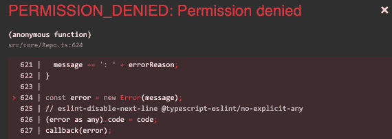
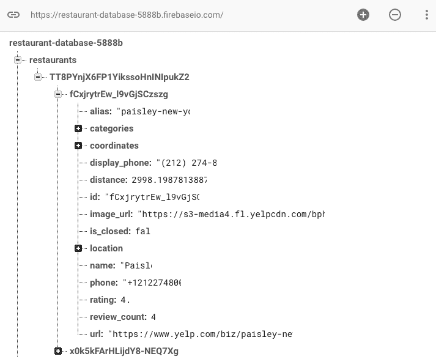

# 十七、安全和密钥

安全不是一件简单的事情。 在设计应用时，从一开始就记住安全性是很重要的。 例如，如果您不小心将密钥提交到存储库，则必须使用一些技巧将其从存储库的历史记录中删除，或者更有可能的是，必须撤销那些凭证并生成新的凭证。

我们不能让我们的数据库凭据在我们的前端 JavaScript 中对世界可见，但前端有办法处理数据库。 第一步是实现适当的安全性，并理解在前端和后端可以将凭据放在哪里。

本章将涵盖以下主题:

*   身份验证和授权
*   使用重火力点
*   `.gitignore`和用于凭证的环境变量

# 技术要求

准备使用存储库的`Chapter-17`目录中提供的代码:[https://github.com/PacktPublishing/Hands-on-JavaScript-for-Python-Developers/tree/master/chapter-17](https://github.com/PacktPublishing/Hands-on-JavaScript-for-Python-Developers/tree/master/chapter-17)。 由于我们将使用命令行工具，还需要您的终端或命令行 shell。 我们需要一个现代化的浏览器和本地代码编辑器。

# 身份验证和授权

当我们开始探索 JavaScript 的安全性时，理解**认证**和**授权**之间的重要区别是很重要的。 简而言之，*身份验证*是一个系统确认并承认你是你所说的那个人的过程。 想想去商店买瓶酒。 您可能会被要求提供身份证明，以证明您已达到或超过您所在地区的合法消费年龄。 店员*认证*你与你的照片的身份证说【显示】是的,你**因为我,店员,匹配你的脸的照片身份证第二种情况是当你乘坐航空公司。 当你通过安检时，他们也会因为同样的原因检查你的身份证:你是你说的那个人吗?**

 **然而，这两个用例以*授权*结束。 授权:*我知道你就是你所说的*。 现在，你可以做你想做的事吗? 以葡萄酒为例，如果你在美国超过 21 岁，在世界上大多数地方超过 18 岁，你*被授权*饮用酒精饮料。 现在，机场的安全人员并不真正关心你的年龄，因为任何真正的原因; 他们只关心你是不是你所说的那个人，你是否有一张即将登机的有效机票。 然后您被授权进入机场的安全区域并登机。

让我们进一步以航空公司为例。 在当今这个旅行安全性增强的时代，身份验证和授权过程既不始于安全代理，也不结束于安全代理。 如果你在网上预订商业机票，这个过程看起来更像这样:


Figure 17.1 – Airline website authentication and authorization

当您使用航空公司网站时，您可能已经拥有一个帐号并获得*授权*进行登录，或者您已经登录并获得*授权*进行搜索航班。 如果您已登出，您必须通过*认证*才能搜索航班。 预订航班时，你可能需要具备某些细节，比如签证，以便获得授权预订航班。 你也可能因为去某个国家旅行而被列入观察名单或黑名单，所以你的旅行可能还没开始就结束了。 有很多步骤，但很多都是在幕后进行的; 例如，您可能不知道当您输入姓名预订机票时，您的姓名已根据全局记录进行搜索，以查看您是否被授权飞行。 你的签证号码可能已经被交叉参照，以确定你是否被授权飞往那个国家。

就像你需要通过身份验证和授权才能飞行一样，你的 web 应用也应该设计成允许身份验证和授权。 考虑我们的餐厅查找应用，从[第 15 章](15.html)，*结合 Node.js 和 Frontend*，允许我们搜索和保存不同的餐厅在 Firebase:


Figure 17.2 – Our restaurant app

如果你还记得，我们在 Real-Time Database 部分使用*open permissions*启动了我们的 Firebase 应用:


Figure 17.3 – Our Firebase security rules

这显然不是一个好主意*生产网站。 因此，为了缓解这个问题，让我们返回到 Firebase 并设置一些身份验证和授权!*

 *# 使用重火力点

为了方便使用，我在 GitHub 存储库的`Chapter-17`目录中复制了我们的餐厅查找程序。 不要忘记在第 15 章、*的`.env`文件中包含您自己的环境变量。 在我们继续之前，花点时间把这个设置好并开始工作。*

我们需要做的下一件事是转到 Firebase 并将其配置为使用身份验证。 在 Firebase 控制台中，访问 Authentication 部分并设置登录方法; 例如，您可以设置谷歌身份验证。 这里有一列您可以使用的方法，所以继续添加一个或多个方法。

接下来，我们将在 Real-Time Database 部分设置规则，如下所示:

```js
{
  "rules": {
    "restaurants": {
      "$uid": {
        ".write": "auth != null && auth.uid == $uid",
        ".read": "auth != null && auth.uid == $uid"
      }
    }
  }
}
```

这里我们要说的是,用户可以从`restaurants/<user id>`部分读写数据库的身份验证数据没有`null`如果用户 ID 匹配数据库中的用户 ID 的位置你正试图读写。

既然我们的规则已经确立，让我们试着拯救一家餐厅:

1.  在根目录下执行`npm start`启动应用，并访问`http://localhost:3000`。
2.  找一家餐馆。
3.  试图拯救餐馆。
4.  见证一次史诗般的失败。

你应该看到的是一个错误屏幕，看起来像这样:



Figure 17.4 – Error, error!

此外，如果我们去我们的开发工具，并检查网络选项卡的 WS 选项卡(**WS**为**WebSockets**，这是 Firebase 通信的方式)，我们可能会看到如下内容:


Figure 17.5 – WebSockets communication inspector

太棒了! 现在我们已经证明了我们的 Firebase 规则是有效的，并且不允许保存到`/restaurants/<user_id>`，因为我们没有经过身份验证。 是时候设置了。

我们要做的第一件事是稍微改变一下我们的`App.js`脚本。 在编写 React 时有一些不同的约定，我们将继续使用基于类的方法。 下面是我们的`App.js`脚本的样子:

```js
import React from 'react'
import cookie from "react-cookies"

import Finder from './components/finder/Finder'
import SignIn from './components/signIn/SignIn'

import './App.css'

export default class App extends React.Component {
 constructor() {
   super()

   this.state = {
     user: cookie.load("username")
   }

   this.setUser = this.setUser.bind(this)
 }

 setUser(user) {
   this.setState({
     user: user
   })

   cookie.save("username", user)
 }

 render() {
   const { user } = this.state
   return (
     <div className="App">
       { (user) ? <Finder user={user} /> : <SignIn setUser={this.setUser}
     /> }
     </div>
   )
 }
}
```

首先要注意的是，我们包含了一个新的`npm`模块:`react-cookies`。 虽然 cookie 很容易从浏览器读取，但有一些模块可以让它变得更容易一些。 当我们检索用户 ID 时，我们将它存储在 cookie 中，以便浏览器记住用户是经过身份验证的。

我们为什么要用饼干? 如果你还记得，网络本质上是*无状态的*，所以 cookie 是一种将信息从应用的一部分传送到另一部分，或从会话传送到会话的方式。 这是一个基本的例子，但重要的是记住不要在 cookie 中存储任何敏感信息; 一个令牌或用户名可能是您最希望在身份验证工作流中放入的令牌或用户名。

我们还引入了一个新组件，`SignIn`，如果用户变量不存在(即用户没有登录)，则会有条件地呈现该组件。 让我们看看这个组件:

```js
import React from 'react'
import { Button } from 'react-bootstrap'
import * as firebase from 'firebase'

const provider = new firebase.auth.GoogleAuthProvider()

export default class SignIn extends React.Component {
 constructor() {
   super()

   this.login = this.login.bind(this)
 }

 login() {
   const self = this

   firebase.auth().signInWithPopup(provider).then(function (result) {
     // This gives you a Google Access Token. You can use it to access the
     // Google API.
     var token = result.credential.accessToken;
     // The signed-in user info.
     self.props.setUser(result.user);
     // ...
   }).catch(function (error) {
     // Handle Errors here.
     var errorCode = error.code;
     var errorMessage = error.message;
     // The email of the user's account used.
     var email = error.email;
     // The firebase.auth.AuthCredential type that was used.
     var credential = error.credential;
     // ...
   });
 }
 render() {
   return <Button onClick={this.login}>Sign In</Button>
 }
}
```

这里有两点需要注意:

*   我们使用`GoogleAuthProvider`作为`SignIn`机制。 如果在设置 Firebase 时选择了不同的身份验证方法，则此提供程序可能不同，但其余代码应该相同或类似。
*   `signInWithPopup`方法几乎直接从 Firebase 文档中复制。 这里所做的唯一更改是创建`self`变量，以便我们可以在另一个方法中维护`this`的作用域。

渲染时，如果用户还没有登录，它将是一个简单的按钮，说明**Sign In**。 它将激活一个弹出窗口，以您的谷歌帐户登录，然后继续之前的操作。 没那么可怕，对吧?

接下来，我们需要处理我们的用户。 你注意到在`App.js`中我们将`user`道具传递给 Finder 了吗? 这将使我们在基本应用中传递一个引用给我们的用户变得容易，如下`Finder.jsx`所示:

```js
getRestaurants() {
   const { user } = this.props

   Database.ref(`/restaurants/${user.uid}`).on('value', (snapshot) => {
     const restaurants = []

     const data = snapshot.val()

     for(let restaurant in data) {
       restaurants.push(data[restaurant])
     }
     this.setState({
       restaurants: restaurants
     })
   })
 }
```

这是这个实例中唯一改变的方法，如果你仔细观察，这个改变是将`user`从`this.props`分解，并在我们的数据库引用中使用它。 如果你还记得我们的安全规则，我们不得不稍微改变我们的数据库结构，以适应我们的认证用户的简单*授权*:

```js
{
  "rules": {
    "restaurants": {
      "$uid": {
        ".write": "auth != null && auth.uid == $uid",
        ".read": "auth != null && auth.uid == $uid"
      }
    }
  }
}
```

我们在安全规则中声明的是，格式为`restaurants.$uid`的节点将存储每个用户的餐厅。 我们的 Firebase 结构现在看起来像这样:



Figure 17.6 – An example of how our Firebase structure could look

在这个结构中，我们看到`restaurants`内的`TT8PYnjX6FP1YikssoHnINIpukZ2`节点。 这是认证用户的**uid**(**用户 ID**)，在该节点中，我们找到用户保存的餐厅。

这个数据库结构很简单，但是提供了简单的授权。 我们的规则规定“只允许用户在他们自己的节点内查看和修改数据，仅此而已。”

我们之前已经讨论了一些`.env`变量，所以让我们更深入地了解一下它们。 我们将把我们的应用部署到 Heroku 上，创建一个公开可见的网站。

# .gitignore 和凭据的环境变量

当我们使用`.env`文件时，我已经注意到这些文件*永远不应该*提交到存储库中。 事实上，一个好的做法是在创建任何敏感文件之前向您的`.gitignore`文件添加一个条目，以确保您不会意外地提交凭据。 即使稍后将其从存储库中删除，也会维护文件历史记录，并且必须使这些键失效(或*循环*)，这样它们就不会暴露在历史记录中。

虽然 Git 的完整部分超出了我们的工作范围，但让我们看一个`.gitignore`文件的例子:

```js
# See https://help.github.com/articles/ignoring-files/ for more about ignoring files.

# dependencies
/node_modules
/.pnp
.pnp.js

# testing
/coverage

# production
/build

# misc
.DS_Store
.env*

npm-debug.log*
yarn-debug.log*
yarn-error.log*
```

其中有几个条目是由`create-react-app`脚手架创建的。 特别注意`.env*`。 星号(或*星号*，或*splat*)是正则表达式通配符，用于指定以`.env`开头的文件将被忽略。 你可以有`.env.prod`，它将被忽略。 **请务必忽略您的凭证文件!**

我还喜欢将`/node_modules`改为`*node_modules*`，以防你有带有自己节点模块的子目录。

在`.env`文件中存储变量是很方便的，但是也可以在内存中创建环境变量。 为了演示这个功能，我们将把项目部署到 Heroku，一个云应用平台。 让我们开始吧:

1.  在[https://heroku.com](https://heroku.com)创建一个新账户。
2.  按照提供的文档安装 Heroku**命令行接口**(**CLI**)。 一定要遵循登录说明。
3.  在餐厅查找器目录中初始化一个新的存储库:`git init`。
4.  执行`heroku create --ssh-git`。 它将提供你的 Heroku 端点的 Git URL，以及`https://`URL。 继续访问 HTTPS URL。 您应该会看到一条欢迎消息:


Figure 17.7 – Hooray! We have a blank Heroku application!

现在我们可以继续组织应用的逻辑。

## 重组我们的应用

接下来我们要做的是不同于第 15 章，*结合 Node.js 和 Frontend*，是重新组织我们的文件，只是一个触摸。 这并不是完全必要的，但它在前端和后端之间提供了很好的逻辑区分，这在部署生产级代码时特别有用。 在我们之前的应用和我们将要在这里创建的应用之间还有一个额外的语义差异:我们不会提供一个正在运行的 React 开发应用，而是一个静态的生产构建。

如果你还记得的话，我们之前的餐厅结构是这样的:


Figure 17.8 – Proxy versus apps, explained.

我们实际上使用 React 应用作为网络服务器并通过它代理到 Express 后端以便使用 Yelp API。 然而，现在我们将使用 Express 作为主 web 服务器，并为 React 应用的生产级构建提供服务。

我们的应用逻辑之前如下所示:

```js
IF NOT a React page,
 Serve from proxy
ELSE
 Serve React
```

我们将颠覆这种逻辑，并声明如下:

```js
IF NOT an Express route,
 Serve from static build
ELSE
 Serve API
```

下面是该怎么做:

1.  创建一个新的`client`目录。
2.  删除`yarn.lock`文件，如果你还有它。 我们将重点使用 NPM 而不是`yarn`。
3.  将所有文件移动到客户端目录，除了 API 目录。
4.  接下来，我们将在根级创建一个新的`package.json`:`npm install dotenv express yelp-fusion`。

如果你注意到，我们还安装了 Express，这是我们以前没有做过的。 我们将使用它来更容易地路由请求。

在我们的`package.json`中，在*根*级别，添加以下脚本:

```js
"postinstall": "cd client && npm install && npm run build",
"start": "node api/api.js"
```

由于我们正在处理 Heroku，我们也可以从`package.json`中删除`proxy`行，因为所有内容都将运行在同一个服务器上，不需要代理。 现在，我们的`package.json`中的`postinstall`线怎么样? 我们要做的是创建一个应用的*产品就绪*构建。 `create-react-app`为我们提供了免费的`npm run build`脚本功能。 当我们部署到 Heroku 时，它会运行`npm install`，然后`postinstall`，来创建 React 应用的产品版本。

现在我们准备向我们的项目添加一个新的元数据，这样 Heroku 就可以为我们的应用提供服务:**Procfile**。

一个 Procfile 将告诉 Heroku 如何处理我们的代码。 你的概要文件看起来像这样:

```js
web: npm start
```

本质上，它所做的只是告诉 Heroku 从哪里开始程序:运行`npm start`。

我们的目录结构现在应该像这样:

```js
.
├── Procfile
├── api
│   └── api.js
├── client
│   ├── README.md
│   ├── package-lock.json
│   ├── package.json
│   ├── public
│   └── src
├── package-lock.json
└── package.json
```

我们的下一个重要步骤是修改我们的`api.js`文件，如下:

```js
const yelp = require('yelp-fusion');
const express = require('express');
const path = require('path');

const app = express();

require('dotenv').config();

const PORT = process.env.PORT || 3000;

const client = yelp.client(process.env.YELP_API_Key);
```

到目前为止，除了添加了 Express 之外，这看起来和以前很相似。 但看看下一行:

```js
app.use(express.static(path.join(__dirname, '../client/build')));
```

啊哈! 这是我们的秘密武器:这行声明使用`client/build`目录作为静态资产，而不是 Node.js 代码。

继续，我们正在定义 Express 路由来处理格式为`/search`的请求:

```js
app.get('/search', (req, res) => {
 const { lat, lng, value } = req.query

 client.search({
   term: value,
   latitude: lat,
   longitude: lng,
   categories: 'Restaurants'
 }).then(response => {
   res.statusCode = 200;
   res.setHeader('Content-Type', 'application/json');
   res.setHeader('Access-Control-Allow-Origin', '*');

   res.write(response.body);
   res.end();
 })
   .catch(e => {
     console.error('error', e)
   })
});
```

对于我们的秘密酱的下一部分，如果路线是*不*匹配`/search`，将它发送到静态 React 构建:

```js
app.get('*', (req, res) => {
 res.sendFile(path.join(__dirname + '../client/build/index.html'));
});

app.listen(PORT, () => console.log(`Server listening on port ${PORT}`));
```

将所有内容添加到 Git 存储库:`git add`。 现在可以执行`git status`以确保`.env`文件没有包含*文件。*

接下来，提交代码:`git commit -m "Initial commit`。 如果您需要一些关于 Git 的帮助，Heroku 文档提供了参考。 接下来，部署到 Heroku:`git push heroku master`。 这需要一些时间，因为 Heroku 不仅要用 Git 部署代码，还要创建代码的生产构建。

访问构建脚本提供的 URL，希望你会看到一个奇妙的错误消息:


Figure 17.9 – Oh no! An error! Actually it's not a bad thing!

太棒了! 这告诉我们应用正在运行，但是我们没有一些重要的部分:我们的环境变量。 对您的`.env`文件中的每个条目执行`heroku config:set <entry>`(包括根文件和`client`文件)。

刷新页面时，您将看到 Sign In 按钮。 然而，如果你点击它，什么也不会发生。 它可能会生成一个弹出窗口，但不会弹出身份验证窗口。 我们需要返回到 Firebase 控制台添加我们的 Firebase URL 作为一个*授权的*URL。

在 Firebase 控制台中，导航到身份验证部分，并将您的 Heroku URL 输入到授权域部分。 回到你的 Heroku 应用，刷新，瞧! 身份验证面板工作。 如果你选择 save ! ，你甚至会看到你保存下来的餐馆。

没那么糟! Heroku 存储环境变量的方法与我们的`.env`文件没有太大区别，但它为我们处理环境变量而不需要做太多工作。 然而，我们需要配置的最后一块:我们的搜索*不工作*。 如果您查看控制台错误消息，您应该看到一个提示，指示到`localhost:3000`的连接被拒绝。 我们需要采取最后一步来抽象代码，避免使用`localhost`。

在`src/components/search/Search.jsx`中，您可能会认识到这种方法:

```js
search(event) {
   const { lng, lat, val } = this.state

   fetch(`http://localhost:3000/businesses/search?value=${val}&lat=${lat}&lng=${lng}`)
     .then(data => data.json())
     .then(data => this.handleSearchResults(data))
 }
```

好的! 我们硬编码了`fetch`调用`localhost`和我们的代理路径。 让我们把它改成如下:

```js
fetch(`/search?value=${val}&lat=${lat}&lng=${lng}`)
```

提交您的更改并再次推送到 Heroku。 在开发过程中，您还可以使用`heroku local web`生成一个浏览器并测试您的更改，而无需提交和部署。

如果幸运的话，您应该拥有一个功能齐全的前后连接的应用，并且在 Heroku 环境变量中保护凭证! 恭喜你!

# 总结

在本章中，我们学习了身份验证、授权以及两者之间的区别。 记住，通常只做其中一种是不够的:大多数需要凭证的应用需要两者的组合。

Firebase 是一个非常有用的云存储数据库，您可以在现有登录系统中使用它，它不仅可以用作开发资源，还可以扩展到生产级使用。 最后，记住这些要点:因为 JavaScript 是客户端，我们必须以不同于纯粹后端应用的方式保护敏感信息:

1.  身份验证和授权以确定谁可以使用哪些资源。
2.  将我们的敏感数据与公共数据分开。
3.  **永远不要将密钥和敏感数据提交到存储库!**

我们所有人都应该成为优秀的数字公民，但也有坏人存在。 保护你自己和你的代码!

在下一章中，我们将结合 Node.js 和 MongoDB 来持久化我们的数据。 我们将重新访问我们的星际飞船游戏，但这次是持久存储。***