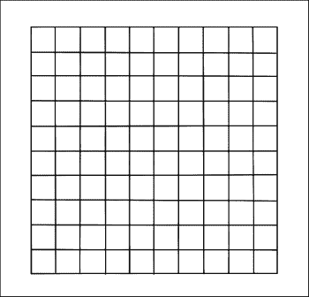
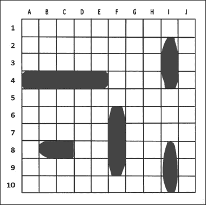
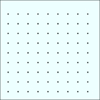
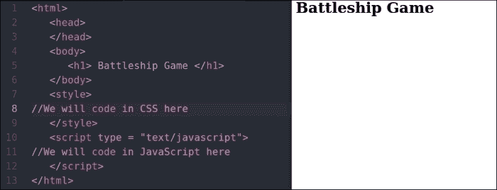
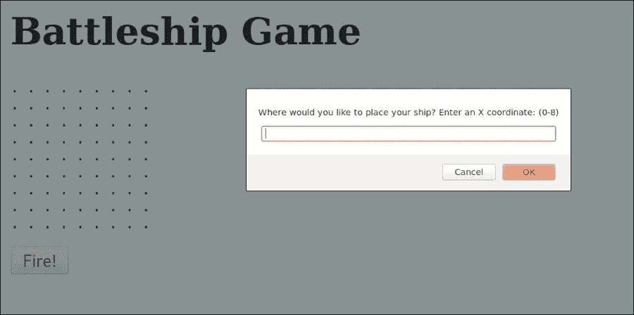
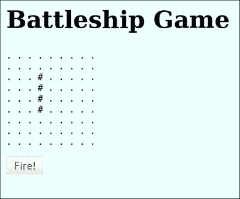
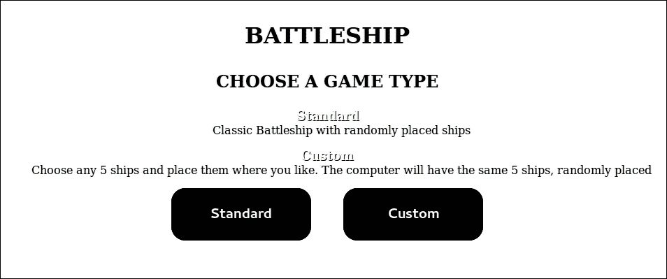
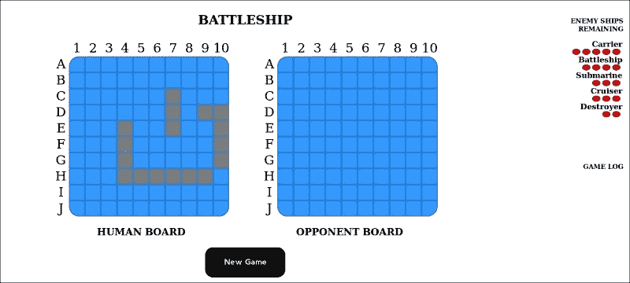
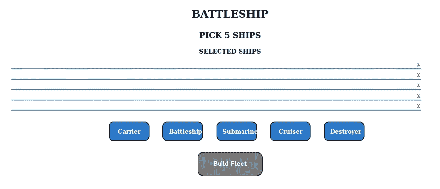

# 五、驶向战场

在本章中，我们将使用 HTML、CSS 和 JavaScript 开发一个完整的游戏。我们将专注于 JavaScript 编码，因此，我们不会关心游戏的图形。我们将编写一个名为**战舰**的游戏。你们很多人以前听说过。这是一个记忆游戏。你的想象力和直觉会帮助你赢得比赛。玩这个游戏有一些变化。

让我们讨论一下游戏的外观。如下图所示，有几个方形几何对象相互连接。行数和列数必须相等:



行和列通常借助数字系统或字母来命名。假设排数为 **1** 、 **2** 、 **3** 、 **4** 、 **5** 、 **6** 、 **7** 、 **8** 、 **9** 、 **10** 。列为**A****B****C****D****E****F****G****H****I****J**。我们可以用数字或字母来命名它们:


这是一个两人游戏。以下是它的规则:

*   两个玩家都将秘密地把他们的船(可以有不同类型的船或水上交通工具)放在他们的矩阵/网格上。
*   玩家可以垂直或水平放置船只；然而，不是对角。
*   玩家必须在开始游戏之前将他们所有的船放在格子上。
*   他们的船不能互相重叠。
*   当所有的船都放置好后，玩家不能将他们的船移出网格。
*   在放置完所有的船之后，第一个玩家会陈述第二个玩家的坐标，如果有一艘船属于第二个玩家，那么这艘船就会爆炸。
*   然后，第二个玩家将陈述第一个玩家的坐标。如果有一艘船属于第一个玩家，它就会爆炸。
*   坐标看起来可能类似于 **A2** 、 **B2** 、 **D5** 等等。第一个字母是网格的 *x* 轴，数字代表网格的 *y* 轴。
*   打爆对手所有船只的玩家将获胜。

下图显示了放置在网格上的几艘船:



现在，我们将进入游戏的编程部分。

我们将坚持以下规则，这样我们的游戏就不会变得难以编码:

1.  将有一艘船属于两个玩家。
2.  这艘船将占据电网的四个部分。
3.  玩家必须在提示下输入 *x* 和 *y* 轴坐标。
4.  网格将是 9 x 9。
5.  玩家必须将`h`或`v`放在船的水平或垂直位置。
6.  To simplify the drawing, we will put dots (**.**) on the position of the grids. The grids will look similar to the following image:

    

7.  我们需要一个**开火**按钮来开始游戏。

# HTML 部分

HTML 部分看起来类似于下面的代码:

```js
<html>
  <head>
  </head>
  <body>
    <h1> Battleship Game </h1>
  </body>
  <style>
// We will code in CSS here
  </style>
  <script type = "text/javascript">
//We will code in JavaScript here
  </script>
</html>
```

代码输出如下图所示:



# CSS 部分

我们在正文的`<style></style>`标签中使用了 CSS 编码。因为我们将只关注 JavaScript 中的编码，所以我们不会为游戏的视觉部分而烦恼。为了使游戏的主体丰富多彩，我们将使用以下代码:

```js
  <style>
    body { 
      background-color: #eff; 
    }
  </style>
```

# JavaScript 部分

这部分是我们游戏的主要部分，我们会最关注这部分。我们将把所有的代码写在`<script></script>`标签中。

对于网格，我们需要一个二维数组。我们将采用一个`game`变量来存储数据，如下所示:

### 注

许多程序可能需要处理具有共同特征的多个数据项。在这种情况下，将数据项放在一个数组中通常是很方便的，因为它们将共享同一个名称。单个数据可以是字符、浮点数、整数等等。但是，它们必须都是相同的类型和类别。

```js
var game = [    [".", ".", ".", ".", ".", ".", ".", ".", "."],
                [".", ".", ".", ".", ".", ".", ".", ".", "."],
                [".", ".", ".", ".", ".", ".", ".", ".", "."],
                [".", ".", ".", ".", ".", ".", ".", ".", "."],
                [".", ".", ".", ".", ".", ".", ".", ".", "."],
                [".", ".", ".", ".", ".", ".", ".", ".", "."],
                [".", ".", ".", ".", ".", ".", ".", ".", "."],
                [".", ".", ".", ".", ".", ".", ".", ".", "."],
                [".", ".", ".", ".", ".", ".", ".", ".", "."],
           ];
```

我们将使用一个变量在 HTML 页面上显示二维数组:

```js
var board = document.createElement("PRE");
```

我们现在将附加到主体上，并创建一个按钮:

```js
document.body.appendChild(board);
var button=document.createElement("BUTTON");
```

这个按钮会调用`fire`函数(我们后面会写函数。):

```js
button.onclick = fire;
```

现在，我们将把按钮放在身体部位:

```js
var t=document.createTextNode("Fire!");
  document.body.appendChild(button);
  button.appendChild(t);
```

让我们做一个画板子的函数:

```js
  function drawBoard() {
    var boardContents = "";
    var i;
    var j;
    for (i=0; i<9; i++) {
      for (j=0; j<9; j++) {
        boardContents = boardContents + game[i][j]+" ";
        // Append array contents for each board square
      }
      boardContents = boardContents + "<br>";
      // Append a line break at the end of each horizontal line
    }
    return boardContents;
    // Return string representing board in HTML
  }
```

现在，通过编写以下代码将画板放在 HTML 页面上:

```js
board.innerHTML = drawBoard();
```

我们将使用`prompt()`功能询问玩家他想把他的船放在哪里:

```js
var x=prompt("Where would you like to place your ship? Enter an X coordinate: (0-8)");
  var y=prompt("Where would you like to place your ship? Enter a Y coordinate: (0-8)");
  var direction=prompt("Place (h)orizontally, (v)ertically");
  x = Number(x);  // Convert the string returned by "prompt" into a number
  y = Number(y);  // Convert the string returned by "prompt" into a number
```

如果玩家为自己的船选择了水平方向，我们需要通过编写以下代码来替换圆点:

```js
if (direction[0] == "h") {
  var c;
  for (c = x; c < (x + 4); c++)
  {
    game[y][c] = '#';
  }
}
```

如果玩家为他们的船选择垂直方向，我们需要通过编写以下代码来替换圆点:

```js
if (direction[0] == "v") {
  var c;
  for (c = y; c < (y + 4); c++)
  {
    game[c][x] = '#';
  }
}
```

我们需要在放置船只后重新绘制木板，如下所示:

```js
  board.innerHTML = drawBoard();
```

让我们创建`fire()`功能。

我们的`fire()`功能如下:

```js
function fire() {
//We will write codes here.
}
```

当`fire()`功能被调用时，我们需要从玩家那里获取输入，如下图所示:

```js
  var fireX=prompt("Where would you like to fire? Enter an X coordinate: (0-8)");
  var fireY=prompt("Where would you like to fire? Enter a Y coordinate: (0-8)");
```

将输入转换为数字，如下所示:

```js
  fireX = Number(fireX);
  // Convert the string returned by "prompt" into a number
  fireY = Number(fireY);
  //  Convert the string returned by "prompt" into a number
```

如果输入与`#`字符不匹配，我们将使用以下代码打印`You Missed.`:

```js
  if (game[fireY][fireX] == ".") {
    // Check if the specified coordinate is occupied by the cruiser
    alert("You Missed.");
  }
```

如果输入命中船只，我们将打印几条消息并再次绘制棋盘:

```js
  else if (game[fireY][fireX] == "*") {
    alert("You already hit the ship there.");
  } else {
    alert("Kaboom! You hit a ship");
    game[fireY][fireX] = "*";
    board.innerHTML = drawBoard();
    // Redraw board with hit marker at specified coordinate
  }
```

现在，我们需要检查船上是否还有船只。我们将使用以下代码:

```js
  var shipfound;
  var i;
  var j;
  // Check if there are any ships remaining on the board
  for (i=0; i<9; i++) {
    for (j=0; j<9; j++) {
      if (game[i][j] != "." && game[i][j] != "*") {
        shipfound = true;
        // Taking a boolean data type to set it if a ship is found
      }
    }
  }
```

如果没有船了，我们将结束游戏:

```js
if (!shipfound) {
  // If no ships are found end the game
  alert("All ships have been sunk. Well done Captain! Game over");
  document.body.removeChild(button);
  // Remove the fire button from the page after game over
}
```

# 最终代码

我们最终的代码将如下所示:

```js
<html>
  <head>
  </head>
  <body>
    <h1> Battleship Game </h1>
  </body>
  <style>
  body {
    background-color: #eff;
  }
  </style>
  <script>
    var game = [  [".", ".", ".", ".", ".", ".", ".", ".", "."],
                  [".", ".", ".", ".", ".", ".", ".", ".", "."],
                  [".", ".", ".", ".", ".", ".", ".", ".", "."],
                  [".", ".", ".", ".", ".", ".", ".", ".", "."],
                  [".", ".", ".", ".", ".", ".", ".", ".", "."],
                  [".", ".", ".", ".", ".", ".", ".", ".", "."],
                  [".", ".", ".", ".", ".", ".", ".", ".", "."],
                  [".", ".", ".", ".", ".", ".", ".", ".", "."],
                  [".", ".", ".", ".", ".", ".", ".", ".", "."],
               ];
    var board = document.createElement("PRE");
    // preparing the HTML <pre> element to display the board on the page
    document.body.appendChild(board);
    var button=document.createElement("BUTTON");
    // Preparing the "Fire! button to allow the player to fire at the ship
    button.onclick = fire;       // Clicking the button calls the fire() function
    var t=document.createTextNode("Fire!");
    document.body.appendChild(button);
    button.appendChild(t);
    function drawBoard() {
      var boardContents = "";
      var i;  var j;
      for (i=0; i<9; i++) {
        for (j=0; j<9; j++) {
          boardContents = boardContents + game[i][j]+" ";
          // Append array contents for each board square
        }
        boardContents = boardContents + "<br>";
        // Append a line break at the end of each horizontal line
      }  return boardContents;
      // Return string representing board in HTML
    }
    board.innerHTML = drawBoard();
    // Display the board on the page using the above function
    var x=prompt("Where would you like to place your cruiser? Enter an X coordinate: (0-8)");
    var y=prompt("Where would you like to place your cruiser? Enter a Y coordinate: (0-8)");
    var direction=prompt("Place (h)orizontally, (v)ertically");
    x = Number(x);  // Convert the string returned by "prompt" into a number
    y = Number(y);  // Convert the string returned by "prompt" into a number
    if (direction[0] == "h") {
      var c;
      for (c = x; c < (x + 4); c++)
      {
        game[y][c] = '4';
      }
    }
    // Draw cruiser vertically
    if (direction[0] == "v") {
      var c;
      for (c = y; c < (y + 4); c++)
      {
        game[c][x] = '4';
      }
    }
    board.innerHTML = drawBoard(); // Redraw board with cruiser added
    // Function for firing a shot when the "Fire! button is pressed
    function fire() {
      var fireX=prompt("Where would you like to fire? Enter an X coordinate: (0-8)");
      var fireY=prompt("Where would you like to fire? Enter a Y coordinate: (0-8)");
      fireX = Number(fireX);
      // Convert the string returned by "prompt" into a number
      fireY = Number(fireY);
      //  Convert the string returned by "prompt" into a number
      if (game[fireY][fireX] == ".") {
        // Check if the specified coordinate is occupied by the cruiser
        alert("Missed.");
      }
      else if (game[fireY][fireX] == "*") {
        alert("You already hit the ship there.");
      } else {
        alert("Kaboom! You hit a ship");
        game[fireY][fireX] = "*";
        board.innerHTML = drawBoard();
        // Redraw board with hit marker at specified coordinate
      } 
      var shipfound;  
      var i;  
      var j;
      // Check if there are any ships remaining on the board
      for (i=0; i<9; i++) {
        for (j=0; j<9; j++) {
          if (game[i][j] != "." && game[i][j] != "*") {
            shipfound = true;
            // Set to true if a ship is found
          }
        }
      }if (!shipfound) {
        // If no ships are found end the game
        alert("All ships have been sunk. Well done Captain! Game over");
        document.body.removeChild(button);
        // Remove the fire button from the page after game over
      }
    }
  </script>
</html>
```

如果运行前面的代码，会看到如下提示:



让我们玩我们创造的游戏。第一个玩家必须放置他的船。他必须输入船的坐标。

假设我们在 *x* 轴上输入`3`，在 *y* 轴上输入`2`。将我们的船垂直放置。游戏屏幕如下图所示:



你可以看到你的船被放置。现在，你可以按下**开火**按钮射击对手(电脑)。系统会要求你输入网格的坐标，你想在哪里拍摄。如果你错过了一个镜头，你会看到一个我们编码的信息，**你错过了。**

我希望你能玩你自己创造的游戏。

恭喜你！

如果你想更多地开发你的游戏(比如增强图形、船只数量等等)，你只需要开发 CSS 和 JavaScript。

现在，我们将看到一个更好的战列舰游戏代码，如下所示:

1.  在电脑的任何地方制作一个`js`文件夹。
2.  在`js`文件夹中，放置本章包含的三个文件:`battleship.js`、`functions.js`和`jquery.min.js`。
3.  在`js`文件夹外，放置`battleship.css`和`index.html`文件。

在记事本中打开`index.html`文件，会看到如下代码:

```js
<html>
  <head>
    <title>Battleship</title>
    <meta name="viewport" content="width=device-width" />
    <link href="battleship.css" rel="stylesheet" type="text/css"/>
  </head>
  <body>
    <h1>BATTLESHIP</h1>
    <div class="game-types">
      <h2 class='game-choice'>Choose a game type</h2>
      <dl class="game-description">
        <dt>Standard</dt>
        <dd>Classic Battleship with randomly placed ships</dd>
        <dt>Custom</dt>
        <dd>Choose any 5 ships and place them where you like. The computer will have the same 5 ships, randomly placed</dd>
      </dl>
      <div class='button-wrapper'>
        <button class="standard">Standard</button>
        <button class="custom">Custom</button>
      </div>
    </div>
    <div class='ship-picker'>
      <h2>Pick 5 Ships</h2>
      <h3>Selected ships</h3>
      <ul class="ship-list">
        <li>
          <p></p>
          <div class='remove'>X</div>
        </li>
        <li>
          <p></p>
          <div class='remove'>X</div>
        </li>
        <li>
          <p></p>
          <div class='remove'>X</div>
        </li>
        <li>
          <p></p>
          <div class='remove'>X</div>
        </li>
        <li>
          <p></p>
          <div class='remove'>X</div>
        </li>
      </ul>
      <ul class='ship-choices button-wrapper'>
        <li class="ship-choice">Carrier</li>
        <li class="ship-choice">Battleship</li>
        <li class="ship-choice">Submarine</li>
        <li class="ship-choice">Cruiser</li>
        <li class="ship-choice">Destroyer</li>
      </ul>
      <div class='button-wrapper'>
        <button class='build-fleet inactive'>Build Fleet</button>
      </div>
    </div>
    <div class="ship-placer">
      <div class="board placer-board">
        <div class="labels">
          <div class="row-label">
          </div>
          <div class="column-label">
          </div>
        </div>
        <div class="playable-area">
        </div>
      </div>
      <div class='ships-to-place'>
        <h3>Ships to place</h3>
        <ul>
        </ul>
      </div>

      <div class="clear"></div>
      <div class="instructions">
        <p>Use 'WASD' keys to rotate pieces</p>
      </div>

      <div class='button-wrapper'>
        <button class="start inactive">Start game</button>
      </div>
    </div>
    <div class="game-area">
      <div class="board-wrap">
        <h1 class="hidden">BATTLESHIP</h1>
        <div class="single-board-wrap">
          <div class="board human-board">
            <div class="labels">
              <div class="row-label">
              </div>
              <div class="column-label">
              </div>
            </div>
            <div class="playable-area">
            </div>
          </div>
          <h2>Human Board</h2>
        </div>
        <div class="single-board-wrap">
          <div class="board ai-board">
            <div class="labels">
              <div class="row-label">
              </div>
              <div class="column-label">
              </div>
            </div>
            <div class="playable-area">
            </div>
          </div>
          <h2>Opponent Board</h2>
        </div>
        <div class="button-wrapper">
          <button class="new-game">New Game</button>
          <button class="stats hidden">Show Stats</button>
        </div>
      </div>
      <div class="info-area">
        <h2>Enemy ships remaining</h2>
        <div class="scoreboard">
          <div class="ships-left">
          </div>
        </div>
        <div class="gamelog-container">
          <h2>GAME LOG</h2>
        </div>
      </div>
    </div>
    <script src="js/jquery.min.js"></script>
    <script src="js/functions.js"></script>
    <script src="js/battleship.js"></script>
  </body>
</html>
```

我们在 HTML 文件中包含了三个 JavaScript 文件。我们添加了一个 jQuery 文件，这将在下一章中讨论。前面代码的输出将显示如下画面:



可以点击**标准**按钮玩标准战场，也可以点击**自定义**按钮玩非标准战场。

如果选择**标准**按钮，会出现如下画面:



现在，你可以猜测对手船只的位置并点击网格。屏幕右侧将有一个日志面板。你也可以从游戏日志面板的前一个面板中看到你摧毁了多少艘船和哪些船。

如果您选择**自定义**播放，您将看到以下屏幕:



加完五艘船，就可以玩游戏了。如果需要，您可以添加同一艘船两次或更多次。

你可以把你的船垂直或水平放置，然后点击瓷砖来炸毁对手的船。您可以一次单击一个图块。

# 总结

在这一章中，我们构建了一个完整的游戏并进行游戏。我们还玩了一个更好的版本，我们已经建立的游戏。你需要记住的是，你必须知道我们之前讨论的所有代码背后的逻辑。本章会给你游戏的更好版本的源代码。希望大家好好研究代码，自己写战列舰游戏。我们在战列舰的改进版本中使用了一个 JavaScript 文件。`jquery.js`文件有很多行代码(我们将在[第 6 章](06.html#181NK2-71a55ef7ad8b4ea3bacc9276ca4546aa "Chapter 6. Exploring the Benefits of jQuery")、*探讨 jQuery* 的好处中讨论)。

如果您掌握了我们在本章中讨论的所有代码，我们现在可以进入下一章。