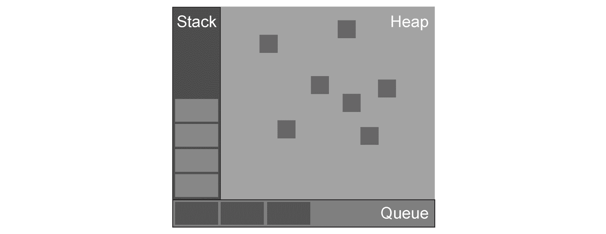
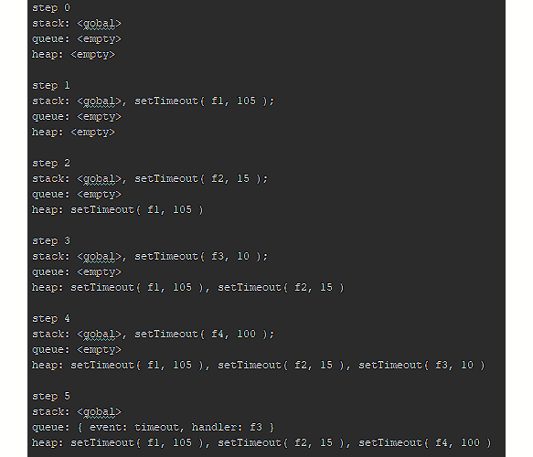
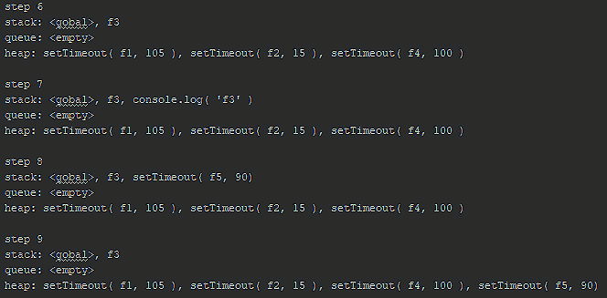
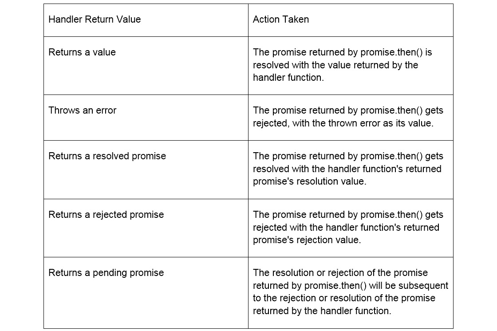

# 二、异步 JavaScript

## 学习目标

在本章结束时，你将能够:

*   定义异步编程
*   描述 JavaScript 事件循环的特征
*   利用回调函数并承诺编写异步代码
*   用 async/await 语法简化异步代码

在本章中，我们将学习异步 JavaScript 及其使用。

## 简介

在前一章中，我们介绍了 ES6 中发布的许多新的强大特性。 我们讨论了 JavaScript 的演变，并重点介绍了 ES6 中增加的关键功能。 我们讨论了作用域规则、变量声明、箭头函数、模板字面量、增强的对象属性、解构赋值、类和模块、编译以及迭代器和生成器。

在本章中，我们将学习什么是异步编程语言，以及如何编写和理解异步代码。 在第一个主题中，我们将定义异步编程，并展示 JavaScript 是一种异步的、事件驱动的编程语言。 然后，我们将概述回调，并展示如何使用回调来编写异步 JavaScript。 然后，我们将定义承诺，并演示如何使用承诺来编写异步 JavaScript。 在最后一个主题中，我们将展示 async/await 语法，并使用 promise 和该语法简化异步代码。

## 异步编程

JavaScript 是一种单线程、事件驱动的异步编程语言。 这意味着什么? 这意味着 JavaScript 在单个线程上运行，并通过事件队列延迟/处理某些事件或函数调用。 我们将通过下面的主题来分解 JavaScript 如何做到这一点的基础知识。

### 同步与异步

代码同步或异步意味着什么? 这两个术语在 JavaScript 中经常出现。 **Synchronous**源自希腊语词根**syn**，意为“有”，**chronos**，意为“时间”。 同步的字面意思是“与时间同步”，或者更确切地说，是与时间协调的代码。 每次只运行一行代码，直到处理完前一行代码才开始运行。 **异步**、或【显示】异步,来源于希腊根*异步,意味着“不是”,chronos,因此异步的字面意思是“没有时间”或者说,代码不与时间相协调。 运行的顺序代码与解释器第一次遇到代码行的时间不协调。*

### 同步与异步定时

有两种类型的代码:**同步**和**异步**。 我们将在本节讨论它们。

在异步 JavaScript 中，JavaScript 引擎处理慢速代码的方式是不同的。 我们知道“快”和“慢”是什么意思，但是这实际上如何应用到我们的代码中呢? 异步 JavaScript 允许线程在等待慢速操作(如文件系统 I/O)响应的同时执行新代码行。 要理解这一点，我们必须对计算机操作速度有所了解。

cpu 非常、非常快，每秒可以处理数百万到数十亿个操作。 计算机或网络的其他部分运行得比 CPU 慢得多。 例如，一个硬盘驱动器每秒只能执行成百上千次操作，而一个计算机网络每秒可能只能执行一次操作。 对内存的调用比 CPU 周期慢许多数量级。

硬盘操作比内存操作慢几个数量级。 网络调用比硬盘调用慢几个数量级。

在**同步代码**中，我们一次只执行一行代码。 直到前一行代码运行完毕，下一行代码才会执行。 自同步码处理一次只执行一行代码,等待操作完成之前开始一个新行,如果我们的代码请求慢介质,如内存,硬盘,或一个网络,我们的项目才会继续下一行的代码请求减缓介质(硬盘、网络 等)。 CPU 将闲置，浪费宝贵的时间，等待操作完成。 在网络调用的情况下，这可能需要几秒钟。 在编写复杂的同步代码时，程序员通常会编写多线程代码。 当一个线程在等待一个缓慢的操作时，操作系统就会在线程之间切换。 这有助于减少 CPU 空闲时间。

在**异步代码**中，我们可以按时间顺序执行代码行。 这意味着我们可以在前一行代码完成其操作之前开始处理新一行代码。 JavaScript 通过事件循环来实现这一点，这将在本章后面介绍。

在异步代码中，当 JavaScript 引擎遇到使用缓慢的、非 cpu 依赖的操作的代码行时，该操作将启动，而不是等待完成，程序将继续运行下一行代码。 当慢速操作完成时，CPU 跳回该操作，处理该操作的响应，并继续运行前面的代码。 这允许 CPU 不浪费宝贵的资源来等待可能需要几秒钟时间的操作。 同步和异步时序图的示例如下图所示:


###### 图 2.1:同步与异步时序图

在上图中，我们有四种操作:A、B、C、d。操作 C 向网络调用，在完成之前有一个延迟，用 network delay 表示。 在同步示例中，我们按顺序运行每个操作。 当我们到达操作 C 时，我们必须等待网络延迟才能完成操作 C。当操作 C 完成后，我们运行操作 d。在这段等待期间，CPU 是空闲的，不能做任何其他的工作。

在异步示例中，我们依次运行前三个操作。 当我们到达操作 C 时，我们不再等待网络延迟，而是运行操作 d。当网络延迟结束时，我们完成操作 C。在异步的例子中，我们可以清楚地看到所有操作的总体完成时间和 CPU 空闲时间都更短了。

如果这个概念仍然有点令人困惑，我们可以用现实生活中的情况来帮助解释它。 把同步代码想象成在火车站等待买票的一排人。 一次只能有一个人使用自动售票机。 直到我前面的人都拿到票，我才能从自动售票机取到票。 同样，在我拿到票之前，我后面的人也不能拿到他们的票。 即使排在我前面的人决定花五分钟买到他们的票，我也只能等到轮到我的时候。 就像票据行一样，同步代码按照顺序一步一步地完成。 在前一个代码行完成之前，不会运行新的代码行，无论单个步骤可能需要多长时间。

异步代码更像是在餐馆吃饭。 每位顾客一次点一份，在厨房烹饪时必须等待。 当他们完成烹饪时，菜单就会上桌，而不是给厨房的菜单。 烹制时间短的菜可能比烹制时间长的菜早出来。 这与异步代码非常相似。 每个异步代码操作(或我们示例中的食物顺序)都是按顺序启动的。 当操作在等待响应时，可以启动下一个操作。 CPU 可以在等待前一个操作响应的同时处理其他操作。 这显然不同于同步代码。 如果厨房以同步的方式运行，那么您将无法点餐，直到厨房完成了之前的订单。 想象一下这将是多么低效!

### 引入事件循环

JavaScript 是一种事件驱动的、异步的单线程语言，因为它具有异步事件循环特性。 异步操作在 JavaScript 中以事件的形式处理。 当我们进行异步调用时，一旦调用完成，就会触发一个事件。 JavaScript 引擎然后通过调用回调函数来处理该事件，然后继续执行代码中的下一步操作。

**Event Loop**是一个由四部分组成的系统，它使用 JavaScript 来管理所有的操作。 这个系统的组成部分是堆栈、堆、事件队列和(主)事件循环。 堆栈、堆和事件队列都是 JavaScript 引擎维护的数据结构。 主事件循环是一个在后台运行并管理这三个数据结构的进程。 在最简单的形式下，这个系统很容易理解。 堆栈跟踪函数调用。 当函数进行异步操作时，它将事件处理程序放入堆中。 当异步操作完成时，事件被推入事件队列。 事件循环对事件队列进行轮询，从堆中获取相关的处理程序，然后调用函数并将其添加到堆栈中。 这绝对是事件循环最基本的形式。 事件循环数据结构的可视化表示如下所示:



###### 图 2.2:事件循环数据结构可视化模型

这是事件循环最简单的形式——三个数据结构:一个用于跟踪函数调用，一个用于跟踪事件处理程序，一个用于跟踪事件完成，以及一个将它们联系在一起的循环。 下面的小节将更详细地讨论各个部分。

### 堆叠

JavaScript 引擎只有一个调用堆栈，即事件循环堆栈。 **事件循环栈**是一个传统的调用栈——它跟踪当前正在执行的函数以及在此之后将要执行的函数。 保存在堆栈中的函数称为帧。 事件循环采用先入后出的方法。 它本质上是一个具有特殊限制的类数组数据结构。 功能框架的添加和移除只在堆栈的顶部，就像厨房里的一堆盘子。 第一个放到堆栈上的物品总是在底部，而这将是最后一个拿掉的物品。

堆栈在堆栈的顶部跟踪当前执行的函数，在较低层次跟踪函数调用链。 当一个函数被执行时，一个帧被创建并添加到堆栈的顶部。 当一个函数完成执行时，它的帧将从堆栈顶部移除。 这些框架包含函数、参数和局部变量。

如果一个函数，函数 a，调用另一个函数 B，就会为新执行的函数 B 创建一个新框架。函数 B 的新框架被放到堆栈的顶部，也就是调用它的函数 a 的框架的顶部。 当函数 B 完成执行时，它的帧被从堆栈中移除，函数 A 的帧现在位于堆栈顶端。 函数 A 继续执行直到它完成，当它完成时，它的帧被删除。 下面的代码片段和图中显示了这样一个示例。

考虑以下代码片段:

```js
function foo( x ) { return 2 * x; }
function bar( y ) { return foo( y + 5 ) - 10; }
console.log( bar( 15 ) ); // Expected output: 30
```

###### 片段 2.1:调用堆栈示例代码

当程序开始时，第一帧被创建。 这个帧包含全局状态。 然后，当`console.log`被调用时，调用第二帧。 这个框架位于全局框架的顶部。 当调用`bar`函数时，将创建第三帧并将其添加到堆栈中。 该框架包含`bar's`参数和局部变量。 当 bar 调用`foo`时，第四个帧被添加到堆栈中，位于 bar 帧的顶部。 完整的调用栈如下图所示:


###### 图 2.3:调用堆栈

当`foo`返回时，它的帧被从堆栈中删除。 栈现在只包含一个包含 bar 的参数和变量的帧、`console.log`调用和全局帧。 当**bar**返回时，它的帧被从堆栈中移除，堆栈中只包含最后 2 帧。

### 堆和事件队列

**堆**

**堆**是一个大的，大部分是非结构化的内存块，用于跟踪事件完成时应该调用哪些函数。 当异步操作启动时，它会被添加到堆中。 一旦异步操作完成，就从堆中删除项。 当异步操作完成时，堆将必要的数据推入事件队列。

**排队**

**队列**是一个用于跟踪异步事件完成的消息队列。 这是一个传统的先入先出队列。 这意味着它是一个类似数组的数据结构，其中项目被推到队列的后面，并从队列的前面删除。 最老的物品先被移除并处理。

消息队列中的每个消息都有一个关联的函数，该函数在消息被处理时被调用。 要处理消息，将其从队列中删除，并使用消息数据作为输入参数调用相应的函数。 正如预期的那样，在调用函数时将创建一个新的堆栈帧。

让我们考虑一个例子，在我们的网页上的两个按钮，`button1` 和`button2`，设置为使用`clickHandler`处理函数处理点击事件。 用户连续快速点击`button1`、`button2`。 事件队列将包含以下简化信息:

```js
Queue: { event: 'click', target: 'button1', handler: clickHandler }, { event: 'click', target: 'button2', handler: clickHandler }
```

###### 代码片段 2.2:调用堆栈示例代码

### 事件循环

**事件循环**负责处理事件队列中的消息。 它通过一个恒定的轮询周期来实现这一点。 在事件循环的每个“滴答”时，事件队列最多做三件事:检查堆栈、检查队列和等待。

#### 请注意

事件队列“tick”是同步调用与 JavaScript 事件相关的零个或多个回调函数。 它是处理事件和运行关联回调所需的时间。

在每次滴答时，事件循环首先检查调用堆栈，看看它是否为空，以及我们是否可以做其他工作。 如果调用堆栈不是空的，事件队列将等待一段时间，然后再次检查。 如果调用堆栈为空，则事件循环将检查事件队列中要处理的事件。 如果事件队列是空的，那么我们没有工作要做，事件循环将等待到下一个滴答声并重新开始进程。 如果有要处理的事件，事件循环将从事件队列中取消事件消息的队列，并调用与该消息关联的函数。 被调用的函数在堆栈上创建了一个框架，JavaScript 引擎开始执行函数指定的工作。 事件循环继续其轮询周期。

查看事件循环轮询，我们可以注意到一次只能处理一个事件。 如果调用堆栈中有任何内容，事件循环将不会从事件队列中取出消息。 这个功能称为**run-to-completion**。 在任何其他消息开始处理之前，每个消息都被完全处理。

**Run-to-completion**在编写应用时提供了一些好处。 这样做的一个好处是，函数不能被抢占，并且会在任何其他代码运行之前运行，这可能会修改函数所操作的数据。

然而，这个模型的缺点是，如果代码中的事件回调或循环需要很长时间才能完成，应用可能会延迟其他挂起的事件。 在浏览器中，用户交互事件(如单击或滚动)可能挂起，因为另一个事件回调需要很长时间才能运行。 在服务器端代码中，数据库查询或 HTTP 请求的结果可能挂起，因为另一个事件回调需要很长时间才能完成。

确保事件调用的回调函数是短的，这是一种良好的实践。 使用`setTimeout`函数可以将长回调函数分解成多个消息。 以下代码片段显示了延迟问题的一个示例:

```js
setTimeout( () => { 
  // WARNING: this may take a long time to run on a slow computer
  // Try with smaller numbers first
  for( let i = 0; i < 2000000000; i++ ) {}
  console.log( 'done delaying' );
}, 0 );
setTimeout( () => { console.log( 'done!' ) }, 0 );
```

###### 代码片段 2.3:阻塞循环示例

在前面的示例中，我们使用`setTimeout`创建了两个异步调用。 第一个数到 20 亿，然后记录`done delaying`，第二个记录`done!`。 当第一个消息从事件队列中取出时，回调被放到调用堆栈中。 在大多数计算机中，数到 20 亿会引起明显的延迟。

#### 请注意

如果您的计算机是旧的，那么这种延迟可能是实质性的。 如果运行此代码，请从较小的数字开始，例如 2,000,000。

当计算机计数时，事件循环将不会从事件队列中取出下一条消息。 直到计数结束后，对日志`done!`的异步调用才会被处理。 要小心，因为制作回调函数可能需要很长时间。 如果阻塞的`console.log( 'done! ')`回调是一个用户输入事件在一个网站，网站将阻止用户输入，并可能导致一个沮丧的用户和潜在的损失一个有价值的用户。

### 这是值得考虑的

当使用事件循环时，在编写异步代码时，我们有三个重要的考虑事项。 首先要考虑的是事件可能不同步。 第二个原因是同步代码阻塞。 第三，零延迟函数不会在 0 毫秒后执行。 这三个概念解释如下:

**事件发生无序**

*   事件将按事件发生或解析的顺序添加到事件队列。
*   这可能不是异步调用启动的顺序。
*   如果异步操作很慢，那么在它完成之前触发的事件将首先被处理。
*   我们必须考虑回调和承诺的程序时间。
*   我们必须确保在数据可用之前小心访问由异步调用填充的数据。

**同步码阻塞**

*   使用执行相同或类似任务的同步模块来避免异步代码是非常糟糕的做法。
*   JavaScript 是单线程的。
*   如果使用了大量同步代码，事件消息可能无法以提示方式处理。
*   鼠标点击或滚动等事件可能被挂起。

**零延时函数在 0 毫秒后实际上不会执行**

*   `setTimeout`在超时过期后将事件添加到事件队列。
*   如果事件队列有许多消息要处理，则可能在几毫秒内无法处理超时消息。
*   delay 参数表示最小时间，而不是保证时间。

零延迟函数和事件循环状态的概念可以在下面的代码片段中演示:

```js
setTimeout( () => { console.log( 'step1' ) }, 0 );
setTimeout( () => { console.log( 'done!' ) }, 0 );
console.log( 'step0' );
//Expected output:
// step0
// step1
// done!
```

###### 代码片段 2.4:处理异步代码

在前面的代码片段中，我们看到在主代码文件中有一些工作要做。 运行主程序体，并将一个帧添加到调用堆栈。 然后解释第一行代码，`setTimeout`函数将它的回调函数添加到堆中，并计划在 0 毫秒后触发一个事件。 然后触发事件，并将消息添加到事件队列中。 JavaScript 引擎解释下一行代码，第二个`setTimeout`调用。 回调函数被添加到堆中，事件被注册为在 0 毫秒后触发。 第二个超时事件立即触发，并将第二条消息添加到事件队列。 JavaScript 引擎处理`console.log`调用，并将`step0`记录到控制台。 主程序体没有更多的同步工作要做，并且调用堆栈是空的。 事件循环现在开始处理事件队列中的事件。 事件队列包含两条消息，一条用于第一个超时事件，另一条用于第二个超时事件。 然后，事件循环接受第一个消息并将相关的`callback`函数添加到调用堆栈。 JavaScript 引擎处理调用堆栈框架和日志`step1`。 JavaScript 引擎然后处理事件队列中的第二条消息。 事件队列消息从队列中删除，并将一个帧添加到调用堆栈中。 JS 引擎处理栈中的框架并记录`done!`。 没有更多的工作可以做了。 所有事件都已触发，堆栈和队列都为空。

【t】结论

与大多数编程语言不同，JavaScript 是一种异步编程语言。 更具体地说，它是一种单线程、事件驱动的异步编程语言。 这意味着 JavaScript 在等待长时间运行操作的结果时不会处于空闲状态。 它在等待时运行其他代码块。 JavaScript 通过事件循环来管理。 事件循环由四部分组成:函数堆栈、内存堆、事件队列和事件循环。 这四个部分共同处理操作完成时触发的事件。

### 练习 16:用事件循环处理堆栈

为了更好地理解为什么程序中的事件是以预期的顺序触发和处理的，请查看下面提供的程序，在不运行该程序的情况下，写出程序的预期输出。

在程序的前 10 步中，在每一步中写入预期的堆栈、队列和堆。 一个步骤是任何时候一个事件触发，事件循环退出事件队列，或者 JS 引擎处理一个函数调用:

```js
step 0
stack: <global>
queue: <empty>
heap: <empty>
```

###### 代码片段 2.5:调用堆栈示例代码(开始步骤)

该程序显示在以下代码片段中:

```js
function f1() { console.log( 'f1' ); }
function f2() { console.log( 'f2' ); }
function f3() {
  console.log( 'f3' );
  setTimeout( f5, 90 );
}
function f4() { console.log( 'f4' ); }
function f5() { console.log( 'f5' ); }
setTimeout( f1, 105 );
setTimeout( f2, 15 );
setTimeout( f3, 10 );
setTimeout( f4, 100 );
```

###### 代码片段 2.6:调用堆栈示例代码(程序)

为了演示事件循环在处理 JavaScript 事件时如何处理堆栈、队列和堆的简化形式，执行以下步骤:

1.  Add an event loop stack frame to the stack if a function is called and being handled.

    处理函数并将必要的事件和处理程序信息添加到堆中。 在下一步中删除事件和处理程序。

2.  如果事件完成，则推入事件队列。
3.  从事件队列中提取并调用处理程序函数。
4.  对其余的步骤重复此步骤(仅前 10 步)。

**编码**

https://bit.ly/2R5YGPA

**结果**



###### 图 2.4:范围输出



###### 图 2.5:范围输出


###### 图 2.6:范围输出

您已经成功地演示了事件循环如何处理堆栈的简化形式。

## 回呼

**回调**是 JavaScript 异步编程的最基本形式。 用最简单的术语来说，回调是一个在另一个函数完成后被调用的函数。 回调函数用于处理异步函数调用的响应。

在 JavaScript 中，函数被视为对象。 它们可以作为参数传递，由函数返回，并保存到变量中。 回调是作为参数传递给高阶函数的函数对象。 高阶函数只是一个数学和计算机科学术语，指的是接受一个或多个函数作为参数(回调)或返回一个函数的函数。 在 JavaScript 中，高阶函数将使用回调函数作为参数。 一旦高阶完成某种形式的工作，比如 HTTP 请求或数据库调用，它就会调用带有错误或返回值的回调函数。

正如在*异步编程*的事件循环部分所提到的，JavaScript 是一种事件驱动语言。 由于 JavaScript 是单线程的，任何长时间运行的操作都会阻塞。 JavaScript 通过使用事件来处理这种阻塞效果。 当操作完成并触发事件时，事件有一个附加的处理函数，调用该函数来处理结果。 这些函数是**回调**。 回调是在处理异步事件时允许 JavaScript 事件执行工作的关键。

### Building Callbacks

JavaScript 中的回调遵循一个简单的非官方约定。 一个回调函数应该接受至少两个参数:**错误**和**结果**。 在构建回调 api 或编写回调函数时，我们建议您遵循此约定，以便您的代码可以与其他库无缝集成。 回调函数的示例如下所示:

```js
TwitterAPI.listFollowers( { user_id: "example_user" }, (err, result) => {   
  console.log( err, result ); 
} );
```

###### 片段 2.7:基本的回调示例

在前面的示例中，我们使用了一个虚假的 Twitter API。 我们的伪 API 有一个高阶函数`listFollowers`，它接受一个对象和一个回调函数作为参数。 一旦`listFollowers`完成了它的内部工作(在本例中是对 Twitter API 的 HTTP 请求)，我们的回调函数将被调用。

回调函数可以根据需要或由高阶函数指定的参数接受任意数量的参数，但第一个参数必须是`error`对象。 几乎所有现有的 API 都遵循这个约定。 在编写 api 时打破这种惯例将使您的代码更难与任何第三方 api 或应用集成。

只有当高阶函数在运行时遇到错误时，回调函数的错误参数才会被设置。 error 参数的内容可以是任何合法的 JavaScript 值。 在大多数情况下，它是`Error`类的实例; 但是，对于错误对象的内容没有约定。 一些 api 可能会返回一个对象、字符串或数字，而不是 Error 实例。 请务必阅读任何第三方 API 的文档，以确保您的代码能够处理返回的错误格式。

如果高阶函数没有遇到错误，则错误参数应设为空。 在构建自己的 api 时，建议您也遵循这个约定。 一些第三方 api 可能会返回一个不为空的假值，但这是不鼓励的，因为这会使错误处理逻辑更加复杂。

#### 请注意

**Falsy**是 JavaScript 类型比较和转换的术语。 JavaScript 中的 false 值在类型比较中使用时会转换为 Boolean false。 假值的例子有 null、undefined、0 和布尔值 false。

回调函数的结果参数包含高阶函数的计算结果。 这可能是 HTTP 请求、数据库查询或任何其他异步操作的结果。 一些 api 还可能在返回错误时在结果字段中提供更详细的错误信息。 重要的是，如果结果对象存在，不要假定函数已成功完成。 您必须检查错误字段。

当处理回调函数中的错误时，我们必须检查错误参数。 如果 error 参数不是 null 或 undefined，则必须以某种方式处理错误。 下面的代码片段显示了一个示例错误处理程序:

```js
TwitterAPI.listFollowers( { user_id: "example_user" }, (err, result) => {   
  if ( err ) {
    // HANDLE ERROR
  }
  console.log( err, result ); 
} );
```

###### 片段 2.8:基本的回调错误处理

大多数开发人员检查错误值是否为真值。 如果`err`为真，则执行错误处理代码。 这是一般的做法; 然而，这是一种懒惰的编码方式。 在某些情况下，错误对象可能是布尔值 false、数字 0、空字符串等等。 这些都是假的，即使值不是 null 或未定义。 如果您正在使用 API，请确保它不会返回一个计算结果为 false 的错误。 如果你正在构建一个 API，我们不建议返回一个可能被评估为 false 的错误。

### 陷阱

回调很容易使用，并且很好地实现了它们的目的，但是在使用回调时需要考虑一些陷阱。 两个最常见的缺陷是回调地狱和回调存在假设。 如果代码编写得有远见，这两个缺陷都很容易避免。

最常见的回叫陷阱是**回叫地狱**。 在异步工作完成并调用回调函数后，回调函数可以调用另一个异步函数来做更多的异步工作。 当它调用新的异步函数时，将提供另一个回调。 新回调将嵌套在旧回调的内部。 下面的代码片段显示了一个回调嵌套的例子:

```js
TwitterAPI.listFollowers( { user_id: "example_user" }, (err, result) => { 
  if ( err ) { throw err; }
  TwitterAPI.unfollow( { user_id: result[ 0 ].id }, ( err, result ) => {
    if ( err ) { throw err; }
    console.log( "Unfollowed someone!" );
  } );
 } );
```

###### 代码片段 2.9:回调嵌套

在前面的代码片段中，我们嵌套了回调函数。 第一个异步操作的回调，`listFollowers`调用第二个异步操作。 unfollow 操作还有一个回调函数，用于处理错误或记录文本。 由于回调可以嵌套，在几个嵌套层之后，代码会变得相当难以阅读。 这是回叫地狱。 下面的代码片段显示了一个回调地狱的例子:

```js
TwitterAPI.listFollowers( { user_id: "example_user" }, (err, result) => { 
  const [ id1, id2, id3 ] = [ result[ 0 ].id, result[ 1 ].id, result[ 2 ].id ];
  TwitterAPI.unfollow( { user_id: id1 }, ( err, result ) => {
    TwitterAPI.block( { user_id: id1 }, ( err, result ) => {
      TwitterAPI.unfollow( { user_id: id2 }, ( err, result ) => {
        TwitterAPI.block( { user_id: id2 }, ( err, result ) => {
          TwitterAPI.unfollow( { user_id: id3 }, ( err, result ) => {
            TwitterAPI.block( { user_id: id3 }, ( err, result ) => {
              console.log( "Unfollowed and blocked 3 users!" );
```

###### 片段 2.10:回调地狱

在前面的代码片段中，我们列出了关注者，然后取消关注并阻止前三个关注者。 这是非常简单的代码，但是因为回调是嵌套的，所以代码变得更加混乱。 这是回叫地狱。

#### 请注意

回调地狱是关于不整洁的代码表示，而不是它背后的逻辑。 回调嵌套可以导致代码运行时没有错误，但很难阅读。 很难阅读的代码在出现错误时很难向新开发人员解释或调试。

### 修复回叫地狱

使用两个技巧可以很容易地避免回调地狱:**命名函数**和**模块**。 命名函数非常简单; 定义回调函数并将其赋给一个标识符(变量)。 定义的回调函数可以保存在同一个文件中，也可以放在一个模块中并导入。 在回调中使用命名函数将有助于防止回调嵌套导致代码混乱。 如下代码片段所示:

```js
function listHandler( err, result ) {
  TwitterAPI.unfollow( { user_id: result[ 0 ].id }, unfollowHandler );
}
function unfollowHandler( err, result) {
  TwitterAPI.block( { user_id: result.id }, blockHandler );
}
function blockHandler( err, result ) {
  console.log( "User unfollowed and blocked!" );
}
TwitterAPI.listFollowers( { user_id: "example_user" }, listHandler);
```

###### 片段 2.11:修复回调地狱

正如我们从前面的代码片段中看到的，没有嵌套的代码要干净得多。 如果回调嵌套深度为 30，那么使代码可读的唯一方法就是将回调分解为命名函数。

另一个潜在的缺陷是不存在回调函数。 如果我们正在编写 API，我们必须考虑 API 的用户可能不会将有效的回调函数传递给 API 的可能性。 如果预期的回调不是一个函数或不存在，那么尝试调用它将导致运行时错误。 在尝试调用回调函数之前，验证它是否存在，是否是一个函数，这是一个很好的实践。 如果用户传入一个无效的回调，那么我们可以优雅地失败。 下面的代码片段显示了一个例子:

```js
Function apiFunction( args, callback ){
  if ( !callback || !( typeof callback === "function" ) ){
    throw new Error( "Invalid callback. Provide a function." );
  }
  let result = {};
  let err = null;
  // Do work
  // Set err and result
  callback( err, result );
}
```

###### 片段 2.12:检查回调是否存在

在前面的代码片段中，我们检查以确保`callback`参数存在并且为真，并且它是 function 类型的。 如果回调不存在或不是一个函数，我们抛出一个错误，让用户确切地知道哪里出了问题。 如果`callback`是一个函数，我们继续。

回调只是一个作为参数传递给另一个函数的函数，称为**高阶**函数。 JavaScript 使用回调来处理事件。 回调函数使用一个错误参数和一个结果参数定义。 如果在高阶函数中有错误，回调错误字段将被设置。 如果高阶函数以结果完成，则结果字段将包含完成操作的结果。

在使用回调函数时，我们应该小心两个陷阱。 我们必须小心，不要在一起嵌套太多的回调函数，以免造成回调地狱。 我们必须确保验证传递给高阶函数的参数，以确保回调是一个函数。

### 练习se 17:使用回调

你的团队正在构建一个基于回调的 API。 为了防止运行时错误，您需要验证传递到回调API 函数的回调参数是有效的可调用函数。 为你的 API 创建一个函数。 在函数体中，验证回调参数是否是一个函数。 如果它不是一个函数，则抛出错误。 在延迟之后，记录传入 API 函数的数据并调用回调。

使用回调函数构建回调 API，执行以下步骤:

1.  编写一个名为`higherOrder`的函数，它有两个参数; 一个名为`data`的对象和一个名为`cb`的回调函数。
2.  In the function, check that the callback is a function argument (`cb`) is a function.

    如果`cb`不存在或不是`function`类型，则抛出错误。

3.  在函数中，记录`data`对象。
4.  在函数中，在超时 10 毫秒后调用`callback`函数。
5.  在函数之外，创建一个`try-catch`块。
6.  在 try 部分中，使用数据对象调用`higherOrder`函数，而不使用回调函数。
7.  在 catch 部分中，捕获错误并记录我们得到的错误消息。
8.  在`try-catch`块之后，用一个数据对象和`callback`函数调用`higherOrder`函数。 回调函数应该记录字符串`Callback Called!`

**编码**

##### Index.js

```js
function higherOrder( data, cb ) {
 if ( !cb || !( typeof cb === 'function' ) ) {
   throw new Error( 'Invalid callback. Please provide a function.' );
 }
 console.log( data );
 setTimeout( cb, 10 );
}
try {
 higherOrder( 1, null );
} catch ( err ) {
 console.log( 'Got error: ${err.message}' );
}
higherOrder( 1, () => {
 console.log( 'Callback Called!' )
} );
```

###### 代码片段 2.13:实现回调

https://bit.ly/2VTGG9L

**结果**


###### 图2.7:回调输出

您已经成功地构建了一个带有回调函数的回调 API。

## 承诺

在 JavaScript 中，**promise**是一个封装异步操作并在异步操作完成时通知程序的对象。 promise 对象表示包装操作的最终完成或失败。 一个承诺是一个不一定知道的价值的代表。 它不像同步程序那样立即提供值，而是承诺在将来的某个时间点提供值。 承诺允许您将成功和错误处理程序与异步操作关联起来。 在包装的异步流程完成或失败时调用这些处理程序。

### 承诺各州

每个承诺都有一个状态。 承诺只有一次有价值的成功，一次有错误的失败。 承诺的状态定义了承诺在实现一个值的过程中所处的位置。

承诺有三种状态:**待定**、**履行**、**拒绝**。 一个承诺在等待状态开始。 这意味着在 promise 内部执行的异步操作是不完整的。 一旦异步操作完成，承诺就被认为已完成，并将进入已完成或被拒绝状态。

当一个承诺进入已完成状态时，意味着异步操作已经完成，没有错误。 承诺被实现，一个值是可用的。 由异步操作生成的值已经返回，可以使用。

当一个承诺进入被拒绝状态时，它意味着异步操作已经完成并出现了错误。 当一个承诺被拒绝时，未来的工作将不会完成，也不会提供任何价值。 异步操作的错误已经返回，可以从 promise 对象引用。

### 解决或拒绝承诺

promise 是通过实例化`Promise`类的一个新对象来创建的。 promise 构造函数只接受一个参数，一个函数。 该函数必须有两个参数:**resolve**和**reject**。 下面的代码片段显示了一个创建承诺的示例:

```js
const myPromise = new Promise( ( resolve, reject ) => {
  // Do asynchronous work here and call resolve or reject
} );
```

###### 代码片段 2.14:承诺创建语法

promise 的主要异步工作将在传递给构造函数的函数体中完成。 两个参数，`resolve`和`reject`，是可以用来完成承诺的函数。 要用一个错误来完成 promise，调用 reject 函数并将该错误作为其参数。 要将 promise 标记为成功，请调用`resolve`函数，并将结果作为参数传递给解析。 拒绝承诺和解决方案的示例如下:

```js
// Reject promise with an error
const myPromise = new Promise( ( resolve, reject ) => {
  // Do asynchronous work here
  reject( new Error( 'Oh no! Promise was rejected' ) );
} );
```

###### 片段 2.15:拒绝承诺

```js
// Resolve the promise with a value
const myPromise = new Promise( ( resolve, reject ) => {
  // Do asynchronous work here
  resolve( { key1: 'value1' } );
} );
```

###### 片段 2.16:解决承诺

下面的代码片段显示了解决执行异步工作的承诺的示例:

```js
const myPromise = new Promise( ( resolve, reject ) => {
  setTimeout( () => { resolve( 'Done!' ) }, 1000 )
} );
```

###### 片段2.17:解决承诺

### 使用承诺

promise 类有三个成员函数，可用于处理承诺实现和拒绝。 这些函数称为承诺处理程序。 这些函数是`then()`、`catch()`和`finally()`。 当一个承诺完成时，将调用其中一个处理函数。 如果 promise 实现，则调用`then()`函数。 如果 promise 被拒绝，则调用`catch()`函数，或调用带有拒绝处理程序的`then()`函数。

`then()`成员函数被设计用来处理和获取承诺实现或拒绝的结果。 `then`函数接受两个函数参数，一个实现回调函数和一个拒绝回调函数。 下面的例子显示了这一点:

```js
// Resolve the promise with a value or reject with an error
myPromise.then( 
  ( result ) => { /* handle result */ }, // Promise fulfilled handler
  ( err ) => { /* handle error here */ } // Promise rejected handler
 ) ;
```

###### 代码片段 2.18:Promise.then()语法

`then()`函数中的第一个参数是承诺实现处理程序。 如果用一个值来实现承诺，则调用承诺实现处理程序回调。 承诺实现处理程序接受一个参数。 这个参数的值将是传递给 promise 函数体中已完成的回调函数的值。 下面的代码片段显示了一个例子:

```js
// Resolve the promise with a value
const myPromise = new Promise( ( resolve, reject ) => {
  // Do asynchronous work here
  resolve( 'Promise was resolved!' );
} );
myPromse.then( value => console.log( value ) );
// Expected output: 'Promise was resolved'
```

###### 片段 2.19:promise .then()带有已解析的 promise

`then()`函数中的第二个参数是 promise 拒绝处理程序。 如果承诺被错误拒绝，则调用承诺拒绝处理程序回调。 promise 拒绝处理程序接受一个参数。 这个参数的值是传递给 promise 函数体中 reject 回调函数的值。 下面的代码片段显示了一个例子:

```js
// Reject the promise with a value
const myPromise = new Promise( ( resolve, reject ) => {
  // Do asynchronous work here
  reject( new Error ( 'Promise was rejected!' ) );
} );
myPromse.then( () => {}, error => console.log( error) );
// Expected output: Error: Promise was rejected! 
// ** output stack trace omitted
```

###### 片段 2.20:Promise.then()拒绝 Promise

### 练习 18:创造和实现你的第一个承诺

要构建我们的第一个异步承诺，执行以下步骤:

1.  创建一个承诺，并将其保存到一个名为`myPromise`的变量中。
2.  在承诺的内部，记录`Starting asynchronous work!`
3.  Inside the body of the promise, do asynchronous work with a timeout.

    在 1000 毫秒后触发`timeout`回调。 在回调函数`timeout`内部，调用承诺解析函数并传入值`Done!`

4.  将 then 处理程序附加到保存在`myPromise`中的承诺。
5.  将一个函数传递给 then 处理程序，该处理程序接受一个参数并记录参数的值。

**编码**

##### Index.js

```js
const myPromise = new Promise( ( resolve, reject ) => {
  console.log( 'Starting asynchronous work!' );
  setTimeout( () => { resolve( 'Done!' ); }, 1000 );
} );
myPromise.then( value => console.log( value ) );
```

###### 片段 2.21:Promise.then()拒绝 Promise

https://bit.ly/2TVQNcz

**结果**


###### 图 2.8:范围输出

您已经成功地使用了刚刚学会的语法来构建我们的第一个异步承诺。

### 兑现承诺

当调用`Promise.then()`时，它返回一个处于 pending 状态的新承诺。 当 promise 处理程序被调用后，`Promise.then()`中的处理程序将被异步调用。 当从`Promise.then()`调用处理程序返回一个值时，该值用于解析或拒绝`promise.then()`返回的承诺。 下表提供了当 handler 函数在任何阶段返回值、错误或承诺时所采取的操作:



###### 图 2.9:返回承诺

`Promise.catch`接受一个参数，一个处理函数，用于处理拒绝承诺值。 当调用`Promise.catch`时，内部调用`Promise.then( undefined, rejectHandler )`。 这意味着在内部，只使用拒绝承诺回调、`rejectHandler`调用`Promise.then()`处理程序，而不使用承诺实现回调。 `Promise.catch()`返回内部`Promise.then()`调用的值:

```js
const myPromise = new Promise( ( resolve, reject ) => {
  reject( new Error 'Promise was resolved!' );
} );
myPromise.catch( err => console.log( err ) );
```

###### 代码片段 2.22:Promise.then()拒绝 Promise

承诺成员函数`Promise.finally()`是一个用来捕获所有承诺完成情况的承诺处理程序。 一个`Promise.finally()`处理程序将被调用的承诺拒绝和解决。 它接受一个函数参数，当 promise 被拒绝或实现时调用该函数参数。 `Promise.finally()`将捕获被拒绝和已解析的承诺，并运行指定的函数。 它为我们提供了一个 catch all 处理程序来处理任何一种实现情况。 应该使用`Promise.finally()`来防止 then 和 catch 处理程序之间的代码重复。 传入`Promise.finally()`的函数不接受任何参数，因此传入 promise 的解析或拒绝的值将被忽略。 因为在使用`Promise.finally()`时没有可靠的方法来区分拒绝和实现，所以`Promise.finally()`只能在我们不关心承诺是否被拒绝或实现时使用。 下面的代码片段显示了一个例子:

```js
// Resolve the promise with a value
const myPromise = new Promise( ( resolve, reject ) => {
  resolve( 'Promise was resolved!' );
} );
myPromse.finally( value => { 
  console.log( 'Finally!' );
 } );
// Expected output:
// Finally!
```

###### 片段 2.23:Promise.then ()

在使用承诺时，有时我们可能想要创建一个已经处于已完成状态的承诺。 Promise 类有两个静态成员函数允许我们这样做。 这些函数是`Promise.reject()`和`Promise.resolve()`。 `Promise.reject()`接受一个参数，返回一个已被拒绝的承诺，并将其值传递给 reject 函数。 `Promise.resolve()`接受一个参数并返回一个承诺，该承诺已经通过传入的值被解析:

```js
Promise.resolve( 'Resolve value!' ).then( console.log );
Promise.reject( 'Reject value!' ).catch( console.log );
//Expected output:
// Resolve value!
// Reject value!
```

###### 片段 2.24:Promise.then ()

### C海宁

在使用承诺的时候，我们可能会陷入**承诺地狱**。 这非常类似于回叫地狱。 当一个承诺主体在获得该值后需要做更多的异步工作时，可以嵌套另一个承诺。 当嵌套链变得非常深时，嵌套的 promise 调用会变得很难遵循。 为了避免承诺地狱，我们可以把承诺链在一起。 `Promise.then()`、`Promise.catch()`和`Promise.finally()`都返回由处理函数的结果实现或拒绝的承诺。 这意味着我们可以在这个承诺上添加另一个 then 处理程序，并创建一个承诺链来处理新返回的承诺。 如下代码片段所示:

```js
function apiCall1( result ) { // Function that returns a promise
 return new Promise( ( resolve, reject ) => { 
    resolve( 'value1' );
  } );
}
function apiCall2( result ) {// Function that returns a promise
  return new Promise( ( resolve, reject ) => { 
    resolve( 'value2' );
  } );
}
myPromse.then( apiCall1 ).then( apiCall2 ).then( result =>  console.log( 'done!') ) ;
```

###### 代码片段 2.25:承诺链接示例

在前面的示例中，我们创建了两个函数`apiCall1()`和`apiCall2()`。 这些函数返回一个承诺，它将执行更多异步工作。 为了简洁起见，本例中省略了异步工作。 当原来的承诺`myPromise`完成时，`Promise.then()`处理程序调用`apiCall1()`，返回另一个承诺。 第二个`Promise.then()`处理程序应用于这个新返回的承诺。 当`apiCall1()`返回的承诺被解析时，处理器函数调用`apiCall2()`，它也返回一个承诺。 当返回由`apiCall2()`返回的 promise 时，调用最后的`Promise.then()`处理程序。 如果这些具有异步工作的处理程序函数是嵌套的，那么执行程序就会变得非常困难。 使用回调链，遵循程序流程变得非常容易。

当链接承诺时，承诺处理程序有可能返回一个值而不是一个新的承诺。 如果返回一个值，该值将作为输入传递给链中的下一个`Promise.then()`处理器。

例如，第一个承诺完成并调用`Promise.then()`处理程序。 这个处理程序执行同步工作并返回数字 10。 下一个`promise.then()`处理程序将输入参数设置为 10，并可以继续执行异步工作。 这允许您将同步步骤嵌入承诺链。

当链接承诺时，我们必须小心捕捉处理程序。 当一个承诺被拒绝时，它跳转到下一个承诺拒绝处理程序。 这可以是`then`或`catch`处理程序中的第二个参数。 在拒绝承诺和下一个拒绝处理程序之间的所有实现处理程序都将被忽略。 当 catch 处理程序完成时，`catch()`返回的承诺将用拒绝处理程序的返回值来实现。 这意味着将给下面的承诺实现处理程序一个值来运行。 如果`catch`处理程序不是承诺链中的最后一个处理程序，承诺链将继续使用`catch`处理程序的返回值运行。 这可能是一个需要调试的棘手错误; 但是，它允许我们捕获拒绝承诺，以特定的方式处理错误，并继续执行承诺链。 它允许承诺链以不同的方式处理拒绝或接受，然后继续异步工作。 如下代码片段所示:

```js
// Promise chain handles rejection and continues
// apiCall1 is a function that returns a rejected promise
// apiCall2 is a function that returns a resolved promise
// apiCall3 is a function that returns a resolved promise
// errorHandler1 is a function that returns a resolved promise
myPromse.then( apiCall1 ).then( apiCall2, errorHandler1 ).then( apiCall3 ).catch( errorHandler2 );
```

###### 片段 2.26:处理错误并继续

在前面的代码片段中，在解析`myPromise`之后，我们有一个连续有三个异步 API 调用的承诺链。 第一个 API 调用将拒绝承诺并返回错误。 被拒绝的承诺由第二个 then 处理程序处理。 由于承诺被拒绝，它将忽略`apiCall2()`和到`errorHandler1()`函数的路由。 将做一些工作并返回一个值或承诺。 该值或承诺被传递给下一个处理程序，下一个处理程序调用`apiCall3()`，返回一个已解析的承诺。 由于承诺已被解析，并且没有更多的`then`处理程序，因此承诺链结束。 最后的捕获被忽略。

要从一个拒绝处理程序跳到下一个拒绝处理程序，我们需要在拒绝`handler`函数中抛出一个错误。 这将导致返回的 promise 被拒绝并抛出错误，并跳到下一个`catch`处理器。

如果我们希望在承诺被拒绝时尽早退出承诺链并不再继续，那么应该只在链的末尾包含一个 catch 处理程序。 当一个承诺被拒绝时，该拒绝将由找到的第一个处理程序处理。 如果这个处理程序是承诺链中的最后一个处理程序，则承诺链结束。 如下代码片段所示:

```js
// Promise chain handles rejection and continues
// apiCall1 returns a rejected promise
myPromse.then( apiCall1 ).then( apiCall2 ).then( apiCall3 ).catch( errorHandler1 );
```

###### 代码片段 2.27:在终止链的末端处理错误

在前面的代码片段所示的承诺链中，当 myPromise 被解析为一个值，并且第一个`then`处理程序被调用时。 被调用并返回一个被拒绝的承诺。 由于接下来的两个`then`处理程序没有处理 promise 拒绝的参数，因此拒绝被传递给`catch`处理程序。 catch 处理程序调用`errorHandler1`，然后承诺链结束。

链接承诺用于确保所有承诺都按照链的顺序完成。 如果承诺不需要按顺序完成，可以使用`Promise.all()`静态成员函数。 `Promise.all()`函数不是在 promise 类的实例上创建的。 它是一个静态类函数。 `Promise.all()`接受一个承诺数组，当所有承诺都被解析后，`then`处理器将被调用。 `then`处理函数的参数将是一个数组，其中包含原始`Promise.all()`调用中每个承诺的解析值。 解析值的数组将匹配输入数组的顺序为`Promise.all()`。 如下代码片段所示:

```js
// Create promises
let promise1 = new Promise( ( resolve, reject ) => setTimeout( () => resolve( 10 ), 100 ) );
let promise2 = new Promise( ( resolve, reject ) => setTimeout( () => resolve( 20 ), 200 ) );
let promise3 = new Promise( ( resolve, reject ) => setTimeout( () => resolve( 30 ), 10 ) );
Promise.all( [ promise1, promise2, promise3 ] ).then( results => console.log( results ) );
//Expected output: [ 10, 20, 30 ]
```

###### 片段 2.28:Promise.all()示例

在前面的示例中，我们创建了三个承诺，分别在 100ms、200ms 和 10ms 后解析。 然后我们将这些承诺传递给`Promise.all()`函数。 一旦所有的承诺都解决了，就会调用附加到`Promise.all()`函数的 then 处理程序。 这个处理程序记录承诺的结果。 注意，结果数组的顺序与承诺数组的顺序相匹配，而不是承诺的完成顺序。

如果`Promise.all()`调用中的一个或多个承诺被拒绝，`reject`处理程序将使用第一个承诺的拒绝值来调用。 所有其他承诺将运行到完成，但这些承诺的拒绝或解决将不会调用`P``romise.all()`承诺链的任何`then`或`catch`处理程序。 如下代码片段所示:

```js
// Create promises
let promise1 = new Promise( ( resolve, reject ) => {
  setTimeout( () => { reject( 'Error 1' ); }, 100 );
} );
let promise2 = new Promise( ( resolve, reject ) => {
  setTimeout( () => { reject( 'Error 2' ); }, 200 );
} );
let promise3 = new Promise( ( resolve, reject ) => {
  setTimeout( () => { reject( 'Error 3' ); }, 10 );
} );
Promise.all( [ promise1, promise2, promise3 ] ).then( console.log ).catch( console.log );
// Expected output: 
// Error: Error 3
```

###### 片段 2.29:Promise.all()拒绝

在这个示例中，我们创建了三个承诺，记录承诺号，然后所有承诺都被拒绝，并出现各种错误。 我们将这些承诺传递给一个`Promise.all`电话。 `Promise3`的超时时间最短，因此是第一个被拒绝的承诺。 当`Promise3`被拒绝时，承诺拒绝被传递给最近的错误处理程序(`.catch()`)，该错误处理程序记录承诺拒绝。 promise 1 和 2 在不久后完成运行，但都被拒绝。 拒绝处理程序不会为这些承诺再次调用。

最后一个用于处理多个承诺的函数是`Promise.race()`函数。 `Promise.race()`功能被设计用来只处理第一个承诺的实现或被拒绝。

#### 请注意

如果由于某种原因，您的程序有一个故意的竞争条件或多个代码路径，这些路径只能导致一个成功的响应处理程序被调用一次，`Promise.race()`是完美的解决方案。

像`Promise.all()`一样，`Promise.race()`传递一个承诺数组; 然而，`Promise.race()`只对第一个完成的承诺调用承诺实现处理器。 然后它继续正常的承诺链。 其他承诺的结果将被丢弃，无论它们是被拒绝还是被解决。 `Promise.race()`的拒收处理方式与`Promise.all()`相同。 只处理第一个被拒绝的承诺。 不管实现状态如何，其他承诺都被忽略。 以下片段显示了`Promise.race()`的示例:

```js
// Create promises
let promise1 = new Promise( ( resolve, reject ) => setTimeout( resolve( 10 ), 100 ) );
let promise2 = new Promise( ( resolve, reject ) => setTimeout( resolve( 20 ), 200 ) );
let promise3 = new Promise( ( resolve, reject ) => setTimeout( resolve( 30 ), 10 ) );
Promise.race( [ promise1, promise2, promise3 ] ).then( result => console.log( result ) );
//Expected output: 30
```

###### 代码片段 2.30:Promise.race()示例

在前面的示例中，我们创建了三个承诺。 这些承诺都在各种超时后解决。 `Promise3`首先解析，因为它的超时时间最短。 当`promise3`解析时，将调用 then 处理程序，并记录`promise3`的结果。 当`promise1`和`promise2`分解时，其结果被忽略。

### 承诺和回调

承诺和回调不应该混在一起。 编写同时使用回调函数和承诺执行异步工作的代码可能会非常复杂，并导致非常难以调试的错误。 为了防止混合回调逻辑和承诺逻辑，我们必须在代码中添加 shims，将回调作为承诺处理，将承诺作为回调处理。 有两种方法可以做到这一点:承诺可以封装在回调中，或者回调可以封装在承诺中。

#### 请注意

垫片是一个代码文件，用于将缺失的功能添加到代码库中。 shim 通常用于确保 web 应用的跨浏览器兼容性。

### 在回调中包装承诺

要在回调中包装 promise 函数，我们只需创建一个包装函数，它接受`promise`函数、参数和`callback`。 在`wrapper`函数内部，调用`promise`函数并传入所提供的参数。 我们附加了`then`和`catch`处理程序。 当这些处理程序解决时，我们调用`callback`函数，并返回 promise 返回的结果或错误。 如下代码片段所示:

```js
// Promise function to be wrapped
function promiseFn( args ){
  return new Promise( ( resolve, reject ) => {
    /* do work */ 
    /* resolve or reject */
  } );
}
// Wrapper function
function wrapper( promiseFn, args,  callback ){
  promiseFn( args ).then( value => callback( null, value )
         .catch( err => callback( err, null );
}
```

###### 片段 2.31:在回调中封装承诺

在前面的示例中，我们使用 promise 的结果调用回调函数。 如果 promise 被解析为一个值，我们将该值传递给回调函数，并将 error 字段设置为空。 如果承诺被拒绝，我们将错误传递给回调函数，返回一个空的结果字段。

要将基于回调的函数包装在 promise 中，只需创建一个包装函数，该包装函数接受要包装的函数和函数参数。 在包装器函数中，我们调用包装在一个新承诺中的函数。 当回调返回一个结果或错误时，如果有错误，我们拒绝承诺，或者如果没有错误，我们解析承诺。 如下代码片段所示:

```js
// Callback function to be wrapped
function wrappedFn( args, cb ){
  /* do work */ 
  /* call cb with error or result */
}
// Wrapper function
function wrapper( wrappedFn, args ){
  return new Promise( ( resolve, reject ) => {
    wrappedFn( args, ( err, result ) => {
      if( err ) {
        return reject( err );
      }
      resolve( result );
    } );
  } );
}
```

###### 片段 2.32:在承诺中包装回调

在前面的示例中，我们创建了一个包装器函数，它接受一个函数及其参数。 我们返回一个调用该函数的承诺，并根据结果拒绝或解析该承诺。 因为这个函数返回一个承诺，所以它可以嵌入到承诺链中，也可以有一个 then 或 catch 处理程序附加到它。

n

承诺是 JavaScript 中处理异步编程的另一种方法。 在创建 promise 时，promise 开始于挂起状态，并根据异步工作的结果进入已完成或已拒绝状态。 为了处理承诺的结果，我们使用了`.then()`、`.catch()`和`.finally()`成员函数。 `.then()` 函数有两个处理函数，一个用于履行承诺，另一个用于拒绝承诺。 `.catch()`函数只接受一个函数并处理拒绝承诺。 `Promise.finally()`接受一个功能，并被要求履行承诺或拒绝。

当需要运行多个承诺，但顺序无关紧要时，可以使用`Promise.all()`和`Promise.race()`静态函数。 当所有承诺都完成运行时，将调用`Promise.all()`解析处理程序。 当第一个承诺完成运行时，将调用`Promise.race()`解析处理程序。

承诺和回调是不兼容的，不应该在程序体中混合使用。 为了允许使用承诺或回调函数的函数和模块之间的兼容性，我们可以编写包装器函数。 我们可以将回调封装在承诺中，或者将承诺封装在回调中。 这使得我们可以将第三方模块与我们的代码兼容。

### 练习19:带着承诺工作

您正在构建一个基于承诺的 API。 在 API 中，必须验证用户输入，以确保传递到数据库模型的数据是正确的类型。 编写一个返回承诺的函数。 这个承诺应该验证传入 API 函数的数据值不是一个数字。 如果用户向函数传递了一个数字，则拒绝这个承诺并给出一个错误。 如果用户传递一个非数字到 API 函数中，则用单词`Success!`解析承诺。

要构建一个在真实场景中使用承诺的函数，请执行以下步骤:

1.  编写一个名为`promiseFunction`的函数，它接受一个数据参数并返回一个承诺。
2.  将一个接受两个参数 resolve 和 reject 的函数传递到 promise 的构造函数中。
3.  在 promise 中，通过创建一个在 10ms 之后运行的超时来开始执行异步工作。
4.  在`timeout`回调函数中，记录提供给`promiseFunction`的输入数据。
5.  在`timeout`回调中，检查数据类型是否为数字。 如果是，则使用错误拒绝承诺，否则使用字符串`Success!`解析承诺。
6.  Run `promiseFunction` and provide a number as the parameter. Attach a `then()` handler and a `catch()` handler to the promise returned by the function.

    #### 请注意

    `then`处理程序应该记录承诺解析值。 `catch`处理程序应该记录错误的消息属性。

**编码**

##### Index.js

```js
function promiseFunction( data ) {
 return new Promise( ( resolve, reject ) => {
   setTimeout( () => {
     console.log( data );
     if ( typeof data === 'number' ) {
       return reject( new Error( 'Data cannot be of type \'number\'.' ) );
     }
     resolve( 'Success!' );
   }, 10 );
 } );
}
promiseFunction( 1 ).then( console.log ).catch( err => console.log( 'Error: ${err.message}' ) );
promiseFunction( 'test' ).then( console.log ).catch( err => console.log( 'Error: ${err.message}' ) );
```

###### 代码片段 2.33:实现承诺

https://bit.ly/2SRZapq

**结果**


###### 图 2.10:范围输出

## Async/Await

**Async/await 是为了简化使用 promise 的代码而添加的新语法形式。 Async/await 引入了两个新的关键字:`async`和`await`。 Async 被添加到函数声明中，await 在`async`函数中使用。 它令人惊讶地容易理解和使用。 在其最简单的形式中，async/await 允许我们编写基于承诺的异步代码，它看起来几乎与执行相同任务的同步代码相同。 我们将使用 async/await 来使用承诺简化代码，使其更容易阅读和理解。**

### Async/Await 语法

关键字`async`被添加到函数声明中; 它必须放在 function 关键字之前。 函数声明定义了一个异步函数。 下面的代码片段显示了一个`async`函数的示例声明:

```js
async function asyncExample( /* arguments */  ){ /* do work */ }
```

###### 代码片段 2.34:实现承诺

无论指定的返回值是什么，函数都会隐式返回一个承诺。 如果返回值指定为非承诺类型，JavaScript 会自动创建一个承诺，并用返回值解析该承诺。 这意味着所有异步函数都可以将`Promise.then()`和`Promise.catch()`处理程序应用于返回值。 这使得与现有基于承诺的代码的集成非常容易。 如下代码片段所示:

```js
async function example1( ){ return 'Hello'; }
async function example2( ){ return Promise.resolve( 'World' ); }
example1().then( console.log ); // Expected output: Hello
example2().then( console.log ); // Expected output: World
```

###### 代码片段 2.35:异步函数输出

关键字`await`只能在`async`函数中使用。 Await 告诉 JavaScript 等待，直到相关的承诺解决并返回它的结果。 这意味着 JavaScript 暂停代码块的执行，在执行其他异步工作的同时等待承诺被解决，然后在承诺解决后继续执行该代码块。 这使得等待的代码块像同步函数一样运行，但它不会消耗任何资源，因为在等待异步代码时，JavaScript 引擎仍然可以做其他工作，比如运行脚本或处理事件。 await 关键字的示例如下所示。

#### 请注意

即使 async/await 功能使 JavaScript 代码看起来和行为都像同步的，JavaScript 仍然使用事件循环异步运行代码。

```js
async function awaitExample( /* arguments */ ){ 
  let promise = new Promise( ( resolve, reject ) => {
    setTimeout( () => resolve( 'done!'), 100 );
  });
  const result = await promise;
  console.log( result ); // Expected output: done!
}
awaitExample( /* arguments */ );
```

###### 片段 2.36:Await 关键字

在上面的例子中，我们定义了一个`async`函数`awaitExample()`。 因为它是一个`async`函数，所以我们可以使用 await 关键字。 在函数内部，我们创建了一个执行异步工作的 promise。 在本例中，它只是等待 100 毫秒，然后用字符串`done!`解析承诺。 然后我们等待创造的应许。 当 promise 被解析为一个值时，await 接受这个值并返回它，这个值保存在变量 result 中。 然后我们将 result 的值记录到控制台。 我们只是简单地等待这个值，而不是对 promise 使用 then 处理程序来获取解析值。 这段代码的等待块看起来类似于同步代码块。

### Asnyc/等待拒绝承诺

现在我们知道了如何用 async/await 处理承诺实现，那么我们如何处理拒绝承诺呢? async/await 的错误拒绝非常简单，并且与标准的 JavaScript 错误处理非常配合。 如果一个承诺被拒绝，等待该承诺解析的 await 语句将抛出一个错误。 当在`async`函数中抛出一个错误时，JavaScript 引擎会自动捕获这个错误，并且`async`函数返回的承诺会被拒绝。 这听起来有点复杂，但其实很简单。 以下代码片段显示了这些关系:

```js
async function errorExample1( /* arguments */ ){ 
  return Promise.reject( 'Rejected!' );
}
async function errorExample2( /* arguments */ ){ 
  throw 'Rejected!';
}
async function errorExample3( /* arguments */ ){ 
  await Promise.reject( 'Rejected!' );
}
errorExample1().catch( console.log ); // Expected output: Rejected!
errorExample2().catch( console.log ); // Expected output: Rejected!
errorExample3().catch( console.log ); // Expected output: Rejected!
```

###### 代码片段 2.37:Async/await promise 拒绝

在前面的代码片段中，我们创建了三个异步函数。 在第一个函数`errorExample1()`中，我们返回一个被字符串`Rejected!`拒绝的承诺。 在第二个函数`errorExample2()`中，我们抛出字符串`Rejected!`。 由于这是一个在`async`函数中抛出的错误，因此`async`函数将其封装在一个 promise 中，并返回一个被拒绝的 promise，并返回抛出的值。 在本例中，它返回一个被拒绝的承诺，字符串为`Rejected!`。 在第三个功能，`errorExmaple3`，我们等待一个被拒绝的承诺。 等待被拒绝的承诺会导致 JavaScript 抛出承诺拒绝值`Rejected!`。 然后，`async`函数捕获用这个值抛出的错误，将它包装在一个承诺中，使用该值拒绝该承诺，并返回被拒绝的承诺。 所有三个示例函数都返回一个被拒绝的承诺，其值相同。

由于 await 在等待的承诺被拒绝时抛出一个错误，所以我们可以简单地使用 JavaScript 中的标准 try/catch 错误处理机制来处理异步错误。 这非常有用，因为它允许我们以相同的方式处理所有错误，无论是异步的还是同步的。 下面的例子显示了这一点:

```js
async function tryCatchExample() {
  // Try to do asynchronous work
  try{
    const value1 = await Promise.resolve( 'Success 1' );
    const value2 = await Promise.resolve( 'Success 2' );
    const value3 = await Promise.reject( 'Oh no!' );
  } 

  // Catch errors
  catch( err ){
    console.log( err ); // Expected output: Oh no!
  }
}
tryCatchExample()
```

###### 代码片段 2.38:错误处理

在前面的示例中，我们创建了一个尝试执行异步工作的异步函数。 函数尝试连续等待三个承诺。 最后一个将被拒绝，这将导致抛出一个错误。 这个错误被`catch`块捕获并处理。

由于错误被包装在 promise 中并被 async 函数拒绝，并且 await 在 promise 被拒绝时抛出错误，async/await 函数错误向上传播到最高层的 await 调用。 这意味着，除非一个错误需要在不同的嵌套级别以特殊的方式处理，否则我们可以简单地使用一个 try catch 块来处理最外层的错误。 错误将通过被拒绝的承诺传播到 async/await 函数堆栈，只需要被顶级 await 块捕获。 如下代码片段所示:

```js
async function nested1() { return await Promise.reject( 'Error!' ); }
async function nested2() { return await nested1; }
async function nested3() { return await nested2; }
async function nestedErrorExample() {
  try{ const value1 = await nested3; }
  catch( err ){ console.log( err ); } // Expected output: Oh no!
}
nestedErrorExample();
```

###### 代码片段 2.39:嵌套的错误处理

在前面的示例中，我们创建了几个等待另一个异步函数结果的异步函数。 它们按`nextedErrorExample() -> nested3() -> nested2() -> nested1()`的顺序排列。 `nested1()`的主体等待一个被拒绝的承诺，抛出一个错误。 `Nested1()`捕获这个错误并返回一个被拒绝的承诺。 `nested2()`的身体等待着`nested1()`返回的承诺。 `nested1()`返回的 promise 被原始错误拒绝，因此`nested2()`中的 await 抛出一个错误，这个错误被`nested2()`包裹在 promise 中。 这向下传播直到`nestedErrorExample()`中的`await`。 嵌套错误示例中的`await`抛出一个错误，该错误被捕获并处理。 因为我们只需要在最高层处理错误，所以我们将 try/catch 块放在最外层的 await 调用，并允许错误向上传播，直到它到达 try/catch 块。

### 使用 Async Await

现在我们知道了如何使用 async/await，我们需要将它集成到承诺代码中。 为了将承诺代码转换为使用 async/await，我们只需要将承诺链分解成 async 函数并等待每一步。 承诺处理程序链在每个处理程序函数(`then()`、`catch()`，等等)处分离。 promise 返回的值被一条`await`语句捕获并保存到一个变量中。 然后这个值被传递给第一个 promise`then()`promise 处理程序的`callback`函数，函数的结果应该用`await`语句捕获并保存到一个新变量中。 这是为承诺链中的每个`then()`处理程序完成的。

为了处理错误和承诺拒绝，我们用一个 try catch 块包围整个块。 下面的代码片段显示了一个例子:

```js
// Promise chain - API functions return a promise
myPromse.then( apiCall1 ).then( apiCall2 ).then( apiCall3 ).catch( errorHandler );
async function asyncAwaitUse( myPromise ) {
  try{
    const value1 = await myPromise;
    const value2 = await apiCall1( value1 );
    const value3 = await apiCall2( value2 );
    const value4 = await apiCall3( value3 );
  } catch( err ){
    errorHandler( err );
  }
}
asyncAwaitUse( myPromise );
```

###### 代码片段 2.40:集成 async/await

正如我们在承诺链中看到的，我们将三个 API 调用和一个错误处理程序链接到`myPromise`的解析上。 在每个承诺链步骤中，返回一个承诺并附加一个新的`Promise.then()`处理程序。 如果 promise 链中的一个步骤被拒绝，则调用 catch 处理程序。

在 async/await 示例中，我们在每个`Promise.then()`处理程序上中断承诺链。 然后将`then`处理程序转换为返回承诺的函数。 本例中，`apiCall1()`、`apiCall2()`、`apiCall3()`已经返回承诺。 然后等待每个 API 调用步骤。 要处理拒绝承诺，我们必须用 try catch 语句包围整个块。

很像带有多个链 then 处理器的 promise 链，具有多个 await 调用的`async`函数将一次运行一个 await 调用，直到前一个 await 调用收到了相关 promise 的值才开始下一个 await 调用。 如果我们试图在同一时间完成多个异步任务，这可能会减慢异步工作。 我们必须等每一步完成后再开始下一步。 为了避免这种情况，我们可以将`Promise.all`与`await`结合使用。

正如我们之前所知道的，`Promise.all`同时运行所有的子承诺，并返回一个未完成的承诺，直到所有的子承诺都用一个值被解析。 我们可以等待`Promise.all`，就像将 then 处理器附加到`Promise.all`一样。 await`Promise.all`调用返回的值只有在所有子承诺完成时才可用。 如下代码片段所示:

```js
async function awaitPromiseAll(){
  let promise1 = new Promise( ( resolve, reject ) => setTimeout( () => resolve( 10 ), 100 ) );
  let promise2 = new Promise( ( resolve, reject ) => setTimeout( () => resolve( 20 ), 200 ) );
  let promise3 = new Promise( ( resolve, reject ) => setTimeout( () => resolve( 30 ), 10 ) );
  const result = await Promise.all( [ promise1, promise2, promise3 ] );
  console.log( result ); //Expected output: [ 10, 20, 30 ]
}
awaitPromiseAll();
```

###### 片段 2.41:并行等待承诺

正如我们从前面的例子中看到的，我们创建了几个承诺，将这些承诺传递给一个`Promise.all`调用，然后等待由`Promise.all`返回的承诺的解析。 它遵循 async/await 规则，正如我们所期望的那样。 同样的逻辑也适用于`Promise.race`。

下面的代码片段显示了一个承诺竞赛的示例:

```js
async function awaitPromiseAll(){
  let promise1 = new Promise( ( resolve, reject ) => setTimeout( () => resolve( 10 ), 100 ) );
  let promise2 = new Promise( ( resolve, reject ) => setTimeout( () => resolve( 20 ), 200 ) );
  const result = await Promise.race( [ promise1, promise2 ] );
  console.log( result ); //Expected output: 10]
}
awaitPromiseAll();
```

###### 片段 2.42:Promise race 示例

结论

Async/await 是一种惊人的新语法格式，它可以帮助我们简化基于承诺的代码。 它允许我们编写类似于同步代码的代码。 Async/await 引入了两个关键字:**Async**和**await**。 Async 用于表示一个`async`函数。 当声明函数时，它会放在 function 关键字的前面。 异步函数总是返回一个承诺。 await 关键字只能在 async 函数中用于 promise。 它告诉 JavaScript 引擎等待一个承诺的解决，在拒绝或实现时，抛出一个错误或返回值。 Async/await 错误处理通过抛出错误和拒绝承诺来完成。 函数自动捕获抛出的错误并返回拒绝的承诺。 等待的承诺在拒绝时抛出错误。 这使得错误处理可以轻松地与标准 JavaScript try/catch 错误处理结合起来。 Async/await 很容易集成到基于承诺的代码中，也很容易阅读。

### 活动 2:使用 Async/Await

您的任务是构建一个与数据库接口的服务器。 您必须编写代码来在数据库中创建和查找基本用户对象。 导入`simple_db.js`文件。 使用`get`和`insert`命令，使用 async/await 语法编写以下程序:

1.  查找`john`键，如果它存在，记录结果对象的年龄字段。
2.  查找`sam`键，如果它存在，记录结果对象的年龄。
3.  查一下你的名字。 如果不存在，请插入您的名字。 如果必须添加对象，则查找新对象并记录时间。

对于任何失败的`db.get`操作，将键保存到数组中。 在程序的最后，打印失败的键。

DB API:

`db.get( index ):`

它接受一个索引并返回一个承诺。 与该索引相关联的`db`项实现了承诺。 如果索引不存在，查找失败，或者没有指定键，则拒绝 promise 并返回错误。

`db.insert( index, insertData ):`

它接受一个索引和数据，并返回一个承诺。 如果操作完成，则通过插入键来实现承诺。 如果操作失败，或者没有指定键或插入数据，则拒绝 promise 并返回错误。

要使用 promise 和 async/await 语法来构建程序，请执行以下步骤:

1.  编写一个名为`main`的`async`函数。 所有的行动都在这里进行。
2.  创建一个数组来跟踪导致数据库错误的键。
3.  捕获所有错误并记录它们。
4.  在所有 try-catch 块的外面，在`main`函数的末尾，返回数组。
5.  调用 main 函数并在返回的 promise 上附加一个`then()`和`catch()`处理器。

**结果**


###### 图 2.11:范围输出

您成功地使用 promise 和 async/await 语法构建了一个访问数据库的程序。

#### 请注意

关于这个活动的详细说明可以在 282 页找到。

## 小结

JavaScript 是一种异步、事件驱动的单线程语言。 JavaScript 不会在对另一个资源的长时间操作期间挂起，而是在有任何工作挂起时处理其他操作。 JavaScript 通过事件循环来实现这一点。 事件循环由调用堆栈、堆、事件队列和主事件循环组成。 当 JavaScript 运行代码的不同部分时，这四个组件协同工作来安排时间。 为了利用 JavaScript 的异步特性，我们使用回调或承诺。 回调函数只是作为参数传递给其他函数的函数。 promise 是带有事件处理函数的特殊类。 当异步操作完成时，JavaScript 引擎运行回调或调用连接到该操作的完整事件的 promise 处理程序。 这是最简单形式的异步 JavaScript。

下一章，我们将学习**文档对象模型**(DOM)，**JavaScript 事件对象**，以及**jQuery 库**。