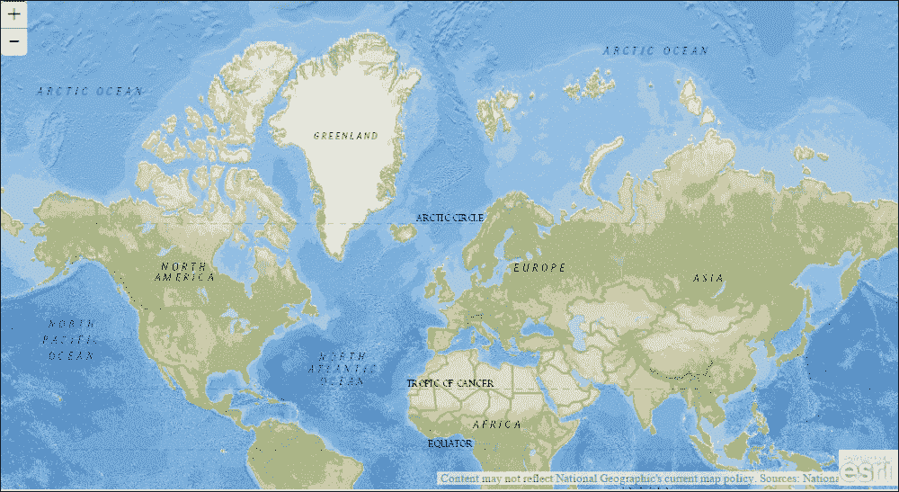
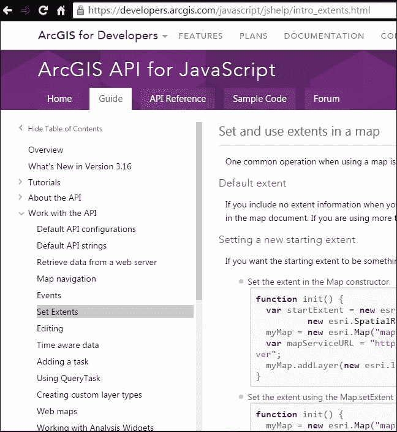
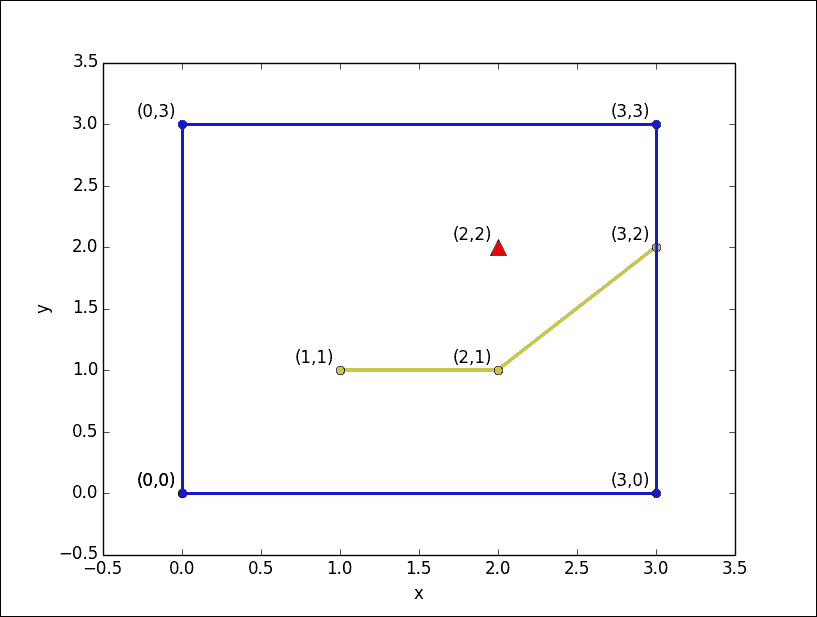
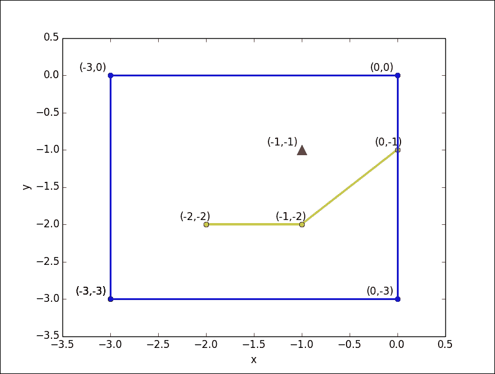
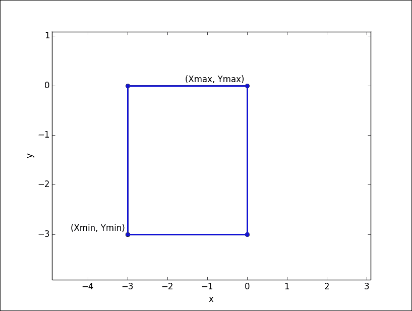
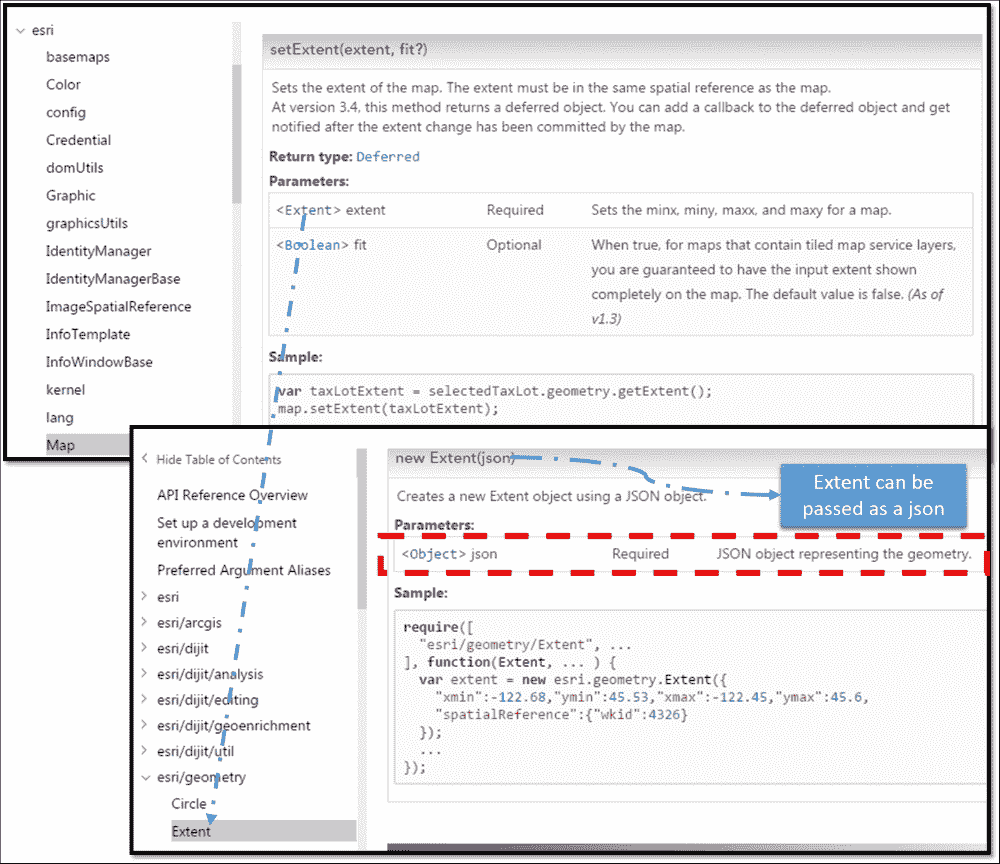
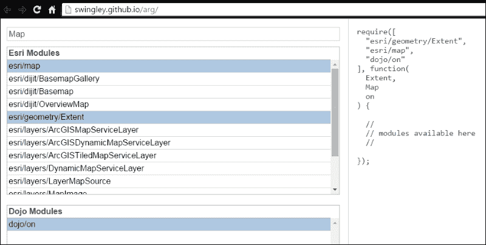
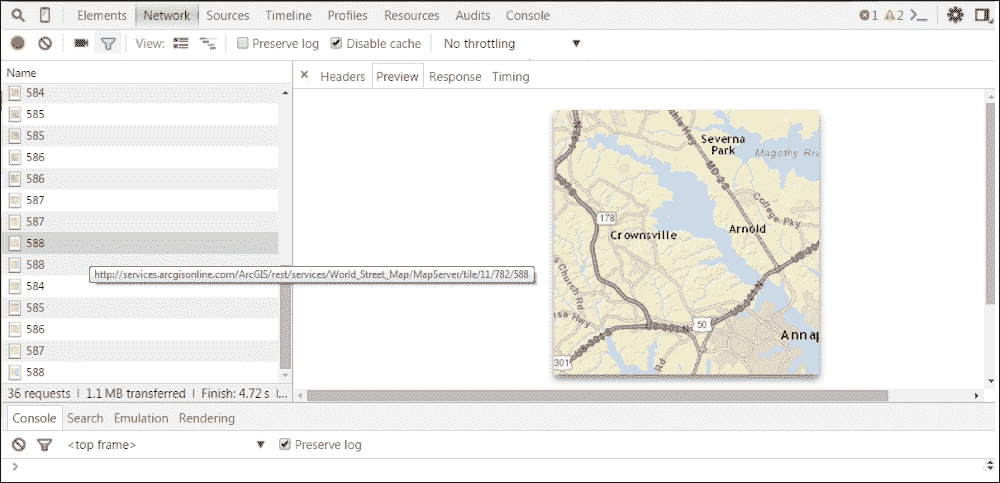
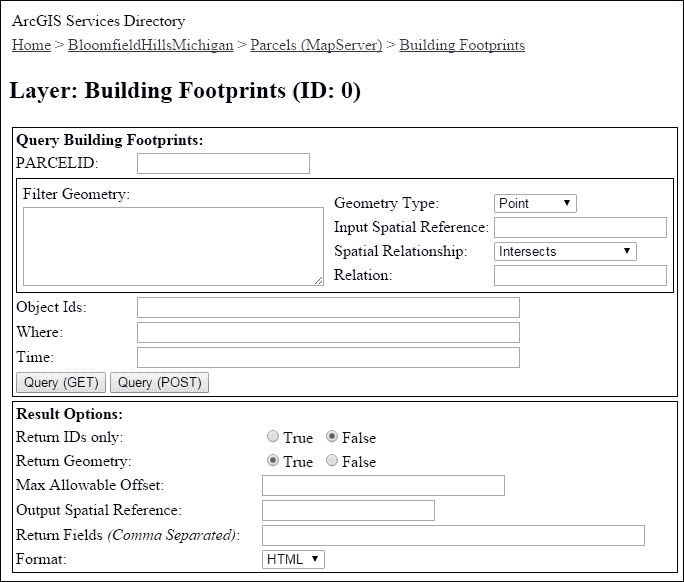
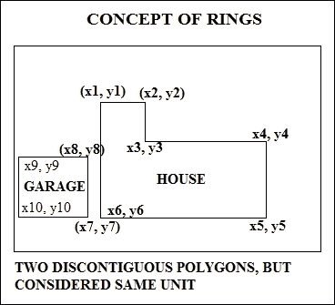

# 第一章。原料药的基础

您可能正在阅读这本书，因为您希望使用 ArcGIS JavaScript API 将空间功能集成到您的网络应用程序中，并使其更加令人惊叹，或者您可能希望很快成为网络地图数据科学家。不管是什么，我们都支持你。但是你不认为我们在进行实际项目之前需要一些基础工作吗？这一章就是关于这一点的——为本书后面使用的概念打下坚实的基础。这一章的内容设计多样，涵盖了以下主题的大量内容:

*   使用 API 编写您的第一个映射应用程序
*   复习坐标几何、范围和空间参考系统
*   介绍 dojo 和 AMD 编码模式
*   了解 ArcGIS Server 和 REST 应用编程接口
*   建立开发环境

# 设置开发环境

这本书是一本*举例*的书，我们将会用我们将要开发的应用程序来解释这些概念。因此，在本章开始时，让开发环境启动并运行是非常重要的。以下部分中提到的大多数环境只是我们的偏好，可能并不是实现本书中提供的代码示例所必需的。所有代码示例都是针对在基于 Windows 的操作系统和名为**括号**的**集成开发环境** ( **IDE** ) 中运行的。如果您对操作系统和集成开发环境有不同的选择，我们欢迎您在您最熟悉的环境中开发。

## 浏览器、网络服务器和 IDE

要开发、部署和执行任何网络应用程序，我们需要以下组件:

*   网络浏览器
*   Web 服务器
*   集成开发环境

### 网页浏览器

我们在整本书中都使用了谷歌 Chrome，因为它提供了一些很棒的开发工具和 HTML 检查工具。我们也认为 Mozilla 是一个很好的开发浏览器。

### 网络服务器

本书中开发的应用是使用 IIS Express 托管的。IIS Express 是一个轻量级的网络服务器，主要用于托管。NET 网络应用程序。尽管本书中的所有项目都是使用纯 HTML、CSS 和 JavaScript 开发的，但我们将使用 Esri。NET 资源代理来访问 ArcGIS online 安全内容并避免跨域问题。

读者可以通过安装网络平台安装程序或直接从微软下载页面安装 IIS Express，如以下步骤所示:

1.  要使用网络平台安装程序安装 IIS Express，请访问[https://www.microsoft.com/web/downloads/platform.aspx](https://www.microsoft.com/web/downloads/platform.aspx)下载网络平台安装程序。
2.  Once downloaded, search for `IIS Express` in the search text. The search results will display the IIS Express application. Click on the **Add** button against the IIS Express application name, and then click on the **Install** button at the bottom of the page as shown in the following screenshot:

    

3.  从网络平台安装程序安装 IIS Express 确保我们可以根据直接下载链接获得 IIS Express 的最新版本，而我们可能无法提供最新版本的链接。写这本书的时候，最新的 IIS 快递直接下载链接是在[https://www.microsoft.com/en-us/download/details.aspx?找到的 id=34679](https://www.microsoft.com/en-us/download/details.aspx?id=34679) 。
4.  安装 IIS 后，您可以在`Program Files`文件夹内的`IIS Express`文件夹中找到可执行文件。默认位置通常是`C:\Program Files\IIS Express`。
5.  我们将在每个项目中提供一个可执行批处理(`.bat`)文件，帮助启动网络服务器并在指定端口托管项目。
6.  你可以在我们为这本书开发的每个项目的可执行文件中找到下面一行代码:

    ```js
    "C:\Program Files\IIS Express\iisexpress.exe" /path:<app location>  /port:9098
    ```

7.  前一行将在端口`9098`托管应用程序。因此，要访问该应用程序，您只需使用网址— `http://localhost:9098/`。

### 这里

开发 JavaScript 代码的 IDE 选择范围很广，有经验的开发人员已经知道他们需要使用什么。我们在整本书中都使用了括号，这是我们首选的集成开发环境。

## 设置 ArcGIS 开发者帐户

对于书中的一些练习，您将需要一个 ArcGIS Developer 帐户。这也是您探索 ESRI 为开发人员提供的各种功能的机会。要设置开发者帐户，只需在[https://developers.arcgis.com/en/sign-up/](https://developers.arcgis.com/en/sign-up/)免费注册即可。

## 你好，地图–启动代码

如果你和我们一样，你会很可能想马上给你的第一张地图编码。这就是了。尝试将这些代码行添加到括号集成开发环境中的一个新的 HTML 文件中。也可以从代码库中下载名为`B04959_01_CODE01,`的 HTML 源代码，双击 HTML 文件运行。


在观察前面几行代码时，您可能已经观察到了这两件事:

*   我们不需要任何许可、认证或密钥来运行这段代码。换句话说，API 是免费的。你只需要使用 CDN 链接。
*   We will be seeing this beautiful cartographic map in our browser as shown in the following screenshot:

    

*   We encourage you to zoom or pan to location you want to see your map. If you haven't figured how to zoom/pan the map, we'll deal with it right away:

    左键拖动或按任意箭头键会导致平移，并且细节级别不会改变。

    *移动* +左键拖动、鼠标滚动、双击或点击地图上的 *+* 或 *-* 按钮会导致缩放和显示的细节级别发生变化。

    ### 注

    还有其他方法可以实现缩放/平移功能。这里提到的只是初步了解。

## 理解跳转代码

让我们试着理解刚才看到的代码。这段代码中有三个概念我们想解释一下。第一个是关于我们用来下载 ArcGIS JavaScript API (v 3.15)及其相关样式表的 API 或 **内容交付网络** ( **CDN** )的参考链接。第二个概念试图向您介绍所采用的编码模式，它被称为**异步模块化定义** ( **AMD** )模式。这是 dojo 的最新版本(v1.10)使用的。下一个概念是关于当您运行代码时在浏览器中看到的内容——地图和我们提供给它的参数。

### API 引用链接

首先是第一件事。我们需要引用 API 来开发一个基于 ArcGIS JavaScript API 的应用。Esri 是拥有该 API 的组织，但该 API 是免费的，可供公众使用。截至 2016 年 3 月，API 的最新版本是 3.15，相应的 dojo toolkit 版本是 1.10。

以下库可能是您使用 ArcGIS JavaScript API 功能以及许多 dojo 工具包(如`core dojo`、`dijit`、`dgrid`等)时唯一需要参考的库:

```js
<link rel="stylesheet" href="http://js.arcgis.com/3.15/esri/css/esri.css">

<script src="http://js.arcgis.com/3.15/"></script>
```

请参考此链接，了解 ArcGIS JavaScript API 的完整文档—[https://developers.arcgis.com/javascript/jsapi/](https://developers.arcgis.com/javascript/jsapi/)。

当您访问前面的网址时，您将看到一个提供完整的 API 文档的网页，其中有多个选项卡，如 **API 参考**、**指南**、**示例代码**、**论坛**和**主页**。

### 类型

**下载示例代码**

你可以从你在[http://www.packtpub.com](http://www.packtpub.com)的账户下载这本书的示例代码文件。如果您在其他地方购买了这本书，您可以访问[http://www.packtpub.com/support](http://www.packtpub.com/support)并注册，以便将文件直接通过电子邮件发送给您。

您可以按照以下步骤下载代码文件:

*   使用您的电子邮件地址和密码登录或注册我们的网站。
*   将鼠标指针悬停在顶部的 **SUPPORT** 选项卡上。
*   点击**代码下载&勘误表**。
*   在**搜索**框中输入图书名称。
*   选择要下载代码文件的书籍。
*   从您购买这本书的下拉菜单中选择。
*   点击**代码下载**。

您也可以通过点击图书网页上的“代码文件”按钮来下载代码文件。可以通过在搜索框中输入图书名称来访问此页面。请注意，您需要登录您的 Packt 帐户。

下载文件后，请确保使用最新版本的解压缩文件夹:

*   视窗系统的 WinRAR / 7-Zip
*   zipeg/izp/un ARX for MAC
*   适用于 Linux 的 7-Zip / PeaZip

API 引用列出了 API 下所有可用的模块，作为每个模块可用的详细信息、属性、方法和事件。左窗格将大多数模块分组，以便于参考。例如，名为 **esri/layers** 的分组有多个继承自它的模块。下面的截图给出了继承自**ESRI/图层**的不同模块的分组方式:


**指南**部分提供了重要主题的详细说明，如**使用查询任务**、**使用 ArcGIS Online 小部件**以及使用符号和渲染器。以下屏幕截图显示了设置地图范围的详细指南:



**示例代码**选项卡是另一个有用的部分，有数百个示例应用程序，用于演示应用编程接口中的不同概念。这些示例代码最棒的部分是它们附带了沙盒工具，您可以通过修改它来玩代码。

**论坛**选项卡将您重定向到以下网址—[https://geonet . ESRI . com/community/developers/web-developers/ArcGIS-API-for-JavaScript](https://geonet.esri.com/community/developers/web-developers/arcgis-api-for-javascript)。

GeoNet 社区论坛是一个很好的地方来问你的问题，并分享你对像你这样的开发人员提出的问题的解决方案。

由于它与 dojo 框架的紧密集成，需要 dojo 工具包的工作知识，并且可以在[http://dojotoolkit.org/reference-guide/1.10/](http://dojotoolkit.org/reference-guide/1.10/)访问它的参考文档。

### AMD 的编码模式

如果您已经观察了代码结构，它可能如下所示:


如果您不熟悉这种 JavaScript 编码模式，它被称为 AMD 编码模式，用于 JavaScript 的 ArcGIS API 强调使用这种编码模式。在最初的章节中，我们将介绍很多关于这方面的内容，以便熟悉 dojo 和 AMD。从代码结构中，您可能已经理解代码*需要*某些模块，加载这些模块的函数要求它们的顺序相同。我们案例中的一些模块是 Esri 模块(`esri/..`)和 dojo 模块(`dojo/..`)。如果你想知道你是否可以*要求*自定义模块，答案绝对是肯定的，这将是我们本书练习的主要部分。

### ESRI/地图模块

代码中突出显示的一行构成了我们跳转代码的关键:

```js
 var map = new Map("mapDiv", {
 basemap: "national-geographic"
 });

```

`map`模块接受两个参数。第一个参数是`div`容器，它将包含`map`对象。第二个参数是一个可选对象，它接受许多可用于设置地图属性的属性。

在我们的 jumpstart 代码中，可选对象中的`basemap`属性将 Esri 提供的名为`national-geographic`的底图代码之一设置为显示为背景地图。我们恳请您尝试使用 Esri 提供的其他底图，例如:

*   卫星
*   深灰色
*   浅灰色
*   混合物
*   地形图

# 设置初始地图范围

当应用程序打开时，您可能希望将其缩放到特定的感兴趣区域，而不是首先以世界比例显示地图，然后缩放到您想要查看的区域。为了实现这一点，地图模块提供了一个属性来设置它的初始范围，并且还可以在任何时候以编程方式更改它的范围。

在此之前，让我们看看什么是地图上下文中的范围。

### 注

范围是包围地图上感兴趣区域的最小边界矩形。

## 复习一些坐标几何

要理解的范围，掌握坐标几何会有所帮助。出于我们的目的，黄色线段将被称为*折线*。蓝线代表*多边形*(在我们的例子中是矩形):



现在，试着观察上图和下图的坐标差异:



以下是关于前面图表的一些注释:

*   该点仅由一对坐标表示；图 1 中的(2，2)和图 2 中的(-1，-1)
*   折线由一系列坐标表示
*   多边形也由一系列坐标表示，类似于折线

你可能已经发现，除了坐标和轴，两个图形的形状是相同的。这可能意味着两件事:

*   该图将其 *x* 位置移动了-3 个单位，其 *y* 位置移动了-3 个单位
*   或者这可能意味着原点将其 *x* 和 *y* 位置移动了-3 个单位

第二种可能性对我们来说更重要的是理解，因为它意味着图的实际位置没有改变，只有原点或坐标轴改变了位置。因此，参考坐标轴，图表形状(矩形、点和线)的坐标也发生了变化。

### 注

基于参考坐标系，同一形状可以有不同的坐标。这种坐标系在地理信息系统中被称为**空间参考**。

### 小考时间！

让我们测试一下我们的知识。尝试解决以下问题:

Q1。如果原点(矩形的左下角)是(100000，100000)，那么这个点(带有三角形符号)的坐标是多少？

Q2。由于多边形和多段线都是由一系列坐标表示的，那么在给定一系列坐标的情况下，我们如何判断形状是多边形还是多段线呢？

Q3。表示一个矩形需要多少个坐标？

考虑一下，我们很快就会给你答案。

### 空间参考系统

将数字屏幕上的世界或世界的一部分显示为地图时，就像我们的图形一样，这是一个二维表面，我们需要使用空间参考系统来识别地图上位置的坐标。有许多标准的空间参考系统在使用。我们需要知道的最起码的一点是，每个参考系统都有一个唯一的、被 API 识别的标识号。用于定义空间参考的完整参数(如使用的基准、原点坐标、使用的测量单位等)也可用于识别特定的空间参考系统。

### 注

识别安全气囊系统的唯一识别码被称为**众所周知的识别码** ( **wkid** )。

列出用于定义空间参考系统的参数的字符串被称为**知名文本** ( **wkt** )。

正如你可能已经预料到的那样，每个空间参考系统都与不同的测量系统相关联，例如英尺、米或十进制度。

例如，`4326`是全球坐标系的 wkid，称为 **WGS 84** 。该参考系统的测量单位是十进制度。

`102100`是另一个测量单位为米的全球坐标系的 wkid。

以下网址列出了在[https://developers.arcgis.com/javascript/jshelp/pcs.html](https://developers.arcgis.com/javascript/jshelp/pcs.html)和[https://developers.arcgis.com/javascript/jshelp/gcs.html](https://developers.arcgis.com/javascript/jshelp/gcs.html)的 wkids 和相应的 wkt。

### 小考成绩

A 1。(100002，100002)—相对于原点，该点在正 x 方向上距离 2 个单位，在正 y 方向上距离 2 个单位。

A 2。除非在几何对象中明确提及，否则坐标序列可以是折线或多边形。但是多边形有一个属性使其不同于折线，即第一个和最后一个坐标必须相同。多段线可以具有相同的第一个和最后一个坐标，但并非所有多段线都符合此标准。

A 3。如果你的答案是 4，那太好了！但如果你的答案是 2，那你太棒了。

没错。由于矩形的垂直属性，仅仅两个坐标就足以定义矩形。这两个坐标可以是任何一对对角相对的坐标，但是为了 API 的缘故，我们将采用左下坐标和右上坐标。左下坐标在 4 个坐标值对中具有最小的 *x* 和 *y* 坐标值，右上坐标具有最大的 *x* 和 *y* 坐标值:



### 获取当前地图范围

将地图缩放至您想要设置为地图初始范围的范围。在跳转开始代码中，映射变量是一个全局对象，因为它是在`require`函数之外声明的:

```js
<script>
    var map; //Global variable
    require([
      "esri/map"
    ],
      function (
        Map
      ) {
        map = new Map("myMap", {
          basemap: "national-geographic"
        });
});
});
</script>
```

这意味着我们可以在浏览器控制台中访问地图的属性。缩放地图和您想要作为初始地图范围的范围后，使用*Ctrl*+*Shift*+*I*命令(在 Chrome 中)打开开发人员工具。在 JavaScript 浏览器控制台中，尝试访问地图属性:`getMaxScale()`、`getMinZoom()`、`getMinScale()`、`getMaxZoom()`、`getScale()`和`extent`:


比例实际上是地图度量从真实世界度量缩小的因素。最大比例显示地图上最大的细节，最小比例的地图显示最少的细节。`map.getMaxScale()`的值小于`map.getMinScale()`的值，因为刻度值代表倒数。因此 *1/591657527 < 1/9027* (在我们的例子中，分别为 1/9027.977411 和 1/591657527.59…)。

另一方面，缩放级别是显示地图的离散比例级别。大多数涉及底图或 Tiledmaps(将在后面的章节中讨论)的地图只能以称为缩放级别的特定比例级别显示。最小缩放级别大多为`0`，与地图的最大比例相关联。

`map.getScale()`给我们当前的比例尺，`map.extent`给我们地图当前的范围。我们可以使用这个`extent`对象，使用地图中的`setExtent()`方法设置地图的范围。参考`map`模块的 API 文档，导航至地图的`setExtent`方法。`setExtent()`方法接受两个参数-`Extent`对象和可选的拟合对象。当我们点击文档中提供的超链接`Extent`对象时，它会将我们重定向到`Extent`模块的应用编程接口文档页面:



`Extent`的构造函数接受一个 JSON 对象，并将其转换为范围对象。我们可以从地图范围的 JSON 字符串中获得这个 JSON 对象:


前面的图像向我们显示了我们已经放大的地图范围的 JSON 字符串。下面的截图显示了坐标相对于我们想要放大的地图区域(用矩形突出显示)的含义:


现在，我们可以复制 JSON 对象，创建一个`Extent`对象，并为其分配地图的`setExtent`方法。但在此之前，我们需要导入`Extent`模块(`esri/geometry/Extent`)。下面的截图解释了如何实现这一点:


当我们现在刷新地图时，地图会自动放大到我们设置的范围。

### 加载模块的模板生成器

在之前的代码中，我们成功地设置了地图的初始范围，我们必须使用两个模块:`esri/map`和`esri/geometry/Extent`。随着应用程序的增长，我们可能需要添加更多的模块来为应用程序添加更多的功能。对于新手用户来说，从应用编程接口中找到模块名称并将其合并到应用程序中可能会很麻烦。这可以通过一个网络应用模板生成器轻松实现，该模板生成器可以在[http://swingley.github.io/arg/](http://swingley.github.io/arg/)找到。

以下是该应用程序的屏幕截图:



我们的`require`功能所需的模块可以输入到应用程序顶部提供的文本框中。有两个多选列表框:一个列出 Esri 模块，另一个列出 dojo 模块。一旦我们开始键入应用程序所需模块的名称，列表中就会填充与我们键入的名称相匹配的建议模块。一旦我们从任一列表框中选择了我们需要的模块，它就会被添加到`require`函数的模块列表中，并且一个适当的别名作为参数被添加到回调函数中。一旦选择了所有需要的模块，我们就可以使用应用程序右侧生成的裸骨模板。要设置地图的初始范围，您可以通过搜索以下名称来加载所需的模块:

*   地图(`esri/map`)
*   范围(`esri/geometry/Extent`)

# 了解道场和 AMD

顾名思义，AMD 的编码模式依赖于模块化您的 JavaScript 代码。您可能需要开始编写模块化代码或模块的原因有很多:

*   模块只为一个目的而写，并且是集中的
*   因此，模块是可重用的
*   模块具有更清晰的全局范围

虽然有许多用于编写模块化 JavaScript 的格式，例如 CommonJS 和 ES Harmony，但我们将只与 AMD 打交道，因为最新版本的 ArcGIS JavaScript API 及其所基于的 dojo 工具包使用了 AMD 风格的编码。Dojo loader 解析依赖关系，并在运行应用程序时异步加载模块。

## AMD 的关键成分

在这一节中，我们将看看`define`和`require`方法，这是 AMD 的关键组成部分。

### 定义方法

`define`方法定义一个模块。一个模块可以有自己的私有变量和函数，只有`define`函数返回的那些变量和函数才会被导入该模块的其他函数暴露。`define`方法的一个例子如下:


请注意我们的代码示例中的以下内容:

*   `define`方法中的第一个参数是模块名称或 ID。这是可选的。`dojoGreeting`是我们模块的名字。
*   第二个参数是我们模块的依赖数组。我们不需要这个模块的任何依赖项，所以我们只传递一个空数组。
*   第三个参数是一个回调函数，它接受我们可能已经加载的依赖项的任何别名。请注意，用作函数参数的别名的顺序应该与依赖数组中定义的顺序相同。因为我们没有使用任何依赖项，所以我们没有向这个回调函数传递任何东西。
*   在回调函数内部，我们可以根据需要拥有任意多的私有变量和函数。我们希望从这个模块中公开的任何变量或函数都应该包含在定义函数中的`return`语句中。
*   在我们的示例中，`_dojoGreeting`是一个私有范围的变量，由`define`方法返回。

### 要求的方法

`require`方法使用自定义模块或外部库中定义的模块。让我们使用刚刚用`require`方法定义的模块:


差不多了。密切关注`require`方法的参数:

*   第一个参数是模块依赖关系的数组。第一个模块依赖是我们刚刚定义的自定义模块，`dojoGreeting`。
*   `dojo/dom`模块让我们与 HTML 中的`dom`元素进行交互。
*   `dojo/domReady!`是一个 AMD 插件，会等到 DOM 加载完毕再返回。请注意，该插件在末尾使用了一个特殊字符“`!`”。我们不需要在回调函数中指定别名，因为它的返回是没有意义的。因此，这应该是依赖数组中最后使用的模块之一。
*   回调函数分别使用`dojoGreeting`和`dom`作为`dojoGreeting`和`dojo/dom`模块的别名。如前所述，我们不需要使用`dojo/domReady!`的别名。
*   `dom`模块的`byId()`方法通过其标识返回一个`dom`节点的引用。这非常类似于`document.getElementById()`，只是`dom.byId()`可以在所有浏览器上运行。
*   在我们的注册方法中，我们假设我们有一个`div`元素，它的 ID 为`greeting`。

## 一些牛逼的道场模块

你已经被介绍了两个道场模块，即`dojo/dom`和`dojo/domReady`。现在，是时候熟悉一些其他令人敬畏的`dojo`模块了，在编写 ArcGIS JS API 应用程序时，您应该尽可能使用这些模块。坚持使用纯 dojo 和 Esri JS 模块将在代码完整性和跨浏览器一致性方面带来巨大的回扣。还有什么？就常用的 JavaScript 功能而言，Dojo 为您带来了一些惊喜，其中一些我们将很快介绍。

### 道场 dom 模块

您已经使用了模块。但是还有其他道场`dom`模块，可以让你操纵和使用`dom`节点:

*   `dojo/dom-attr`:这是与`dom`属性相关的任何内容的定位模块:
    *   模块中的`has()`方法检查给定节点中是否存在属性
    *   `get()`方法返回所请求属性的值，如果该属性没有指定值或默认值，则返回空值
    *   正如您可能已经猜到的，有一种`set()`方法可以用来为属性设置值
*   `dojo/dom-class`:这个模块提供了你需要对与`dom`节点相关联的 CSS 类进行的大部分操作
*   `dojo/dom-construct`:`dojo/dom-construct`模块让你轻松构建 `dom`元素

### Dojo 事件处理程序模块

`dojo/on`模块是大多数浏览器都支持的事件处理程序模块。`dojo/on`模块可以处理大多数对象类型的事件。

### 道场阵模块

出于各种原因，比起原生的 JavaScript 数组函数，您应该更喜欢 dojo 的数组模块。Dojo 的数组模块名为`dojo/_base/array`。

#### 道场/_ 基地/阵

正如您从数组模块中所期望的，有一个称为`forEach()`的迭代器方法，以及`indexOf()`和`lastIndexOf()`方法。最精彩的部分来了。有一个`filter()`方法返回一个由特定条件过滤的数组。我们发现`map()`方法是一个宝石，因为它不仅迭代一个数组，而且允许我们修改回调函数中的项目并返回修改后的数组。有没有想过检查数组中的每个元素或至少一个元素是否满足特定条件？查看本模块中的`every()`和`some()`方法。

这个示例代码解释了 dojo 数组模块的两个主要方法:


上述代码将以下内容打印到浏览器的控制台窗口:

```js
Day #1 is Monday
Day #2 is Tuesday
Day #3 is Wednesday
Day #4 is Thursday
Day #5 is Friday
Day #6 is Saturday
Day #7 is Sunday
```

# 了解 ArcGIS Server 和 REST 应用编程接口

ArcGIS Server 是一款 Esri 产品，用于通过网络共享地理空间数据来启用 WebGIS。我们的 JavaScript API能够通过 REST API 消费这个服务器公开的大量服务。这仅仅意味着 ArcGIS Server 公开的所有这些服务都可以通过网址获得。现在，让我们看看 REST API 接口是如何对开发人员如此有帮助的。

## 服务类型

当你运行本书给出的第一个代码时，你在网页上看到了一张地图。您在浏览器中看到的地图实际上是拼接在一起的图像集合。如果您在加载地图时观察了开发人员工具中的**网络**选项卡，您就会意识到这一点。单个图像被称为T5 瓷砖。这些切片也由 ArcGIS 地图服务器提供服务。这里有一个这样的图块的网址:[http://server . ArcGIS online . com/ArcGIS/rest/services/World _ Street _ Map/MapServer/tile/2/1/2](http://server.arcgisonline.com/ArcGIS/rest/services/World_Street_Map/MapServer/tile/2/1/2)。

这只是意味着通过 ArcGIS Server 发布并可用于应用编程接口的任何资源都是通过一个网址，如下图所示:



### 注

ArcGIS 服务端点将具有以下格式:`<ArcGIS_Server_Name>/ArcGIS/rest/services/<Folder_Name>/ <ServiceType>`。

ArcGIS Server 提供了一个用户界面来查看这些 REST 端点。这个界面通常被称为**服务目录**。

服务目录是开发者在计划使用特定的地理信息系统服务之前需要参考的东西。服务目录支持多种格式，如 JSON 和超文本标记语言，超文本标记语言是默认格式。如果您无法查看服务目录，您需要联系您的地理信息系统管理员，以便为您感兴趣的服务启用服务浏览功能。

## 使用服务目录

让我们探索一个由 Esri 提供的名为`sampleserver3.arcgisonline.com`的示例地理信息系统服务器。

要查看任何地理信息系统服务器的服务目录，语法为`<GIS Server Name>/ArcGIS/rest/services`。

所以我们需要导航到的网址是:[http://sampleserver3.arcgisonline.com/ArcGIS/rest/services](http://sampleserver3.arcgisonline.com/ArcGIS/rest/services)。

您将在浏览器中看到此屏幕:


服务目录中感兴趣的项目是**文件夹**标题标签下的链接列表和**服务**标题标签下的链接列表。我们鼓励您导航到这些链接中的每一个，并查看它们公开的服务类型。您会发现以下类型的服务:

*   **地图服务器**:服务地理空间数据
*   **功能服务器**:启用编辑功能
*   **图像服务器**:提供图像切片

我们没有提到服务目录支持多种格式，比如 JSON 吗？我们建议您在 URL 的末尾追加一个查询字符串参数，如`?f=json`。要以 HTML 形式查看服务目录，只需从网址中删除查询字符串参数。

### 地图服务器

地图服务器将地理信息系统数据公开为一个 REST 端点。

让我们探索一下文件夹`BloomfieldHillsMichigan`中名为`Parcels`的特定地图服务器。导航到此网址:[http://sampleserver3 . ArcGIS online . com/ArcGIS/rest/services/Bloomfield hills Michigan/packages/MapServer](http://sampleserver3.arcgisonline.com/ArcGIS/rest/services/BloomfieldHillsMichigan/Parcels/MapServer)。

以下标题标签是我们特别感兴趣的:图层、表格和描述。现在，让我们深入研究地图服务器中的一个图层。这三层都值得浏览。出于解释的目的，我们选择第一个图层(图层 ID: `0`)，可以使用以下网址直接导航到该图层:[http://sampleserver 3 . ArcGIS online . com/ArcGIS/rest/services/Bloomfield hills Michigan/Parcels/MapServer/0](http://sampleserver3.arcgisonline.com/ArcGIS/rest/services/BloomfieldHillsMichigan/Parcels/MapServer/0)。

这个网址中列出的所有标题标签都值得思考。我们将讨论其中的一些:

*   **几何类型**描述特定图层的几何类型。在我们正在调查的网址中，它被命名为`'esriGeometryPoint'`，这意味着它是一个点特征。
*   `'Description'`、`'Copyright Text'`等元数据。
*   标签`'Extent'`和`'Spatial Reference'`下数据的地理范围信息。
*   `Drawing Info`标签定义了数据在地图上的呈现方式。
*   `'Fields'`展示了我们层的表模式。实际的字段名与字段类型和字段别名一起被提及。别名和字段类型信息是对数据执行查询所必需的。`'esriFieldTypeString'`和`'esriFieldTypeSmallInteger'`的字段类型分别表示该字段应被视为字符串和数字。`'esriFieldTypeOID'`是一种特殊类型的字段，用于保存图层中要素的唯一对象标识。

#### 查询端点

在页面的底部，将有一个名为**支持的操作**的标题标签，列出了到该层暴露的各种端点的链接。可能会有一个名为**查询**的文本链接。这个链接是我们钻研 ArcGIS Server 和 REST 端点的原因。点击链接或使用以下直接网址导航至该链接:[http://sample server 3 . ArcGIS online . com/ArcGIS/rest/services/Bloomfield hills Michigan/Packets/Mapserver/0/query](http://sampleserver3.arcgisonline.com/ArcGIS/rest/services/BloomfieldHillsMichigan/Parcels/MapServer/0/query)。



用户界面为我们提供了所有可能的方式来查询特定的图层(**建筑足迹**)。查询操作似乎支持空间查询和平面表查询。到目前为止，让我们只讨论平面表查询。**字段和**返回字段(逗号分隔)**是处理平面表查询的字段。其中**字段接受标准的 SQL `where`子句作为输入，**返回字段**接受需要作为输出的字段名称的逗号分隔值。但是我们是处于这个开发阶段的探索者，我们只需要看看这个接口返回的数据是什么样的。将下列值输入相应的文本框:****

 ***   **哪里** : `1 = 1`
*   **返回字段** : `*`

点击**查询(获取)**按钮，滚动至屏幕底部。

该查询从字面上返回数据库中所有字段的所有图层数据，但 ArcGIS 服务器将结果限制为 1000 个要素。请注意，浏览器网址已更改。以下 URL 是用于激发此查询的 REST GET 请求 URL:[http://sample server 3 . ArcGIS online . com/ArcGIS/REST/services/Bloomfield hills Michigan/Packets/Mapserver/0/query？text =&geometry =&geometry type = esrigeometripoint&inSR =&spatialRel = esrispatialrinerts&relationParam =&objectIds =&其中= 1% 3d 1&time =&returnIdsOnly = false&return geometry = true&maxAllowableOffset =&outer =&outfield = *&f = html](http://sampleserver3.arcgisonline.com/ArcGIS/rest/services/BloomfieldHillsMichigan/Parcels/MapServer/0/query?text=&geometry=&geometryType=esriGeometryPoint&inSR=&spatialRel=esriSpatialRelIntersects&relationParam=&objectIds=&where=1%3D1&time=&returnIdsOnly=false&returnGeometry=true&maxAllowableOffset=&outSR=&outFields=*&f=html)。

下面的网址，从前面的网址中删除所有可选的和未定义的查询参数，也将产生相同的结果:http://sample server 3 . ArcGIS online . com/ArcGIS/rest/services/Bloomfield hills Michigan/Packets/Mapserver/0/query？其中=1%3D1 &外场=* & f=html 。

现在，让我们通过缩小`Where`子句的范围来进一步分析结果数据。注意结果中第一个特征的 **OBJECTID** 字段:

1.  删除`Where`子句文本框中的值。
2.  在对象标识文本框中输入标注的**对象标识**。我们注意到的对象标识是 **5991** (但你完全可以选择任何一个)。
3.  有一个标有格式的下拉列表。选择名为`'json'`的下拉值
4.  点击**查询(获取)**按钮。

或者，下面是实现同样操作的直接 URL:[http://sample server 3 . ArcGIS online . com/ArcGIS/rest/services/Bloomfield hills Michigan/Packets/Mapserver/0/query？objectIds = 5991 outfields = *&f = pj son](http://sampleserver3.arcgisonline.com/ArcGIS/rest/services/BloomfieldHillsMichigan/Parcels/MapServer/0/query?objectIds=5991outFields=*&f=pjson)。

现在，结果看起来非常详细。我们看到的是单个特征的数据。JSON 用键返回几个特征键值对，如`displayFieldName`、`fieldAliases`、`geometryType`、`spatialReference`、`fields`和`features`。

我们来看看`feature`键值对。`features`键的值是一个对象数组。每个对象都有名为`attributes`和`geometry`的键。属性保存列出字段名键值及其值的对象的值。在我们的例子中，`PARCELID`是字段名，`"1916101009"`是它的值:


几何对象用环形对象数组表示面要素。每个环都是浮点数的数组。我们之前讨论过多边形只是一组坐标。但是 ArcGIS Server 将多边形视为一组环。要理解环的概念，请查看下图:



在前面的插图中，我们处理了两个不相交的多边形，但它在现实世界中被认为是一个单一的单元，例如房子和车库。ArcGIS 用两个圆环表示面要素。第一个环由称为[[x1，y1]，[x2，y2]，…[x6，y6]]的坐标组成，第二个环由称为[[x7，y7]的坐标组成，..[x10，y10]]。

# 总结

我们使用了 ArcGIS JS API 的 CDN 来访问该 API，并尝试理解地图和 Esri 几何模块。我们试图通过复习坐标几何知识来更好地理解范围和空间参考。我们现在知道，范围只是可以使用两个坐标定义的最小边界矩形，空间参考系统类似于图形上的坐标轴。我们试图查看 dojo 工具包提供的一些令人惊叹的模块，我们必须考虑在代码中使用这些模块。ArcGIS Server 将其 GIS 数据和其他资源公开为 REST API，即以 URL 的形式提供。您还了解到，在开始通过应用编程接口使用任何服务之前，开发人员必须始终查阅服务目录。在本书中，我们在开发环境的方式中为项目的工作设定了我们的偏好。下一章将讨论应用编程接口中使用的不同类型的层，以及每种类型使用的理想环境。我们还将介绍 Esri 提供的一些最常用的内置小部件，我们将在应用程序中使用它们。**