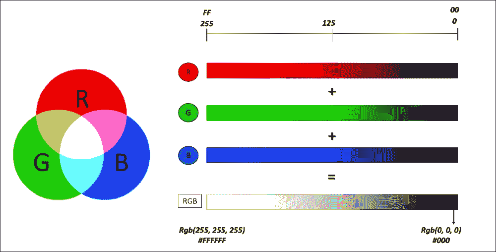
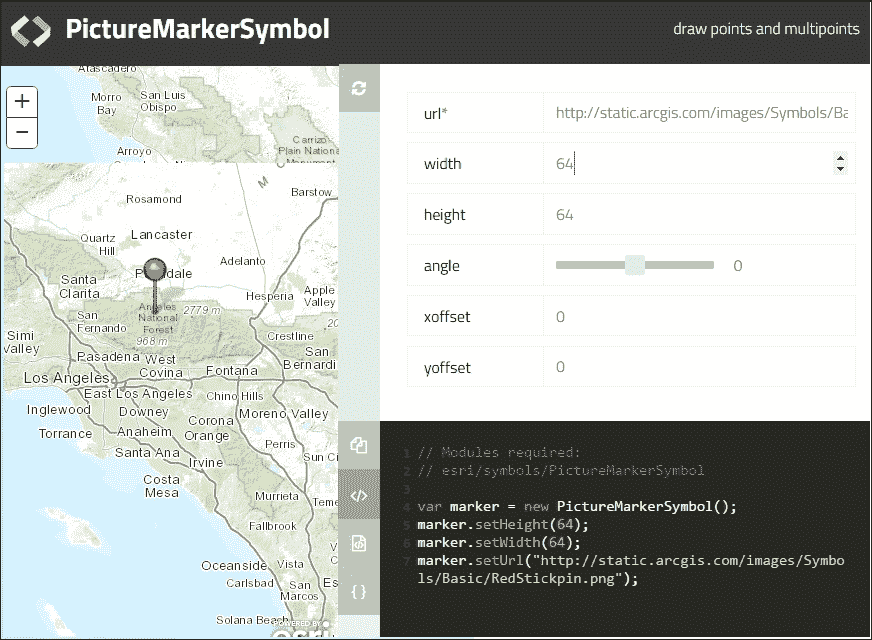
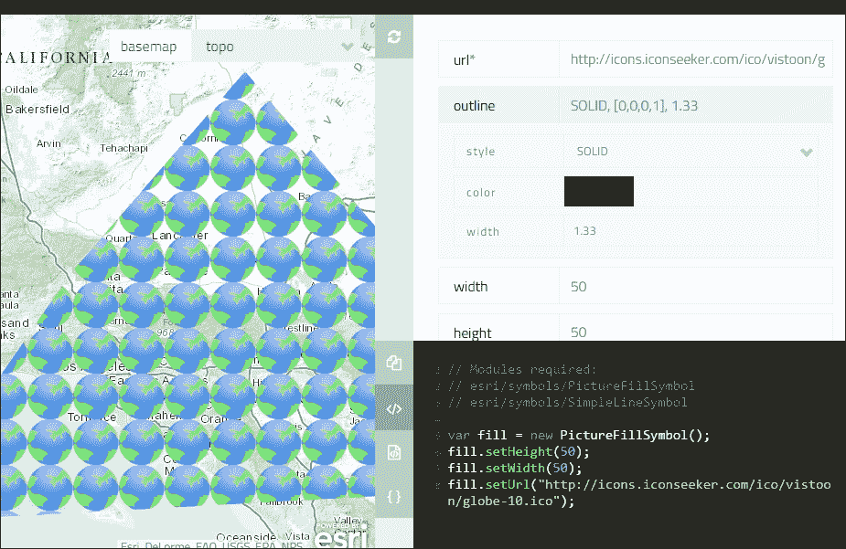
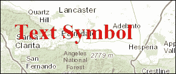
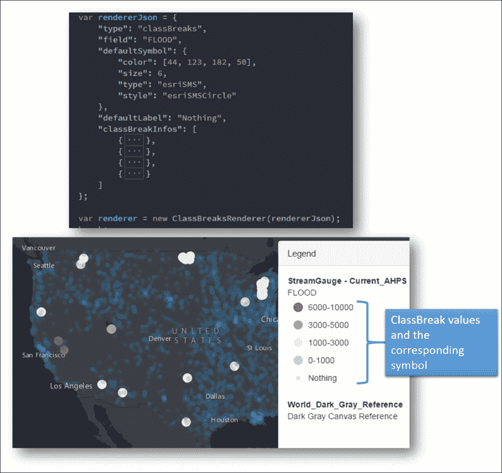
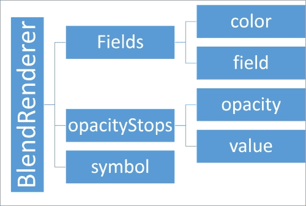

# 五、使用渲染器

渲染器为我们提供了一种媒介，可以使用不同的符号和颜色直观地可视化数据。渲染器不仅仅是一种数据可视化技术，它越来越被视为一种数据分析工具。正确使用渲染器将帮助我们看到数据中的空间模式，并显示各种现象的地理分布。对基础制图、色彩理论甚至统计学的理解将帮助我们创建更好的渲染器，并最终更好地洞察可用数据。本章将涵盖以下主题:

*   了解 API 提供的不同符号和颜色
*   学习如何创建`SimpleRenderer`方法
*   学习如何高效地创建`UniqueValueRenderer`方法
*   学习何时使用`ClassBreakRenderer`和`HeatmapRenderers`
*   讨论`ScaleDependantRenderers`有用的场景
*   智能地图简介

# 使用颜色

处理颜色的 Esri 模块称为`esri/Color`。在处理颜色模块之前，让我们对颜色有一个基本的了解。

## RGB 颜色模型

可见光谱中的任何颜色(紫色到红色之间的颜色范围)都可以使用红色(R)、绿色(G)或蓝色(B)的组合来表示。这就是众所周知的 **RGB 颜色模型**。也有其他的颜色模型，但是现在让我们继续使用 RGB 颜色模型。并且每种颜色 R、G 或 B 可以用从 0 到 255 的标度来表示。

下图显示了三原色(R、G 和 B)及其叠加效果之间的关系:



当三种颜色(R、G 和 B)以相等的比例混合时，合成的颜色总是位于灰度级的某个位置。以下几点值得注意:

*   例如，如果`R = 0`、`G = 0`和`B = 0`的水平，混合物产生黑色。
*   如果`R = 255`、`G = 255`和`B = 255`，混合物产生白色。
*   Any other number values, when mixed equally, produce a shade of grey.

    例如`R = 125`、`G = 125`、`B = 125`则为灰色。

*   颜色模型还显示，当红色和绿色混合在一起(`R = 255`、`G = 255`、`B = 0`)时，我们会变成黄色。
*   当红色和蓝色单独混合时(`R=255`、`G= 0`和`B=255`，我们得到洋红色。
*   当绿色和蓝色混合时，我们得到青色(`R=0`、`G=255`和`B= 255`)。

## Esri 颜色模块

要使用 RGB 颜色模型定义颜色，可以使用以下格式:

```js
var r = g = b = 125;
var color = new Color([r, g, b]);
```

在前面的片段中，`color`是`esri/Color`模块的一个实例，`r`、`g`和`b`分别是红色、绿色和蓝色的值。颜色应始终按(`r`、`g`、`b`)排序，并作为数组对象添加。不出所料，`color`变量存储灰色。如果需要给颜色增加透明度，可以定义称为`alpha`的透明度值，它是介于`0`和`1.0`之间的整数，其中`0`表示完全透明，`1.0`表示无透明。阿尔法值将作为数组中的第四个值相加:

```js
define(["esri/Color"], function(Color){
var r = g = b = 100;
var alpha = 0.5; // 50 % transparency
var color2 = new Color ([r, g, b, alpha]);
})
```

RGB 值可以表示为十六进制数。例如`[255, 0, 0]`可以表示为`#FF0000`。该应用编程接口还允许我们通过其英文命名字符串来表示颜色，例如:`blue`:

```js
define(["esri/Color"], function(Color){
var colorString = "red";
var colorHex = "#FF0000"; 
var color1 = new Color(colorString);
var color2 = new Color(colorHex);
```

# 使用符号

符号基于他们试图象征的几何图形。因此，用于表示点、线和多边形的符号彼此不同。除了几何图形之外，定义符号所需的三个重要参数如下:

*   风格
*   颜色
*   尺寸

样式通常作为模块常量提供。例如，`SimpleLineSymbol.STYLE_DASHDOT`、`SimpleFillSymbol.STYLE_SOLID`、`SimpleMarkerSymbol.STYLE_CIRCLE`，其中`SimpleLineSymbol`、`SimpleFillSymbol`和`SimpleMarkerSymbol`分别是用于符号化线、面和点要素的模块:

*   这些符号的颜色可以由前面讨论的颜色模块来定义。
*   尺寸或大小根据几何类型有不同的含义。例如，对于线符号，我们使用称为`width`的参数来表示线的厚度，而对于点，我们使用名为`size`的参数来定义其尺寸。

先讨论一下三个基于几何的符号，然后再来处理非基于几何的特殊符号。

基于几何的符号如下:

*   `SimpleLineSymbol`:这是用来象征线条几何
*   `SimpleMarkerSymbol`:用于象征点几何
*   `SimpelFillSymbol`:这是用来象征多边形几何

## 单纯性符号

线符号构造函数是最简单的，因为它可以用三个参数定义，即样式、颜色和宽度。

<colgroup><col style="text-align: left"> <col style="text-align: left"></colgroup> 
| 

名字

 | 

价值

 |
| --- | --- |
| 模块名 | `esri/symbols/SimpleLineSymbol` |
| 构造器 | `new SimpleLineSymbol(style, color, and width)` |

`style`是一个模块常数。模块提供了以下样式:

*   `STYLE_DASH`(创建由虚线组成的线条
*   `STYLE_DASHDOT`(到创建点划线图案的线条)
*   `STYLE_DOT`(创建由点组成的线

该模块提供其他样式常量，如`STYLE_LONGDASH`、`STYLE_LONGDASHDOT`、`STYLE_NULL`、`STYLE_SHORTDASH`、`STYLE_SHORTDASHDOT`、`STYLE_SHORTDASHDOTDOT`、`STYLE_SHORTDOT`、`STYLE_SOLID`。

`STYLE_SOLID`为默认样式，提供不间断的实线。

我们可以使用`simpleLineSymbol.setColor(color)`方法设置线条的颜色；这里，`color`是 Esri `Color`对象，`simpleLineSymbol`是`SimpleLineSymbol`对象的一个实例。可以使用`setStyle(style)`方法设置`style`常数。`SimpleLineSymbol.toJson()`是将`SimpleLineSymbol`转换为 ArcGIS Server JSON 表示的重要方法。

以下代码片段将创建一条红色实线:

```js
var simpleLineSymbol = new SimpleLineSymbol();
var color = new Color("red");
simpleLineSymbol.setColor(color);
simpleLineSymbol.setWidth(2);
```

## 简单标记符号

`SimpleMarkerSymbol`方法是用来象征一个点。象征一个点几何图形比象征一条线具有额外的复杂性，因为它接受一个轮廓参数，该参数本身就是一个`SimpleLineSymbol`对象。


<colgroup><col style="text-align: left"> <col style="text-align: left"></colgroup> 
| 

名字

 | 

价值

 |
| --- | --- |
| 模块名 | `esri/symbols/SimpleMarkerSymbol` |
| 构造函数: | `new SimpleMarkerSymbol(style, size, outline, color)` |

模块提供了以下样式常量:

*   `STYLE_CIRCLE`
*   `STYLE_DIAMOND`
*   `STYLE_SQUARE`

`setAngle(angle)`方法将符号围绕其中心顺时针旋转指定的角度。`setColor(color)`方法设置符号`color`。`setOffset` ( `x`和`y`)以屏幕单位设置标记的`x`和`y`偏移。`setOutline(outline)`设置标记符号的轮廓。`setSize(size)`让我们以像素为单位设置标记的大小。`setStyle(style)`设置标记符号样式。`toJson()`将对象转换为其 ArcGIS Server JSON 表示。

## ArcGIS 符号游乐场

如果为符号选择适当的颜色和样式以及其他属性似乎是一个困难的选择，下面的网页试图通过提供一个沙箱来帮助您生成任何类型的符号以及在代码中定义类似符号所需的代码。网页位于[网站。](http://developers.arcgis.com/javascript/samples/playground/index.html)

导航到这个网址会让你进入一个类似下面截图的页面。我们可以选择几乎任何类型的符号:


选择其中一个将导航到另一个页面，您可以在其中选择属性并生成符号系统代码。


好了，我们轻松生成了生成半透明、红色、菱形`SimpleMarkerSymbol`(无轮廓)所需的代码:

```js
// Modules required: 
// esri/symbols/SimpleMarkerSymbol
// esri/symbols/SimpleLineSymbol

var marker = new SimpleMarkerSymbol();
marker.setStyle(SimpleMarkerSymbol.STYLE_DIAMOND);
marker.setColor(new Color([255, 0, 0, 0.55]));
marker.setSize(25);
```

## 简单填充

`SimpleFillSymbol`模块帮助我们为多边形生成符号系统。

*   模块名称:`esri/symbols/SimpleFillSymbol`
*   `new SimpleFillSymbol(style, outline, color)`

这里给出了`STYLE`参数的一些模块常数:

*   `STYLE_BACKWARD_DIAGONAL`
*   `STYLE_CROSS`
*   `STYLE_NULL`

`SimpleFillSymbol.STYLE_SOLID`为默认造型。

## PictureMarkerSymbol

当我们需要描绘一个图标来象征一个点几何图形时，我们可以使用这个模块。我们不需要提供颜色信息作为参数，而是需要一个图像网址来显示图片作为标记符号。

<colgroup><col style="text-align: left"> <col style="text-align: left"></colgroup> 
| 

名字

 | 

价值

 |
| --- | --- |
| 组件 | `esri/symbols/PictureMarkerSymbol` |
| 构造器 | `new PictureMarkerSymbol(url, width, height)` |

搜索合适的 `PictureMarkerSymbol`得到了一个网页的帮助，该网页位于[。](http://developers.arcgis.com/javascript/samples/portal_symbols/index.html)

导航到此网址将打开一个页面，如下所示。选择图片图标后，下面会生成一个代码。该代码可重复使用，重新创建`PictureMarkerSymbology`作为网页中选择的代码。

生成的代码是`PictureMarkerSymbol`的 JSON 表示。JSON 对象提供了以下属性:

*   `angle`
*   `xoffset`
*   `yoffset`
*   `type`
*   `url`
*   `contentType`
*   `width`
*   `height`
*   `imageData`

其中`imageData`和`url`是多余的，如果可以使用 URL 属性的话，可以避开`imageData`属性。`imageData`属性只是图像的`Base64`表示。为了避免这种情况，我们可以取消选中网页右上角的框，内容类似**启用 Base64 编码**。

另外，如果`angle`、`xoffset`和`yoffset`的值为 0，我们也可以省略这些。


使用本网页和 ArcGIS Symbol 游乐场中提供的图标的 URL 将使我们能够进一步自定义`PictureMarkerSymbol`。



要自定义`PictureMakerSymbol`，请使用以下命令:

```js
// Modules required: 
// esri/symbols/PictureMarkerSymbol

var marker = new PictureMarkerSymbol();
marker.setHeight(64);
marker.setWidth(64);
marker.setUrl("http://static.arcgis.cimg/Symbols/Basic/RedStickpin.png");
```

### 象形文字符号

`PictureFillSymbol`更进一步让我们用图像填充多边形几何图形。



### 文字符号

可以生成文本符号来代替标签。文字符号缺少几何图形，需要附加到几何图形上。



以下从 ArcGIS Symbol 游乐场生成的片段演示了生成`TextSymbol`的组件:

```js
// Modules required: 
// esri/symbols/TextSymbol
// esri/symbols/Font

var font = new Font();
font.setWeight(Font.WEIGHT_BOLD);
font.setSize(65);
var textSym = new TextSymbol();
textSym.setFont(font);
textSym.setColor(new Color([255, 0, 0, 1]));
textSym.setText("Sample Text");
```

# 使用渲染器

当应用使用从网络地图或地理信息系统服务中引用的图层时，网络地图或服务本身会提供默认的绘图属性，这些属性决定了图层的绘制方式。开发人员可以通过使用颜色、符号和渲染器来更改和增强功能的显示方式，从而选择覆盖此行为。

您可以使用`setSymbol()`方法将符号应用于单个图形。当您想要将符号系统应用于动态图层、要素图层或图形图层中的所有图形时，可以使用渲染器。

渲染器可以使用单个符号或基于属性值的多个符号来快速符号化多个要素。

ArcGIS 应用编程接口中的几个可用于 JavaScript 的渲染器如下:

*   `SimpleRenderer`:这个对一个图层中的所有图形应用相同的符号
*   `UniqueValueRenderer`:此基于每个图形的唯一属性值应用特定的符号
*   `ClassBreaksRenderer`:此根据属性值的范围应用不同大小或颜色的符号
*   `DotDensityRenderer`:这个显示了离散空间现象的空间密度的变化
*   `HeatmapRenderer`:此将点数据转换为光栅显示，使用模糊半径和强度值显示高密度或加权浓度区域
*   `TemporalRenderer`:这将实时或历史观察可视化在地图的当前范围内，考虑相对特征老化和观察到的事件发生的轨迹，例如飓风
*   `ScaleDependentRenderer`:这将基于地图的当前比例对同一图层应用不同的渲染器

## 为场景选择渲染器

API 文档中的符号和渲染器指南为使用符号和渲染器提供了很好的指导。文档可在[访问。](https://developers.arcgis.com/javascript/jshelp/inside_renderers.html)

`UniqueValueRenderer` 和`ClassBreaksRenderer`是基于属性的渲染器。这意味着属性值决定了要素的符号化方式。要确定在给定情况下是使用`UniqueValueRenderer`还是`ClassBreaksRenderer`，请考虑需要执行分类的字段值的性质。

### 注

如果要渲染的字段上的唯一值集很小且不连续，请考虑使用`UniqueValueRenderer`。

如果要渲染的字段上的唯一值集有很大的范围和/或是连续的，考虑使用`ClassBreaksRenderer`。

`UniqueValueRenderer`和`ClassBreaksRenderer`具有`defaultSymbol`属性，当值或中断无法匹配时使用。在开发过程中，您可以使用带有高对比度颜色的默认符号来快速验证是否有任何特征与渲染器的标准不匹配。

## 开发测流应用

我们将开发一个 Stream Gauge 应用来演示如何使用以下渲染器:

*   简单渲染器
*   唯一值渲染器
*   分班渲染器
*   Heatmap 渲染器

### 数据来源

河流测量数据是由 Esri 提供的，作为他们的世界门户活地图的一部分。这意味着我们需要有一个 ArcGIS Developer 登录才能访问内容。流测量数据的地图服务的网址是[。](http://livefeeds.arcgis.com/arcgis/rest/services/LiveFeeds/StreamGauge/MapServer/)

地图服务提供美国各地的测流计读数，这些读数描绘了测量区域的当前水位。我们正在尝试开发的应用试图在仪表数据上演示不同的渲染技术。下一部分即将到来的快照提供了我们在本章结束时开发的最终应用的粗略再现。

如果您没有 ArcGIS Developer 帐户，请参考[第 3 章](3.html "Chapter 3. Writing Queries")、*编写查询*，了解如何注册帐户并在应用代理中使用凭据的说明。

## 简单渲染器

简单渲染器是由`esri/renderers/SimpleRenderer`模块提供的，它的构造器接受任何合适的符号或者一个 JSON。由于所有仪表位置都是点位置，我们将使用`SimpleMarkerSymbol`来符号化它们。

既然已经讨论了如何从其对应的模块构建`PictureMarkerSymbol`，我们将看到如何使用符号的 JSON 形式。使用符号的 JSON 表示意味着我们不再需要为每个符号和颜色分别加载模块。以下快照显示了 JSON 是如何在`SimpleRenderer`构造函数中形成和使用的:


在前面的代码中，渲染器被分配`SimpleRenderer`后，必须使用`setRenderer()`方法将渲染器对象设置为要素图层。此外，一旦将渲染应用到要素图层，图例应被刷新:

```js
streamLyr.setRenderer(renderer);
streamLyr.redraw();
legend.refresh();
```

## 应用唯一值渲染器

唯一值渲染器是由`esri/renderers/UniqueValueRenderer`模块提供的。唯一值渲染器允许我们为数据中的一组唯一值定义不同的符号。最多可以提供三个属性字段来确定数据的唯一性。唯一值渲染器需要`uniqueValueInfos`对象。该对象基本上是唯一值和用于表示该值的符号之间的映射。因此，具有特定值的所有要素将由相应的映射符号呈现。我们可以向渲染器提供`defaultSymbol`对象，该对象将用于符号化`uniqueValueInfos`对象中未定义的任何值。下面是唯一值渲染器对象的 JSON 表示，它象征着洪水阶段的唯一值。我们所象征的洪水阶段的独特价值如下:

*   `major`
*   `moderate`
*   `minor`
*   `action`

    ```js
    var rendererJson = {
      "type": "uniqueValue",
      "field1": "STAGE",
      "defaultSymbol": {},
      "uniqueValueInfos": [{
        "value": "major",
        "symbol": {
          "color": [163, 193, 163],
          "size": 6,
          "type": "esriSMS",
          "style": "esriSMSCircle"
        }
            }, {
        "value": "moderate",
        "symbol": {
          "color": [253, 237, 178],
          "size": 6,
          "type": "esriSMS",
          "style": "esriSMSCircle"
        }
            }, {
        "value": "minor",
        "symbol": {
          "color": [242, 226, 206],
          "size": 6,
          "type": "esriSMS",
          "style": "esriSMSCircle"
        }
            }, {
        "value": "action",
        "symbol": {
          "color": [210, 105, 30],
          "size": 6,
          "type": "esriSMS",
          "style": "esriSMSCircle"
        }
      }]
    };
    var renderer = new UniqueValueRenderer(rendererJson);
    ```

前面的代码在应用中呈现如下:


以下属性可与要素图层一起使用，基于多个视觉属性对其进行渲染，例如`color`、`rotation`、`size`和`opacity`:

<colgroup><col style="text-align: left"> <col style="text-align: left"></colgroup> 
| 

渲染器方法

 | 

目的

 |
| --- | --- |
| `setColorInfo()` | 这显示了使用颜色渐变的连续值阵列 |
| `setRotationInfo()` | 这会旋转一个符号来指示方向的变化(例如，行驶中的车辆或飓风事件) |
| `setSizeInfo()` | 这基于一系列数据值改变符号大小或宽度 |
| `setOpacityInfo` | 这将改变用于显示图层的阿尔法值 |

## 分班渲染器

当字段被分类并且被视觉区分时，它分布在一个值的范围内，我们可以使用`ClassBreaksRenderer`。`ClassBreaksRenderer`可以通过加载`esri/renderers/ClassBreaksRenderer`模块来使用。

类中断渲染器非常类似于唯一值渲染器，因为类中断渲染器的构造函数需要一个`classBreakInfos`对象，该对象类似于`uniqueValueInfos`对象。

`classBreakInfos`是一组`classBreakInfo`对象，在类范围和符号之间映射。等级范围由等级“最小值(`classMinValue`)和等级“最大值(`classMaxValue`)定义。


下面的快照显示了`ClassBreakRenderer` JSON 对象是如何用`classBreakInfo`数组构建并渲染到地图上的:



## HeatmapRenderer

`HeatmapRenderer`将点数据渲染为栅格可视化，强调更高密度或加权值的区域。此渲染器正常分布曲线在垂直和水平方向上分布值。

该平均函数水平和垂直应用，以产生模糊的影响区域，而不是单一的特定点。

一个`HeatmapRenderer`模块构造器接受一个颜色数组。第一种颜色用于表示*影响最小的区域*，数组中最后一种颜色用于表示影响最大的像素。我们还可以为`HeatmapRenderer`构造器定义其他参数，如`blurRadius`、最大像素强度和最小像素强度。以下代码快照用于生成`HeatmapRenderer`:


## 多余密度渲染器

`DotDensityRenderer`提供创建数据点密度可视化的能力。点密度图可用于可视化离散空间现象的空间密度变化。我们可以使用多个字段以不同的颜色在一张地图上可视化多个变量。例如，我们可以用不同的颜色来显示各个民族的分布。地图上的密度总是随着用户放大或缩小而变化。使用`ScaleDependentRenderer`为每个比例或缩放范围设置唯一点密度渲染器，因此`dotValue`和`dotSize`可以在多个比例范围内变化。

## 眩光渲染器

`ClassBreakRenderer`或`UniqueValueRenderer`的问题是，你必须给任何给定值分配一个特定的颜色。当基于清晰的边界值分配离散的颜色不可取时，我们可以使用`BlendRenderer`。

`BlendRenderer`让你对数据做一个模糊分类。它允许您为来自不同字段的值指定不同的颜色，并使用一些不透明度来表示值的大小。最终的渲染将是这些颜色的混合，因为我们为每个领域使用不透明度。此图显示了如何混合颜色和不透明度变量来提供渲染:



下图显示了美国主要少数民族的地图。这样的插图给人一种主要特征的感觉，同时又不完全压制其他细节:


## 智能映射

`SmartMapping`模块提供了很多辅助方法，帮助我们选择最佳渲染方法。下图显示了`SmartMapping`模块可用的方法列表:


### 注

智能映射模块:`esri/renderers/smartMapping`

## 分类渲染器的分类方法

类渲染器辅助方法，如`createClassedColorRenderer()`和`createClassedSizeRenderer()`，需要`classificationMethod`作为参数。如果我们需要理解每一个的意义，选择这个值相当重要。

以下分类方法可用:

*   等间隔
*   自然中断
*   分位点
*   标准偏差

默认方法是等间隔。

等间隔分类将数据平均分成预定义数量的类。这种分类可能不一定反映数据的偏斜度。例如，如果数据范围在 0-100 万之间，并且大部分数据集中在 300，000-500，000 之间，那么与其将数据分类在 0-250，000、250，000-500，000、500，000-750，000 和 750，000-1，000，000 之间，不如将数据分类在 300-300，000 之间

自然断点、五分位数和标准差等分类方法有助于更好地分离数据；因此，我们的数据可视化技术在统计上要精确得多。该主题将在[第 7 章](7.html "Chapter 7. Map Analytics and Visualization Techniques")、*地图分析和可视化技术*中详细讨论。

# 总结

本章对颜色、符号、渲染器以及每一种都可以有效使用的情况进行了深入的讨论。本章还讨论了数据可视化技术的细微差别，以及轻松创建符号和图片标记符号的提示和技巧。我们通过开发一个 Stream Gauge 应用演示了三个基本渲染器的效用:简单渲染器、唯一值渲染器和类中断渲染器。在接下来的章节中，我们将讨论先进的可视化技术，在空间和时间尺度上对数据进行可视化分类。