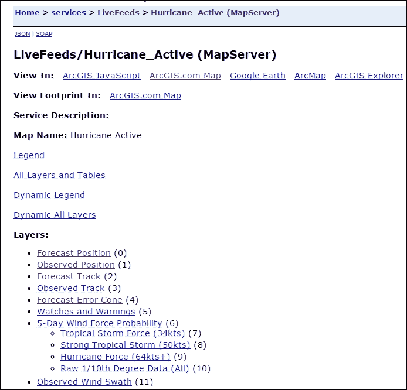
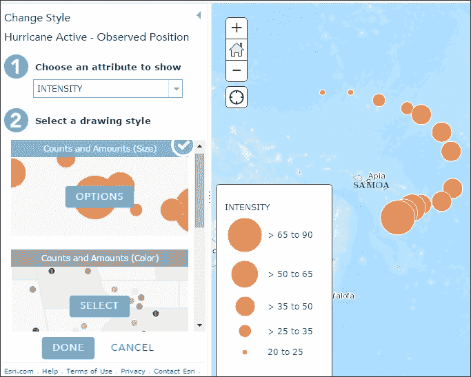
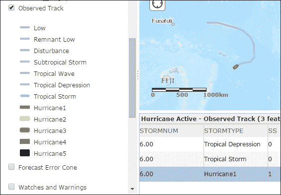
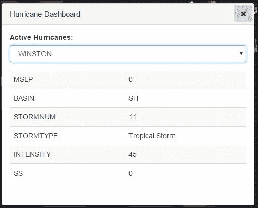
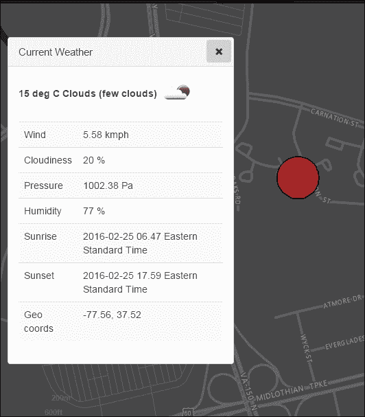

# 第六章。使用实时数据

不断更新的数据给我们带来了检索和呈现数据的巨大挑战。在本章中，我们将通过开发一个旨在跟踪飓风的应用程序来处理两种处理实时数据的基本方法。在本章中，您将了解以下主题:

*   了解实时数据(如飓风数据)的性质
*   使用 ArcGIS 提供的内置选项来可视化数据
*   获取最新数据的方法
*   方法来设置图层的刷新间隔

# 申请背景

我们将处理由国家飓风中心(NHC)提供的飓风数据。NHC 提供描述热带飓风活动路径和预报的地图服务。NHC 作为地图服务提供的实况转播可在上找到。

地图服务提供以下数据:

*   **预测位置**
*   **观察位置**
*   **预测轨迹**
*   **观察轨迹**
*   **不确定的圆锥**
*   **手表和警告**
*   **热带风暴力**

预报位置和观测位置代表气旋的中心，而轨迹代表预报位置和观测位置，这两个位置相连接，以给出飓风的运动感觉。



在**服务目录**标题中，单击**ArcGIS.com 地图**以获得地图服务中数据的整体视图。

# 可视化地图数据

ArcGIS Online 是可视化和处理托管在 ArcGIS Server 上的数据的有效媒介。在 ArcGIS Online 中打开地图服务时，会显示默认的符号系统，我们可以从中了解我们将在应用程序中使用的数据范围。

在下面的截图中，我们可以看到**预测位置**要素图层及其默认符号系统。使用的符号是 PictureMarkerSymbol，它给出了过去三天(72 小时)飓风强度的感觉。


下面的截图给出了地图服务中整个数据的整体情况，包括预测位置和轨迹，以及观察到的位置:


关闭目录中的所有图层，仅打开**观察位置**图层。**观察位置**层只是由一个简单的渲染器渲染。符号系统不会根据任何字段值而改变的大小。它只显示了过去 72 小时内测量风暴活动的位置。


现在，ArcGIS Online 为我们提供了以各种方式设置其符号系统的选项。当我们单击目录中的图层名称时，将打开以下屏幕。它显示了可以更改符号系统的各种样式。在下面的截图中，风暴的**强度**被选为显示区域，符号的大小基于**强度**值的数量:



数据可以根据各种分类技术分为组，如**等间隔**、**分位数**、**自然间隔**等。


最后，**观测轨迹**实际上显示了飓风在过去 72 小时内的轨迹，并使用唯一值渲染器渲染数据。



# 打造飓风追踪应用

现在我们已经使用 ArcGIS Online 服务了解了我们的数据，我们可以使用地图服务 URL 来构建我们自己的网络地图应用程序。在我们的申请中，我们打算纳入以下内容:

*   向显示过去和现在飓风位置的地图添加图层
*   添加全球风力数据
*   添加一个仪表部件来显示风速
*   添加一个当前天气小部件，在用户的浏览器位置显示当前天气信息
*   添加一个**当前飓风列表**小部件，显示当前飓风的更新列表，以及选中时每个飓风的详细信息

## 象征活跃的飓风层

我们有不止一个要素图层需要处理。让我们试着建立一个层字典。在下面的代码片段中，我们将尝试创建一个对象数组，其中每个对象都有属性，如网址和标题。URL 指的是要素图层的 URL，而 title 属性指的是我们用来指代要素图层的标题:

```js
var windDataURL = "http://livefeeds.arcgis.com/arcgis/rest/services/LiveFeeds/NOAA_METAR_current_wind_speed_direction/MapServer";

var activeHurricaneURL = "http://livefeeds.arcgis.com/arcgis/rest/services/LiveFeeds/Hurricane_Active/MapServer";

var layerDict = [
          {
            title: "Forecast Error Cone",
            URL: activeHurricaneURL + "/4"
          },
          {
            title: "Forecast Tracks",
            URL: activeHurricaneURL + "/2"
          },
          {
            title: "Observed Track",
            URL: activeHurricaneURL + "/3"
          },
          {
            title: "Watches and Warnings",
            URL: activeHurricaneURL + "/5"
          },
          {
            title: "Forecast Positions",
            URL: activeHurricaneURL + "/0"
          },
          {
            title: "Past Positions",
            URL: activeHurricaneURL + "/1"
          },
          {
            title: "Wind Data",
            URL: windDataURL + "/0"
          }
        ];
```

这有助于我们使用图层名称或标题属性检索要素图层。让我们使用`dojo/_base/array`模块提供的`array.map()`方法，将每个对象对应的要素图层添加到`layerDict`数组中。`array.map()`方法，如果你能从[第一章](1.html "Chapter 1. Foundation for the API")、*API*基础中回忆起来，实际上是遍历数组中的元素，会返回一个数组。然后，可以修改每个被迭代的项目。在我们的案例中，我们尝试对每个项目执行以下操作:

1.  根据每个项目中的 URL 创建要素图层。
2.  将要素图层添加到地图。
3.  为`layerDict`数组中的每个项目对象添加一个额外的层属性。

下面的代码片段解释了这个过程:

```js
var layerDict = array.map(layerDict, function (item) {
          var featLayer = new FeatureLayer(item.URL, {
            mode: FeatureLayer.MODE_ONDEMAND,
            outFields: ["*"]
              //infoTemplate: infoTemplate
          });
          map.addLayer(featLayer);
          item.layer = featLayer;
          return item;
        });
```

现在`layerDict`数组中的每个对象都将有一个额外的图层属性，该属性保存由 URL 引用的要素图层。

要检索要素图层，我们可以使用`dojo/_base/array`模块提供的`array.filter()`方法中的图层名称。过滤器`method()`遍历每个对象项，并根据我们的谓词条件返回一个过滤后的数组。

下面一行代码返回标题为`"Forecast Error Cone"`的要素图层，并将其保存在名为`foreCastErrorConeFeatureLayer`的变量中:

```js
var foreCastErrorConeFeatureLayer = array.filter(layerDict, function (item) 
{
  return item.title == "Forecast Error Cone";
})[0].layer;
```

我们正在尝试对一些要素图层中的要素进行符号化。我们将从过去的位置开始。过去的位置以图层为特征，默认情况下，图层由一个圆心为点的圆表示。我们将尝试用一面红旗来象征它。应采用以下方法对其进行符号化:

1.  导入`esri/symbols/PictureMarkerSymbol`模块。
2.  找到代表红旗的巴布亚新几内亚的网址，并使用它创建一个`PictureMarkerSymbol`。
3.  导入`esri/renderers/SimpleRenderer`模块，用我们刚刚创建的`PictureMarkerSymbol`为渲染器分配符号。
4.  使用我们刚刚创建的简单渲染器为要素图层设置渲染器。

下面几行代码清楚地解释了这个过程:

```js
var pastPositionLayer = array.filter(layerDict, function (item) {
    return item.title == "Past Positions";
})[0].layer;

var pastPositionSymbol = new PictureMarkerSymbol({
  "angle": 0,
  "type": "esriPMS",
  "url": http://static.arcgis.cimg/Symbols/Basic/RedFlag.png",
  "contentType": "img/png",
  "width": 18,
  "height": 18
});

var pastPositionRenderer = new SimpleRenderer(pastPositionSymbol);
pastPositionLayer.setRenderer(pastPositionRenderer);
```

现在，我们可以尝试渲染预测误差锥层。预测误差锥是表示预测中不确定性的面要素图层。每种飓风类型都有两个多边形要素。一个多边形代表 72 小时预报误差多边形，另一个代表 120 小时预报误差多边形。该信息可在要素图层的`FCSTPRD`字段中获得。

让我们创建一个唯一的值渲染器，并根据`FCSTPRD`字段名的值对每种类型的多边形进行不同的符号化。要创建唯一的值渲染器，我们需要采用以下方法:

1.  导入`esri/renderers/UniqueValueRenderer`、`esri/symbols/SimpleLineSymbol`和`esri/symbols/SimpleFillSymbol`模块。
2.  为渲染器创建默认符号。因为我们知道所有的`Forecast Error`多边形的`FCSTPRD`字段值要么是`72`要么是`120`，我们将创建一个带有空符号系统的`SimpleFillSymbol`，并将其轮廓设置为空线符号。
3.  从`esri/renderers/UniqueValueRenderer`模块创建一个`UniqueValueRenderer`对象。为其分配我们刚刚创建的默认符号系统以及`FCSTPRD`作为渲染所基于的字段名。
4.  使用`addValue()`方法向渲染器添加值。`addValue()`方法接受唯一值(`72` / `120`)和每个唯一值对应的符号。
5.  将渲染器设置为`Forecast Error Cone Feature layer`。

    ```js
    //Get the Forecast Error Cone feature layer
    var foreCastErrorConeFeatureLayer = array.filter(layerDict, function (item) {
      return item.title == "Forecast Error Cone";
    })[0].layer;

    //Create a Null SimpleFillSymbol
    var defaultSymbol = new SimpleFillSymbol().setStyle(SimpleFillSymbol.STYLE_NULL);

    //With a null Line Symbol as its outline
    defaultSymbol.outline.setStyle(SimpleLineSymbol.STYLE_NULL);

    var renderer = new UniqueValueRenderer(defaultSymbol, "FCSTPRD");

    //add symbol for each possible value
    renderer.addValue('72', new SimpleFillSymbol().setColor(new Color([255, 0, 0, 0.5])));
    renderer.addValue('120', new SimpleFillSymbol().setColor(new Color([255, 255, 0, 0.5])));

    //Set Renderer
    foreCastErrorConeFeatureLayer.setRenderer(renderer);
    ```

我们已经尝试用`PictureMarkerSymbol`符号化一个要素图层，并使用`SimpleRenderer`进行渲染。对于另一个要素图层，我们使用唯一值渲染器以不同方式渲染特定字段具有不同值的要素。现在让我们尝试一种特殊的符号系统，叫做`CartographicLineSymbol`。

`CartographicLineSymbol`提供了附加属性，如帽和连接，它定义了如何渲染线和边连接的端盖。要了解这两个属性的更多信息，请访问[的 API 页面。](https://developers.arcgis.com/javascript/jsapi/cartographiclinesymbol-amd.html)

我们希望使用`CartographicLineSymbol`来符号化预测轨迹要素图层。下面向我们展示了如何使用符号和渲染特定要素图层:

1.  导入`esri/symbols/CartographicLineSymbol`模块。
2.  使用`STYLE_DASHDOT`作为样式参数，黄色作为颜色参数，`5`作为像素宽度，`CAP_ROUND`作为帽类型，`JOIN_MITER`作为连接类型。
3.  使用符号`SimpleRenderer`。
4.  将渲染器设置为预测轨迹要素图层。

下面的代码片段对前面的方法进行了编码:

```js
var lineSymbol = new CartographicLineSymbol(
  CartographicLineSymbol.STYLE_DASHDOT,
  new Color([255, 255, 0]), 5,
  CartographicLineSymbol.CAP_ROUND,
  CartographicLineSymbol.JOIN_MITER, 5
);
var CartoLineRenderer = new SimpleRenderer(lineSymbol);

forecastTrackLayer.setRenderer(CartoLineRenderer);
```

当先前的渲染器应用到过去的位置图层、**预测轨迹**和**预测误差锥**图层时，我们的地图看起来如下:


# 添加全球风数据量表

全球风数据也是 ArcGIS livefeeds 提供的地图服务，提供不同位置的全球级风数据。我们的目标是结合一个仪表小部件，根据悬停在其上的风的位置来改变其仪表读数。默认情况下，风数据已被适当符号化。

下面的截图显示了一个基于我们全球风力数据的测量部件。地图中的箭头是风要素位置，箭头的方向代表风向，箭头的颜色和大小代表风速。这两个实例中的仪表读数代表悬停在其上的特征(由黄色粗圆圈突出显示)。


风数据的网址已经在我们之前的一个片段中提供，并且已经添加到`layerDict`数组中:

```js
var activeHurricaneURL = "http://livefeeds.arcgis.com/arcgis/rest/services/LiveFeeds/Hurricane_Active/MapServer";
```

由于该网址已经添加到`layerDict`数组中，我们可以从其标题`"Wind Data"`创建一个代表风数据的要素图层:

```js
var windFeatureLayer = array.filter(layerDict, function (item) {
          return item.title == "Wind Data";
        })[0].layer;
```

现在，让我们添加一个能够利用该层数据的仪表小部件。该量表由名为`esri/dijit/Gauge`的 Esri `dijit`(道场小部件)提供。仪表构造器非常简单。它接受一个`GaugeParameter`对象和容器 dom 标识。

`GaugeParameter`物体需要我们来建造。在创建`GaugeParameter`对象之前，请记住以下几点:

1.  `layer`属性接受对其表示的要素图层的引用。
2.  `dataField`属性指示应使用哪个字段来获取仪表读数。
3.  `dataFormat`属性接受两个值— `value`或`percent`。选择百分比时，会自动计算仪表的最大值，仪表读数显示为最大值的百分比。当`dataFormat`值选择为`value`时，悬停在其上的特征的实际值显示为仪表读数。
4.  `dataLabelField`属性可用于表示站名或悬停在其上的要素的任何其他辅助属性，这些属性可识别该要素。这将与`title`物业一起使用，代表`dataLabelField`物业的含义。
5.  `color`属性让我们设置仪表读数的颜色。
6.  如果选择`value`作为`dataFormat`值，我们还需要为`maxDataValue`属性提供一个值。

以下代码是我们用来创建您在上一张截图中看到的风速计小部件的代码:

```js
var windGaugeParams = {
          caption: "Wind Speed Meter",
          dataFormat: "value",
          dataField: 'WIND_SPEED',
          dataLabelField: "STATION_NAME",
          layer: windFeatureLayer,
          color: "#F00",
          maxDataValue: 80,
          title: 'Station Name',
          unitLabel: " mph"
        };
var windGauge = new Gauge(windGaugeParams, "gauge");
windGauge.startup();
```

# 追踪最新的活跃飓风

让我们创建一个小部件来跟踪最新的活跃飓风。我们已经有了代表活跃飓风位置的所有图层。我们的目标是获取活跃飓风的所有最新位置，并将其显示在一个小部件中。

下面的截图显示了我们的小部件在开发后的样子:



小部件中的下拉列表列出了所有流行的活跃飓风的名称。以下网格显示了选定飓风的详细信息。

这个小部件的开发包含了以下思考过程:

1.  使用缓存-半身像查询来获取风暴名称的唯一列表，并用该列表填充下拉列表。
2.  在下拉菜单的选择改变时，获取所选风暴的最新特征。
3.  在小部件中填充选定风暴的详细信息。
4.  每 30 秒获取更新的细节。

## 获取独特的风暴列表

为了获得数据中的唯一值，查询对象有一个名为`returnDistinctValues`的属性，其值应该是一个布尔值`true`。下面的代码片段解释了属性的用法:

```js
query.returnDistinctValues = true;
```

此外，查询对象的外场属性应该只列出那些需要唯一值的字段。在我们的例子中，字段名是`STORMNAME`。请参考以下代码片段来理解这一点:

```js
query.outFields = ["STORMNAME"];
```

为了每次都得到更新的结果，我们需要避免缓存查询结果。因此，我们可能需要使用类似如下的模式，而不是使用真实的表达式`1=1`:

```js
"random_number = random_number".
```

这将帮助我们获得非缓存的查询结果。非缓存的查询结果确保我们在设定的时间段内查看最新的数据。让我们编写一个可以创建这样一个查询字符串的函数:

```js
var _bust_cache_query_string: function () {
  var num = Math.random();
  return num + "=" + num;
}
```

我们现在可以在每次需要为查询对象的`where`属性赋值时使用这个函数:

```js
query.where = this._bust_cache_query_string();
```

在查询对象中使用`returnDistinctValues`属性时，我们需要将`returnGeometry`属性设置为布尔型`false`。下面一行代码解释了如何形成查询任务和查询对象，以及如何使用查询结果填充下拉框。在代码的最后，我们将调用一个.`_update_hutticane_details()`方法。该方法获取所选`StormName`的最新详情:

```js
events: function () {
  //initialize query task
  var queryTask = new QueryTask("http://livefeeds.arcgis.com/arcgis/rest/services/LiveFeeds/Hurricane_Active/MapServer/1");

  //initialize query
  var query = new Query();
  query.returnGeometry = false;
  query.where = "1=1 AND " + this._bust_cache_query_string();
  query.outFields = ["STORMNAME"];
  query.returnDistinctValues = true;
  var that = this;

  queryTask.execute(query, function (result) {
    console.log(result);

    var i;
    //Remove all existing items

    for (i = that.cbxactiveHurricane.options.length - 1; i >= 0; i--) {
      that.cbxactiveHurricane.remove(i);
    }
    //Fill n the new values
    array.forEach(result.features, function (feature) {
      console.debug(feature.attributes.STORMNAME);
      that.cbxactiveHurricane.options[that.cbxactiveHurricane.options.length] = new Option(feature.attributes.STORMNAME, feature.attributes.STORMNAME);
    });
    that._update_hutticane_details();
  });

this.updateTimmer = setInterval(lang.hitch(this, this._update_hutticane_details), 30000);
}
```

在代码的前几行中，观察最后三行。我们正在使用每 30 秒调用一次`_update_hutticane_details()`的`timer`函数。这是获取飓风最新细节的功能。

## 获取最新数据并显示在网格上

当我们在前面的代码片段中试图构造查询对象时，我们使用`returnDistinctValues`属性来获取基于字段名称的不同值。现在，我们将使用查询对象的`orderByFields`属性根据字段名称对特征进行排序。为了首先获得最新的特性，字段名应该代表一个时间字段。在我们的例子中，域名是`DTG`。为了确保我们获得最新的时间作为查询结果的第一个特征，我们可以在构造查询对象时使用下面一行代码。`orderByField`接受一个字符串数组，每个条目都提到要排序的字段名，以及排序应该是升序(`ASC`)还是降序(`DESC`)。默认顺序是升序:

```js
query.orderByFields = ["DTG DESC"];
```

下面几行代码演示了所需的 Query 对象是如何构造的，以及如何使用结果在小部件中填充有关最新风暴的信息:

```js
_update_hutticane_details: function () {
  var selected_hurricane = this.cbxactiveHurricane.value;

  var queryTask = new QueryTask("http://livefeeds.arcgis.com/arcgis/rest/services/LiveFeeds/Hurricane_Active/MapServer/1");
  var query = new Query();
  query.returnGeometry = true;
  query.where = "STORMNAME='"+ selected_hurricane +"' AND " + this._bust_cache_query_string();
  query.outFields = ["*"];
  query.orderByFields = ["DTG DESC"];
  var that = this;
  queryTask.execute(query, function (result) {
    console.log(result);
    if (result.features.length>0){
      that._mslp.innerHTML = result.features[0].attributes.MSLP;
      that._basin.innerHTML = result.features[0].attributes.BASIN;
      that._stormnum.innerHTML = result.features[0].attributes.STORMNUM;
      that._stormtype.innerHTML = result.features[0].attributes.STORMTYPE;
      that._intensity.innerHTML = result.features[0].attributes.INTENSITY;
      that._ss.innerHTML = result.features[0].attributes.SS;
    }
  });
}
```

请注意前一段代码中的`where`子句。我们仅从下拉框中选择`StormName`的详细信息，并使用破坏缓存功能获取最新数据:

```js
query.where = "STORMNAME='"+ selected_hurricane +"' AND " + this._bust_cache_query_string();
```

### 刷新要素图层

显示时间数据的要素图层可能需要以不同的时间间隔刷新。我们可以使用要素图层刷新间隔属性来设置此属性:

```js
featureLayer. refreshInterval = 5; // in minutes
```

这是对我们之前讨论的破坏缓存技术的补充。

# 创建天气小部件

我们将尝试在我们的应用程序中创建一个天气小部件，显示用户所在位置的当前天气情况。用户的位置实际上是指现代浏览器中地理定位应用编程接口所识别的浏览器位置。当浏览器找不到用户的位置时，我们会尝试查找地图中心的天气数据。创建天气小部件为我们带来了以下机遇和挑战:

*   天气数据是实时不断更新的，是一种时空现象，意味着随着时间和地点的变化而变化
*   它为我们提供了使用外部天气 API 的机会，该 API 是非基于 ArcGIS 的数据
*   它为我们提供了一个探索客户端几何操作的机会，例如缓冲和地理和网络墨卡托坐标之间的转换

## 开放天气空气污染指数

我们需要找到一个数据来源来获取最新的天气数据。幸运的是，开放的天气应用编程接口是获取不同格式天气数据的简单而免费的选项。付费计划提供更高的使用水平。对于我们的目的来说，免费版本的工作非常出色。

该应用编程接口提供 REST 端点，该端点提供对以下类型数据的访问:

*   当前天气数据
*   5 天/3 小时预测
*   5 天/3 小时预测
*   史料
*   紫外线指数
*   天气地图图层
*   气象站

我们将使用当前天气数据端点来获取给定位置的天气详细信息。

要访问应用编程接口，您需要注册一个应用编程接口密钥。以下网址解释了如何获取`appid`并在 REST 查询中使用:[http://openweathermap.org/appid#get](http://openweathermap.org/appid#get)。

我们将使用的基本网址如下:

```js
var url = "http://api.openweathermap.org/data/2.5/weathers";
```

我们将提供纬度和经度值，以便向开放天气应用编程接口发出请求。我们已经尝试使用需要为其导入`esri/request`模块的`esriRequest`对象发出 HTTP `GET`请求。以下片段解释了`esriRequest`对象是如何构造的:

```js
var request = esriRequest({
  // Location of the data
  url: this.url + '?lat=' + this.lat + '&lon=' + this.lon + '&appid=' + this.apikey,

  handleAs: "json"
});
```

如果观察正在构建的 URL，它需要三个参数，即`lat`、`lon,`和`appid`。

`appid`参数接受我们之前生成的应用密钥。有两种方法可以获得纬度和经度值:

1.  如果浏览器支持地理定位应用编程接口，请从浏览器的位置获取纬度和经度值。
2.  如果浏览器不支持地理定位应用编程接口，地图范围的质心应投影到地理坐标，并用于获取该位置的天气数据。

## 使用地理定位应用编程接口

使用地理定位应用编程接口就像调用导航对象的`geolocation.getCurrentPosition()`方法一样简单。该方法返回一个回调对象，该对象包含浏览器的位置。下面几行代码展示了如何调用`geolocation` API 来获取浏览器的当前位置:

```js
getLocation: function () {
  if (navigator.geolocation) {
    navigator.geolocation.getCurrentPosition(lang.hitch(this, this.showPosition));
  } else {
    console.log("Geolocation is not supported by this browser.");
  }
}
```

在前面的代码中，调用对象是一个名为`showPosition()`的函数。`showPosition()`函数获取位置作为回调对象。使用属性`coords`可以访问该位置的坐标。

### 对输入数据使用几何引擎

`coords`对象给出三个属性，即:

*   `latitude`
*   `longitude`
*   `accuracy`

我们很清楚经纬度是什么，但是什么是精度呢？精度是用 API 提供的坐标表示仪表中可能误差的数值。或者，换句话说，位置在误差范围内是准确的。当我们提到这是一个错误的圆圈时，在我们的地图上可视化它不是很好吗，这样我们就知道浏览器的大致位置，也许可以证实结果。我们试过了；这似乎相当准确。为了创建一个错误循环，我们采用了以下方法:

1.  使用纬度和经度值创建点几何图形。
2.  使用 API 提供的`webMercatorUtils`将点从地理坐标转换为网络墨卡托坐标。
3.  使用 API 提供的`geometryEngine`模块，在投影点周围创建一个缓冲区，缓冲区半径等于位置精度。
4.  使用`SimpleFillSymbol`符号化缓冲区几何图形。

下面几行代码清楚地解释了前面的过程:

```js
showPosition: function (position) {
  console.log(position);
  this.accuracy = position.coords.accuracy;
  this.lat = position.coords.latitude;
  this.lon = position.coords.longitude;

  //error circle
  var location_geom = new Point(this.lon, this.lat, new SpatialReference({ wkid: 4326 }));
  var loc_geom_proj = webMercatorUtils.geographicToWebMercator(location_geom);
  var location_buffer = geometryEngine.geodesicBuffer(loc_geom_proj, this.accuracy, "meters", false);

  console.log(location_buffer);
  var symbol = new SimpleFillSymbol().setColor(new Color([255, 0, 0, 0.5]));
  this.map.graphics.add(new Graphic(location_buffer, symbol));
  //this.map.setExtent(location_buffer.getExtent());
  this.getWeatherData();
}
```

我们将使用从`showPosition()`方法获得的纬度和经度来获取该位置的天气数据。

## 在小部件中显示天气数据

我们之前访问了如何使用`esriRequest`模块向天气 API 发出 HTTP GET 请求，并请求浏览器提供的纬度和经度上的当前天气数据。该请求是一个承诺，我们将根据该承诺使用`then`方法来解决它。

下面这段代码演示了如何解决`esriRequest`承诺，以及如何使用它来显示当前的天气数据:

```js
request.then(function (data) {
  console.log("Data: ", data);
  that.weather.innerHTML = Math.round(data.main.temp - 270) + " deg C " +
  data.weather[0].main + ' (' + data.weather[0].description + ')';
  var imagePath = "http://openweathermap.org/img/w/" + data.weather[0].icon + ".png";
  // Set the image 'src' attribute
  domAttr.set(that.weatherIcon, "src", imagePath);
  that.windSpeed.innerHTML = data.wind.speed + ' kmph';
  that.cloudiness.innerHTML = data.clouds.all + ' %';
  that.pressure.innerHTML = data.main.pressure;
  that.humidity.innerHTML = data.main.humidity + ' %';
  that.pressure.innerHTML = data.main.pressure + ' Pa'
  that.sunrise.innerHTML = that._processDate(data.sys.sunrise);
  that.sunset.innerHTML = that._processDate(data.sys.sunset);
  that.coords.innerHTML = data.coord.lon + ', ' + data.coord.lat;
}
```

在之前的代码中，温度总是以开尔文返回。所以要换算成摄氏度，需要减去`270`。使用名为`_processDate()`的函数应用时间转换。开放天气 API 发布的时间是以 UTC 表示的 Unix 基准时间。

我们编写的`_processDate()`函数如下所示:

```js
_processDate: function (dateStr) {
  if (dateStr == null) {
    return "";
  }
  var a = new Date(dateStr * 1000);
  return dateLocale.format(a, {
    selector: "date",
    datePattern: "yyyy-MM-dd HH.mm v"
  });
}
```

上一个函数中使用的`dateLocale`对象是一个道场模块(`dojo/date/locale`)，它提供了正在处理的`date`对象的本地化时间版本。该小部件如下图所示。红色的圆圈是我们正在谈论的错误的圆圈。我们还能够创建一个小的天气图标，它总结了天气状况。



如果你很好奇上一个小部件的 HTML 模板会是什么样子，我们有一件事要说——我们让你失望了吗？这是:

```js
<div>
  <form role="form">
    <div class="form-group">
      <label dojoAttachPoint="weather"></label>
      
    </div>
  </form>
  <table class="table table-striped">
    <tbody>
      <tr>
        <td>Wind</td>
        <td dojoAttachPoint="windSpeed"></td>
      </tr>
      <tr>
        <td>Cloudiness</td>
        <td dojoAttachPoint="cloudiness"></td>
      </tr>
      <tr>
        <td>Pressure</td>
        <td dojoAttachPoint="pressure"></td>
      </tr>
      <tr>
        <td>Humidity</td>
        <td dojoAttachPoint="humidity"></td>
      </tr>
      <tr>
        <td>Sunrise</td>
        <td dojoAttachPoint="sunrise"></td>
      </tr>
      <tr>
        <td>Sunset</td>
        <td dojoAttachPoint="sunset"></td>
      </tr>
      <tr>
        <td>Geo coords</td>
        <td dojoAttachPoint="coords"></td>
      </tr>
    </tbody>
  </table>
</div>
```

无害的 HTML 模板是我们开发天气小部件所需要的全部，我们用它来显示我们所在位置的当前天气数据。

# 总结

在本章中，我们详细介绍了实时数据的构成，以及如何可视化和获取最新功能。在后面的章节中，我们将讨论如何处理时间感知层以及如何可视化时空层。因此，我们将能够构建持续更新的有效 web 应用程序。在接下来的章节中，我们将使用要素图层的统计功能来处理高级可视化技术，并学习图表库。