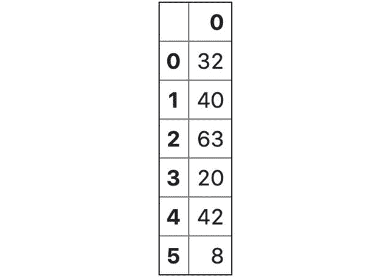
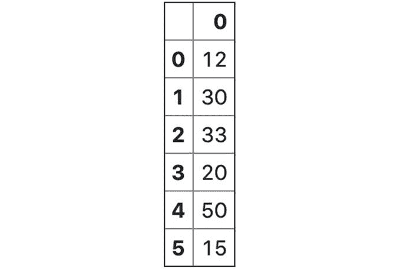
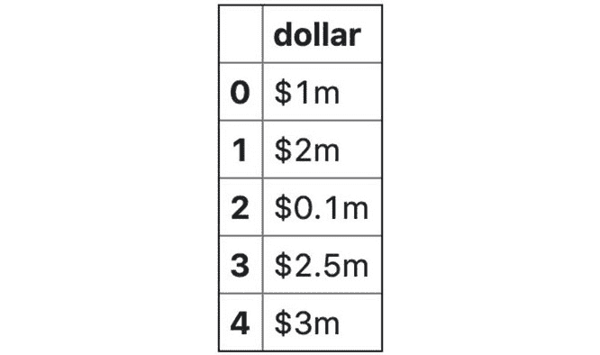
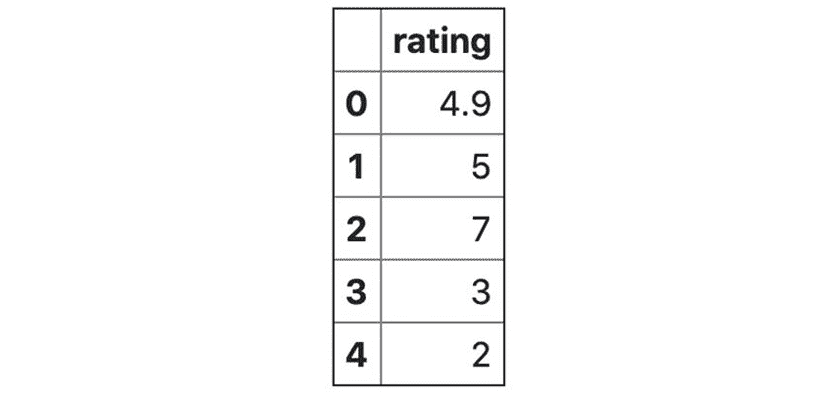
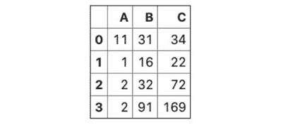
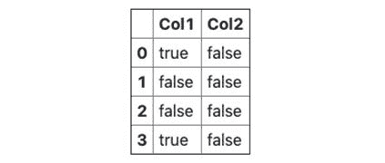
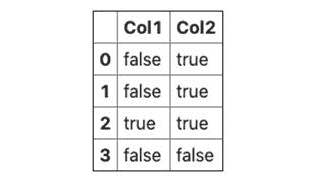

# 三、Danfo.js入门

与其他编程语言相比， **Python** 数据科学和机器学习生态系统已经非常成熟，但在数据呈现和客户端方面， **JavaScript** 独占鳌头。从其强大的数据呈现工具到其在浏览器中易于设置的易用性，始终推荐使用 JavaScript。

在本章中，我们将向您介绍 Danfo.js 库，从而为您提供一个在 JavaScript 中进行数据分析和操作的高效工具。我们将介绍 Danfo.js 的核心数据结构——数据框架和系列。我们将向您展示如何将不同类型的文件(如 JSON、Excel 和 CSV)加载到 Danfo.js 中，最后，您将了解 Danfo.js 中可用的一些重要函数，这些函数使 JavaScript 中的数据分析和预处理变得更加容易。

在本章中，我们将涵盖以下主题:

*   你为什么需要丹福. js
*   安装 Danfo.js
*   介绍系列和数据框
*   Danfo.js 中的基本功能和方法
*   数据加载和使用不同的文件格式

# 技术要求

为了遵循本章，您应该具备以下条件:

*   现代浏览器，如 Chrome、Safari、Opera 或火狐
*   安装在您的系统上的 **Node.js** 、Danfo.js 和 **Dnotebook**

本章代码可在此处获得:[https://github . com/PacktPublishing/Building-Data-Driven-Applications-with-danfo . js/tree/main/chapter 03](https://github.com/PacktPublishing/Building-Data-Driven-Applications-with-Danfo.js/tree/main/Chapter03)。

注意

对于大部分代码片段，您可以使用这里在线提供的 Dnotebook:[https://playnotebook.jsdata.org/](https://playnotebook.jsdata.org/)。

# 为什么需要丹佛号

要成功地将一个用 Python 编写的机器学习项目带到 web 上，需要执行很多流程和任务，比如模型部署，用 **Flask** 、 **FastAPI** 或 **Django** 等框架创建 API 路由，然后用 JavaScript 向模型发送 HTTP 请求。你可以清楚的观察到这个过程涉及到大量的 JavaScript。如果我们能用 JavaScript 执行所有这些过程，那就太棒了，不是吗？好消息是我们可以。

在过去的几年里，浏览器的计算能力稳步提高，并且可以支持高度密集的计算，因此在数据密集型任务方面，JavaScript 具有挑战 Python 的优势。

在 Node.js 的帮助下，JavaScript 可以访问本地计算机上可用的 GPU，使我们能够使用 Node.js 作为后端，纯 JavaScript 作为前端，进行全栈机器学习项目。

使用 JavaScript 的一个好处是可以很容易地在客户端进行推理，因此数据不必离开客户端到服务器端。此外，JavaScript 为我们的程序提供了跨平台支持，在**内容交付网络** ( **CDN** )的帮助下，应用开发所需的所有 JavaScript 包都可以轻松使用，无需安装。

随着 **TensorFlow.js** 和 Danfo.js 等工具的推出，我们看到了数据科学和机器学习生态系统中对 JavaScript 的更多支持。

想象一个强大的数据处理库，比如 web 上的 **Python 熊猫**([https://pandas.pydata.org/](https://pandas.pydata.org/))，想想把这样的工具注入到 **Vue** 或者 **React** 等 JavaScript 中流行的现代框架的能力；的可能性是无穷无尽的。这就是 Danfo.js 给网络带来的力量。

JavaScript 开发人员曾多次尝试将熊猫的数据处理能力带到网络上。因此，我们有库，如`pandas-js`、`dataframe-js`、`data-forge`和`jsdataframe`。

将 Python 熊猫移植到 JavaScript 的需求主要是因为需要在浏览器中执行数据预处理和操作任务。

这是**Stack Overflow**([https://stackoverflow . com/questions/30610675/python-pandas-等价于 JavaScript/43825646](https://stackoverflow.com/questions/30610675/python-pandas-equivalent-in-JavaScript/43825646) )上的一个线程，详细概述了 JavaScript 中用于数据预处理和操作的不同工具，但是这些工具中的大多数都失败了，原因如下文中所述的两个原因:

*   缺乏单一库的协作(许多库试图做不同的事情)
*   大部分图书馆没有熊猫的主要特征，如图:[https://github.com/pandas-dev/pandas#main-features](https://github.com/pandas-dev/pandas#main-features )

除了这里列出的两个原因之外，我们在尝试大多数现有工具时观察到的另一个问题是缺乏像 Python 熊猫一样的良好用户体验。pandas 非常受欢迎，由于 JavaScript 中创建的大多数工具都模仿 pandas，因此最好有一个与 pandas 非常相似的用户体验。

Danfo.js 的建立是为了弥补现有数据处理库面临的差距和问题。该应用编程接口是根据熊猫应用编程接口精心建模的，因此为来自 Python 背景的人提供了类似的体验，同时为 JavaScript 开发人员提供了简单直观的应用编程接口。

除了一个简单而熟悉的 API 之外，由于 TensorFlow.js 为所有数学运算提供动力，Danfo.js 的速度更快。Danfo.js 在不到一年的时间里，在 GitHub 上获得了 1500 多颗星，在 JavaScript 数据科学社区中获得了广泛的欢迎，并被 Google 的 TensorFlow.js 团队所接受([https://blog . tensorflow . org/2020/08/introduction-danfo-js-pandas-like-library-in-JavaScript . html](https://blog.tensorflow.org/2020/08/introducing-danfo-js-pandas-like-library-in-JavaScript.html))。此外，值得一提的是，由于积极的贡献者，Danfo.js 得到了很好的维护和不断的发展，他们确保了它的更新和稳定。

除了前面的原因之外，我们决定在 Danfo.js 上写这本书的原因还有很多，以便给你在 JavaScript 中执行数据操作任务所需的技能和知识。在下一节中，我们将从学习如何在浏览器和 Node.js 环境中安装和导入 Danfo.js 开始。

# 安装 Danfo.js

Danfo.js 在浏览器和 Node.js 环境中都很容易获得。要在浏览器的中使用 Danfo.js，您可以将`script`标签添加到您的`HTML`文件的标题中，如下所示:

```js
<head>
      ...
     <script src="https://cdn.jsdelivr.net/npm/danfojs@0.2.7/lib/bundle.min.js"></script>
      ...
</head>
```

在撰写本文时，用于浏览器环境的 Danfo.js 的最新版本是 0.2.7。这很可能已经改变了，但是请放心，本书中使用的所有代码和片段都将在未来的版本中工作。

注意

要安装或获取最新版本的 Danfo.js，可以查看官方文档中的发布页面[https://danfo.jsdata.org/release-notes](https://danfo.jsdata.org/release-notes)。

在 Node.js 环境中，可以使用**节点包管理器** ( **npm** )或`yarn`安装 Danfo.js ，如下代码所示:

```js
//NPM
npm install danfojs-node
// Yarn
yarn add danfojs-node
```

安装后，您可以使用以下任何命令导入 Danfo.js:

```js
//Common js style
const dfd = require("danfojs-node")
// ES6 style
import * as dfd from 'danfojs-node'
```

注意

为了练习，你可以一直使用[https://playnotebook.jsdata.org/](https://playnotebook.jsdata.org/)，如前一章所述。有了这个，你就可以在线使用 Dnotebook 进行快速实验。要使用 Dnotebook 中最新版本的 Danfo.js，可以随时使用`load_package`功能。

浏览器和节点. js 版本的 Danfo.js 遵循相同的 API 设计。主要区别在于，在浏览器中，Danfo.js 以`dfd`的名称添加到全局范围。因此，`dfd`变量可用于所有的 JavaScript 或 HTML 文件。

现在我们已经完成了安装，我们将进入下一部分，在这里我们将讨论 Danfo.js 和 Series 中可用的主要数据结构和方法。

# 介绍系列和数据帧

Danfo.js 公开了两个主要的数据结构，Series 和 DataFrames，对它们来说所有的数据操作都可以轻松完成。数据框架和系列为不同类型的数据提供了通用表示，因此相同的数据处理过程可以应用于不同格式的数据集。

在本节中，我们将了解创建系列和数据帧的不同方法。我们将看到如何处理数据帧和序列格式的数据。我们还将研究数据处理的不同数据框架和系列方法。

我们将从如何处理 Series 数据结构中的数据开始这一部分。

## 系列

数列为处理一维数据提供了一个入口点，例如一个具有相同数据类型的值序列的单个数组。

在本节中，我们将通过以下 Series 方法熟悉 Series 数据结构:

```js
 *  table() and print() method:let sdata= new dfd.Series([1,3,5,7,9,11])
table( sdata) // Displays the table in Dnotebook
```

上面的代码给出了下面的输出表:


图 3.1–系列表

在前面的代码片段中，我们使用`table()`来打印 Series 表。这是因为我们在本章的大部分代码中使用了 Dnotebook。要在浏览器或 Node.js 控制台中打印数据帧或系列，您可以随时调用`print()`，如下所示:

```js
 sdata.print() // will give us same output as table( sdata)
```

在后续代码中，我们将始终使用`table()`功能，该功能允许我们在浏览器网页上打印数据帧。

*   `.index`属性:默认情况下，序列表的列名总是 0，除非指定。还要注意，数列表的索引范围是从数据的`0`到`n – 1`，其中`n`是数据的长度。该指数也可以通过以下方式获得:

    ```js
    console.log(sdata.index) // [0,1,2,3,4,5]
    ```

*   `.dtype` and `astype()`: Sometimes the data passed into a Series might not be homogeneous, and may contain fields with mixed data types, as follows:

    ```js
    let sdata = new dfd.Series([1,2,3, "two:","three"])
    console.log(sdata.dtype)
    // string
    ```

    `dtype`输出`string`，而数据是不同的数据类型，因此我们总是可以改变`dtype`，如下面的代码所示:

    ```js
    sdata.astype('int32')
    ```

    前面的代码改变了序列的数据类型，但实际上并没有将数据中的字符串转换为`int32`。因此，如果我们对数据进行数值运算，这将抛出一个错误。

*   The `.tensor` attribute: The data in a Series can be obtained in two main formats – as JavaScript **arrays** or **tensors**.

    在下面的代码中，我们演示了如何以 JavaScript 数组和张量的形式获取 Series 数据:

    ```js
    sdata = new dfd.Series([1,2,3,4,5])console.log(sdata.values) 
    // [1,2,3,4,5]
    console.log(sdata.tensor) 
    // output Tensorflow.js tensor 
    ```

    `series.tensor`的输出是一个有效的张量，因此可以对其执行所有支持的张量运算。例如，在下面的代码中，我们在 Series `tensor`对象上调用指数函数:

    ```js
    sdata.tensor.exp(2).arraySync()
    // [3,7,20,55,148]
    ```

    在前面的代码中，我们能够打印出数列数据的指数，因为我们可以访问底层张量。`arraySync`方法返回张量的数组格式。我们来看看`set_index()`法。

*   The `set_index()` method: The index can be specified when creating a Series data structure. We demonstrate this in the following code:

    ```js
    series = new dfd.Series([1,2,3,4,5], {index: ["one","two", "three", "four", "five"]})
    table(series)
    ```

    这将设置序列的索引，并替换默认的数字索引，如下所示:


图 3.2–带有命名索引的系列

我们总是可以改变一个序列的默认索引值，如下代码所示:

```js
sdata = new dfd.Series(["Humans","Life","Meaning","Fact","Truth"])
new_series = sdata.set_index({ "index": ["H", "L", "M","F","T"] })
table(new_series)
```

`sdata.set_index()`重置索引并返回一个新的系列，如图*图 3.2* ( *左*)所示，不改变原来的系列。通过将`inplace`键设置为`true`，我们可以将`set_index()`设置为实际更新原始系列的索引，而不返回新系列:

```js
sdata.set_index({ index: ["H", "L", "M","F","T"] , inplace: true })
```

我们现在来看看`.apply()`法。

*   The `.apply()` method: Since a Series is a single-dimensional array, it is easy to apply operations similar to how it would be done if working with an array in JavaScript. Series have a method called `.apply` to which you can apply any function on each value of the Series data:

    ```js
    sdata = new dfd.Series(["Humans","Life","Meaning","Fact","Truth"])
    series_new = sdata.apply((x) => {
     return x.toLocaleUpperCase()
    })
    table(series_new)
    ```

    这将通过在每个值上应用`x.toLocaleUpperCase()`将序列中的每个字符串转换为大写。下图显示了对系列数据应用`x.toLocaleUpperCase`前后的表格输出:


图 3.3–左侧:将索引设置为字符串。右:使用“应用”将所有字符串转换为大写

`.apply`方法也便于对系列数据的每个值进行数值运算:

```js
sf = new dfd.Series([1, 2, 3, 4, 5, 6, 7, 8])
sf_new = sf.apply(Math.log)
table(sf_new)
```

我们使用`.apply`函数来查找序列中每个值的日志。所有其他数学运算也可以这样做。

上述代码输出下表:


图 3.4–将数学运算(数学日志)应用于系列的每个值

系列数据结构也包含`.map`方法，类似于`.apply`。此方法将序列的每个值映射到另一个值:

```js
sf = new dfd.Series([1,2,3,4])
map = { 1: "ok", 2: "okie", 3: "frit", 4: "gop" }
sf_new = sf.map(map)
table(sf_new)
```

地图接受对象和功能作为参数。在前面的代码中，我们创建了一个名为`map`的对象，该对象包含序列中作为键的值以及每个键应该映射到的值。

前面的代码输出下表:


图 3.5–在系列值上使用映射

接下来，我们来看看`.isna()`法。

*   The `.isna()` method: The data we've been passing into the Series so far seems to be okay and contains no missing values or undefined values, but when working with real data, we will always have `NaN` or undefined values. We can always check whether such values exist in our Series:

    ```js
    sf_nan = new dfd.Series([1,2, NaN, 20, undefined, 100])
    table(sf_nan)
    ```

    作为测试，我们创建一个包含`NaN`和一个未定义变量的序列。我们获得以下输出:


图 3.6–包含带有 NaN 值的系列框架的表格

让我们检查包含`NaN`和未定义值的行；对于这些行中的每一行，我们输出`true`，如果不是，它们用`false`表示，如下面的代码所示:

```js
table(sf_nan.isna())
```

我们获得以下输出:


图 3.7–系列数据的 isna 表

`.add()`方法如下。

*   The `.add()` method: The Series data structure also supports element-wise operations (such as addition, subtraction, multiplication, and division) between Series, and after this operation, the indexes are automatically aligned:

    ```js
    sf1  = new dfd.Series([2,20,23,10,40,5])
    sf2  = new dfd.Series([30,20,40,10,2,3])
    sf_add = sf1.add(sf2)
    table(sf_add)
    ```

    我们有以下输出:



图 3.8–添加两个系列

前面的代码片段将`sf2`序列添加到`sf1`中，并且每行的每个值都是按元素添加的。

还要注意，单个值可以传递给`sf1.add`，这将为`sf1`系列中的每个元素添加一个常量值:

```js
table(sf1.add(10))
```

以下是前面代码的输出:



图 3.9–向系列元素添加常数值

前面显示的运算适用于所有其他数学运算以及数列。

在下一小节中，我们将研究数据帧的操作，如何创建数据帧，以及如何使用数据帧操作处理数据。

## 数据框架

一个 DataFrame 代表一个 Series 的集合，尽管与 Series 不同，它基本上是包含多列多行的数据的二维表示(尽管它也可以代表更高维度)。

数据框基本上可以使用 JavaScript 对象来构建，如以下代码所示:

```js
data = {
  artist: ['Drake','Rihanna','Gambino', 'Bellion', 'Paasenger'],
  rating: [5, 4.5, 4.0, 5, 5],
  dolar: [ '$1m', '$2m','$0.1m', '$2.5m','$3m']
}
df = new dfd. DataFrame (data)
table(df) 
// print out the  DataFrame 
```

生成的数据帧应该如下所示:


图 3.10–数据框架表

在前面的代码中，创建了包含键和值的 JavaScript 对象数据。请注意以下关于 JavaScript 对象的:

*   每个键包含一个代表每列数据的列表值。
*   每个键代表列和列名。
*   每个键必须具有相同长度的列表值。

以下是处理数据帧数据结构的常用方法:

*   The `head()` and `tail()` methods: Sometimes, while working on a big dataset, you might need to see the first set of rows (maybe the first 5 rows or the first 30 rows, as much as you like) and also the last rows in the data.

    由于我们的数据框包含五行，让我们打印表格的前两行:

    ```js
    table(df.head(2))
    ```

    默认情况下，`head()`方法打印出数据帧的前五行，但是我们可以指定`2`，因为我们的数据很小。

    下表显示了前面代码的结果:


图 3.11–测向头表(2)

此外，为了查看数据框中的最后一组行，我们使用了`tail()`方法。默认情况下，`tail`方法打印出数据框中的最后五行:

```js
table(df.tail(2))
```

`tail`函数接受一个值，该值指定从到数据框表末尾要打印的行数，如图所示:


图 3.12–打印最后两行

*   **Setting and getting column data**: Besides using JavaScript objects to specify the data to be passed into the DataFrame, we can pass in a list of values and column names into the DataFrame, as follows:

    ```js
    data = [
      ['Drake', 5, '$1m'],
      ['Rihanna', 4.5, '$2m'],
      ['Gambino', 4.0, '$0.1m'],
      ['Bellion', 5, '$2.5m'],
      ['Passenger', 5, '$3m']
    ]

    columns = ['artist', 'rating', 'dollar']

    df = new dfd. DataFrame (data, {columns: columns})
    ```

    `data`变量包含数据，表示为数组的数组。数据数组中的每个数组都包含按行排列的值，因为它将在 DataFrame 表中表示；`[Drake, 5, $1m]`代表数据框中的一行，而每个值(`Drake`、`5`、`$1m`)代表不同的列。`Drake`属于`artist`列，`$1m`属于`dollar`列，如下图所示:


图 3.13–数据框架表

回想一下，我们说过数据帧是系列的集合，因此可以像访问 JavaScript 对象元素一样从数据帧访问这些系列中的每一个。下面是如何做到这一点:

```js
table(df.artist)
```

请注意，`artist`是数据框中一列的名称，因此，如果我们将数据框视为一个对象，`artist`是键，键的值是序列。前面的代码应该输出下表:


图 3.14–色谱柱系列

`artist`栏也可以通过`df['artist']`进入:

```js
table(df['dollar'])
```

该方法也输出与正在使用的初始`df.dollar`方法相同的结果:



图 3.15–访问列值

除了通过类似对象的方法访问列值，我们还可以如下更改列数据:

```js
df['dollar'] = ['$20m','$10m', '$40m', '$35m', '$10m']
```

如果我们打印出`df.dollar`，我们将获得以下输出:


图 3.16–更改列值

列数据的更改也可以通过创建一个序列框架，然后将其分配给数据框架中的一列来完成，如下所示:

```js
rating = new dfd.Series([4.9,5.0, 7.0, 3.0,2.0])
df['rating'] = rating
table(df['rating'])
```

上述代码更改了列评级的值，并输出下表:



图 3.17–用序列值更改列数据

这种使用序列数据更新列数据的方法在处理时间相关的列时非常有用。我们可能需要在日期列中提取小时或月，并用提取的信息(小时或月)替换该列。

让我们给数据框添加一个日期列:

```js
date = [ "06-30-02019", "07-29-2019", "08-28-2019", "09-12-2019","12-03-2019" ]
df.addColumn({column: "date", value: date})
```

我们使用`addColumn`方法向数据框中添加一个新列。`addColumn`方法接受必须包含以下键的对象参数:

a)要添加的`column`的名称

b)新的`value`为列

前面的代码应该输出下表:


图 3.18–添加新列

创建的新列是一个日期时间列，因此我们可以将该列转换为时间序列数据结构，然后提取该列中每个数据点的月份名称:

```js
date_series = df['date']
df['date'] = date_series.dt.month_name()
```

我们提取日期列并将其分配给一个`date_series`变量。从`date_series`(实际上是一个 Series 数据结构)中，我们提取每个值的月份名称。序列数据结构包含`dt`方法，该方法将序列结构转换为时间序列结构，然后使用`month_name()`方法提取月份名称。

上述代码输出下表:


图 3.19–提取月份名称

接下来我们要研究的方法是`.values`和`.tensor`。

*   `.values` and `.tensor`: The DataFrame values, that is, each column value, can be obtained as a giant array using `df.values`:

    ```js
    df.values
    //output
    [[Drake,4.9,$20m,Jun],[Rihanna,5,$10m,Jul],[Gambino,7,$40m,Aug],[Bellion,3,$35m,Sep],[Passenger,2,$10m,Dec]]
    ```

    有时，我们可能想要获得数据帧作为机器学习操作的张量，因此下面显示了如何获得数据帧作为张量值:

    ```js
    df.tensor
    //output
    {"kept":false,"isDisposedInternal":false,"shape":[5,4],"dtype":"string","size":20,"strides":[4],"dataId":{},"id":28,"rankType":"2"}
    ```

    `tensor`属性返回了一个 TensorFlow.js 张量数据结构。因为张量必须总是包含唯一的数据类型，所以我们的数据帧中的所有数据点都被转换成一个`dtype`字符串。

*   The `.transpose()` method: Since we made the claim that a DataFrame is a two-dimensional representation of data, we should be able to transpose the DataFrame:

    ```js
    df.transpose()
    ```

    `df.transpose()`将列列表作为索引移动，将索引作为列移动，如下表所示:


图 3.20–转换数据帧

我们可以获得数据框的索引，并查看该列现在是否是当前索引:

```js
df2 = df.transpose()
console.log(df2.index) 
// [artist,rating,dollar,date]
```

前面的代码是转置数据帧的索引。在前面的例子中，索引一直是一个数值，但这表明索引也可以是一个字符串。

*   The `.set_index()` method: Using the DataFrame itself, before transposing it, let's change the index of the DataFrame from integers to a string index:

    ```js
    df3 = df.set_index({key:["a","b","c","d","e"]})
    ```

    使用数据框中的`set_index`方法，用给定的键值设置索引。`set_index`也接受`inplace`键(`inplace`键是布尔键，它接收`true` 或`false`作为值，但默认值是`false`键)来指定是应该更新数据帧还是应该返回包含更新的新数据帧。

    下面的表显示了前面代码的结果:


图 3.21–设置数据帧的索引

因为索引可以是任何东西，所以我们也可以将数据框的索引设置为数据框中的一列:

```js
df4 = df.set_index({key:"artist"})
```

这一次，`set_index`接受一个值，而不是一组建议的索引值。如果单个值作为键索引传递，`set_index`认为它应该作为数据框中的一列可用。

`artist`列中的值用于替换默认索引。还要注意的是`inplace`的默认值是`false`，因此会创建一个新的数据帧，并返回更新后的索引。

下面显示了创建的数据帧的输出:


图 3.22–设置艺术家栏的索引

现在，您应该知道如何创建系列和数据框架，以及如何利用它们各自的方法进行数据处理。

在下一节中，我们将研究 Danfo.js 中一些常用于数据分析和处理的基本函数和方法。

# Danfo.js的基本功能和方法

在本节中，我们将看一些与 Series 和 DataFr ames 相关的重要函数和方法。每种数据结构中的方法很多，我们可以随时访问文档了解更多方法。本节仅提及一些最常用的方法:

*   `loc`和`iloc`索引
*   排序:`sort_values`和`sort_index`方法
*   `Filter`
*   `add`、`sub`、`div`、`mul`、`cumsum`等算术运算

## 锁定和 iloc 索引

使用`loc`和`iloc`方法可以更容易地访问数据框的行和列；两种方法都允许您指定想要访问的行和列。对于那些来自 Python 熊猫库的人来说，在 Danfo.js 中实现的`loc`和`iloc`格式应该很熟悉。

`loc`方法用于访问索引不是数字的数据帧，如下所示:

```js
df_index = df4.loc({rows:['Bellion','Rihanna','Drake']})
```

利用上一节中最后更新的数据帧，我们使用`loc`方法从数据帧中获取特定的行索引。该索引值在`rows`关键元素中指定:


图 3.23–访问特定的行索引值

此外，`loc`和`iloc`方法使我们能够对数组进行切片。这应该是 Python 用户所熟悉的。不知道是什么就不要担心；下面的例子将展示它的含义和实现方式。

为了获得一系列索引，我们可以指定上下限，即使是非数字索引:

```js
df_index = df4.loc({rows:["Rihanna:Bellion"]})
```

每当数据框的列名和索引是字符串时，就使用`loc`方法。对于前面的代码，我们指定要提取`Rihanna`行索引和`Bellion`行索引之间的数据值。

这个冒号有助于指定范围边界。下表显示了前面代码的输出:


图 3.24–字符串索引

除了索引行，我们还可以提取特定的列:

```js
df_index = df4.loc({rows:["Rihanna:Bellion"], columns:["rating"]})
```

一个`columns`键被传入`loc`以提取名为`rating`的列。

下表显示了前面代码的结果:


图 3.25–列和行索引

我们还可以指定索引列的范围，如下所示:

```js
df_loc= df4.loc({rows:["Rihanna:Bellion"], columns:["rating:date"]})
```

这将返回一个类似如下的表:


图 3.26–色谱柱范围

从前面的表格中，我们可以看到范围与行索引有很大的不同；列索引不包括上限。

数据框中的`loc`方法使用字符来索引行数据和列数据。`iloc`做同样的事情，但是使用整数来索引行和列。

使用下表所示的初始数据帧，我们将使用`iloc`方法执行索引:


图 3.27–艺术家表

让我们使用`iloc`来访问*图 3.27* 所示表格的索引`2`到`4`:

```js
t_df = df.iloc({rows:['2:4']})
table(t_df)
```

`iloc`方法接受与`loc`方法相同的关键词:`rows`和`columns`关键词。数字被包装在一个字符串中，因为我们想要对一个数组执行**切片**(花式索引)，就像在`loc`方法中所做的那样。

下表显示了前面代码的结果:


图 3.28–使用封闭上限从 2 到 4 索引表格行

切片数组(花式索引)

切片数组对于来自 Python 的人来说是很熟悉的。在 Python 中，可以使用一系列值来索引数组，例如`test = [1,2,3,4,5,6,7] test [2:5] => [3,4,5]`。JavaScript 没有这个属性，因此 Danfo.js 通过将范围作为字符串传递来实现，并从字符串中提取上限和下限。

同样的切片操作也可以在列上进行，如前例中对行所做的那样:

```js
column_df = df.iloc({columns:['1:']})
table(column_df)
```

`df.iloc({columns:['1:']})`用于提取从索引 1(代表`rating`列)到最后一列的列。对于整数索引，只要未指定上限，它就会选取最后一列作为上限。

在本节中，我们讨论了索引和索引数据帧的不同方法。在下一节中，我们将讨论按列值和行索引对数据帧进行排序。

## 排序

Danfo.js 支持两种数据排序方法——按索引或按列值。此外，系列数据只能按索引排序，因为它是一个只有一列的数据框对象。DataFrames 有一个名为`sort_values`的方法，使您能够按特定的列对数据进行排序，因此，通过对特定的列进行排序，我们正在对与该列相关的所有其他列进行排序。

让我们创建一个包含数字的数据帧:

```js
data = {"A": [-20, 30, 47.3],
         "B": [ -4, 5, 6],
         "C": [ 2, 3, 30]}
df = new dfd. DataFrame (data)
table(df)
```

这将输出下表:


图 3.29–数字的数据框架

现在，让我们按照`B`列中的值对数据帧进行排序:

```js
df.sort_values({by: "C", inplace: true, ascending: false})
table(df)
```

`sort_values`方法接受以下关键字参数:

*   `by`:用于对数据帧进行排序的列的名称。
*   `inplace`:原始数据帧是否需要更新(`true`或`false`)。
*   `ascending`:该列是否按升序排序。默认值始终为`false`。

在前面的代码片段中，我们指定按列`C`对数据帧进行排序，并将`inplace`设置为`true`，因此数据帧被更新，列也按降序排序。下表显示了输出:


图 3.30–按列值排序的数据帧

有时我们可能不想更新原始数据帧本身。`inplace`关键词的影响就在这里:

```js
sort_df = df.sort_values({by: "C", inplace:false, ascending: false})
table(sort_df)
```

在前面的代码中，数据帧按列排序。让我们尝试根据索引对相同的数据帧进行排序:

```js
index_df = sort_df.sort_index({ascending:true})
table(index_df)
```

`sort_index`也接受关键字参数:`ascending`和`inplace`。我们将`ascending`关键字设置为`true`，这将为我们提供索引设置为升序的数据帧。

获得以下输出:


图 3.31–排序索引数据框

在一个系列中排序需要相当简单的方法；通过调用`sort_values`方法进行排序，如下所示:

```js
data1 = [20, 30, 1, 2, 4, 57, 89, 0, 4]
series = new dfd.Series(data1)
sort_series = series.sort_values()
table(sort_series)
```

`sort_values`方法也接受关键字参数，`ascending`和`inplace`。默认情况下，`ascending`设置为`true`，`inplace`设置为`false`。

下表显示了前面代码的结果:


图 3.32–按值对系列进行排序

注意`sort_values`和`sort_index`方法也适用于包含字符串的列和索引。

使用我们的`artist`数据框，让我们尝试用字符串对列进行排序，如下所示:

```js
sort_df = df.sort_values({by: "artist", inplace:false, ascending: false})
table(sort_df)
```

使用`artist`列以降序对数据帧进行排序。这将根据第一个字符生成一个第一行有`Rihanna`后跟`Passenger`的表格:


图 3.33–按字符串列排序

在本节中，我们看到了如何根据列值和行索引对数据帧进行排序。在下一节中，我们将看到如何过滤数据帧值。

## 过滤

在数据操作和处理过程中，基于某一列中的某些特定值过滤掉数据帧中的行在大多数时候都很方便。Danfo.js 有一个名为`query`的方法，用于根据一列中的值过滤行。

`query`方法采用以下关键字参数中的:

*   `column`:列名
*   `is`:指定要使用的逻辑运算符(`>, <, >=, <=, ==`)
*   `to`:用于过滤数据帧的值
*   `inplace`:更新原始数据帧或返回新数据帧

这里有一个`query`方法如何工作的例子。

首先，我们创建一个数据帧:

```js
data = {"A": [30, 1, 2, 3],
        "B": [34, 4, 5, 6],
        "C": [20, 20, 30, 40]}

df = new dfd. DataFrame (data)
```

以下图为表格:


图 3.34–数据帧

让我们按照`B`列中的值对数据帧进行排序:

```js
query_df = df.query({ column: "B", is: ">", to: 5 })
table(query_df)
```

这里，我们通过大于 5 的值过滤列`B`。这将导致在列`B`中返回包含大于 5 的值的行，如下所示:


图 3.35–在列 B 中按大于 5 的值过滤

让我们通过检查列`C`中的值是否等于`20`来过滤数据帧:

```js
query_df = df.query({ column: "C", is: "==", to: 20})
table(query_df)
```

由此，我们获得以下输出:


图 3.36–通过 C 列中等于 20 的值过滤

在本节中，我们看到了如何按列值过滤数据帧。在下一节中，我们将看到如何执行不同的算术运算。

## 算术运算

在这个小节中，我们将研究不同的算术运算，以及如何使用它们来预处理我们的数据。

加法、减法、乘法和除法等算术运算可以在下列各项之间进行:

*   一个数据框架和一个系列
*   一个数据帧和一个数组
*   一个数据帧和一个`scalar`值

我们从开始，在数据帧和`scalar`值之间执行算术运算:

```js
data = {"Col1": [10, 45, 56, 10], 
        "Col2": [23, 20, 10, 24]}
ar_df = new dfd. DataFrame (data)
//add a scalar variable
add_df = ar_df.add(20)
table(add_df)
```

`add`方法是在数据框的每一行添加一个`20`的`scalar` 变量。`add`方法包含两个参数:

*   `other`:表示数据帧、序列、数组或`scalar`。
*   `axis`:指定操作是按行应用还是按列应用。行轴用`0`表示，列用`1`表示。默认为`0`。

对于`scalar`运算，我们得到如下结果:


图 3.37–左侧:原始数据框。右图:标量加法后的数据帧

让我们创建一个系列并将其传递给`add`方法:

```js
add_series = new dfd.Series([20,30])
add_df = ar_df.add(add_series, axis=1)
table(add_df)
```

创建包含两行元素的系列。这个两行元素等于`ar_df`数据框中的列数，这意味着`add_series`的第一行值属于`ar_df`的第一列，就像第二行值对应于`ar_df`的第二列一样。

上一段的解释是`20`用来乘`Col1`，`30`用来乘`Col2`。为了实现这一点，我们将轴指定为`1`，它告诉 add 操作按列执行操作，如下表所示:


图 3.38–数据框和系列之间的添加操作

数据帧和序列之间的加法操作在数据帧和普通 JavaScript 数组之间是相同的，因为序列只是一个带有一些扩展功能的 JavaScript 数组。

让我们来看看两个数据帧之间的操作:

```js
data = {"Col1": [1, 4, 5, 0], 
         "Col2": [2, 0, 1, 4]}

data2 = {"new_col1": [1, 5, 20, 10],
         "new_Col2": [20, 2, 1, 2]}
df = new dfd.DataFrame(data)
df2 = new dfd.DataFrame(data2)

df_new = df.add(df2)
```

首先，我们创建两组数据帧，然后将它们添加在一起；但是我们必须确保两个数据帧具有相同的列数和行数。此外，该操作是逐行进行的。

操作实际上并不关心两个数据帧是否具有相同的列名，但是得到的列名是我们要添加到前一个数据帧的数据帧的列。

下表显示了在前面的代码中创建的数据帧的结果:


图 3.39–从左到右:数据帧 df 和 df2 的表格以及 df 和 df2 之间的加法

添加操作的示例对于`sub()`、`mul()`、`div()`、`pow()`和`mod()`方法是相同的。

此外，对于数据帧和系列，有一组称为累积的数学运算，包括以下方法:

*   累计金额:`cumsum()`
*   累计最小值:`cummin()`
*   累计最大值:`cummax()`
*   累计乘积:`cumprod()`

就传入的参数而言，这些操作都是相同的。它们都接受要执行操作的轴:

```js
data = [[11, 20, 3], [1, 15, 6], [2, 30, 40], [2, 89, 78]]
cols = ["A", "B", "C"]
df = new dfd. DataFrame (data, { columns: cols })
new_df = df.cumsum({ axis: 0 })
```

我们通过指定数据和列来创建数据框，然后沿着`0`轴执行累积求和。

下表显示了前面代码的结果:


图 3.40–左侧:cumsum()之前的数据框。右图:cumsum()后的数据框

让我们沿着数据框的轴`1`执行`cumsum`操作:

```js
new_df = df.cumsum({ axis: 1 })
```

这为我们提供了下表:



图 3.41-沿轴 1 的总和

同样的累计运算也可以应用于系列。让我们将相同的累计总和应用于系列数据:

```js
series = new dfd.Series([2,3,4,5,6,7,8,9])
c_series = series.cumsum()
table(c_series)
```

`cumsum`在一个系列中不接受任何论点。通过前面的操作，我们有了如下的表格*图 3.42* 作为输出，这是应用累积系列之前的原始系列。

下表显示了前面代码中`series.cumsum()`操作的结果:


图 3.42–累计总和系列

所有其他累积操作，如`cumprod`、`cummin`、`cummax`的使用方式与前面`cumsum`示例中的`cumsum()`操作相同。

在本节中，我们研究了不同的算术运算以及如何利用这些运算来预处理数据。在下一节中，我们将深入探讨逻辑操作，例如如何在数据帧和序列、数组以及`Scalar`值之间执行逻辑操作。

## 逻辑运算

在本节中，我们将了解如何执行逻辑运算，例如比较数据帧和序列、数组和标量值之间的值。

逻辑运算的调用和使用方式与算术运算的工作方式非常相似。可以在以下各项之间进行逻辑运算:

*   一个数据框架和一个系列
*   一个数据帧和一个数组
*   数据帧和标量值

实现了以下逻辑操作:

*   等于(`==` ): `.eq()`
*   大于(`>` ): `gt()`
*   小于(`<` ): `lt()`
*   不等于(`!=` ): `ne()`
*   小于或等于(`<=` ): `le()`
*   大于或等于(`>=` ): `ge()`

所有这些方法都采用相同的论点，即是`other`和`axis`。使用`lt()`方法，让我们看看它们是如何工作的:

```js
data = {"Col1": [10, 45, 56, 10],
        "Col2": [23, 20, 10, 24]}
df = new dfd. DataFrame (data)
df_rep = df.lt(20)
table(df_rep)
```

代码检查数据框中的每个值是否都小于 20。结果如下图所示:


图 3.43–左侧:测向的数据帧。右:df_rep 的数据框

同样，对数据框和系列也可以进行相同的操作，如下所示:

```js
series = new dfd.Series([45,10])
df_rep = df.lt(series, axis=1)
table(df_rep)
```

数据框的`series`操作是按列进行的。下表是结果:



图 3.44–数据帧和系列之间的逻辑操作

让我们在两个数据帧之间执行逻辑运算，如下所示:

```js
data = {"Col1": [10, 45, 56, 10],
         "Col2": [23, 20, 10, 24]}
data2 = {"new_col1": [10, 45, 200, 10],
         "new_Col2": [230, 200, 110, 24]}

df = new dfd.DataFrame (data)
df2 = new dfd.DataFrame (data2)

df_rep = df.lt(df2)
table(df_rep)
```

该代码输出以下结果:



图 3.45–数据帧之间的逻辑操作

在本节中，我们研究了一些基本的数据框操作，例如如何按列值过滤数据框。我们还看到了如何根据列值和行索引对数据帧进行排序。此外，这一部分深入研究了使用`loc`和`iloc`对数据帧进行索引，最后，我们研究了算术和逻辑运算。

在下一节中，我们将深入研究如何处理不同的数据格式，如何将这些文件解析为 Danfo.js，并将它们转换为 DataFrame 或 Series。

# 数据加载和使用不同的文件格式

在本节中，我们将了解如何使用不同的文件格式。Danfo.js 提供了一种处理三种不同文件格式的方法:CSV、Excel 和 JSON。以这些格式呈现的数据可以很容易地被读取并呈现为数据帧。

以下是每种文件格式所需的方法:

*   `read_csv()`:读取 CSV 文件
*   `read_json()`:读取 JSON 文件
*   `read_excel()`:读取呈现为`.xslx`的 Excel 文件

这些方法都可以从本地和互联网上读取数据。此外，这些方法只能访问`Node.js`环境中的本地文件。在 web 上，这些方法可以读取提供的文件(CSV、JSON 和)。`xslx`文件)前提是这些文件可在互联网上获得。

让我们看看如何在 Node.js 环境中读取本地文件:

```js
const dfd = require("Danfo.Js-node")
dfd.read_csv('titanic.csv').then(df => {
  df.head().print()
})
```

首先我们导入node . js 版本的 Danfo.js，然后调用`read_csv()`读取同一个目录下可用的`titanic.csv`文件。注意如果要读取的文件不在同一个目录下，需要指定路径。

`df.head().print()`在 Node.js 控制台打印 DataFrame 表的前五行；`print()`功能类似于我们在 Dnotebook 中一直使用的`table()`功能。我们从前面的代码中获得了下表:


图 3.46–从 CSV 文件中读取的数据帧表

同样，同样的事情也可以在网络上完成，但我们将使用`http`链接，该链接使相同的数据可以在网上获得:

```js
csvUrl =
      "https://storage.googleapis.com/tfjs-examples/multivariate-linear-regression/data/boston-housing-train.csv";
dfd.read_csv(csvUrl).then((df) => {
  df.print()
});
```

这给出了与前一个代码块相同的结果。同样的事情也适用于所有其他文件格式方法:

```js
const dfd = require("Danfo.Js-node")

dfd.read_excel('SampleData.xlsx', {header_index: 7}).then(df => {
  df.head().print()
})
```

`read_excel()`方法接受一个可选的配置参数，以确保正确解析 Excel 文件:

*   `source`:检索 Excel 文件的字符串、URL 或本地文件路径。
*   `sheet_name`(可选):要解析的工作表的名称。默认为第一张工作表。
*   `header_index`(可选):int，表示标题列的行的索引。
*   `data_index`(可选):int，指示数据开始位置的行的索引。

在前面的代码块中，我们将`header_index`值指定为`7`，因为这是标题列所在的位置，因此我们有以下结果:


图 3.47–从 Excel 文件中读取的数据框架表

`read_json()`方法在传入的参数方面与`read_csv()`非常相似；该方法只接受 JSON 文件的网址或 JSON 文件所在的目录路径:

```js
const dfd = require("Danfo.Js-node")
dfd.read_json('book.json').then(df => {
  df.head().print()
})
```

它从同一个目录的中读取一个名为`book.json`的文件，并输出以下内容:


图 3.48–从 JSON 文件中读取的数据帧

另外，Danfo.js 包含一个名为`reader`的终极表格文件阅读器方法；这种方法可以同时读取 CSV 和 Excel。它还可以读取其他文件，如在[https://frictionlessdata.io/](https://frictionlessdata.io/)的无摩擦规格中规定的`Datapackage`。

`reader`方法利用位于[https://github.com/frictionlessdata/frictionless-js](https://github.com/frictionlessdata/frictionless-js)的名为`Frictionless.js`的包来读取本地或远程文件。

`reader`方法的 API 设计与`read_csv`和`read_excel`相同，只是可以读取两种文件类型，如下代码所示:

```js
const dfd = require("Danfo.Js-node")
// for reading csv
dfd.read('titanic.csv').then(df => {
  df.head().print()
})
```

从前面的代码中，我们输出了与*图 3.48* 所示相同的表。

## 将数据帧转换成另一种文件格式

经过一系列的数据处理后，我们可能希望将最终的数据帧转换为文件格式，以便正确保存。Danfo.js 实现了一个将数据帧转换成 CSV 格式的方法。

让我们将目前为止创建的数据帧转换为 CSV 文件。请注意，这只能在 Node.js 环境中工作:

```js
df.to_csv("/home/link/to/path.csv").then((csv) => {
    console.log(csv);
}).catch((err) => {
    console.log(err);
})
```

这(`df.to_csv()`)将数据帧保存在指定路径目录下的 CSV 文件中，并为其指定名称(`path.csv`)。

在这一节中，我们研究了读取不同格式的文件，如 CSV、JSON 和 Excel，如 Danfo.js 中所提供的。我们研究了读取这些文件的不同方法，还研究了读取这些文件格式的更通用的方法。

我们还看到了如何将数据帧转换为用户指定的文件格式。

# 总结

在这一章中，我们了解了为什么需要 Danfo.js，然后研究了 Series 和 DataFrames 实际上是什么。我们还讨论了 Danfo.js 中可用的一些基本功能，并在 DataFrames 和 Series 中实现了这些功能。

我们还看到了如何使用数据帧和系列方法来处理和预处理数据。我们看到了如何根据列值过滤数据帧。我们还按照行索引和列值对数据帧进行了排序。本章使我们能够执行日常数据操作，例如读取不同格式的文件、转换格式以及将预处理后的数据帧保存为所需的文件格式。

在下一章中，我们将研究数据分析、争论和转换。我们将进一步讨论数据处理和预处理，并看看如何处理缺失的数字以及如何处理字符串和时间序列数据。