# 四、数据分析、清理、转化

**数据分析**、**清理**和**转型**是任何数据驱动项目的重要方面，你作为数据分析师/科学家的大部分时间都将花在做一种或另一种形式的数据处理上。虽然 JavaScript 是一种灵活的语言，具有操作数据结构的良好特性，但是编写实用函数来一直执行数据争论操作是相当乏味的。因此，我们在 Danfo.js 中构建了强大的数据争论和转换特性，这可以大大减少在这个阶段花费的时间。

在本章中，我们将向您展示如何在真实数据集上实际使用 Danfo.js。您将学习如何加载不同类型的数据集，并通过执行诸如处理缺失值、计算描述性统计、执行数学运算、组合数据集和执行字符串操作等操作来分析它们。

在本章中，我们将涵盖以下主题:

*   转换数据
*   组合数据集
*   系列数据访问器
*   计算统计数据

# 技术要求

要完成本章，您应该具备以下条件:

*   现代浏览器，如 Chrome、Safari、Opera 或火狐
*   系统上安装的 Node.js、Danfo.js 和 Dnotebook
*   用于下载数据集的稳定互联网连接

Danfo.js 的安装说明可以在 [*第三章*](03.html#_idTextAnchor066)*中找到，而 Dnotebook 的安装步骤可以在 [*第二章*](02.html#_idTextAnchor045)*Dnotebook–一个 JavaScript 的交互式计算环境*中找到。*

注意

如果您不想安装任何软件或库，可以在[https://playnotebook.jsdata.org/](https://playnotebook.jsdata.org/)使用 Dnotebook 在线版。但是，在使用任何功能之前，不要忘记安装最新版本的 Danfo.js！

# 转换数据

数据转换是根据定义的步骤/过程将数据从一种格式(主格式)转换为另一种格式(目标格式)的过程。数据转换可以是简单的，也可以是复杂的，这取决于数据集的结构、格式、最终目标、大小或复杂性，因此，了解 Danfo.js 中可用于进行这些转换的功能非常重要。

在本节中，我们将介绍 Danfo.js 中用于数据转换的一些特性。在每个小节下，我们将介绍几个功能，包括`fillna`、`drop_duplicates`、`map`、`addColumns`、`apply`、`query`和`sample`，以及编码数据的功能。

## 替换缺失值

许多数据集带有缺失值，为了从这些数据集中获得最大的，我们必须进行某种形式的数据填充/替换。Danfo.js 提供了一种`fillna`方法，当给定一个数据帧或序列时，可以用指定的值自动填充任何缺失的字段。

当您将数据集加载到 Danfo.js 数据结构中时，所有缺失的值(可以是未定义的、空的、空的、无等)都存储为`NaN`，因此`fillna`方法可以轻松地找到并替换它们。

### 替换序列中的值

一个`Series`对象的`fillna`方法签名如下:

```js
Series.fillna({value, inplace})
```

`value`参数是您想要用于替换缺失值的新值，而`inplace`参数用于指定是直接对对象进行更改还是复制。让我们看一个这样的例子。

假设我们有以下系列:

```js
sdata = new dfd.Series([NaN, 1, 2, 33, 4, NaN, 5, 6, 7, 8])
sdata.print() //use print to show series in browser or node environment 
table(sdata) //use table to show series in Dnotebook environment
```

在您的 Dnotebook 环境中，`table(sdata)`将显示如下图所示的表格:


图 4.1–缺少值的系列

注意

如果在浏览器或 Node.js 环境下工作，可以在控制台查看`print`功能的输出。

要替换缺失的值(`NaN`，我们可以执行以下操作:

```js
sdata_new = sdata.fillna({ value: -999})
table(sdata_new) 
```

打印输出给我们下表:


图 4.2–缺少值的系列

您也可以就地填充缺失的值，也就是说，您可以直接变异对象，而不是创建一个新的对象。这可以在下面的代码中看到:

```js
sdata.fillna({ value: -999, inplace: true})
table(sdata)
```

在使用大型数据帧或系列的情况下，就地填充有助于减少内存使用。

### 替换数据帧中的值

`fillna`功能也可用于填充数据框中缺失的值。数据框对象的`fillna`方法的签名如下:

```js
DataFrame.fillna({columns, value, inplace})
```

首先，我们来了解一下参数:

*   `columns`:`columns`参数是要填充的列名数组。
*   `values`:`values`参数，也是一个数组，必须和`columns`一样大，保存你要替换的对应值。
*   `inplace`:这指定我们应该修改当前的数据帧还是返回一个新的数据帧。

现在，我们来看一个的例子。

假设我们有以下数据帧:

```js
data = {"Name":["Apples", "Mango", "Banana", undefined],
            "Count": [NaN, 5, NaN, 10], 
            "Price": [200, 300, 40, 250]}

df = new dfd.DataFrame(data)
table(df)
```

代码的输出如下图所示:


图 4.3–缺失值的数据帧

在填写缺失值方面，我们有两种方法可以接近这一点。首先，我们可以用单个值填充所有缺少的字段，如下面的代码片段所示:

```js
df_filled = df.fillna({ values: [-99]})
table(df_filled)
```

代码输出如下图所示:


图 4.4–用单个值填充数据框中所有缺失的值

大多数情况下，在处理数据框时，用同一个字段填充所有缺失的值是不可取的，甚至是没有用的，因为你必须考虑到不同的字段有不同类型的值，这意味着填充策略会有所不同。

为了处理这样的情况，我们可以指定一个列列表和它们对应的值来填充它们，正如我们将在这里显示的那样。

使用我们在前面示例中使用的相同数据框，我们可以指定`Name`和`Count`列，并用`Apples`和`–99`值填充它们，如下所示:

```js
data = {"Name":["Apples", "Mango", "Banana", undefined],
            "Count": [NaN, 5, NaN, 10], 
            "Price": [200, 300, 40, 250]}

df = new dfd.DataFrame(data)
df_filled = df.fillna({columns: ["Name", "Count"], values: ["Apples", -99]})
table(df_filled)
```

代码的输出如下图所示:

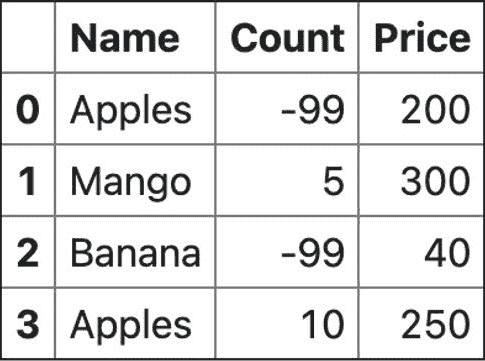

图 4.5–用特定值填充数据框中缺失的值

注意

填充值(如-9、-99 和-999)通常用于指示数据分析中的遗漏。

让我们看看如何在下一节中删除重复项。

## 删除重复项

重复字段是在数据框中处理系列或列时的常见场景。例如，看看下面代码中的系列:

```js
data = [10, 45, 56, 10, 23, 20, 10, 10]
sf = new dfd.Series(data)
table(sf)
```

代码的输出如下图所示:


图 4.6–具有重复字段的系列

在前面的图中，可以看到数值`10`出现了多次。如果需要，您可以使用`drop_duplicates`功能轻松删除这些副本。`drop_duplicates`功能的签名如下:

```js
Series.drop_duplicates({inplace, keep)
```

`drop_duplicates`函数只有两个参数，第一个参数(`inplace`)非常不言自明。第二个参数`keep`可用于指定要保留哪些副本。您可以保留系列中的第一个或最后一个副本。这有助于在删除重复项后保留序列中的结构和顺序或值。

让我们看看这是怎么回事。在下面的代码块中，我们删除所有重复的值，只保留第一次出现的值:

```js
data1 = [10, 45, 56, 10, 23, 20, 10, 10, 20, 20]
sf = new dfd.Series(data1)
sf_drop = sf.drop_duplicates({keep: "first"})
table(sf_drop)
```

代码的输出如下图所示:


图 4.7–在保留设置为第一的情况下删除副本后的系列

查看前面的输出，您可以看到重复项的第一个值被保留，而其他值被删除。相比之下，让我们将`keep`参数设置为`last`并观察字段的顺序变化:

```js
sf_drop = sf.drop_duplicates({keep: "last"})
table(sf_drop)
```

代码的输出如下图所示:


图 4.8–删除副本后的系列，保留设置为最后一个

请注意，最后一个`10`和`20`重复的字段被保留，并且顺序与我们将`keep`设置为`first`时不同。下图将帮助您理解删除副本时的`keep`参数:

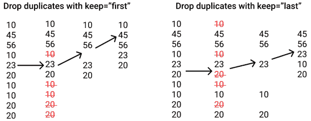

图 4.9–保留设置为第一个或最后一个时输出之间的差异

从上图中，您会发现将`keep`设置为`first`或`last`的主要区别在于结果值的顺序。

在下一小节中，我们将使用`map`函数来查看数据转换。

## 利用地图功能进行数据转换

在某些情况下，您可能希望对序列或数据框列中的每个值应用转换。当你有一些自定义函数或映射，并且想要轻松地将其应用到每个领域时，这通常很有用。Danfo.js 提供了一个叫做`map`的简单界面，可以在这里使用。我们来看一个例子。

让我们假设在`grams`中有一个项目及其相应权重的数据框架，如以下代码所示:

```js
df = new dfd.DataFrame({'item': ['salt', 'sugar', 'rice', 'apple', 'corn', 'bread'],
'grams': [400, 200, 120, 300, 70.5, 250]})
table(df)
```

代码的输出如下图所示:


图 4.10–包含项目及其相应重量(克)的数据框

我们想创建一个名为`kilograms`的新列，它的值是对应的克数，但转换成公斤数。在这里，我们可以执行以下操作:

1.  用以下代码创建一个`convertToKg`函数:

    ```js
    function convertToKg(gram){
      return gram / 1000
    }
    ```

2.  调用`grams`列的`map`功能，如下代码块所示:

    ```js
    kilograms = df['grams'].map(convertToKg)
    ```

3.  Add the new `kilograms` column to the DataFrame using the `addColumn` function, as shown in the following code:

    ```js
    df.addColumn({ "column": "kilograms", "value": kilograms  });
    ```

    综上所述，我们有以下代码:

    ```js
    df = new dfd.DataFrame({'item': ['salt', 'sugar', 'rice', 'apple', 'corn', 'bread'],
    'grams': [400, 200, 120, 300, 70.5, 250]})
    function convertToKg(gram){
      return gram / 1000
    } 
    kilograms  = df['grams'].map(convertToKg)
    df.addColumn({ "column": "kilograms", "value": kilograms  });
    table(df)
    ```

    代码输出如下图所示:


图 4.11–包含项目及其相应重量(克)的数据框

当你把一个有键值对的对象传递给`map`函数时，它也可以执行一对一的映射。这可以用于编码、快速映射等等。让我们看一个例子。

假设我们有以下系列:

```js
sf = new dfd.Series([1, 2, 3, 4, 4, 4])
```

这里，我们希望将每个数值映射到其对应的名称。我们可以指定一个`mapper`对象，并将其传递给`map`函数，如下代码所示:

```js
mapper = { 1: "one", 2: "two", 3: "three", 4: "four" }
sf = sf.map(mapper)
table(sf)
```

代码的输出如下图所示:


图 4.12–数值映射到字符串名称的系列

`map`函数在使用 Series 时是非常有用的，但是有时，您可能想要将函数应用于特定的轴(行或列)。在这种情况下，可以使用另一个名为`apply`函数的 Danfo.js 函数。

在下一节，我们将介绍`apply`功能。

## 具有应用功能的数据转换

`apply`功能可用于将功能或变换映射到数据框中的特定轴。它比`map`功能更高级更强大一点，我们来解释一下原因。

首先是我们可以在指定的轴上应用张量运算。让我们看一下包含以下值的数据帧:

```js
data = [[1, 2, 3], [4, 5, 6], [20, 30, 40], [39, 89, 78]]
cols = ["A", "B", "C"]
df = new dfd.DataFrame(data, { columns: cols })
table(df)
```

代码的输出如下图所示:


图 4.13–包含三列的示例数据框

现在，我们可以在指定的 T2 轴上应用任何兼容的张量运算。例如，在下面的代码中，我们可以将一个`softmax`函数([https://en.wikipedia.org/wiki/Softmax_function](https://en.wikipedia.org/wiki/Softmax_function))应用于数据框中的每个元素:

```js
function sum_vals(x) {
    return x.softmax()
}
let df_new = df.apply({axis: 0, callable: sum_vals })
table(df_new)
```

代码的输出如下图所示:


图 4.14–逐个元素应用 softmax 函数后的数据帧

注意

我们将轴设置为`0`进行元素方向的张量运算。这是因为某些张量运算不能按元素方式执行。您可以在[https://js.tensorflow.org/api/latest/](https://js.tensorflow.org/api/latest/)了解更多支持的操作。

让我们看另一个例子，应用一个函数，它可以分别在列(轴= 1)和行(轴= 0)上工作。

我们将为此使用 TensorFlow `sum`函数，如下面的代码所示。首先，让我们将其应用于行轴:

```js
data = [[1, 2, 3], [4, 5, 6], [20, 30, 40], [39, 89, 78]] 
cols = ["A", "B", "C"] 
df = new dfd.DataFrame(data, { columns: cols })
function sum_vals(x) { 
    return x.sum() 
} 
df_new = df.apply({axis: 0, callable: sum_vals }) 
table(df_new)
```

打印`df_new`数据帧会产生以下输出:


图 4.15–在行(0)轴上应用求和函数后的数据帧

使用与前面相同的数据框，将轴更改为`1`进行列式操作，如以下代码片段所示:

```js
df_new = df.apply({axis: 1, callable: sum_vals }) 
table(df_new)
```

打印数据帧会产生以下输出:

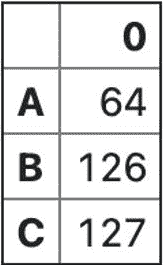

图 4.16–在列(1)轴上应用求和函数后的数据帧

自定义的 JavaScript 函数也可以和`apply`函数一起使用。这里唯一需要注意的是，您不需要指定轴，因为 JavaScript 函数是按元素应用的。

让我们看一个用 JavaScript 函数使用`apply`的例子。在下面的代码块中，我们将`toLowerCase`字符串函数应用于数据框中的每个元素:

```js
data = [{ short_name: ["NG", "GH", "EGY", "SA"] },
             { long_name: ["Nigeria", "Ghana", "Eqypt", "South Africa"] }]
df = new dfd.DataFrame(data)
function lower(x) {
    return '${x}'.toLowerCase()
}
df_new = df.apply({ callable: lower })
table(df_new)
```

打印数据帧会产生以下输出:


图 4.17–逐元素应用 JavaScript 函数后的数据帧

`apply`功能非常强大，可用于对数据框或系列中的列或行应用自定义转换。在下一小节中，我们将了解过滤和查询数据帧和系列的不同方式。

## 过滤查询

当我们需要获取满足特定布尔条件的数据子集时，过滤和查询非常重要。过滤和查询可以使用`query`方法在数据帧和序列上进行，我们将在下面的例子中演示。

假设我们有一个包含以下列的数据框:

```js
data = {"A": [30, 1, 2, 3],
         "B": [34, 4, 5, 6],
         "C": [20, 20, 30, 40]}
cols = ["A", "B", "C"]
df = new dfd.DataFrame(data, { columns: cols })
table(df)
```

打印数据帧会产生以下输出:


图 4.18–带有查询样本值的数据帧

现在，让我们过滤数据框，只返回`B`列的值大于`5`的行。这将返回行`0`和`3`。我们可以通过`query`函数来实现，如下面的代码所示:

```js
df_filtered = df.query({ column: "B", is: ">", to: 5})
table(df_filtered)
```

这为我们提供了以下输出:

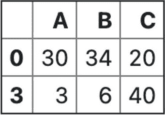

图 4.19–查询后的数据帧

`query`方法接受所有 JavaScript 布尔运算符(`>`、`<`、`>=`、`<=`和`==`)，它也对字符串列起作用，如下例所示。

首先，让我们创建一个带有字符串列的数据框:

```js
data = {"A": ["Ng", "Yu", "Mo", "Ng"],
            "B": [34, 4, 5, 6], 
            "C": [20, 20, 30, 40]}

df = new dfd.DataFrame(data)
table(df)
```

输出如下图所示:


图 4.20–应用字符串查询前的数据帧

接下来，我们将使用等于运算符(`"=="`)运行查询:

```js
query_df = df.query({ column: "A", is: "==", to: "Ng"})
table(query_df)
```

这导致以下输出:

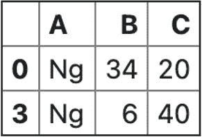

图 4.21–应用字符串查询后的数据帧

在大多数情况下，您正在查询的数据框很大，因此您可能希望就地执行查询。这可以通过将`inplace`指定为`true`来实现，如下代码块所示:

```js
data = {"A": [30, 1, 2, 3],
         "B": [34, 4, 5, 6],
         "C": [20, 20, 30, 40]}

cols = ["A", "B", "C"]
df = new dfd.DataFrame(data, { columns: cols })
df.query({ column: "B", is: "==", to: 5, inplace: true })
table(df)
```

打印数据帧会产生以下输出:


图 4.22–执行就地查询后的数据帧

`query`方法非常重要，你在通过特定属性过滤数据的时候会用到很多。使用`query`功能的另一个好处是它允许`inplace`功能，这意味着它对过滤大数据集很有用。

在下一小节中，我们将看看另一个有用的概念，叫做随机抽样。

## 随机抽样

当您需要随机重新排序行时，从数据帧或系列中随机取样是有用的。这在**机器学习** ( **ML** )之前的预处理步骤中最有用。

让我们看一个使用随机抽样的例子。假设我们有一个包含以下值的数据帧:

```js
data = [[1, 2, 3], [4, 5, 6], [20, 30, 40], [39, 89, 78]] 
cols = ["A", "B", "C"] 
df = new dfd.DataFrame(data, { columns: cols }) 
table(df)
```

这导致以下输出:

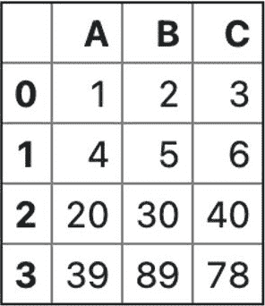

图 4.23–随机采样前的数据帧

现在，让我们通过调用 DataFrame 上的`sample`函数随机选择两行，如下代码所示:

```js
async function load_data() {
  let data = {
    Name: ["Apples", "Mango", "Banana", "Pear"],
    Count: [21, 5, 30, 10],
    Price: [200, 300, 40, 250],
  };

  let df = new dfd.DataFrame(data);
  let s_df = await df.sample(2);
  s_df.print();

}
load_data()
```

这导致以下输出:


图 4.24–随机采样两行后浏览器控制台中的数据框

在前面的代码中，您会注意到代码被包装在一个`async`函数中。这是因为`sample`方法返回了一个承诺，因此，我们必须等待结果。前面的代码可以在浏览器或 node.js 环境中按原样执行，但是在 Dnotebook 中需要稍微调整一下。

如果您想在 Dnotebook 中运行精确的代码，您可以这样调整它:

```js
var sample;
async function load_data() {
  let data = {
    Name: ["Apples", "Mango", "Banana", "Pear"],
    Count: [21, 5, 30, 10],
    Price: [200, 300, 40, 250],
  };

  let df = new dfd.DataFrame(data);
  let s_df = await df.sample(2);
  sample = s_df

}
load_data()
```

在前面的代码中，您可以看到我们使用`var`显式定义了`sample`。这使得`sample`变量可用于所有细胞。相反，在这里使用`let`声明将使变量只对定义它的单元格可用。

接下来，在新的单元格中，您可以使用`table`方法打印示例数据框，如以下代码所示:

```js
table(sample)
```

这将产生以下输出:


图 4.25–随机采样两行后的数据框

在下一节中，我们将简要讨论 Danfo.js 中可用的一些编码特性。

## 编码数据帧和序列

**编码**是另一个重要的变换，可以应用于 ML 或**统计建模**之前的数据帧/序列。这是一个重要的数据预处理步骤，总是在将数据输入模型之前执行。

ML 或统计模型只能处理数值，因此，所有字符串/分类列都必须适当地转换为数值形式。编码的类型很多，比如**一热编码**、**标签编码**、**均值编码**等等，编码的选择可能会有所不同，具体取决于你拥有的数据类型。

Danfo.js 目前支持两种流行的编码方案:*标签*和*一热编码器*，下一节我们会讲解如何使用。

### 标签编码器

标签编码器将一列中的类别映射为一个介于 0 和该列中唯一类别数量之间的整数值。让我们看一个在数据帧上使用它的例子。

假设我们有以下数据帧:

```js
data = { fruits: ['pear', 'mango', "pawpaw", "mango", "bean"] ,
            Count: [20, 30, 89, 12, 30],
            Country: ["NG", "NG", "GH", "RU", "RU"]}
df = new dfd.DataFrame(data)
table(df)
```

打印数据帧会产生以下输出:

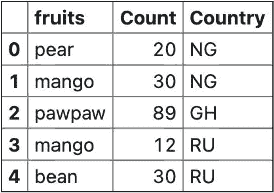

图 4.26–编码前的数据帧

现在，让我们使用`LabelEncoder`对`fruits`列进行编码，如下代码块所示:

```js
encode = new dfd.LabelEncoder() 
encode.fit(df['fruits']) 
```

在前面的代码块中，您会注意到我们首先创建了一个`LabelEncoder`对象，然后在列(`fruits`)上调用了`fit`方法。`fit`方法只是学习映射并将其存储在编码器对象中。稍后我们将会看到，这可以用于转换任何列/数组。

调用`fit`方法后，我们必须调用`transform`方法来应用标签，如下代码块所示:

```js
sf_enc = encode.transform(df['fruits']) 
table(sf_enc)
```

打印数据帧会产生以下输出:


图 4.27–标签编码前的数据帧

从前面的输出中，您可以看到已经为每个标签分配了唯一的整数。在`fit`(学习)阶段，在具有不可用的新类别的列上调用`transform`的情况下，它用值`–1`表示。让我们看一下这个例子，而使用的编码器与前面的例子相同:

```js
new_sf = encode.transform(["mango","man", "car", "bean"])
table(new_sf)
```

打印数据帧会产生以下输出:

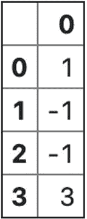

图 4.28–对具有新类别的阵列应用转换后的数据帧

在前面的例子中，您可以看到我们在一个带有新类别(`man`和`car`)的数组上调用训练好的编码器。请注意，输出中有`–1`来代替这些新的类别，正如我们之前解释的那样。

接下来，我们来谈谈一热编码。

### 一次性编码

热门的编码主要应用于数据集中的序数类别。在这个编码方案中，`0`(热)和`1`(冷)的二进制值用于编码唯一的类别。

使用与前面部分相同的数据框，让我们创建一个单热编码器对象，并将其应用于`country`列，如以下代码块所示:

```js
encode = new dfd.OneHotEncoder()  
encode.fit(df['country']) 
sf_enc = encode.transform(df['country']) 
table(sf_enc)
```

打印数据帧会产生以下输出:


图 4.29–一次热编码后的数据帧

从前面的输出中，您可以看到，对于每个唯一的类别，使用一系列 1 和 0 来替换类别，现在已经生成了两个额外的列。下面的图让我们直观地了解了每个独特的类是如何映射到一个热门类别的:


图 4.30–三个类别的一键编码映射

我们将讨论的 Danfo.js 中最后一个编码特性是`get_dummies`函数。该函数的工作方式与 one-hot 编码函数相同，但主要区别在于，您可以将其应用于 DataFrame，并且它会自动编码找到的任何分类列。

我们来看一个使用`get_dummies`函数的例子。假设我们有以下数据帧:

```js
data = { fruits: ['pear', 'mango', "pawpaw", "mango", "bean"] ,
            count: [20, 30, 89, 12, 30],
            country: ["NG", "NG", "GH", "RU", "RU"]}
df = new dfd.DataFrame(data)
table(df)
```

打印数据帧会产生以下输出:


图 4.31–应用 get_dummies 函数前的数据帧

现在，我们可以通过将数据帧传递给`get_dummies`函数来一次性编码所有分类列(`fruits`和`country`，如下面的代码块所示:

```js
df_enc = dfd.get_dummies({data: df})
table(df_enc)
```

打印数据帧会产生以下输出:


图 4.32–一键编码三个类别的映射

从上图中可以看到`get_dummies`函数自动检测到`fruits`和`country`分类变量，并对其进行了 one-hot 编码。列是自动生成的，它们的名称以相应的列和类别开始。

注意

您可以指定要编码的列，以及命名每个编码列的前缀。要查看更多可用选项，请参考官方 Danfo.js 文档:[https://danfo.jsdata.org/](https://danfo.jsdata.org/)。

在下一节中，我们将了解组合数据集的各种方法。

# 组合数据集

数据框和系列可以使用丹佛号中的内置函数来组合，根据配置的不同，像`danfo.merge`和`danfo.concat`这样的方法可以帮助您使用熟悉的类似数据库的连接来组合不同形式的数据集。

在这一节中，我们将从`merge`函数开始，简要讨论这些连接类型。

## 数据框架去

`merge`操作类似于数据库`Join`操作，因为它对对象中的列或索引执行连接操作。`merge`的签字操作如下:

```js
danfo.merge({left, right, on, how}) 
```

让我们了解每个参数包含的内容:

*   `left`:要合并到的左侧数据框/系列。
*   `right`:要合并到的右侧数据框/系列。
*   `on`:要加入的列的名称。这些列必须出现在左右数据框中。
*   `how`:参数`how`指定应该如何进行合并。它类似于数据库风格的连接，可以是`left`、`right`、`outer`或`inner`。

Danfo.js `merge`函数与 pandas `merge`函数非常相似，因为它执行类似于关系数据库连接的内存连接操作。下表提供了 Danfo 的合并方法和 SQL 联接的比较:


图 4.33–比较 Danfo.js 合并方法和 SQL 连接(来源:pandas Doc:https://pandas . pydata . org/pandas-docs/stable/user _ guide/merging . html # brief-primer-on-merge-methods-relational-代数)

在下面的部分，我们将给出一些例子来帮助您理解如何以及何时使用`merge`功能。

### 单键内部合并

默认情况下，在单个公共键上合并数据帧会导致内部连接。内部连接要求两个数据帧具有匹配的列值，并返回两者的交集；也就是说，它只返回具有共同特征的那些行的数据帧。

假设我们有两个数据帧，如下面的代码所示:

```js
data = [['K0', 'k0', 'A0', 'B0'], ['k0', 'K1', 'A1', 'B1'],
            ['K1', 'K0', 'A2', 'B2'], ['K2', 'K2', 'A3', 'B3']]
data2 = [['K0', 'k0', 'C0', 'D0'], ['K1', 'K0', 'C1', 'D1'],
            ['K1', 'K0', 'C2', 'D2'], ['K2', 'K0', 'C3', 'D3']]
colum1 = ['Key1', 'Key2', 'A', 'B']
colum2 = ['Key1', 'Key2', 'A', 'D']

df1 = new dfd.DataFrame(data, { columns: colum1 })
df2 = new dfd.DataFrame(data2, { columns: colum2 })
table(df1)
```

打印第一个数据帧会产生以下输出:


图 4.34–执行合并操作的第一个数据帧

我们现在将打印第二个数据帧，如下所示:

```js
table(df2)
```

这将产生以下输出:


图 4.35–执行合并操作的第二个数据帧

接下来，我们将执行内部连接，如以下代码所示:

```js
merge_df = dfd.merge({left: df1, right: df2, on: ["Key1"]})
table(merge_df)
```

打印数据帧会产生以下输出:


图 4.36–一个键上两个数据帧的内部合并

从前面的输出中，您可以看到`Key1`中的内部连接产生了一个包含数据帧 1 和数据帧 2 中所有值的数据帧。这也被称为两个数据帧的**笛卡尔乘积**。

我们可以更进一步合并多个键。我们将在下一节讨论这个问题。

### 两个键的内部合并

对两个键执行内部合并也将返回两个数据框的交集，但它将只返回在数据框的左侧和右侧都找到了键的行。

使用我们之前创建的相同数据帧，我们可以对两个键执行内部连接，如以下代码所示:

```js
merge_mult_df = dfd.merge({left: df1, right: df2, on: ["Key1", "Key2"]})
table(merge_mult_df)
```

打印数据帧会产生以下输出:


图 4.37–两个键上两个数据帧的内部合并

从前面的输出中，您可以看到，对两个键执行内部合并会产生一个数据框，只有这些键出现在数据框的左侧和右侧。

### 单键外部合并

正如我们在上表中看到的，外部合并执行两个数据帧的合并。也就是说，它从两个数据帧中的键返回值。对单个键执行外部联接将返回与对单个键执行内部联接相同的结果。

使用之前的相同数据帧，我们可以指定`how`参数，将合并行为从默认的`inner`连接更改为`outer`，如以下代码所示:

```js
merge_df = dfd.merge({ left: df1, right: df2, on: ["Key1"], how: "outer"})
table(merge_df)
```

打印数据帧会产生以下输出:


图 4.38–在一个键上两个数据帧的外部合并

从上图可以看出，第一个带键的 data frame(`K0`、`K0`、`K1`、`K2`)和第二个带键的 data frame(`K0`、`K1`、`K1`、`K2`)的并集为(`K0`、`K0`、`K1`、`K1`、`K2`)。然后，这些键被用来统一数据帧。这样做之后，我们收到了上表所示的结果。

我们还可以对两个键执行外部连接。这不同于两个键的内部连接，我们将在下面的小节中看到。

### 两个键的外部合并

仍然使用之前的相同的数据帧，我们可以添加第二个键，如下面的代码所示:

```js
merge_df = dfd.merge({ left: df1, right: df2, on: ["Key1", "Key2"], how: "outer"})
table(merge_df)
```

打印数据帧会产生以下输出:


图 4.39–两个键上两个数据帧的外部合并

在前面的输出中，我们可以看到返回的行总是在`Key1`和`Key2`中有键。如果第一个数据框中的键不在第二个数据框中，这些值总是用`NaN`填充。

注意

Danfo.js 中的合并不支持一次合并两个以上的键。这在未来可能会改变，所以如果你需要支持这样的功能，一定要查看官方 Danfo.js GitHub 存储库中的 *Discussions* 部分([https://github.com/opensource9ja/danfojs](https://github.com/opensource9ja/danfojs))。

在接下来的部分中，我们将简要地看一下左右连接，这在执行合并时也很重要。

### 左右合并

右连接和左连接非常简单；它们只返回键出现在指定的`how`参数中的行。例如，假设我们将`how`参数指定为`right`，如以下代码所示:

```js
merge_df = dfd.merge({ left: df1, right: df2, on: ["Key1", "Key2"], how: "right"})
table(merge_df)
```

打印数据帧会产生以下输出:


图 4.40–两个键上两个数据帧的右合并

生成的图表仅显示其键出现在右侧数据框中的行。这意味着在执行合并时，正确的数据帧会被赋予更高的优先级。

如果我们将`how`设置为`left`，那么左侧数据框将获得更高的优先级，并且我们只看到其键出现在左侧数据框中的行。以下代码显示了执行`left`连接的示例:

```js
merge_df = dfd.merge({ left: df1, right: df2, on: ["Key1", "Key2"], how: "left"})
table(merge_df)
```

打印数据帧会产生以下输出:

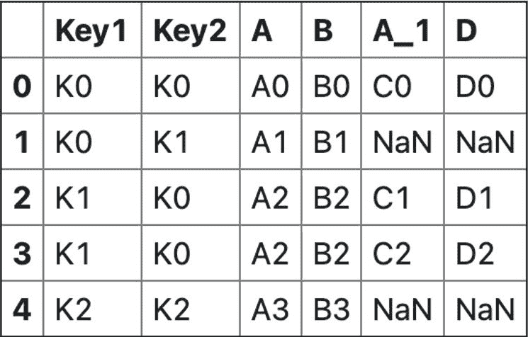

图 4.41–两个键上两个数据帧的左合并

查看前面的输出，我们可以确认结果行更倾向于左边的数据框。

Danfo.js `merge`函数非常强大和有用，当您开始使用多个具有重叠键的数据集时，它会派上用场。在下一节中，我们将介绍另一个有用的函数，称为**串联**，用于转换数据集。

## 数据拼接

连接数据是另一种重要的数据组合技术，顾名思义，这基本上是将数据沿着一个轴连接、堆叠或排列在一起。

Danfo.js 中串联数据的函数公开为`danfo.concat`，该函数的签名如下:

```js
danfo.concat({df_list, axis}) 
```

让我们了解每个参数代表什么:

*   `df_list`:`df_list`参数是要连接在一起的数据帧或系列的数组。
*   `axis`:`axis`参数可以接受一行(0)或一列(1)，并指定对象将对齐的轴。

接下来，我们将给出一些例子来帮助您理解如何使用`concat`功能。首先，我们将学习如何沿着行轴连接三个数据帧。

### 沿着行轴连接数据帧(0)

首先，让我们创建三个数据帧，如下代码所示:

```js
df1 = new dfd.DataFrame( 
    { 
           "A": ["A_0", "A_1", "A_2", "A_3"], 
           "B": ["B_0", "B_1", "B_2", "B_3"], 
           "C": ["C_0", "C_1", "C_2", "C_3"] 
        },
        index=[0, 1, 2], 
  ) 
df2 = new dfd.DataFrame( 
       { 
          "A": ["A_4", "A_5", "A_6", "A_7"], 
          "B": ["B_4", "B_5", "B_6", "B_7"], 
          "C": ["C_4", "C_5", "C_6", "C_7"], 
       }, 
       index=[4, 5, 6], 
    ) 
df3 = new dfd.DataFrame( 
    { 
          "A": ["A_8", "A_9", "A_10", "A_11"], 
           "B": ["B_8", "B_9", "B_10", "B_11"], 
           "C": ["C_8", "C_9", "C_10", "C_11"]
       }, 
       index=[8, 9, 10], 
   )
table(df1)
table(df2)
table(df3)
```

使用 Node.js 和浏览器中的`print`函数打印每个数据帧，或者使用 Dnotebook 中的`table`函数，将会给出以下输出。

`df1`数据框的输出如下:

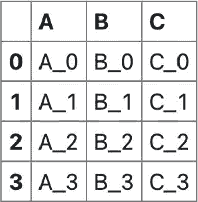

图 4.42–要连接的第一个数据帧(df1)

`df2`数据框的输出如下:

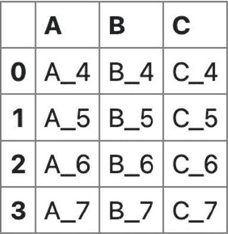

图 4.43–要连接的第二个数据帧(df2)

最后，`df3`数据帧的输出如下:

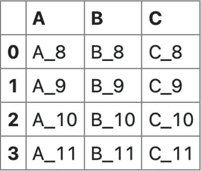

图 4.44–要连接的第三个数据帧(df3)

现在，让我们使用`concat`函数组合这些数据帧，如以下代码所示:

```js
df_frames = [df1, df2, df3]
combined_df = dfd.concat({df_list: df_frames, axis: 0})
table(combined_df)
```

这将产生以下输出:


图 4.45–沿行轴连接三个数据帧的结果(0)

这里可以看到的`concat`功能只是沿着列轴组合每个数据帧(`df1`、`df2`、`df3`)；也就是说，它将它们堆叠在`df_list`的第一个数据框下，以创建一个巨大的组合。

此外，指数看起来也不同。这是因为，在内部，Danfo.js 为组合生成了新的索引。如果需要数字索引，可以使用`reset_index`功能，如下面代码所示的:

```js
combined_df.reset_index(true)
table(combined_df)
```

这将产生以下输出:


图 4.46–重置组合数据帧的索引

现在，使用相同的数据帧沿列轴串联会是什么样子？我们将在下一节中尝试这种方法。

### 沿着列轴连接数据帧(1)

使用我们之前创建的相同数据帧，只需在`concat`代码中将`axis`更改为`1`，如下代码所示:

```js
df_frames = [df1, df2, df3]
combined_df = dfd.concat({df_list: df_frames, axis: 1})
table(combined_df)
```

打印数据帧会产生以下输出:


图 4.47–沿列轴(0)对三个数据帧应用 concat 的结果

串联也适用于系列对象。我们将在下一节看一个例子。

### 沿着指定的轴连接系列

系列也是 Danfo.js 数据结构，因此`concat`函数也可以用在它们上面。这与连接数据帧的方式相同，我们将很快演示。

使用上一节中的数据帧，我们将创建一些 Series 对象，如以下代码所示:

```js
series_list = [df1['A'], df2['B'], df3['D']]
```

请注意，我们正在使用数据框子设置从数据框中抓取不同的列作为系列。现在，我们可以将这些序列组合成一个数组，然后传递给`concat`函数，如下面的代码所示:

```js
series_list = [df1['A'], df2['B'], df3['D']]
combined_series = dfd.concat({df_list: series_list, axis: 1})
table(combined_series)
```

打印数据帧会产生以下输出:

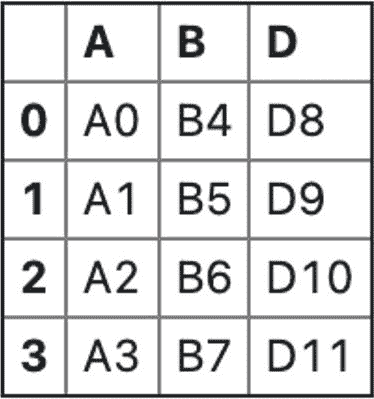

图 4.48–沿行轴(0)对三个系列应用 concat 的结果

将轴更改为行(0)也将有效，并返回一个包含大量缺失条目的数据框，如下图所示:


图 4.49–沿列轴对三个系列应用 concat 的结果(1)

现在，您可能想知道为什么在结果组合中有许多缺失的字段。这是因为当对象沿着指定的轴组合时，有时对象的位置/长度不会与第一个数据框对齐。用`NaN`到填充以返回一致的长度。

在本小节中，我们介绍了两个重要的功能(`merge`和`concat`)，它们可以帮助您在数据框或系列上执行复杂的组合。在下一节中，我们将讨论一些不同但同样重要的东西，那就是**字符串/文本操作**。

# 系列数据存取器

Danfo.js 提供各种访问器下的数据类型特定的方法。**访问器**是 Series 对象中的命名空间，只能在特定的数据类型上应用/调用。目前为字符串和日期时间序列提供了两种访问器，在本节中，我们将讨论每种访问器，并提供一些示例来说明这一点。

### 字符串访问器

可以在`str`访问器下访问数据框中的字符串列或带有`dtype`字符串的系列。在这样的对象上调用`str`访问器会暴露出许多用于操作数据的字符串函数。我们将在这一部分给出一些例子。

假设我们有一个包含以下字段的系列:

```js
data = ['lower boy', 'capitals', 'sentence', 'swApCaSe']
sf = new dfd.Series(data)
table(sf)
```

打印此系列会产生下图:

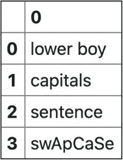

图 4.50–沿列轴对三个系列应用 concat 的结果(1)

从前面的输出中，我们可以看到 Series ( `sf`)包含文本，并且是字符串类型。您可以用`dtype`功能确认，如下代码所示:

```js
console.log(sf.dtype)
```

输出如下:

```js
string
```

现在我们有了我们的 Series，它是字符串数据类型的，我们可以在上面调用`str`访问器，并使用各种 JavaScript 字符串方法，如`capitalize`、`split`、`len`、`join`、`trim`、`substring`、`slice`、`replace`等，如下例所示。

以下代码将`capitalize`功能应用于系列:

```js
mod_sf = sf.str.capitalize() 
table(mod_sf)
```

打印此系列会产生以下输出:

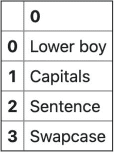

图 4.51–将大写应用于字符串系列的结果

以下代码将`substring`功能应用于系列:

```js
mod_sf = sf.str.substring(0,3) //returns a substring by start and end index
table(mod_sf)
```

打印此系列会产生以下输出:

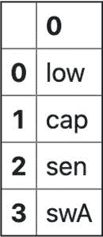

图 4.52–将子字符串函数应用于字符串系列的结果

以下代码将`replace`功能应用于系列:

```js
mod_sf = sf.str.replace("lower", "002") //replaces a string with specified value
table(mod_sf)
```

打印该系列会产生以下输出:

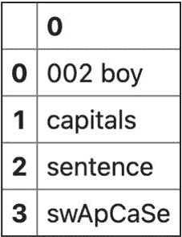

图 4.53–对字符串系列应用替换函数的结果

以下代码将`join`功能应用于系列:

```js
mod_sf = sf.str.join("7777", "+") // joins specified value to Series
table(mod_sf)
```

打印本系列结果如下图:

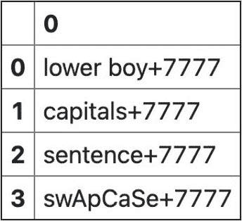

图 4.54–将连接函数应用于字符串系列的结果

以下代码将`indexOf`功能应用于系列:

```js
mod_sf = sf.str.indexOf("r") //Returns the index where the value is found else -1
table(mod_sf)
```

打印此系列会产生以下输出:


图 4.55–将 indexOf 函数应用于字符串系列的结果

注意

通过`str`访问器有许多公开的字符串方法。您可以查看丹福. js 文档([https://丹福. jsdata . org/API-reference/series # string-handling](https://danfo.jsdata.org/api-reference/series#string-handling))中的完整列表。

### 日期时间访问器

Danfo.js 在 Series 对象上公开的第二个访问器是日期时间访问器。这可以在`dt`命名空间下访问。在进行数据转换时，从日期时间列中处理和提取不同的信息(如日、月和年)是一个常见的过程，因为日期时间原始格式几乎没有用处。

如果你的数据有一个日期时间列，可以在上面调用`dt`访问器，这反过来暴露了可以用来提取信息的各种函数，比如年、月、月名、星期几、小时、秒和分钟。

让我们看一些在带有日期列的系列中使用`dt`访问器的例子。首先，我们将创建一个包含一些日期时间字段的系列:

```js
timeColumn = ['12/13/2016 15:00:20', '10/20/2019 18:30:00', '1/1/2020 12:00:00', '1/30/2020 16:20:00', '11/12/2019 22:00:30'] 
sf = new dfd.Series(timeColumn, {columns: ["times"]})
table(sf)
```

打印此系列会产生以下输出:


图 4.56–带有日期-时间字段的系列

现在我们有了带有日期字段的系列，我们可以提取一些信息，例如一天中的小时、年、月或星期几。我们需要做的第一件事是使用`dt`访问器将 Series 转换为 Danfo.js 的日期时间格式，如下面的代码所示:

```js
dateTime = sf['times'].dt  
```

`dateTime`变量现在公开了提取日期信息的不同方法。利用这一点，我们可以做到以下任何一点:

*   Get the hour of the day as a new Series:

    ```js
    dateTime = sf.dt 
    hours = dateTime.hour()
    table(hours)
    ```

    这为我们提供了以下输出:


图 4.57–显示一天中提取的小时的新系列

*   Get the year as a new Series:

    ```js
    dateTime = sf.dt 
    years = dateTime.year()
    table(years)
    ```

    这为我们提供了以下输出:


图 4.58–显示提取年份的新系列

*   Get the month as a new Series:

    ```js
    dateTime = sf.dt 
    month_name = dateTime.month_name()
    table(month_name)
    ```

    这为我们提供了以下输出:

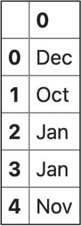

图 4.59–显示提取的月份名称的新系列

*   Get the day of the week as a new Series:

    ```js
    dateTime = sf.dt  
    weekdays = dateTime.weekdays() 
    table(weekdays)
    ```

    这为我们提供了以下输出:

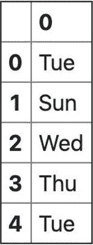

图 4.60–显示一周中提取的一天的新系列

由`dt`访问器公开的其他一些功能如下:

*   `Series.dt.month`:以整数形式返回月份，从 1 月 1 日到 12 月 12 日。
*   `Series.dt.day`:以整数形式返回一周中的某一天，从 0(星期一)到 6(星期日)开始。
*   `Series.dt.minutes`:以整数形式返回一天中的分钟。
*   `Series.dt.seconds`:以整数形式返回一天中的秒数。

恭喜你完成了这一部分！数据转换和聚合是数据分析中非常重要的方面。有了这些知识，您可以正确地转换和维护数据集。

在下一节中，我们将向您展示如何使用 Danfo.js 计算数据集的描述性统计数据。

# 计算统计

Danfo.js 自带一些重要的统计和数学函数。这些函数可用于生成整个数据帧以及单个系列的摘要或描述性统计数据。在数据集中，统计数据很重要，因为它们可以让我们更好地洞察数据。

在接下来的部分中，我们将使用流行的 Titanic 数据集，您可以从以下 GitHub 存储库中下载:[https://GitHub . com/PacktPublishing/Building-Data-Driven-Applications-with-danfo . js/blob/main/chapter 03/Data/Titanic . CSV](https://github.com/PacktPublishing/Building-Data-Driven-Applications-with-Danfo.js/blob/main/Chapter03/data/titanic.csv)。

首先，让我们使用`read_csv`函数将数据集加载到 Dnotebook 中，如下代码所示:

```js
var df //using var so df is available to all cells
load_csv("https://raw.githubusercontent.com/plotly/datasets/master/finance-charts-apple.csv")
.then((data)=>{
  df = data
})
```

前面的代码从指定的网址加载泰坦尼克号数据集，并将其保存在`df`变量中。

注意

我们在这里使用`load_csv`和`var`声明，因为我们在 Dnotebook 中工作。正如我们一直提到的，您不会在浏览器或 Node.js 脚本中使用这种方法。

现在，在一个新的单元格中，我们可以打印加载数据集的标题:

```js
table(df.head())
```

打印数据帧会产生以下输出:


图 4.61–泰坦尼克号数据集的前五行

我们可以对整个数据调用`describe`函数，快速得到所有列的描述统计，如下代码所示:

```js
table(df.describe())
```

打印数据帧会产生以下输出:


图 4.62–在泰坦尼克号数据集上使用描述函数的输出

在前面的代码中，我们调用了`describe`函数，然后用`table`打印输出。`describe`功能只适用于数字数据类型，默认情况下，它只会自动选择属于`float32`或`int32`类型的列。

注意

默认情况下，在执行计算之前，所有统计和数学计算都会移除`NaN`值。

`describe`功能为以下内容提供描述性统计:

*   **计数**:这是一列的总行数，不包括`NaN`值。
*   **表示**:一列的平均值。
*   **标准偏差** ( **标准**):一组值的变化量或离差的度量。
*   **最小值** ( **min** ):一列中的最小值。
*   **中位数**:一列中的中间值。
*   **最大** ( **最大**):一列中的最大值。
*   **方差**:从平均值开始的数值分布的度量。

## 按轴计算统计

`describe`功能虽然快捷易用，但当需要沿特定轴计算统计数据时，并没有太大帮助。在本节中，我们将介绍一些最流行的方法，并向您展示如何基于指定的轴计算统计数据。

可以在具有指定轴的数据框上调用中心趋势，如平均值、模式和中位数。这里`0`轴代表`rows`，而`1`轴代表`columns`。

在下面的代码中，我们正在计算 Titanic 数据集中数值列的平均值、模式和中值:

```js
df_nums = df.select_dtypes(['float32', "int32"]) //select all numeric dtype columns
console.log(df_nums.columns)
[AAPL.Open,AAPL.High,AAPL.Low,AAPL.Close,AAPL.Volume,AAPL.Adjusted,dn,mavg,up]
```

在前面的代码中，我们选择了所有的数字列，以便应用数学运算。接下来，我们将调用`mean`函数，默认情况下，该函数返回列轴上的平均值(`1`):

```js
col_mean = df_nums.mean()
table(col_mean)
```

打印数据帧导致以下输出:


图 4.63–调用数值列的均值函数

前面输出中显示的精度看起来有点太长。我们可以将结果四舍五入到两位小数，使其更具代表性，如以下代码所示:

```js
col_mean = df_nums.mean().round(2)
table(col_mean)
```

打印数据帧会产生以下输出:

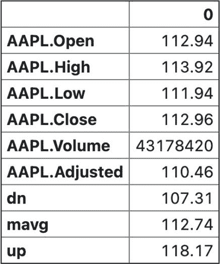

图 4.64–调用数值列的均值函数并将数值舍入到两位小数

当舍入到两位小数时，结果输出看起来更加清晰。接下来，让我们计算跨行轴的`mean`:

```js
row_mean = df_nums.mean(axis=0)
table(row_mean)
```

这为我们提供了以下输出:


图 4.65–在行轴上调用均值函数

在前面的输出中，您可以看到返回值有数字标签。这是因为行轴最初有数字标签。

用同样的思路，我们可以计算出模式、中位数、标准差、方差、累计和、累计均值、绝对值等统计量。以下是 Danfo.js 中目前可用的统计函数:

*   `abs`:返回一个序列/数据帧，其中包含每个元素的绝对数值。
*   `count`:统计每一列或每一行的单元格，不包括`NaN`值。
*   `cummax`:返回数据帧或系列的累计最大值。
*   `cummin`:返回数据帧或系列的累计最小值。
*   `cumprod`:返回数据帧或系列的累计乘积。
*   `cumsum`:返回数据帧或序列的累计总和。
*   `describe`:生成描述性统计。
*   `max`:返回请求轴的最大值。
*   `mean`:返回请求轴的平均值。
*   `median`:返回所请求轴的值的中间值。
*   `min`:返回请求轴的最小值。
*   `mode`:返回沿选定轴的元素模式。
*   `sum`:返回请求轴的值的总和。
*   `std`:返回要求轴的标准偏差。
*   `var`:返回要求轴上的无偏方差。
*   `nunique`: Counts the distinct elements over the requested axis.

    注意

    支持的功能列表可能会改变，并且会增加新的功能。因此，最好通过查看来跟踪新的数据。

描述性统计非常重要，在本节中，我们成功地介绍了一些重要的函数，这些函数可以帮助您在 Danfo.js 中有效地计算基于指定轴的统计数据。

# 总结

在本章中，我们已经成功地介绍了 Danfo.js 中可用的数据转换和清理函数。首先，我们向您介绍了用于替换值、填充缺失值和检测缺失值的各种清理函数，以及将自定义函数应用于数据集的应用和映射方法。对这些功能和技术的了解可以确保您拥有构建数据驱动产品所需的基础，并从数据中获得洞察力。

接下来，我们向您展示了如何使用 Danfo.js 中的各种合并和串联函数。

在下一章中，我们将更进一步，向您展示如何使用 Danfo.js 的内置绘图功能以及通过集成第三方绘图库来制作美丽而惊人的图表/绘图。