# *第五章*:plotly . js 数据可视化

绘图和可视化是数据分析中非常重要的任务，因此，我们将用整整一章的时间来讨论它们。数据分析师通常会执行绘图和数据可视化，作为**探索性数据分析** ( **EDA** )阶段的一部分。这可以极大地帮助识别隐藏在数据中的有用模式，并为数据建模建立直觉。

在这一章中，您将学习如何使用 **Plotly.js** 创建丰富的交互式情节，这些情节可以嵌入到任何 web 应用程序中。

具体来说，我们将涵盖以下主题:

*   plotly . js 简介
*   plotly . js 的基本原理
*   用 Plotly.js 创建基本图表
*   用 Plotly.js 创建统计图表

# 技术要求

为了遵循本章，您应该具备以下条件:

*   现代浏览器，如 Chrome、Safari、Opera 或火狐
*   **Node.js** 和(可选)安装在系统上的**丹佛笔记本** ( **Dnotebook** )
*   用于下载数据集的稳定互联网连接

Dnotebook 的安装说明可以在 [*第二章*](02.html#_idTextAnchor045)*Dnotebook-一个 JavaScript 的交互式计算环境*中找到。

注意

如果不想安装任何软件或库，可以在[https://playnotebook.jsdata.org/](https://playnotebook.jsdata.org/)使用 Dnotebook 在线版。

**Danfo.js** 自带出图**应用编程接口** ( **API** )方便出图，引擎盖下使用 Plotly。这就是我们在本章中介绍 Plotly.js 的主要原因，因为在这里获得的知识将帮助您在下一章中轻松定制使用 Danfo.js 创建的地块。

# plotly . js 简介

根据作者的说法，plotly . js([https://plotly.com/javascript/](https://plotly.com/javascript/))是一个开源的、高级的、声明性的图表库，它建立在流行的 D3 . js([https://d3js.org/](https://d3js.org/))和 stack . GL([https://github.com/stackgl](https://github.com/stackgl))库之上。

它支持超过40 种图表类型，包括以下几种:

*   基本图表，如散点图、折线图、条形图和饼图
*   统计图表，如箱线图、直方图和密度图
*   热图、对数图和等高线图等科学图表
*   财务图表，如瀑布图、烛台图和时间序列图
*   气泡图、choropleth 图和 Mapbox 图等地图
*   **散点图、曲面图以及三维网格的三维** ( **三维**)图表

要使用 Plotly.js，您需要访问浏览器的**文档对象模型** ( **DOM** )。这意味着 Plotly.js 是一个客户端库，因此只能通过**内容交付网络** ( **CDN** )脚本在浏览器中使用，或者在`React`、`Vue`等客户端库中使用。在下一节中，我们将看到如何安装 Plotly.js。

## 通过脚本标签使用 Plotly.js

为了在**超文本标记语言** ( **HTML** )文件中使用 Plotly.js ，需要通过其`script`标签添加 Plotly.js。在下面的代码片段中，我们将 Plotly.js `script`标签添加到一个简单的 HTML 文件的标题部分:

```js
<!DOCTYPE html>
<html lang="en">
<head>
    <meta charset="UTF-8">
    <meta http-equiv="X-UA-Compatible" content="IE=edge">
    <meta name="viewport" content="width=device-width, initial-scale=1.0">
    <title>Document</title>
    <script src="https://cdn.plot.ly/plotly-1.2.0.min.js"></script> 
</head>
<body>

</body>
</html>
```

如前面的代码片段所示，添加完 Plotly.js `script`标签后，保存 HTML 文件并在浏览器中打开它。输出将是一个空页面，但是在引擎盖下，Plotly.js 被添加并在页面中可用。我们可以通过制作一个简单的图来测试这一点，按照这里的步骤:

1.  在 HTML 主体中创建一个`div`标签，在这里将绘制图形。我们给它一个`myPlot`的**标识符** ( **ID** ，如下图:

    ```js
    <body>
     <div id="myPlot">
    </body
    ```

2.  In the body of your HTML page, create sample `x` and `y` data, and then plot a `scatter` plot, as shown in the following code snippet:

    ```js
    ...
    <body>
        <div id="myPlot"></div>
        <script>
            let data = [{
                x: [1, 3, 5, 6, 8, 9, 5, 8],
                y: [2, 4, 6, 8, 0, 2, 1, 2],
                mode: 'markers',
                type: 'scatter'
            }]
            Plotly.newPlot("myPlot", data)
        </script>
    </body>
    ...
    ```

    在浏览器中打开 HTML 文件会得到以下输出:

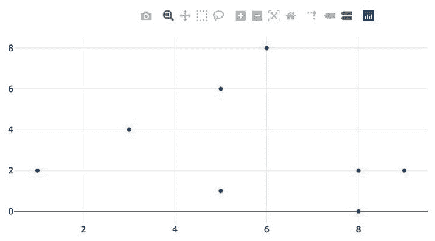

图 5.1–用 Plotly 制作的简单散点图

在本章中我们将大量使用的 Dnotebook中，您可以通过首先使用`load_package`函数在顶部单元格中加载脚本来加载和使用 Plotly，如以下代码片段所示:

```js
load_package(["https://cdn.plot.ly/plotly-1.58.4.min.js"])
```

然后，在新单元格中，可以添加以下代码:

```js
let data = [{
  x: [1,3,5,6,8,9,5,8],
  y: [2,4,6,8,0,2,1,2],
  mode: 'markers',
  type: 'scatter'
}]

Plotly.newPlot(this_div(), data)
```

运行前面的代码单元将产生以下输出:


图 5.2–用数据手册上的 Plotly 制作的简单散点图

你可以看到上一节的代码和 HTML 版本是一样的，只有一个细微的区别——传递给`Plotly.newPlot`的`this_div`函数。

`this_div`函数只是一个 Dnotebook 助手函数，它创建并返回代码单元块正下方的`div`标签的标识。这意味着无论何时你在 Dnotebook 中处理情节，你都可以使用`this_div`功能获得一个`div`标签。

注意

接下来，我们将使用`this_div`而不是指定`div`标签标识。这是因为我们将主要在 T4 的环境中工作。要在 HTML 或其他**用户界面** ( **UI** )客户端中使用代码，只需将`this_div`更改为您想要使用的`div`标签的 ID 即可。

现在您知道如何安装 Plotly，我们将进入下一部分，这是关于创建基本图表。

# plotly . js 的基本原理

使用 Plotly.js 的一个主要优势就是上手容易，可以指定很多配置让你的剧情更好。在这一节中，我们将介绍一些重要的可用配置选项，并向您展示如何指定这些选项。

在我们进一步讨论之前，让我们了解如何将数据输入 Plotly。

## 数据格式

要制作一个**二维** ( **2D** )图，其中是您将要创建的最常见的类型的图，您必须传递一个带有`x`和`y`键的数组对象，如以下代码示例所示:

```js
const trace1 = { 
  x: [20, 30, 40],
  y: [2, 4, 6]
}
```

注意

数据点通常在 Plotly 中被称为**轨迹**。这是因为您可以在一个图形中绘制多个数据点。这里提供了一个例子:

`var data = [trace1, trace2]`

`Plotly.newPlot("my_div", data);`

`x`和`y`数组可以包含字符串和数字数据。如果它们包含字符串数据，数据点将按原样绘制，即点到点。这里有一个例子:

```js
var trace1 = {
    x:['2020-10-04', '2021-11-04', '2023-12-04'],
    y: ["cat", "goat", "pig"],
    type: 'scatter'
};
Plotly.newPlot(this_div(),  trace1);
```

运行前面的代码单元将产生以下输出:


图 5.3–用 Plotly 绘制的字符串值与日期的关系图

另一方面，如果您的数据是数字，Plotly 将自动排序，然后选择默认比例。请看下面的例子:

```js
var trace1 = {
    x: ['2020-10-04', '2021-11-04', '2023-12-04'],
    y: [90, 20, 10],
    type: 'scatter'
};
var data = [trace1];
Plotly.newPlot(this_div(), data);
```

运行前面的代码单元将产生以下输出:

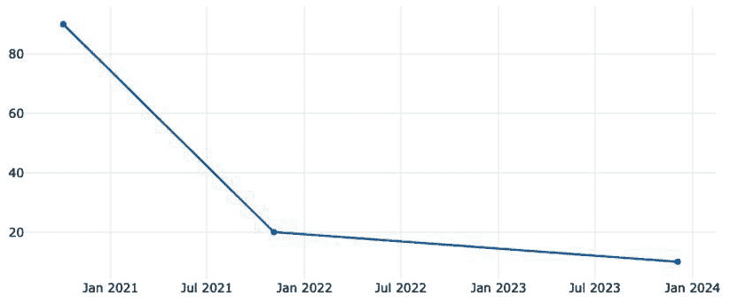

图 5.4–用 Plotly 绘制的数值与日期的关系图

在我们将移到配置部分之前，让我们看一个在同一图表中绘制多个轨迹的例子。首先，我们设置数据，如下面的代码片段所示:

```js
var trace1 = {
    x:['2020-10-04', '2021-11-04', '2023-12-04'],
    y: [90, 20, 10],
    type: 'scatter'
};
var trace2 = {
    x: ['2020-10-04', '2021-11-04', '2023-12-04'],
    y: [25, 35, 65],
    mode: 'markers',
    marker: {
        size: [20, 20, 20],
    }
};
var data = [trace1, trace2];
Plotly.newPlot(this_div(), data);
```

运行前面的代码单元将给出如下输出:


图 5.5–共享同一个 x 轴的多条轨迹图

注意

在单个图表中绘制多个轨迹时，建议轨迹共享一个公共轴。这使你的情节更容易阅读。

如果您想知道是否可以向数据数组中添加更多的跟踪，那么答案是肯定的——您可以添加任意多的跟踪，但是您必须考虑可解释性，因为添加更多的跟踪可能不容易解释。

现在您已经知道如何将数据传递到图中，让我们了解一些基本的配置选项，您可以在制作图表时将其传递给 Plotly。

## 地块的配置选项

配置可用于设置属性，如图形的交互性和模式条。配置是一个对象，通常作为`Plotly.newPlot`调用中的最后一个参数传递，如下面的代码片段所示:

```js
config = { … }
Plotly.newPlot("my_div", data, layout, config)
```

在接下来的章节中，我们将介绍一些常见的配置选项，这些选项将在 [*第 8 章*](08.html#_idTextAnchor149)*中使用，创建无代码数据分析/处理系统*。如果你想知道有哪些配置选项可以使用，那么你可以在这里了解更多:[https://plotly.com/javascript/configuration-options/](https://plotly.com/javascript/configuration-options/)。

### 配置模式栏

**模式栏**是一个水平的工具栏，它提供了多个选项，可用于与图表交互。默认情况下，模式栏仅在您将鼠标悬停在图表上时才变得可见，尽管这是可以更改的，我们将在下一节中看到。

#### 使模式栏始终可见

要使 modebar 始终可见，可以将`displayModeBar`属性设置为`true`，如以下代码片段所示:

```js
var trace1 = {
    x: ['2020-10-04', '2021-11-04', '2023-12-04'],
    y: [90, 20, 10],
    type: 'scatter'
};
var data = [trace1];
var layout = {
    title: 'Configure modebar'
};
var config = {
  displayModeBar: true
};
Plotly.newPlot(this_div(), data, layout, config);
```

运行前面的代码单元将产生以下输出:

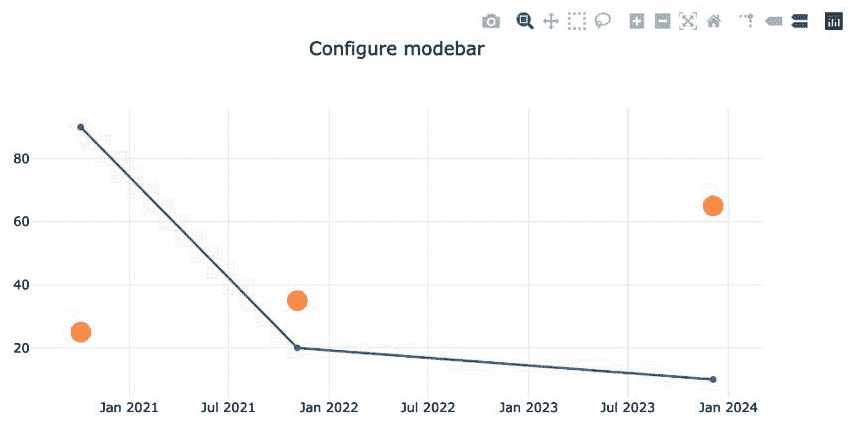

图 5.6–将模式栏配置为始终显示

如果您不需要模式条，那么将`displayModeBar`功能设置为`false`将确保即使您将鼠标悬停在模式条上，该模式条也是隐藏的。

#### 从模式栏中移除按钮

您可以通过将不想要的按钮名称传递给`modeBarButtonsToRemove` `config`属性，从模式栏中移除按钮，我们将在本节中进行演示。

使用与*相同的轨迹，使模式栏始终可见*部分，我们将从模式栏中移除放大按钮。您可以在下面的截图中看到被移除之前的放大按钮:


图 5.7–移除前放大按钮

在前面的截图中，我们显示了移除放大按钮之前的图表。接下来，我们将设置`config`选项来移除按钮，如以下代码片段所示:

```js
var config = {
  displayModeBar: true,
  modeBarButtonsToRemove: ['zoomIn2d']
};
Plotly.newPlot(this_div(), data, layout, config);
```

运行前面的代码单元将给出以下输出:

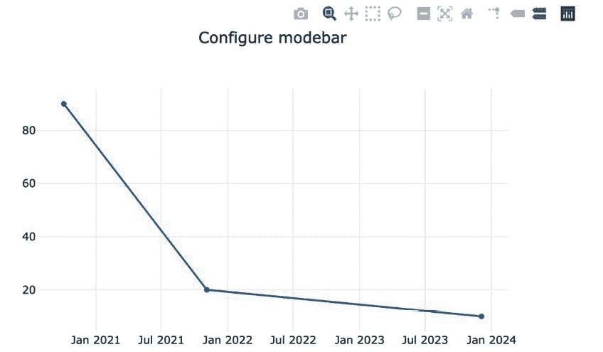

图 5.8–移除放大按钮后的图表

使用前面示例中演示的方法，您可以从图表中移除任何按钮。你可以在这里看到所有可以移除的模式栏按钮的名称:[https://plotly . com/JavaScript/configuration-options/# remove-modebar-buttons](https://plotly.com/javascript/configuration-options/#remove-modebar-buttons)。

#### 向模式栏添加自定义按钮

Plotly 为提供了一种方式向模式栏添加具有自定义行为的按钮。当我们想要用自定义行为扩展我们的情节时，这变得非常有用，例如，链接到您的个人网站。

在下面的例子中，我们将添加一个自定义按钮，在点击时向用户显示`This``is``an``example``of``a``plot``that``answers``a``question``on``click`。

注意

添加自定义按钮在 Dnotebook 中不起作用，所以我们将在一个 HTML 文件中这样做。您可以使用 Plotly 脚本设置一个 HTML 文件，正如我们在*中通过脚本标签*使用 Plotly.js 部分所演示的那样。

在 HTML 文件的正文部分中，添加以下代码:

```js
<div id="mydiv"></div>
<script>
        ...
        var config = {
            displayModeBar: true,
          modeBarButtonsToAdd: [
                {
                    name: 'about',
                    icon: Plotly.Icons.question,
                    click: function (gd) {
                        alert('This is an example of a plot that answers a question on click')
                    }
                }]
        }
        Plotly.newPlot("mydiv", data, layout, config);
 </script>
```

在浏览器中保存并打开前面的 HTML 文件，点击刚刚创建的按钮。它应该显示一个带有您指定的文本的警报，类似于下面屏幕截图中显示的警报:


图 5.9–带有自定义按钮的图表

在我们之前展示的代码片段中，请注意`modeBarButtonsToAdd`配置选项。这个选项是我们定义要添加的按钮的地方，以及当我们点击它时会发生什么。这里列出了创建自定义按钮时可以指定的主要属性:

*   `name`:按钮的名称。
*   `icon`:模式栏中显示的图标/图像。这可以是自定义图标，也可以是任何内置的 Plotly 图标。
*   `click`:这定义了当你点击按钮时会发生什么。在这里，您可以指定任何 JavaScript 函数，甚至可以更改图表的行为。

接下来，让我们看看如何制作静态图表。

### 制作静态图表

默认情况下，Plotly 图表是交互式的。如果您希望使它们成为静态的，那么您可以在`config`对象中指定以下选项:

```js
var config = {
  staticPlot: true
}
```

当我们只想通过分散注意力的交互来显示图表时，静态图表会很有用。

接下来，我们将向您展示如何创建响应迅速的图表。

### 制作响应式图表

要使图表具有响应性，例如可以在显示的窗口旁边自动调整大小，您可以将`responsive`属性设置为`true`，如以下代码片段所示:

```js
var config = {
   responsive: true
}
```

当您创建将跨不同屏幕尺寸显示的网页时，响应式图表非常有用。

在下一节中，我们将向您展示如何在图表中下载和设置下载选项。

### 自定义下载绘图选项

默认情况下，当显示模式栏时，可以将绘图图表保存为**便携式网络图形** ( **PNG** )文件。这个可以自定义，可以设置下载图片类型，以及文件名、高度、宽度等其他属性。

为此，您可以在`config`对象中设置`toImageButtonOptions`属性，正如我们在下面的代码片段中演示的:

```js
var config = {
  toImageButtonOptions: {
    format: 'jpeg', // one of png, svg, jpeg, webp
    filename: 'my_image', // the name of the file
    height: 600,
    width: 700,
  }
}
```

最后，在下一节中，我们将演示如何更改图表的区域设置。

### 更改默认区域设置

为说其他语言的人制作图表时，地区很重要。这可以大大提高图表的可解释性。

接下来，我们将把默认区域设置从英语更改为法语:

1.  Get the specific locale and add it to your HTML file (or load it using `load_scripts` in Dnotebook), as shown in the following code snippet:

    ```js
    ...
    <head>
        <script src="https://cdn.plot.ly/plotly-1.58.4.min.js"></script>
        <script src="https://cdn.plot.ly/plotly-locale-fr-latest.js"></script>  <!-- load locale -->
    </head>
    ...
    ```

    在 Dnotebook 中，这可以使用`load_package`完成，如下所示:

    ```js
    load_package(["https://cdn.plot.ly/plotly-1.58.4.min.js", "https://cdn.plot.ly/plotly-locale-fr-latest.js"])
    ```

2.  在您的`config`对象中，指定区域设置，如下面的代码片段所示:

    ```js
    var config = {
       locale: "fr"
    }
    ```

让我们看一个完整的例子有相应的输出。将以下代码添加到您的 HTML 文件正文中:

```js
<div id="mydiv"></div>
 <script>
      var trace1 = {
            x: ['2020-10-04', '2021-11-04', '2023-12-04'],
            y: [90, 20, 10],
            type: 'scatter'
        };
        var trace2 = {
            x: ['2020-10-04', '2021-11-04', '2023-12-04'],
            y: [25, 35, 65],
            mode: 'markers',
            marker: {
                size: [20, 20, 20],
            }
        };
        var data = [trace1, trace2];
        var layout = {
            title: 'Change Locale',
            showlegend: false
        };
        var config = {
            locale: "fr"
        };
        Plotly.newPlot("mydiv", data, layout, config);
    </script>
```

在浏览器中加载 HTML 页面会显示如下图表，其中`locale`设置为法语:


图 5.10–区域设置为法语的图表

现在你知道如何配置你的图了，我们将进入图表配置的另一个重要方面:**布局**。

## 情节布局

`layout`([https://plotly.com/javascript/reference/layout/](https://plotly.com/javascript/reference/layout/))是传递给`Plotly.newPlot`函数的第三个参数。用于配置绘制图表的区域/布局，以及标题、文本、图例等属性。

您可以设置六种布局属性:标题、图例、边距、大小、字体和颜色。我们将通过示例演示如何使用它们。

### 配置图表标题

`title`属性配置图表标题，这是显示在图表顶部的文本。要添加标题，只需将文本传递给`layout`对象中的`title`属性，如以下代码片段所示:

```js
var layout = {
    title: 'This is an example title,
};
```

更明确地说，特别是如果您需要配置标题文本的位置，那么您可以设置`title`的`text`属性，如下面的代码片段所示:

```js
var layout = {
  title: {text: 'This is an example title'}
};
```

使用前面的格式，我们可以使用其他属性轻松配置其他属性，如标题位置，如下所示:

*   `x`:0 到 1 之间的数字，用于设置标题文本相对于其显示容器的`x`位置。
*   `y`:0 到 1 之间的数字，用于设置标题文本相对于显示容器的`y`位置。
*   `xanchor`:这可以是`auto`、`left`、`center`或`right`对齐中的一种。它设置标题相对于其`x`位置的水平对齐。
*   `yanchor`:这可以是`auto`、`top`、`middle`或`bottom`对齐中的一种。它设置标题相对于其`y`位置的垂直对齐。

让我们看一个配置`title`的例子，在图表的右上角显示，如下所示:

```js
var trace1 = {
    x:['2020-10-04', '2021-11-04', '2023-12-04'],
    y: [90, 20, 10],
    type: 'scatter'
};
var data = [trace1];
var layout = {
  title: { text: 'This is an example title',
          x: 0.8,
          y: 0.9,
          xanchor: "right"}
};
Plotly.newPlot(this_div(), data, layout, config);
```

这给出了以下输出:

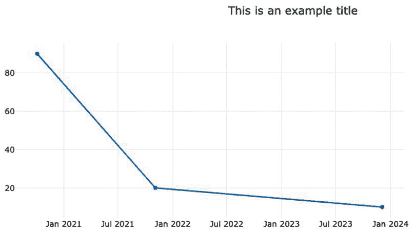

图 5.11–标题配置在右上角的图表

您也可以设置标题的**填充**。填充可以接受以下参数:

*   `t`:设置标题的顶部填充
*   `b`:设置标题的底部填充
*   `r`:设置正确的填充，仅当`xanchor`属性设置为`right` 时有效
*   `l`:设置左填充，仅当`xanchor`属性设置为`left` 时有效

例如，要设置标题的`right`填充，可以将`xanchor`属性设置为`right`，然后配置`pad`的`r`属性，如下面的代码片段所示:

```js
 var layout = {
  title: {text: 'This is an example title',
          xanchor: "right",
          pad: {r: 100}}
};
```

请注意，填充参数以**像素** ( **px** )为单位，因此前面代码片段中的`100`表示 100px。

在下一节中，我们将了解如何配置图表的图例。

### 配置绘图图例

图例描述了图表中显示的数据。当您在单个图表中显示多种形式的数据时，图例非常重要。

默认情况下，当图表中有多个跟踪时，Plotly 会显示一个图例。您也可以通过将`layout`的`showLegend`属性设置为`true`来显式显示图例，如以下代码片段所示:

```js
var layout = {
  showLegend: true
};
```

图例激活后，您可以通过设置以下属性来自定义其显示方式:

*   `bgcolor`:设置图例的背景色。默认设置为`#fff`(白色)。
*   `bordercolor`:设置包围图例的边框颜色。
*   `borderwidth`:设置包围图例的边框宽度(以像素为单位)。
*   `font`: An object with the following properties:

    a) `family`:任何支持的 HTML 字体系列。

    b) `size`:图例文字的大小。

    c) `color`:图例文字的颜色。

在下面的代码片段中，我们展示了一个使用这些属性来配置图例的示例:

```js
var trace1 = {
    x: ['2020-10-04', '2021-11-04', '2023-12-04'],
    y: [90, 20, 10],
    type: 'scatter'
};
var trace2 = {
    x: ['2020-10-04', '2021-11-04', '2023-12-04'],
    y: [25, 35, 65],
    mode: 'markers',
    marker: {
        size: [20, 20, 20],
    }
};
var data = [trace1, trace2];
var layout = {
  title: {text: 'This is an example title'},
  showLegend: true,
  legend: {bgcolor: "#fcba03",
          bordercolor: "#444",
          borderwidth: 1,
          font: {family: "Arial", size: 30, color: "#fff"}}
};
Plotly.newPlot(this_div(), data, layout, config);
```

前面的代码给出如下输出:

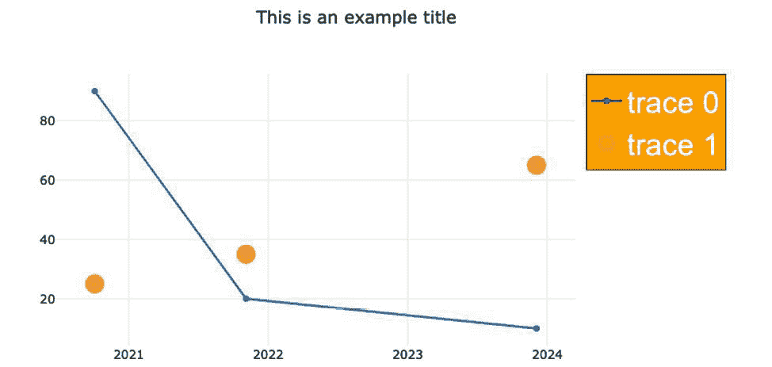

图 5.12–显示自定义配置图例的图表

接下来，我们展示如何配置整个布局的边距。

### 配置布局边距

`margin`属性配置图表在屏幕上的位置。支持所有保证金属性(`l`、`r`、`t`和`b`)。在下面的代码片段中，我们使用所有四个属性来演示如何设置布局边距:

```js
... 
var layout = {
  title: {text: 'This is an example title'},
  margin: {l: 200, r: 200, t: 230, b: 100}
};
Plotly.newPlot(this_div(), data, layout, config);
```

这给出了以下输出:

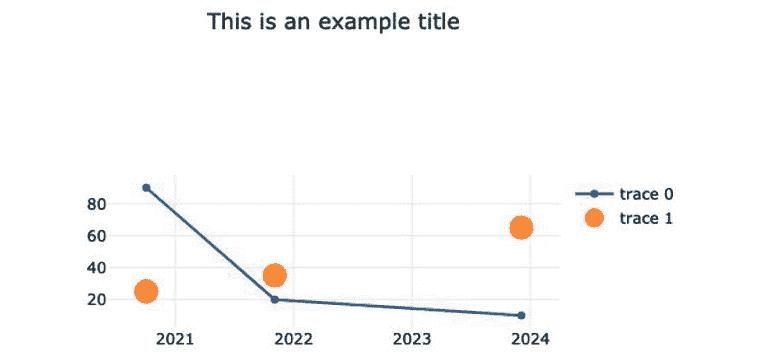

图 5.13–配置了边距的图表

注意到上一张截图中周围的空格了吗？这是设定的余量。需要注意的是，余量也是 px。

接下来，我们将看看设置布局大小。

### 配置布局大小

有时，我们可能想要更大的“T4”或更小的布局，这可以使用“T0”、“T1”或方便的“T2”属性进行配置，如下面的代码片段所示:

```js
...
var layout = {
  title: {text: 'This is an example title'},
  width: 1000,
  height: 500
};
Plotly.newPlot(this_div(), data, layout, config);
```

这给出了以下输出:


图 5.14–配置了尺寸的图表

当我们希望 Plotly 自动设置布局的尺寸时，`autosize`属性可以设置为`true`。

注意

要查看其他可以在`layout`中配置的属性，您可以访问 Plotly 的官方 API 参考:https://plotly.com/javascript/reference/layout。

在下一节中，我们将向您展示如何根据您想要传达的信息制作不同类型的图表。

# 用 Plotly.js 创建基本图表

Plotly.js 支持很多可以快速用来传递信息的基础图表。Plotly 中可用的一些基本图表示例有散点图、折线图、条形图、饼图和气泡图、点图、树形图、表格等。您可以在这里找到完整的支持的基本图表列表:[https://plotly.com/javascript/basic-charts/](https://plotly.com/javascript/basic-charts/)。

在本节中，我们将介绍一些基本图表，如散点图、条形图和气泡图。

首先，我们从散点图开始。

### 用 Plotly.js 创建散点图

一个**散点图**通常用于绘制两个变量的相互关系。绘图显示为点的集合，因此命名为*散点图*。以下屏幕截图显示了散点图的示例:


图 5.15–显示票价与年龄差距的散点图示例

要使用 Plotly 绘制散点图，您只需指定绘图类型，如下例所示:

```js
var trace1 = {
    x: [2, 5, 7, 12, 15, 20],
    y: [90, 80, 10, 20, 30, 40],
    type: 'scatter'
};
var data = [trace1];
Plotly.newPlot(this_div(), data);
```

这给出了以下输出:


图 5.16–销售与利润的散点图示例

默认情况下，点使用线连接在一起。您可以通过设置模式类型来改变此行为。模式类型可以是以下任何一种:

*   `markers`
*   `lines`
*   `text`
*   `none`

您也可以通过用加号将它们连接在一起来使用多个模式，例如`markers+text+lines`或`markers+lines`。

在下面的例子中，我们使用`markers`和`text`作为我们的模式类型:

```js
var trace1 = {
    x: [2, 5, 7, 12, 15, 20],
    y: [90, 80, 10, 20, 30, 40],
    type: 'scatter',
    mode: 'markers+text'
};
var data = [trace1];
Plotly.newPlot(this_div(), data);
```

这给出了以下输出:

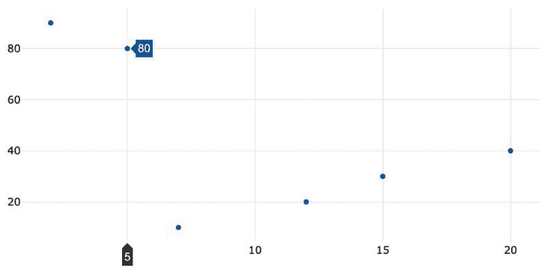

图 5.17–模式类型设置为标记+文本的散点图

如前所述，可以在单个图表中绘制多个散点图，每个轨迹可以根据需要配置。在下面的示例中，我们绘制了三个配置了不同模式的散点图:

```js
var trace1 = {
  x: [1, 2, 3, 4, 5],
  y: [1, 6, 3, 6, 1],
  mode: 'markers',
  type: 'scatter',
  name: 'Trace 1',
};
var trace2 = {
  x: [1.5, 2.5, 3.5, 4.5, 5.5],
  y: [4, 1, 7, 1, 4],
  mode: 'lines',
  type: 'scatter',
  name: 'Trace 2',
};
var trace3 = {
  x: [1, 2, 3, 4, 5],
  y: [4, 1, 7, 1, 4],
  mode: 'markers+text',
  type: 'scatter',
  name: 'Trace 3',
};
var data = [ trace1, trace2, trace3];
var layout = {
  title:'Data Labels Hover',
  width: 1000
};
Plotly.newPlot(this_div(), data, layout);
```

运行前面的代码单元会产生以下输出:


图 5.18–带有三条轨迹的散点图

现在您已经学习了基本图表的概念，在本节中，您可以轻松地从自定义数据点创建散点图，并使用所需的属性自定义大小。

接下来，我们将简要地看一下条形图。

### 创建条形图

条形图是 Plotly.js 中另一种流行的类型的图表，它用于使用矩形条显示数据点之间的关系，高度或长度与它们所代表的值成比例。条形图主要用于绘制**分类数据**。

注意

分类数据或分类变量是具有固定或有限数量的可能值的变量。英语字母表中的字母是分类数据的一个例子。

为了在 Plotly.js 中制作条形图，需要传递一个分类数据点，对应条高/长度，然后将类型设置为`bar`，如下例所示:

```js
var data = [
  {
    x: ['Apple', 'Mango', 'Pear', 'Banana'],
    y: [20, 20, 15, 40],
    type: 'bar'
  }
];
Plotly.newPlot(this_div(), data);
```

运行前面的代码单元会产生以下输出:

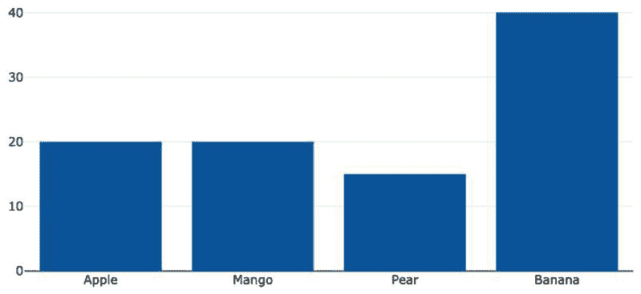

图 5.19–带有四个变量的简单条形图

通过创建多个轨迹并将它们作为一个数组传递给，可以在单个布局中绘制多个条形图。例如，在下面的代码片段中，我们创建了两个跟踪和一个绘图:

```js
var trace1 = {
    x: ['Apple', 'Mango', 'Pear', 'Banana'],
    y: [20, 20, 15, 40],
    type: 'bar'
  }
var trace2 = {
    x: ['Goat', 'Lion', 'Spider', 'Tiger'],
    y: [25, 10, 14, 36],
    type: 'bar'
  }
var data = [trace1, trace2]
Plotly.newPlot(this_div(), data);
```

运行前面的代码单元会产生以下输出:

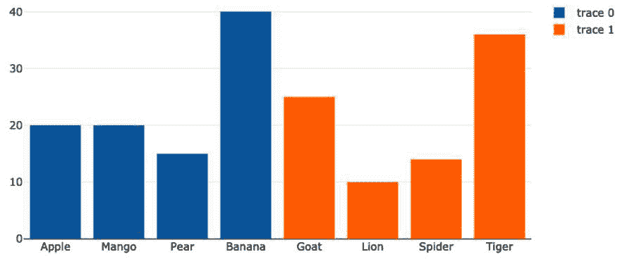

图 5.20–带有两条轨迹的条形图

在同一类别内绘制多条轨迹时，可以指定一个`barmode` 属性。`barmode`属性可以是`stack`或`group`模式中的一种。例如，在下面的代码片段中，我们在`stack`模式下制作了两个类别相同的轨迹的条形图:

```js
var trace1 ={
    x: ['Apple', 'Mango', 'Pear', 'Banana'],
    y: [20, 20, 15, 40],
    type: 'bar',
    name: "Bar1"
  }
var trace2 = {
    x: ['Apple', 'Mango', 'Pear', 'Banana'],
    y: [25, 10, 14, 36],
    type: 'bar',
   name: "Bar2"
  }
var data = [trace1, trace2]
var layout = {
  barmode: 'stack'
}
Plotly.newPlot(this_div(), data, layout);
```

运行前面的代码单元会给以下输出:


图 5.21–堆叠模式下带有两条轨迹的条形图

在下面的代码片段中，我们将`barmode`属性更改为`group`(默认模式):

```js
...
var layout = {
  barmode: 'group'
}
...
```

这将产生以下输出:


图 5.22–分组模式下带有两条轨迹的条形图

制作条形图时，您可以指定许多其他选项，但我们不会在本节中涵盖所有选项。您可以在这里的官方文档中看到所有配置选项，以及清晰的创建良好条形图的示例:[https://plotly.com/javascript/bar-charts/](https://plotly.com/javascript/bar-charts/)。

在下一节中，我们将简要介绍气泡图。

### 创建气泡图

泡泡图是另一种非常流行的类型的图，可以用来覆盖信息。它基本上是散点图的扩展，指定了点的大小。让我们看看下面的代码示例:

```js
var trace1 = {
  x: [1, 2, 3, 4],
  y: [10, 11, 12, 13],
  mode: 'markers',
  marker: {
    size: [40, 60, 80, 100]
  }
};
var data = [trace1]
Plotly.newPlot(this_div(), data, layout);
```

运行前面的代码单元会产生以下输出:

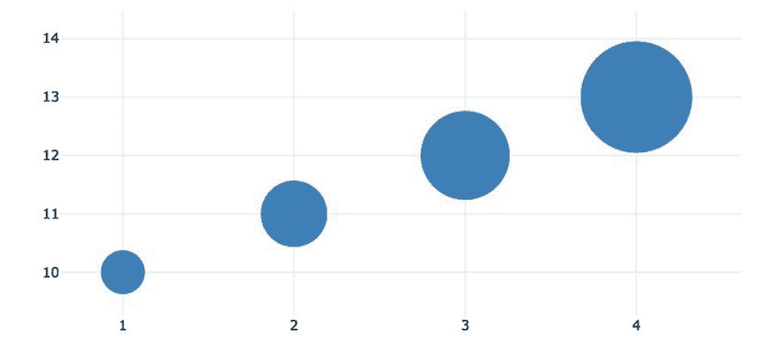

图 5.23–一个简单的气泡图

在之前的气泡图的代码片段中，可以看到主要的变化是模式和指定大小的标记。尺寸与点一一对应，如果要将尺寸应用于每个气泡，必须指定尺寸。

您也可以通过传递颜色数组来更改单个气泡的颜色，如下面的代码片段所示:

```js
...
  marker: {
    size: [40, 60, 80, 100],
    color: ['rgb(93, 164, 214)', 'rgb(255, 144, 14)',  'rgb(44, 160, 101)', 'rgb(255, 65, 54)'],
  }
...
```

运行前面的代码单元会产生以下输出:

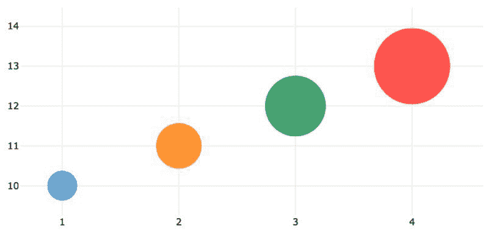

图 5.24–不同颜色的简单气泡图

气泡图非常有用，如果需要了解更多或者看到一些更高级的例子，可以查看 Plotly 的文档中的例子页面，这里:[https://plotly.com/javascript/bubble-charts/](https://plotly.com/javascript/bubble-charts/)。

你可以制作许多其他类型的基本情节，但可悲的是，我们不能涵盖所有的情节。Plotly 文档中的*基本图表*页面([https://plotly.com/javascript/basic-charts/](https://plotly.com/javascript/basic-charts/))是学习如何制作这些令人敬畏的情节的好地方，我们鼓励您看一看。

在下一节中，我们将向您介绍一些统计图表。

# 用 Plotly.js 创建统计图表

统计图是不同的类型的图表，大多被统计学家或数据科学家用来传递信息。统计图的一些例子有直方图、箱线图、小提琴图、密度图等等。在下面的小节中，我们将简要介绍三种类型的统计图——直方图、方框图和小提琴图。

## 用 Plotly.js 创建直方图

直方图用于表示数值/连续数据的分布或扩散。直方图类似于条形图，有时人们可能会混淆两者。区分它们的一个简单方法是它们可以显示的数据类型。直方图使用连续变量而不是分类变量，并且只需要一个值作为数据。

在下面的代码片段中，我们展示了一个生成随机数的直方图示例:

```js
var x = [];
for (let i = 0; i < 1000; i ++) { //generate random numbers
x[i] = Math.random();
}
var trace = {
    x: x,
    type: 'histogram',
  };
var data = [trace];
Plotly.newPlot(this_div(), data);
```

在前面的代码片段中，您将观察到属性只有指定的`x`数据。这与我们前面提到的一致——直方图只需要一个值。我们还将绘图类型指定为`histogram`，运行代码单元会给出以下输出:


图 5.25–随机 x 值的直方图

指定一个`y`值而不是`x`将产生一个水平直方图，如下例所示:

```js
...
var trace = {
    y: y,
    type: 'histogram',
  };
...
```

运行前面的代码单元会给以下输出:


图 5.26–随机 y 值的直方图

您也可以通过创建多个轨迹并将`barmode`属性设置为`stack`来创建堆叠、覆盖或分组直方图，如以下示例中的所示:

```js
var x1 = [];
var x2 = [];
for (var i = 0; i < 1000; i ++) {
x1[i] = Math.random();
x2[i] = Math.random();
}
var trace1 = {
  x: x1,
  type: "histogram",
};
var trace2 = {
  x: x2,
  type: "histogram",
};
var data = [trace1, trace2];
var layout = {barmode: "stack"};
Plotly.newPlot(this_div(), data, layout);
```

运行前面的代码单元会产生以下输出:


图 5.27–堆栈模式下的直方图

通过改变`barmode`叠加，我们得到如下输出:

```js
…
var layout = {barmode: "overlay"};
…
```

运行前面的代码单元会产生以下输出:


图 5.28–叠加模式下的直方图

要查看更多绘制直方图的示例以及各种配置选项，您可以在此查看直方图文档页面:[https://plotly.com/javascript/histograms/](https://plotly.com/javascript/histograms/)。

在下一节中，我们将介绍方框图。

## 用 Plotly.js 创建方框图

A **方块图**是描述性统计中非常常见的类型的图。它用图形展示了使用四分位数的数字数据组。箱线图也有在上方或下方延伸的线条，称为**须**。胡须代表上下**四分位数**之外的可变性。

小费

四分位数将指定数量的数据点分成四个部分或四个季度。第一个四分位数是最低的 25%的数据点，第二个四分位数在 25%到 50%之间(达到中位数)，第三个四分位数是 50%到 75%(高于中位数)，最后，第四个四分位数描绘了最高的 25%的数字。

下面的图可以帮助你更好的理解方框图:


图 5.29–描绘箱线图的图表(来源:https://aiaspirant.com/box-plot/重绘)

在 Plotly.js 中，我们通过传递数据并将`trace`类型设置为`box`来制作一个方框图。我们在下面的示例中演示这一点:

```js
var y0 = [];
var y1 = [];
for (var i = 0; i < 50; i ++) {//generate some random numbers
y0[i] = Math.random();
y1[i] = Math.random() + 1;
}
var trace1 = {
  y: y0,
  type: 'box'
};
var trace2 = {
  y: y1,
  type: 'box'
};
var data = [trace1, trace2];
Plotly.newPlot(this_div(), data);
```

运行前面的代码单元会产生以下输出:


图 5.30–带有两条轨迹的简单方框图

我们可以将方框图的布局配置为水平，而不是默认的垂直格式。在下一节中，我们将演示如何做到这一点。

### 制作水平方框图

通过在轨迹中指定`x`值而不是`y`值，可以制作水平图。我们在下面的代码片段中演示了这一点:

```js
var x0 = [];
var x1 = [];
for (var i = 0; i < 50; i ++) {
x0[i] = Math.random();
x1[i] = Math.random() + 1;
}
var trace1 = {
  x: x0,
  type: 'box'
};
var trace2 = {
  x: x1,
  type: 'box'
};
var data = [trace1, trace2];
Plotly.newPlot(this_div(), data);
```

运行前面的代码单元给出以下输出:

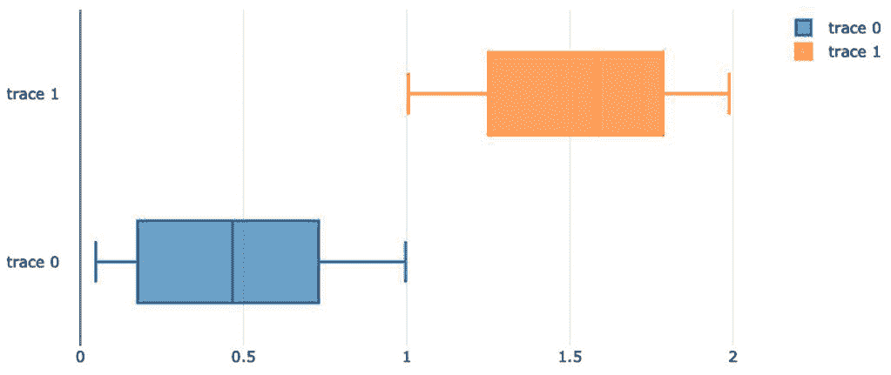

图 5.31–带有两条轨迹的简单方框图

您也可以制作分组方框图，如下节所示。

### 制作分组方框图

共享同一 *x* 轴的多个轨迹可以组合成单个方框图，如以下代码片段所示:

```js
var x = ['Season 1', 'Season 1', 'Season 1', 'Season 1', 'Season 1', 'Season 1',
         'Season 2', 'Season 2', 'Season 2', 'Season 2', 'Season 2', 'Season 2']
var trace1 = {
  y: [2, 2, 6, 1, 5, 4, 2, 7, 9, 1, 5, 3],
  x: x,
  name: 'Blues FC',
  marker: {color: '#3D9970'},
  type: 'box'
};
var trace2 = {
  y: [6, 7, 3, 6, 0, 5, 7, 9, 5, 8, 7, 2],
  x: x,
  name: 'Reds FC',
  marker: {color: '#FF4136'},
  type: 'box'
};
var trace3 = {
  y: [1, 3, 1, 9, 6, 6, 9, 1, 3, 6, 8, 5],
  x: x,
  name: 'Greens FC',
  marker: {color: '#FF851B'},
  type: 'box'
};
var data = [trace1, trace2, trace3];
var layout = {
  yaxis: {
    title: 'Points in two seasons',
  },
  boxmode: 'group'
};
Plotly.newPlot(this_div(), data, layout);
```

运行前面的代码单元给出以下输出:

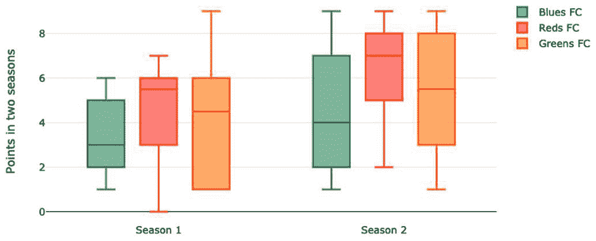

图 5.32–三条轨迹组合在一起的箱线图

在制作方块图时，您可以设置许多其他的选项，但是我们会让您在方块图文档中阅读更多关于它们的信息:[https://plotly.com/javascript/box-plots/](https://plotly.com/javascript/box-plots/)。

在下一节，我们将简要介绍小提琴的情节。

## 用 Plotly.js 创作小提琴剧情

A **小提琴剧情**是包厢剧情的延伸。它还使用四分位数描述了数据点，就像一个方框图，只有一个主要区别——它也显示了数据的分布。

下图显示了小提琴图和盒式图的共同特征:


图 5.33–小提琴图和盒子图之间的共同属性

小提琴图的弯曲区域显示了数据的潜在分布，并传达了比盒式图更多的信息。

在 Plotly 中，只需将类型更改为`violin`，即可轻松制作小提琴剧情。例如，在下面的代码片段中，我们正在重用来自箱线图部分的代码，只有两个主要变化:

```js
var x = ['Season 1', 'Season 1', 'Season 1', 'Season 1', 'Season 1', 'Season 1',
         'Season 2', 'Season 2', 'Season 2', 'Season 2', 'Season 2', 'Season 2']
var trace1 = {
  y: [2, 2, 6, 1, 5, 4, 2, 7, 9, 1, 5, 3],
  x: x,
  name: 'Blues FC',
  marker: {color: '#3D9970'},
  type: 'violin'
};
var trace2 = {
  y: [6, 7, 3, 6, 0, 5, 7, 9, 5, 8, 7, 2],
  x: x,
  name: 'Reds FC',
  marker: {color: '#FF4136'},
  type: 'violin'
};
var trace3 = {
  y: [1, 3, 1, 9, 6, 6, 9, 1, 3, 6, 8, 5],
  x: x,
  name: 'Greens FC',
  marker: {color: '#FF851B'},
  type: 'violin',
};
var data = [trace1, trace2, trace3];
var layout = {
  yaxis: {
    title: 'Points in two seasons',
  },
  violinmode: 'group'
}; 
Plotly.newPlot(this_div(), data, layout);
```

运行前面的代码单元给出以下输出:

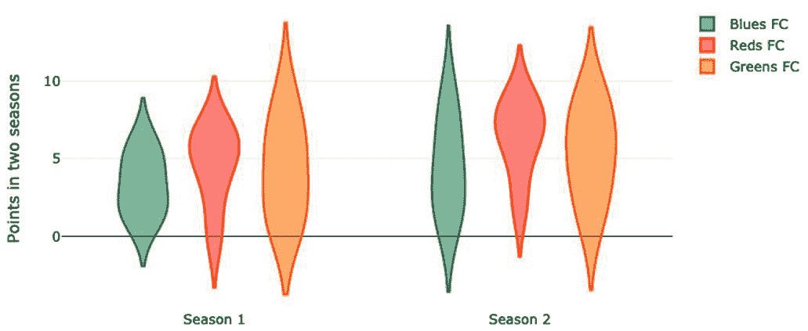

图 5.34–三条轨迹组合在一起的小提琴图

与其他图表类型一样，您也可以配置小提琴图的显示方式。例如，我们可以在小提琴图中显示底层的方框图，如以下代码片段所示:

```js
var x = ['Season 1', 'Season 1', 'Season 1', 'Season 1', 'Season 1', 'Season 1',
         'Season 2', 'Season 2', 'Season 2', 'Season 2', 'Season 2', 'Season 2']
var trace = {
  y: [1, 3, 1, 9, 6, 6, 9, 1, 3, 6, 8, 5],
  x: x,
  name: 'Greens FC',
  marker: {color: '#FF851B'},
  type: 'violin',
  box: {
    visible: true
  },
};
var data = [trace];
var layout = {
  yaxis: {
    title: 'Point in two seasons',
  },
};
Plotly.newPlot(this_div(), data, layout);
```

运行前面的代码单元给出如下输出:


图 5.35–显示了带有底层方框图的小提琴图

要查看其他配置选项以及一些高级设置，您可以在此查看小提琴剧情的文档:[https://plotly.com/javascript/violin/](https://plotly.com/javascript/violin/)。

说完这些，我们就要结束关于 Plotly.js 的介绍部分了。在下一章中，我们将向您展示如何使用 Danfo.js 快速轻松地为这个特定库支持的任何类型的数据制作图。

# 总结

在本章中，我们介绍了 Plotly.js 的绘图和可视化。首先，我们简要介绍了 Plotly.js，包括安装设置。然后，我们继续讨论图表配置和布局定制。最后，我们向您展示了如何创建一些基本图表和统计图表。

您在本章中获得的知识将帮助您轻松创建交互式图表，您可以将其嵌入到您的网站或网络应用程序中。

在下一章中，我们将介绍使用 Danfo.js 的数据可视化，您将看到，借助 Plotly.js 的知识，您如何直接从您的 DataFrame 或 Series 轻松创建令人惊叹的图表。