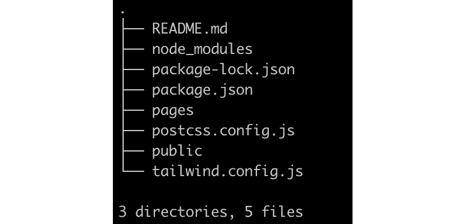
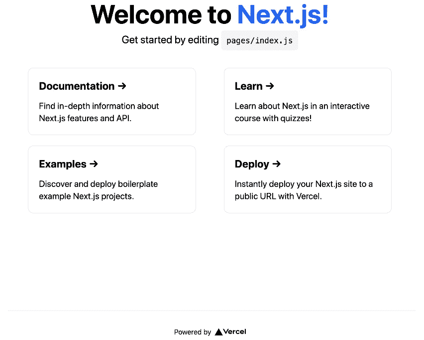
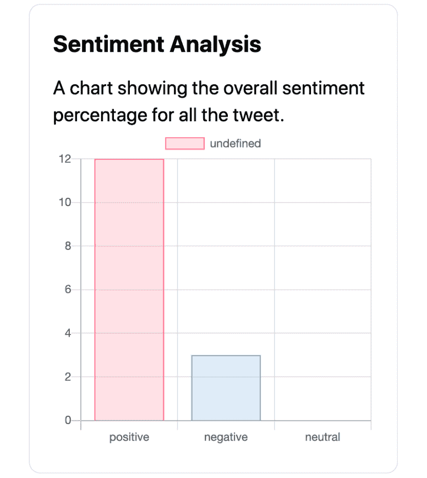

# *第十二章*:搭建推特分析仪表盘

本章的主要目标是展示如何在后端和前端使用 Danfo.js 构建一个全栈 web 分析平台。

为了证明这一点，我们将构建一个小的单页网络应用程序，在其中您可以对推特用户进行搜索，获取他们在特定日期被提及的所有推文，并执行一些简单的分析，如情感分析，从数据中获取见解。

在这一章中，我们将讨论以下构建 web 应用程序的主题:

*   设置项目环境
*   构建后端
*   构建前端

# 技术要求

本章需要以下内容:

*   React.js 的知识
*   这一章的代码，可以在这里找到:https://github . com/PacktPublishing/Building-Data-Driven-Applications-with-danfo . js/tree/main/chapter 12

# 设置项目环境

对于这个项目，我们将建立一个单一的网页，包括后端和前端。我们将使用 Next.js 框架来构建应用程序。Next.js 使您能够快速轻松地构建后端和前端。我们也将利用`tailwindcss,`，就像我们以前的一些项目一样，比如无代码环境项目。

要使用包含默认`tailwindcss`配置的 Next.js 来设置我们的项目环境，我们所需要做的就是运行以下命令:

```js
$ npx create-next-app -e with-tailwindcss twitterdashboard
```

`npx`命令运行`create-next-app`，这将创建 Next.js 样板代码，包括`twitterdashboard`目录中的`tailwindcss`配置。请注意，`twitterdashboard`目录(也称为*项目名称*)可以给你选择的任何名称。如果一切都是安装成功，应该会得到如下截图所示的输出:


图 12.1–代码环境设置

现在我们已经完成了安装，如果一切正常，您的项目中应该有以下文件:



图 12.2–目录结构

最后，为了测试项目是否安装好并准备就绪，让我们运行以下命令:

```js
$ npm run dev
```

该命令应自动启动应用程序并打开浏览器，显示如下界面:



图 12.3–next . js 用户界面

对于这个项目，我们将修改*图 12.3* 所示的界面，以符合我们的口味。

现在代码环境已经设置好了，让我们继续创建我们的应用程序。

# 构建后端

在本节中，我们将了解如何为我们的应用程序创建以下应用程序接口:

*   `/api/tweet`:这个 API 负责抓取一个 Twitter 用户，获取他们的数据。
*   `/api/nlp`:这个 API 负责对获取的用户数据运行情感分析。

这些应用编程接口将由前端组件使用，并将用于创建不同的可视化和分析。让我们从创建获取推特用户数据的应用编程接口开始。

## 建立推特应用编程接口

在这一节中，我们将构建一个 API，使得获取提到推特用户的推文变得容易。从每条推文中，我们将获得它们的元数据，例如文本、发送者的姓名、喜欢和转发的数量、用于推文的设备以及推文创建的时间。

为了构建获取推特用户数据的推特应用编程接口，并根据我们的口味构建它，以便在前端轻松消费，我们需要安装一个工具，使其更容易与主要的推特开发者应用编程接口交互。在下面的命令中，我们将安装`twit.js`以便于访问和处理推特应用编程接口:

```js
$ npm i twit
```

`twit`一旦安装好，我们就需要进行配置。要使用`twit`，我们需要各种推特开发者密钥，例如:

```js
consumer_key='....',
consumer_secret='....',
access_token='.....',
access_token_secret='.....'
```

如果您没有这些密钥，您将需要创建一个推特开发人员帐户，然后通过[https://developer.twitter.com/](https://developer.twitter.com/)申请访问该应用编程接口。如果获得使用推特应用编程接口的权限，您可以访问[https://developer.twitter.com/en/apps](https://developer.twitter.com/en/apps)创建一个应用程序并设置您的凭证密钥。

注意

根据您如何描述您的用例，获取推特应用编程接口可能需要几天时间。有关设置推特应用编程接口和获取必要密钥的可视化帮助的正确分步指南，请按照以下步骤操作:[https://real python . com/推特-bot-python-tweepy/# creating-推特-API-身份验证-凭据](https://realpython.com/twitter-bot-python-tweepy/#creating-twitter-api-authentication-credentials)。

在获得项目所需的推特开发者密钥后，我们将在代码中使用它们。为了防止将密钥公开，让我们创建一个名为`.env.local`的文件，在这个文件中，让我们添加我们的 API 密钥，如下面的代码块所示:

```js
CONSUMER_KEY='Put in your CONSUMER_KEY',
CONSUMER_SECRET='Your CONSUMER_SECRET',
ACCESS_TOKEN ='Your ACCESS_TOKEN',
ACCESS_TOKEN_SECRET='Your ACCESS_TOKEN_SECRET'
```

在 Next.js 中，所有的 API 都是在`/pages/api`文件夹中创建的。Next.js 使用`pages/`文件夹中的文件结构来创建 URL 路由。例如，如果您在`pages/`文件夹中有一个名为`login.js`的文件，`login.js`中的内容将在`http://localhost:3000/login`中呈现。

上一段展示了如何根据文件名和结构为 Next.js 中的网页创建路由。同样的事情也适用于在 Next.js 中创建 API

假设我们在位于`pages/api`的`signup.js`中创建了一个注册应用编程接口。这个应用编程接口将在`http://localhost:3000/api/signup`自动可用，如果我们在应用程序中使用这个应用编程接口，我们可以这样调用它:`/api/signup`。

对于我们的`/api/tweet` API，让我们在`pages/api/`中创建一个名为`tweet.js`的文件，并按照以下步骤更新该文件:

1.  First, we import `twit.js`, and then create a function to clean each of the tweets:

    ```js
    const Twit = require('twit')
    function clean_tweet(tweet) {
      tweet = tweet.normalize("NFD") //normalize text
      tweet = tweet.replace(/(RT\s(@\w+))/g, '') //remove Rt tag followed by an @ tag
      tweet = tweet.replace(/(@[A-Za-z0-9]+)(\S+)/g, '') // remove user name e.g @name
      tweet = tweet.replace(/((http|https):(\S+))/g, '') //remove url
      tweet = tweet.replace(/[!#?:*%$]/g, '') //remove # tags
      tweet = tweet.replace(/[^\s\w+]/g, '') //remove punctuations
      tweet = tweet.replace(/[\n]/g, '') //remove newline
      tweet = tweet.toLowerCase().trim() //trim text
      return tweet
    }
    ```

    `clean_tweet`函数在推文文本中采用，对文本进行规范化，删除标签字符、用户名、网址链接和换行符，然后对文本进行修剪。

2.  We then create a function called `twitterApi`, which will be used to create our API:

    ```js
    export default function twitterAPI(req, res) {
      // api code here
    }
    ```

    `twitterApi`函数接受两个参数，`req`和`res`，它们是服务器请求和响应参数。

3.  We will now update `twitterApi` with the necessary code:

    ```js
    if (req.method === "POST") {
        const { username } = req.body

        const T = new Twit({
          consumer_key: process.env.CONSUMER_KEY,
          consumer_secret: process.env.CONSUMER_SECRET,
          access_token: process.env.ACCESS_TOKEN,
          access_token_secret: process.env.ACCESS_TOKEN_SECRET,
          timeout_ms: 60 * 1000,  // optional HTTP request timeout to apply to all requests.
          strictSSL: true,     // optional - requires SSL certificates to be valid.
        })
    }
    ```

    首先，我们检查`req.method`请求方法是否是`POST`方法，然后我们从通过搜索框发送的请求正文中获取用户名。

    `Twit`类被实例化，我们的 Twitter API 键被传入。由于我们的推特开发者应用编程接口密钥作为环境密钥存储在`.env.local`中，我们可以使用`process.env`轻松访问每个密钥。

4.  我们已经用我们的应用编程接口键配置了`twit.js`。现在让我们搜索所有提到用户的推文:

    ```js
    T.get('search/tweets', { q: `@${username}`, tweet_mode: 'extended' }, function (err, data, response) {
      let dfData = {
        text: data.statuses.map(tweet => clean_tweet(tweet.full_text)),
        length: data.statuses.map(tweet => clean_tweet(tweet.full_text).split(" ").length),
        date: data.statuses.map(tweet => tweet.created_at),
        source: data.statuses.map(tweet => tweet.source.replace(/<(?:.|\n)*?>/gm, '')),
        likes: data.statuses.map(tweet => tweet.favorite_count),
        retweet: data.statuses.map(tweet => tweet.retweet_count),
        users: data.statuses.map(tweet => tweet.user.screen_name)
      }
      res.status(200).json(dfData)
    })
    ```

我们使用`T.get`方法中的`search/tweets` API 搜索所有推文。然后我们传入包含我们要搜索的用户的用户名的`param`对象。

一个`dfData`对象被创建来基于我们想要的 API 输出响应的方式来构造数据。`dfData`包含以下关键字，这些关键字是我们要从推文中提取的元数据:

*   `text`:推文中的文字
*   `length`:推文的长度
*   `date`:推文发布的日期
*   `source`:用于创建推文的设备
*   `likes`:推文的点赞数
*   `retweet`:推文的转发次数
*   `users`:创建推文的用户

前面列表中的元数据是从前面代码的`T.get()`方法中从`search/tweets`返回的 JSON 数据中提取的。从这个 JSON 数据中提取的所有元数据都包含在一个名为`statuses`的对象数组中，下面显示了 JSON 数据的结构:

```js
{
  statuses:[{
    ......
  },
    ......
  ]
}
```

推特应用编程接口被创建并准备使用。让我们继续创建情绪分析应用编程接口。

## 构建文本情感 API

从`/api/tweet` API，我们要获取结构化的 JSON 数据，然后进行情感分析。

对数据的情感分析将通过`/api/nlp`路线获取。因此，在这一节中，我们将看到如何为我们的推特数据创建一个情绪分析应用编程接口。

让我们在`/pages/api/`文件夹中创建一个名为`nlp.js`的文件，并按照以下步骤更新它:

1.  我们将利用`nlp-node.js`包进行情绪分析。我们还将利用`danfojs-node`进行数据预处理，所以让我们安装这两个包:

    ```js
    $ npm i node-nlp danfojs-node
    ```

2.  我们从`nlp-node`进口`SentimentAnalyzer`，从`danfojs-node`进口`DataFrame`:

    ```js
    const { SentimentAnalyzer } = require('node-nlp')
    const { DataFrame } = require("danfojs-node")
    ```

3.  接下来，我们将创建一个默认的`SentimentApi`导出函数，它将包含我们的 API 代码:

    ```js
    export default async function SentimentApi(req, res) {

    }
    ```

4.  然后我们会检查请求方法是否是`POST`请求，然后对从请求体获得的数据进行一些数据预处理:

    ```js
    if (req.method === "POST") {
        const sentiment = new SentimentAnalyzer({ language: 'en' })
        const { dfData, username } = req.body
      //check if searched user is in the data
        const df = new DataFrame(dfData)
        let removeUserRow = df.query({
          column: "users",
          is: "!=",
          to: username
        })
        //filter rows with tweet length <=1
        let filterByLength = removeUserRow.query({
          column: "length",
          is: ">",
          to: 1
        })
    . . . . .
    }
    ```

在前面的代码中，我们首先实例化了`SentimentAnalyzer`，然后将其语言配置设置为英语(`en`)。然后我们从请求体获得了`dfData`和`username`。

从数据中分析和创造洞见，我们只要考虑用户与他人的互动而不是自己；也就是说，我们不想考虑用户自己回复的推文。因此，我们从`dfData`生成的数据帧中过滤出用户的回复。

有时，一条推文只会包含一个标签或引用一个带有`@`符号的用户。然而，在我们之前的清理过程中，我们删除了标签和`@`标志，这将导致一些推文最终不包含任何文本。因此，我们将创建一个包含非空文本的新`filterBylength`数据框:

1.  We will move ahead to creating an object that will contain the overall sentiment count for the user's data and is sent to the frontend whenever we make a call to the API:

    ```js
    let data = {
      positive: 0,
      negative: 0,
      neutral: 0
    }
    let sent = filterByLength["text"].values
    for (let i in sent) {
      const getSent = await sentiment.getSentiment(sent[i])
      if (getSent.vote === "negative") {
        data.negative += 1
      } else if (getSent.vote === "positive") {
        data.positive += 1
      } else {
        data.neutral += 1
      }
    }
    res.status(200).json(data)
    ```

    在前面的代码中，我们创建了对象数据来存储整体情感分析。由于情感分析将只对来自`filterByLength`数据框的文本数据进行，我们提取文本列值。

2.  We then loop through the text column values extracted and pass them into `sentiment.getSentiment`. For each piece of text passed into `sentiment.getSentiment`, the following types of objects are returned:

    ```js
    {
      score: 2.593,
      numWords: 36,
      numHits: 8,
      average: 0.07202777777777777,
      type: 'senticon',
      locale: 'en',
      vote: 'positive'
    }
    ```

    对于我们的用例，我们只需要`vote`的键值。因此，我们检查文本的`vote`值是`negative`、`positive`还是`neutral`，然后增加数据对象中每个键的计数。

    因此，每当向`/api/nlp`发出呼叫时，我们应该会收到以下响应，例如:

    ```js
    {
      positive: 20,
      negative: 12,
      neutral: 40
    }
    ```

在这一节中，我们看到了我们如何在 Next.js 中创建 API，更重要的是，我们看到了在后端使用 Danfo.js 是多么的方便。在下一节中，我们将实现应用程序的前端部分。

# 建设前端

对于我们的前端设计，我们将使用 Next.js 自带的默认 UI，如图*图 12.3* 。我们将为我们的前端实现以下一组组件:

*   `Search`组件:创建一个搜索框来搜索推特用户。
*   `ValueCount`组件:获取唯一值的计数，并使用条形图或饼图绘制。
*   `Plot`组件:该组件用于以条形图的形式绘制我们的情绪分析。
*   `Table`组件:用于以表格形式显示获取的用户数据。

在接下来的部分中，我们将实现前面的组件列表。让我们从实现`Search`组件开始。

## 创建搜索组件

`Search`组件是用于设置应用程序运行的主要组件。它提供了输入字段，可以在其中输入并搜索推特用户的姓名。`search`组件使我们能够调用创建的两个 API:`/api/tweet`和`/api/nlp`。

在我们的`twitterdashboard`项目目录中，让我们创建一个名为`components`的目录，在该目录中，我们将创建一个名为`Search.js`的 JavaScript 文件。

在`Search.js`中，让我们输入以下代码:

```js
import React from 'react'
export default function Search({ inputRef, handleKeyEvent, handleSubmit }) {
  return (
    <div className='border-2 flex justify-between p-2 rounded-md  md:p-4'>
      <input id='searchInput' 
        type='text' 
        placeholder='Search twitter user' 
        className='focus:outline-none'
        ref={inputRef} 
        onKeyPress={handleKeyEvent}
      />
      <button className='focus:outline-none' 
            onClick={() => { handleSubmit() }}>
            
     </button>
    </div>
  )
}
```

在前面的代码中，我们使用以下一组道具创建了一个`Search`函数:

*   `inputRef`:此道具来自`useRef`反作用钩。它将用于跟踪搜索输入字段的当前值。
*   `handleKeyEvent`:这是一个事件功能，只需按下*回车*键，该功能将被传递到搜索输入栏以启用搜索。
*   `handleSubmit`:这是一个只要点击搜索按钮就会被激活的功能。`handleSubmit`函数负责调用我们的 API。

让我们转到`/pages/index.js`通过导入`Search`组件并根据以下步骤创建前面的所需道具列表来更新文件:

1.  首先，我们将导入 React、React Hooks 和`Search`组件:

    ```js
    import React, { useRef, useState } from 'react'
    import Search from '../components/Search'
    ```

2.  然后，我们将创建一些状态集:

    ```js
    let [data, setData] = useState() // store tweet data from /api/tweet
    let [user, setUser] = useState() // store twitter usersname 
    let [dataNlp, setDataNlp] = useState() // store data from /api/nlp
    let inputRef = useRef() // monitor the current value of search input field
    ```

3.  We will then create the `handleSubmit` function to make a call to our API and update the state data:

    ```js
    const handleSubmit = async () => {
        const res = await fetch(
          '/api/tweet',
          {
            body: JSON.stringify({
            username: inputRef.current.value
            }),
            headers: {
            'Content-Type': 'application/json'
            },
            method: 'POST'
            }
        )
        const result = await res.json()
    . . . . . . .
    }
    ```

    首先在`handleSubmit`中，我们调用`/api/tweet` API 获取用户的数据。在`fetch`函数中，我们获取`inputRef.current.value`搜索字段的当前值，并将其转换为 JSON 对象，该对象被传递到请求体中。然后使用变量结果从应用编程接口获取 JSON 数据。

4.  We further update the `handleSubmit` function to fetch data from `/api/nlp`:

    ```js
    const resSentiment = await fetch(
          '/api/nlp',
          {
            body: JSON.stringify({
            username: inputRef.current.value,
            dfData: result
            }),
            headers: {
            'Content-Type': 'application/json'
            },
            method: 'POST'
        },
        )
    const sentData = await resSentiment.json()
    ```

    前面的代码与*步骤 3* 中的代码相同。唯一不同的是，我们调用`/api/nlp` API，然后将来自*步骤 3* 的结果数据和从搜索输入字段获得的用户名传递到请求体中。

5.  然后我们在`handleSubmit`中更新以下状态:

    ```js
    setDataNlp(sentData)
    setUser(inputRef.current.value)
    setData(result)
    ```

6.  Next, we will create the `handleKeyEvent` function to enable search by pressing the *Enter* key:

    ```js
    const handleKeyEvent = async (event) => {
        if (event.key === 'Enter') {
          await handleSubmit()
        }
      }
    ```

    在前面的代码中，我们检查按键是否是*回车*键，如果是，我们调用`handleSubmit`函数。

7.  最后，我们调用我们的`Search`组件:

    ```js
    <Search inputRef={inputRef} handleKeyEvent={handleKeyEvent} handleSubmit={handleSubmit} />
    ```

记住，我们说过我们将使用 Next.js 的默认用户界面。因此，在`index.js`中，让我们将`Welcome to Next.js`转换为`Welcome to Twitter Dashboard`。

更新`index.js`后，可以在`http://localhost:3000/`查看浏览器更新。您将看到以下变化:


图 12.4–使用搜索组件更新了 index.js

`Search`组件实现并注入到主 app 中，所有需要的状态数据都可以通过`Search`组件轻松更新。让我们继续执行`ValueCounts`组件。

## 创建值计数组件

我们将对从`/api/tweet`获得的数据进行简单分析。该分析包括检查列中唯一值存在的次数。我们将获得`source`列和`users`列的数值。

`source`列的数值告诉我们其他推特用户用来与我们搜索的用户互动的设备。`users`列的数值告诉我们与我们搜索的用户交互最多的用户。

注意

这里使用的代码是从 [*第 8 章*](08.html#_idTextAnchor149)*创建无代码数据分析/处理系统*中的*实现图表组件*部分复制而来的。本节代码可在此获取:[https://github . com/packt publishing/Building-Data-Driven-Applications-with-danfo . js-/blob/main/chapter 12/components/value counts . js](https://github.com/PacktPublishing/Building-Data-Driven-Applications-with-Danfo.js-/blob/main/Chapter12/components/ValueCounts.js)。这里不会详细解释大部分代码。

让我们转到`components/`目录，创建一个名为`ValueCounts.js`的文件，然后按照以下步骤进行更新:

1.  首先，我们导入必要的模块:

    ```js
    import React from "react"
    import { DataFrame } from 'danfojs/src/core/frame'
    import { Pie as PieChart } from "react-chartjs-2";
    import { Bar as BarChart } from 'react-chartjs-2';
    ```

2.  Then, we create a function called `ValueCounts`:

    ```js
    export default function ValueCounts({ data, column, username, type }) {

    }
    ```

    该功能接受以下道具:

    a) `data`:这是来自`/api/tweet`的数据。

    b) `column`:我们要从中获取数值计数的列的名称。

    c) `username`:从搜索栏输入的用户名。

    d) `type`:我们要绘制的图表类型。

3.  Next, we update the `ValueCounts` function:

    ```js
    const df = new DataFrame(data)
    const removeUserData = df.query({
      column: "users",
      is: "!=",
      to: username
    })
    const countsSeries = removeUserData[column].value_counts()
    const labels = countsSeries.index
    const values = countsSeries.values
    ```

    在前面的代码中，我们首先从数据中创建一个数据框，然后过滤掉包含搜索到的用户的行，因为我们不希望用户在推文中与自己进行交互。然后我们从传入的列中提取`value_counts`值。从创建的`countSeries`变量中，我们生成标签和值，用于绘制图表。

4.  We then create a chart data variable called `dataChart`, which will be in the format accepted by the `chart` component:

    ```js
    const dataChart = {
        labels: labels,
        datasets: [{
          . . . . 
          data: values,
        }]
      };
    ```

    `dataChart`对象包含在*步骤 3* 中创建的标签和值。

5.  We create a conditional rendering to check the type of chart to plot:

    ```js
    if (type === "BarChart") {
       return (
         <div className="max-w-md">
         <BarChart data={dataChart} options={options} width="100" height="100" />
         </div>
    )
    } else {
      return (<div className="max-w-md">
            <PieChart data={dataChart} options={options} width="100" height="100" />
        </div>)
    }
    ```

    设置`ValueCounts`组件。

我们现在可以使用以下步骤将`ValueCounts`组件导入到`index.js`中:

1.  We import `ValueCounts`:

    ```js
    import dynamic from 'next/dynamic'
    const DynamicValueCounts = dynamic(
      () => import('../components/ValueCounts'),
      { ssr: false }
    )
    ```

    我们导入`ValueCounts`的方式与导入`Search`组件的方式不同。这是因为在`ValueCounts`中，我们在 TensorFlow.js 中使用了一些核心的特定于浏览器的工具，这在 Danfo.js 中是必需的。因此，我们需要防止 Next.js 从服务器呈现组件，以防止出现错误。

    为了防止 Next.js 从服务器渲染组件，我们使用`next/dynamic`，然后在`dynamic`功能中包装要导入的组件，作为，并将`ssr`键设置为`false`。

    注意

    要了解更多关于`next/dynamic`的信息，请查看[https://nextjs.org/docs/advanced-features/dynamic-import](https://nextjs.org/docs/advanced-features/dynamic-import)。

2.  We make a call to the `ValueCounts` component, which is now named `DynamicValueCounts`:

    ```js
    {typeof data != "undefined" && <DynamicValueCounts data={data} column={"source"} type={"PieChart"} />}
    ```

    我们检查状态数据是否未定义，用户数据是否已经从`/api/tweet`中取出。如果是这样，我们为`source`列渲染`ValueCounts`组件。

3.  Let's also add `ValueCounts` for the `users` column:

    ```js
    {typeof data != "undefined" && <DynamicValueCounts data={data} column={"users"} username={user} type={"BarChart"} />}
    ```

    我们为用户的`ValueCounts`图表指定`BarChart`，为`ValueCounts`源指定`PieChart`。

以下显示了每当搜索用户时`ValueCounts`的源和用户交互的显示:


图 12.5–源列和用户列的值计数图表结果

计数值完成，工作正常。让我们继续为从`/api/nlp`获得的情感分析数据创建一个图。

## 创建用于情感分析的情节组件

当用户使用搜索字段搜索时，`sentiData`状态被更新以包含来自`/api/nlp`的情感数据。在本节中，我们将为数据创建一个`Plot`组件。

让我们在`components/`目录中创建一个`Plot.js`文件，并按照以下步骤更新它:

1.  首先，我们导入所需的模块:

    ```js
    import React from "react"
    import { Bar as BarChart } from 'react-chartjs-2';
    ```

2.  We then create a `Plot` function to plot a chart for sentiment data:

    ```js
    export default function Plot({ data }) {
      const dataChart = {
        labels: Object.keys(data),
        datasets: [{
        . . . . . . . .
        data: Object.values(data),
        }]
      };
      return (
        <div className="max-w-md">
          <BarChart data={dataChart} options={options} width="100" height="100" />
        </div>
      )
    }
    ```

    该功能接受一个`data`道具。然后我们创建一个包含`chart`组件格式的`dataChart`对象。我们通过获取`data`道具中的关键点来指定图表标签，还通过获取`data`道具的值来指定`dataChart`中关键数据的值。`dataChart`对象被传递到`BarChart`组件。现在为情绪分析图表创建了`Plot`组件。

3.  下一步是导入`index.js`内部的`Plot`组件，并对其进行调用:

    ```js
    import Plot from '../components/Plot'
    . . . . . . 

    {typeof dataNlp != "undefined" && <Plot data={dataNlp} />}
    ```

在`index.js`中有了前面的更新，每当我们搜索用户时，应该会看到下面的情感分析图表:



图 12.6–情绪分析图

情感分析完成并完全融入`index.js`。让我们继续创建`Table`组件来显示我们的用户数据。

## 创建表格组件

我们将实现一个`Table`组件来显示获得的数据。

注意

该表实现与 [*第 8 章*](08.html#_idTextAnchor149)*创建无代码数据分析/处理系统*中创建的数据表实现相同。为了更好地解释代码，请查看 [*第 8 章*](08.html#_idTextAnchor149)*创建无代码数据分析/处理系统*。

让我们在`components/`目录中创建一个`Table.js`文件，并按照以下步骤更新该文件:

1.  我们导入必要的模块:

    ```js
    import React from "react";
    import ReactTable from 'react-table-v6'
    import { DataFrame } from 'danfojs/src/core/frame'
    import 'react-table-v6/react-table.css'
    ```

2.  We create a function called `Table`:

    ```js
    export default function DataTable({ dfData, username }) {

    }
    ```

    该功能以`dfData`(来自`/api/nlp`的情感数据)和`username`(来自搜索栏)为道具。

3.  We update the function with the following code:

    ```js
    const df = new DataFrame(dfData)
    const removeUserData = df.query({
      column: "users",
      is: "!=",
      to: username
    })
    const columns = removeUserData.columns
    const values = removeUserData.values
    ```

    我们从`dfData`创建一个数据框，过滤掉包含用户推文的行，然后提取数据框的列名和值。

4.  然后，我们按照`ReactTable` :

    ```js
    const dataColumns = columns.map((val, index) => {
        return {
          Header: val,
          accessor: val,
          Cell: (props) => (
            <div className={val || ''}>
            <span>{props.value}</span>
            </div>
          ),
          . . . . . .
        }
      });
    ```

    接受的格式格式化此列
5.  We also format the values to be accepted by `ReactTable`:

    ```js
    const data = values.map(val => {
        let rows_data = {}
        val.forEach((val2, index) => {
          let col = columns[index];
          rows_data[col] = val2;
        })
        return rows_data;
      })
    ```

    在 [*第 8 章*](08.html#_idTextAnchor149)*创建无代码数据分析/处理系统*中再次详细解释了*步骤 4* 、*步骤 5* 和*步骤 6* 中的代码。

6.  We then make a call to the `ReactTable` component and pass in `dataColumns` and `data`:

    ```js
    <ReactTable
      data={data}
      columns={dataColumns}
      getTheadThProps={() => {
        return { style: { wordWrap: 'break-word', whiteSpace: 'initial' } }
      }}
      showPageJump={true}
      showPagination={true}
      defaultPageSize={10}
      showPageSizeOptions={true}
      minRows={10}
    />
    ```

    `table`组件完成；下一步是在 Next.js 中导入组件，然后调用该组件。

    请注意，由于我们使用的是 Danfo.js 的 web 版本，我们需要用`next/dynamic`加载这个组件，以防止应用崩溃:

    ```js
    const Table = dynamic(
      () => import('../components/Table'),
      { ssr: false }
    )
    . . . . . . .
    {typeof data != "undefined" && <Table dfData={data} username={user} />}
    ```

在前面的代码中，我们动态导入`Table`组件，并在内部实例化`Table`组件，并传入`dfData`和`username`属性值。

如果切换到浏览器，转到项目的`localhost`端口，应该会看到完整更新的 app，如下图截图所示:


图 12.7–提取的用户数据

应用的最终结果应该如下所示:


图 12.8–推特用户仪表板

在本节中，我们为前端实现构建了不同的组件。我们看到了如何使用带有 Next.js 的 Danfo.js，也了解了用`next/dynamic`加载组件。

# 总结

在这一章中，我们看到了如何利用 Next.js 构建一个快速的全栈应用程序。我们看到了如何利用后端的 Danfo.js 节点，我们还使用了 Twitter . js、`nlp-node`等 JavaScript 包来获取 Twitter 数据并进行情感分析。

我们还看到了如何轻松地用 Next.js 注入 Danfo.js，以及如何通过用`next/dynamic`加载组件来防止错误。

这一章的目标是让您看到如何轻松地使用 Danfo.js 构建一个完整的堆栈(后端和前端)数据驱动的应用程序，我相信这在这一章中已经很好地实现了。

我相信我们在这本书里已经讲了很多，从介绍 Danfo.js 到用 Danfo.js 构建无代码环境，再到构建推荐系统和 Twitter 分析仪表盘。从带有各种 JavaScript 框架的 Danfo.js 的各种用例中，我们能够构建一个分析平台和机器学习驱动的网络应用程序。

我们已经完成了这本书，我相信我们现在已经具备了在下一个网络应用程序中包含数据分析和机器学习的技能，并为 Danfo.js 做出了贡献。