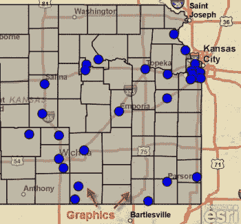
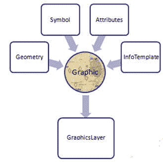
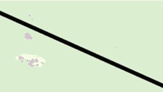
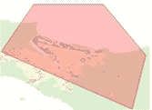
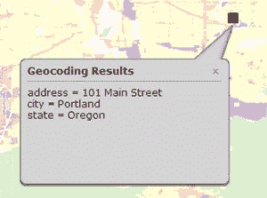
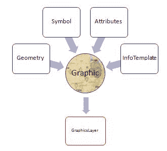
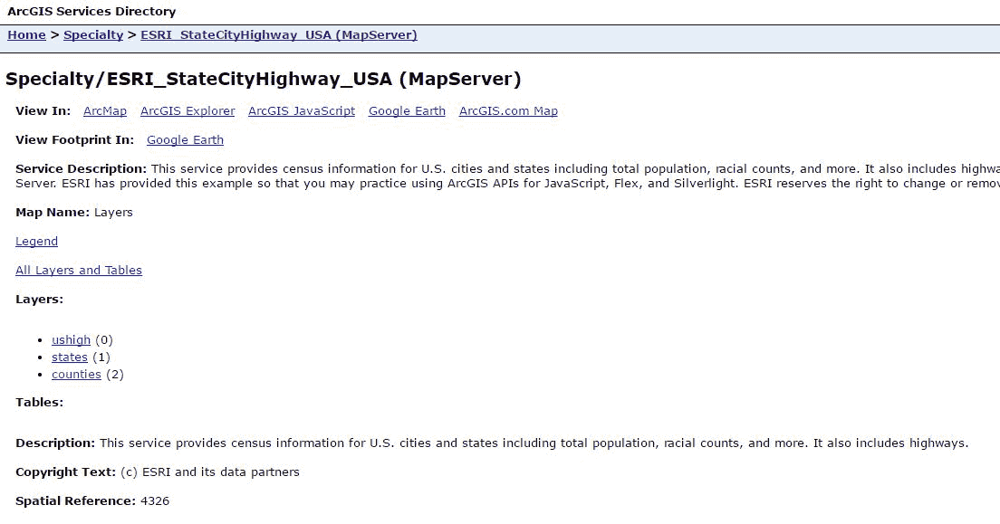
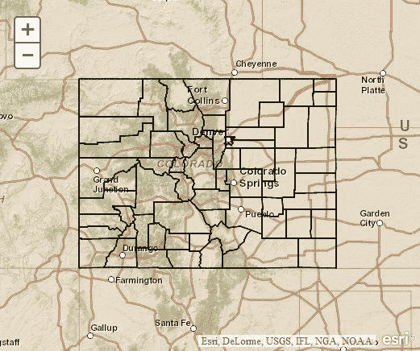
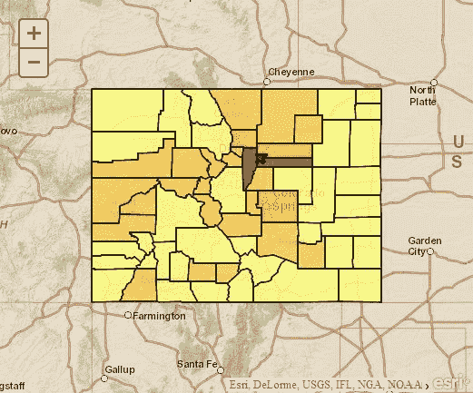
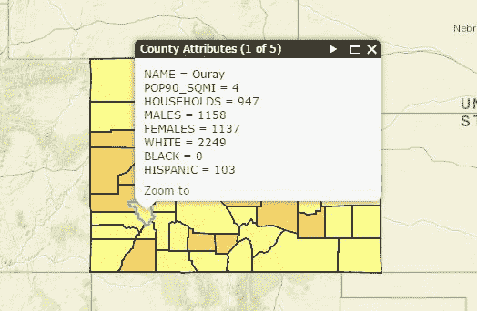

# 向地图添加图形

图形是绘制在地图顶部某个图层中的点、线或多边形，该图层独立于与地图服务相关联的任何其他数据图层。大多数人将图形对象与显示在地图上表示图形的符号相关联。但是，ArcGIS Server 中的每个图形最多可由四个对象组成，包括图形的几何图形、与图形相关联的符号系统、描述图形的属性以及定义单击图形时出现的`InfoWindow`格式的`InfoTemplate`。虽然一个图形最多可以由四个对象组成，但并不总是需要包含所有对象。您选择与图形关联的对象将取决于您正在构建的应用程序的需求。例如，在地图上显示全球定位系统坐标的应用程序中，您可能不需要为图形关联属性或显示`InfoWindow`。但是，几乎在所有情况下，您都将定义图形的几何图形和符号系统。

图形是存储在用户浏览器内存中地图上单独图层中的临时对象。它们在应用程序使用时显示，并在会话完成时删除。该图层称为`GraphicsLayer`，包含与地图相关的图形。在[第 2 章](02.html#19UOO0-04e5af4e38cd4963a2a647b690867dc7)、*创建地图和添加图层*中，我们讨论了各种类型的图层，包括动态地图服务图层和切片地图服务图层。就像这些其他类型的图层一样，`GraphicsLayer`也继承自`Layer`类。因此，在`Layer`类上发现的所有属性、方法和事件也存在于`GraphicsLayer`上。

图形显示在应用程序中存在的任何其他层的顶部。下面的截图提供了一个点和多边形图形的例子。这些图形可以由用户创建，也可以由应用程序绘制，以响应应用程序执行的任务。例如，业务分析应用程序可能会提供一个工具，允许用户绘制一个表示潜在贸易区的自由多边形。多边形图形将显示在地图顶部，然后可用作地理处理任务的输入，该任务提取与潜在贸易区相关的人口统计信息:



许多 ArcGIS Server 任务会以图形形式返回结果。例如，`QueryTask`可以执行属性和空间查询。然后，查询结果以`featureSet`对象的形式返回给应用程序，该对象只是一组特征。然后，您可以迭代数组中的每个要素，并将其渲染为地图上的图形。也许你想找到并展示所有与百年洪泛平原相交的地块？`QueryTask`可以执行空间查询，然后将结果返回到您的应用程序，在那里它们将作为多边形图形显示在地图上。

在本章中，我们将涵盖以下主题:

*   图形的四个部分
*   指定图形几何
*   象征图形
*   为图形分配属性
*   在`InfoTemplate`中显示图形属性
*   创建图形
*   向`GraphicsLayer`添加图形

# 图形的四个部分

一个图形由四个项目组成:**几何图形**、**符号**、**属性**和一个**信息模板**，如下图所示:



图形具有描述其形状和位置的几何表示。然而，图形也可以具有描述图形的名称-值对属性，以及定义点击图形时出现的`InfoWindow`格式的`InfoTemplate`。创建后，图形对象必须存储在`GraphicsLayer`对象中，然后才能显示在地图上。该`GraphicsLayer`对象用作将要显示的所有图形的容器。

图形的所有元素都是可选的。然而，图形的几何图形和符号系统几乎总是被指定的。如果没有这两个项目，地图上就没有什么可显示的，除非你打算显示它，否则有一个图形也没有什么意义。

在下面，您将看到一个代码示例，显示了创建图形并将其添加到图形层的典型过程。在这种情况下，我们应用图形的几何图形以及符号来描绘图形。但是，我们还没有为该图形指定属性或`InfoTemplate`:


# 指定图形几何

图形几乎总是有一个几何组件，这是放置在地图上所必需的。这些几何对象可以是`Point`、`Multipoint`、`Polyline`、`Polygon`或`Extent`，可以通过编程方式创建，也可以作为任务(如查询)的输出返回。

在创建这些几何类型之前，需要导入所需的`esri/geometry`资源。几何资源包含`Geometry`、`Point`、`Multipoint`、`Polyline`、`Polygon`和`Extent`的类。

`Geometry`是`Point`、`MultiPoint`、`Polyline`、`Polygon`、`Extent`继承的基类。

以下示例显示了如何创建`Point`对象:

```js
new Point(-118.15, 33.80);  
```

`Point`类通过 *x* 和 *y* 坐标定义位置，可以是地图单位也可以是屏幕单位。

# 象征图形

您创建的每个图形都可以通过 API 中的不同符号类之一进行符号化。点图形通过使用`SimpleMarkerSymbol`类进行符号化，可用的形状包括圆形、十字、菱形、正方形和 x。您也可以通过使用`PictureMarkerSymbol`类来符号化您的点，该类使用图像来显示图形。线性要素通过使用`SimpleLineSymbol`类进行符号化，可以包括实线、虚线、点或其组合。多边形使用`SimpleFillSymbol`类进行符号化，可以是实心的、透明的或交叉影线。如果您更喜欢在多边形中使用重复图案的图像，`PictureFillSymbol`类是可用的。文本也可以添加到`GraphicsLayer`中，并使用`TextSymbol`类进行符号化。

点或多点可以使用`SimpleMarkerSymbol`类进行符号化，该类有各种可以设置的属性，包括样式、大小、轮廓和颜色。样式是通过`SimpleMarkerSymbol.setStyle()`方法设置的，该方法采用如下所示的一个常数，该常数对应于所绘制的符号类型(圆形、十字、菱形等)。

```js
STYLE_CIRCLE, STYLE_CROSS, STYLE_DIAMOND, STYLE_PATH, STYLE_SQUARE, STYLE_X 
```

点图形也可以具有轮廓颜色，这是通过创建`SimpleLineSymbol`类的实例来创建的。您也可以指定图形的大小和颜色:

```js
var markerSymbol = new SimpleMarkerSymbol(); 
markerSymbol.setStyle(SimpleMarkerSymbol.STYLE_CIRCLE); 
markerSymbol.setSize(12); 
markerSymbol.setColor(new Color([255,0,0,0.5])); 
```


线性要素用`SimpleLineSymbol`类进行符号化，可以由实线或点和虚线的组合组成。线条符号的其他属性包括用`dojo/Color`定义的颜色和用于设置线条粗细的`width`属性:

```js
var polyline = new Polyline(msr); 
//a path is an array of points 
var path = [new Point(-123.123, 45.45, msr),.....]; 
polyline.addPath(path); 
var lineSymbol = new SimpleLineSymbol().setWidth(5); 

//create polyline graphic using polyline and line symbol 
var polylineGraphic = new Graphic(polyline, lineSymbol); 
map.graphics.add(polylineGraphic); 
```



多边形通过使用`SimpleFillSymbol`类进行符号化，该类允许以实心、透明或交叉填充图案绘制多边形:

```js
var polygon = new Polygon(msr); 
//a polygon is composed of rings 
var ring = [[-122.98, 45.55], [-122.21, 45.21], [-122.13, 45.53],......]; 
polygon.addRing(ring); 
var fillSymbol = new SimpleFillSymbol().setColor(new Color([255,0,0,0.25])); 
//create polygon graphic using polygon and fill symbol 
var polygonGraphic = new Graphic(polygon, fillSymbol); 
//add graphics to map's graphics layer 
map.graphics.add(polygonGraphic); 
```



您也可以选择使用`SimpleLineSymbol`对象为多边形指定轮廓。

# 为图形分配属性

图形的属性是描述该对象的名称/值对。在许多情况下，图形是作为任务的结果生成的，例如`QueryTask`。在这种情况下，几何图形和属性是从查询结果中导出的，您只需要相应地对每个图形进行符号化。与您正在查询的图层相关联的数据列将成为图形的属性。您可以通过在任务上设置属性来限制查询返回的属性数据的范围，如`outFields`。如果您是以编程方式创建图形，那么您需要使用下面的代码示例中的`Graphic.setAttributes()`方法在代码中分配属性:

```js
Graphic.setAttributes( {"XCoord":evt.mapPoint.x, "YCoord".evt.mapPoint.y,"Plant":"Mesa Mint"}); 
```

# 更改信息模板中的图形属性

一个图形也可以有一个相关的`InfoTemplate`，它定义了属性数据如何在弹出窗口中显示。在下面的代码示例中，我们创建一个点图形，对其进行符号化，然后使用键/值对分配属性信息。在这个例子中，我们有包括地址、城市和州的关键字。每个键都有一个值。包含属性数据的变量是我们为新点图形的构造函数提供的第三个参数。一个`InfoTemplate`定义了弹出窗口的格式，它包含一个标题和一个可选的内容模板字符串:

```js
var pointESRI = new Point(Number(theX), Number(theY),msr); 
var markerSymbol = new SimpleMarkerSymbol(); 
markerSymbol.setStyle(SimpleMarkerSymbol.STYLE_SQUARE); 
markerSymbol.setSize(12); 
markerSymbol.setColor(new Color([255,0,0])); 
var pointAttributes = {address:"101 Main Street", city:"Portland", state:"Oregon"}; 
var pointInfoTemplate = new InfoTemplate("Geocoding Results"); 
//create point graphic using point and marker symbol 
var pointGraphic = new Graphic(pointESRI, markerSymbol, pointAttributes).setInfoTemplate(pointInfoTemplate); 
//add graphics to maps' graphics layer 
map.graphics.add(pointGraphic); 

```



# 创建图形

一旦定义了图形的几何图形、符号系统和属性，就可以通过将此信息传递给其构造器来创建一个新的`Graphic`对象。请注意，在下面的代码示例中，我们如何为几何图形(`pointESRI`)、符号系统(`markerSymbol`)和点属性(`pointAttributes`)创建变量，然后将这些变量作为参数传递给新图形的构造函数`pointGraphic`。然后我们通过调用新的`Graphic`对象的`setInfoTemplate()`方法来应用`InfoTemplate`。最后，我们将图形添加到地图的`GraphicsLayer`:

```js
var pointESRI = new Point(Number(theX), Number(theY, msr); 
var markerSymbol = new SimpleMarkerSymbol(); 
markerSymbol.setStyle(SimpleMarkerSymbol.STYLE_SQUARE); 
markerSymbol.setSize(12); 
markerSymbol.setColor(new Color([255,0,0])); 

var pointAttributes = {address:"101 Main Street", city:"Portland", state:"Oregon"}; 
var pointInfoTemplate = new InfoTemplate("Geocoding Results"); 
//create the point graphic using point and marker symbol 
var pointGraphic = new Graphic(pointESRI, markerSymbol, pointAttributes).setInfoTemplate(pointTemplate); 

//add graphics to map's graphics layer 
map.graphics.add(pointGraphic); 
```

# 向图形层添加图形

在您的任何图形显示在地图上之前，您必须将它们添加到`GraphicsLayer`中。每个地图都有一个`GraphicsLayer`，它包含一组最初为空的图形，直到您添加图形:



`GraphicsLayer`可以包含任何类型的图形对象，因此您可以在同一层中混合点、线和多边形。图形通过`add()`方法添加到图层中，也可以通过`remove()`方法单独移除。如果需要同时移除所有图形，可以使用`clear()`方法。`GraphicsLayer`还有很多可以收听的事件，包括`click`、`mouse-down`等，为你的应用增加更多的互动性。

# 多个图形层

该应用编程接口支持向地图添加多个图形层，使组织不同类型的图形变得更加容易。可以根据需要轻松移除或添加图层。例如，可以将表示县的多边形图形放在一个图形层中，将表示交通事故的点图形放在另一个图形层中。然后，您可以根据需要显示或隐藏任一层。

# 练习时间

在本练习中，您将学习如何在地图上创建和显示图形。我们将创建一个主题地图，显示科罗拉多州各县的人口密度。我们还将向您介绍`QueryTask.`正如您将在后面的章节中了解到的那样，*任务*是 ArcGIS Server 可以执行的特殊工作流，包括空间和属性查询、要素识别、地理编码等。最后，您将看到如何将属性附加到图形要素，并在`InfoWindow`中显示它们:

1.  打开[https://developers . ArcGIS . com/JavaScript/3/Sandbox/Sandbox . html](https://developers.arcgis.com/javascript/3/sandbox/sandbox.html)处的 JavaScript Sandbox。
2.  从高亮显示的`<script>`标签中删除 JavaScript 内容，如下所示:

```js
<script> 
 var map; 

  require(["esri/map", "dojo/domReady!"], function(Map) { 
    map = new Map("map", { 
      basemap: "topo",  //For full list of pre-defined basemaps, 
      navigate to http://arcg.is/1JVo6Wd 
      center: [-122.45, 37.75], // longitude, latitude 
      zoom: 13 
    }); 
  }); 
</script>  
```

3.  创建将在应用程序中使用的变量:

```js
<script> 
  var map, defPopSymbol, onePopSymbol, twoPopSymbol, threePopSymbol, 
  fourPopSymbol, fivePopSymbol; 
</script> 

```

4.  添加`require()`功能，如高亮显示的代码所示，如下所示:

```js
<script> 
  var map, defPopSymbol, onePopSymbol, twoPopSymbol, threePopSymbol, 
  fourPopSymbol, fivePopSymbol;
  require(["esri/map", "esri/tasks/query", "esri/tasks/QueryTask", 
  "esri/symbols/SimpleFillSymbol",
  "esri/InfoTemplate", "dojo/_base/Color", "dojo/domReady!"],  
  function(Map, Query, QueryTask, SimpleFillSymbol, InfoTemplate, 
  Color) {

  });
</script>
```

We have covered the `esri/map` resource in a past exercise so no additional explanation should be necessary. However, the `esri/tasks/query` and `esri/tasks/QueryTask` resources are new, and we won't cover this in detail until a later chapter. However, in order to complete this exercise we need you to understand the basics. This `QueryTask` enables you to perform spatial and attribute queries against a data layer, and the `query` module enables you define an object to represent the query you want to execute.

5.  在`require()`功能中，您需要创建一个`Map`对象，并通过添加以下高亮显示的代码来添加底图街道图层。您将设置初始地图范围以显示科罗拉多州:

```js
<script> 
  var map, defPopSymbol, onePopSymbol, twoPopSymbol, threePopSymbol, 
  fourPopSymbol, fivePopSymbol; 
  require(["esri/map", "esri/tasks/query", "esri/tasks/QueryTask", 
  "esri/symbols/SimpleFillSymbol", "esri/InfoTemplate", 
  "dojo/_base/Color", "dojo/domReady!"],  
  function(Map, Query, QueryTask, SimpleFillSymbol, InfoTemplate, 
  Color) {  
    map = new Map("map", { 
      basemap: "streets", 
      center: [-105.498,38.981], // long, lat 
      zoom: 6, 
      sliderStyle: "small" 
    }); 
  });          
</script>
```

6.  在`require()`功能中，就在创建`Map`的代码块下面，添加代码行，创建一个新的透明多边形符号。这段代码创建了一个新的`SimpleFillSymbol`并将其分配给变量`defPopSymbol`。我们使用`255,255,255,0`的 RGB 值来确保填充颜色完全透明。这是通过值`0`来完成的，该值确保我们的着色是完全透明的。稍后，我们将添加额外的符号对象，以便显示县人口密度的彩色编码地图。现在，我们只想创建一个简单的符号，以便您能够理解在地图上创建和显示图形的基本过程:

```js
map = new Map("mapDiv", { 
  basemap: "streets", 
  center: [-105.498,38.981], // long, lat 
  zoom: 6, 
  sliderStyle: "small" 
}); 
defPopSymbol = new SimpleFillSymbol().setColor(new Color([255,255,255, 0])); // transparent 
```

在下一步中，你将看到如何使用`QueryTask`。我们将在后面的章节中详细介绍这项任务。您可以使用`QueryTask`对地图服务中的数据图层执行空间和属性查询。在本练习中，我们将使用`QueryTask`对 ESRI 地图服务提供的县边界图层执行属性查询。

7.  让我们首先检查我们将在查询中使用的地图服务和图层。打开网络浏览器，指向[http://sample server 1 . ArcGIS online . com/ArcGIS/rest/services/special/ESRI _ state city highway _ USA/MapServer](http://sampleserver1.arcgisonline.com/ArcGIS/rest/services/Specialty/ESRI_StateCityHighway_USA/MapServer):



This map service provides census information for U.S. states and counties and also includes a highway layer. In this exercise we are interested in the counties layer which has an index number of 2\. Click the counties link to get detailed information about this layer. There are a lot of fields in this layer, but we are really only interested in a field that will allow us to query by state name and a field that gives us population density information. The `STATE_NAME` field gives us the state name for each county, and the `POP90_SQMI` field gives us population density for each county.

8.  返回沙盒。在我们创建符号的代码行下面，通过在创建`defPopSymbol`变量的行下面添加下面一行代码来创建`QueryTask`。这条线所做的是创建一个新的`QueryTask`对象，该对象指向我们刚刚在浏览器中检查的`ESRI_StateCityHighway_USA`地图服务，并且具体指向带有索引的图层`2`，这是我们的县图层:

```js
var queryTask = new QueryTask("http://sampleserver1.arcgisonline.com/ArcGIS/rest/services/Specialty/ESRI_StateCityHighway_USA/MapServer/2");
```

9.  现在，您需要创建定义查询性质的`Query`对象。在刚刚输入的行下面添加下面一行代码:

```js
var query = new Query(); 
```

10.  现在，我们将在新的`Query`对象上设置一些属性，这将使我们能够执行属性查询。在创建`query`变量的行下面添加以下三行代码:

```js
var query = new Query(); 
query.where = "STATE_NAME = 'Colorado'"; 
query.returnGeometry = true; 
query.outFields = ["POP90_SQMI"]; 
```

11.  `where`属性用于指定将对图层执行的 SQL 语句。在这种情况下，我们声明只返回州名为`Colorado`的县记录。将`returnGeometry`属性设置为`true`表示我们希望 ArcGIS Server 返回与我们的查询匹配的所有要素的几何。这是必要的，因为我们需要将这些要素绘制为地图顶部的图形，并且我们需要它们的几何图形来做到这一点。`outFields`属性用于定义我们想要返回的属性字段。这些信息将在我们创建县人口密度彩色编码地图时使用。
12.  最后，我们将使用`QueryTask`上的`execute()`方法，使用我们的`Query`对象中定义的参数，对我们指示的图层(县)执行查询。添加以下代码行:

```js
queryTask.execute(query, addPolysToMap); 
```

除了将`Query`对象传入 ArcGIS Server，我们还表示`addPolysToMap()`将作为回调函数。此功能在 ArcGIS Server 执行查询并返回结果后执行。使用返回的`featureSet`绘制记录由`addPolysToMap()`功能决定。

在创建`addPolysToMap()`回调函数之前，让我们先讨论一下代码将完成什么。`addPolysToMap`功能将采用单个参数:`featureSet`。当`QueryTask`执行后，ArcGIS Server 会将一个`featureSet`对象返回到您的代码中。一个`featureSet`对象包含查询返回的图形对象。在`addPolysToMap`功能中，您会看到一行:

```js
var features = featureSet.features;
```

`features`属性返回一个图形对象数组，查询返回的每个特征对应一个。我们将使用循环构造来迭代数组中的每个图形，并将它们绘制在地图上:

13.  通过在执行`QueryTask`的代码行下面添加代码块来创建回调函数:

```js
function addPolysToMap(featureSet) {
  var features = featureSet.features;
  var feature;
  for (var i=0, il=features.length; i<il; i++) {
    feature = features[i];
    map.graphics.add(features[i].setSymbol(defPopSymbol));
  }
}
```

正如我之前提到的，您必须将创建的每个图形添加到`GraphicsLayer`对象中。这是通过调用`GraphicsLayer`对象的`add()`方法来完成的，如您在前面的代码中所见。您还会注意到，我们正在将之前创建的符号附加到每个图形(县边界)上。

14.  通过单击“刷新”按钮来执行代码，如果您的代码是正确的，您应该会看到以下输出。请注意，每个县都有我们定义的符号:



现在，我们将向应用程序添加额外的代码，该代码将根据人口对每个县多边形进行颜色编码。

15.  注释掉`require()`函数中的`defPopSymbol`变量，并添加如下五个新符号:

```js
//defPopSymbol = new SimpleFillSymbol().setColor(new Color([255,255,255, 0])); //transparent 
onePopSymbol = new SimpleFillSymbol().setColor(new Color([255,255,128, .85])); //yellow 
twoPopSymbol = new SimpleFillSymbol().setColor(new Color([250,209,85, .85]));  
threePopSymbol = new SimpleFillSymbol().setColor(new Color([242,167,46, .85])); //orange 
fourPopSymbol = new SimpleFillSymbol().setColor(new Color([173,83,19, .85]));  
fivePopSymbol = new SimpleFillSymbol().setColor(new Color([107,0,0, .85])); //dark maroon 
```

我们在这里做的基本上是创建一个符号的彩色斜坡，根据人口密度分配给每个县。我们还对每个符号应用了. 85 的透明度值，这样我们就可以透视每个县。这将使我们能够看到标记在基础地图上的城市名称。

16.  回想一下，在前面的练习中，我们创建了`QueryTask`和`Query`对象，并在`Query`上定义了一个`outFields`属性来返回`POP90_SQMI`字段。现在，这将发挥作用，因为我们使用该字段中返回的值来确定应用于每个县的符号，基于该县的人口密度。如下所示更新`addPolysToMap`功能，然后我们将讨论我们所做的工作:

```js
function addPolysToMap(featureSet) { 
  var features = featureSet.features; 
  var feature; 
  for (var i=0, il=features.length; i<il; i++) { 
    feature = features[i]; 
    attributes = feature.attributes; 
    pop = attributes.POP90_SQMI; 

    if (pop < 10) { 
      map.graphics.add(features[i].setSymbol(onePopSymbol)); 
      } else if (pop >= 10 && pop < 95) { 
          map.graphics.add(features[i].setSymbol(twoPopSymbol)); 
      } else if (pop >= 95 && pop < 365) { 
          map.graphics.add(features[i].setSymbol(threePopSymbol)); 
      } else if (pop >= 365 && pop < 1100) { 
          map.graphics.add(features[i].setSymbol(fourPopSymbol)); 
      } else { 
          map.graphics.add(features[i].setSymbol(fivePopSymbol)); 
      } 
   } 
}
```

17.  我们对这个代码块所做的是从每个图形中获取人口密度信息，并将其保存到一个名为`pop`的变量中。然后使用`if/else`代码块根据该县的人口密度为图形指定一个符号。例如，人口密度(如`POP90_SQMI`字段中所定义)为`400`的县将被分配由`fourPopSymbol`定义的符号。for 循环确保对`featureSet.features`数组中的每个图形都这样做。

通过单击“刷新”按钮执行代码，您应该会看到以下输出。请注意，根据人口密度，每个县都使用我们定义的符号之一进行了颜色编码:



在下一步中，您将学习如何将属性附加到图形上，并在用户点击图形时以`InfoWindow`显示它们:



`InfoWindow`是当你点击地图上的一个图形时显示的一个 HTML 弹出窗口。通常它包含被点击的图形的属性，但是它也可以包含你作为开发者指定的自定义内容。这些窗口的内容是通过`InfoTemplate`对象指定的，该对象指定了窗口的标题和要在窗口中显示的内容。创建`InfoTemplate`对象最简单的方法是对内容使用通配符，该通配符会自动将数据集的所有字段插入到`InfoWindow`中。我们将添加一些额外的输出字段，以便在`InfoWindow`中显示更多内容。

18.  修改设置`Query`对象的`outfield`属性的代码行，以包括代码中突出显示的字段，如下所示:

```js
query.outFields = ["NAME","POP90_SQMI","HOUSEHOLDS","MALES","FEMALES","WHITE","BLACK","HISPANIC"];
```

19.  在对`QueryTask.execute`的调用下面添加下面一行代码:

```js
resultTemplate = InfoTemplate("County Attributes", "${*}"); 
```

20.  传递到构造函数中的第一个参数(`"County Attributes"`字符串)是窗口的标题。第二个参数是通配符，表示应该显示所有属性的名称/值对。因此，当点击图形时，我们添加到`Query.outFields`的新字段应该都包含在`InfoWindow`中。
21.  最后，我们必须将新创建的`InfoTemplate`分配给每个图形。当我们在`for`循环中处理每个图形时，我们在其上调用`Graphic.setInfoTemplate()`，但是因为我们将对图层中的所有图形使用相同的模板，所以我们可以调用`GraphicsLayer`的`setInfoTemplate()`方法来代替。
22.  如图所示修改`addPolysToMap()`功能:

```js
function addPolysToMap(featureSet) { 
  var features = featureSet.features; 
  var feature; 
  for (var i=0, il=features.length; i<il; i++) { 
    feature = features[i]; 
    attributes = feature.attributes; 
    pop = attributes.POP90_SQMI; 

    if (pop < 10) { 
      map.graphics.add(features[i].setSymbol(onePopSymbol)); 
    } else if (pop >= 10 && pop < 95) { 
      map.graphics.add(features[i].setSymbol(twoPopSymbol)); 
    } else if (pop >= 95 && pop < 365) { 
      map.graphics.add(features[i].setSymbol(threePopSymbol)); 
    } else if (pop >= 365 && pop < 1100) { 
      map.graphics.add(features[i].setSymbol(fourPopSymbol)); 
    } else { 
      map.graphics.add(features[i].setSymbol(fivePopSymbol)); 
    } 
  } 
  map.graphics.setInfoTemplate(resultTemplate); 
}
```

23.  通过单击刷新按钮来执行代码。单击地图中的任何一个县，您应该会看到类似于本活动开始时显示的截图的`InfoWindow`。
24.  您可以在`Chapter3`文件夹中的`graphics.html`文件中查看本练习的解决方案代码，以验证您的代码是否已正确编写。

# 摘要

在本章中，您了解到图形通常用于表示作为工作应用程序中执行的操作的结果而生成的信息。这些图形通常作为*任务的结果返回，如属性或空间查询。图形包括点、线、多边形和文本。这些是临时对象，仅在当前浏览器会话期间显示。每个图形可以由几何图形、符号系统、属性和`Infotemplate`组成，并通过使用位于所有地图服务图层之上的`GraphicsLayer`添加到地图中，以确保`GraphicsLayer`的内容始终可见。在下一章中，我们将向您介绍`FeatureLayer`，它可以做`GraphicsLayer`所能做的一切，甚至更多！*