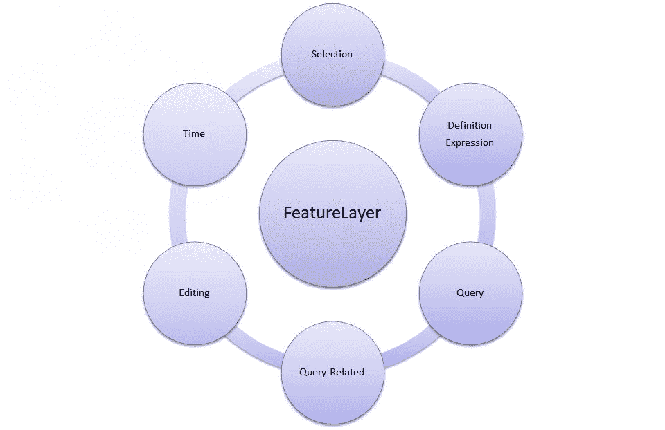
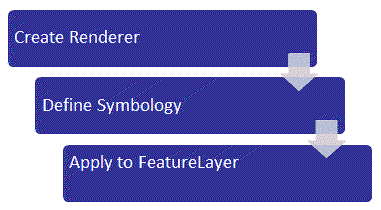
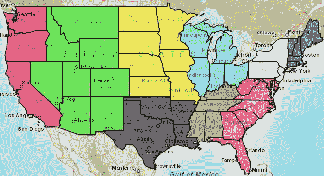
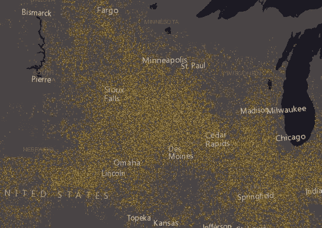
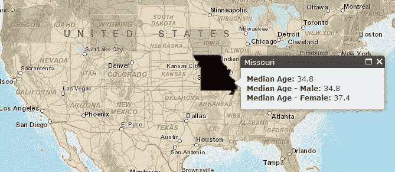

# 四、特征图层

用于 JavaScript 的 ArcGIS 应用编程接口提供了一种使用客户端图形功能的替代方法:`FeatureLayer`。

`FeatureLayer`继承了`GraphicsLayer`的功能，但也提供了额外的功能，例如使用定义表达式执行查询、选择和数据过滤的能力。`FeatureLayer`也可以用于基于网络的编辑，我们将在后面的章节中看到。

`FeatureLayer`与切片和动态地图服务图层的主要区别在于它不在渲染服务器端执行。相反，它将几何图形及其相关属性发送到浏览器。浏览器渲染几何图形中的特征，并将它们的所有属性数据存储在内存中。

将此与我们已经看到的平铺和动态地图服务图层进行比较，这些图层在服务器上呈现为图像并发送到浏览器进行显示。如果您想从这些服务中检索属性数据，您必须查询它，这涉及到另一个到服务器的往返行程。

*以这种方式流式传输来自 ArcGIS 服务器的数据*可以通过最大限度地减少对服务器的请求来提高应用的性能。客户端可以请求所需的功能，并对这些功能进行选择和查询，而无需向服务器请求更多信息。

因此，`FeatureLayer`特别适用于响应用户交互(如鼠标点击或悬停)的图层。处理这些交互所需的信息已经存在于客户端中。

问题是，如果您使用的是包含大量功能的`FeatureLayer`，那么最初将这些功能传输到客户端可能需要很长时间。幸运的是，`FeatureLayer`支持多种显示模式，有助于减轻使用大量功能的负担。我们将在本章中研究这些显示模式。

`FeatureLayer`接受地图服务中图层上配置的任何定义表达式、比例依赖关系和其他属性。使用`FeatureLayer`，您可以访问相关表格、执行查询、显示时间段、使用特征附件以及执行其他有用的操作:



在本章中，我们将涵盖以下主题:

*   创建`FeatureLayer`
*   定义显示模式
*   设置定义表达式
*   特征选择
*   渲染`FeatureLayer`
*   练习时间

# 创建特征图层

`FeatureLayer`必须引用地图服务或特征服务中的图层。如果您只想从服务器检索几何和属性并自己对其进行符号化，请使用地图服务。如果要利用特征服务的源地图文档中的符号，请使用特征服务。此外，如果您计划使用`FeatureLayer`执行基于网络的编辑，请使用特征服务。特征图层支持源地图文档中配置的任何特征编辑模板。

下面的代码示例显示了如何使用构造函数创建`FeatureLayer`。对于平铺和动态图层，您只需提供一个指向地图服务 REST 端点的指针，但是对于`FeatureLayer`，您需要指向服务中的特定*图层*。在下面的代码示例中，我们从服务的第一层创建一个`FeatureLayer`，用数字 0 表示。`FeatureLayer`的构造器也接受显示模式、输出字段、信息模板等选项。这里，显示模式设置为“快照”，这是对相当小的数据集的最佳访问方法。我们将在下一节介绍`FeatureLayer`的不同显示模式以及何时使用它们:

```js
var earthquakes = new FeatureLayer("http://sampleserver3.arcgisonline.com/ArcGIS/rest/services/Earthquakes/Since_1970/MapServer/0",{ mode: FeatureLayer.MODE_SNAPSHOT, outFields: ["Magnitude"]}); 
```

# 可选构造函数参数

除了指定层(这是必需的)，您还可以选择传入一个 JSON 对象，该对象定义了构造函数的各种选项。构造函数接受许多这样的选项。我们将看一些更常用的。

`outFields`属性限制用`FeatureLayer`返回的字段。出于性能原因，最好只包含应用需要的字段，而不是接受返回所有字段的默认值。

在下面突出显示的代码中，我们使用了 options 对象的`outFields`属性来告诉服务器只返回`Name`和`Magnitude`字段:

```js
var earthquakes = new FeatureLayer("http://sampleserver3.arcgisonline.com/ArcGIS/rest/services/Earthquakes/Since_1970/MapServer/0",{ mode: FeatureLayer.MODE_SNAPSHOT, outFields: ["Name", "Magnitude"]}); 
```

`refreshInterval`属性定义了刷新图层的频率(以分钟为单位)。如果基础地图服务图层包含经常变化的数据，请考虑降低`refreshInterval`的值:

```js
var earthquakes = new FeatureLayer(" http://sampleserver3.arcgisonline.com/ArcGIS/rest/services/Earthquakes/Since_1970/MapServer/0",
{ mode: FeatureLayer.MODE_SNAPSHOT, outFields: ["Name","Magnitude"], refreshInterval: 5}); 
```

要定义单击特征时应在信息窗口中显示的属性和样式，您可以设置`infoTemplate`属性:

```js
var infotemplate = new InfoTemplate("${Name}", "Magnitude: ${Magnitude}"); 
var earthquakes = new FeatureLayer(" 
http://sampleserver3.arcgisonline.com/ArcGIS/rest/services/Earthquakes/Since_1970/MapServer/0",{ 
  mode: FeatureLayer.MODE_SNAPSHOT, 
  outFields: ["Name", "Magnitude"], 
  refreshInterval: 5, 
  infoTemplate:infotemplate 
}); 
```

最重要的选项可能是显示模式，用`mode`参数定义，所以我们将更详细地讨论它。

# 定义显示模式

创建`FeatureLayer`实例时，需要指定检索特征的模式。因为模式决定了何时以及如何将功能从服务器带到客户端，所以您的选择会影响应用的行为和性能。

您可以从以下模式中选择:

# 快照模式

快照模式从地图服务图层中检索所有特征，并一次性将它们流式传输到客户端浏览器。因此，在使用此模式之前，您必须仔细考虑图层的大小。通常，您应该只对小数据集使用这种模式。快照模式下的大型数据集会显著降低应用的性能。快照模式的好处是，由于层中的所有功能都是在层加载时发送给客户端的，因此无需返回服务器获取额外的数据。这可以显著提高应用的性能。

ArcGIS 对一次可返回的 1，000 个特征进行了限制，尽管该数量可通过 ArcGIS Server 管理进行配置。这应该不成问题，因为如前所述，您只希望在处理小型数据集时使用这种模式:

```js
var earthquakes = new FeatureLayer("http://sampleserver3.arcgisonline.com/ArcGIS/rest/services/Earthquakes/Since_1970/MapServer/0",{ mode: FeatureLayer.MODE_SNAPSHOT, outFields: ["Name", "Magnitude"]});
```

前面的代码示例显示了如何将`FeatureLayer`设置为快照模式。

# 按需模式

按需模式仅在应用需要时检索功能。这意味着服务器只返回当前视图范围内的特征。因此，每次进行缩放或平移操作时，新功能都会从服务器流向客户端。这往往适用于不适合快照模式的较大数据集。

每次地图范围发生变化时，都需要往返服务器以获取特征，但对于大型数据集，这是更可取的做法:

```js
var earthquakes = new FeatureLayer("http://sampleserver3.arcgisonline.com/ArcGIS/rest/services/Earthquakes/Since_1970/MapServer/0",{ mode: FeatureLayer.MODE_ONDEMAND, outFields: ["Name", "Magnitude"]}); 
```

前面的代码示例显示了如何将`FeatureLayer`设置为按需模式。

# 仅选择模式

仅选择模式最初不要求任何功能。相反，只有在客户端进行选择时，才会返回功能。选定的功能从服务器流式传输到客户端。然后，这些选定的特征被保存在客户端上。稍后我们将讨论如何选择功能:

```js
var earthquakes = new FeatureLayer("http://sampleserver3.arcgisonline.com/ArcGIS/rest/services/Earthquakes/Since_1970/MapServer/0",{ mode: FeatureLayer.MODE_SELECTION, outFields: ["Name", "Magnitude"]}); 
```

前面的代码示例显示了如何将`FeatureLayer`设置为仅选择模式。

# 自动模式

自动模式为您做出决定。但是，它仅适用于托管特征服务，在我们讨论编辑之前，我们不会详细介绍这些服务。

# 设置定义表达式

定义表达式用于根据属性字段的值过滤流向客户端的特征。`FeatureLayer`包含用于创建过滤器表达式的`setDefinitionExpression()`方法。符合指定标准的所有特征都将返回以显示在地图上。您可以使用标准的 SQL 语法构建表达式，如下面的代码示例所示:

```js
featureLayer.setDefinitionExpression("Magnitude>7"); 
```

您可以使用`FeatureLayer.getDefinitionExpression()`方法检索当前定义表达式，该方法返回包含表达式的字符串。

# 特征选择

`FeatureLayer`还支持特征选择。选定特征是图层中特征的子集，可用于查看、编辑、分析或作为其他操作的输入。使用空间或属性标准向选择集中添加特征或从选择集中移除特征。选择集中的特征通常使用不同的符号体系绘制，以将其与图层中的其他特征区分开来。

要创建选择集，使用`FeatureLayer`上的`selectFeatures(query)`方法。参数是一个`Query`对象，与您已经在`QueryTask`中看到的对象完全一样。下面的代码示例说明了这一点:

```js
var selectQuery = new Query(); 
selectQuery.geometry = geometry;
 featureLayer.selectFeatures(selectQuery,FeatureLayer.SELECTION_NEW);
```

我们还没有详细介绍`Query`对象，但是就像在`QueryTask`中一样，您可以使用它来定义属性或空间查询的输入参数。

前面的截图显示了一个已经被选择的特性。选择符号已应用于选定特征。

通过应用或在地图文档文件内的图层上设置的任何定义表达式都将得到遵守。设置用于所选特征的符号非常简单，只需创建一个符号，然后在`FeatureLayer`上使用`setSelectionSymbol()`方法即可。选定的特征将自动被分配此符号。您可以选择定义新的选择集，向现有选择集添加特征，或通过提供的常量从选择集中移除特征，包括`SELECTION_NEW`、`SELECTION_ADD`和`SELECTION_SUBTRACT`。下面的代码示例演示如何定义新的选择集:

```js
fLayer.selectFeatures(selectQuery,FeatureLayer.SELECTION_NEW); 
```

第一个参数是`Query`对象，第二个参数是一个常量，它告诉 API 我们想要创建一个新的选择集。

此外，您可以提供进一步的参数，分别定义`callback`和`errback`函数来处理返回的特征或处理任何错误。

# 渲染特征层

您可以使用`renderer`属性为`FeatureLayer`或`GraphicsLayer`定义一组符号。基于属性，这些符号可以具有不同的颜色和/或大小。

在用于 JavaScript 的 ArcGIS Server 应用编程接口中，有许多不同类型的渲染器。常见的有`SimpleRenderer`、`ClassBreaksRenderer`、`UniqueValueRenderer`、`DotDensityRenderer`、`TemporalRenderer`。我们将在本节中研究这些渲染器。

无论你使用`renderer`的类型，渲染过程都是一样的。您首先需要创建渲染器的实例，为其定义符号系统，然后最终将渲染器应用于`FeatureLayer`。该渲染过程如下所示:



最简单的渲染器类型是`SimpleRenderer`，它只是对所有图形应用相同的符号。您只需要定义符号，将其与渲染器相关联，然后将渲染器应用到图形层:

```js
var symbol = new SimpleMarkerSymbol();
 symbol.style = SimpleMarkerSymbol.STYLE_CIRCLE;
 symbol.setSize(10);
 symbol.setColor(new Color([255,0,0,0.5]));
 var renderer = new SimpleRenderer(symbol); 
graphicsLayer.setRenderer(renderer); 
```

前面的示例创建了一个 10 像素高的红色圆圈，并使用它来符号化图层中的所有图形。

`UniqueValueRenderer`可用于基于匹配属性对图形进行符号化，该属性通常是包含字符串数据的字段:



例如，如果您有一个州特征类，您可能希望基于区域名称对每个特征进行符号化。每个区域将与不同的符号相关联。下面的代码示例显示了如何通过编程创建一个`UniqueValueRenderer`并向其添加值和符号:

```js
var renderer = new UniqueValueRenderer(defaultSymbol, "REGIONNAME"); 
renderer.addValue("West", new SimpleLineSymbol().setColor(new Color([255, 255, 0, 0.5]))); 
renderer.addValue("South", new SimpleLineSymbol().setColor(new Color([128, 0, 128, 0.5]))); 
renderer.addValue("Mountain", new SimpleLineSymbol().setColor(new Color([255, 0, 0, 0.5]))); 
```

`ClassBreaksRenderer`处理数值属性数据。根据您定义的数值范围，每个图形将根据该特定属性的值进行符号化。

断点定义了符号将改变的值。例如，对于宗地特征类，您可能希望基于在`PROPERTYVALUE`字段中找到的值对宗地进行符号化。您必须首先创建`ClassBreaksRenderer`的新实例，然后为数据定义断点。如果需要，`Infinity`和`-Infinity`值可以用作数据的上下边界，如下面的代码示例所示。这里，我们使用`Infinity`关键字来表示任何大于 250，000 的值的分类:

```js
var renderer = new ClassBreaksRenderer(symbol, "PROPERTYVALUE"); 
renderer.addBreak(0, 50000, new SimpleFillSymbol().setColor(new Color([255, 0, 0, 0.5]))); 
renderer.addBreak(50001, 100000, new SimpleFillSymbol().setColor(new Color([255, 255, 0, 0.5]))); 
renderer.addBreak(100001, 250000, 50000, new SimpleFillSymbol().setColor(new Color([0, 255, 0, 0.5]))); 
renderer.addBreak(250001, Infinity, new SimpleFillSymbol().setColor(new Color([255, 128, 0, 0.5])));
```


A `TemporalRenderer`根据时间值提供渲染特征。这种类型的渲染器通常用于显示历史信息或接近实时的数据。时态渲染器允许您定义如何渲染观察和轨迹:

```js
// temporal renderer
 var observationRenderer = new ClassBreaksRenderer(new SimpleMarkerSymbol(), "magnitude");
 observationRenderer.addBreak(7, 12, new SimpleMarkerSymbol(SimpleMarkerSymbol.STYLE_SQUARE, 24, new SimpleLineSymbol().setStyle(SimpleLineSymbol.STYLE_SOLID).setColor(new Color([100,100,100])),new Color([0,0,0,0])));

 observationRenderer.addBreak(6, 7, new SimpleMarkerSymbol(SimpleMarkerSymbol.STYLE_SQUARE, 21, new SimpleLineSymbol().setStyle(SimpleLineSymbol.STYLE_SOLID).setColor(new Color([100,100,100])),new Color([0,0,0,0])));

 observationRenderer.addBreak(5, 6, new SimpleMarkerSymbol(SimpleMarkerSymbol.STYLE_SQUARE, 18,new SimpleLineSymbol().setStyle(SimpleLineSymbol.STYLE_SOLID).setColor(new Color([100,100,100])),new Color([0,0,0,0])));

 observationRenderer.addBreak(4, 5, new SimpleMarkerSymbol(SimpleMarkerSymbol.STYLE_SQUARE, 15,new SimpleLineSymbol().setStyle(SimpleLineSymbol.STYLE_SOLID).setColor(new Color([100,100,100])),new Color([0,0,0,0])));

 observationRenderer.addBreak(3, 4, new SimpleMarkerSymbol(SimpleMarkerSymbol.STYLE_SQUARE, 12,new SimpleLineSymbol().setStyle(SimpleLineSymbol.STYLE_SOLID).setColor(new Color([100,100,100])),new Color([0,0,0,0])));

 observationRenderer.addBreak(2, 3, new SimpleMarkerSymbol(SimpleMarkerSymbol.STYLE_SQUARE, 9,new SimpleLineSymbol().setStyle(SimpleLineSymbol.STYLE_SOLID).setColor(new Color([100,100,100])),new Color([0,0,0,0])));

 observationRenderer.addBreak(0, 2, new SimpleMarkerSymbol(SimpleMarkerSymbol.STYLE_SQUARE, 6,new SimpleLineSymbol().setStyle(SimpleLineSymbol.STYLE_SOLID).setColor(new Color([100,100,100])),new Color([0,0,0,0])));var infos = [
   { minAge: 0, maxAge: 1, color: new Color([255,0,0])},
   { minAge: 1, maxAge: 24, color: new Color([49,154,255])},
   { minAge: 24, maxAge: Infinity, color: new Color([255,255,8])}
 ];var ager = new TimeClassBreaksAger(infos, TimeClassBreaksAger.UNIT_HOURS);
 var renderer = new TemporalRenderer(observationRenderer, null, null, ager);
 featureLayer.setRenderer(renderer);
```

前面的代码示例说明了如何使用`ClassBreaksRenderer`创建`TemporalRenderer`，并将其应用于`FeatureLayer`。类分隔符渲染器用于按大小定义符号；幅度越大，符号越大。

然后定义一个符号`ager`。`ager`符号决定了特征符号如何随着时间的推移而变化。

我们将讨论的最后一种渲染器类型是`DotDensityRenderer`:



此渲染器使您能够创建数据的点密度可视化，以显示离散空间现象的集中。在这个例子中，我们用它来显示人口密度:

```js
var dotDensityRenderer = new DotDensityRenderer({
   fields: [{
       name: "pop",
       color: new Color([52, 114, 53])
   }],
   dotValue: 1000,
   dotSize: 2
 });

 layer.setRenderer(dotDensityRenderer);
```

这里，我们基于`pop`字段创建`DotDensityRenderer`，并定义点值 100 和大小 2。这将为每 1000 人创建一个两像素大小的点。

还有其他一些渲染器，您可能希望用于特定任务，例如`ScaleDependentRenderer`，它允许您根据查看特征的比例将不同的符号应用于特征；以及`HeatMapRenderer`，它类似于`DotDensityRenderer`，但使用一种称为高斯模糊的技术来显示点的强度。

# 练习时间

在本练习中，您将使用`FeatureLayer`在图层上设置定义表达式，将与定义表达式匹配的特征绘制为图形，并响应特征上的悬停事件。

按照给定的步骤完成练习:

1.  打开[https://developers . ArcGIS . com/JavaScript/3/sandbox/sandbox . html](https://developers.arcgis.com/javascript/3/sandbox/sandbox.html)处的 JavaScript 沙盒。
2.  从我突出显示的`<script>`标签中删除 JavaScript 内容，留下一个空的`<script></script>`块，用于编写所需的代码:

```js
<script> 
 var map; 

  require(["esri/map", "dojo/domReady!"], function(Map) { 
    map = new Map("map", { 
      basemap: "topo",  //For full list of pre-defined basemaps, 
      navigate to http://arcg.is/1JVo6Wd 
      center: [-122.45, 37.75], // longitude, latitude 
      zoom: 13 
    }); 
  }); 
</script> 
```

3.  创建用于引用`<script>`标记中地图的变量:

```js
<script> 
  var map; 
</script>
```

4.  创建`require()`函数，定义您将在此应用中使用的资源:

```js
<script> 
  var map; 
  require(["esri/map", 
  "esri/layers/FeatureLayer", 
  "esri/symbols/SimpleFillSymbol", 
  "esri/symbols/SimpleLineSymbol", 
  "esri/renderers/SimpleRenderer", 
  "esri/InfoTemplate", 
  "esri/graphic", 
  "dojo/on", 
  "dojo/_base/Color", 
  "dojo/domReady!"],  
  function(Map, FeatureLayer, SimpleFillSymbol, 
  SimpleLineSymbol, SimpleRenderer, InfoTemplate, Graphic, on, Color) { 

  } 
  ); 
</script> 

```

5.  在您的网络浏览器中，导航至[http://sample server 1 . ArcGIS online . com/ArcGIS/rest/services/persistics/ESRI _ Census _ USA/MapServer/5](http://sampleserver1.arcgisonline.com/ArcGIS/rest/services/Demoimg/ESRI_Census_USA/MapServer/5)。

我们将在本练习中使用`states`层。我们要做的是对`states`层应用一个定义表达式，它将只显示那些中位年龄大于`36`的州。当用户将鼠标悬停在满足定义表达式的状态上时，那些中位年龄大于`36`的状态将在地图上显示为图形，并且将显示包含该状态的中位年龄、男性中位年龄和女性中位年龄的信息窗口。此外，州界将以红色标出。我们将从`states`层使用的字段包括`STATE_NAME, MED_AGE, MED_AGE_M, and MED_AGE_F`。

6.  如下图所示创建`Map`对象:

```js
function (Map, FeatureLayer, ...) {  
 map = new Map("map", { 
        basemap: "streets", 
        center: [-96.095,39.726], // long, lat 
        zoom: 4, 
        sliderStyle: "small" 
    });     
}
```

7.  添加一个`Map.load`事件处理程序，当触发时，触发`Map.Graphics.mouse-out`事件处理程序的创建，进而清除任何现有的图形和信息窗口:

```js
map = new Map("map", { 
    basemap: "streets", 
    center: [-96.095, 39.726], // long, lat 
    zoom: 4, 
    sliderStyle: "small" 
}); 

map.on("load", function () { 
    map.graphics.on("mouse-out", function (evt) { 
        map.graphics.clear(); 
        map.infoWindow.hide(); 
    }); 
}); 
```

8.  创建一个新的`FeatureLayer`，指向您之前检查的`states`层。将特征检索模式设置为`MODE_SNAPSHOT`，定义输出字段，设置定义表达式。将以下代码添加到应用中:

```js
map.on("load", function() { 
     map.graphics.on("mouse-out", function(evt) { 
       map.graphics.clear(); 
       map.infoWindow.hide(); 
     }); 
   });            

var olderStates = new FeatureLayer("http://sampleserver1.arcgisonline.com/ArcGIS/rest/services/Demoimg/ESRI_Census_USA/MapServer/5", { 
    mode: FeatureLayer.MODE_SNAPSHOT, 
    outFields: ["STATE_NAME", "MED_AGE", "MED_AGE_M", "MED_AGE_F"] 
}); 
olderStates.setDefinitionExpression("MED_AGE > 36"); 
```

这里，我们使用`new`关键字来定义`FeatureLayer`的新实例，该实例指向代码中指定的 REST 端点处的`states`层。在定义`FeatureLayer`的新实例时，我们包括了几个属性，包括`mode`和`outFields`。`mode`属性可以是快照、按需或仅选择。由于状态层包含的特征数量相对较少，因此我们可以使用快照模式。快照模式会在图层添加到地图时检索图层中的所有特征，因此不需要额外的服务器行程。我们还指定了`outFields`属性，这是一个将要返回的字段数组。当用户悬停在状态上时，我们将在信息窗口中显示这些字段。最后，我们在图层上设置定义表达式，只显示那些中位年龄大于`36`的特征(状态)。

9.  在此步骤中，您将创建一个符号并将`renderer`应用于状态特征。您还将把`FeatureLayer`添加到地图中。在最后一步添加的代码之后添加以下几行代码:

```js
var olderStates = new FeatureLayer("http://...", { 
    mode: FeatureLayer.MODE_SNAPSHOT, 
    outFields: ["STATE_NAME", "MED_AGE", "MED_AGE_M", "MED_AGE_F"] 
}); 
olderStates.setDefinitionExpression("MED_AGE > 36"); 

var symbol = new SimpleFillSymbol(SimpleFillSymbol.STYLE_SOLID, 
    new SimpleLineSymbol(SimpleLineSymbol.STYLE_SOLID, 
    new Color([255, 255, 255, 0.35]), 1), 
    new Color([125, 125, 125, 0.35])); 
olderStates.setRenderer(new SimpleRenderer(symbol)); 

map.addLayer(olderStates); 
```

10.  使用您之前定义的输出字段，创建一个`InfoTemplate`。在最后一步中创建的代码行之后，向应用中添加以下代码行。请注意，输出字段包含在括号内，前面有一个美元符号:

```js
var infoTemplate = new InfoTemplate(); 
infoTemplate.setTitle("${STATE_NAME}"); 
infoTemplate.setContent("<b>Median Age: </b>${MED_AGE_M}<br/>" 
    + "<b>Median Age - Male: </b>${MED_AGE_M}<br/>" 
    + "<b>Median Age - Female: </b>${MED_AGE_F}"); 
map.infoWindow.resize(245, 125);
```

11.  添加以下代码行以创建当用户将鼠标悬停在某个状态上时将显示的图形:

```js
var highlightSymbol = new SimpleFillSymbol(SimpleFillSymbol.STYLE_SOLID, 
    new SimpleLineSymbol(SimpleLineSymbol.STYLE_SOLID, 
        new Color([255, 0, 0]), 
        new Color([125, 125, 125, 0.35]) 
    ) 
); 
```

12.  最后一步是每次用户悬停在一个状态上时，显示我们在最后几个步骤中创建的高亮和信息模板。在您输入的最后几行代码之后添加以下代码块，然后我们将讨论。这里，我们使用`on()`将`mouse-over`事件连接到每次事件发生时都会响应的处理函数。在这种情况下，`mouse-over`事件处理程序将清除`GraphicsLayer`中的任何现有图形，创建信息模板，创建高亮符号并将其添加到`GraphicsLayer`，然后显示`InfoWindow`:

```js
olderStates.on("mouse-over", function (evt) { 
    map.graphics.clear(); 
    evt.graphic.setInfoTemplate(infoTemplate); 
    var content = evt.graphic.getContent(); 
    map.infoWindow.setContent(content); 
    var title = evt.graphic.getTitle(); 
    map.infoWindow.setTitle(title); 
    var highlightGraphic = new Graphic(evt.graphic.geometry, highlightSymbol); 
    map.graphics.add(highlightGraphic); 
    map.infoWindow.show(evt.screenPoint, map.getInfoWindowAnchor(evt.screenPoint)); 
});

```

13.  您可能需要查看示例代码的`Chapter4`文件夹中的解决方案文件(`featurelayer.html`)，以验证您的代码是否已正确编写。通过点击刷新按钮来执行代码，如果一切都已正确编码，您应该会看到以下输出。您应该会看到如下图所示的地图。将鼠标移到突出显示的状态之一上，查看信息窗口:



# 摘要

`FeatureLayer`类用于处理客户端图形功能。`FeatureLayer`继承了`GraphicsLayer`的功能，但它也提供了额外的功能，例如执行查询和选择的能力，并支持定义表达式。`FeatureLayer`也可以用于网页编辑。`FeatureLayer`不同于切片和动态地图服务图层，因为特征图层将几何和属性信息带到客户端计算机，由网络浏览器绘制。这可以减少到服务器的往返行程，从而提高应用的性能。客户端可以请求所需的功能，并对这些功能进行选择和查询，而无需向服务器请求更多信息。`FeatureLayer`对于响应用户交互(如鼠标点击或悬停)的图层特别有用。能够在浏览器中处理所有这些，而不需要向服务器发出多个请求，这使得您的应用响应速度非常快。