# 五、使用小部件和工具栏

作为地理信息系统开发人员，您的主要目标是构建特定于您的应用的功能。花费宝贵的时间和精力来实现许多网络地图应用通用的基本地理信息系统工具会降低您的主要关注点。

幸运的是，该应用编程接口提供了用户界面小部件，您可以将其直接放入应用中，只需稍加配置，它们就可以运行了。这些工具包括地图导航工具、概览地图、图例、比例尺等。该应用编程接口还包括帮助类，帮助您构建自己的导航和绘图工具栏。在本章中，您将了解将这些用户界面组件添加到应用中是多么容易。

让我们从检查一个具有绘图工具栏的 Esri 示例应用开始。打开网页浏览器，进入[https://developers . ArcGIS . com/JavaScript/3/samples/toolbar _ draw/](https://developers.arcgis.com/javascript/3/samples/toolbar_draw/):


乍一看，您会认为绘图工具栏只是您放入应用中的一个用户界面组件。不完全是。相反，它提供了您可以设计自己的界面或工具栏的功能。

API 给你的助手类叫做`esri/toolbars/Draw`。

在本章中，我们将了解另一个工具栏:`esri/toolbars/Navigation`，您可以在以下操作中看到:

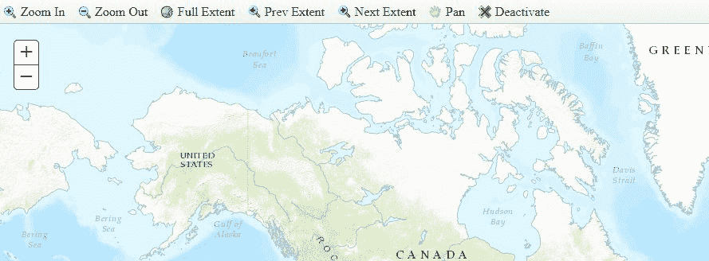

这两个助手类所做的是为您节省绘制缩放框、捕捉鼠标点击和其他用户发起的事件的工作。任何有经验的地理信息系统网络开发人员都可以告诉你，这不是一件小事。将这些基本导航功能合并到 API 提供的助手类中，可以轻松节省几十个小时的开发工作。

在本章中，我们将涵盖以下主题:

*   向应用添加工具栏
*   用户界面小部件
*   特征编辑

# 向应用添加工具栏

有四种不同的工具栏，您可以使用 API 提供的帮助器类将其添加到应用中。我们将在本章中讨论的两个是导航和绘制。还有一个编辑工具栏，可用于通过网络浏览器编辑特征或图形。我们将在后面的章节中讨论这个工具栏。请记住，当我们在这里谈论“工具栏”时，我们指的是帮助您构建此类工具栏的帮助器类，而不是工具栏本身。工具栏的外观由您决定。

Note that the API includes another toolbar which provides support for measuring image services. That is beyond the scope of this book.

# 创建工具栏的步骤

导航和绘图工具栏不仅仅是可以放入应用的用户界面组件。它们是帮助类，您需要采取几个步骤来实际创建带有适当按钮的工具栏。这个工具栏的“待办事项”列表看起来有点吓人，但是一旦你做了一两次，它就变得非常简单了。下面列出了步骤，我们将详细讨论每一项:

1.  定义每个按钮的 CSS 样式。
2.  在工具栏内创建按钮。
3.  创建`esri/toolbars/Navigation`或`esri/toolbars/Draw`的实例。
4.  将按钮事件连接到处理函数。

# 定义 CSS 样式

您需要做的第一件事是为您打算包含在工具栏上的每个按钮定义 CSS 样式。工具栏上的每个按钮都需要一个图像、一些文本，或者两者都需要，同时还需要按钮的尺寸，该尺寸将在`<style>`标签中指定，可以是内嵌的，也可以链接到单独的 CSS 文件。

下面的代码显示了导航工具栏所需按钮的 CSS 定义。让我们检查一下“缩小”按钮，并在整个过程中跟随它，使事情变得简单一点。我在下面的代码中突出显示了缩小按钮。与所有其他按钮一样，我们定义了 CSS 选择器来标识按钮(在本例中，所有 DOM 节点都用`zoomXXXIcon`类修饰)、按钮要使用的图像(`nav_zoomout.png`)以及按钮的宽度和高度:

```js
<style>        
@import "https://js.arcgis.com/3.21/dijit/themes/claro/claro.css";    

        html, 
        body, 
        #map { 
            height: 100%; 
            margin: 0; 
            padding: 0; 
        } 

        .zoominIcon { 
            background-image: url(images/nav_zoomin.png); 
            width: 16px; 
            height: 16px; 
        } 

        .zoomoutIcon { 
            background-image: url(images/nav_zoomout.png); 
            width: 16px; 
            height: 16px; 
        } 

        .zoomfullextIcon { 
            background-image: url(images/nav_fullextent.png); 
            width: 16px; 
            height: 16px; 
        } 

        .zoomprevIcon { 
            background-image: url(images/nav_previous.png); 
            width: 16px; 
            height: 16px; 
        } 

        .zoomnextIcon { 
            background-image: url(images/nav_next.png); 
            width: 16px; 
            height: 16px; 
        } 

        .panIcon { 
            background-image: url(images/nav_pan.png); 
            width: 16px; 
            height: 16px; 
        } 

        .deactivateIcon { 
            background-image: url(images/nav_deactivate.png); 
            width: 16px; 
            height: 16px; 
        } 
</style> 
```

# 创建按钮

您可以通过在`BorderContainer`中使用带有`ContentPane`的`data-dojo-type`的`<div>`容器来布局按钮，如下面的代码示例所示。每个按钮引用适当的 CSS 样式`iconClass`属性。

在我们示例中的缩小按钮的情况下，`iconClass`属性引用了`zoomoutIcon`，这是我们之前定义的 CSS 样式:

```js
   <body class="claro"> 
    <div id="navToolbar" data-dojo-type="dijit/Toolbar"> 
      <div data-dojo-type="dijit/form/Button" id="zoomin" 
         data-dojo-props="iconClass:'zoominIcon'">Zoom In</div> 
      <div data-dojo-type="dijit/form/Button" id="zoomout"
         data-dojo-props="iconClass:'zoomoutIcon'">Zoom Out</div> 
      <div data-dojo-type="dijit/form/Button" id="zoomfullext"
         data-dojo-props="iconClass:'zoomfullextIcon'">Full Extent</div> 
      <div data-dojo-type="dijit/form/Button" id="zoomprev" 
         data-dojo-props="iconClass:'zoomprevIcon'">Prev Extent</div> 
      <div data-dojo-type="dijit/form/Button" id="zoomnext" 
         data-dojo-props="iconClass:'zoomnextIcon'">Next Extent</div> 
      <div data-dojo-type="dijit/form/Button" id="pan" 
         data-dojo-props="iconClass:'panIcon'">Pan</div> 
      <div data-dojo-type="dijit/form/Button" id="deactivate" 
         data-dojo-props="iconClass:'deactivateIcon'">Deactivate</div> 
    </div> 

    <div id="map"></div> 
  </body>

```

前面的代码块定义了工具栏上的按钮。每个按钮都是使用 Dojo `dijit`命名空间中提供的`Button`用户界面控件创建的。所有按钮都由道场类型的`<div>``ContentPane`包围，道场类型的`ContentPane`又由道场`BorderContainer`主持。

因为我们已经在标记中声明了这些 dijits(使用`data-dojo-type`属性)，而不是以编程方式，所以当页面加载时，它们不会自动创建。浏览器只理解如何构建基本的 HTML 元素，而不理解 Dojo 提供的元素。Dojo 的工作是创建这些元素，它使用`dojo/parser`来完成。当页面完成加载时，我们的 Dojo 代码执行并调用`parser.parse()`来实例化我们在标记中定义的任何 dijits。

# 创建导航工具栏的实例

现在按钮的可视化界面已经完成，我们需要创建一个`esri/toolbars/Navigation`的实例，并连接事件和事件处理程序。创建`Navigation`类的实例就像调用构造函数并传递对`Map`的引用一样简单，如下面的代码示例所示。

但是，您首先需要确保添加对`esri/toolbars/Navigation`的引用。下面的代码示例添加对导航工具栏的引用，创建工具栏，将单击事件连接到按钮，并激活工具。相关的代码行已经被突出显示和注释，以便您理解每个部分。

```js
<script>
var map;
require([
  "esri/map",
  "esri/toolbars/navigation",
  "dojo/on",
  "dojo/parser",
  "dijit/registry",
  "dijit/Toolbar",
  "dijit/form/Button",
  "dojo/domReady!"
],
function (Map, Navigation, on, parser, registry) {
  parser.parse();
  var navToolbar;
  map = new Map("map", {
    basemap: "topo",
    center: [-56.953, 57.472],
    zoom: 3
  });
  navToolbar = new Navigation(map);
 on(navToolbar, "onExtentHistoryChange", extentHistoryChangeHandler);
 registry.byId("zoomin").on("click", function () {
 navToolbar.activate(Navigation.ZOOM_IN);
 });
 registry.byId("zoomout").on("click", function () {
 navToolbar.activate(Navigation.ZOOM_OUT);
 });
 registry.byId("zoomfullext").on("click", function () {
 navToolbar.zoomToFullExtent();
 });
 registry.byId("zoomprev").on("click", function () {
 navToolbar.zoomToPrevExtent();
 });
 registry.byId("zoomnext").on("click", function () {
 navToolbar.zoomToNextExtent();
 });
 registry.byId("pan").on("click", function () {
 navToolbar.activate(Navigation.PAN);
 });
 registry.byId("deactivate").on("click", function () {
 navToolbar.deactivate();
 });
 function extentHistoryChangeHandler () {
 registry.byId("zoomprev").disabled = navToolbar.isFirstExtent();
 registry.byId("zoomnext").disabled = navToolbar.isLastExtent();
 }
});
</script> 

```

此示例演示了向 web 地图应用添加导航工具栏的步骤。通过使用`esri/toolbars/Navigation`类，您可以避免编写自己的代码来绘制和处理用于放大或缩小的范围矩形，或者任何其他基本导航功能。

没错，实际界面的构建取决于你，所以这个例子中的*工具栏*有点用词不当。它更像是一个*工具栏助手*。然而，正如我们所看到的，通过使用 Dojo 的 Dijit 库公开的不同控件，创建一个漂亮的用户界面是非常容易的。

我们在本章开头提到的`/esri/toolbars/Draw`类为创建允许用户在地图上绘制点、线和多边形的工具提供了类似的帮助。创建绘图工具栏的过程非常相似。

# 用户界面小部件

JavaScript 的应用编程接口附带了许多现成的小部件，您可以将其放入应用中以添加额外的功能，而无需自己编写代码。

用户界面小部件都位于`esri/dijit`命名空间中，包括用于选择底图、为地图位置添加书签、打印地图、地理编码、测量、添加图例、比例尺、概览地图和其他地图元素等的小部件。

小部件不同于我们在本章中看到的工具栏，因为它们需要开发人员做的工作更少。这是因为，与工具栏不同，它们不仅提供功能，还提供用户界面。

For a full list of widgets, consult the ArcGIS API for JavaScript documentation at: [https://developers.arcgis.com/javascript/3/jshelp/](https://developers.arcgis.com/javascript/3/jshelp/).

# BasemapGallery 小部件

`BasemapGallery`小部件显示来自 ArcGIS.com 的底图集合和/或一组用户定义的地图或图像服务。从集合中选择底图后，当前底图将被移除，新选择的底图将出现。将您自己的底图添加到底图图库时，您必须确保它们与图库中的其他图层具有相同的空间参考。当使用来自 ArcGIS.com 的图层时，这将是 WKIDs 为 102100、102113 或 3857 的网络墨卡托参考。虽然可以在底图图库中包含动态地图服务，但我们建议使用切片图层以获得最佳性能。

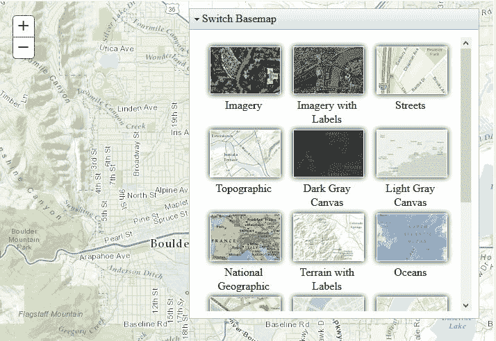

创建`BasemapGallery`时，您可以向构造器提供许多参数，包括显示 ArcGIS 底图、定义一个或多个要包含在图库中的自定义底图以及图库所在地图的参考。

创建`BasemapGallery`小部件后，您需要调用`startup()`方法为用户交互做准备。这是您以编程方式声明的所有小部件所必需的。

If your widget doesn't appear, make sure that you have called its `startup()` method.

```js
var basemapGallery = new BasemapGallery({ 
    showArcGISBasemaps: true, 
    map: map 
}, "basemapGallery"); 
basemapGallery.startup();
```

前面的示例使用来自[arcgis.com](http://www.arcgis.com/features/index.html)的现有底图创建底图图库。

如果要包含自己的底图，必须创建`Basemap`类的实例:

```js
require([ 
  "esri/dijit/Basemap", ...  
], function(Basemap, ... ) { 
var myBasemaps = []; 
var myBasemap = new Basemap({ 
layers: [myLayer1], 
title: "My Layer", 
thumbnailUrl: "images/myThumb.png" 
  }); 
myBasemaps.push(myBasemap); 
  ... 
}); 
```

在前面的代码示例中，创建了一个新的`Basemap`对象，它有一个标题、缩略图和一个包含单个层的数组。这个`Basemap`然后被推进一个数组。然后，您可以将这一组`Basemap`对象添加到`BasemapGallery`的底图属性中:

```js
var basemapGallery = new BasemapGallery({ 
    showArcGISBasemaps: true, 
    basemaps: myBasemaps 
    map: map 
}, "basemapGallery");
basemapGallery.startup();
```

# 底图切换小部件

如果您想为用户提供两个底图的选择以及在它们之间切换的能力，请考虑`BasemapToggle`小部件。

只需以通常的方式为地图指定默认底图，然后将替代底图作为`BasemapToggle`定义的一部分:

```js
require([ 
  "esri/map",  
  "esri/dijit/BasemapToggle", 
  "dojo/domReady!" 
], function( 
  Map, BasemapToggle 
)  { 

  map = new Map("map", { 
    center: [-70.6508, 43.1452], 
    zoom: 16, 
    basemap: "topo" 
  }); 

  var toggle = new BasemapToggle({ 
    map: map, 
    basemap: "satellite" 
  }, "BasemapToggle"); 
  toggle.startup(); 
```

# 书签小部件

`Bookmarks`小部件用于向最终用户显示一组命名的地理范围(书签)。单击小部件中的书签会自动将地图的范围设置为该范围。该小部件允许您添加新书签、删除现有书签和更新书签。书签在 JavaScript 代码中被定义为 **JSON** ( **JavaScript 对象符号**)对象。它们的属性定义了书签的名称、范围和边界坐标。要向您称为`Bookmark.addBookmark()`的小部件添加书签:


```js
require([ 
  "esri/map", "esri/dijit/Bookmarks", "dojo/dom", ...  
], function(Map, Bookmarks, dom, ... ) { 
var map = new Map( ... ); 
var bookmarks = new Bookmarks({ 
map: map,  
bookmarks: bookmarksJSON 
  }, dom.byId('bookmarks')); 
  ... 
}); 
```

在前面的代码示例中，创建了一个新的`Bookmarks`对象。它被附加到地图上，并添加了一个 JSON 格式的书签列表。

下面显示了用于创建书签的 JSON 摘录:

```js
var bookmarkJSON = { 
    first: { 
        "extent": { 
            "xmin": -12975151.579395358, 
            "ymin": 3993919.9969406975, 
            "xmax": -12964144.647322308, 
            "ymax": 4019507.292159126, 
            "spatialReference": { 
                "wkid": 102100, 
                "latestWkid": 3857 
            } 
        }, 
        name": "Palm Springs, CA" 
    }, 
    second: { 
        "extent": { 
            ...   
        }, 
        "name": "Redlands, California" 
    }, 
    third: { 
        "extent": { 
            ...   
        }, 
        "name": "San Diego, CA" 
    }, 
}; 
```

# 打印小部件

`Print`小部件是一个非常受欢迎的工具，它简化了网络应用的地图打印。它使用默认或用户定义的地图布局。此小部件需要使用 ArcGIS Server 10.1 或更高版本的导出网络地图任务:

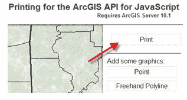

```js
require([ 
  "esri/map", "esri/dijit/Print", "dojo/dom"...  
], function(Map, Print, dom, ... ) { 
var map = new Map( ... ); 
var printer = new Print({ 
     map: map, 
     url:  "http://servicesbeta4.esri.com/arcgis/rest/services/Utilities/ExportWebMap/GPServer
        /Export%20Web%20Map%20Task" 
  }, dom.byId("printButton")); 
  ... 
}); 
```

前面的代码示例创建了一个新的`Print`小部件。`URL`属性用于将小部件指向 ArcGIS Server 导出网络地图任务，并且小部件附加到页面上的 HTML 元素。

# 图层列表小部件

多年来，Esri 一直拒绝将目录控件纳入用于 JavaScript 的 ArcGIS API。前提是他们不想在网络上复制桌面软件的功能，因为用于 JavaScript 应用的 ArcGIS API 的最终用户不熟悉从业者使用的 GIS 工具。

然而，似乎非 GIS 用户同样乐于拥有在地图显示中打开和关闭图层的快速方法，因此 Esri 最终给了我们`LayerList`控制。

# 该练习了

让我们通过实现`LayerList`控件来练习使用小部件。

打开[https://developers . ArcGIS . com/JavaScript/3/Sandbox/Sandbox . html](https://developers.arcgis.com/javascript/3/sandbox/sandbox.html)处的 JavaScript Sandbox 的 ArcGIS API 网页。

保留现有代码不变，但将初始地图坐标更改为经度
`-85.700`和纬度`38.240`，缩放级别为`13`:

```js
    <script> 
      var map; 

      require(["esri/map", "dojo/domReady!"], function(Map) { 
        map = new Map("map", { 
          basemap: "topo",  //For full list ... 
          center: [-85.700, 38.240], // longitude, latitude 
          zoom: 13 
        }); 
      }); 
    </script> 
```

这是美国肯塔基州路易斯维尔市中心的地图。

为了给我们一个图层列表中有一些有趣的子图层的图层，我们将从[http://sampleserver 1 . ArcGIS online . com/ArcGIS/rest/services/Public Safety/Public Safety operationalers/MapServer](http://sampleserver1.arcgisonline.com/ArcGIS/rest/services/PublicSafety/PublicSafetyOperationalLayers/MapServer)添加“公共安全”图层。

我们需要添加这个作为`ArcGISDynamicMapServiceLayer`，因为它不是一个缓存层:

```js
    <script> 
      var map; 

      require(["esri/map", "esri/layers/ArcGISDynamicMapServiceLayer","dojo/domReady!"], function(Map, ArcGISDynamicMapServiceLayer) { 
        map = new Map("map", { 
          basemap: "topo",  //For full list of pre-defined basemaps, navigate to http://arcg.is/1JVo6Wd 
          center: [-85.700, 38.240], // longitude, latitude 
          zoom: 13 
        }); 
        var hazards =  new ArcGISDynamicMapServiceLayer("http://sampleserver1.arcgisonline.com/ArcGIS/rest/services/PublicSafety/PublicSafetyOperationalLayers/MapServer"); 
        map.addLayer(hazards); 
      }); 
    </script>
```

检查一切正常:

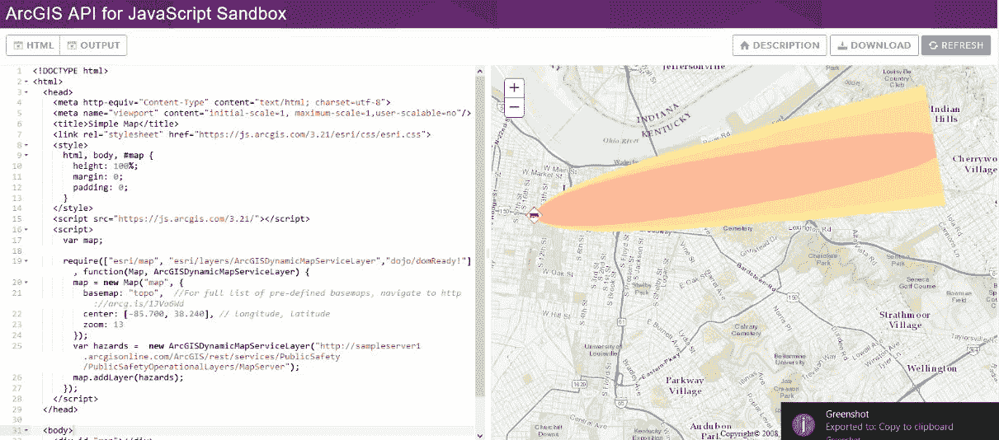

现在，让我们实现我们的`LayerList`小部件。首先，导入必要的模块:

```js

require(["esri/map", "esri/layers/ArcGISDynamicMapServiceLayer", "esri/dijit/LayerList", "dojo/domReady!"],
function(Map, ArcGISDynamicMapServiceLayer, LayerList) { 
        map = new Map("map", { ... 
```

然后引用`LayerList`小部件所需的 CSS，让它知道如何显示。让我们使用`Claro`道场主题:

```js
<link rel="stylesheet" href="https://js.arcgis.com/3.21/dijit/themes/claro/claro.css"> 
    <script src="https://js.arcgis.com/3.21/"></script> 
    <script> 
      var map; 

      require(["esri/map", 
 ... 
    </script> 
  </head> 

  <body class="claro"> 
    <div id="map"></div> 
  </body> 
```

现在我们需要在页面上提供一个`<div>`来放置`LayerList`小部件。将`<body>`的内容替换为:

```js
  <body class="claro"> 
 <div class="container" data-dojo-type="dijit/layout/BorderContainer" 
 data-dojo-props="design:'headline',gutters:false"> 
        <div id="layerListPane" data-dojo-type="dijit/layout/ContentPane"
 data-dojo-props="region:'right'"> 
            <div id="layerList"></div> 
        </div> 
        <div id="map" data-dojo-type="dijit/layout/ContentPane" data-dojo-props="region:'center'"></div> 
    </div> 
  </body> 
```

因为我们在这里使用的是 Dojo 标记，您的 web 浏览器的呈现引擎会忽略它，所以我们必须告诉 Dojo 在页面加载后为我们解析这些元素:

```js
      require(["esri/map",  
               "esri/layers/ArcGISDynamicMapServiceLayer", 
               "esri/layers/ArcGISTiledMapServiceLayer", 
               "esri/dijit/LayerList", 
               "dojo/parser", 
               "dojo/domReady!"], 
        function(Map, ArcGISDynamicMapServiceLayer, ArcGISTiledMapServiceLayer, LayerList, parser) { 

        parser.parse(); 

        map = new Map("map", { 
            basemap: "topo", 
            center: [-85.700, 38.240], // longitude, latitude 
            zoom: 13 
        }); 

```

现在我们需要添加一些 CSS 来确保一切都放在正确的位置。用以下内容替换现有`<style>`标签的内容:

```js
    <style> 
 html, body, .container, #map { 
            height:100%; 
            width:100%; 
            margin:0; 
            padding:0; 
            margin:0; 
            font-family: "Open Sans"; 
        } 
        #map { 
            padding:0; 
        } 
        #layerListPane{ 
            width:25%; 
        } 
    </style> 
```

现在我们已经设置好了一切，我们可以将`LayerList`小部件添加到地图中:

```js
        var layerList = new LayerList({ 
            map: map, 
            layers: [{ 
                layer: hazards, 
                id: "Hazards", 
                showSubLayers: true 
            }], 
            showOpacitySlider: true            
        },"layerList"); 
        layerList.startup(); 
```

在前面的代码中，我们创建了一个`LayerList`小部件的实例，并向它传递了一个选项对象。这里最重要的选项是地图，我们希望显示地图的图层列表和图层。`layers`属性接受表示我们想要包含在列表中的图层的对象数组。我们为每个层设置的属性是:

*   `layer`:图层本身
*   `id`:图层的名称，它应该出现在`LayerList`控件中
*   `showSubLayers`:我们是否希望在列表中将构成该地图服务的各个图层显示为单独的图层

您还会看到我们在`LayerList`控件上指定了`showOpacitySlider`选项。这让我们可以为每个层呈现一个滑块控件，以便用户可以在运行时动态调整层的透明度。

如果我们只想要某些层的透明度，我们可以使用单个层对象中的`showOpacitySlider`选项来覆盖层列表控件的行为。相反，如果我们想要显示或隐藏图层列表中所有图层的子图层，我们可以在控件上而不是在单个图层中使用该属性。

单击沙盒中的**刷新**按钮，确保图层列表显示正确，并且您可以将其展开以查看子图层。请注意，在放大地图之前，有些图层是灰色的。启用和禁用图层，并验证它们是否相应地在地图中显示或移除。然后，切换到不透明度选项卡并调整公共安全地图服务的透明度:

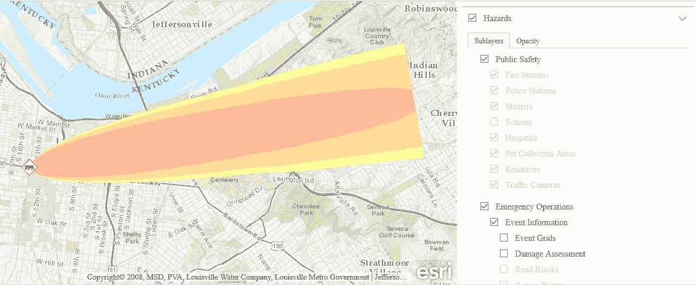

# 搜索小部件

`Search`小部件允许您轻松地将地理编码功能添加到您的应用中。当您在文本框中输入位置的详细信息时，`Search`小部件会尝试在地图上定位它。

默认情况下，`Search`小部件使用 ArcGIS Online World 地理编码服务，但您可以对其进行自定义以使用您自己的源。我们将在[第 8 章](08.html#4HT620-04e5af4e38cd4963a2a647b690867dc7)、*将地址转换为点并将点转换为地址*中更详细地讨论这个小部件。

# 仪表部件

仪表部件在半圆形仪表界面中显示来自`FeatureLayer`或`GraphicsLayer`的数字数据。您可以定义用于驱动仪表的数字数据的属性字段、标签字段、要引用的图层、最大数据值、仪表指示器的标题和颜色等:

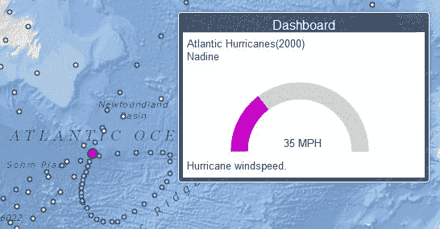

下面的代码演示了如何使用来自`FeatureLayer`(在代码中称为`flHurricanes`)的属性数据创建`Gauge`小部件:

```js
require([ 
  "esri/dijit/Gauge", ...  
], function(Gauge, ... ) { 
var gaugeParams = { 
    "caption": "Hurricane windspeed.", 
    "color": "#c0c", 
    "dataField": "WINDSPEED",  
    "dataFormat": "value", 
    "dataLabelField": "EVENTID", 
    "layer": flHurricanes, 
    "maxDataValue": 120,  
    "noFeatureLabel": "No name", 
    "title": "Atlantic Hurricanes(2000)", 
    "unitLabel": "MPH" 
  }; 
var gauge = new Gauge(gaugeParams, "gaugeDiv"); 
  ... 
}); 
```

许多参数被传递到`Gauge`的构造函数中，包括标题、颜色、数据字段、图层、最大数据值和其他参数。

# 测量部件

`Measurement`小部件提供了三种工具，使最终用户能够测量长度和面积以及获取当前鼠标坐标:

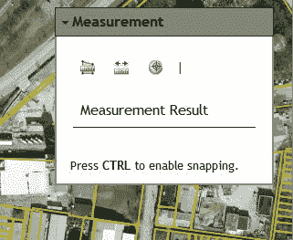

此小部件还允许您更改测量单位:

```js
var measurement = new Measurement({ 
  map: map 
}, dom.byId("measurementDiv")); 
measurement.startup(); 
```

前面的代码示例显示了如何创建`Measurement`小部件的实例并将其添加到应用中。

# 弹出窗口小部件

`Popup`小部件在功能上类似于默认的信息窗口，用于显示关于特征或图形的属性信息。事实上，从 3.4 版本的应用编程接口开始，这个小部件现在是显示属性的默认窗口，而不是`InfoWindow`。但是，它还包含其他功能，例如缩放和突出显示功能、处理多选以及最大化窗口按钮。该接口也可以使用 CSS 进行样式化。可以在`Popup`小部件中显示的内容示例请参考以下截图:

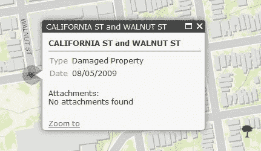

从 3.4 版本开始，弹出窗口小部件支持从右向左的**(**RTL**)方向呈现文本，以支持希伯来语和阿拉伯语等 RTL 语言。如果使用`dir`属性将页面方向设置为 RTL，RTL 支持将自动适用。默认值为**从左至右** ( **LTR** ):**

```js
//define custom popup options 
var popupOptions = { 
  markerSymbol: new SimpleMarkerSymbol("circle", 32, null, new Color([0, 0, 0, 0.25])), 
  marginLeft: "20",  
  marginTop: "20" 
}; 
//create a popup to replace the map's info window 
var popup = new Popup(popupOptions, dojo.create("div")); 

map = new Map("map", { 
  basemap: "topo", 
  center: [-122.448, 37.788], 
  zoom: 17, 
  infoWindow: popup 
}); 

```

在前面的代码示例中，创建了一个 JSON `popupOptions`对象来定义弹出窗口的符号和边距。这个`popupOptions`对象然后被传递到`Popup`对象的构造函数中。最后，`Popup`对象被传递到`infoWindow`参数中，该参数指定将`Popup`对象用作信息窗口。

# 图例小部件

图例小部件显示地图中部分或所有图层的标签和符号。默认情况下，它尊重比例相关性，因此当您在应用中放大或缩小时，图例会更新以反映不同比例范围下的图层可见性。

Legend 小部件支持`ArcGISDynamicMapServiceLayer`、`ArcGISTiledMapServiceLayer`、`FeatureLayer`，以及一些像`CSVLayer`、`WMSLayer`这样的专家图层，我们在本书中不做赘述:


创建`Legend`小部件的新实例时，您可以指定控制图例内容和显示特征的各种参数。`arrangement`参数可用于指定图例在其容器 HTML 中的对齐方式为左对齐或右对齐。`autoUpdate`属性可以设置为`true`或`false`，如果`true`，当地图比例改变或图层从地图中添加或移除时，图例将自动更新图例。`layerInfos`参数用于指定要在图例中使用的图层子集，`respectCurrentMapScale`可以设置为`true`以根据每个图层的比例范围触发自动图例更新。最后，您需要调用`startup()`方法来显示新创建的图例:

```js
var layerInfo = dojo.map(results, function(layer,index){
   return {
     layer: layer.layer,
     title: layer.layer.name
   };
 });
 if(layerInfo.length > 0){
   var legendDijit = new Legend({
     map: map,
     layerInfos: layerInfo
   },"legendDiv");
   legendDijit.startup();
 }
```

前面的代码示例显示了如何创建一个`Legend`小部件并将其添加到应用中。

# 概述地图小部件

`OverviewMap`小部件用于在更大的区域范围内显示主地图的当前范围。每次主地图范围发生变化时，该概览地图都会更新。主地图的范围在概览地图中表示为矩形。也可以拖动此范围矩形来更改主地图的范围。概览地图可以显示在主地图的一角，也可以在不使用时隐藏起来。它也可以放置在主地图窗口之外的`<div>`元素中，或者暂时最大化，以便于访问遥远的感兴趣区域:


`OverviewMap`小部件在对象的构造函数中接受许多可选参数。这些参数允许您控制概览地图相对于主地图的放置位置、概览地图使用的基础图层、范围矩形的填充颜色、最大化按钮的外观以及概览地图的初始可见性:

```js
var overviewMapDijit = new OverviewMap({map:map, visible:true}); 
overviewMapDijit.startup(); 
```

前面的代码示例演示了`OverviewMap`小部件的创建。

# 比例尺小部件

`Scalebar`小部件用于向地图或特定的 HTML 节点添加一个`Scalebar`。`Scalebar`以英制或公制显示单位。从 API 的 3.4 版本开始，如果您将`scalebarUnits`属性设置为`dual`，它可以同时显示英语值和公制值。也可以通过`attachTo`参数控制`Scalebar`位置。默认情况下，`Scalebar`位于地图的左下角:


```js
var scalebar = new esri.dijit.Scalebar({map:map, scalebarUnit:'english'}); 
```

前面的代码示例说明了用英文单位创建`Scalebar`小部件。

# 方向

`Directions`小部件使计算两个或更多输入位置之间的方向变得容易。在下面的截图中显示的结果方向显示了详细的逐个转弯的说明和可选的地图。如果地图与小部件相关联，方向、路线和停靠点将显示在地图上。地图上显示的停靠点是交互式的，因此您可以单击以显示包含停靠点详细信息的弹出窗口，或将停靠点拖到新位置以重新计算路线:

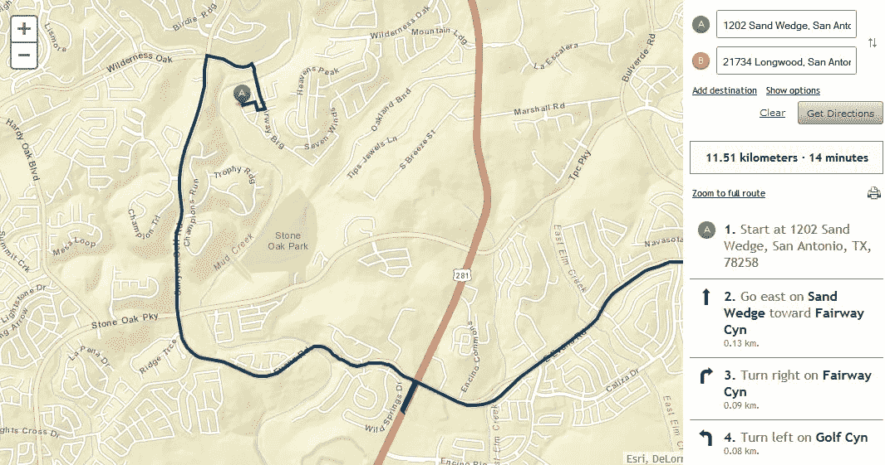

```js
var directions = new Directions({ 
map: map 
},"dir"); 

directions.startup();
```

前面的代码示例显示了`Directions`小部件的创建。我们将在后面的章节中更详细地研究`Directions`小部件。

# histograntimeslider

`HistogramTimeSlider` dijit 为地图上启用时间的图层提供数据的直方图表示。通过用户界面，用户可以暂时控制数据的显示，扩展到`TimeSlider`小部件:

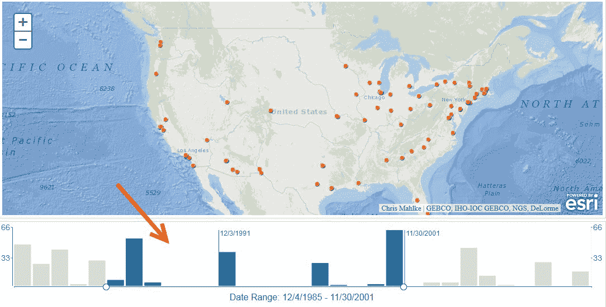

```js
require(["esri/dijit/HistogramTimeSlider", ... ], function(HistogramTimeSlider, ... ){ 
var slider = new HistogramTimeSlider({ 
dateFormat: "DateFormat(selector: 'date', fullYear: true)", 
layers : [ layer ], 
mode: "show_all", 
timeInterval: "esriTimeUnitsYears" 
  }, dojo.byId("histogram")); 

map.setTimeSlider(slider); 
}); 
```

在前面的代码示例中，创建了一个`HistogramTimeSlider`对象，并将其与地图相关联。

# 主页按钮

`HomeButton`小部件只是一个按钮，您可以将其添加到应用中，将地图返回到初始范围:

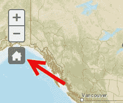

```js
require([ 
      "esri/map",  
"esri/dijit/HomeButton", 
      "dojo/domReady!" 
    ], function( 
      Map, HomeButton 
    )  { 

var map = new Map("map", { 
  center: [-56.049, 38.485], 
  zoom: 3, 
  basemap: "streets" 
}); 

var home = new HomeButton({ 
  map: map 
}, "HomeButton"); 
home.startup(); 

}); 
```

前面的代码示例显示了`HomeButton`小部件的创建。

# 位置按钮

`LocateButton`可以用来查找和缩放到用户的当前位置。这个小部件使用地理定位应用编程接口来查找用户的当前位置。找到位置后，地图会缩放到该位置。小部件提供了允许开发人员定义以下内容的选项:

*   用于查找位置的 HTML5 地理定位位置选项，如`maximumAge`和`timeout`。`timeout`属性定义了可用于确定设备位置的最长时间，而`maximumAge`属性定义了在找到设备的新位置之前的最长时间。
*   能够定义自定义符号，用于在地图上突出显示用户的当前位置。
*   找到位置时要缩放的比例:

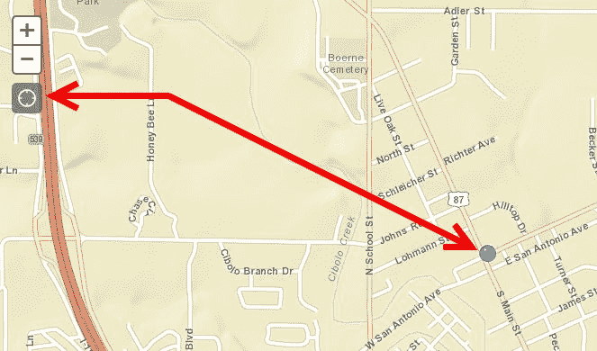

```js
geoLocate = new LocateButton({ 
  map: map, 
  highlightLocation: false 
}, "LocateButton"); 
geoLocate.startup(); 
```

前面的代码示例显示了如何创建`LocateButton`的实例并将其添加到地图中。

Note that, as of version 3.19 of the ArcGIS API for JavaScript, your web app needs to be secure (accessed through HTPS) in order for the `LocateButton` to display. In version 3.18, this only applied to the Chrome web browser. Now it applies to all browsers.

# 时间滑点

`TimeSlider`小部件用于可视化启用时间的图层。`TimeSlider`被配置为具有两个拇指，因此仅显示两个拇指位置的时间范围内的数据。`setThumbIndexes()`方法确定每个拇指的初始位置。在这种情况下，在初始开始时间添加一个拇指，另一个拇指向上放置一次:

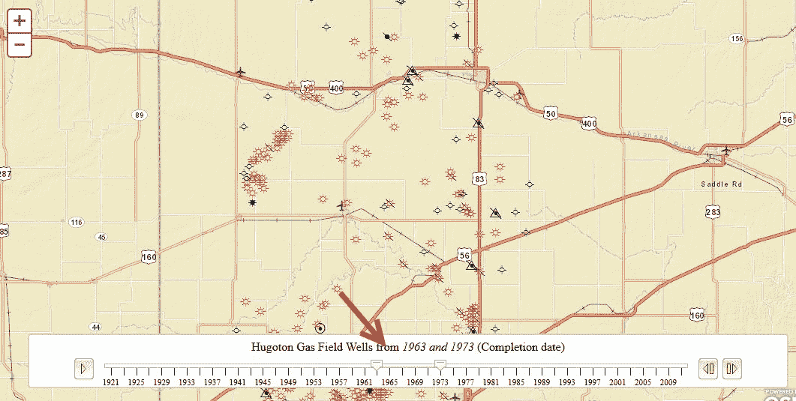

```js
var timeSlider = new TimeSlider({ 
  style: "width: 100%;" 
}, dom.byId("timeSliderDiv")); 
map.setTimeSlider(timeSlider); 

var timeExtent = new TimeExtent(); 
timeExtent.startTime = new Date("1/1/1921 UTC"); 
timeExtent.endTime = new Date("12/31/2009 UTC"); 
timeSlider.setThumbCount(2); 
timeSlider.createTimeStopsByTimeInterval(timeExtent, 2, "esriTimeUnitsYears"); 
timeSlider.setThumbIndexes([0,1]); 
timeSlider.setThumbMovingRate(2000); 
timeSlider.startup

```

前面的代码示例说明了如何创建`TimeSlider`对象的实例并设置各种属性，包括开始和结束时间。

# 图层擦除

`LayerSwipe`提供了一个简单的工具来显示地图顶部的一个或多个图层的一部分。通过使用此小部件显示地图上图层的内容，您可以轻松比较地图中多个图层的内容。该小部件提供水平、垂直和范围查看模式:


```js
varswipeWidget = new LayerSwipe({ 
  type: "vertical", 
  map: map, 
  layers: [swipeLayer] 
}, "swipeDiv"); 
swipeWidget.startup(); 
```

前面的代码示例显示了如何创建`LayerSwipe`的实例并将其添加到地图中。

# 分析小部件

随着针对 JavaScript 的 ArcGIS API 3.7 版本的发布，引入了许多新的分析小部件，随后还添加了其他小部件。分析小部件提供对 ArcGIS 空间分析服务的访问，该服务允许您通过应用编程接口对数据执行常见的空间分析。

请注意，您将需要 ArcGIS.com 订阅才能使用这些小部件，并且您将需要您的帐户凭据，因为分析作业将从您的信用余额中扣除。个人帐户用户无法执行分析任务和托管特征服务。

分析小部件包括:

*   `AnalysisBase`
*   `AggregatePoints`
*   `CreateBuffers`
*   `CreateDriveTimeAreas`
*   `DissolveBoundaries`
*   `EnrichLayer`
*   `ExtractData`
*   `FindHotSpots`
*   `FindNearest`
*   `MergeLayers`
*   `OverlayLayers`
*   `SummarizeNearby`
*   `SummarizeWithin`

请参考帮助文档中的[使用分析小部件](https://developers.arcgis.com/en/javascript/jshelp/intro_analysiswidgets.html)主题，了解更多关于开始使用这些小部件的信息。

# 特征编辑

针对以企业级地理数据库格式存储的数据进行工作时，ArcGIS for JavaScript API 支持简单特征编辑。这意味着您的数据需要存储在由 ArcSDE 管理的企业级地理数据库中。

编辑工作基于*最后一名赢*的概念。例如，如果两个人正在编辑图层中的同一特征，并且都提交了修改，则提交修改的最后一个编辑器将覆盖第一个编辑器所做的任何修改。显然，这在某些情况下可能会造成问题，因此在应用中实现编辑之前，您需要检查数据可能会受到怎样的影响。

编辑的其他特性包括支持域和子类型、模板样式编辑以及编辑独立表格和附件的能力。要使用编辑，你需要使用一个`FeatureService`和一个`FeatureLayer`。编辑请求使用 HTTP Post 请求提交给服务器，在大多数情况下，这需要使用代理。

Web browsers allow applications to request data of, and retrieve data from, the servers on which they are hosted. You can install a proxy page on your web server to get around this limitation, which acts as an intermediary between the browser and remote servers. For more information, see the *Retrieve data from a web server* topic in the help documentation.

编辑支持包括特征编辑(包括简单特征的创建和删除)以及通过移动、剪切、合并或重塑来修改特征。您还可以编辑现有特征，并将图像、文件和注释附加到特征。

# 功能服务

Web 编辑需要特征服务来提供数据的符号系统和特征几何。特征服务只是启用了特征访问功能的地图服务。此功能允许地图服务以网络应用易于使用和更新的方式公开特征几何及其符号。

在构建网络编辑应用之前，您需要创建一个特征服务来公开要编辑的图层。这包括设置地图文档，以及定义一些模板进行编辑。模板允许您为一些常用特征类型预配置符号系统和属性。例如，为了准备编辑河流，您可以为*主要河流*、*次要河流*、*河流*和*支流*配置模板。模板是可选的，但它们使应用的最终用户能够轻松创建通用功能。

地图完成后，您需要将其发布到启用了特征访问功能的 ArcGIS Server。这将为地图服务*和特征服务*创建 REST URLs 或端点。您将使用这些网址来引用应用中的服务。

功能服务可以通过`FeatureLayer`对象在网络应用编程接口中访问，我们在前面的章节中已经介绍过了。特征图层可以使用地图服务或特征服务。但是，当您使用`FeatureLayer`进行编辑时，您必须引用特征服务。

使用编辑功能，您的网络应用首先在用户浏览器中对特征图层进行更改。然后在特征图层上调用`applyEdits()`方法来应用编辑，这将编辑提交到数据库。

# 编辑小部件

用于 JavaScript 的 ArcGIS 应用编程接口提供了小部件，使您可以更轻松地将编辑工作流添加到您的网络应用中。这些小部件包括`Editor`、`TemplatePicker`、`AttributeInspector`和`AttachmentEditor`。`Editor`是默认的编辑界面，包括编辑图层所需的一切，还允许您选择可用工具的数量和类型。`TemplatePicker`显示预先配置的模板，其中包含地图文档中每个图层的符号。这种模板样式编辑允许用户选择一个图层并开始编辑，非常简单直观。`AttributeInspector`提供编辑特征属性的界面，确保有效的数据输入。最后，`AttachmentEditor`将一个可下载文件与一个特性相关联。我们将更详细地研究这些小部件。

# 编辑器小部件

如下图所示的`Editor`小部件提供了 API 附带的默认编辑界面。它结合了其他小部件的功能，提供了编辑图层所需的一切。您可以选择小部件上可用工具的数量和类型。

`Editor`小部件会在您的编辑完成后立即保存它们；例如，一旦你画完一个点。如果您决定不使用`Editor`小部件，那么何时以及多长时间应用编辑取决于您:


下面的代码显示了一个新的`Editor`对象是如何构建的。传递到构造函数中的`params`对象是开发人员如何定义编辑应用将包括的功能。在这种情况下，只定义了必需的选项。所需选项包括地图、要编辑的特征图层和几何服务的 URL:

```js
var settings = { 
  map: map, 
  geometryService: new esri.tasks.GeometryService("http://servery/arcgis/rest/services/Geometry
      /GeometryServer"), 
  layerInfos:[{ 
    featureLayer: myFeatureLayer 
  }]   
}; 
var params = {settings: settings}; 
var myEditingWidget = new Editor(params,'divEdit'); 
myEditingWidget.startup(); 
```

几何服务是 ArcGIS Server 管理员可以启用的地图服务。它不依赖于基础地图文档或其他地理信息系统资源。几何服务允许您通过编写访问服务的代码来执行某些操作，例如测量长度和面积、重新投影几何、维护特征拓扑等。基于网络的编辑需要这些能力中的一些，特别是那些涉及重新塑造特征的能力，并且在幕后使用几何服务来实现它们。

对于大多数编辑应用，您应该利用`Editor`小部件。此小部件允许您执行下列所有功能:

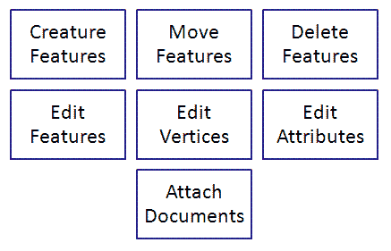

# 模板派克小部件

`TemplatePicker`向用户显示一组预先配置的特征，每个特征代表服务中的一个图层。只需从模板中选择一个符号，然后单击地图添加特征，即可开始编辑。

模板中显示的符号来自您在特征服务的源地图中定义的编辑模板或在应用中定义的符号。`TemplatePicker`也可以作为一个简单的传说:

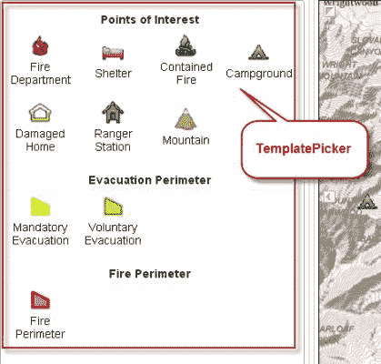

```js
function initEditing(results) {
   var templateLayers = dojo.map(results,function(result){
     return result.layer;
   });

   var templatePicker = new TemplatePicker({
     featureLayers: templateLayers,
     grouping: false,
     rows: 'auto',
     columns: 3
   },'editorDiv');
   templatePicker.startup();

   var layerInfos = dojo.map(results, function(result) {
     return {'featureLayer':result.layer};
   });

   var settings = {
       map: map,
       templatePicker: templatePicker,
       layerInfos:layerInfos
     };
     var params = {settings: settings};
     var editorWidget = new Editor(params);
     editorWidget.startup();
 }
```

在前面的代码示例中，创建了一个新的`TemplatePicker`对象并将其附加到`Editor`小部件上。

# 属性检查器小部件

如下图所示的`AttributeInspector`，提供了一个通过网络编辑特征属性的界面。它还通过将输入与预期的数据类型进行匹配来确保他们输入的数据有效。也支持域。例如，如果将编码值域应用于字段，则允许的值会出现在下拉列表中，从而限制了输入其他值的可能性。如果字段需要日期值，则会出现日历，帮助用户提供有效的日期。

默认情况下，编辑器小部件实例化`AttributeInspector`，但是如果您正在创建自己的编辑工作流，您可能希望直接使用它:

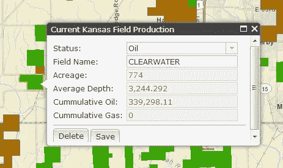

`AttributeInspector`显示图层上所有可用的属性以供编辑。如果要限制可用属性，必须为输入和验证值编写自己的界面:

```js
var layerInfos = [{ 
  'featureLayer': petroFieldsFL, 
  'showAttachments': false, 
  'isEditable': true, 
  'fieldInfos': [ 
  {'fieldName': 'activeprod', 'isEditable':true, 'tooltip': 'Current Status', 'label':'Status:'}, 
  {'fieldName': 'field_name', 'isEditable':true, 'tooltip': 'The name of this oil field', 'label':'Field Name:'}, 
  {'fieldName': 'approxacre', 'isEditable':false,'label':'Acreage:'}, 
  {'fieldName': 'avgdepth', 'isEditable':false, 'label':'Average Depth:'}, 
  {'fieldName': 'cumm_oil', 'isEditable':false, 'label':'Cummulative Oil:'}, 
  {'fieldName': 'cumm_gas', 'isEditable':false, 'label':'Cummulative Gas:'} 
] 
  }]; 

 var attInspector = new AttributeInspector({ 
    layerInfos:layerInfos 
  }, domConstruct.create("div")); 

  //add a save button next to the delete button 
  var saveButton = new Button({ label: "Save", "class": "saveButton"}); 
 domConstruct.place(saveButton.domNode,   attInspector.deleteBtn.domNode, "after"); 

saveButton.on("click", function(){ 
  updateFeature.getLayer().applyEdits(null, [updateFeature], null);          
}); 

attInspector.on("attribute-change", function(evt) { 
  //store the updates to apply when the save button is clicked  
  updateFeature.attributes[evt.fieldName] = evt.fieldValue; 
}); 

attInspector.on("next", function(evt) { 
  updateFeature = evt.feature; 
  console.log("Next " + updateFeature.attributes.objectid); 
}); 

attInspector.on("delete", function(evt){ 
               evt.feature.getLayer().applyEdits(null,null,[feature]); 
  map.infoWindow.hide(); 
}); 

map.infoWindow.setContent(attInspector.domNode); 
map.infoWindow.resize(350, 240); 

```

在前面的代码示例中，创建了一个`AttributeInspector`小部件并将其添加到应用中。此外，还设置了多个事件处理程序，包括`attribute-change`、`next`和`delete`，以处理各种属性更改。

# 附件编辑器小部件

在某些情况下，您可能希望将可下载文件与功能相关联。例如，在维护应用中，您可能希望用户能够单击代表水表的功能，并看到指向水表图像的链接。在 ArcGIS 网络应用编程接口中，类似这样的相关可下载文件被称为特征附件。

下面截图中看到的`AttachmentEditor`，是一个帮助用户上传和查看功能附件的小部件。`AttachmentEditor`包括当前附件列表(带移除按钮)，以及可用于上传更多附件的浏览按钮。`AttachmentEditor`在信息窗口中运行良好，但可以放在页面的其他地方:

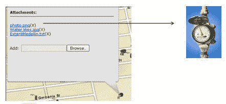

要使用特征附件，必须在源特征类上启用附件。您可以在 ArcCatalog 或 ArcGIS Pro 的目录窗口中为`feature`类启用附件。如果`Editor`小部件检测到附件已启用，它将包含一个`AttachmentEditor`。

```js
   var map;

       require([
         "esri/map",
         "esri/layers/FeatureLayer",
         "esri/dijit/editing/AttachmentEditor",
         "esri/config",

         "dojo/parser", "dojo/dom",

         "dijit/layout/BorderContainer", "dijit/layout/ContentPane", "dojo/domReady!"
       ], function(
         Map, FeatureLayer, AttachmentEditor, esriConfig,
         parser, dom
       ) {
         parser.parse();
         // a proxy page is required to upload attachments
         // refer to "Using the Proxy Page" for more information:  https://developers.arcgis.com
                                                                     /en/javascript/jshelp/ags_proxy.html
         esriConfig.defaults.io.proxyUrl = "/proxy";

         map = new Map("map", { 
           basemap: "streets",
           center: [-122.427, 37.769],
           zoom: 17
         });
         map.on("load", mapLoaded);

         function mapLoaded() {
           var featureLayer = new FeatureLayer("http://sampleserver3.arcgisonline.com/ArcGIS/rest/services
                 /SanFrancisco/311Incidents/FeatureServer/0",{
             mode: FeatureLayer.MODE_ONDEMAND
           });

           map.infoWindow.setContent("<div id='content' style='width:100%'></div>");
           map.infoWindow.resize(350,200);
 var attachmentEditor = new AttachmentEditor({}, dom.byId("content"));
 attachmentEditor.startup();

           featureLayer.on("click", function(evt) {
             var objectId = evt.graphic.attributes[featureLayer.objectIdField];
             map.infoWindow.setTitle(objectId);
 attachmentEditor.showAttachments(evt.graphic,featureLayer);
             map.infoWindow.show(evt.screenPoint, map.getInfoWindowAnchor(evt.screenPoint));
           });
           map.addLayer(featureLayer);
         }
       });
```

前面的代码展示了如何创建`AttachmentEditor`并将其添加到应用中。

# 编辑工具栏

有时您可能不想使用`Editor`小部件提供的默认编辑工作流程。您可能希望*创建自己的*，如下图所示:


例如，您可能不希望立即应用更改，这是默认工作流中发生的情况。相反，您可以要求用户在提交之前确认更改。

在这些情况下，可以使用`Edit`工具栏。`Edit`工具栏只是一个 JavaScript 助手类，是 API 的一部分。它有助于放置和移动顶点和图形。这个工具栏类似于我们在本书前面讨论过的`Navigation`和`Draw`工具栏。它提供了编辑器小部件的所有底层功能，但是将编写界面的责任交给了开发人员。

# 摘要

小部件和工具栏提供了一种无需编写大量代码就能向应用添加预构建功能的简单方法。在 API 的各个版本中，可用小部件的种类越来越多，预计在未来的版本中将会有许多新的小部件可用。工具栏虽然类似于小部件，但它是帮助器类，提供向应用添加导航、绘图功能和编辑工具所需的功能。然而，由您来定义工具的外观以及您的用户如何与它们交互。

在接下来的章节中，我们将更详细地介绍特定的小部件。

在下一章中，您将学习如何使用`Query`和`QueryTask`类创建空间和属性查询，并使用小部件显示属性数据。**