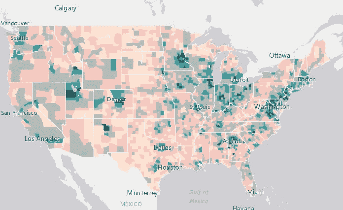
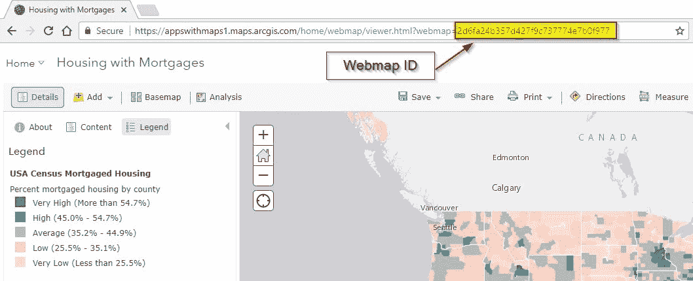

# 与 ArcGIS Online 的集成

ArcGIS Online 是一个用于处理地图和其他类型地理信息的网站。在这个网站上，您可以找到构建和共享地图的应用程序。您还可以找到有用的底图、数据、应用程序和工具，以及您可以加入的社区。对于应用程序开发人员来说，ArcGIS Online 真正令人兴奋的地方在于，您可以将在该平台上创建的内容集成到您的用于 JavaScript 应用程序的 ArcGIS API 中。在这一章中，你将看到如何去做这件事。

在本章中，我们将涵盖以下主题:

*   通过使用`webmap` ID 将 ArcGIS Online 地图添加到您的应用程序中
*   使用 JSON 向应用程序添加 ArcGIS Online 地图
*   使用 ArcGIS Online 练习时间

# 使用网络地图标识将 ArcGIS Online 地图添加到您的应用程序中

用于 JavaScript 的 ArcGIS Server 应用编程接口包括两种使用 ArcGIS Online 地图的实用方法。这两种方法都可以在`esri/arcgis/utils`模块中找到，通常别名为`arcgisUtils`。

要从 ArcGIS Online 资源创建地图，可以使用`arcgisUtils.createMap()`方法。在调用`createMap()`之前，您需要告诉 JavaScript 的 ArcGIS API 您希望在应用程序中使用哪个 ArcGIS Online 地图。

ArcGIS Online 中的每个地图都有唯一的标识。如果您想在用于 JavaScript 应用程序的 ArcGIS 应用编程接口中使用该地图，这个名为`webmap,`的唯一 ID 是至关重要的信息。要获取地图的`webmap`标识，只需在 ArcGIS Online 中打开地图。浏览器地址栏中的网址将包含地图的`webmap`标识。在本章的练习中，您将看到如何访问这个 ID。

一旦您获得了想要集成到自定义 JavaScript API 应用程序中的 ArcGIS Online 地图的`webmap` ID，您需要调用`getItem()`方法，传入`webmap` ID。`getItem()`方法返回一个`dojo/Deferred`对象。`Deferred`是专门为可能无法立即完成的任务构建的对象。它允许您定义成功和失败回调函数，以便在任务完成时将控制权返回给应用程序。

在下面的例子中，`getItem()`方法的成功完成将一个`itemInfo`对象传递给成功回调函数。此`itemInfo`对象包含网络地图的相关信息，该信息将用于在您的应用程序中从 ArcGIS Online 创建地图。下面的代码示例说明了这一点:

```js
var agoId = "fc160a96a98d4052ae191cc486961b61"; 
var itemDeferred = arcgisUtils.getItem(agoId); 

itemDeferred.addCallback(function(itemInfo) { 
var mapDeferred = arcgisUtils.createMap(itemInfo, "map", { 
mapOptions: { 
   slider: true 
   }, 
   geometryServiceURL: "http://sampleserver3.arcgisonline.com/ArcGIS/rest/services/Geometry/GeometryServer" 
  }); 
mapDeferred.addCallback(function(response) { 
map = response.map; 
   map.on("resize", resizeMap); 
  }); 
mapDeferred.addErrback(function(error) { 
console.log("Map creation failed: ", json.stringify(error)); 
  }); 
itemDeferred.addErrback(function(error) { 
console.log("getItem failed: ", json.stringify(error)); 
  }); 
} 
```

我们将把整个功能分为两个独立的部分。现在，我们将检查`getItem()`方法的使用，以及设置回调函数的成败。这些代码行在前面的代码示例中突出显示。在第一行代码中，我们创建了一个名为`agoId`的变量，并为它分配了我们想要使用的`webmap`标识。接下来，我们调用`getItem()`，传入`agoId`变量。这将创建一个新的`dojo/Deferred`对象，我们将其分配给一个名为`itemDeferred`的变量，并使用其`addCallback()`方法创建一个成功回调函数，`addErrback()`创建一个错误回调函数。

成功函数被传递给一个对象(在以下示例中为`itemInfo`)，该对象包含关于 ArcGIS Online `webmap`的信息，我们将使用该信息在应用程序中创建地图。如果出现错误情况，将调用错误回调函数。

如果`getMap()`返回关于`webmap`的良好信息，我们可以使用`createMap(),`将其添加到我们的应用程序中，如下代码所示:

```js
var agoId = "fc160a96a98d4052ae191cc486961b61"; 
var itemDeferred = arcgisUtils.getItem(agoId); 

itemDeferred.addCallback(function(itemInfo) { 
var mapDeferred = arcgisUtils.createMap(itemInfo, "map", { 
mapOptions: { 
   slider: true 
   }, 
   geometryServiceURL: "http://sampleserver3.arcgisonline.com/ArcGIS/rest/services/Geometry/GeometryServer" 
  }); 
mapDeferred.addCallback(function(response) { 
map = response.map; 
   map.on("resize", resizeMap); 
  }); 
mapDeferred.addErrback(function(error) { 
console.log("Map creation failed: ", json.stringify(error)); 
  }); 
itemDeferred.addErrback(function(error) { 
console.log("getItem failed: ", json.stringify(error)); 
  }); 
} 
```

`createMap()`方法用于从 ArcGIS Online 实际创建地图。这个方法采用一个从对 getItem()的成功调用中返回的`itemInfo`实例，或者您可以简单地提供`webmap`标识。与使用 ArcGIS Server JavaScript API 创建的任何地图一样，您还需要提供对`<div>`容器的引用，该容器将保存地图以及您想要提供的任何可选地图选项。就像我们在上一张幻灯片中检查的`getItem()`方法一样，`createMap()`也返回一个`dojo/Deferred`对象，您可以用它来分配成功和错误回调函数。成功函数接受一个包含`map`属性的`response`对象，我们用它来检索实际的地图。当出现阻止创建地图的错误时，错误函数会运行。

# 使用 JSON 向您的应用程序添加 ArcGIS Online 地图

使用网络地图标识创建地图的另一种方法是使用表示网络地图的 JSON 对象创建地图。这在应用程序无法访问 ArcGIS Online 平台的情况下非常有用:

```js
var webmap = {}; 
webmap.item = { 
  "title":"Census Map of USA", 
  "snippet": "Detailed description of data", 
  "extent": [[-139.4916, 10.7191],[-52.392, 59.5199]] 
}; 
```

接下来，指定构成地图的图层。在此片段中，添加了 ArcGIS Online 的世界地形底图，以及向地图添加其他信息(如边界、城市、水景、地标和道路)的叠加图层。添加了一个显示美国人口普查的操作层:

```js
webmap.itemData = { 
"operationalLayers": [{ 
  "url": " http://sampleserver1.arcgisonline.com/ArcGIS/rest/services/Demoimg/ESRI_Census_USA/MapServer", 
  "visibility": true, 
  "opacity": 0.75, 
  "title": "US Census Map", 
  "itemId": "204d94c9b1374de9a21574c9efa31164" 
}], 
"baseMap": { 
  "baseMapLayers": [{ 
   "opacity": 1, 
   "visibility": true, 
   "url": "http://services.arcgisonline.com/ArcGIS/rest/services/World_Terrain_Base/MapServer" 
   },{ 
   "isReference": true, 
   "opacity": 1, 
   "visibility": true, 
   "url": "http://services.arcgisonline.com/ArcGIS/rest/services/Reference/World_Reference_Overlay/MapServer" 
   }], 
  "title": "World_Terrain_Base" 
}, 
"version": "1.1" 
}; 
```

定义网络地图后，使用`createMap()`根据定义构建地图:

```js
var mapDeferred = arcgisUtils.createMap(webmap, "map", { 
mapOptions: { 
slider: true 
  } 
}); 
```

# 使用 ArcGIS Online 练习时间

在本练习中，您将学习如何将 ArcGIS Online 地图集成到应用程序中。这个简单的应用程序将显示一个公共地图，按州、县、地区和街区组显示美国有抵押或贷款的已占住房的百分比。

较深的颜色代表较高的借用比例:



在开始编写应用程序之前，让我们浏览一下 ArcGIS Online，了解如何查找地图并检索其唯一标识符:

1.  访问[http://www.arcgis.com/features/free-trial.html](http://www.arcgis.com/features/free-trial.html)，注册 21 天免费试用 ArcGIS Online。
2.  填写贵组织的详细信息，然后进入贵组织的主页。点击页面顶部的图库链接。
3.  在图库页面上，单击 Esri 特色内容选项卡。
4.  在 Esri 特色内容选项卡中，单击页面左侧地图下的人口统计和生活方式链接。
5.  用 Mortages 地图定位*房屋。将鼠标移动到缩略图上，会出现一个弹出窗口，显示更多信息和打开地图的选项。单击“打开”按钮:*


6.  地图将在地图查看器中打开。查看浏览器的地址栏，识别 URL 中代表**网络地图 ID** 的部分，如下图截图所示。记下身份证，因为你会需要它:



7.  打开[https://developers . ArcGIS . com/JavaScript/3/Sandbox/Sandbox . html](https://developers.arcgis.com/javascript/3/sandbox/sandbox.html)处的 JavaScript Sandbox。

8.  从我在以下代码中突出显示的`<script>`标签中删除 JavaScript 内容:

```js
<script> 
  var map; 

  require(["esri/map", "dojo/domReady!"], function(Map) { 
    map = new Map("map", { 
      basemap: "topo",  //For full list of pre-defined ... 
      center: [-122.45, 37.75], // longitude, latitude 
      zoom: 13 
    }); 
  }); 
</script> 
```

9.  为我们将在本练习中使用的对象添加以下引用:

```js
<script> 
require([ 
        "dojo/parser", 
        "dojo/ready", 
        "dojo/dom", 
        "esri/map",  
        "esri/arcgis/utils", 
        "esri/dijit/Scalebar", 
        "dojo/domReady!" 
      ], function(            parser,ready,dom,Map,arcgisUtils,Scalebar) { 
    }); 
</script>
```

10.  在这个简单的例子中，我们将把`webmap` ID 硬编码到应用程序中。在`require()`函数中，创建一个名为`agoId`的新变量，并为其分配您从 ArcGIS Online 地图查看器中获得的`webmap` ID:

```js
require([ 
"dojo/parser", 
"dojo/ready", 
"dojo/dom", 
"esri/map", 
"esri/arcgis/utils", 
"esri/dijit/Scalebar", 
"dojo/domReady!" 
], function (parser, ready, dom, Map, arcgisUtils, Scalebar) { 
    var agoId = "2d6fa24b357d427f9c737774e7b0f977"; 
}); 
```

本练习的最后两个步骤涉及`arcgisUtils.getItem()`和`arcgisUtils.createMap()`方法。这两种方法都返回所谓的`dojo/Deferred`对象。你需要对`Deferred`对象有一个基本的了解，否则代码就没什么意义了。

As a reminder, `dojo/Deferred` helps you code operations that might take a while to execute. It allows you to define success and failure callback functions that will execute when the task completes. You define the success callback by using `Deferred.addCallback()` and the failure callback using `Deferred.errCallback()`. In the case of `getItem()`, a successful completion will pass in an `itemInfo` object to the success function. This `itemInfo` object will be used to create the map from ArcGIS Online inside your custom application. A failure to complete for some reason will result in the generation of an error being passed to the `Deferred.addErrback()` function.

11.  将以下代码块添加到您的应用程序中，然后我们将讨论:

```js
require([ 
    "dojo/parser", 
    "dojo/ready", 
    "dojo/dom", 
    "esri/map", 
    "esri/arcgis/utils", 
    "esri/dijit/Scalebar", 
    "dojo/domReady!" 
], function (parser, ready, dom, Map, arcgisUtils, Scalebar) { 

    var agoId = "2d6fa24b357d427f9c737774e7b0f977"; 
    var itemDeferred = arcgisUtils.getItem(agoId); 

    itemDeferred.addCallback(function (itemInfo) { 
         // empty handler 
    }); 
    itemDeferred.addErrback(function (error) { 
        console.log("getItem failed: ",                                             error); 
    }); 

}); 
```

在第一行新代码中，我们调用`getItem()`函数，传递引用 ArcGIS Online 中感兴趣地图的`agoId`变量。该方法返回一个存储在名为`itemDeferred`的变量中的`Dojo/Deferred`对象。

`getItem()`功能获取 ArcGIS Online 项目的详细信息(`webmap`)。传递回回调的对象是具有以下规范的通用对象:

```js
{ 
   item: <Object>, 
   itemData: <Object> 
} 
```

假设对`getItem()`的调用是成功的，那么这个通用项目对象被传递到我们的成功处理程序中，我们在`addCallback()`函数中定义成功处理程序。在回调函数中，我们调用`createMap()`方法，传入`itemInfo`对象、对地图容器的引用以及定义地图功能的任何可选参数。在这种情况下，地图参数包括导航滑块和导航按钮。`createMap()`方法然后返回存储在`mapDeferred`变量中的另一个`dojo/Deferred`对象。在下一步中，您将定义处理这个`Deferred`对象的代码块。

12.  返回到`mapDeferred.addCallback()`函数的对象采用您在以下代码中看到的形式:

```js
{ 
   Map: <esri/Map>, 
   itemInfo: { 
         item: <Object>, 
         itemData: <Object> 
   } 
} 
```

13.  添加下面的代码来处理返回的信息:

```js
require([ 
    "dojo/parser", 
    "dojo/ready", 
    "dojo/dom", 
    "esri/map", 
    "esri/arcgis/utils", 
    "esri/dijit/Scalebar", 
    "dojo/domReady!" 
], function (parser, ready, dom, Map, arcgisUtils, Scalebar) { 

    var agoId = "2d6fa24b357d427f9c737774e7b0f977"; 
    var itemDeferred = arcgisUtils.getItem(agoId); 

    itemDeferred.addCallback(function (itemInfo) { 
        var mapDeferred =  
         arcgisUtils.createMap(itemInfo, "mapDiv", { 
            mapOptions: { 
                slider: true, 
                nav: true 
            } 
        }); 
        mapDeferred.addCallback(function (response) { 
            map = response.map; 
        }); 
        mapDeferred.addErrback(function (error) { 
            console.log("Map creation failed: ",                              error); 
        }); 

    }); 
    itemDeferred.addErrback(function (error) { 
        console.log("getItem failed: ",                                             error); 
    }); 

}); 
```

成功函数(在`mapDeferred.addCallback`中定义)从响应中提取地图，并将其分配给地图容器。

14.  您可能需要查看示例代码的`Chapter12`文件夹中的解决方案文件(`argisonline`)，以验证您的代码是否已正确编写。

15.  单击运行按钮。你应该会看到下面的地图。如果没有，您可能需要重新检查代码的准确性:


# 摘要

作为创建和共享地图和其他资源的平台，ArcGIS Online 正变得越来越重要。作为开发人员，您可以将这些地图集成到您的自定义应用程序中。每个地图都有一个唯一的标识符，您可以使用它来引用地图，`esri/utils`模块为您提供了对方法的访问，您可以调用这些方法来检索地图的详细信息并创建地图的实例。因为从 ArcGIS Online 返回这些地图可能需要一些时间，`getItem()`和`createMap()`方法返回`dojo/Deferred`对象，这些对象提供了成功和失败的回调函数。一旦从 ArcGIS Online 成功获取地图，它们就可以像任何其他地图服务一样在您的应用程序中使用。在下一章中，您将学习如何使用 ArcGIS for JavaScript 应用编程接口来创建移动应用程序。