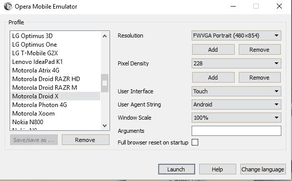
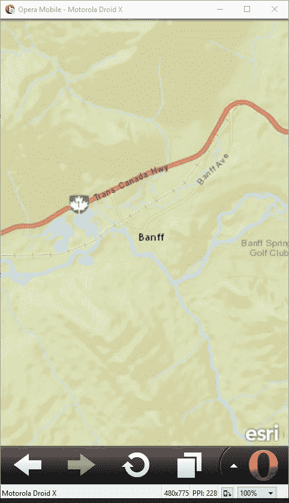
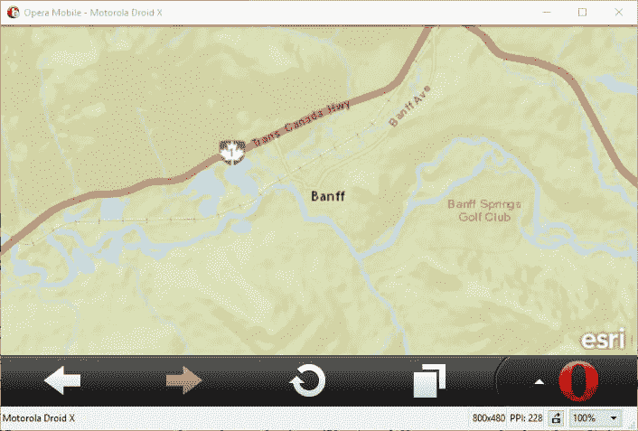
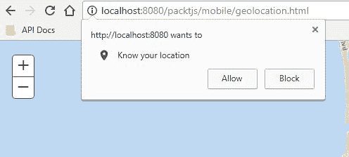
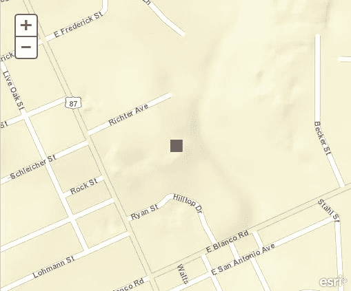

# 创建移动应用程序

用于 JavaScript 的 ArcGIS Server 应用编程接口为移动平台提供支持。目前支持 iOS、安卓和黑莓操作系统。该 API 与**道场移动**集成。在本章中，您将了解 API 的紧凑构建，这使得网络地图应用程序在移动设备上成为可能。您也可以使用其他流行的框架，如 **jQuery Mobile** 、 **Appcelerator** 、 **PhoneGap** 进行开发，以及相关工具，如 Bootstrap 进行响应性网页设计，但我们将在本章重点介绍 Dojo Mobile。

请记住，这些框架与用于 iOS 或安卓的 ArcGIS 应用编程接口不同，后者是您用来构建可通过应用商店获得的本机应用程序的工具。JavaScript API 应用程序通过移动设备的浏览器呈现。

我们还将讨论**地理定位应用编程接口**的主题，以及如何将其集成到您的 ArcGIS Server 应用程序中。地理定位应用编程接口是 HTML5 的一部分，用于获取移动设备的位置。

在本章中，我们将涵盖以下主题:

*   应用编程接口的紧凑构建
*   设置视口比例
*   用紧凑的结构练习时间
*   集成地理定位应用编程接口
*   使用地理定位应用编程接口练习时间

# 应用编程接口的紧凑构建

用于 JavaScript 的 ArcGIS 应用编程接口具有紧凑的构建，可用于限制应用编程接口的占用空间，从而加快移动设备的下载速度。

紧凑构建只加载应用程序所需的核心 Dojo 对象。例如，如果您不需要`Calendar` dijit，那么它不会被加载。如果您需要使用未作为紧凑构建的一部分下载的代码模块，那么您必须使用`require()`功能来加载您想要使用的特定模块。

使用紧凑版本的应用编程接口就像在引用应用编程接口的末尾添加单词`compact`一样简单。您可以在下面的示例中看到这一点。在移动应用程序中使用应用编程接口与您学习的创建网络应用程序的技术没有任何不同。但是，您需要学习一些新技术来创建适合移动应用程序的用户界面。有很多好的 JavaScript 移动框架可以完成这个任务，包括 Dojo Mobile 和 jQuery Mobile。移动框架对 web 内容进行样式化，使其看起来像一个本地移动应用程序。Safari 浏览器看起来像 iPhone 应用，安卓浏览器看起来像安卓应用。创建移动用户界面超出了本文的范围，但是在印刷和在线方面有很多好的资源。

Although the compact builds result in a smaller initial footprint and are a great choice during development, you should ideally create an optimized build of the API when you are ready to deploy. This is a build that contains only the modules you require, and none that you do not. You can create such a build by using the Web Optimizer, but in order to do so you need either an ArcGIS Online account or ArcGIS for Developer account. You can find out more about the Web Optimizer at [https://developers.arcgis.com/javascript/3/jshelp/inside_web_optimizer.html](https://developers.arcgis.com/javascript/3/jshelp/inside_web_optimizer.html).

# 设置视口比例

您将希望使用`viewport` `<meta>`标签为您的应用程序设置一些初始显示特征。`<meta>`标签应该包含在您网页的`<head>`部分。推荐`initial-scale`的`1.0`值，该值将填充屏幕的整个视口。数值可在`0`和`1.0`之间设定。如果不设置宽度，在纵向模式下手机浏览器会使用`device-width`，如果不设置高度，在横向模式下浏览器会使用`device-height`:

```js
    <meta name="viewport" content="width=device-width, initial-scale=1" maximum-   
    scale=1.0 user-scalable=0> 
```

# 用紧凑的结构练习时间

在本练习中，您将构建最基本的移动地图应用程序。我们将简单地使用 ArcGIS Server 应用编程接口的紧凑构建来创建一个以加拿大阿尔伯塔省班夫镇为中心的地图应用程序。该应用程序除了缩放和平移之外，将无法执行任何操作。除了地图之外，不会有任何类型的用户界面。我们的目标只是说明一个用 JavaScript API 构建的移动应用程序的基本结构。

这个练习和你在前面几章中做的练习有一点不同。您不会将 ArcGIS 应用编程接口用于 JavaScript 沙盒。相反，您将在文本编辑器中编写代码(我推荐记事本++)，并使用移动模拟器进行测试。本练习还要求您能够访问 web 服务器:

1.  在开始本练习之前，您需要确保能够访问网络服务器。如果你没有网络服务器或者你的电脑上没有安装网络服务器，你可以从[http://httpd.apache.org/download.cgi](http://httpd.apache.org/download.cgi)下载开源的 Apache 网络服务器。微软 IIS 是 Windows 机器上另一个常用的网络服务器，还有很多其他的你也可以使用。出于本练习的目的，我将假设您使用的是 Apache 网络服务器。
2.  安装在本地计算机上的网络服务器将通过一个网址被称为`http://localhost`。如果您在 Windows 平台上安装了 Apache，这将指向 Apache 安装目录下的`htdocs`文件夹。IIS 通常使用`C:\inetpub\wwwroot`来代替。其他 web 服务器和不同的操作系统可能会将您的 web 文件放在不同的位置，您需要查阅文档。在后续步骤中，我们将此位置称为文档根目录。

3.  在示例代码的`Chapter13`文件夹中，您会找到一个名为`mobile_map.html`的文件。我已经预写了一些您将在这一步中使用的代码，这样您就可以专注于添加对紧凑构建的引用以及与移动开发相关的一些其他项目。使用此文件作为起点，并将其复制到文档根目录。
4.  在你喜欢的文本编辑器中打开`mobile_map.html`。
5.  通过向应用程序添加以下突出显示的代码行来引用 API 的紧凑版本:

```js
        <head> 
            <meta http-equiv="Content-Type" content="text/html; 
            charset=utf-8"> 
            <!-- Add viewport --> 
            <title>Mobile Map</title> 
            <link rel="stylesheet" 
 href="https://js.arcgis.com/3.21/esri/css/esri.css"> 

            <!-- Add reference to compact build of API --> 
            <script src="https://js.arcgis.com/3.21compact/"></script> 
            <script> 
                // load modules and instantiate the map 
            </script> 
        </head> 
```

6.  您将希望使用`viewport` `<meta>`标签属性为您的应用程序设置一些初始显示特征。使用`1.0`值作为初始比例来填充屏幕的整个视口，并使其成为最大值。不要让用户调整应用程序的大小。您可以通过在`<head>`标签顶部附近添加以下标记来实现这一切:

```js
        <meta name="viewport" content="width=device-width, initial-
        scale=1.0, maximum-
        scale=1.0, user-scalable=no"> 
```

7.  在`<script>`标签中，添加`require()`函数，如下面的代码片段所示，以导入所需的模块:

```js
        <script> 
            require([ 
                "esri/map", 
                "dojox/mobile", 
                "dojo/domReady!" 
            ], 

                function (Map, mobile) { 

                }); 
        </script> 
```

8.  与使用 JavaScript API 构建的传统网络地图应用程序一样，您将需要一个`<div>`标签来保存移动应用程序的地图。这已经为您创建了。在移动应用程序中，您将需要设置地图的样式，以便它占据移动应用程序的整个视口。这在页面顶部的`<style>`标签中完成:

```js
        <head> 
            <meta http-equiv="Content-Type" content="text/html; 
            charset=utf-8"> 
            <!-- Add viewport --> 
            <title>Mobile Map</title> 
            <link rel="stylesheet" 
            href="https://js.arcgis.com/3.21/esri/css/esri.css"> 
            <style> 
                html, 
                body, 
                #map { 
                    height: 100%; 
                    margin: 0; 
                    padding: 0; 
                } 
            </style> 
```

9.  在`require()`功能的顶部添加一行代码，隐藏移动设备的浏览器地址栏。开发移动应用程序时，您希望最大限度地利用可用的屏幕空间。您可以使用道场移动`hideAddressBar()`功能来完成此操作:

```js
        function (Map, mobile) { 

            mobile.hideAddressBar(); 

        });
```

10.  然后，实例化映射，如下面的代码片段所示:

```js
        function (Map, mobile) { 

            mobile.hideAddressBar(); 

            var map = new esri.Map("map", { 
                basemap: "streets", 
                center: [-115.570, 51.178], 
                zoom: 12, 
                slider: false 
            }); 

        }); 
```

11.  移动设备只需转动设备，即可在标准或横向模式下显示其视窗。当这些事件发生时，您的应用程序需要处理它们。向`<body>`标签添加`onorientationchange`事件。`onorienationchange`事件引用了一个名为`orientationChanged()`的 JavaScript 函数，我们还没有定义它。我们将在下一步中这样做:

```js
        <body onorientationchange="orientationChanged()"> 
            <div id="map"></div> 
        </body> 
```

12.  创建`orientationChanged()` JavaScript 函数，如下面的代码片段所示:

```js
        require([ 
            "esri/map", 
            "dojox/mobile", 
            "dojo/domReady!" 
        ], 

        function (Map, mobile) { 

            mobile.hideAddressBar(); 

            var map = new esri.Map("map", { 
                basemap: "streets", 
                center: [-115.570, 51.178], 
                zoom: 12, 
                slider: false 
            }); 

            function orientationChanged() { 
                if (map) { 
                    map.reposition(); 
                    map.resize(); 
                } 
            } 

        }); 
```

13.  保存文件。
14.  你现在需要一个模拟器。模拟器允许您查看应用程序在移动设备上的外观和行为。有很多选择，但为了简单起见，我推荐 **Opera 手机经典模拟器**。访问[https://www.opera.com/developer/mobile-emulator](https://www.opera.com/developer/mobile-emulator)并为您的操作系统下载合适的安装程序。安装模拟器并启动它。
15.  从应用程序左侧的列表中选择一个预配置的设备(如 iPhone 6)，然后单击启动。如果您想在特定设备上测试应用程序并了解所需的详细信息，可以添加新设备:



16.  Ensure that your file exists in the document root of your web server and that your web server is running. The file can then be accessed through a web browser using the URL `http://localhost:<port_number>/mobile_map.html`. Type the URL into the Opera Mobile browser's address bar and hit *Enter*. You should see a map appear as shown in the following screenshot:

    

17.  可以使用鼠标滚轮和 *Ctrl* 键进行放大和缩小。此外，请记住，用于 JavaScript 的 ArcGIS Server 应用编程接口也支持手势，因此您也可以使用捏手势来放大和缩小。但是，请记住，这在模拟器中不起作用。我已经选择从这个应用程序中移除缩放滑块，但是您可以在地图选项对象中重新启用它。
18.  关闭模拟应用程序，回到 Opera 移动模拟器，在分辨率下选择横向模式。按“启动”，然后再次在浏览器地址栏中输入托管应用程序的网址。验证您的地图在横向模式下显示正确:



这是一个地图应用程序所能做到的最简单的事情，但希望它能说明构建移动地图应用程序的基本特征。

# 集成地理定位应用编程接口

您可以在 ArcGIS Server 应用程序中使用 HTML5 地理定位应用编程接口来获取移动设备的位置。您也可以使用地理定位应用编程接口从标准的网络应用程序中获取位置，但这并不那么准确，因为它使用的是 IP 地址，而不是全球定位系统或蜂窝塔三角测量。

此应用编程接口具有内置安全性，在使用此功能之前，需要最终用户的明确许可。使用地理定位的移动和网络应用程序都会提示用户。该提示将类似于以下屏幕截图:


一旦获得用户的许可，使用应用编程接口检索位置数据就非常简单了。

`Geolocation.getCurrentPosition()`方法返回移动设备的当前位置。`Geolocation.watchPosition()`方法持续监控设备位置，每次位置改变时触发回调方法。因此，如果您的应用程序需要能够随着时间的推移跟踪设备的位置，那么您将希望使用`watchPosition()`而不是`getCurrentPosition(),`，它只是获取单个时间点的位置。

下面的代码包含一个使用地理定位应用编程接口的简单代码示例。我们做的第一件事是检查浏览器是否支持地理定位应用编程接口。这是通过`navigator.geolocation`属性完成的，该属性返回真或假的值。通常，这也会提示用户允许应用程序收集当前位置，并确保浏览器支持地理定位。

To see if your browser supports geolocation or any other HTML5 feature, go to [http://caniuse.com/](http://caniuse.com/).

如果浏览器支持地理定位 API，终端用户给出采集位置的权限，那么我们调用`geolocation.getCurrentPosition()`方法。传入此方法的第一个参数指示如果成功定位设备(本例中为`zoomToLocation()`)将执行的成功回调函数。您也可以指定一个错误回调函数(`locationError()`在这里)。

如果一切正常，一个`Position`对象被传递给成功回调函数。然后可以检查该`Position`对象，以获得该位置的纬度/经度坐标。这就是我们在下面的`zoomToLocation()`功能中所做的。然后，该函数获得纬度/经度坐标，并在地图上绘制该点:

```js
    if (navigator.geolocation){   
      navigator.geolocation.getCurrentPosition(zoomToLocation, locationError); 
    } 

    function zoomToLocation(location) { 
      var symbol = new SimpleMarkerSymbol(); 

      symbol.setStyle(SimpleMarkerSymbol.STYLE_SQUARE); 
      symbol.setColor(new Color([153,0,51,0.75])); 

      var pt = esri.geometry.geographicToWebMercator(new       
      Point(location.coords.longitude, location.coords.latitude));  
      var graphic = new Graphic(pt, symbol);   
      map.graphics.add(graphic);          
      map.centerAndZoom(pt, 16); 
    } 

    function locationError(error) { 
      switch (error.code) { 
        case error.PERMISSION_DENIED: 
          alert("Location not provided"); 
          break; 
        case error.POSITION_UNAVAILABLE: 
          alert("Current location not available"); 
          break; 
        case error.TIMEOUT: 
          alert("Timeout"); 
          break; 
        default: 
          alert("unknown error"); 
    break; 
    } 
    } 
```

# 使用地理定位应用编程接口练习时间

在本练习中，您将通过执行以下步骤，了解如何将地理定位应用编程接口集成到用于 JavaScript 应用程序的 ArcGIS Server 应用编程接口中:

1.  打开[https://developers . ArcGIS . com/JavaScript/3/sandbox/sandbox . html](https://developers.arcgis.com/javascript/3/sandbox/sandbox.html)处的 JavaScript 沙盒。
2.  从我在下面的代码片段中突出显示的`<script>`标签中删除 JavaScript 内容:

```js

         <script> 
            var map; 

            require(["esri/map", "dojo/domReady!"], function(Map) { 
                map = new Map("map", { 
                    basemap: "topo",  //For full list ... 
                    center: [-122.45, 37.75], 
                    zoom: 13 
                }); 
            }); 
        </script>
```

3.  在下面的代码片段中为我们将在本练习中使用的对象添加引用:

```js
        <script> 
           require([ 
                "esri/map",  
                "esri/symbols/SimpleMarkerSymbol", 
                "esri/graphic", 
                "esri/geometry/Point", 
                "esri/geometry/webMercatorUtils", 
                "dojo/_base/Color", 
                "dojo/domReady!" 
              ], function(Map, SimpleMarkerSymbol, Graphic, Point, webMercatorUtils,     
              Color) {       
            }); 
         </script> 

```

4.  使用`streets`底图图层创建一个以加州圣地亚哥区域为中心的新`Map`对象。如果您使用的浏览器不支持地理定位应用编程接口，或者用户未授予访问当前设备位置的权限，则此位置将作为默认地图位置:

```js
        var map; 

        require([ 
            "esri/map", 
            "esri/symbols/SimpleMarkerSymbol", 
            "esri/graphic", 
            "esri/geometry/Point", 
            "esri/geometry/webMercatorUtils", 
            "dojo/_base/Color", 
            "dojo/domReady!" 
        ], function (Map, SimpleMarkerSymbol, Graphic, Point, webMercatorUtils, Color)    
        { 
            map = new Map("mapDiv", { 
                basemap: "streets", 
                center: [-117.148, 32.706], 
                zoom: 12 
            }); 
        });
```

5.  创建一个`if`语句，检查浏览器是否支持地理定位应用编程接口，并由用户授予访问当前设备位置的权限。通过检查`navigator.geolocation`属性的值来实现。如果浏览器支持地理定位应用编程接口，并且最终用户给予许可，则该属性将包含`true`。在响应地图加载事件的事件侦听器中执行此检查。否则，事情可能会运行得太快，最终会出现这样的情况:您的代码试图在地图准备好之前在地图上绘制图形:

```js
        map = new Map("mapDiv", {  
                  basemap: "streets", 
                  center:[-117.148, 32.706], //long, lat 
                  zoom: 12 
                }); 

        on(map, "load", function () { 
            if (navigator.geolocation) { 
 navigator.geolocation.
 getCurrentPosition(zoomToLocation, locationError); 
            } 
        }) 
```

6.  从上一步添加的代码中可以看到，`geolocation.getCurrentPosition()`函数定义了两个回调函数；一个是成功(`zoomToLocation`)一个是失败(`locationError`)。在这一步中，您将通过添加您在以下代码片段中看到的代码块来创建成功回调函数:

```js

 function zoomToLocation(location) { 
   var symbol = new SimpleMarkerSymbol(); 

    symbol.setStyle(SimpleMarkerSymbol.STYLE_SQUARE); 
    symbol.setColor(new dojo.Color([153,0,51,0.75])); 

    var pt = webMercatorUtils.geographicToWebMercator(new Point(location.coords.longitude, location.coords.latitude));  
    var graphic = new Graphic(pt, symbol);    
    map.graphics.add(graphic);           
    map.centerAndZoom(pt, 16); 
  }
```

7.  现在，让我们添加名为`locationError()`的错误回调函数。该功能将测试与无法找到设备当前位置相关的各种类型的错误。在以下代码片段中添加函数，就在您在最后一步中创建的成功回调函数之后:

```js
function locationError(error) { 
  switch (error.code) { 
    case error.PERMISSION_DENIED: 
      alert("Location not provided"); 
      break; 
    case error.POSITION_UNAVAILABLE: 
      alert("Current location not available"); 
      break; 
    case error.TIMEOUT: 
      alert("Timeout"); 
      break; 
    default: 
      alert("unknown error"); 
      break; 
    } 
  }
```

8.  单击沙箱中的刷新按钮。最初，您应该会看到类似于以下屏幕截图中显示的消息:



9.  Click Allow, Share Location, or whatever your chosen browser prompts you with. If the browser you are using supports the geolocation API, then a new map should be displayed with your current location represented by a symbol. Your location will obviously differ from mine. You will probably notice that the accuracy is pretty poor when accessed via a standard (non-mobile) browser. For an extra challenge, access the application via the mobile emulator that you used in the last practice and compare your results!

    

# 摘要

移动地理信息系统应用程序变得非常受欢迎，并且用于 JavaScript 的 ArcGIS Server 应用编程接口可用于快速开发网络和移动应用程序都支持的应用程序。该应用编程接口带有内置的手势支持，可在 iOS 和安卓平台上工作。该应用编程接口的紧凑版本提供了更小的占用空间，可以在移动平台上快速下载，建议进行开发。在生产中，您应该使用网络优化器创建一个优化的构建。

为了让您的应用程序能够感知位置，您可以使用 HTML5 地理定位应用编程接口，它支持对设备位置的单次和连续监控。

这就是核心应用编程接口功能。在附录中，我们将提供我们希望有用的关于 Dojo 元素的补充信息，这些信息可以帮助您布局应用程序的组件，并展望第 4 版的 ArcGIS for JavaScript API。