# 展望未来-针对 JavaScript 的 ArcGIS 应用编程接口版本 4

用于 JavaScript 的 ArcGIS 应用编程接口版本 4 是 Esri 对该应用编程接口的彻底重新构想，旨在实现多项目标。为什么要重新开始？基本上，因为应用编程接口在功能上有了很大的增长，因此在复杂性上也有了很大的提高。Esri 一直面临着添加越来越多功能的压力，并且，正如任何超出其最初范围的开发项目一样，API 已经成为一大堆复杂且经常相互矛盾的类、方法和工作流。

如果你一直在读这本书的话，想想*哦，太好了！我刚刚花了几个小时学习* v3，*v4 已经发布了，完全不同！*那就放心吧。尽管 Esri 无疑有可能在某个时候拔掉 v3.x 的插头，并迫使开发人员去学习 v4，但现在还不是时候。原因是 v4 还有很多东西做不到，而 v3 可以，而且做得非常好。因此，就目前而言，在未来一段不确定的时期内，v3 仍然非常相关，并且仍在开发中。Esri 继续修复 bug，并为 v3 添加了出色的新功能，在撰写本文时，并未显示出放缓的迹象。虽然版本之间有一些主要的区别，但是你在 v3 中学到的很多东西都可以直接移植到 v4。

我们不可能在附录中涵盖 v4 的所有变化——这需要一本书。然而，我们可以给你一些你可以期待的功能的想法。

v4 的主要变化和本附录的主题是:

*   创建 2D 地图的步骤
*   新建和更改的图层
*   三维制图和符号系统

# 创建 2D 地图的步骤

Esri 希望在第 4 版的 ArcGIS for JavaScript API 中引入的主要内容之一是对 3D 的支持。这将是对当前格式的 API 的一个非常混乱的添加，因此需要一个新的设计。最明显的变化之一是在 v4 中创建标准 2D 地图的方式。为了理解这些差异，请考虑下图:

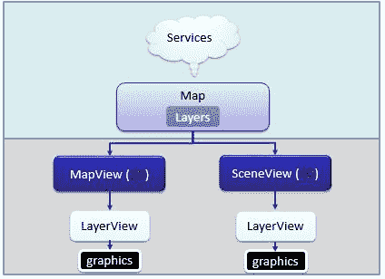

在用于 JavaScript 的 ArcGIS API 版本 4 中，首先要注意的是，地图类纯粹是作为 GIS 服务的容器而存在的。作为一个纯数据源，它没有可见的属性，因此永远不会被实际呈现。这使得应用编程接口能够处理地图的 2D 和三维表示，并且无论如何都非常强大，因为它让我们无需绘制地图就可以访问服务中的底层图层。相反，地图数据的可视化表示取决于视图，我们有不同的视图对象，这取决于我们想要在 2D(在这种情况下，我们使用`MapView`)还是 3D(在这种情况下，我们使用`SceneView`)显示该数据。这些视图对象中的每一个都控制地图所承载的数据的显示方式。

让我们看看这如何转化为创建一个简单的 2D 地图。考虑以下代码:

```js
<link rel="stylesheet" href="https://js.arcgis.com/4.4/esri/css/main.css"> 
<script src="https://js.arcgis.com/4.4/"></script> 

<script> 
require([ 
  "esri/Map", 
  "esri/views/MapView", 
  "dojo/domReady!" 
], function(Map, MapView) { 
  // Code to create the map and view will go here 
  var map = new Map({ 
    basemap: "streets" 
  }); 

  var view = new MapView({ 
    container: "viewDiv",   // Reference to the DOM node that will contain the view 
    map: map,                    // References the map object created in step 3 
   center: [-98.526077, 29.418965], 
   zoom: 11 
  }); 
}); 
</script> 
```

首先，我们参考了用于 JavaScript 的 ArcGIS API 的 Esri 样式表和 v4.x。

然后，我们创建一个`<script>`标记，并使用 Dojo 的`require()`方法来引用我们需要的 Dojo 和 ArcGIS API 模块。在这个例子中，它是`Map`类(用于数据)和`MapView`(用于 2D 渲染)。`dojo/domReady!`插件只是等到页面加载后才执行 JavaScript。

在地图对象构造器中，我们定义了数据源。在本例中，这是托管在 ArcGIS Online 上的内置`streets`图层。

在`MapView`构造函数中，我们指定在页面中的哪个 div 来渲染地图视图，地图对象是视图的数据源，然后是缩放级别和初始范围的中心点。

所以，这里你真正需要注意的是，你先前与`Map`对象相关的属性，现在你在`MapView`中定义。通过使`MapView`构造函数中的`map`属性引用“指向”视图将显示的数据的`Map`对象，可以将两者联系起来。

最大的收获是，我们现在可以灵活地将`Map`视为一个纯数据源。我们可以访问与地图相关的所有数据，而无需绘制地图。因此，例如，我们可以创建六个地图对象，附加我们感兴趣的图层，直到我们需要它们时才进行渲染。当我们想要显示它们时，我们所需要做的就是将它们与适当的视图对象相关联。

要访问图层，您可以访问`Map`上的属性。`layers`属性返回地图中的所有操作图层，`basemap`返回-你猜对了-`basemap`，而`allLayers`两者都返回。

请记住，您在这里得到的是构成图层的数据，与如何表示无关。这一点我们怎么强调都不为过。但是，它是一个非常强大的功能，因为它意味着如果您想在其他地方显示数据，例如在图表控件中，或者使用它与另一个应用程序集成，您可以直接访问这些数据。

# 访问图层

由于现在事物被分为地图和视图，因此您无法直接从图层中访问要素数据。相反，您必须通过视图，或者更具体地说，通过`LayerView`对象来访问这些数据，该对象是视图对数据的*显示* y，而不是数据本身。我们现在将讨论如何通过`LayerView`访问和处理特征数据。

要通过`LayerView`访问特征数据，首先必须确保`LayerView`已经加载。您可以通过处理`LayerView`的`whenLayerView()`方法返回的承诺来做到这一点。返回的对象类型取决于您正在处理的图层类型。如果这是一个要素图层，您将获得一个`FeatureLayerView`对象，您可以使用其`queryFeatures()`方法来访问其数据，如以下代码示例所示:

```js

var featureLayer = new FeatureLayer({ 
          url: ""https://services.arcgis.com/...", 
          outFields: ["Name"] 
        }); 

        map.add(featureLayer); 

        view.whenLayerView(featureLayer).then(function (lyrView) { 
          lyrView.watch("updating", function (val) { 
            if (!val) {                  
               // count the total number of features 
              lyrView.queryFeatures().then(function (results){ 
                // do something with the results 
              }, function(err){ 
                console.log(err); 
              }); 
            }  
          }); 
        });    
```

除了使用`queryFeatures()`访问`FeatureLayerView`的单个要素之外，还有其他几个非常有用的功能可用于处理要素图层:

*   `queryExtent()`返回`LayerView`中要素的范围
*   `queryFeatureCount()`统计`LayerView`中的特征数量
*   `queryObjectIds()`给出了`LayerView`中所有要素的对象标识数组，您可以将其用作进一步查询的基础

# 新建和更改的图层

到目前为止，与 v3.x 相比，用于 JavaScript 的 ArcGIS API 第 4 版仅支持有限数量的图层。这无疑会随着时间的推移而改变。一些最有趣的变化如下:

*   `GraphicsLayer`
*   `FeatureLayer`
*   `MapImageLayer`
*   `VectorTileLayers`
*   `GroupLayers`
*   `SceneLayers`

# 图形层

`GraphicsLayer`只是一个覆盖在地图上的清晰图层，允许你用自己的自定义图形标记地图。从这个意义上说，它与您在 v3.x 中看到的非常相似。然而，在 v4 中，您可以将不同几何图形添加到同一图形层，这具有重要的连锁效应。因为`GraphicsLayer`支持不同的几何图形，所以您必须针对单个图形而不是整个图形层定义任何渲染器或弹出窗口。如果需要此功能，请考虑改用要素图层。

# 特征层

`FeatureLayer`是所有图层中能力最强的图层，可能也是 ArcGIS Server 网络地图应用程序中最常用的图层。在功能上，它与您习惯使用的非常相似。

您可以从 ArcGIS Server 服务目录中的图层的 URL 创建一个`featureLayer`:

```js
var featureLayer = new FeatureLayer({ 
  url: "http://..." 
}); 
```

您可以通过门户项目标识进行操作:

```js
var featureLayer = new FeatureLayer({ 
  portalItem: { 
   id: "myID" 
   } 
}); 
```

您也可以从功能集合中执行此操作:

```js
var featureLayer = new FeatureLayer({ 
  objectIdField: "item_id", 
  geometryType: "point", 
  // Fields in the layer 
  fields: [{ 
    name: "item_id", 
    alias: "Item ID", 
    type: "oid" 
  }, {...}], 
  // The renderer for the layer 
  renderer: new SimpleRenderer({ 
    type: "simple", 
    symbol: new SimpleMarkerSymbol({ 
      ... 
    }) 
   }), 
   popupTemplate: { 
     title: "{title}", 
     content: "{description}" 
   }, 
   // Collection of graphics 
   source: [graphic1, graphic2, graphic3] 
 }) 
```

当我们使用要素集合创建要素图层时，我们所做的是手动定义`FeatureLayer`的来源。这基本上包括提供一个图形集合，定义这些图形的渲染器，以及属性字段和弹出信息。这种方法的好处是，您可以对多个图形使用单个渲染器，也可以使用单个弹出窗口。您也可以像查询基于 ArcGIS Server 地图服务的`FeatureLayer`一样查询该`FeatureLayer`。这是一个强大的概念，虽然在 API 的 v3 中引入，但在 v4 中更容易使用。

# MapImageLayer

如果您使用过 API 的 v3，那么`MapImageLayer`可能是少数几个您不熟悉的图层名称之一。然而，图层的性质确实会非常熟悉，因为这是`ArcGISDynamicMapServiceLayer`，幸运的是，它被重命名为版本 4 的 JavaScript 的 ArcGIS API。

与通常用于底图的切片图像服务不同，所有切片都是预先缓存的，`MapImageLayer`为整个地图范围提供图像，它是动态创建的。

与以前版本的 API 相比，一个显著的改进是您可以轻松地为地图服务中的子图层定义可见性和任何定义表达式。这在以前是一个相当复杂的过程，现在变得简单直观，如下面的代码示例所示:

```js
var myMILayer = new MapImageLayer({ 
  url: // url, 
  sublayers: [{ 
    id: 0, 
    visible: true 
  }, { 
    id: 1, 
    visible: true 
  }, { 
    id: 2, 
    visible: true, 
    // filter layer contents with definition expression 
    definitionExpression: "pop2000 > 5000000" 
  }, { 
    id: 3, 
    visible: false 
  }] 
}); 
```

# 矢量图层

`VectorTileLayer`是新的，它是一种在浏览器中动态设置矢量数据样式而不牺牲性能的有效方法。基本上，`VectorTileLayer`访问缓存的图块，并以矢量格式渲染它，产生非常清晰和吸引人的地图:

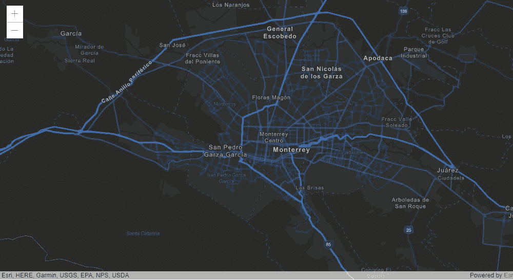

每一层都使用独立于图块的样式信息进行渲染。这意味着一组矢量图块可以以多种方式进行样式化，而不必为每种样式生成新的图像缓存。这可以节省空间并加快创建新地图样式的过程。

样式表可能包含用于呈现同一类型功能的多个选项。例如，在街道图层中，主要公路可能有三个符号系统选项。无需从服务器请求新切片，即可在客户端更改符号系统。这使得地图在客户端上是动态的，同时仍能利用地图缓存。

要创建`VectorTileLayer`，您不需要引用地图服务，而是要引用它的一个样式文件(JSON 格式)。因为它们基于地图框矢量切片规范，所以它们也能很好地处理地图框数据，因此在 ArcGIS Server 应用程序中包含地图框数据非常容易。为此，您需要提供一个 Mapbox 开发人员令牌，如下面的代码示例所示:

```js
VectorTileLayer.ACCESS_TOKEN = "developer_access_token"; 
var tileLayer = new VectorTileLayer({ 
  url: "mapbox://styles/mapbox/streets-v8" 
}); 
var map = new Map({ 
  layers: [tilelayer] 
}); 
```

某个`VectorTileLayer`的实例听起来像是魔法，在某种程度上也是！但是请注意，在撰写本文时，它们有一些局限性。有关详细信息，请参考文档。

# grourplayers

答`GroupLayer`不是访问网络服务的方式；相反，它允许您将不同类型的许多层组合在一起，并集体处理它们。一个典型的用例是控制一组层的可见性，而不是单独处理它们。例如，您可能有几个要素图层、一个`MapImageLayer`和一个图形图层，它们都与属性分区信息相关，并且希望能够一次性打开或关闭它们的可见性。组层非常适合这样的任务:

```js
var layers = { 
  new FeatureLayer({...}}, 
  new FeatureLayer({...}), 
  new GraphicsLayer({...}) 
}  
var groupLayer = new GroupLayer({ layers }); 
var map = new Map({ 
  basemap: "streets", 
  layers: [groupLayer] 
}); 
```

# 场景图层

`SceneLayer`是一种图层类型，设计用于按需流式传输和在`SceneView`中显示大量数据，我们将在下一节讨论 3D 映射时介绍这一点。`SceneLayer`支持两种几何类型:点和三维对象(例如建筑)。

`SceneLayer`显示发布到场景服务的数据。场景服务可以以适合网络流的开放格式保存大量功能。`SceneLayer`从粗略表示开始，逐步加载这些特征，然后根据特写视图的需要对它们进行更详细的细化:

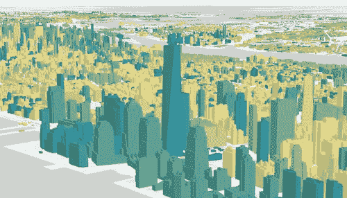

您可以以与任何其他层完全相同的方式添加`SceneLayer`，如以下代码示例所示:

```js
sceneLayer = new SceneLayer({ 
  url: "http://scene.arcgis.com/arcgis/rest/services/Hosted/ 
               Building_Hamburg/SceneServer/layers/0"; 
}); 
```

然后，您可以使用一系列不同的符号和渲染器来可视化它们。A `SceneLayer`还支持可视化变量，可以让你用连续的颜色轻松可视化图层中的数值数据。例如，上图中使用的服务表示包含数字属性的建筑要素，该属性存储每个建筑中的居民数量。图层的渲染器使用颜色视觉变量为每个要素着色，并根据给定字段的值提供连续的黄色到红色渐变。入住率高的建筑用红色阴影，而入住率低的建筑用黄色阴影。具有介于低值和高值之间的值的建筑物被分配了中间颜色。

# 三维制图和符号系统

毫无疑问，针对 JavaScript 的 ArcGIS API 第 4 版最令人兴奋的是它对 3D 制图的支持。

使用三维视图与使用 2D 视图非常相似。例如，两个视图在图层、渲染器、任务、几何图形、符号系统、弹出窗口和导航方面共享相同的实现，但 3D 添加了特定于 3D 的概念，如环境(氛围和照明)和相机。这种额外的 3D 功能将在本节中介绍。

# 景色

场景是符号化的三维地理空间内容，包括多尺度底图、2D 和三维图层、样式和配置的集合，使您能够在直观的交互式三维环境中可视化和分析地理信息。您可以在 ArcGIS Online 或门户场景查看器软件中创作这些场景，也可以使用 ArcGIS Pro 在桌面上创作。

您可以在全局场景或本地场景之间进行选择，以最好地显示您的数据，例如全局天气模式、航道或地下设施。局部场景和全局场景的主要区别在于，局部场景可以显示在局部**投影坐标系** ( **PCS** )(但目前不是地理坐标系)中具有空间参考的数据；地形和图层被投影到平面上，而不是球体上。本地场景最适合用于显示或分析具有固定工作范围的本地或城市规模的数据。本地场景有助于城市规划和可视化，您可以在其中查看校园设施或建筑发展。您可以在地下导航，并与地下三维数据交互，如公用事业网络或地震数据。

发布这些场景会创建一个*场景服务*，它可以像用于 JavaScript 的 ArcGIS API 第 4 版中的任何其他地图服务一样被带入到您的网络地图应用程序中。

# 创建地图

创建三维地图的步骤与创建 2D 地图的步骤非常相似，但是有一些额外的属性可以使用。

首先，定义地图，指定底图。因为地图将以 3D 方式渲染，所以有一些高程数据会有所帮助，这些数据是您在地图的`ground`属性中定义的。

然后，您必须创建视图。不像在 2D 地图中那样使用`MapView`，而是使用`SceneView`。您可以指定一个`viewingMode`，它在很大程度上是全局的(将地球渲染为一个球体)，或者在更离散的区域是局部的。对于全局模式，图层必须在 WGS84 或 Web Mercator 投影中，或者可重新投影到相同的位置，而对于局部模式，您可以使用任何投影坐标系。如果您没有指定，默认的`viewingMode`将是`global`，如果视图的空间参考是`WGS84`或`WebMercator`，否则是`local`。

您还可以选择设置相机和高程的属性，这将允许您定位初始视点。最后，您可以添加更多图层，并使用特殊的三维符号系统对其进行可视化。

以下代码示例显示了如何创建地图并指定底图和高程数据(使用`ground`属性):

```js
require([ 
  "esri/Map", 
  "esri/views/SceneView", 
  "dojo/domReady!" 
], function(Map, SceneView) { 
  var map = new Map({ 
    basemap: "satellite", 
    ground: "world-elevation" 
  }); 

  var view = new SceneView({ 
    container: "sceneDiv",  
    map: map,               
    center: [-98.5, 29.4], 
    scale: 50000000, 
    viewingMode: 'global' 
  }); 
}); 
```

在这里，我们只是使用 Esri 的世界高程数据服务。然后，我们基于一个中心点和比例定义一个具有初始范围的`SceneView`，并将查看模式设置为`global`。在全局视图模式下，可以看到地球的曲率，如下图第一张截图所示。当我们放大时，高程数据变得可见，如第二张截图所示:

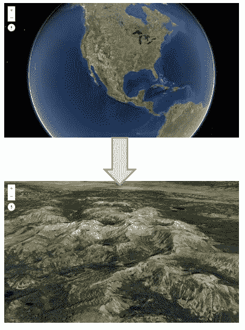

现在，我们将更详细地探讨其中的一些选项。我们将从地图的`ground`属性开始，然后查看`SceneView`类的一些属性，例如环境和相机，然后继续添加和符号化图层。

# 设置高程数据

该应用编程接口使用一种称为`ElevationLayer`的特殊类型的图层来显示 3D 地图中的高程数据。您可以为此使用 Esri 的世界高程数据服务，在这种情况下，您只需将地图的`ground`属性设置为字符串读取单词连字符评估，或者您可以为此使用自己的图像服务。

地图的`ground`属性接受一组高程图层，您可以使用`ground`属性的`layer.add()`方法添加这些图层，如下例所示:

```js
var layer = new ElevationLayer({ 
  url: "//elevation3d.arcgis.com/arcgis/rest/services/ 
  WorldElevation3D/Terrain3D/ImageServer" 
}); 
map.ground.layers.add(layer); 
```

不要试图添加这些高程图层作为操作图层。如果你做了，它们就不会起作用。始终在地图的`ground`属性中指定它们。

# 设置摄像机

`SceneView`类与您已经使用过的`MapView`类非常相似，但是它有几个处理 3D 数据的特殊属性。主要有`camera`和`environment`。先来看看`camera`吧。

您可以将`camera`属性视为位于地图上特定点的文字相机，指向特定方向并以特定角度倾斜。

有几种不同的方法可以在相机对象中定义这些选项。下面的代码示例演示如何使用数组指定摄像机位置，数组中的第一个元素是经度，第二个元素是纬度，第三个元素是以米为单位的高程。它还以度为单位定义相机的方向。当北是屏幕顶部时，航向为零。它随着视图顺时针旋转而增加。角度总是在 0 到 360 度之间标准化:

```js
var view = new SceneView({ 
  camera: { 
    position: [ 
       -122, // longitude 
         38, // latitude 
      50000  // elevation in meters 
    ], 
    heading: 95 
  } 
}); 
```

以下示例使用对象文字中的`x`、`y`和`z`属性分别指定经度、纬度和高程。它还指定从相机位置向下投影时相机相对于表面的倾斜角度。当直视表面时，倾斜度为零，当相机平行于表面时，倾斜度为 90 度:

```js
var view = new SceneView({ 
  camera: { 
    position: { 
      x: -100, // lon 
      y: 45,   // lat 
      z: 10654 // elevation in meters 
    }, 
    tilt: 65 
  } 
}); 
```

要将相机移动到新位置，最简单的方法就是使用其`clone()`方法克隆现有相机对象，然后只更新已更改的值。然后，您可以设置`SceneView`的相机属性来指向相机对象的这个新实例，但是如果这样做，过渡将会不和谐。您可以通过使用应用编程接口的内置动画功能来使这种过渡更加平滑。只需调用属于`SceneView`的`goTo()`方法，然后传入新的相机对象，或者位置属性，甚至是要制作动画的图形或范围。

以下代码克隆现有的相机对象，然后使用`goTo()`平滑缩放到该对象:

```js
var newCam = view.camera.clone(); 
newCam.heading = 180; 
view.camera = newCam; 
view.goTo(newCam); 
```

下面的代码展示了当动画完成时，如何使用`goTo()`方法返回的承诺将一系列动画链接在一起:

```js
view.goTo(graphic1) 
    .then(function() { 
      return view.goTo(graphic2); 
    }) 
    .then(function() { 
      return view.goTo(graphic3); 
    }); 
```

# 指定环境

环境属性有三个主要属性，主要的一个是`lighting`，它可以让你控制太阳的位置，让你给建筑和其他特征添加非常好的阴影效果。我们将更详细地研究这个属性。

另一个是`starsEnabled`，定义是否显示星星。如果你选择包括星星，它们的位置是准确的，取决于当前日期或你在视图中定义的任何日期，当你考虑它时，这是相当了不起的！

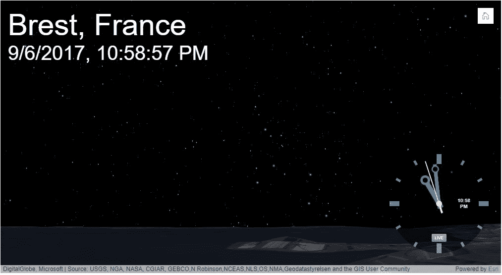

最后一个是`atmosphereEnabled`，它让你决定是否可视化大气。如果你想，你可以选择高质量的可视化或低质量的可视化。氛围的质量会对性能产生重大影响，所以只有当你知道你的用户拥有高端机器时，才使用高质量。幻灯片上显示了两者的区别:

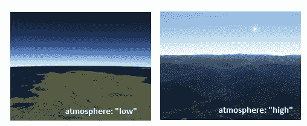

可以通过改变四种不同属性的值来改变环境的照明。第一个是日期和时间，它将决定太阳相对于地球的位置，如果您已经使用`starsEnabled`属性启用了星星，它还将决定星星的位置。当摄像机位置改变时是否自动更新由`cameraTrackingEnabledProperty`决定。模拟太阳的整个想法实际上是创造一些不错的阴影效果，这是默认行为。但是，如果不想显示阴影，请将`directShadowsEnabled`属性设置为 false。最后一个属性是`ambientOcclusionEnabled`。如果启用此选项，它将尝试并计算光线应该如何从表面反射；这需要高端机器才能正常工作，因此它在默认情况下被禁用，并且在移动设备上始终关闭:


# 本地场景

到目前为止，我们只看了全局场景，这对于较大的范围很有用，但对于较小的范围就没那么有用了。全局场景将地球渲染为一个球体，而局部场景将表面渲染在一个平面上，并允许您不仅在场景上导航，还可以在场景下导航，以显示地下特征，例如下图中的堪萨斯油井样本。如果您不希望用户能够做到这一点，您可以通过设置`SceneView`的约束属性来阻止它和其他操作。

只有当视图的空间参考位于投影坐标系中，并且其所有图层或者位于同一空间参考中，或者可重新投影到该坐标系中时，才能渲染本地场景，因此在不同空间参考中缓存的图层将不起作用。撰写本文时不支持地理坐标系，但 Esri 声称他们正在开发这一功能。要限制场景的范围，请将所需的范围传递给`SceneView`的`clippingArea`属性。


# 三维符号和渲染

现在我们有了 3D 地图，我们需要 3D 符号，这样我们就可以突出感兴趣的特征。用于 JavaScript 的 ArcGIS API 版本 4 支持以下主要的 3D 符号类，这些符号类在文档中很容易识别，因为它们的名称中有“3D”字样:

*   点数(`PointSymbol3D`)
*   线条(`LineSymbol3D`)
*   多边形(“T0”)
*   网格(`MeshSymbol3D`)
*   标签(`LabelSymbol3D`)

所有这些符号都继承自`Symbol3D`类。唯一一个可能看起来不熟悉的是网格，它与场景层的符号化特征有关，我们稍后将讨论这些特征。

这些主要符号类中的每一个都必须与符号图层相关联，如下表所示:

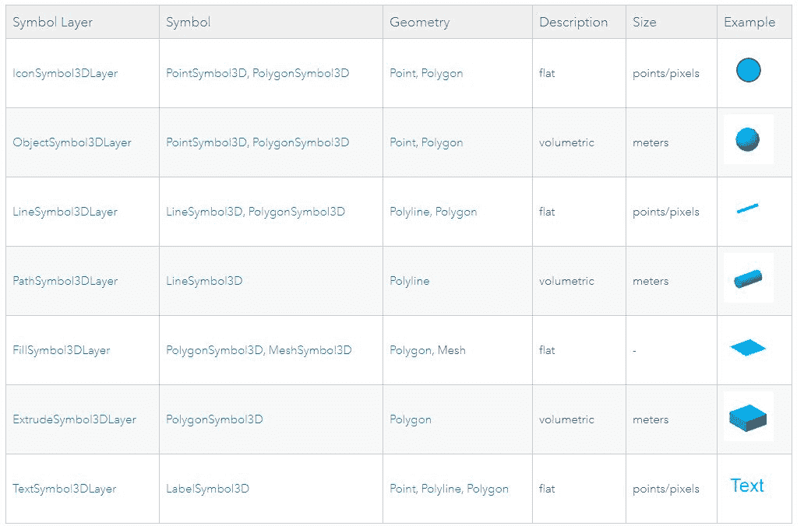

例如，`ExtrudeSymbol3DLayer`通过从地面向上挤压多边形几何图形来渲染多边形几何图形，从而创建三维体积对象。这是用 T2 的 T1 来完成的。`MapView`不支持三维符号。

符号的颜色在`material`属性中设置。拉伸的高度总是以米为单位定义的`size`属性。通过向使用此符号图层的任何渲染器添加大小和/或颜色视觉变量，拉伸高度和颜色也可以由数据驱动。

必须将`ExtrudeSymbol3DLayer`添加到`PolygonSymbol3D`的`symbolLayers`属性中。单个符号中可以使用多个符号层。下图显示了代表建筑足迹的多边形`FeatureLayer`。特征用包含`ExtrudeSymbol3DLayer`的`PolygonSymbol3D`符号化。拉伸基于建筑物的高度:

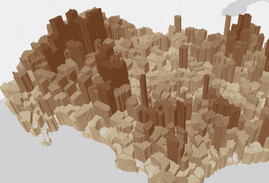

`MeshSymbol3D`使用`FillSymbol3DLayer`作为其符号图层。`MeshSymbol3D`用于在 3D `SceneView`中的`SceneLayer`中渲染 3D 网格特征。下图显示了一个`SceneLayer`，其图形采用包含`FillSymbol3DLayer`的`MeshSymbol3D`样式。

用于 JavaScript 的 ArcGIS API 第 4 版中的 3D 映射使用了与该 API v 3 . x 中相同的渲染器。然而，一个新的属性被添加到`SimpleRenderer`对象中，以支持 Esri 所说的视觉变量。

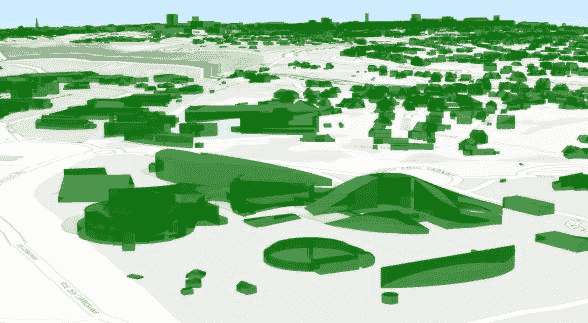

下面的代码创建了这种效果:

```js
var symbol = new MeshSymbol3D({ 
  symbolLayers: [new FillSymbol3DLayer({ 
    material: { color: "green" } 
  })] 
}); 
sceneLayer.renderer = new SimpleRenderer({ 
  symbol: symbol 
}); 

```

可视化变量定义了数字数据的数据驱动地理可视化的参数。它们允许您轻松地将颜色、大小、不透明度和/或旋转的连续渐变映射到图层数字属性字段之一的最小和最大数据值。

渲染器的`visualVariables`属性包含一个名为*视觉变量*的对象数组。每个对象必须指示要应用的视觉变量的类型(例如颜色、大小、不透明度、旋转)、驱动可视化的数值字段以及要映射到数据的视觉值渐变。

视觉变量允许您基于 2D 或 3D 中的主题属性(例如，人口、教育、等级、金钱、数量等)轻松创建令人惊叹的可视化效果。这是通过将数值字段属性中的数据值映射到颜色、大小和/或不透明度值来实现的。然后，渲染器会根据给定字段的值及其相对于最小值和最大值的位置，接管并调整要素的大小或为要素着色。以下示例使用三个视觉变量(大小、颜色和不透明度):

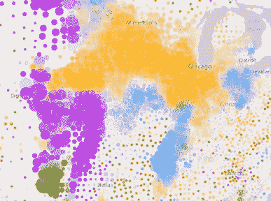

大小可视变量可用于根据要素在现实世界中的大小来可视化要素的真实大小(例如，树冠、道路宽度、建筑高度等)。当在 3D `SceneView.`中工作时，这可能特别强大。以下示例显示了一层建筑物覆盖区，它使用视觉变量根据存储在属性字段中的数据将每个要素挤压到建筑物的真实高度:

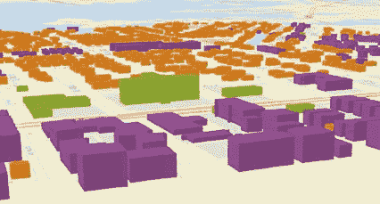

# 摘要

在本附录中，我们研究了用于 JavaScript 的 ArcGIS API 版本 4 背后的基本原理，并消除了一些关于我们现有的 3.x 技能在短期内会过时的担忧。我们还考虑了该应用编程接口支持的一些惊人的新功能，包括 3D 映射、矢量切片层等。还有很多我们没有涉及的内容，例如更好、更易于风格化的小部件、与其他框架(如 JQuery)的集成，以及对 ArcGIS Online 和 Portal 安装的更好支持，但我们强烈建议您查阅文档以获取更多信息。

这就把我们带到了书的结尾。我们希望我们已经为您使用 ArcGIS API for JavaScript 提供了足够好的基础，以鼓励您创建一些真正出色的网络地图应用程序！