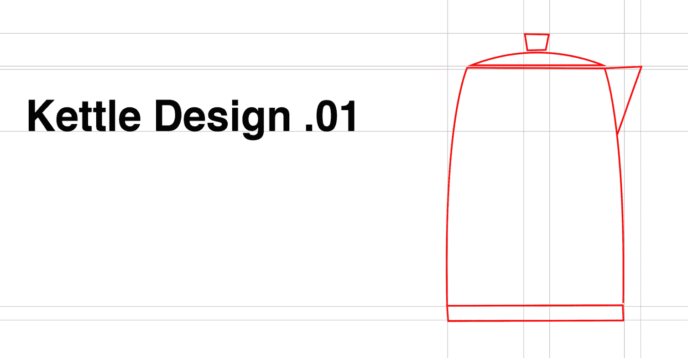
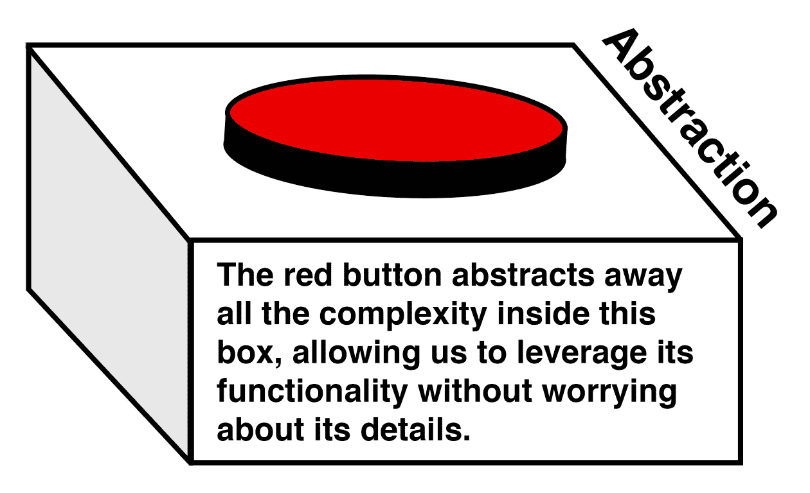
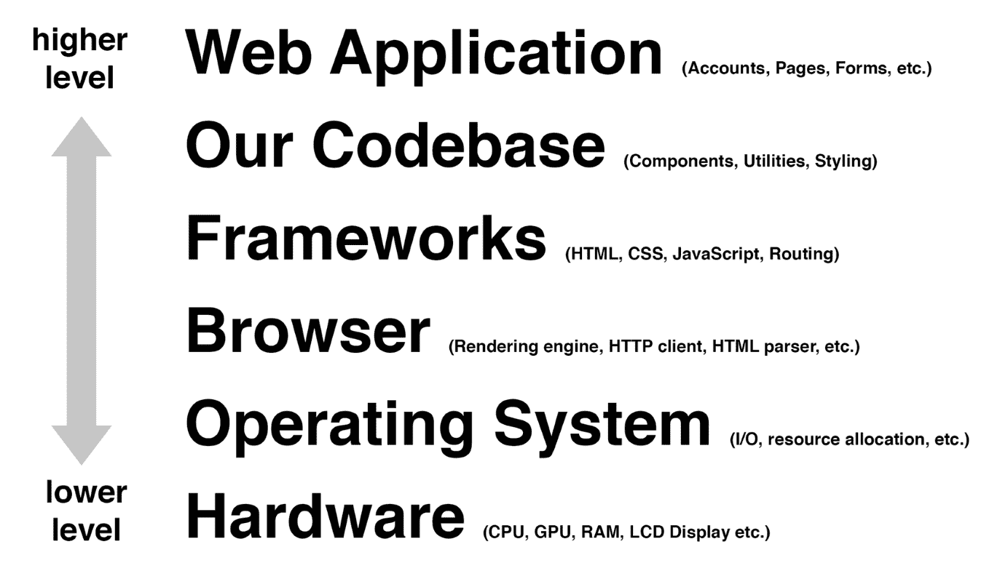

# 设置场景

JavaScript 是由 Brendan Eich 在 1995 年创建的，目标是成为一种*胶水语言*。 它的目的是帮助网页设计师和业余爱好者轻松地操作并从他们的 HTML 导出行为。 JavaScript 能够通过 DOM API 做到这一点，DOM API 是浏览器提供的一组接口，用于访问解析后的 HTML 表示。 在此之后不久，**DHTML**成为了一个流行术语，指的是 JavaScript 支持的更动态的用户界面:从动画滚动按钮状态到客户端表单验证。 最终出现了 Ajax，使*客户端*与*服务器*之间能够进行通信。 这打开了一个相当可观的潜在应用喷泉。 以前纯粹是文档领域的网络，现在正在成为处理器和内存密集型应用的发电站:


在 1995 年，没有人能预料到 JavaScript 有一天会被用于构建复杂的 web 应用、程序机器人、查询数据库、为照片处理软件编写插件，并落后于现存最流行的服务器运行时之一 Node.js。

1997 年，在创建后不久，Ecma International 将 JavaScript 标准化，命名为 ECMAScript，目前仍在 TC39 委员会的频繁修改中。 该语言的大多数最新版本都是根据发布年份命名的，比如 ECMAScript 2020 (ES2020)。

由于其迅速发展的功能，JavaScript 吸引了一个充满热情的社区，推动它的发展和普及。 由于它相当受欢迎，现在有无数不同的方法在 JavaScript 中做同样的事情。 有成千上万的流行框架、库和实用程序。 语言也在不断变化，以应对日益增长的应用需求。 这就产生了一个巨大的挑战:在所有这些变化中，当被推往不同的方向时，我们如何知道如何编写尽可能最好的代码? 我们应该使用哪些框架? 我们应该采用什么惯例? 我们应该如何测试代码? 我们应该如何制作有意义的抽象?

为了回答这些问题，我们需要简单地回到基础。 这就是本章的目的。 我们将讨论以下内容:

*   代码的真正目的是什么
*   我们的用户是谁，他们有什么问题
*   为人类编写代码意味着什么

# 我们为什么要写代码

简单地说，我们知道编程就是指令计算机，但是我们在指令它们做什么呢? 目的是什么? 代码还有什么其他用途?

我们可以广义地说，代码是一种解决问题的方法。 通过编写代码，我们表达了一个复杂的任务或一系列操作，将它们提炼成一个易于用户使用的单一过程。 所以我们可以说代码是问题域的表达式。 我们甚至可以说它是一种沟通形式，一种传递信息和意图的方式。 理解代码是一个复杂的东西，有许多互补的目的，如解决问题和交流，将使我们能够充分利用它的潜力。 让我们通过探究代码作为传递意图的一种方法的含义来进一步探究这种复杂性。

# 代码的意图

我们通常认为代码只是由计算机执行的一系列指令。 但在很多方面，这错过了我们编写代码时真正的魔力。 当我们传达指令时，我们是在向世界表达我们的意图; 我们在说*这些是我想发生的事情。*

人类自存在以来就一直在传递指令。 其中一个例子是一个简单的烹饪食谱:

Cut about three hundred grams of butter (small cubes!)
Take 185 grams dark chocolate
Melt it with butter over a saucepan
Break half dozen eggs, ideally large ones
Mix them together with a few cups of sugar

这样的说明对于人类来说很容易理解，但是您会注意到它们没有严格的规范。 测量单位不一致，标点符号和措辞也不一致。 有些说明很模糊，所以以前没做过饭的人很容易误解:

*   一个大鸡蛋是由什么组成的?
*   什么时候黄油应该完全融化?
*   黑巧克力应该多黑?
*   一小块黄油有多小?
*   *over a saucpan*是什么意思?

人类通常可以凭借自己的主动性和经验应付这种含糊不清的情况，但机器就不那么熟练了。 对机器的指令必须具有足够的特异性，才能执行每一个步骤。 我们希望与机器沟通的是我们的意图，也就是说，*请做*这件事，但由于机器的天性，我们必须完全具体。 值得庆幸的是，如何编写这些指令取决于我们自己; 有许多编程语言和方法，几乎所有这些语言都是为了让人类更容易地以一种不那么繁琐的方式交流他们的意图而创建的。

人类能力和计算能力之间的距离正在迅速缩小。 机器学习、自然语言处理和高度专业化程序的出现，意味着机器在执行指令的类型上要灵活得多。 然而，代码在一段时间内仍然有用，因为它允许我们以一种高度具体和标准化的方式进行交流。 有了这种高水平的专一性和一致性，我们可以更有信心，我们的指令每次都会按照预期执行。

# 用户是谁?

关于编程的任何有意义的对话都不可能不考虑用户。 用户，无论他们是程序员伙伴还是 UI 的最终用户，都是我们工作的核心。

假设我们的任务是验证用户在网站上输入的送货地址。 这个网站向世界各地的医院出售药物。 我们有点赶时间，更喜欢使用别人已经实现的东西。 我们发现了一个名为`shipping_address_validator`*的公开软件包，并决定使用它。*

 *如果我们花时间检查包中的代码，在它的邮政编码验证文件中，我们会看到:

```js
function validatePostalCode(code) {
  return /^[0-9]{5}(?:-[0-9]{4})?$/.test(code);
}
```

This `validatePostalCode` function happens to be using regular expressions (also known as **RegExp** and regex), delimited by forward slashes, to define a pattern of characters to match a string against. You can read more about these constructs in [Chapter 6](06.html), *Primitive and Built-In Types*.

不幸的是，由于我们的匆忙，我们没有质疑`shipping_address_validator`*包的功能。 我们假设它做了它在锡上所说的*。 在将我们的代码发布到生产环境一周后，我们收到了一个 bug 报告，说一些用户无法输入他们的地址信息。 当我们看到代码时，我们震惊地发现它只验证美国邮政编码，而不是所有国家的邮政编码(例如，它不能验证英国邮政编码，如 GR82 5JY)。**

 *通过这一系列不幸的事件，这段代码现在负责阻止至关重要的药物运输到世界各地的客户，数量在成千上万。 幸运的是，修复它并不需要太长时间。

暂时不考虑谁对这个错误负责，我想提出以下问题:这段代码的用户是谁?

*   我们，程序员，谁决定使用`shipping_address_validator`包?
*   试图输入地址的不知情的客户?
*   在医院里等待药物的病人?

这个问题没有一个明确的答案。 当代码中出现错误时，我们可以看到大量不幸的下游影响。 包的原始程序员应该关心所有这些下游依赖关系吗? 当一个水管工受雇修理水槽上的水龙头时，他们应该只考虑水龙头本身的功能，还是只考虑注入水龙头的水槽呢?

当我们编写代码时，我们正在定义一个隐式规范。 该规范通过其名称、配置选项、输入和输出进行通信。 任何使用我们代码的人都有权利期望它按照规范工作，所以我们越明确越好。 如果我们编写的代码只验证美国邮政编码，那么我们应该相应地给它命名。 当人们在我们的代码之上创建软件时，我们无法控制他们如何使用它。 但我们可以明确地沟通它，确保它的功能是明确的和预期的。

重要的是要考虑我们代码的所有用例，想象它可能如何被使用，以及人们、程序员和最终用户对它的期望是什么。 我们应该对什么负责任或负责任有待讨论，这既是一个法律问题，也是一个技术问题。 但我们的用户是谁的问题完全取决于我们。 根据我的经验，更好的程序员考虑所有用户，知道他们编写的软件不是凭空存在的。

# 有什么问题吗?

我们已经讨论了用户在编程中的重要性，以及如果我们有任何帮助他们的希望，我们必须首先了解他们希望做什么。

只有通过理解问题，我们才能开始组装代码必须满足的需求。 在探究问题的过程中，问自己以下几个问题是有用的:

*   用户会遇到什么问题?
*   他们目前是如何完成这项任务的?
*   现有的解决方案是什么?它们是如何工作的?

当我们对问题有了全面的理解后，我们就可以开始构思、计划和编写代码来解决问题。 在每一步中，我们常常没有意识到，我们将以一种对我们有意义的方式建模问题。 我们思考问题的方式将对我们最终创造的解决方案产生重大影响。 我们创建的问题模型将决定我们最终编写的代码。

**What is the model of a problem?** A model or *conceptual model* is a schematic or representation that describes how something works. We create and adapt models all the time without realizing it. Over time, as you gain more information about a problem domain, your model will improve to better match reality.

让我们想象一下，我们负责一个学生笔记应用，并负责创建一个解决方案，以解决用户表达的以下问题:

"I have many notes for my studies and so am finding it hard to organize them. Specifically, when trying to find a note on a given topic, I'll try to use the Search feature but I rarely find what I'm looking for since I can't always recall the specific text I wrote."

我们决定对软件进行修改，因为我们从其他用户那里听说了类似的事情。 所以，我们坐下来，试着想出各种各样的方法来改进笔记的组织。 有几个选择我们可以探索:

*   **类别**:类别将有一个分层的文件夹结构。 *长颈鹿*的注释可能存在于研究/动物学中。 类别可以很容易地手动导航或通过搜索。
*   **标签**:有能力用一个或多个单词或短语*标签*注释。 长颈鹿上可能有*哺乳动物*和*长颈*的标记。 标签可以很容易地手动导航或通过搜索。
*   **链接**:引入*链接*功能，使音符可以链接到其他相关的音符。 *长颈鹿*上的音符可能与另一个音符相关联，例如*动物长脖子上的音符。*

每个解决方案都有其优点和缺点，也有可能实现它们的组合。 显而易见的是，每一个因素都将极大地影响用户最终使用应用的方式。 我们可以想象，当用户接触到这些各自的解决方案时，他们的脑海中会有*笔记*的模式:

*   **Categories**:我写的笔记在我的分类层次中有它们的位置
*   :我写的笔记有很多不同的东西
*   :我写的笔记与我写的其他笔记相关

在这个例子中，我们正在开发一个 UI，所以我们非常接近应用的最终用户。 然而，问题的建模适用于我们所做的所有工作。 如果我们要为记录创建一个纯粹的 REST API，则需要完全相同的考虑。 Web 程序员在决定其他人最终采用什么模型方面起着关键作用。 我们不应轻率地承担这一责任。

# 真正理解问题领域

第一个错误通常是对问题的误解。 如果我们不理解用户真正想要完成的是什么，并且我们没有接收到所有的需求，那么我们将不可避免地保留问题的坏模型，从而最终实现错误的解决方案。

想象一下在水壶发明之前的某个时间点发生的情况:

*   **:Matt，有人要求我们设计一种容器，用户可以用它来烧水**
*   **Matthew(工程师)**:理解; 我将创造一种能做到这一点的血管

马修没有问任何问题，并立即开始工作，他对将他的创造力付诸实践的前景感到兴奋。 一天后，他发明了这样一个装置:



我们可以很明显地看到，马修忘记了一个重要的组成部分。 在匆忙中，他没有停下来问苏珊娜更多关于用户的信息，或者关于他们的问题，所以也没有考虑到用户可能需要拿起滚烫的容器的可能性。 在收到反馈后，自然而然地，他设计并引入了一个水壶的把手:


不过，这根本不需要发生。 想象一下这个水壶场景推断出一个跨越多个月的大型软件项目的复杂性和长度。 想象一下这样的误解会带来多少头痛和不必要的痛苦。 设计一个好的问题解决方案的关键首先需要一个正确和完整的问题模型。 没有这个，我们还没开始就会失败。 这不仅在大型项目的设计中很重要，在最小的 JavaScript 实用程序和组件的实现中也很重要。 事实上，在我们编写的每一行代码中，如果我们不首先理解问题领域，我们完全有可能失败。

问题域不仅封装了用户遇到的问题，而且还封装了通过我们现有的技术来满足他们需求的问题。 因此，在浏览器中编写 JavaScript 的问题领域，例如，包括 HTTP、浏览器对象模型、DOM、CSS 和一系列其他细节的复杂性。 一名优秀的 JavaScript 程序员不仅要精通这些技术，还要善于理解用户遇到的新问题领域。

# 为人类编写代码

整本书都是关于教你如何用 JavaScript 编写干净的代码。 在接下来的章节中，我们将详细讨论语言中的几乎每一个结构。 首先，当我们思考为人类编写干净的代码意味着什么时，我们需要建立一些关键的观点。

# 交流意图

我们可以说，为人类编写代码主要是为了明确意图。 而为机器编写代码基本上是关于功能的。 当然，这些需求是相互交叉的，但辨别两者的区别是至关重要的。 如果我们只为机器编写代码，只关注功能，而忽略了人类受众，我们就能看到其中的区别。 这里有一个例子:

```js
function chb(d,m,y) {
  return new Date(y,m-1,d)-new Date / 6e4 * 70;
}
```

你知道这段代码在做什么吗? 你也许能破译这段代码，但它的意图——它的真正含义——几乎是不可能分辨出来的。

如果我们清楚地表达了我们的意图，那么前面的代码看起来就像这样:

```js
const AVG_HEART_RATE_PER_MILLISECOND = 70 / 60000;

function calculateHeartBeatsSinceBirth(birthDay, birthMonth, birthYear) {

 const birthMonthIndex = birthMonth - 1;
 const birthDate = new Date(birthYear, birthMonthIndex, birthDay);
 const currentDate = new Date();

 return (currentDate - birthDate) / AVG_HEART_RATE_PER_MILLISECOND;

}
```

从前面的代码中，我们可以看出这个函数是用来计算心脏自出生以来跳动的次数的。 这两段代码在功能上没有区别。 然而，后一段代码更好地传达了程序员的意图，因此更容易理解和维护。

我们编写的代码主要是为人编写的。 你可能正在构建一个宣传册网站，编写一个 web 应用，或者为一个框架设计一个复杂的实用函数。 所有这些东西都是为人准备的:由我们的代码驱动的 gui 的最终用户，或者是使用我们的抽象和接口的程序员。 程序员的工作就是帮助这些人。

即使你只是为自己写代码，其他人不可能以任何方式使用它，如果你写了清晰的代码，未来的你会感谢你。

# 可读性

当我们编写代码时，必须考虑人类的大脑将如何使用它。 其他程序员将浏览您的代码，阅读相关部分，试图获得对其内部工作原理的运行理解。 可读性是他们必须克服的第一个障碍。 如果他们无法阅读和理解你编写的代码，那么他们使用代码的能力就会下降。 这将极大地限制代码的实用性和价值。

以我的经验来看，程序员往往不喜欢从美学设计的角度来考虑代码，但最好的程序员会欣赏这些概念在本质上是相互交织的。 我们的代码在表现或视觉上的设计对于它的可理解性和它的建筑设计一样重要。 最终，设计就是以一种最优的方式为用户提供目标。 对于我们的程序员同伴来说，这个目的就是理解。 因此，我们必须*设计*我们的代码来实现这一目的。

机器只关心规格说明，并且可以轻松地将有效的代码分解成各个部分。 然而，人类要复杂得多。 在机器擅长的领域，我们的能力较弱，因此它们存在，但我们在机器可能不擅长的领域也很熟练。 我们高度进化的大脑，在它们的许多天赋中，已经变得非常擅长发现模式和不一致。 我们依靠差异或对比来集中注意力。 如果一个模式没有被遵循，那么它就会为我们的大脑创造更多的工作。 关于这种不一致的例子，请看下面的代码:

```js
var TheName='James' ;
 var City     =   'London'
var    hobby = 'Photography',job='Programming'
```

您可能不喜欢看这段代码。 它的混乱令人分心，而且似乎没有遵循特定的模式。 命名和空格不一致。 我们的大脑与此斗争，因此阅读代码，并建立对它的全面理解，在认知上变得更加昂贵。

我们可以重构前面的代码，使其更加一致，如下所示:

```js
var name = 'James';
var city = 'London';
var hobby = 'Photography';
var job = 'Programming';
```

在这里，我们使用了单一的命名模式，并在每个语句中使用了一致的语法和空格。

或者，我们可能希望在单个`var`声明中声明所有变量，并对齐赋值(`=`)操作符，以便所有值都沿着相同的垂直轴开始:

```js
var name  = 'James',
    city  = 'London',
    hobby = 'Photography',
    job   = 'Programming';
```

你会注意到这些不同的风格是非常主观的。 有些人喜欢一种方式。 其他人喜欢另一种方式。 这是好的。 我并不是说哪种方法更好。 相反，我要指出的是，如果我们关心为人类编写代码，那么我们首先应该关心它的可读性和表达方式，而一致性是其中的关键部分。

# 有意义的抽象

在编写代码时，我们不断地使用和创建抽象。 抽象是指，当我们获取一个复杂的部分，然后以一种更简单的方式呈现对这个复杂的访问。 通过这样做，我们使人们能够在不充分理解复杂性的情况下利用它。 这一理念支撑着大多数现代科技:



像许多其他高级语言一样，JavaScript 提供了一种抽象，使我们不必担心计算机如何操作的细节。 例如，我们可以忽略内存分配问题。 尽管我们必须对硬件的限制非常敏感，特别是在移动设备上，但我们很少会考虑它。 语言并不要求我们这么做。

浏览器也是一个著名的抽象概念。 它提供了一个 GUI，其中抽象了 HTTP 通信和 HTML 呈现的细节。 用户可以轻松浏览互联网，而不必担心这些机制。

在本书接下来的章节中，我们将学习更多关于如何创建一个好的抽象的知识。 现在，可以这样说:在您编写的每一行代码中，您都在使用、创建和交流抽象。

# 抽象之塔

抽象之塔是看待技术复杂性的一种方式。 在底层，我们有计算所依赖的硬件机制，如 CPU 中的晶体管和 RAM 中的存储单元。 以上是集成电路。 在此之上，有机器码、汇编和操作系统。 再往上几层，就是浏览器和它的 JavaScript 运行时。 每一层都抽象了复杂性，这样上面的层就可以不费太大力气地利用复杂性:



当我们为浏览器编写 JavaScript 时，我们已经在一个非常抽象的高塔上操作了。 这座塔越高，就越不安全。 我们依赖于每一个单独的部分按照预期工作。 这是一个脆弱的系统。

当考虑我们的用户时，抽象之塔也是一个有用的类比。 当我们编写代码时，我们是在往这个塔上添加东西，一层一层地在上面构建。 我们的用户将永远位于这座塔的上方，使用我们精心制作的机器来实现他们自己的目标。 这些用户可能是使用我们代码的其他程序员，在系统中构建更多的抽象层。 或者，我们的用户可能是软件的*终端*用户，通常坐在塔顶，通过简化的 GUI 来利用其巨大的复杂性。

# 干净的代码层

在本书的下一部分，我们将采用本章中讨论的基本概念，并在其之上构建我们自己的抽象; 在软件行业中，我们使用这些抽象概念来讨论编写干净代码的含义。

如果我们说我们的软件是可靠的或可用的，那么我们就是在使用抽象的概念。 这些概念必须深入研究。 我们还将在后面的章节中剖析 JavaScript 的内部，看看如何处理驱动程序的各个语法片段。 在本书的最后，我们应该可以说，我们已经完全了解干净代码的多层，从独立可读的代码行到设计良好和可靠的架构。

# 总结

在本章中，我们已经为自己建立了一个伟大的基础，探索支撑我们所编写的所有代码的基本原理。 我们已经讨论了我们的代码是意图的表达方式，以及为了构建意图，我们必须对用户的需求和我们所涉及的问题领域有一个合理的理解。 我们还探索了如何编写对人类来说清晰易读的代码，以及如何创建清晰的抽象，为用户提供利用复杂性的能力。

在下一章中，我们将在此基础上构建清晰代码的具体原则:可靠性、效率、可维护性和可用性。 这些原则将为我们提供一个重要的视角，让我们继续研究 JavaScript 的许多方面，以及如何使用它来服务于干净的代码。**