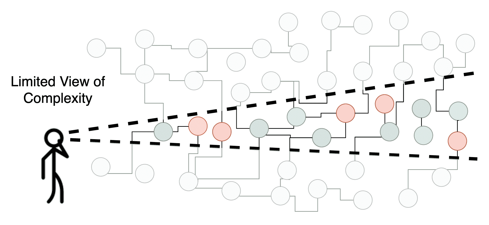
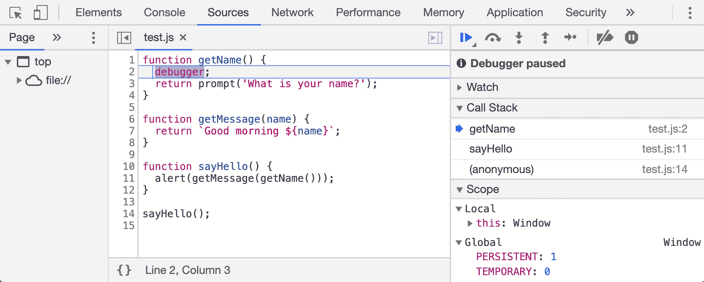
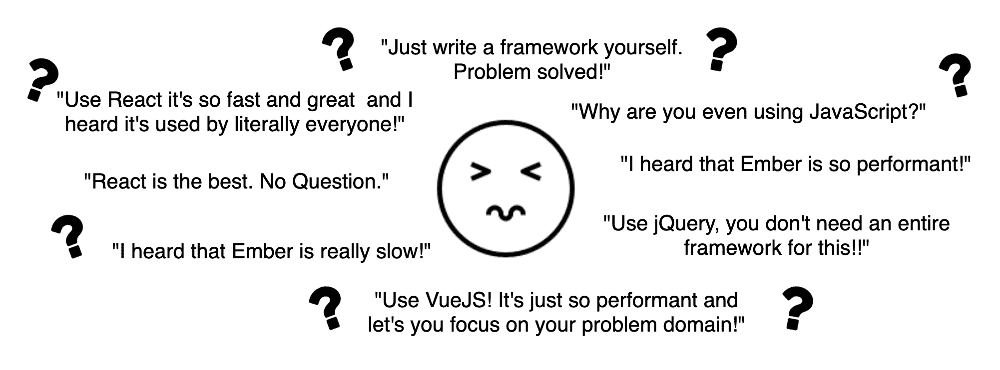

# 别人的代码

复杂多变的人类创造了复杂多变的事物。 然而，与他人和他们的代码打交道是程序员不可避免的一部分。 无论我们是处理由别人构建的库和框架，还是继承整个遗留代码库，面临的挑战都是相似的。 第一步应该总是寻求对代码及其范例的理解。 当我们完全理解代码时，我们就可以开始以一种干净的方式与它交互，使我们能够创建新的功能或在现有工作的基础上进行改进。 在本章中，我们将更详细地探讨这个主题，并通过干净代码的镜头，考虑我们如何单独采取行动，使他人的代码处理起来更轻松。

在本章中，我们将涵盖以下主题:

*   继承代码
*   处理第三方代码

# 继承代码

当我们加入一个新团队或接受一个新项目时，我们通常会继承大量的代码。 我们在这些继承的代码库中保持高效的能力取决于我们对它们的理解。 所以，在我们寻求做出第一个改变之前，我们需要在头脑中建立一个事物如何运作的概念模型。 它不需要是详尽和完整的，但它必须使我们，至少，做出更改，并确切地了解更改可能会对代码库的所有移动部分产生什么影响。

# 探索和理解

完全理解代码库并不是使用它或对它进行更改的严格必要条件，但如果我们对其所有相关部分的复杂性没有充分的了解，那么我们就会陷入陷阱。 当我们相信自己有很好的理解，开始做出改变时，陷阱就发生了。 如果不了解我们的行动的全部影响，我们最终可能会浪费时间，糟糕地执行内容，并产生意外的 bug。 因此，重要的是我们要有适当的消息。 要做到这一点，我们必须首先衡量我们的*视图*对于系统或代码库的复杂性是多么的完整或不完整。



通常我们看不见的东西对我们来说是完全未知的，因此我们没有意识到我们完全缺乏理解。 这可以概括为:*we don’t know what we don’t know*。 因此，在探索新的代码库时，积极主动、充满热情地推动发现和突出我们无知的领域是很有帮助的。 我们可以通过以下三个步骤来做到这一点:

*   :与有经验的同事交谈，阅读文档，使用软件，内化概念结构和层次结构，阅读源代码。
*   :用明智的假设来填补你不确定的地方。 如果您被告知应用有一个注册页面，您可以直观地假设这意味着用户注册涉及典型的个人数据字段，如姓名、电子邮件、密码等。
*   :通过直接查询系统(例如，编写和执行测试)，或询问知情人士(例如，有代码基础经验的同事)，来寻求证明或反驳你的假设。

当涉及到创建和扩展对新代码库的理解时，有一些特定的方法值得采用。 这些步骤包括制作流程图、内化更改的时间轴、使用调试器遍历代码，以及通过测试确认假设。 我们将分别探讨这些问题。

# 做一个流程图

当遇到一个新的代码库时，我们几乎可以立即使用的一个有用的方法是填充思维导图或流程图，不仅突出我们知道的事情，而且突出我们还不确定的事情。 以下是我曾经开发过的一款医疗软件的简化图:


如你所见，我试图概述我的*当前*对用户流的理解，还添加了我个人在*云*注释中遇到的问题或困惑。 随着时间的推移，随着我理解的增长，我可以添加到这个流程图中。

People learn in a huge variety of ways. This visual aid may be more useful for some people but less for others. There are also countless ways of composing such flowcharts. For the goal of personal understanding, it is best to *use whatever works for you*.

# 发现结构，观察历史

假设您面临一个大型 JavaScript 应用代码库，其中包括几种特殊类型的*视图*或*组件*。 我们的任务是在应用中的一个支付表单中添加一个新的下拉列表。 我们通过代码库做了一个快速搜索，并确定了一些不同的下拉菜单相关组件:

*   `GenericDropdownComponent`
*   `DropdownDataWidget`
*   `EnhancedDropdownDataWidget`
*   `TextDropdown`
*   `ImageDropdown`

它们的名称令人困惑，所以我们希望在更改或使用它们之前对它们有更好的理解。 要做到这一点，我们只需打开每个组件的源代码，以确定它如何与其他组件关联(或如何不关联)。

例如，我们最终发现`TextDropdown`和`ImageDropdown`似乎都继承自`GenericDropdownComponent`:

```js
// TextDropdown.js
class TextDropdown extends GenericDropdownComponent {
  //...
}

// ImageDropdown.js
class ImageDropdown extends GenericDropdownComponent {

}
```

我们还观察到`DropdownDataWidget`和`EnhancedDropdownDataWidget`都是`TextDropdown`的亚类。 *增强*下拉窗口小部件的命名可能会让我们感到困惑，而且可能是我们在不久的将来寻求改变的东西，但是，现在，我们需要屏住呼吸，只做我们的任务。

Avoid getting side tracked when you're completing a task within a legacy or unfamiliar code base. Many things may appear odd or wrong, but your task must remain the most important thing. Early on, it is unlikely that you have the level of exposure to the code base that would be necessary to make informed changes.

通过逐步浏览每个与下拉菜单相关的源文件，我们可以在不做任何更改的情况下对它们建立牢固的理解。 如果代码库采用了源代码控制，那么我们也可以*指责*每个文件，以发现谁最初编写了它以及何时编写的。 这可以告诉我们随着时间的推移，事情是如何变化的。 在我们的例子中，我们发现了以下的变化时间轴:


这对我们非常有帮助。 我们可以看到，原来只有一个类(命名为`DropdownComponent`)，后来变成了`GenericDropdownComponent`，有两个子类`TextDropdownComponent`和`ImageDropdownComponent`。 每一个都被重新命名为`TextDropdown`和`ImageDropdown`。 随着时间的推移，这些不同的变化阐明了目前情况的原因。

在查看代码库时，我们通常会做出一个隐含的假设，即它是一次性*创建的*，而且是完全有远见的; 然而，正如我们的时间线所显示的，真相要复杂得多。 代码库随着时间的推移而变化，以响应新的需求。 代码库的工作人员也会发生变化，每个人都不可避免地会有自己解决问题的方式。 我们接受每个代码库缓慢发展的特性，将有助于我们接受它的不完美。

# 逐步执行代码

在构建对大型应用中单个代码段的理解时，我们可以使用工具来调试和研究它是如何工作的。 在 JavaScript 中，我们可以简单地放置一个`debugger;`语句，然后执行应用中激活特定代码的部分。 然后，我们可以逐行遍历代码，以回答以下问题:

*   **这个叫****的代码在哪里?** 一个明确的期望如何激活一个抽象的可以帮助我们建立一个模型*流*或*应用的顺序在我们的头上,使我们能够更准确的判断如何修理或改变某些事情。*
**   **传递给这个代码的是什么?** 一个抽象接收到什么输入的例子可以帮助我们建立一个关于它做什么，以及它期望如何被接口的清晰概念。 这可以直接指导我们对抽象的使用。*   **该代码输出的是什么?** 看到一个抽象的输出，和它的输入结合在一起，可以给我们一个关于它在计算上做什么的真正可靠的想法，并可以帮助我们了解我们可能希望如何使用它。*   **此处存在何种程度的误导或复杂性?** 观察复杂和高堆栈跟踪(意思是，*被函数调用的函数调用的函数，无穷…… 可以表明我们可能在导航和理解某一特定领域的控制和信息流动方面有困难。 这将告诉我们，我们可能需要通过额外的文档或与知情的同事沟通来增强我们的理解。**

 *这里是一个在浏览器环境中这样做的例子(使用 Chrome Inspector):



You can use Chrome's debugger even if you're implementing server-side JavaScript in Node.js. To do this, use the `--inspect` flag when executing your JavaScript, for example, `node --inspect index.js`.

使用这样的调试器可以为我们提供一个*调用堆栈*或*堆栈跟踪*，告诉我们通过代码库到达`debugger;`语句的路径。 如果我们试图理解一个不熟悉的类或模块如何适应一个更大的代码库，这将非常有帮助。

# 维护你的假设

扩展我们对不熟悉代码知识的最好方法之一是编写测试，以确认代码按照我们相信的方式运行。 假设我们要维护这段晦涩的代码:

```js
class IssuerOOIDExtractor {
  static makeExtractor(issuerInfoInterface) {
    return raw => {
      const infos = [];
      const cleansed = raw
        .replace(/[_\-%*]/g, '')
        .replace(/\bo(\d+?)\b/g, ($0, id) => {
          if (issuerInfoInterface) {
            infos.push(issuerInfoInterface.get(id));
          }
          return `[[ ${id} ]]`;
        })
        .replace(/^[\s\S]*?(\[\[.+\]\])[\s\S]*$/, '$1');
      return { raw, cleansed, data: infos };
    };
  }
}
```

这段代码只在几个地方使用，但是各种输入是在应用的一个难于调试的区域动态生成的。 此外，没有文档，也绝对没有测试。 这段代码到底做什么还不清楚，但是，随着我们逐行研究这段代码，我们可以开始做一些基本的假设，并将这些假设编码为断言。 例如，我们可以清楚地看到，`makeExtractor`静态函数本身返回一个函数。 我们可以把这个事实作为检验:

```js
describe('IssuerOOIDExtractor.makeExtractor', () => {
  it('Creates a function (the extractor)', () => {
    expect(typeof IssuerOOIDExtractor.makeExtractor()).toBe('function');
  });
});
```

我们还可以看到一些类型的正则表达式替换; 它似乎在寻找字母`o`后面跟着一串数字(`\bo(\d+?)\b`)的模式。 我们可以通过编写一个简单的断言来开始探索这个提取功能，在断言中我们给提取器一个匹配该模式的字符串:

```js
const extractor = IssuerOOIDExtractor.makeExtractor();

it('Extracts a single OOID of the form oNNNN', () => {
  expect(extractor('o1234')).toEqual({
    raw: 'o1234',
    cleansed: '[[ 1234 ]]',
    data: []
  });
});
```

当我们慢慢发现代码的作用时，我们可以添加额外的断言。 我们可能永远无法完全理解，但这是可以的。 在这里，我们断言提取器能够正确地提取单个字符串中的多个 ooid:

```js
it('Extracts multiple OOIDs of the form oNNNN', () => {
  expect(extractor('o0012 o0034 o0056 o0078')).toEqual({
    raw: 'o0012 o0034 o0056 o0078',
    cleansed: '[[ 0012 ]] [[ 0034 ]] [[ 0056 ]] [[ 0078 ]]',
    data: []
  });
});
```

运行这些测试时，我们观察到以下成功的结果:

```js
 PASS ./IssuerOOIDExtractor.test.js
  IssuerOOIDExtractor.makeExtracator
    ✓ Creates a function (the extractor) (3ms)
    The extractor
      ✓ Extracts a single OOID of the form oNNNN (1ms)
      ✓ Extracts multiple OOIDs of the form oNNNN (1ms)
```

请注意，我们仍然不能完全确定原始代码的作用。 我们只是触及了表面，但这样做，我们正在构建一个有价值的理解基础，这将使我们在未来更容易地与代码进行交互或更改。 通过每个新的成功断言，我们更接近于完整和准确地理解代码的功能。 如果我们将这些断言作为一个新的测试提交，那么我们也将改进代码库的测试覆盖率，并为可能同样被代码困惑的未来同事提供帮助。

既然我们已经扎实地掌握了如何探索和理解继承的代码段，现在我们可以看看如何对该代码进行*更改*。

# 进行更改

一旦我们对代码库的某个区域有了很好的理解，我们就可以开始进行更改了。 然而，即使在这个阶段，我们也应该保持谨慎。 对于代码库和它所涉及的系统，我们仍然相对较新，所以我们可能仍然不知道它的许多部分。 任何变化都可能产生不可预见的影响。 因此，为了继续前进，我们必须缓慢而周到地进行，确保我们的代码经过良好的设计和测试。 这里有两种我们需要注意的方法:

*   在不熟悉的环境下进行孤立性改变的精细的*手术*过程
*   通过测试确认更改

让我们一个一个地探索这些问题。

# 微创手术

当需要更改旧的或不熟悉的代码库区域时，可以想象您正在执行一种*微创手术*。 这样做的目的是最大化更改的积极影响，同时最小化更改本身的占用，确保不会损害或对代码库的其他部分产生太大的影响。 这样做的希望是，我们将能够产生必要的变化(*上*)，而不会让自己暴露在太多的可能的破坏或漏洞(*下*)。 当我们不确定更改是否完全必要时，这也是有用的，因此我们想在最初只花费最小的努力。

假设我们继承了一个负责呈现单一图像的`GalleryImage`组件。 在我们的 web 应用中有很多地方使用它。 该任务是添加当资源的 URL 表明它是一个视频时进行渲染的视频功能。 CDN url 有两种:

*   `https://cdn.example.org/VIDEO/{ID}`
*   `https://cdn.example.org/img/{ID}`

可以看到，图像和视频 url 之间有明显的区别。 这为我们提供了一种简单的方法来区分如何在页面上呈现这些媒体片段。 理想情况下，我们应该实现一个名为`GalleryVideo`的新组件来处理这种新类型的媒体。 像这样的新组件将能够唯一地满足视频的*问题域*，这与图像的问题域明显不同。 至少，一个视频必须通过`<VIDEO>`元素渲染，而一个图像必须通过``渲染。

我们发现很多情况下`GalleryImage`不使用测试和一些依赖于模糊的内部实现细节,很难辨别散装(例如,很难做一个查找和替换如果我们想要改变所有`GalleryImage`用法)。

我们的选择如下:

1.  创建一个*容器*`GalleryAsset`组件，它自己根据 CDN URL 决定是渲染`GalleryImage`还是`GalleryVideo`。 这将涉及到必须替换目前使用的`GalleryImage`:
    *   时间估算:**1-2 周**
    *   **重要的**
    *   **显著**
    *   建筑*洁净度*:**高**
2.  在`GalleryImage`中添加一个条件，可选地呈现`<video>`而不是基于 CDN URL 的``标签:
    *   时间估算:**1-2 天**
    *   **最小**
    *   **最小**
    *   *洁净度*:**中等**

在理想的情况下，如果我们考虑代码库的长期架构，很明显创建一个新的`GalleryAsset`组件的第一个选择是最好的选择。 它为我们提供了一个明确定义的抽象，能够直观地满足图像和视频这两种情况，并为我们提供了在未来添加不同资产类型的可能性(例如，*音频*)。 然而，它将需要更长的时间来实现，并带有相当大的风险。

第二种选择实现起来要简单得多。 事实上，它可能只涉及以下四行更改集:

```js
@@ -17,6 +17,10 @@ class GalleryImage {
  render() {

+   if (/\/VIDEO\//.test(this.props.url)) {
+     return <video src={this.props.url} />;
+   }
+
    return 

  }
```

这未必是一个好的长期选择，但它提供了我们可以立即交付给用户的东西，满足他们的需求和涉众的需求。 一旦发货，我们就可以计划未来的时间来完成更大的必要更改。

重申一下，像这样的*微创*更改的价值在于，它减少了代码库在实现时间和潜在破坏方面的直接负面影响(*风险*)。 显然，至关重要的是，我们要确保在短期收益和长期收益之间取得平衡。 通常,利益相关者会压力程序员实现变化很快,但如果没有*技术**部门或和解进程,那么所有的这些【显示】微创的变化可以收集到相当可怕的野兽。*

 *为了确保我们更改的代码不会太微妙或容易导致未来的倒退，明智的做法是在它们旁边编写测试，对我们的期望进行编码。

# 作为测试进行编码更改

我们已经探讨了如何编写测试来发现和指定当前的功能，并且，在前面的章节中，我们讨论了遵循**测试驱动开发**(**TDD**)方法的明显好处。 因此，当我们在一个不熟悉的代码库中操作时，我们应该始终通过清晰编写的测试来确认我们的更改。

Writing tests alongside your changes is definitely a need when there are no existing tests. Writing the first test in an area of code can be burdensome in terms of setting up libraries and necessary mocks, but it is absolutely worth it.

在我们前面介绍的将视频渲染到`GalleryImage`的例子中，明智的做法是添加一个简单的测试，以确认当 URL 包含`"/VIDEO/"`子字符串时，`<VIDEO>`是否正确渲染。 这防止了未来回归的可能性，并给了我们一个强大的信心，它可以按照预期工作:

```js
import { mount } from 'enzyme';
import GalleryImage from './GalleryImage';

describe('GalleryImage', () => {
  it('Renders a <VIDEO> when URL contains "/VIDEO/"', () => {
    const rendered = mount(
      <GalleryImage url="https://cdn.example.org/VIDEO/1234" />
    );
    expect(rendered.find('video')).to.have.lengthOf(1);
  });
  it('Renders a  when URL contains "/img/"', () => {
    const rendered = mount(
      <GalleryImage url="https://cdn.example.org/img/1234" />
    );
    expect(rendered.find('img')).to.have.lengthOf(1);
  });
});
```

这是一个相当简单的测试; 然而，它完全编码了我们做出更改后的期望。 当进行小的、自包含的更改或较大的系统更改时，通过这样的测试来验证和沟通我们的意图是非常有价值的。 除了防止回归，它们还帮助我们的同事进行即时代码审查，帮助整个团队编写文档，提高总体可靠性。 因此，有一个团队命令或政策说:*如果没有一个测试*，你就不能提交更改，这是很正常的，也是更好的。 随着时间的推移，实施这一原则将创建一个代码库，为用户提供更可靠的功能，并使其他程序员更乐意与之合作。

我们现在已经完成了关于继承代码的部分，所以你应该对如何处理这样的情况有一个很好的基础知识。 处理他人代码的另一个挑战是第三方代码的选择和集成，即库和框架。 我们现在就来探讨一下。

# 处理第三方代码

JavaScript 中充满了无数的框架和库，它们可以减轻实现所有类型功能的负担。 在[第 12 章](12.html)、*、*中，我们了解了在 JavaScript 项目中包含外部依赖所涉及的困难。 现代 JavaScript 生态系统在这里提供了丰富的解决方案，因此处理第三方代码比以前少了很多负担。 尽管如此，必须与此代码交互的本质并没有真正改变。 我们仍然希望我们所选择的第三方库或框架能够提供直观的、文档完备的接口，以及能够满足我们需求的功能。

在处理第三方代码时，有两个关键过程将定义我们所获得的持续风险或收益。 第一个是*选择*过程，我们可以选择使用哪个库，第二个是我们将库集成到代码库中并进行调整。 现在我们将详细讨论这两个问题。

# 选择和理解

选择库或框架可能是一个有风险的决定。 如果选择了错误的方法，它最终可能会驱动系统的大部分架构。 框架在这方面尤其臭名昭著，因为从本质上讲，它们规定了架构的结构和概念基础。 选择一个错误的，然后试图改变它可能是一个相当大的努力; 它涉及到对应用中几乎每一段代码的更改。 因此，练习仔细考虑和选择第三方代码的技巧是至关重要的:



为了帮助我们进行选择，我们可以考虑以下几点:

*   :库或框架必须满足一组固定的函数期望。 重要的是要以足够详细的方式指定这些内容，以便不同的选项可以量化地进行比较。
*   **兼容性**:该库或框架必须与代码库当前的工作方式基本兼容，并且必须能够以一种技术上简单、便于同事理解的方式进行集成。
*   **可用性**:库或框架必须易于使用和理解。 它应该有良好的文档和一定程度的直觉，允许立即生产，没有痛苦或混乱。 当您遇到与使用有关的问题或问题时所发生的事情也属于可用性的范畴。
*   **:应该维护库或框架，并有一个清晰和可信的流程来报告和解决 bug，特别是那些可能有安全后果的 bug。 变更日志应该是详尽的。**

The four criteria here can be informed, as well, by heuristics such as *who is the project backed by?*, *how many people are making use of the project?*, or *am I familiar with the team who built it?*. Be warned though, these are only heuristics and so are not perfect ways of measuring the suitability of *third-party code*.

然而，即使使用这四个标准，我们也可能陷入陷阱。 如果你还记得,在第 3 章,*干净代码的敌人,我们讨论了最著名的*自我(或自我*)和船货崇拜【显示】。 在选择第三方代码时，这些也是相关的。 要特别注意以下几点:***

 ****   :把我们自己从决策过程中分离出来是非常重要的，要警惕我们的无知和偏见。 程序员是出了名的固执己见。 重要的是，在这些时刻，我们要退后一步，用纯粹的逻辑思考我们认为什么是最好的。 关键是要让每个人都有发言权，并根据他们自身的优点来衡量人们的观点和轶事，而不是根据他们的资历(或其他个人特征)。
*   :不要被流行所左右。 由于其社区的规模和狂热，很容易被引入一个流行的抽象，但再一次，后退一步，孤立地考虑框架的优点是至关重要的。 当然，受欢迎可能意味着更容易整合和更丰富的学习资源，因此，从这个角度来说，谈论是合理的，但要小心，不要把受欢迎作为唯一的优势指标。
*   **分析瘫痪**:选择太多了，你可能会因为害怕做出错误的选择而无法做出选择。 大多数时候，这些决定是可逆的，所以做出一个不太理想的选择并不是世界末日。 很容易在很多时间使用情况决定哪些框架或库选择当效率将会大大提高挑*,然后迭代或主日后根据不断变化的需求。*

 *在做出关于第三方库的决策时，关键是充分考虑它们对代码库的最终影响。 我们花在做决定上的时间应该与它们的潜在影响成正比。 决定使用一个客户端框架来呈现组件可能是一个相当有影响的选择，因为它可能规定了很大一部分代码库，然而，例如，一个小型 url 解析实用程序不会有很大的影响，而且将来可以很容易地换掉。

接下来，我们可以讨论如何集成和封装一段第三方代码，遵循一个知情的选择过程。

# 封装和调整第三方代码

选择第三方抽象(尤其是框架)的缺点是，您最终可能会更改代码库，以适应抽象作者的任意约定和设计决定。 通常，我们被要求使用这些第三方接口的*语言*，而不是让他们*使用我们的语言*。 事实上，在许多情况下，可能是抽象的约定和设计吸引了我们，所以我们非常乐意让它驱动我们代码库的设计和性质。 但是，在其他情况下，我们可能希望免受所选择的抽象的更多保护。 我们可能希望将来可以轻松地将它们替换为其他抽象，或者我们可能已经有了一套我们喜欢使用的约定。

在这种情况下，封装这些第三方抽象并纯粹通过我们自己的抽象层来处理它们可能是有用的。 这种层通常被称为*适配器:*


非常简单，一个*适配器*将提供我们设计的接口，然后将委托给第三方抽象来完成它的任务。 想象一下，如果我们希望使用一个名为`YOORL`的 url 解析实用程序。 我们认为它完全符合我们的需求，并且完全符合 RFC 3986 (URI 标准)。 唯一的问题是它的 API 相当繁琐和冗长:

```js
import YOORL from 'yoorl';
YOORL.parse(
  new YOORL.URL.String('http://foo.com/abc/?x=123'),
  { parseSearch: true }
).parts();
```

这将返回以下*对象*:

```js
{
  protocol: 'http',
  hostname: 'foo.com',
  pathname: '/abc',
  search: { x: 123 }
}
```

我们希望 API 能简单得多。 我们认为，当前 API 的长度和复杂性将使我们的代码库面临不必要的复杂性和风险(例如，调用错误的方式的风险)。 使用一个*适配器*将允许我们将这个非理想的接口包装成我们自己设计的接口:

```js
// URLUtils.js
import YOORL from 'yoorl';
export default {
  parse(url) {
    return YOORL.parse(
      new YOORL.URL.String(url)
    ).parts();
  }
};
```

这意味着我们代码库中的任何模块现在都可以与这个简化的*适配器接口，*将它们与 YOORL 的不理想 API 隔离:

```js
import URLUtils from './URLUtils';

URLUtils.parse('http://foo.com/abc/?x=123'); // Easy!
```

适配器可以被认为是*翻译媒介*，允许我们的代码库*使用它所选择的*语言，而不必因第三方库的任意和不一致的设计决定而减慢速度。 这不仅有助于代码库的可用性和直观性，而且使我们能够非常容易地对底层第三方库进行更改，而根本不需要更改许多行代码。

# 总结

在本章中，我们探讨了一个棘手的话题:*他人代码*。 我们已经考虑了如何处理我们继承的遗留代码; 我们如何构建对它的理解，如何轻松地调试和做出更改，以及如何使用良好的测试方法确认更改。 我们还讨论了处理第三方代码的困难，包括如何选择它，以及如何通过*Adapter*模式以规避风险的方式与它进行接口。 在这一章中，我们还可以讨论很多其他的事情，但希望我们已经探索的主题和原则能够让你充分理解如何在一个干净的代码库中浏览他人的代码。

在下一章中，我们将讨论沟通的话题。 它可能看起来无关紧要，但对于程序员来说，无论是在工作场所还是与用户之间的沟通，都是绝对重要的技能，没有它，就不可能写出干净的代码。 我们将特别探讨如何计划和设定要求，如何与同事合作和沟通，以及如何推动我们的项目和工作场所的变化。******