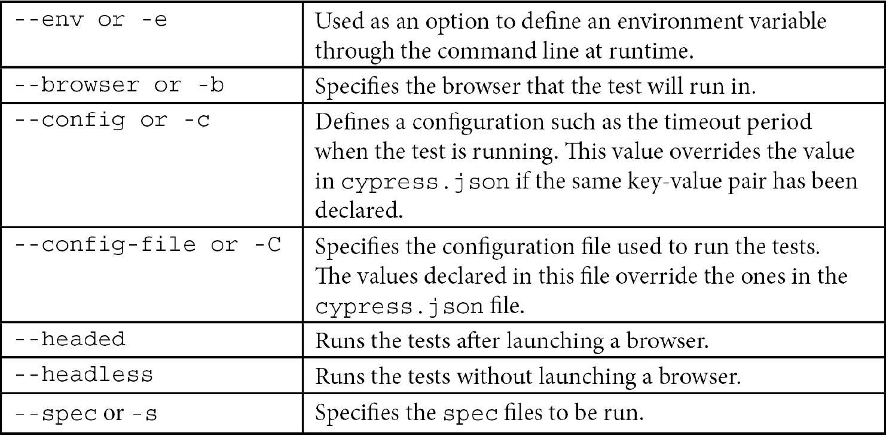
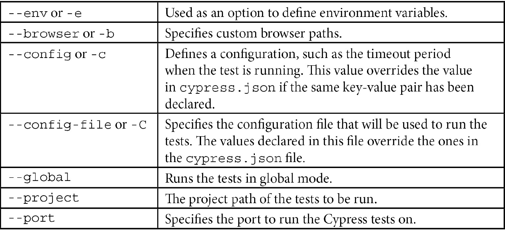
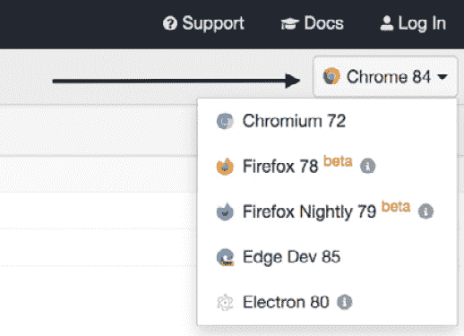
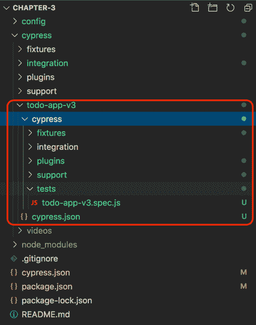

# 三、使用Cypress命令行工具

在前一章中，我们学习了 Cypress 与其他测试自动化工具(如 Selenium)的不同之处，以及它在 web 自动化测试中的突出表现。在这一章中，我们将利用我们的知识，使用命令行工具使用Cypress。为此，我们将介绍您可以用来利用Cypress功能的命令。

一些命令将涉及一些功能，例如运行单独或所有测试、调试 Cypress、在不同浏览器上启动 Cypress 测试以及其他 Cypress 命令行功能。我们将在本章中引用 GitHub 存储库文件夹，将要编写的每个命令和代码都将包含在存储库中，供您参考和实践。

我们将在本章中讨论以下关键主题:

*   运行Cypress命令
*   理解基本的Cypress命令
*   命令行上的 Cypress 调试

一旦你完成了这些题目，你就可以开始写你的第一个测试了。

## 技术要求

本章的 GitHub 资源库可在[https://GitHub . com/packt publishing/端到端-Web-Testing-with-Cypress](https://github.com/PacktPublishing/End-to-End-Web-Testing-with-Cypress) 上找到。

本章的源代码可以在`chapter-03`目录中找到。

要运行本章中的示例，您需要克隆本书的 GitHub 存储库，并遵循`READMe.md`文件中关于如何正确设置和运行测试的说明。您可以在[https://docs . GitHub . com/en/free-pro-team @ latest/GitHub/creating-cloning-and-archive-repository/cloning-a-repository](mailto:https://docs.github.com/en/free-pro-team@latest/github/creating-cloning-and-archiving-repositories/cloning-a-repository)上阅读更多关于如何使用 GitHub 在本地机器上克隆项目的信息。

# 运行Cypress命令

Cypress 框架的有效利用需要您了解 Cypress 以及如何使用命令行运行不同的功能。Cypress命令允许Cypress框架的用户自动化过程，并且在初始化和运行时向框架和测试提供特定的指令。

在大多数情况下，通过命令行运行Cypress测试比使用浏览器运行测试更快。这是因为通过命令行运行测试减少了运行特定测试所需的资源数量。这样做的原因是，在命令行中运行的测试通常是无头的，这意味着分配给运行测试的资源更少，这与在有头模式下执行测试不同。

重要说明

Headed 模式是在浏览器上可以直观地看到测试运行的时候，而在 headed 模式下，测试执行过程不会打开一个可见的浏览器。相反，所有测试都在命令行上运行和输出。

首先，让我们看看如何运行全局和本地的 Cypress 命令。

## 全局和局部命令

Cypress命令可以从包含Cypress安装和代码的特定目录运行，或者从全局Cypress安装运行。在全球范围内安装Cypress确保用户可以从操作系统中的任何目录运行Cypress，而在本地安装Cypress时，只能从安装它的单个目录访问Cypress。

### 运行全局Cypress命令

Cypress中的全局命令通过访问Cypress的全局安装版本来运行。运行 Cypress 的全局版本时调用的命令不一定是由用户生成或定义的，因为它们是内置在框架中的。为了能够全局运行 Cypress 命令，您需要使用以下命令全局安装 Cypress:

```js
npm install cypress --global
or (shorter version)
npm i -g cypress
```

前面的命令将全局安装Cypress，并确保根据所提供命令的执行情况，从任何Cypress安装目录调用任何已知的Cypress命令都会产生结果或错误。

要运行全局命令，需要使用`cypress`关键字定义命令，然后是命令；例如`cypress run`或`cypress open`。

### 运行本地Cypress命令

本地Cypress命令是从Cypress全局命令派生的，是全局运行命令的替代。要在本地运行 Cypress 命令，您需要使用以下命令在目录中安装 Cypress:

```js
npm install cypress 
or (shorter version)
npm i cypress
```

我们可以通过在`scripts`部分下的`package.json`文件中定义所需的命令来将它们集成到开发环境中，如下所示:

```js
{
  "scripts": {
    "cypress:run": "cypress run",
    "cypress:open": "cypress open"
  }
}
```

向`package.json`添加命令允许我们使用这些命令，就像我们对 JavaScript 包执行 npm 命令一样。在`package.json`文件中定义的命令是由 Node.js 环境在运行时解释的，当执行时，它们就像命令是全局命令一样被执行。

重要说明

建议您在运行`npm install cypress`命令之前，在终端中运行`npm init`命令。如果在没有初始化项目的情况下运行Cypress，Cypress的目录将不可见。通过运行`init`命令，Cypress将项目目录识别为现有项目，因此它初始化并创建其目录，而无需我们在终端上运行额外的命令。

在`package.json`中定义命令不仅让开发人员和 QA 工程师更容易知道要运行哪些命令，还简化了一个人在运行、调试或维护他们的测试时需要运行的命令的性质。

重要说明

Cypress开发团队建议每个项目安装Cypress，不要使用全局安装方法。本地安装提供了某些优势，例如用户能够快速更新Cypress依赖关系，并减少循环依赖问题，这些问题会破坏不同项目中的一些测试，而Cypress在另一个项目中运行良好。

要在命令行中运行脚本，您需要调用`npm run`，后跟命令的名称。在我们之前定义的命令中，您只需要运行以下命令来同时执行这些命令:

```js
npm run cypress:run  // command  to run tests on terminal
npm run cypress:open // command to run tests on cypress runner
```

是时候快速回顾一下了。

## 回顾–运行Cypress命令

在本节中，我们学习了如何调用本地或全局命令，以及如何从Cypress终端或测试运行程序运行测试，该程序使用图形用户界面。在下一节中，我们将基于我们已经获得的运行 Cypress 命令的知识来了解不同的命令在 Cypress 中是如何使用的。

# 理解基本的Cypress命令

在本节中，我们将探索各种Cypress命令，我们可以通过终端或使用Cypress测试运行程序来运行我们的测试。我们还将观察如何使用命令来获得不同的结果。本节还将向我们介绍定制不同的测试，这些测试与我们的应用交互以获得特定的结果。我们将深入探讨最常见的 Cypress 命令，以及如何通过预构建在 Cypress 框架中的选项来扩展这些命令。我们将探索的命令如下:

*   `cypress run`
*   `cypress open`
*   `cypress info`
*   `cypress version`

先说`cypress run`。

## Cypress跑

`cypress run`命令以无头方式执行一个Cypress套件中的所有测试，默认情况下在电子浏览器中运行测试。如果没有扩展任何其他配置，该命令将运行Cypress的`integration`文件夹中所有`.spec.js`格式的文件。`Cypress run`命令可以通过以下配置选项运行:

```js
cypress run {configuration-options}
```

最常见的Cypress配置选项包括:



接下来的几节将对上表中显示的每个配置选项进行扩展。

### Cypress跑步-环境<env-variable></env-variable>

Cypress环境变量是*动态名称-值对*，影响Cypress执行测试的方式。当需要在多个环境中运行测试时，或者当定义的值易于快速变化时，这些环境变量非常有用。

在 Cypress 中，您可以将单个或多个环境变量定义为字符串或 JSON 对象。

在这一部分，我们将为一个开源的应用编写测试。这些测试的代码库可以在本书的 GitHub 存储库中的`chapter 03`目录中找到。正在测试的应用是一个在 React 中开发的**待办事项列表**应用。使用该应用，我们可以添加我们的待办事项，将其标记为已完成，删除它们，查看已完成的项目，甚至可以在*活动的*、*所有*和*已完成的*待办事项之间切换。

使用该应用，我们可能计划扩展该应用，以使用 **HTTPS** 而不是当前的 **HTTP** 协议来提供该应用的安全版本。尽管目前不支持 HTTPS 的功能，但我们可以在Cypress测试中使用我们的环境变量为其添加规定。为了实现这一点，我们将把**传输协议** URL 部分定义为一个环境变量，然后将其传递给我们在`package.json`中的命令，如下例所示。

以下代码片段可以在`chapter 03`子文件夹中提到的 GitHub 资源库中找到。`Todo-app.spec.js`文件的完整源代码位于`Cypress/integration/examples`文件夹下。我们将在本章中探索的Cypress测试是版本 1 测试。

下面的`Todo-app.spec.js`文件演示了当导航到一个 URL 时如何使用环境变量。它是主要的测试文件，位于本书 GitHub 存储库中的`chapter-03/cypress/integration/examples/todo-app.spec.js`:

```js
... 
context('TODO MVC Application Tests', () => {
  beforeEach(() => {
    cy.visit(
      `${Cypress.env('TransferProtocol')}://todomvc.com/examples/react/#/`)
  });
...
```

下面的`package.json`文件也位于`chapter-03/`目录中，保存了用来执行 JavaScript 应用的测试或执行命令的所有命令。它位于`chapter-03/`目录的根位置:

```js
...
"scripts": {
    "cypress:run": "cypress run --env 
    TransferProtocol='http'",
    "cypress:run:v2": "cypress run --env 
    TransferProtocol='https'",
  },
...
```

前面的脚本演示了在网址协议发生变化的情况下，我们可以运行前面提到的任何测试命令来替换我们在运行Cypress测试时在网址中声明的环境变量。我们可以用`npm run cypress:run`和`npm run cypress:run:v2`连续执行前面的脚本。

重要说明

HTTPS 和 HTTP 一样，不同的是 HTTPS 更安全。这是因为发送请求和接收响应的过程是使用 TLS(SSL)安全协议加密的。

传输协议是 URL 的一部分，它决定了 URL 是使用 HTTP 协议还是 HTTPS 协议。使用 HTTP 协议的网址以`http://`开头，而使用 HTTPS 的网址以`https://`开头。

### Cypress跑步浏览器<browser-name></browser-name>

Cypress命令行内置了在不同浏览器中运行Cypress测试的功能，这些浏览器已经在主机上安装了，并且受到Cypress框架的支持。Cypress尝试自动检测已安装的浏览器，并且可以在`chrome`、`chromium`、`edge`、`firefox`或`electron`中运行测试。要在特定浏览器中运行测试，您需要使用`--browser`配置选项提供浏览器名称。您也可以选择提供浏览器路径而不是浏览器名称；只要 Cypress 有效并支持，它仍将在提供的浏览器路径中运行测试。

下面的代码片段显示了已经在本书 GitHub 存储库的`chapter-03`目录中的`package.json`的`scripts`部分定义的脚本。这些脚本定义了我们的测试将在其中运行的浏览器，并且还为 URL 的一部分传入了一个环境变量:

```js
...
"scripts": {
    "cypress:chrome": "cypress run --env 
    TransferProtocol='http' --browser chrome",
    "cypress:firefox": " cypress run --env 
    TransferProtocol='http' --browser firefox"
  },
...
```

在前面的命令中，我们可以分别使用`npm run cypress:chrome`和`npm run cypress:firefox`命令在 Chrome 或 Firefox 中运行测试。

重要说明

要在特定的浏览器中运行测试，浏览器必须安装在您的机器上，并且它也必须在Cypress支持的浏览器列表中。

### Cypress运行配置<configuration></configuration>

Cypress可以使用终端上运行的命令设置和覆盖配置。“Cypress”配置既可以作为单个值传递，也可以作为用逗号分隔的多个值传递，还可以作为字符串化的 JSON 对象传递。在Cypress中定义的任何配置都可以通过`cypress run --config`配置选项进行更改或修改。配置选项可能包括指定替代的`viewportHeight`和`ViewportWidth`、超时和文件更改等配置。在我们的脚本中，我们将更改 Cypress 运行测试的视口，我们将在 763x700 的平板电脑视口中运行测试，而不是默认视口 1000x660。

下面的代码片段是在我们的`chapter-03`根目录的`package.json`文件中定义的。以下脚本用于在平板电脑视口中运行测试。为此，必须覆盖视口高度和宽度的“Cypress”默认配置:

```js
...
"scripts": {
"cypress:tablet-view": "cypress run --env TransferProtocol='http' --config viewportHeight=763,viewportWidth=700",
}
...
```

上一个脚本可以用`npm run cypress:tablet-view`命令运行。

重要说明

在 Cypress 中传递多个配置选项时，不同配置的逗号分隔值之间不要留有空格(如前面的代码所示)；否则，Cypress 将抛出一个错误。

### Cypress运行配置文件<configuration-file></configuration-file>

Cypress可以覆盖位于`/cypressRootDirectory/cypress.json`的默认配置文件。您可以定义一个或多个辅助Cypress配置文件，以便运行它们的测试。Cypress 还允许您完全禁用配置文件的使用。

下面的脚本位于我们的`chapter-03`目录的根目录下的`package.json`中，是一个命令，它使Cypress能够覆盖它用来运行测试的配置文件。执行命令时，将使用位于`chapter-03/config/cypress-config.json`下的`cypress-config.json`文件，而不是使用位于`chapter-03`的默认`cypress.json`文件:

```js
...
"scripts": {
"cypress:run:secondary-configuraton": "cypress run --env TransferProtocol='http' --browser chrome --config-file config/cypress-config.json"
},...
```

要运行前面的脚本，您需要运行`npm run cypress:run:secondary-configuraton`命令，该命令将使用位于`/cypressRootDirectory/config/cypress-config.json`的配置文件运行测试。

### Cypress奔跑

Cypress 提供了一个命令，允许你在无头和头模式下运行浏览器。定义了 headed 模式后，测试运行时会打开浏览器。该选项可以在Cypress附带的默认电子浏览器中使用。在 electronic 中使用`run`命令运行 Cypress 测试的默认模式是无头模式，要覆盖这一点，我们需要在测试运行时通过`--headed`配置。

以下脚本可以在`package.json`文件中找到，该文件位于本书 GitHub 资源库的`chapter-03`目录中。运行以下脚本命令将使 Cypress 能够在 headed 模式下运行，这允许正在运行的测试在浏览器上可见:

```js
...
"scripts": {
"cypress:electron:headed": "cypress run --env TransferProtocol='http' --headed"
},
...
```

上一个脚本可以用`npm run cypress:electron:headed`命令运行。

### Cypress无头跑

Cypress在 headed 模式下同时在 Chrome 和 Firefox 浏览器中运行测试，每次运行测试时都会启动一个浏览器。要改变这种行为并确保测试运行在不启动浏览器的情况下进行，您需要配置运行 Chrome 或 Firefox 浏览器的命令，以便它们无标题运行。

以下脚本可以在`package.json`文件中找到，该文件位于本书 GitHub 资源库的`chapter-03`目录中。运行以下命令将使 Cypress 能够以无头模式运行，在无头模式下，只能看到测试命令在命令行界面上运行:

```js
...
"scripts": {
"cypress:chrome:headless": "cypress run --env TransferProtocol='http' --browser chrome --headless",
"cypress:firefox:headless": "cypress run --env TransferProtocol='http' --browser firefox --headless"
},
...
```

要使用前面的命令在无头模式下运行 Chrome，您需要运行`npm run cypress:chrome:headless`。要在 Firefox 中以无头模式运行命令，您需要运行`npm run cypress:firefox:headless`命令。

### Cypress跑步规范

Cypress允许我们指定可以运行的不同测试文件。使用该命令，可以指定一个*单个*测试文件在一个目录中运行，而不是在一个目录中运行*所有的*测试文件。还可以在不同的目录中指定不同的测试，以便它们同时运行，并指定与特定目录匹配的正则表达式模式。

以下代码片段是`package.json`文件的一部分，该文件位于本书 GitHub 存储库的`chapter-03`目录中。第一个脚本只能运行目录中的特定文件，而第二个脚本可以运行单个目录中的多个文件:

```js
... 
"scripts": {
  "cypress:integration-v2:todo-app": "cypress run --env 
  TransferProtocol='http' --spec 'cypress/integration/
  integration-v2/todo-app.spec.js'",
  "cypress:integration-v2": "cypress run --env 
  TransferProtocol='http' --spec 'cypress/
  integration/integration-v2/**/'"
},
...
```

第一个命令指定测试将运行`todo-app.spec.js`文件，该文件位于`integration-v2`文件夹中。第二个命令将运行位于`integration-v2`文件夹中的所有测试文件。

## Cypress开

`cypress open`命令在测试运行程序中运行Cypress测试，配置选项应用于您正在运行的项目的测试。运行`cypress open`命令时通过的配置选项也会覆盖`cypress.json`文件中指定的默认值，如果在测试运行时指定了配置，该文件位于`tests root`文件夹中。以下命令显示了如何运行任何`cypress open`命令:

```js
cypress open {configuration-options}
```

命令的第一部分显示`cypress open`命令，第二部分显示可以与之链接的配置选项。

最常见的Cypress配置选项包括:



在接下来的几节中，我们将详细讨论每个选项。

### Cypress开放环境<env-variable></env-variable>

就像运行`cypress run`命令一样，`cypress open`命令可以用测试运行时声明的指定环境变量来运行。与`cypress run`命令类似，在测试运行程序中运行测试时，可以使用`--env`配置选项声明一个或多个环境变量。

在前一节中，我们通过在`cypress run`命令中传递一个环境变量，指定了如何通过命令行运行测试。我们将通过相同的环境变量，使用我们的Cypress测试运行程序运行测试，测试应该运行良好。传递的环境变量将决定**到**应用网址的传输协议是 **HTTP** 还是安全的 **HTTPS** 。

下面的代码片段位于`Todo-app.spec.js`文件中，这是我们`chapter-03/`目录中的主测试文件。`todo-app.spec.js`文件可以在`chapter-03/`目录下的`integration/examples`下找到。在下面的片段中，就像在`cypress run`中一样，我们可以使用`cypress open`命令将环境变量传递给网址:

```js
... 
context('TODO MVC Application Tests', () => {
  beforeEach(() => {
    cy.visit(
      `${Cypress.env('TransferProtocol')}://todomvc.com/examples/react/#/`)
  });
...
```

以下代码片段位于`package.json`文件中的`chapter-03/`根目录。使用这个片段，我们将`'http'`环境变量传递给我们的测试。这时我们可以完成我们的网址并执行我们的测试:

```js
...
"scripts": {
    "cypress:open": "cypress open --env 
    TransferProtocol='http'"
  },
...
```

要打开测试运行器并验证测试是否运行，您可以运行`npm run cypress:open`，此时会自动将**传输协议**环境变量添加到运行测试的配置中。

### Cypress打开浏览器

指定后，`--browser`选项指向，这是一个自定义浏览器，将被添加到测试运行程序的可用浏览器列表中。要添加的浏览器必须得到Cypress的支持，并且必须安装在运行Cypress测试的机器上。

默认情况下，在选择要运行的规范之前，通过单击测试运行程序中的浏览器选择按钮，可以在Cypress中查看所有可用的浏览器。浏览器选择下拉列表包含系统上已安装的所有浏览器，并且受Cypress支持。浏览器选择下拉菜单还允许您切换测试浏览器，从而在不同的浏览器下测试功能:



图 3.1–测试浏览器选择下拉列表

要指定路径以便可以添加浏览器(例如，Chromium)，您需要具有以下配置来将 Chromium 添加到可用浏览器列表中。在这里，你需要运行`npm run cypress:chromium`命令。

以下脚本位于本书 GitHub 存储库中`package.json`文件下的`chapter-03/`目录中。当脚本作为命令执行时，它将在指定位置查找浏览器，并将其添加到用于运行Cypress测试的浏览器列表中:

```js
...
"scripts": {
    "cypress:chromium": "cypress open --browser 
    /usr/bin/chromium"
  },
..
```

为了执行前面的脚本来运行我们的测试，我们需要在我们的终端中运行`npm run cypress:chromium`命令。这将在`location` `/usr/bin/chromium`中找到铬浏览器，并使用它来运行我们的测试。

### Cypress开放配置<configuration-option></configuration-option>

Cypress框架允许我们在测试运行器中运行测试，并提供初始化测试运行器时必须通过的配置选项。在传递`--config`选项时，可以传递一个环境变量，也可以传递多个用逗号分隔的环境变量。以下脚本指定视口尺寸应为平板电脑的尺寸，并且配置通过`–config`选项传递。要运行所需的命令，您需要运行`npm run cypress:open:tablet-view`。

以下脚本位于本书`chapter-03/`根目录的`package.json`文件中，用于更改在可见浏览器上运行的测试的视口配置:

```js
...
"scripts": {
    "cypress:open:tablet-view":"cypress open --env 
    TransferProtocol='http' --config 
    viewportHeight=763,viewportWidth=700"
  },
...
```

执行时，命令修改浏览器大小的默认Cypress配置。提供的视口高度和视口宽度将以类似于平板显示器的方式显示内容。

重要说明

使用`--config`选项指定的配置选项将覆盖`cypress.json`文件中指定的默认配置。

### Cypress打开配置文件<configuration-file></configuration-file>

就像在`Cypress run`命令的情况下一样，通过测试运行器运行的Cypress测试可以有一个覆盖默认`cypress.json`文件的覆盖配置文件，该文件包含默认Cypress配置。它位于测试文件的根文件夹中。

以下代码片段位于`chapter-03/`目录的`package.json`文件的根文件夹中，覆盖了默认的Cypress配置文件，该文件被标识为`cypress.json`。执行时，该命令将读取已经在`chapter-03/config/cpress-config.json`中声明的替代配置文件:

```js
..."scripts": {
"cypress:open:secondary-configuraton": "cypress open --env TransferProtocol='http' --config-file config/cypress-config.json"
},...
```

要执行前面的命令并更改默认的 Cypress 配置文件的位置，您需要在命令行界面中运行以下命令:

```js
npm run cypress:open:secondary-configuration
```

现在，让我们看看另一个命令。

### Cypress开放全球

前面我们提到过，丝柏可以全球安装。您可以使用全局Cypress安装来运行不同的Cypress测试，而不是在每个项目中安装它。这种全局安装还允许您触发全局命令，而不必在调用 Cypress 命令的特定目录中安装 Cypress。要在全局模式下打开Cypress，您需要输入`--global`选项，如下所示:

```js
cypress open --global 
```

通过运行该命令，Cypress将认识到我们希望使用Cypress的全局版本来执行测试，而不是我们的本地实例。

### Cypress露天项目<project-path></project-path>

Cypress自带内置功能，可以覆盖Cypress在运行测试时启动的默认路径。当`--project`选项被定义时，它指示Cypress放弃默认目录/项目路径，而是使用提供的项目路径来运行位于指定项目路径中的Cypress测试。在这个设置中，可以运行位于不同目录或嵌套目录中的完全不同的 Cypress 项目。

以下代码片段位于本书`chapter-03/`根目录的`package.json`文件中，在一个完全不同的Cypress项目中执行测试。脚本执行位于`chapter-03/cypress/todo-app-v3`的项目:

```js
"scripts": {
"cypress:project:v3": "cypress open --env TransferProtocol='http' --project 'cypress/todo-app-v3/'"
},
```

在前面的脚本中，用户可以运行位于`cypress/todo-app-v3`文件夹中的不同的 Cypress 项目。要运行脚本，我们需要运行`npm run:cypress:project:v3`命令。`version-3`项目是一个独立的项目，不依赖于父Cypress项目。它可以使用其`cypress.json`文件来确定其运行配置，如下图所示:



图 3.2–todo-app-v3 项目测试文件夹

如上图截图所示，我们修改了`todo-app-v3` 项目中的`integrationFolder`属性，将主测试文件夹中的`cypress/integration`设置为 todo-app-v3 项目中的`cypress/tests`。

### Cypress开口

默认情况下，Cypress运行在端口`8080`上。在通过`--port`选项的同时运行`cypress run`命令，可以将运行测试的默认端口覆盖到您选择的特定端口。

以下代码片段是位于本书 GitHub 存储库的`chapter-03/`目录中的`package.json`文件的一部分。运行以下命令会更改Cypress运行的默认端口:

```js
"scripts": {"cypress:open:changed-port": "cypress open --env TransferProtocol='http' --port 3004"
  },
```

要运行之前的 Cypress 脚本，需要运行`npm run cypress:open:changed-port`命令。运行此命令将确保测试在端口`3004`上运行，而不是在测试运行程序上默认情况下Cypress运行测试的端口上运行:


图 3.3–覆盖默认的Cypress测试端口

前面的截图显示了如何使用`--port`选项在端口`3004`上运行测试，该选项被传递给`cypress run`命令。此处使用的端口仅用于演示目的；用户机器上的任何可用端口都可以作为Cypress应用的覆盖端口。

## 使用Cypress信息命令

在终端上运行`cypress info`命令将在终端上打印Cypress安装信息和环境配置。该命令打印的信息包括以下内容:

*   已经安装在机器上并且被Cypress检测到的浏览器。
*   关于主机操作系统的信息。
*   Cypress二进制缓存的位置。
*   运行时数据存储的位置。
*   前缀为 **CYPRESS** 的环境变量，用于控制系统代理等配置。

## 使用Cypress版本命令

`cypress version`命令打印出二进制版本的Cypress和已经安装的 npm 版本的Cypress模块。虽然大多数情况下，版本应该是相同的，但当安装的模块(如二进制版本)无法作为 npm 的包模块安装时，它们可能会有所不同，从而导致版本不同。`cypress version`命令的输出如下图所示:


图 3.4–Cypress版本命令的输出

前面的截图显示了我的机器上安装的 Cypress 软件包和二进制版本。Cypress 的包和二进制版本都是相同的版本。

## Cypress命令用法的可选练习

使用项目规范中定义的**至**项目，创建一个可以运行以下测试场景的脚本:

*   使用边缘浏览器的无头测试。
*   在测试运行程序上进行测试，其中`TransferProtocol`环境变量在`chapter 03`根文件夹的`cypress.json`中指定。

在本练习结束时，您将了解如何运行 headed 和 headed 测试，以及如何将环境变量添加到脚本中，我们可以使用这些脚本来执行不同的 Cypress 命令。您还将学习如何使用不同的浏览器来执行 Cypress 测试。

## 回顾–理解基本的Cypress命令

在这一节中，我们学习了如何使用不同的Cypress命令来使用命令行或Cypress测试运行程序运行Cypress，该测试运行程序使用系统上安装的不同浏览器运行。我们了解到，尽管 Cypress 附带了运行测试的默认命令，但我们可以扩展这些命令，并通过利用可用于为我们的用例定制 Cypress 的命令和选项来提高运行测试的效率。我们还提供了一个练习，以便您可以应用通过使用`cypress run`和`cypress open`命令获得的知识。在下一节中，您将学习如何使用内置的 Cypress 调试器来查看重要的调试信息，这些信息对于使用我们的终端排除错误是必要的。

# Cypress在命令行调试

在本节中，我们将探讨如何使用 Cypress 的命令行调试属性来解决我们在运行测试时可能遇到的问题。我们还将探索 Cypress 通过命令行提供的不同调试选项。

Cypress 有一个内置的调试模块，在您使用`cypress run`或`cypress open`运行测试之前，可以通过传递调试命令向用户公开该模块。要从终端接收调试输出，`DEBUG`环境变量需要在Cypress在苹果或 Linux 环境中测试运行之前设置。

以下脚本可以在`chapter-03/`根目录的`package.json`文件中找到，用于在执行命令时显示调试输出。当使用`cypress open`命令运行测试时，第一个脚本可用于显示调试输出，而当使用`cypress run`命令运行测试时，第二个脚本可用于显示调试输出:

```js
"scripts": {
"cypress:open:debugger": "DEBUG=cypress:* cypress open --env TransferProtocol='http'",
    "cypress:run:debugger": "DEBUG=cypress:* cypress run --
    env TransferProtocol='http'"
  },
} 
```

如前面的命令所示，运行`npm run cypress:open:debugger`将在终端中运行Cypress测试，并记录运行的调试输出。第二个命令可以用`npm run cypress:run:debugger`运行，它将在Cypress测试运行器上运行测试的同时运行调试器。

Cypress使得通过过滤调试输出变得容易，因为您可以选择拥有关于特定模块的调试信息，例如Cypress服务器、命令行界面或启动器模块。

以下脚本位于本书 GitHub 存储库的`chapter-03/`目录下的`package.json`文件中。运行时，它将为Cypress服务器模块下的所有日志提供调试输出:

```js
...
"scripts": {
"cypress:open:server-debugger": "DEBUG=cypress:server:* cypress open --env TransferProtocol='http'"
} 
...
```

用`npm run cypress:run:server-debugger`运行前面的命令只会输出与 Cypress 服务器相关的调试器信息。使用过滤命令不仅可以轻松缩小Cypress的问题范围，还可以帮助过滤掉噪音，留下对调试Cypress信息非常重要的日志，这些日志将引导我们找到问题的根源。

## Cypress调试可选练习

使用项目规范中定义的**至**项目，创建一个运行以下测试场景的脚本:

*   调试Cypress命令行界面模块
*   调试`cypress:server`项目模块

在本练习结束时，您将会掌握丝柏中调试的概念，并了解如何在`package.json`文件中创建和运行丝柏脚本。

## 重述–在命令行上进行Cypress调试

在本节中，我们学习了如何通过设置`DEBUG`环境变量，利用Cypress查看关于我们的测试运行的附加信息。我们还学习了如何利用 Cypress 的`debug`变量来过滤掉我们需要的调试输出，并执行了一个练习来扩展我们使用命令行进行调试的知识。

# 总结

在本章中，我们了解了`cypress open`和`cypress run`命令，以及如何将这两个命令与配置选项链接起来以扩展它们的使用。我们还学习了如何检查我们系统上安装的Cypress信息和Cypress版本。在最后一节中，我们学习了如何使用 Cypress 提供调试输出，并找出测试失败的原因。在下一章中，我们将深入编写 Cypress 测试并理解测试的不同部分。