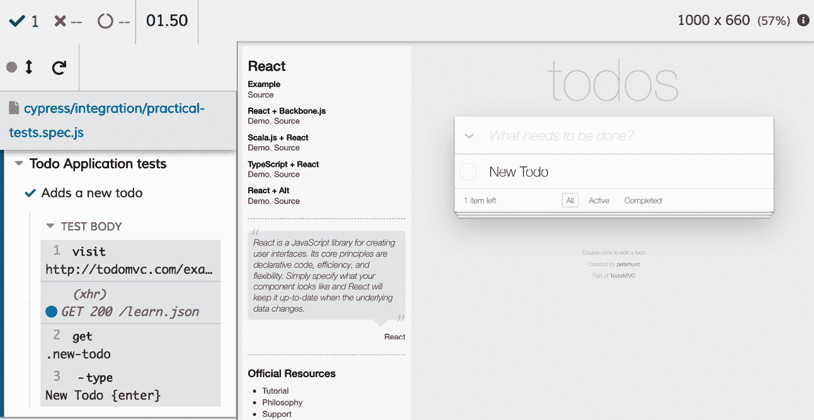
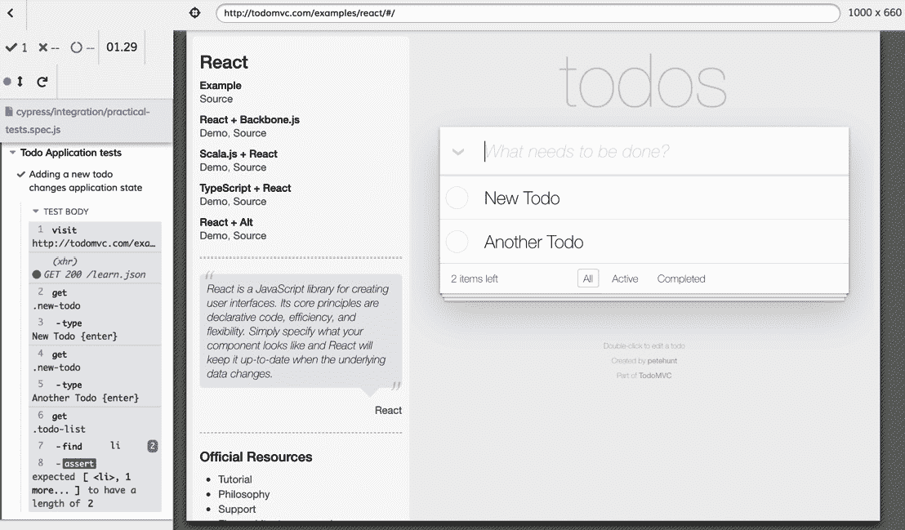

# *第四章*:写你的初试

在开始本章之前，您需要了解 Cypress 测试是如何运行的，不同的 Cypress 命令，如何设置 Cypress，如何在命令行上运行 Cypress，以及如何使用测试运行程序打开 Cypress 测试。这些信息在前三章中已经介绍过了，将帮助您更好地理解我们在编写第一个测试时将在本章中建立的基础知识。

在本章中，我们将介绍创建测试文件和编写基本测试的基础知识，然后继续编写更复杂的测试，并使用 Cypress 断言各种元素。

我们将在本章中讨论以下主题:

*   创建测试文件
*   写你的第一个测试
*   编写实用测试
*   赛普拉斯的自动重装功能
*   柏树断言

通过完成本章，您将准备好学习如何使用测试运行器调试正在运行的测试。

# 技术要求

本章的 GitHub 存储库可以在以下链接中找到:

[https://github . com/PacktPublishing/端到端-Web-Testing-with-Cypress](https://github.com/PacktPublishing/End-to-End-Web-Testing-with-Cypress)

本章的源代码可以在`chapter-04`目录中找到。

# 创建测试文件

赛普拉斯中的所有测试必须在测试文件中才能运行。要使测试被认为是有用的，它必须验证我们在测试中定义的所有条件，并返回一个响应，说明这些条件是否已经满足。Cypress 测试在编写测试的过程中也不例外，所有写在测试文件中的测试都必须有一组条件来验证。

在这一节中，我们将从测试文件在 Cypress 中的位置、Cypress 支持的不同扩展名以及用 Cypress 编写的测试文件应该遵循的文件结构开始，介绍编写测试文件的过程。

## 测试文件位置

当在`cypress/integration/examples`目录中初始化时，赛普拉斯默认创建测试文件。但是，这些可以删除，因为它们旨在显示利用不同的 Cypress 测试类型和断言的正确格式。Cypress 允许您灵活定位不同的模块和文件夹结构。

建议您在处理第一个项目时，使用上一段中提到的位置来编写您的 Cypress 测试。要重新配置柏树文件夹结构，您可以更改柏树默认配置，并将新配置传递到`cypress.json`文件中。改变默认的赛普拉斯配置的一个很好的例子是将我们的测试目录从位于`cypress/integration/examples to cypress/tests/todo-app`更改到其他地方。要更改默认目录，我们只需要更改我们的`cypress.json`配置，如下所示:

```js
{
"integrationFolder": "cypress/tests"
}
```

前面的代码块显示了`integrationFolder`设置，它改变了柏树`tests`字典的配置方式。

## 测试文件扩展名

Cypress 接受不同的文件扩展名，这允许我们编写超出正常 JavaScript 默认格式的测试。以下文件扩展名在赛普拉斯测试中是可接受的:

*   `.js`
*   `.jsx`
*   `.coffee`
*   `.cjsx`

除此之外，赛普拉斯还支持 ES2015 开箱即用和 CommonJS 模块，让我们可以使用**导入**和**要求**等关键词，无需任何额外的配置。

## 测试文件结构

Cypress 中的 Testfile 结构类似于大多数其他用于编写测试甚至普通 JavaScript 代码的结构。赛普拉斯测试的结构考虑了模块导入和声明，以及包含测试的测试主体。这可以在以下示例测试文件中看到:

```js
 // Module declarations
import {module} from 'module-package';
 // test body
describe('Test Body', () => {
   it('runs sample test', () => {
      expect(2).to.eq(2);
   })
})
```

如您所见，每个测试文件都需要在测试文件的最顶部有声明。通过这样做，测试可以嵌套在`describe`块中，该块指定将要运行的测试的范围和类型。

## 创建我们的测试文件

使用位于*技术要求*部分的 GitHub 链接，打开`chapter-04`文件夹。按照以下步骤创建第一个测试文件:

1.  导航至位于赛普拉斯目录内的`integration`文件夹目录。
2.  创建一个名为`sample.spec.js`的空测试文件。
3.  为了演示的目的，我们在`chapter-04`根目录下为您创建了一个`package.json`文件。您所需要做的就是运行这些命令，而不用担心它们现在如何工作。
4.  使用`npm run cypress:run`命令启动赛普拉斯测试运行程序。
5.  检查测试运行器预览，并确认我们添加的测试文件可见。

现在，是时候快速回顾一下了。

## 回顾–创建测试文件

在本节中，我们学习了如何创建测试文件，赛普拉斯如何接受不同的测试文件格式，以及如何更改赛普拉斯测试的默认目录。我们还学习了测试的结构，以及赛普拉斯是如何从诸如 JavaScript 之类的语言中借用测试的格式的。在下一部分，你将集中精力写你的第一个测试。

# 写你的第一个测试

柏树测试和其他测试没有什么不同。与所有其他测试一样，当预期结果与被测应用的预期一致时，赛普拉斯测试应该通过；当预期结果与应用应该做的不一致时，它应该会失败。在本节中，我们将探讨不同类型的测试、测试的结构，以及赛普拉斯如何理解测试文件中的更改并重新运行测试。本节还将介绍如何编写实际测试。

## 示例测试

在本节中，我们将了解赛普拉斯测试的基本结构。这仍然是我们将在本章过程中编写的大多数测试的标准。下面的测试检查我们期望的和返回的等于`true`。当我们运行它时，它应该会通过:

```js
describe('Our Sample Test', () => {
  it('returns true', () => {
    expect(true).to.equal(true);
  });
});
```

这里我们可以看到测试有`describe()`和`it()`挂钩。柏树测试中包含的钩子来自，默认情况下捆绑了来自于柏树作为默认断言库的断言库。钩子用来帮助你理解测试的不同阶段。`describe`钩子有助于将不同的测试封装到一个块中，而`it`钩子有助于我们识别测试块中的特定测试。

重要说明

柴断言库作为一个包包含在柏树框架中。它是赛普拉斯用来验证测试成功或失败的默认断言库。

考虑到我们在本节中看到的测试，我们现在将探讨 Cypress 中不同类型的测试分类。

## 测试分类

测试可以被分类为运行后产生的结果。柏树测试也可以根据状态分类。测试可以处于以下任何状态:

*   通过
*   不成功的
*   跳过

在接下来的几节中，我们将详细介绍这三个类别。

### 通过测试

通过测试是通过将输入与预期输出进行匹配来正确验证输入的测试。在 Cypress 中，通过的测试被清楚地标记为通过，这在命令日志和 Cypress 测试运行程序中可见。使用我们之前创建的`sample.spec.js`文件，我们可以创建我们的第一个通过测试，如下面的代码块所示:

```js
describe('Our Passing Test', () => {
  it('returns true', () => {
    expect(true).to.equal(true);
  });
});
```

要在使用`chapter-04`目录作为参考的情况下运行测试，我们可以在命令行界面上运行以下命令:

```js
npm run cypress:open 
```

在这个测试中，我们验证给定的输入`true`与我们期望的测试输出相似，也是`true`。这个测试可能不是很有用，但是它的目的是显示一个通过的测试。下面的截图显示了一个通过的测试:


图 4.1–通过测试

前面的截图显示了命令日志中通过测试的结果。通过查看左上角的绿色勾号，我们可以进一步验证测试是否通过了所有其他条件。

### 测试失败

就像通过测试一样，失败的测试也会根据测试预期验证测试输入，并将其与结果进行比较。如果预期结果和测试输入的评估结果不一致，就会发生测试失败。赛普拉斯很好地展示了失败的测试，并描述了哪些测试失败了。使用我们之前创建的同一个`sample.spec.js`文件，创建一个失败的测试，如下面的代码块所示:

```js
describe('Our Failing Test', () => {
  it('returns false, () => {
    expect(true).to.equal(false);
  });
});
```

要运行测试，我们将使用`chapter-0` 4 目录作为参考，然后在终端运行以下命令:

```js
npm run cypress:open
```

在这个失败的测试中，我们将`true`的测试输入与`false`的测试期望进行比较，这导致失败的测试设置为`true`，这不等于`false`。测试自动失败，因为它没有通过确定我们的测试通过的验证。下面的截图显示了我们在命令日志中失败测试的结果:


图 4.2–测试失败

查看命令日志，我们可以看到我们有两个测试:一个通过，一个失败。在失败的测试中，赛普拉斯命令日志显示了未能满足我们期望的断言。另一方面，测试运行人员继续向我们展示一个失败的测试，作为我们测试运行的总结。当测试失败时，赛普拉斯允许我们读取发生的确切异常。在这种情况下，我们可以清楚地看到，由于错误的断言，测试在断言级别失败了。

### 跳过的测试

在赛普拉斯跳过的测试不执行。跳过的测试用于忽略失败的测试或者在执行其他测试时不需要运行的测试。跳过的测试在其测试挂钩后以`.skip`关键字作为后缀。我们可以通过使用`describe.skip`跳过测试块来跳过整个测试块中的测试，或者使用`it.skip`跳过单个测试。下面的代码块显示了两个测试，其中主`describe`块被跳过，另一个测试在`describe`块内被跳过。以下代码说明了跳过赛普拉斯测试的不同方法:

```js
describe.skip('Our Skipped Tests', () => {
    it('does not execute', () => {
        expect(true).to.equal(true);
    });
    it.skip('is skipped', () => {
        expect(true).to.equal(false);
    });
});
```

在这里，我们可以看到，当我们将`.skip`添加到`it` 或`describe` 钩子时，我们可以跳过整个代码块或特定的测试。下面的截图显示了一个跳过的测试:


图 4.3–跳过的测试

跳过的测试只是在命令日志和测试运行程序中显示为跳过；对于已跳过的测试块或单个测试，不会发生任何活动。前面的截图显示了我们的`sample.spec.js`文件中定义的跳过测试的状态，可以在我们的`chapter-04` GitHub 存储库目录中找到。既然我们知道如何编写不同类型的测试，我们就可以开始编写实用的测试了。但是首先，让我们测试一下我们的知识。

## 测试分类练习

利用您通过阅读本章这一节所获得的知识，编写符合以下标准的测试:

*   断言变量属于`string`类型的通过测试
*   断言有效变量的失败测试等于`undefined`
*   检查布尔变量是否为`true`的跳过测试

现在，让我们回顾一下我们在这一节中所讲述的内容。

## 回顾——写下你的第一个测试

在本节中，我们学习了如何识别不同类型的测试，并研究了 Cypress 框架如何处理它们。我们学习了什么是通过测试、失败测试和跳过测试。我们还了解了赛普拉斯测试运行程序如何显示通过、失败或被跳过的测试状态。最后，我们通过一个练习来测试我们对测试分类的知识。现在，让我们继续写一个实际测试。

# 写应用文考试

在前一节中，我们学习了理解赛普拉斯测试的不同分类以及分类结果的基础知识。在这一节中，我们将着重于编写测试，不仅仅是断言一个布尔值等于另一个布尔值。

任何测试要有价值，都需要有三个基本阶段:

1.  设置应用的所需状态
2.  执行要测试的操作
3.  在执行操作后声明应用的状态

在我们的实际测试中，我们将使用我们的 **Todo** 应用来编写测试，这些测试对应于编写有意义的测试所需的三个基本阶段。为此，我们将完成以下步骤:

1.  访问 Todo 应用页面。
2.  搜索元素。
3.  与元素交互。
4.  对应用状态进行断言。

这些步骤将指导我们将要编写的实际测试，并将帮助我们对赛普拉斯测试有一个整体的看法。

## 访问待办事项应用页面

这一步包括访问 Todo 应用页面，这是我们运行测试的地方。Cypress 提供了一个内置的`cy.visit()`命令，用于导航到网页。下面的代码块显示了访问 Todo 页面需要遵循的步骤。该代码块可以在本书的 GitHub 资源库的`chapter-04`文件夹中的`practical-tests.spec.js`文件中找到:

```js
describe('Todo Application tests', () => {
  it('Visits the Todo application', () => {
    cy.visit('http://todomvc.com/examples/react/#/')
  })
})
```

当这个测试运行时，在观察命令日志时，我们会看到`visit`命令，以及我们刚刚在右侧的柏树应用预览中访问的应用，如下截图所示:


图 4.4–访问 Todo 应用

即使我们的应用没有任何断言，我们的测试仍然通过，因为没有导致测试失败的错误导致 Cypress 抛出异常。如果 Cypress 命令遇到错误，默认情况下会失败，这增加了我们编写测试时的信心。

## 搜索元素

为了确保 Cypress 在我们的应用中执行一些动作，我们需要执行一个会导致应用状态改变的动作。在这里，我们将搜索一个 Todo 应用输入元素，该元素用于向我们的应用添加 Todo 项。下面的代码块将搜索负责添加新 Todo 项的元素，并验证它是否存在于我们刚刚导航到的网址中:

```js
it('Contains todo input element', () => {
  cy.visit('http://todomvc.com/examples/react/#/')
  cy.get('.new-todo')
});
```

当 Cypress `cy.get()`命令没有找到输入元素时，会抛出一个错误；否则，赛普拉斯将通过测试。为了获得输入元素，我们不需要验证元素是否存在，因为赛普拉斯已经使用大多数赛普拉斯命令中链接的**默认断言**对此进行了处理。

重要说明

Cypress 中的默认断言是内置机制，它会导致命令失败，而不需要用户声明显式断言。使用这些命令，如果在执行所述命令时遇到异常，赛普拉斯会处理异常行为。

下面的截图显示了赛普拉斯搜索负责向我们的待办事项列表添加待办事项的待办事项输入元素:


图 4.5–搜索托多输入元素

在这里，我们可以验证 Cypress 访问了 Todo 应用 URL，然后检查添加 Todo 项的输入元素是否存在。

## 与 Todo 输入元素交互

现在我们已经确认我们的 Todo 应用中有一个输入元素，是时候与应用交互并更改其状态了。为了改变 Todo 应用的状态，我们将使用我们验证存在的输入元素添加一个 Todo 项。柏树把命令串在一起。为了与我们的元素进行交互，我们将使用 Cypress `.type()`命令向元素发送一个字符串，并将 Todo 项添加到应用状态中。下面的代码块将使用 Todo 输入元素添加新的 Todo:

```js
it('Adds a New Todo', () => {
  cy.visit('http://todomvc.com/examples/react/#/')
  cy.get('.new-todo').type('New Todo {enter}')
});
```

前面的代码块建立在前面的代码上，并使用柏树`type()`函数添加一个新的 Todo。这里，我们还调用了赛普拉斯`type`方法的`{enter}`参数来模拟*进入*键功能，因为待办事项应用没有提交按钮来为我们点击添加新的待办事项。下面的截图显示了添加的 Todo 项。有了这个项目，我们可以验证我们的测试成功地添加了一个新的 Todo 项目。此项在待办事项列表中可见:



图 4.6–与 Todo 输入元素交互

我们的测试运行程序显示已经创建了一个新的 Todo。同样，我们的测试通过了，即使没有断言，因为已经运行的命令已经通过了默认的 Cypress 断言。现在，我们需要断言应用状态已经改变。

## 断言应用状态

现在我们已经添加了我们的待办事项，我们需要断言我们的新待办事项已经被添加，并且由于待办事项的添加，应用状态已经改变。为此，我们需要在添加了 To do 项后添加一个断言。在下面的代码块中，我们将断言对应用状态的更改。这里，我们添加了一个断言来检查保存列表项的`.Todo-list`类是否等于`2`:

```js
it('asserts change in application state', () => {
      cy.visit('http://todomvc.com/examples/react/#/')

      cy.get('.new-todo').type('New Todo {enter}')
      cy.get('.new-todo').type(Another Todo {enter}')
      cy.get(".todo-list").find('li').should('have.length', 2)
   });
```

为了进一步验证我们的状态更改，我们可以添加更多的 Todo 项目，以验证项目数量随着我们添加 Todo 项目而增加。

在 Cypress 中，我们可以使用断言函数，如`.should()`和`expect()`，它们被捆绑在组成 Cypress 的工具中。默认情况下，丝柏扩展了柴库中的所有函数，柴库是默认的丝柏断言库。下面的屏幕截图显示了两个添加的待办事项和一个在赛普拉斯预览上的确认注释，声明这两个添加的待办事项存在于待办事项列表中:



图 4.7–断言应用状态

在这个测试中，我们可以验证所有添加的 Todos 在 Cypress 应用的预览页面上都是可见的，并且我们的断言通过了。我们现在可以添加更多的断言，特别是检查第一个托多的名字是`New Todo`，另一个添加的托多叫做`Another Todo`。为此，我们将在测试中添加更多断言，并检查 To do 项目的具体细节。在下面的代码块中，我们将验证 Cypress 是否可以检查添加的 Todo 项的名称；也就是*新任务*和*另一个任务*:

```js
  it('asserts inserted todo items are present', () => {
     cy.visit('http://todomvc.com/examples/react/#/')

     cy.get('.new-todo').type('New Todo {enter}')
     cy.get('.new-todo').type('Another Todo {enter}')
     cy.get(".todo-list").find('li').should('have.length', 2)
     cy.get('li:nth-child(1)>div>label').should(         'have.text', 'New Todo')
     cy.get('li:nth-child(2)>div>label').should(         'have.text', 'Another Todo')
    });
```

在这些断言中，我们使用了 Cypress `cy.get()`方法来使用元素的 CSS 类来查找元素，然后通过它们的文本来标识第一个和最后一个添加的 Todo 项。

## 实践测试练习

使用*技术需求*部分中提到的 GitHub 存储库链接，编写一个导航到 Todo 应用并向其中添加三个新 Todo 项目的测试。编写测试，通过验证 Todo 项的值和数量来检查已添加的 Todo 项是否存在。

## 回顾——撰写实践测试

在这一部分，我们编写了第一个实际测试。在这里，我们访问了一个页面，检查了该页面是否有输入元素，与该元素进行了交互，并断言应用状态发生了变化。了解了 Cypress 中的测试流程后，我们现在可以继续研究使 Cypress 中的测试编写变得有趣的特性，例如自动重新加载。

# 赛普拉斯的自动重装功能

默认情况下，赛普拉斯会监视文件更改，并在检测到文件更改时立即重新加载测试。这只有在赛普拉斯正在运行时才会发生。赛普拉斯自动重新加载功能非常方便，因为一旦您对测试文件进行了更改，就不需要重新运行测试。

通过自动重新加载功能，可以获得即时反馈，并了解他们的更改是否成功，或者他们的测试是否失败。因此，此功能允许您节省时间，否则这些时间将用于调试测试或检查所做的更改是否修复了问题。

默认情况下，赛普拉斯的自动重新加载功能处于启用状态，您可以选择将其关闭，并在进行更改后手动重新运行测试。Cypress 允许您停止监视文件更改。这可以通过配置`cypress.json`文件或使用赛普拉斯的命令行配置选项来完成。使用`cypress.json`配置文件时，您必须使用以下设置来禁用对文件更改的监视:

```js
{
 "watchForFileChanges": "false"
}
```

只要赛普拉斯还在运行，该设置将持续存在，将永久禁用文件更改，除非配置被更改或更改为`true`。在禁用 Cypress 监视文件更改时，另一个选项是使用此处显示的命令行配置选项:

```js
cypress open --config watchForFileChanges=false
```

使用此命令，Cypress 将暂时停止监视文件更改，并且只有当我们在终端窗口上停止执行 Cypress 时，才会更改此行为。然后，Cypress 将继续监视文件更改，并在测试文件发生更改时自动重新加载。

## 重述-赛普拉斯的自动重装功能

在本节中，我们学习了赛普拉斯如何利用自动重新加载功能来监视文件更改，并在我们的测试文件发生任何更改时立即重新加载和重新运行。我们还学习了如何在运行测试时，通过使用`cypress.json`文件永久禁用或通过在命令行配置中传递命令来轻松关闭赛普拉斯的自动重新加载功能。接下来，我们将看看赛普拉斯的断言。

# 柏树断言

正如我们在上一节中了解到的，当编写我们的第一个测试时，断言的存在是为了描述应用的期望状态。赛普拉斯的断言就像是测试的守卫，因为它们验证了期望状态和当前状态是相同的。Cypress 断言是唯一的，因为在运行 Cypress 命令时会重试这些断言，直到超时或找到元素。

赛普拉斯的声明来自于赛普拉斯安装附带的 **chai** 、 **chai-jquery** 和 **sinon-chai** 模块。柏树也允许你使用柴插件编写自定义断言。然而，在这一节中，我们将关注与 Cypress 捆绑的默认断言，而不是可以作为插件扩展的自定义断言。

我们可以通过两种方式编写 Cypress 断言:要么显式定义主体，要么隐式定义主体。赛普拉斯建议在断言中隐式定义主题，因为它们与赛普拉斯命令正在处理的元素直接相关。以下是赛普拉斯框架中断言的分类方式:

*   隐含主语:`.should()`或`.and()`
*   显性科目:`expect()`

让我们详细看看每一个。

## 内隐被试

`should`或`and`命令是赛普拉斯命令，这意味着它们可以直接作用于赛普拉斯立即产生的对象。这些命令也可以与其他柏树命令链接，这使得它们易于使用，同时保证调用它们时的即时响应。下面的代码块演示了如何测试隐式主题。在这里，我们将使用`cy.get`命令的输出在我们的测试中做出断言:

```js
describe('Cypress Assertions', () => {
    it('Using Implicit subjects - should', () => {
        cy.visit('http://todomvc.com/examples/react/#/')
        // Check if todo input element has expected 
        // placeholder value
        cy.get(".new-todo").should('have.attr', 'placeholder',
        'What needs to be done?')
    });
});
```

这里，我们使用`should()`命令断言 Todo 项的输入元素有一个占位符值。`should`命令与`cy.get()`命令相链接。这不仅使工作变得容易，而且减少了断言占位符是它本来的样子所需的代码量。在下面的代码块中，我们将结合`cy.get`命令返回的隐式主题的不同断言:

```js
it('Using Implicit subjects - and()', () => {
        cy.visit('http://todomvc.com/examples/react/#/')
        // Check if todo input element has expected   
        // placeholder value
        cy.get(".new-todo")
         .should('have.attr', 'placeholder',
          'What needs to be done?')
        .and('have.class', 'new-todo')
    });
```

在这里，我们使用了`.and()` Cypress 命令来进一步验证刚刚生成的元素有一个占位符和一个名为`new-todo`的 CSS 类。通过这些隐式断言，我们可以验证通过使用隐式主题，我们可以从来自 Cypress 的同一个生成的响应中链接出多个命令，并且还可以断言不同的项目。下面的代码块显示了通过使用显式主题而做出的代码断言，其中我们必须声明我们正在断言的每个主题:

```js
it('Using Explicit subjects', () => {
        cy.visit('http://todomvc.com/examples/react/#/')
        cy.get(".new-todo").should( ($elem) => {
        expect($elem).to.have.class('new-todo')
        expect($elem).to.have.attr('placeholder','What needs 
        to be done?')
        })
    });
```

如您所见，当使用隐式主题时，我们可以做出更清晰的断言，并减少我们编写的代码量。在这个代码块中，每一个断言都必须在同一行上，并单独执行。

## 显性受试者

当我们想要断言我们在运行测试时定义的特定主题时，我们使用`expect()`。显式主题在**单元测试**中很常见，当需要在我们执行断言之前执行一些逻辑，或者甚至对同一个主题有几个断言时，显式主题非常有用。下面的代码块显示了使用`expect`方法的显式主题断言:

```js
it('can assert explicit subjects', () => {
  const eqString = 'foo';  
  expect(eqString).to.eq('foo');
  expect(eqString).to.have.lengthOF(3);
  expect(eqString).to.be.a('string');
})
```

这个代码块显示了实例化的`string`与我们期望的明确比较。声明的`string`是一个显式主题，这意味着它可以被断言不止一次，并且在执行断言之前也可以被操纵。

对于复杂的断言，我们可以使用`.should()`方法来断言显式主体。这允许回调函数与作为第一个参数产生的主题一起传递。我们可以在`should`函数中添加断言，如下所示:

```js
it('Using Should with Explicit subjects', () => {
        cy.visit('http://todomvc.com/examples/react/#/')
        cy.get(".new-todo").should( ($elem) => {
        expect($elem).to.have.class('new-todo')
        })
 });
```

在这里，我们访问了网址，然后使用从`cy.get('new-todo')`产生的元素来断言名为`new-todo`的 CSS 类存在。这个测试允许我们查询一个元素，并根据需要为主题编写不同的断言。

## 锻炼——内隐和外显受试者

使用您从本部分获得的知识，并以*技术要求*部分中提到的GitHub 存储库链接为参考点，完成以下练习。

导航到待办事项应用网址([http://todomvc.com/examples/react/#/](http://todomvc.com/examples/react/#/)，并添加待办事项:

*   使用隐式主题断言编写一个测试，以断言 Todo 已经被添加，并且您输入的名称与 Todo 项目列表中显示的名称相同。
*   在待办事项应用网址上，将待办事项标记为已完成。然后，使用显式主题的断言，编写一个测试来验证已完成的 Todo 是否已被标记为已完成。

## 重述——赛普拉斯的主张

在这一节中，我们学习了如何断言显性和隐性被试，并观察了它们是多么的不同和相似。我们还了解到不同的断言类型可以用于不同的主题。然后，我们有机会进行一项练习，练习我们断言隐性和显性主题的技能。

# 总结

在本章中，我们学习了如何通过理解通过、失败和跳过测试的含义以及赛普拉斯如何在测试运行器和命令日志中查看和表示测试来对赛普拉斯的测试进行分类。我们还了解了测试文件的结构以及赛普拉斯测试可接受的文件扩展名。然后，我们编写了第一个实际测试，测试 Todo 应用可以添加、删除和标记 Todo 为已完成。本章的重点是学习赛普拉斯如何观察文件变化，以及我们如何在赛普拉斯中通过显式声明我们的测试主题或隐式声明它们来执行我们的声明。通过完成这一章，您知道如何通过使用元素和理解可用的断言，在 Cypress 中编写一个基本测试。在下一章中，我们将学习如何在 Cypress 中调试正在运行的测试，以及我们可以为此使用的工具。