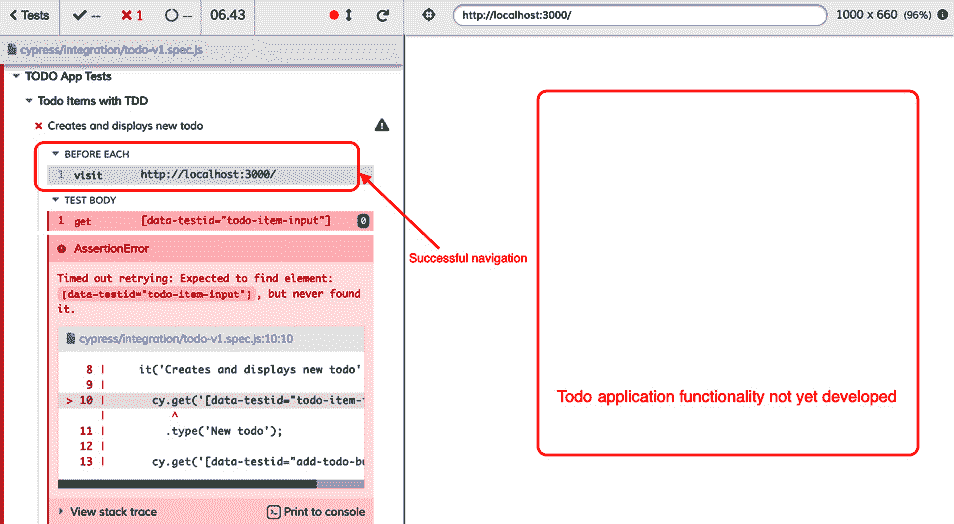
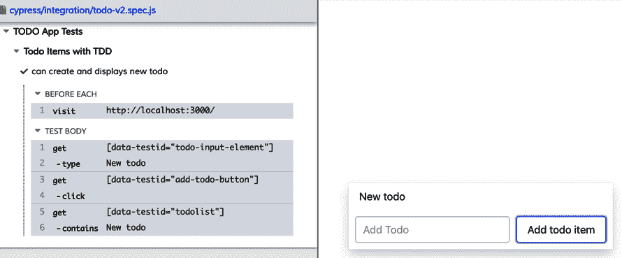
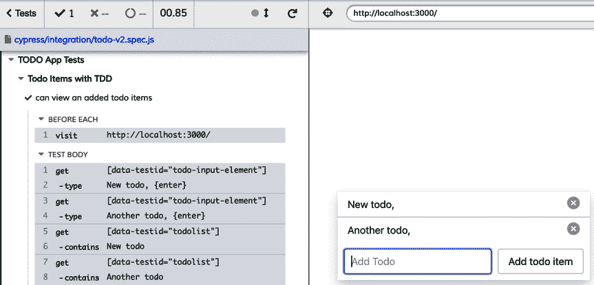
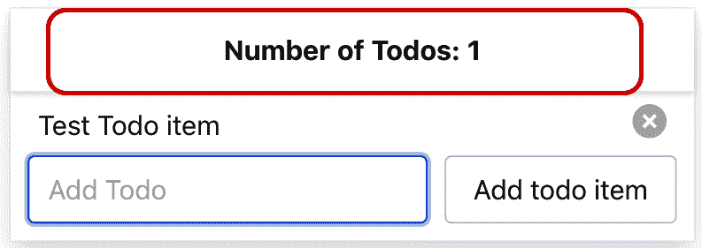
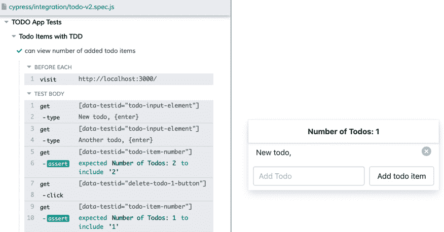

# *第六章*:用 TDD 方法写柏树测试

现在我们已经完成了本书的*第 1 部分*—即*赛普拉斯作为前端应用的端到端测试解决方案*—是时候进入本书的*第 2 部分*了，该部分将重点介绍采用 TDD 方法的*自动化测试*。

在我们开始使用 **TDD** ( **TDD** )方法编写 Cypress 测试之前，我们需要了解如何正确编写 Cypress 测试。这在本书的前几章中有所涉及。要在这个主题中出类拔萃，您需要了解 Cypress 测试是如何工作的，测试的结构，以及使用 Cypress 测试进行断言的不同方式。这些背景信息将帮助您了解如何在 Cypress 中使用 TDD，以及在软件开发生命周期中使用它所带来的优势。在本章中，我们将利用测试驱动的方法来编写测试，这将大大有助于提高对我们的应用和软件解决方案的信任和信心。

我们在本章中的重点将是确定如何利用柏树来帮助我们整体地思考一个应用，甚至在我们开始开发它之前。在开始开发之前，我们将首先应用测试我们的应用的概念。在这样做的时候，我们将利用赛普拉斯框架作为我们测试的核心。

本章将涵盖以下关键主题:

*   理解 TDD
*   用柏树写 TDD 测试
*   修改 TDD 测试

一旦你完成了每一个主题，你就可以开始学习赛普拉斯的元素交互了。

## 技术要求

首先，我们建议您克隆本书的 GitHub 存储库，其中包含我们将要构建的应用以及我们将在本章中编写的所有测试。

本章的 GitHub 存储库可以在以下位置找到

[https://github . com/PacktPublishing/端到端-Web-Testing-with-Cypress](https://github.com/PacktPublishing/End-to-End-Web-Testing-with-Cypress)

本章的源代码可以在`chapter-06`目录中找到。

我们将使用 ReactJS 库开发我们的应用。

您可以通过运行以下命令来运行 ReactJS 应用:

*   `cd chapter-6/tdd-todo-app`
*   `npm install`(安装所有需要的依赖项)
*   `npm run start`(为测试目的启动 React 应用)

以下链接:

# 了解 TDD

TDD 是一个软件开发过程，依赖于需求被转化为非常具体的测试用例。在编写完这些测试用例之后，代码将被编写并与其他测试用例进行比较。TDD 过程的最后一步是迭代和改进代码，以确保它符合所需的最佳实践，并且测试用例通过。TDD 方法的周期包括以下步骤:

1.  定义需要实现的功能
2.  编写新测试
3.  运行测试以检查测试是否失败
4.  编写测试用例要通过的代码
5.  根据添加的功能运行测试，以确保测试通过
6.  重构代码
7.  重复这个过程

TDD 的目的是在开发开始之前可视化结束。这样，就有可能预见到开发过程中可能出现的问题或障碍。能够使用 TDD 方法开发一个特性有助于批判性地思考解决方案，也有助于在开发应用时需要测试的场景。

假设我们正在创建一个登录功能；从测试的角度来看，我们需要为登录特性提出所有不同的场景。思考这些测试场景将使我们清楚地看到在开发阶段需要发生什么，从而在我们开发这个应用特性时使需求更加清晰。

TDD 有助于减少范围蔓延的机会，因为从一开始，我们就可以理解项目的目标。有了测试用例，我们可以确定功能，并将范围限制在已经编写的测试用例上。理解这个特性包含的内容允许开发人员制定如何实现代码。从长远来看，这可能会缩短开发时间。

重要说明

范围蔓延指的是不受控制的变更或项目开始后软件开发项目范围的增长。

接下来，让我们看看 TDD 方法的优势。

## TDD 的优势

在这一节中，我们将更仔细地看看在软件开发生命周期中实现 TDD 方法所带来的好处。

### 更好的项目设计

当使用 TDD 方法进行开发时，开发人员需要考虑这段代码想要实现的目标。正因如此，开发人员总是会以终为始。开发具有特定目标的特性的能力确保了开发人员只编写需要和必要的代码，这随后导致应用具有清晰的结构。

使用 TDD 还可以确保更高的代码质量，因为 TDD 强烈强调使用**不要重复自己** ( **DRY** )原则，该原则在编写代码时不鼓励重复。正因如此，通过使用 TDD，可以保持函数简单而简短，并且代码库易于理解。一个干净简单的代码库易于维护和测试，这对开发人员和代码库维护人员来说是一个额外的优势。

重要说明

DRY 原则是强调软件模式不重复和使用抽象来避免或减少冗余的应用开发原则。

### 详细的文档

TDD 实施严格的文档，引用正在开发的特性；开发人员需要提出这样的规范，其中很可能包括用户的行为。理解动作并将步骤分解成用户故事有助于开发人员实现特性，从而开发出非常接近定义目标的特性。

在编写测试的阶段开发适当的文档也减轻了其他方必须理解特性以复制文档的角色，因为它已经是软件开发过程的一部分。

### 缩短开发时间

在开发应用时，可以假设 TDD 需要更多的时间，在大多数情况下，这是事实。从这个陈述中，我们可以假设 TDD 很可能会推迟项目交付日期，事实并非如此。

通过采用 TDD 方法，有可能覆盖如果在开发中不使用 TDD 方法会有缺陷的场景。虽然 TDD 最初可能比非 TDD 方法消耗更多的时间，但它大大减少了开发人员维护项目所需的时间以及测试产品及其特性所需的工作。

由于 TDD 强制执行干净的代码，不言而喻，即使识别出了错误，在使用 TDD 的项目中修复它们也比在不使用 TDD 的项目中更容易。TDD 对高质量代码标准和持续反馈的关注，使得 TDD 项目的代码库具有可维护性，而非 TDD 项目并非如此。

### 成本节约

在任何项目中，当 bug 还在开发中时，找到并修复 bug 比 bug 已经进入生产阶段时更便宜。TDD 专注于开发过程中的错误消除，这大大减少了缺陷在特性的开发和测试阶段出现的机会。这加强了代码重构原则和错误预防。TDD 方法大大节省了公司在与生产中发现的错误和缺陷直接相关的行动上的支出。

缺陷直接导致的成本可能包括收入的直接损失、修复发现的缺陷的额外时间和成本，甚至公司利益相关者(如客户)的信任损失。了解 TDD 降低此类成本的能力使公司的节约变得值得，因为开发软件要花钱，而修复相同的软件要花更多的钱。

### 可靠的解决方案

TDD 解决方案是可靠的，因为它们在开发开始前经过了仔细的审查。TDD 确保开发的概念是实现的。这是通过测试场景来实现的，这些场景是在功能还是一个想法并且是需求的形式时编写的。

没有 TDD 的使用，开发者不可能在不考虑程序的不同部分将如何与新特性交互的情况下构建一个健壮的解决方案。然而，使用 TDD，这些测试用例帮助开发人员理解新特性和现有特性如何集成，因此知道一旦新特性被构建，应用将如何运行。这种方法给了开发人员信心，因为他们在开始开发解决方案之前就知道它。

## TDD 的缺点

虽然 TDD 的大部分结果是积极的，并导致生产力和伟大的开发过程，但 TDD 也可能对没有使用它的团队有害。在本节中，我们将强调使用 TDD 的缺点，以及为什么它可能不适合某些团队。

### 组织准备

TDD 要求组织参与实施过程。在实施之前，需要为组织定义 TDD 需求，因此为了保证成功，组织需要以这样的方式定位，即 TDD 将为他们工作。在某些情况下，组织可能没有耐心在实施开始之前等待所有的需求，也可能不愿意牺牲额外的时间来预先仔细检查需求。

TDD 是结构性的，要求管理层和开发人员团队一致同意承担与预先规划相关的成本，以便他们在以后的维护上花费更少。并不是所有的团队都愿意采取等待 TDD 的好处的方法，这意味着组织可能不愿意支付目前看不到的成本。

### 理解问题

测试驱动开发侧重于在实现开始之前构建测试。这种方法有助于团队更好地理解问题，并提出可靠的实施解决方案。编写测试的最大挑战是它们不能解决已经在实现代码中引入的逻辑错误。测试只能识别它们要测试什么，可能无法测试代码中没有明确定义的东西。

有了 TDD，就有可能因为对问题的理解而出错；测试可能无法捕捉到解决方案设计者没有正确理解需求的情况。

## 回顾–理解 TDD

在这一节中，我们了解了 TDD，我们为什么需要它，以及它在软件开发生命周期中是如何被利用的。我们还了解了使用 TDD 的优势，以及它如何防止在后期开发和测试阶段发现错误和缺陷所产生的成本。我们还了解了使用 TDD 的缺点，其中一些缺点可能源于测试和编写测试时的推理一样好。因此，理解正在开发的问题是至关重要的，以便为手头的问题提出测试。在下一节中，我们将重点关注在 Cypress 中编写 TDD 测试，以及这个过程如何帮助为功能代码提供健壮的解决方案和实现。

# 在柏树上写 TDD 测试

在这一节中，我们将重点关注使用 Cypress 编写 TDD 测试。在本节中，我们将构建一个 Todo 应用并应用 TDD 原则。首先，我们需要在头脑中有一个设计，这样我们就可以编写适当的测试，并批判性地思考我们的应用的特性。本章的目标是创建一个应用，该应用将添加待办事项、删除待办事项、显示添加的待办事项以及显示添加的待办事项的数量。最终应用的模型如下图所示。我们遵循的每一步都将帮助我们实现我们想要的模型:


图 6.1–Todo 应用模型

前面的截图显示了我们将要构建的 Todo 应用的模型。我们将使用 TDD 方法进行用 Cypress 编写的测试。该应用将具有以下功能:

*   添加新的待办事项
*   删除待办事项
*   查看添加的待办事项
*   查看添加的待办事项计数

这些特性构成了我们的 todo 应用的需求。在本章中，我们将参考这些特性作为我们开发测试和实现应用的需求。

# 设置应用

为了避免本节中的任何进一步的复杂性，我们将不会关注如何构建应用，而是关注在构建应用时如何实现测试。对于后台环境，我们将要构建的应用将使用用 JavaScript 编写的 ReactJS 库。

了解了我们的应用是什么样子之后，在开始开发应用之前，我们将采取一步一步的方法来编写测试。正如我们之前提到的，我们已经编写了我们将要构建的应用特性。我们将从编写 TDD 测试开始，这样我们就可以添加新的待办事项。

## 添加新的待办事项

我们将关注的第一个 TDD 测试是负责检查新待办事项是否已经添加到我们的待办事项列表中的测试。要执行这些步骤，请使用以下命令导航到您从 GitHub 克隆的`tests`目录:

```js
 cd chapter-6/tdd-todo-app/integration/todo-v1.spec.js
```

前面的命令将引导您到我们将在本章中使用的 TDD `tests`目录。这个文件中的测试是我们将在 TDD 过程中编写的测试的第一个版本。稍后，我们将修改它们，使它们适合我们将要添加的最终应用特性。

重要说明

当为我们的 Todo 应用编写 TDD 测试时，请注意柏树目录位于测试应用内部。这确保了我们跟踪并识别属于正在开发的应用的赛普拉斯测试。

下面的代码片段是一个测试，它检查我们是否可以向我们的应用添加新的 todo 项，这是我们的应用的要求之一:

```js
it('can create and display new todo', () => {
      cy.get('[data-testid="todo-item-input"]')
        .type('New todo');
      cy.get('[data-testid="add-todo-button"]')
        .click();
      cy.contains('New Todo');
});
```

在前面的代码片段中，我们编写了一个 TDD 测试来检查在特性完成之后，我们可以添加我们的 todo 项，并检查添加的项是否存在。请注意，在这个阶段，添加待办事项的功能尚未构建。如果我们在 Cypress 中运行这个代码片段，它应该会自动失败。为了验证这一点，我们可以运行以下命令来运行赛普拉斯测试:

```js
npm run cypress:open 
```

下面的屏幕截图显示了创建和显示新待办事项失败的 TDD 测试:



图 6.2–在赛普拉斯上运行 TDD 测试

在前面的截图中，我们正在执行测试，以检查它是否失败以及 Cypress 是否可以执行它。在这个测试中，赛普拉斯试图对运行在端口`3000`上的本地运行的 Todo 应用执行测试。测试失败，因为赛普拉斯找不到负责向待办事项列表添加待办事项的输入元素。从前面的截图中，我们可以验证应用成功导航到我们在 localhost 中运行的应用。为了继续构建这个特性并确保测试通过，稍后，我们将添加添加待办事项的功能，并再次重新运行我们的测试。

## 删除待办事项

我们的待办事项应用要求声明我们应该能够删除添加的待办事项。被删除的待办事项的要求之一是，一旦被删除，它就不应该再出现在待办事项列表中。为了编写我们的 TDD 测试，我们需要通过验证待办事项从待办事项列表中删除后就不再存在来确保我们确实删除了待办事项。我们将使用以下代码片段来实现删除特性测试要求:

```js
it(can delete added todo item', () => {
      cy.get('[data-testid="todo-item-input"]')
        .type('New todo');
      cy.get('[data-testid="add-todo-button"]')
        .click();
      cy.get('[data-testid="delete-todo-1-button"]')
        .click();
      expect('[data-testid="todolist"]'
      ).not.to.contain('New Todo')
   });
```

在前面的代码块中，我们添加了一个 todo 项，然后删除了它。后来，我们验证了被删除的待办事项不再存在，并通过使用一个 Cypress 断言方法断言它。这个测试片段不仅检查了待办事项的正确删除，而且还检查了在删除发生后，待办事项将不再出现在 DOM 中。如前面的截图所示，用 Cypress 运行这个测试失败了，因为我们的应用还没有构建。

查看添加的待办事项

正如我们的应用需求所规定的，当添加待办事项时，它们应该在待办事项列表中可见。添加的待办事项应该与待办事项列表中的待办事项相同。为了实现正确的测试，我们需要确保我们的测试覆盖了确保添加的待办事项在待办事项列表中可见的场景。我们还需要验证添加到 todo 应用中的项目是否与 todo 列表中可见的项目相同。我们将再次策划一个 TDD 测试，旨在涵盖能够显示我们的待办事项的场景。以下代码块是显示添加的待办事项的 TDD 测试:

```js
it(can view added todo item', () => {
      cy.get('[data-testid="todo-item-input"]')
        .type('New todo');
      cy.get('[data-testid="add-todo-button"]')
        .click();
      expect('[data-testid="todolist"]').to.contain(
      'New Todo')
 });
```

在这个代码块中，TDD 测试将使用应用的输入元素添加一个新的待办事项，然后验证添加的元素是否出现在待办事项列表中。有了这个测试，就消除了待办事项被添加，并且在待办事项列表中不可见的可能性。

## 查看添加的待办事项的计数

按照我们的应用的要求，我们需要确保我们可以查看添加的待办事项的数量。从我们的模型中，也可以在我们的`chapter-06/mockups/todo-mockup.png`目录中找到，待办事项的数量应该对应于待办事项列表中的项目。使用我们的待办事项应用的需求，我们的 TDD 测试应该测试场景，例如添加多个待办事项，并检查待办事项的数量是增加还是减少，这取决于它们是在我们的待办事项列表中添加还是删除。

重要说明

在我们编写测试之前，了解 Cypress 如何理解与哪个元素交互、单击哪个按钮或者在输入字段的什么地方键入是很重要的。赛普拉斯使用元素标识符，它唯一地标识赛普拉斯与之交互的元素。网页上元素的唯一元素标识符可能包括唯一元素 ID CSS 选择器、XPath 定位器，甚至是我们选择的自定义元素标识符，它们将采用`[data-testid="our-unique-identifier"]`格式。

与添加、删除或查看待办事项的测试场景不同，这个测试将包含多个步骤和多个断言。下面的代码块显示了一个 TDD 测试，用于查看已添加到待办事项列表中的待办事项的数量:

```js
it('can view number of added todo items', () => {
      cy.get('[data-testid="todo-item-input"]')
        .type('New todo');
      cy.get('[data-testid="add-todo-button"]')
        .click();
      cy.get('[data-testid="todo-item-input"]')
        .type('Another todo');
      cy.get('[data-testid="add-todo-button"]')
        .click();
      expect('[data-testid="todo-item-number"]').to.eq('2')
      cy.get('[data-testid="delete-todo-1-button"]')
      .click();
      expect('[data-testid="todo-item-number"]').to.eq('1')
    });
```

这段代码片段将作为最终测试的模板，它将检查待办事项的数量随着待办事项的增加和删除而增加和减少。在这里，我们可以看到我们添加了两个待办事项，然后验证这两个待办事项都存在。在确认两个项目都出现在待办事项列表中后，我们删除了一个待办事项，并检查待办事项的数量是否随着项目数量的减少而减少。

重要说明

当编写 TDD 测试时，我们不太关心测试中可能出现的语法错误，而是关心场景和测试覆盖率。当我们在构建好特性后开始修改测试时，我们将在再次运行测试时修复错误，这次是针对增加的功能。

现在，是时候快速回顾一下了。

# 回顾–设置应用

在本节中，我们学习了如何编写 TDD 测试，以及它们如何在我们开发解决方案时帮助塑造我们的思维。我们讲述了为添加待办事项、查看待办事项、删除待办事项以及查看待办事项列表中的待办事项总数编写 TDD 测试的过程。我们还了解到，TDD 测试有助于我们理解开发过程，并且测试并不是我们在功能完成后将进行的最终测试。在下一节中，我们将研究一旦我们的应用的特性完成，如何修改 TDD 测试。

# 修改 TDD 测试

在前面的部分，我们研究了 TDD 测试是如何构建的，以及开发它们以适应正在开发的应用的基本原理。正如我们前面提到的，我们不会详细讨论如何开发应用。相反，我们将关注如何将测试集成到正在开发的应用中。这里引用的应用可以在本书的 GitHub 存储库中找到。

在本节中，我们将使用我们在上一节中创建的 TDD 测试。我们将要构建的 TDD 测试负责测试应用的定义需求，如下所示:

*   添加新的待办事项
*   删除待办事项
*   查看添加的待办事项
*   查看添加的待办事项计数

现在我们已经编写了测试，我们将在修改它们时向应用添加特性。首先，我们将运行第一个测试，因为我们已经构建了添加待办事项的功能。为了在我们的应用中分离 TDD 测试和最终测试，我们将创建一个名为`todo-v2.spec.js`的新测试文件，我们将向其中添加最终测试。测试文件位于`chapter-06/tdd-todo-app/integration/todo-v2.spec.js`目录中。

## 添加新的待办事项

在这里，我们想要验证我们之前编写的用于验证添加新待办事项的测试是否真的有效。为了运行这个测试，我们将确保构建在 ReactJS 中的应用在本地运行。我们将针对本地托管的应用运行测试。一旦添加新待办事项的功能完成，我们的应用将如下所示:


图 6.3–添加新的待办事项功能

在前面的截图中，我们可以验证我们的**添加待办事项**功能正在工作，因为我们已经添加了待办事项。现在我们的代码看起来工作正常，是时候检查我们的测试在运行时是否真的通过了。为此，我们将使用`todo-v2.spec.js`测试文件，这是`todo-v1.spec.js`的修改版本。

我们已经从位于`todo-v1.spec.js`的版本 1 测试文件中修改了我们的测试，并且还修改了测试，使其适应我们在应用中创建的待办事项添加功能。新测试应该如下所示:

```js
it('can create and displays new todo', () => {
      cy.visit('http://localhost:3000/')
      cy.get('[data-testid="todo-input-element"]')
        .type('New todo');
      cy.get('[data-testid="add-todo-button"]')
        .click();
      cy.get('[data-testid="todolist"]'
        .contains('New todo');
    });
```

就像我们的初始测试一样，待测试的初始场景不变。我们首先导航到本地运行的应用的默认网址。然后，我们使用 Cypress 添加一个待办事项，稍后验证添加的待办事项是我们最初添加到输入元素中的。我们可以在下面的截图中清楚地检查这些动作，它显示了成功的测试:



图 6.4–通过添加待办事项的测试

在前面的截图中，我们可以看到 Cypress 导航到本地托管的应用并添加了一个待办事项，然后检查添加的待办事项是否出现在待办事项列表中。

重要说明

我们在应用中添加了前缀为`data-testid=*`的元素标识符来唯一标识元素。在 web 应用中选择元素时，元素标识符非常方便。通过为应用添加唯一的标识符和不使用默认的 CSS 选择器，即使当应用选择器改变时，我们的测试也不会受到影响，并将继续正常运行。

就这样，我们成功完成了我们在 TDD 的第一个任务。在本节中，我们实现了以下目标:

*   确定了一个我们想要开发的应用，并将其原型化
*   开发开始前编写了 TDD 测试
*   开发了向应用添加待办事项的功能
*   修改 TDD 测试，使其符合我们开发的功能

下面的截图显示了添加新待办事项的测试的 TDD 版本和最终特性版本的并排比较:


图 6.5–TDD 测试与最终特性测试对比

如您所见，测试的第二个版本揭示了虽然测试结构或目标没有改变，但我们必须修改我们的测试，使其适合开发的待办事项添加功能。识别需求、开发特性、然后修改测试以针对特性运行的能力是 TDD 的主要目标，我们设法实现了这一目标。

## 删除待办事项

现在，我们将学习如何删除添加的待办事项。关于我们的需求，删除的待办事项会从待办事项列表中移除，并且一旦点击了该待办事项的删除按钮就不可见了。同样，我们不会关注特性的开发过程，而是关注这个特性的测试。在下面的截图中，我们可以看到添加的每个新待办事项的删除按钮:


图 6.6–删除待办事项功能

红色突出显示的图标是为每个待办事项显示的删除图标。如果点击删除按钮，添加的待办事项将从我们的待办事项列表中消失，如我们的需求中所述。为了验证该特性按照我们预想的方式工作，我们现在将修改删除特性的 TDD 测试，并针对该特性运行测试。下面的代码块是删除已经添加到待办事项列表中的待办事项的测试:

```js
it('can delete an added todo item', () => {
      cy.visit('http://localhost:3000/')      
      cy.get('[data-testid="todo-input-element"]')
        .type('New todo');
      cy.get('[data-testid="add-todo-button"]')
        .click();
      cy.get('[data-testid="delete-todo-0-button"]')
        .click();
      expect('[data-testid="todolist"]'
        .not.to.contain('New todo')
});
```

此代码块显示了修改后的 TDD 测试，用于确认一旦待办事项被删除，它就不再出现在待办事项列表中。我们还必须对我们编写的初始 TDD 测试进行一些小的修改，以便所有选择器和动作与已经开发的功能相匹配。查看下面的 Cypress 截图，我们可以看到我们的测试通过了，并且添加的 todo 项被删除了，正如我们所期望的:


图 6.7–删除添加的待办事项

在这里，柏树快照功能帮助我们可视化柏树点击新添加的待办事项的删除按钮的过程。我们还编写了一个断言来验证被删除的待办事项一旦被删除就不存在于待办事项列表中。我们的测试已经通过，这意味着我们已经使用 TDD 向待办事项列表中添加了一个待办事项，并且还删除了这个待办事项，并测试它不存在于我们的待办事项列表中。在下一个测试中，我们将重点查看添加的待办事项。

## 查看添加的待办事项

我们的应用的部分要求包括查看待办事项列表中添加的待办事项。在添加待办事项时，我们已经能够看到这个特性在运行，但是还没有测试它。为了验证这个特性，我们将添加一个新的待办事项，并检查创建的待办事项是否出现在待办事项列表中。下面的代码块是一个测试，检查添加的待办事项在我们创建的应用上是否可见:

```js
it('can view added todo items', () => {
      cy.visit('http://localhost:3000/')      
      cy.get('[data-testid="todo-input-element"]')
      .type('New todo, {enter}')
      cy.get('[data-testid="todo-input-element"]')
      .type('Another todo, {enter}')
      cy.get('[data-testid="todolist"]').contains(
      'New todo');
      cy.get('[data-testid="todolist"]'
      .contains('Another todo');
    });
```

在这里，我们修改了我们的 TDD 测试。我们没有只检查是否可以查看单个待办事项，而是添加了两个项目，并添加了一个断言来检查这两个项目是否都存在于待办事项列表中。我们将在 Cypress 中运行我们的测试，并使用应用预览来验证这两个 Todo 项是否存在，如下图所示:



图 6.8–查看添加的待办事项

万岁！我们的测试通过了！

这个截图显示我们对添加待办事项的功能的需求是正确构建的，并且我们在待办事项列表中查看待办事项的测试需求也得到满足。在这里，我们已经实现了查看待办事项功能的目标。我们还使用 TDD 来检查在查看我们的待办事项时需要测试的场景。

## 查看添加的待办事项的数量

现在我们已经修改了添加待办事项、删除待办事项和查看待办事项列表中的待办事项的 TDD 测试，我们还想添加一个功能来检查已经添加的待办事项的数量。查看我们添加的待办事项数量的功能如下图所示:



图 6.9–查看添加的待办事项数量

此功能显示我们的待办事项列表中当前可用的待办事项数量。待办事项的数量将随着待办事项的增加而增加，当待办事项从列表中删除时，待办事项的数量将会减少。在这里，我们将使用我们为这个特性编写的 TDD 测试，并对其进行修改，以便我们的应用可以使用它。在我们的测试中，我们将专注于添加和删除待办事项，并验证在添加和删除时，待办事项的数量会相应变化。下面的代码块显示了不同的断言，这些断言检查特性是否按照我们的要求正常工作:

```js
it('can view number of added todo items', () => {
      cy.visit('http://localhost:3000/')      
      cy.get('[data-testid="todo-input-element"]')
      .type('New todo, {enter}')
      cy.get('[data-testid="todo-input-element"]')
      .type('Another todo, {enter}')
      cy.get('[data-testid="todo-item-number"]')
      .should(($header) => {
        expect($header.get(0).innerText).to.contain('2')
      })
      cy.get('[data-testid="delete-todo-1-button"]')
      .click();
      cy.get('[data-testid="todo-item-number"]')
 	.should(($header) => {
        expect($header.get(0).innerText).to.contain('1')
      })
    });
```

前面的代码片段向我们展示了如何添加新的待办事项，验证列表中的一个项目是否被删除，以及在应用的不同状态变化中计数是否保持一致。在这里，我们修改了我们的初始 TDD 测试，并且能够使用它们来测试我们是否能够实际增加或减少可用的待办事项的数量。通过在 Cypress 上运行相同的测试，我们可以验证 Cypress 是否开心，以及我们是否还有未删除的剩余待办事项，如下图所示:



图 6.10–测试待办事项计数

从前面的截图中，我们可以验证，随着应用的状态因添加和删除待办事项等操作而发生变化，计数会相应增加或减少。

## 回顾–修改 TDD 测试

在本节中，我们学习了一旦开发了特性，如何修改 TDD 测试，以使它们符合我们的应用是如何构建的。我们还学习了赛普拉斯如何在我们的测试运行时唯一地识别要交互的元素。最后，我们学习了如何将已经编写好的 TDD 测试转换成为我们的应用开发的测试特性。

# 总结

在本章中，我们了解了 TDD 的过程是如何工作的，以及在任何团队中接受 TDD 的重要性，并查看了 TDD 的优缺点。我们还探讨了如何将 TDD 应用于实际应用。通过这样做，我们为尚未构建的 Todo 应用创建了需求。在开发应用之前，我们为我们认为重要的特性编写了 TDD 测试，然后使用这些需求和 TDD 测试来开发我们的特性。一旦我们完成了特性的开发，我们修改了测试的第一个 TDD 版本，这样它们就可以为我们开发的特性工作，从而完成了展示如何在实际应用中利用 TDD 的过程。

现在，您应该了解什么是 TDD，如何编写 TDD 测试，以及如何在现实应用中修改和使用 TDD 测试，以便它们符合开发的应用。

现在我们已经知道了 TDD 以及如何在我们的项目中实现它，我们将在下一章关注如何与柏树 DOM 的不同元素进行交互。