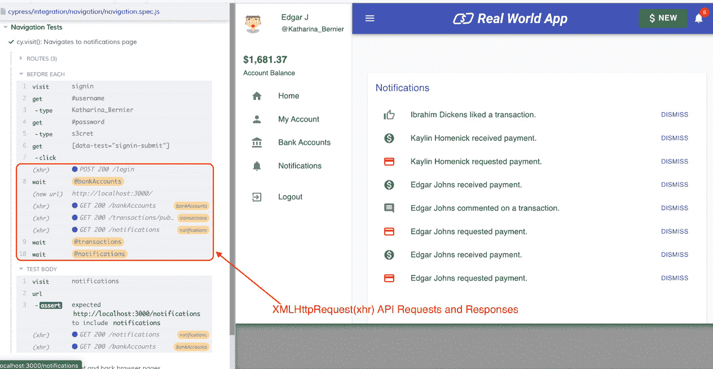
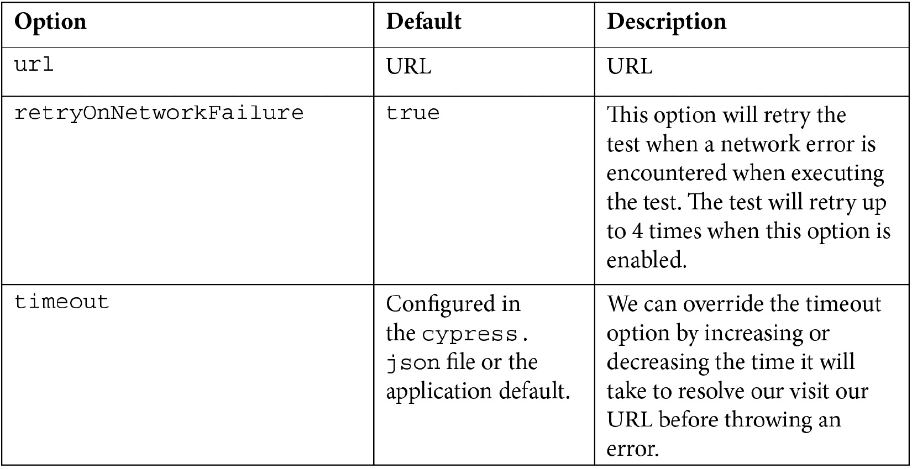
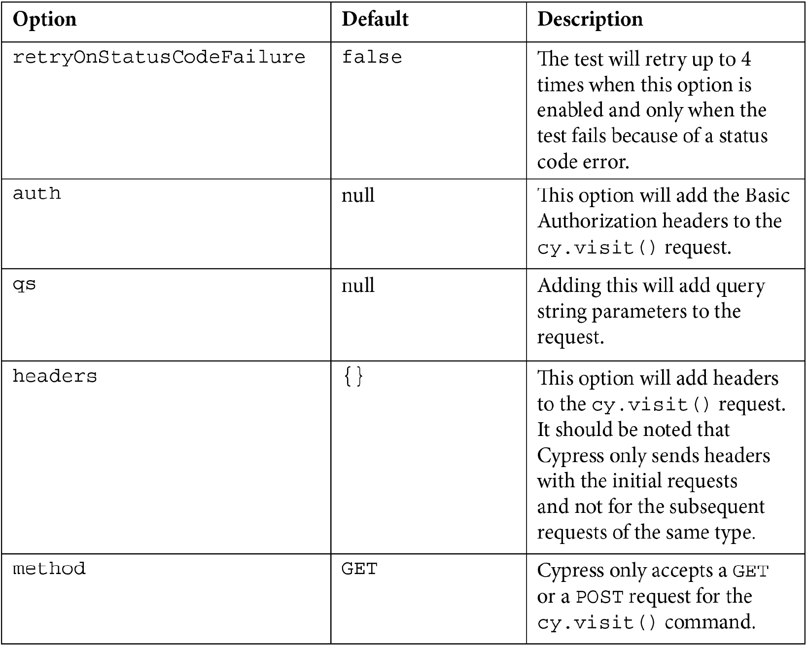

# *第 10 章*:练习-导航和网络请求

在我们开始这一章之前，重要的是你要明白，我们在这本书的第三部分的重点将基于练习和例子，这些练习和例子将帮助你磨练你的测试技能，积累我们在这本书的前几章中可能无法涵盖的知识。在这一节中，我们将采取动手操作的方法，目标是尽可能多地进行示例和练习。在我们深入这一章之前，重要的是你已经完成了每一章，现在正在寻求建立在我们学习柏树如何用于测试时你所获得的理论知识的基础上。

在本章中，我们将重点关注涵盖以下主题的练习和示例:

*   实现导航请求
*   实现网络请求
*   高级导航请求配置

一旦你完成了每一个练习，你将有信心成为一个更好的测试者，并在导航和网络请求领域进入更复杂的测试。

## 技术要求

首先，建议您从 GitHub 中克隆包含源代码和我们将在本章中编写的所有测试的存储库。

本章的 GitHub 资源库可在[https://GitHub . com/packt publishing/端到端-Web-Testing-with-Cypress](https://github.com/PacktPublishing/End-to-End-Web-Testing-with-Cypress) 上找到。

本章的源代码可以在`chapter-10`目录中找到。

在我们的 GitHub 存储库中，我们有一个财务测试应用程序，当我们完成本章时，我们将把它用于关于赛普拉斯导航和赛普拉斯请求的不同示例和练习。

重要说明:在 Windows 中运行命令

注意:默认的 Windows 命令提示符和 PowerShell 不能正确解析目录位置。

请遵循进一步列出的专门在以单词`*windows`为后缀的 Windows 操作系统上工作的 Windows 命令。

要确保测试应用程序正在您的计算机上运行，请从您的终端上的应用程序根目录运行以下命令。

`npm run cypress-init`命令将安装应用程序运行所需的依赖项，而另一方面，`npm run cypress-app`命令将只是启动应用程序。或者，您可以使用`npm run cypress-app-reset`命令重置应用程序状态。重置应用程序会删除已添加的不属于应用程序的任何数据，从而将应用程序状态恢复到克隆存储库时的状态。我们可以在终端中进一步运行命令，如下所示:

```js
$ cd cypress/chapter-10;
$ npm install -g yarn or sudo npm install -g yarn
$ npm run cypress-init; (for Linux or Mac OS)
$ npm run cypress-init-windows; (for Windows OS)
// run this command if it's the first time running the application
or
$ npm run cypress-app (for Linux or Mac OS)
$ npm run cypress-app-windows; (for Windows OS)
// run this command if you had already run the application previously
Optionally
$ npm run cypress-app-reset; (for Linux or Mac OS)
$ npm run cypress-app-reset-windows; (for Windows OS)
// run this command to reset the application state after running your tests
```

重要说明

我们在`chapter-10`目录中有两个主文件夹，一个文件夹包含我们将用于示例和测试练习的应用程序，而第二个文件夹包含我们测试应用程序的赛普拉斯测试。为了正确运行我们的测试，我们必须同时运行我们的应用程序和赛普拉斯测试，因为测试是在运行于我们机器本地的实时应用程序上运行的。还需要注意的是，应用程序将要求我们使用端口 *3000* 作为前端应用程序，使用端口 *3001* 作为后端应用程序。

掌握前面的命令将确保您能够运行应用程序，重置应用程序状态，甚至安装应用程序的依赖项。现在让我们从导航请求开始。

# 实现导航请求

Cypress 导航涉及导航到应用程序的网页的行为。在我们在本书中介绍的许多测试中，您可能记得在测试之前，我们有`cy.visit()`命令，它包含我们正在导航到的或正在测试的页面的 URL。`cy.visit()`命令是导航命令的一个例子，帮助我们在赛普拉斯前端测试中提出导航请求。在本节中，我们将通过示例和练习来使用不同的柏树导航命令。在本节结束时，我们将对 Cypress 导航命令有更深入的了解，这将有助于我们在本书前几章已经掌握的导航知识的基础上更进一步。

## cy.visit()

我们使用柏树中的`cy.visit()`导航到被测应用程序的远程页面。通过使用这个命令，我们还可以向命令传递配置信息，配置方法、URL、超时选项甚至查询参数等选项；我们将在本章后面深入探讨这个命令的配置选项。

在我们的 GitHub 存储库中，在`chapter-10/cypress-realworld-app`目录中，我们有一个应用程序，我们将用于我们的示例和练习。

重要说明

我们位于`chapter-10/cypress-realworld-app`目录的财务应用程序记录交易。使用该应用程序，我们可以通过为应用程序中已经存在的交易请求或支付用户来创建交易。我们可以看到已发生交易的通知，还可以查看联系人和已发生交易的日志。

该应用程序利用了一个 JSON 数据库，因此在将所有数据加载到我们的应用程序时有点慢。在我们的测试中，我们实现了一个“安全开关”，通过确保在`beforeEach`方法中，我们等待所有初始的**XHR**(**XMLHttpRequest**)请求加载数据，然后才开始我们的测试执行请求。参见下面代码块中的`beforeEach`方法的更多信息。

在我们的第一个示例中，在`navigation.spec.js`中，如下面的代码块所示，我们将使用`cy.visit()`命令导航到应用程序的通知页面:

```js
describe('Navigation Tests', () => {
    beforeEach(() => {
 	cy.loginUser();
	cy.server();
	cy.intercept('bankAccounts').as('bankAccounts');
     	cy.intercept('transactions/public').as('transactions')
     ;
     	cy.intercept('notifications').as('notifications');
     	cy.wait('@bankAccounts');
     	cy.wait('@transactions');
     	cy.wait('@notifications');
});
    afterEach(() => { cy.logoutUser()});
    it('Navigates to notifications page', () => {
        cy.visit('notifications', { timeout: 30000 });
        cy.url().should('contain', 'notifications');
    });
});
```

该代码块说明了`cy.visit()`命令的用法，在该命令中，我们访问通知路由(`http://localhost:3000/notifications`)的远程网址，然后验证我们访问的远程网址是否符合我们的预期。在我们的导航命令中，我们还添加了超时选项，该选项确保在导航测试失败之前，Cypress 将等待 30 秒钟的“页面加载”事件，然后才能通过测试。

下面的截图显示了我们正在执行的测试和赛普拉斯通过等待从后端接收的 XHR 请求，等待从我们的 JSON 数据库加载的所有数据:



图 10.1–XHR API 请求和响应

在这个截图中，我们导航到`/signin`页面，然后在等待所有资源加载后，我们使用 Cypress `cy.visit()`命令导航到`/notifications`页面，在测试应用预览右侧可见。我们的测试断言进一步验证了这一点，它验证了被访问的网址包含名称`notifications`。以下练习将帮助您更好地理解如何使用`cy.visit()`命令实现测试。

## 练习 1

使用 GitHub 存储库中提供的位于`cypress-real-world-app`文件夹根目录下的金融应用程序，进行以下练习，测试您对`cy.visit()`命令的了解程度:

1.  登录我们的测试应用程序，并使用`cy.visit()`命令导航至`http://localhost:3000/bankaccounts`网址。
2.  创建新的银行账户，然后检查新银行账户创建后应用程序是否重定向回`/bankaccounts`网址。
3.  登录应用程序，使用`cy.visit()`命令，尝试导航至`http://localhost:3000/signin`。
4.  测试用户成功登录后，验证该网址是否重定向到仪表板而不是`/signin`页面。

练习的解答可以在`chapter-10/integration/navigation/navigation-exercise-solutions`目录中找到。

本练习将测试您理解`cy.visit()`命令的能力，确保作为 Cypress 用户，您可以有效地使用该命令导航到不同的 URL，并且还可以将参数和配置选项传递给该命令。

## cy.go()

赛普拉斯`cy.go()`导航命令使用户能够在被测应用中向前导航或向后导航。使用`cy.go()`命令时，将`'back'`选项传递给该命令将引导浏览器导航到浏览器历史的上一页，而`'forward'`选项将引导浏览器导航到页面的前一页历史。我们也可以使用该命令通过输入数字选项作为参数来点击前进和后退按钮，其中`'-1'`选项将导航应用程序*后退*，而通过`'1'`将从浏览器历史记录中引导*前进*导航。

通过使用`cy.go()`，我们能够通过后退到浏览器历史的上一页以及前进到浏览器历史的下一页来操纵浏览器的导航行为。

重要说明

我们只在`cy.visit()`命令中使用`/bankaccounts`，因为我们已经在`cypress.json` 文件中声明了`baseUrl`。`baseUrl`是 URL 的完整版本，我们不需要每次在`cy.visit()`和`cy.intercept()`命令中使用它时都重复它。您可以在本章开始时克隆的 GitHub 存储库中查看更多信息。

在下面的代码块中，我们将使用我们的财务应用程序来验证我们在导航到`/bankaccounts`页面后是否可以导航回仪表板:

```js
describe('Navigation Tests', () => {
    it('cy.go(): Navigates front and backward', () => {
        cy.visit('bankaccounts');
        cy.url().should('contain', '/bankaccounts');
        cy.go('back');
        cy.url().should('eq', 'http://localhost:3000/');
    });
});
```

在这个测试中，导航到`/bankaccounts`网址后，我们使用赛普拉斯内置的 `cy.go('back')`命令导航回仪表板网址，然后我们验证我们已经成功导航回该网址。下面的练习将更好地解释如何使用`cy.go()`命令。

## 练习 2

使用 GitHub 存储库中提供的位于`chapter-10/cypress-real-world-app`目录中的金融应用程序，执行以下练习来测试您对`cy.go()`命令的了解:

1.  登录后，在交易仪表盘上，点击**好友**标签，然后点击**矿山**标签。
2.  使用`cy.go()`命令，使用柏树导航回**好友**标签。
3.  登录后，点击位于应用程序导航栏右上角的**新建**按钮，创建新交易。
4.  然后使用`cy.go()` Cypress 命令导航回仪表板页面并返回新交易。

练习的解答可以在`chapter-10/integration/navigation/navigation-exercise-solutions`目录中找到。

本练习将有助于培养您使用`cy.go()`命令测试向前和向后导航的技能。它还将有助于在测试应用程序时建立您使用导航的信心。

## cy.reload()

柏树`cy.reload()`命令是负责重装一页。该命令只有一组可以传递给它的选项，要么在清除缓存的同时重新加载页面，要么在缓存保留在应用程序内存中的情况下重新加载页面。当`true`的布尔值被传递给`cy.reload()`方法时，赛普拉斯不会用缓存重新加载页面；相反，它会清除缓存并加载关于页面的新信息。布尔值的省略导致赛普拉斯在启用缓存的情况下重新加载页面。在下面的代码块中，我们在登录应用程序后重新加载仪表板；这将刷新仪表板页面的状态:

```js
it('cy.reload(): Navigates to notifications page', () => {
    cy.reload(true);
    });
```

在这个测试中，如果我们的浏览器中有任何缓存的项目，赛普拉斯将重新加载页面并使缓存无效，以确保在执行我们的测试时创建页面的新状态和缓存。让我们看看下面的练习，了解更多使用`cy.reload()`命令的场景。

## 练习 3

使用 GitHub 存储库中提供的位于`chapter-10/cypress-real-world-app`目录中的金融应用程序，执行以下练习来测试您对`cy.reload()`命令的了解:

1.  导航至**账户**菜单项，在此我们有用户设置。
2.  在点击**保存**按钮之前，编辑测试用户的第一个和第二个名字。
3.  重新加载页面并确认`cy.reload()`命令重置了所有尚未保存的设置。

练习的解答可以在`chapter-10/integration/navigation/navigation-exercise-solutions`目录中找到。

在本练习中，我们了解到 reload 命令仅重置暂时存储在浏览器中的项目。通过使用`cy.reload()`命令，我们了解了如何重置应用程序的缓存存储以及如何测试它。

## 回顾–实施导航请求

在本节中，我们通过评估示例和练习了解了导航请求如何在柏树上工作。我们还探索了各种导航命令，如`cy.visit()`、`cy.go()`、`cy.reload()`，它们在执行赛普拉斯的导航请求时都起着主要作用。在下一节中，我们将了解如何使用实践练习和示例来实现网络请求。

# 实现网络请求

网络请求包括对后台服务的 AJAX 和 XHR 请求的处理。赛普拉斯通过其内置的`cy.request()`和`cy.intercept()`命令来处理这个问题。在本节中，我们将采取动手操作的方法，并使用示例和练习深入探讨如何在 Cypress 中实现网络请求。我们之前在本书的 [*第 9 章*](09.html#_idTextAnchor196)*【赛普拉斯测试跑者的高级使用】*中与网络请求进行过互动，这一章将帮助您建立在您已经熟悉的理论知识和概念上。

## cy.request()

赛普拉斯`cy.request()`命令负责向 API 端点发出 HTTP 请求。该命令可用于执行 API 请求和接收响应，而无需创建或导入外部库来生成和处理我们的 API 请求和响应。我们的赛普拉斯金融应用程序使用基于 JSON 数据库的后端应用编程接口。为了了解`cy.request()`命令的工作原理，我们将向数据库发出请求并检查响应。下面的代码块是从我们的应用编程接口获取所有事务的请求:

```js
it('cy.request(): fetch all transactions from our JSON database', () => {
        cy.request({
            url: 'http://localhost:3001/transactions',
            method: 'GET',
        }).then((response) => {
            expect(response.status).to.eq(200);
            expect(response.body.results).to.be.an
            ('array');
        })
    });
```

在前面的测试中，我们正在验证我们的后端是否响应了一个`200`状态代码和事务数据，这是一个数组。我们将在下面的练习中了解更多关于`cy.request()`命令的信息。

## 练习 4

使用 GitHub 存储库中提供的位于`chapter-10/cypress-real-world-app`目录的金融应用，进行以下练习，测试您对`cy.server()`命令的了解。该练习的解决方案可以在`chapter-10/integration/navigation/network-requests-excercise-solutions`目录中找到:

1.  登录后，使用您的浏览器，调查我们首次登录时由`cypress-realworld`应用程序加载的 XHR 请求。
2.  From the observation, write a test that returns data for the following:

    应用程序中的联系人

    应用程序中的通知

通过做这个练习，你将更好地理解`cy.request()`命令，并增加你对赛普拉斯请求如何工作的知识。接下来，我们将看看柏树路由。

## cy.intercept()

`cy.intercept()`命令管理测试网络层的 HTTP 请求行为。有了这个命令，我们就可以知道是否有人提出了 XHR 请求，以及对我们请求的响应是否符合我们的期望。我们甚至可以使用命令从路由中截取响应。借助`cy.intercept()`，我们可以剖析响应，并确保我们在测试中的应用程序实际上有正确的响应。`cy.intercept()`命令让我们可以在所有阶段完全访问我们的赛普拉斯测试的所有 HTTP 请求。

重要说明

我们必须在测试中引用它们之前调用`cy.intercept()`，以便在测试中调用它们之前记录路线，从下面的测试中，我们可以在`beforeEach()`命令块中观察到该行为。在接下来的测试中，我们在开始运行柏树测试之前调用了`cy.intercept`命令。

在`network-request.spec.js`文件中的以下代码块中，我们正在验证当被测应用程序发出正确的登录请求时，我们是否有用户信息的响应:

```js
describe('Netowork request routes', () => {
        beforeEach(() => {        
        cy.intercept('POST','login').as('userInformation');
        });

        it('cy.intercept(): verify login XHR is called when
        user logs in', () => {
            cy.login();
            cy.wait('@userInformation').its('
            response.statusCode').should('eq', 200)
        });
    });
```

在这个代码块中，我们正在验证应用程序向登录端点发出了`POST`请求，并且我们收到了`200`的成功状态，这是一次成功的登录。`cy.login()`命令导航到应用程序的登录页面。在下面的练习中，我们将进一步与`cy.intercept()`命令交互。

## 练习 5

使用 GitHub 存储库中提供的位于`chapter-10/cypress-real-world-app`目录的金融应用，进行以下练习，测试您对`cy.intercept()`命令的了解。该练习的解决方案可以在`chapter-10/integration/navigation/network-requests-exercise-solutions`目录中找到:

1.  登录到测试应用程序并导航到帐户页面。
2.  使用 Cypress `cy.route()`命令检查在更改用户信息时，Cypress 是否验证用户已登录。

是时候快速回顾一下了。

## 回顾–实施网络请求

在本节中，我们探讨了柏树网络请求是如何工作的，我们通过使用示例和练习来理解`cy.request()`和`cy.intercept()`在柏树测试中是如何使用的。利用这些例子和练习，我们还可以扩展我们如何使用命令的知识，例如`cy.intercept()`来操纵和存根。现在我们已经了解了网络请求，并且可以轻松地编写涉及 Cypress 网络请求的测试，在下一节中，我们将深入研究导航请求的高级配置。

# 高级导航请求配置

导航是正确运行测试的最重要方面之一。通过使用`cy.visit()`、`cy.go()`甚至`cy.reload()`命令，我们有能力知道在编写测试时要走什么捷径。导航命令也大大简化了测试工作流程。大多数前端测试都需要导航，因此，掌握高级配置不仅会让您的生活更加轻松，还会在编写测试时带来更流畅的体验。在本节中，我们将主要关注`cy.visit()`的柏树高级命令配置，因为它是柏树的主要导航命令。

## cy.visit()配置选项

下表显示了`cy.visit()`命令的配置选项以及没有选项传递给选项对象时加载的默认值:





`cy.visit()`命令接受不同类型的参数，这决定了传递给它的配置和选项。以下是命令接受的参数:

*   只有网址的配置:

    ```js
    cy.visit(url)
    e.g. cy.visit('https://test.com');
    ```

*   配置以网址和选项为对象:

    ```js
    cy.visit(url, options)
    e.g. cy.visit('https://test.com', {timeout: 20000});
    ```

*   仅将选项作为对象的配置:

    ```js
    cy.visit(options);
    e.g. cy.visit('{timeout: 30000}');
    ```

现在是回顾时间！

## 回顾–高级导航请求配置

在本节中，我们学习了如何使用不同的选项配置`cy.visit()`命令，以及该命令接受的不同类型的参数。我们还了解到了 Cypress 为我们提供的不同的默认选项，当它们没有并且已经通过了`options`对象时，这使得使用`cy.visit()`命令的过程变得容易，因为我们只为命令提供了我们在测试中需要覆盖的选项。

# 总结

在本章中，我们学习了 Cypress 如何执行导航，如何创建请求，以及 Cypress 如何为我们的测试执行过程解释和返回它们。我们采用实践的方法来学习三个基本的 Cypress 导航命令，以及 Cypress 用于发出和解释请求的三个命令。这些练习为您提供了一个走出舒适区的渠道，并对柏树的高级用途进行了一些研究，以及我们如何整合逻辑和我们在本书中积累的知识，编写有意义的测试，为正在测试的应用程序增加价值。最后，我们看了`cy.visit()`命令的高级配置选项。我相信，在本章中，您已经学习了在测试中处理和实现导航和网络请求以及配置导航请求的技巧。

现在，我们已经实际探索了使用手动方法在赛普拉斯的导航和请求，我们将在下一章中使用相同的方法来解决使用赛普拉斯的测试中的存根和间谍问题。