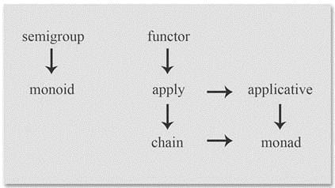

# 第三章。设置函数式编程环境

# 简介

我们需要知道高级数学——范畴理论、Lambda 演算、多态性——仅仅是为了用函数编程编写应用程序吗？我们需要重新发明轮子吗？这两个问题的简单答案都是*不*。

在这一章中，我们将尽最大努力调查一切可能影响我们用 JavaScript 编写功能应用程序的方式的东西。

*   图书馆
*   工具包
*   开发环境
*   编译成 javascript 的函数式语言
*   更多

请理解，当前 JavaScript 函数库的格局是非常不稳定的。像计算机编程的各个方面一样，社区可以在一个心跳中改变；可以采用新图书馆，也可以放弃旧图书馆。例如，在这本书的编写过程中，流行而稳定的输入/输出平台被其开源社区所分叉。它的未来是模糊的。

因此，从本章中获得的最重要的概念不是如何使用当前的库进行函数式编程，而是如何使用任何增强 JavaScript 函数式编程方法的库。本章不会只关注一两个库，而是将探索尽可能多的库，目标是调查 JavaScript 中存在的所有多种函数式编程风格。

# 【JavaScript 的函数库

据说每个函数程序员都写自己的函数库，函数式 JavaScript 程序员也不例外。有了今天的开源代码共享平台，如 GitHub、Bower 和 NPM，共享、协作和发展这些库变得更加容易。有许多用 JavaScript 进行函数式编程的库，从小型工具包到单片模块库。

每个库都推广自己的函数式编程风格。从僵化的、基于数学的风格到放松的、非正式的风格，每个库都是不同的，但它们都有一个共同的特征:它们都有抽象的 JavaScript 函数能力，以提高代码的重用性、可读性和健壮性。

然而，在撰写本文时，单一的库还没有成为事实上的标准。有些人可能会认为`underscore.js`是唯一的，但是，正如您将在下一节中看到的，避免`underscore.js`可能是明智的。

## 下划线. js

下划线已经成为许多人眼中标准的 T4 函数式 JavaScript 库。它成熟、稳定，由`Backbone.js`、`CoffeeScript`库背后的人*杰瑞米·阿什肯纳斯*创造。下划线实际上是 Ruby 的`Enumerable`模块的重新实现，这解释了为什么 CoffeeScript 也受到 Ruby 的影响。

与 jQuery 类似，下划线不会修改本机 JavaScript 对象，而是使用一个符号来定义自己的对象:下划线字符“`_`”。因此，使用下划线的工作原理如下:

```js
var x = _.map([1,2,3], Math.sqrt); // Underscore's map function
console.log(x.toString());
```

我们已经看到了 JavaScrip 针对`Array`对象的原生`map()`方法，其工作原理如下:

```js
var x = [1,2,3].map(Math.sqrt);
```

区别在于，在下划线中，`Array`对象和`callback()`函数都作为参数传递给了下划线对象的`map()`方法(`_.map`，而不是只传递回调到数组的原生`map()`方法(`Array.prototype.map`)。

但是除了`map()`和其他内置函数，还有其他方法来强调。它充满了超级便捷的功能，如`find()`、`invoke()`、`pluck()`、`sortyBy()`、`groupBy()`等。

```js
var greetings = [{origin: 'spanish', value: 'hola'}, 
{origin: 'english', value: 'hello'}];
console.log(_.pluck(greetings, 'value')  );
// Grabs an object's property.
// Returns: ['hola', 'hello']
console.log(_.find(greetings, function(s) {return s.origin == 
'spanish';}));
// Looks for the first obj that passes the truth test
// Returns: {origin: 'spanish', value: 'hola'}
greetings = greetings.concat(_.object(['origin','value'],
['french','bonjour']));
console.log(greetings);
// _.object creates an object literal from two merged arrays
// Returns: [{origin: 'spanish', value: 'hola'},
//{origin: 'english', value: 'hello'},
//{origin: 'french', value: 'bonjour'}]
```

它提供了一种将方法链接在一起的方法:

```js
var g = _.chain(greetings)
  .sortBy(function(x) {return x.value.length})
  .pluck('origin')
  .map(function(x){return x.charAt(0).toUpperCase()+x.slice(1)})
  .reduce(function(x, y){return x + ' ' + y}, '')
  .value();
// Applies the functions 
// Returns: 'Spanish English French'
console.log(g);
```

### 注

`_.chain()`方法返回一个包含所有下划线函数的包装对象。然后使用`_.value`方法提取包裹对象的值。包装对象对于混合下划线和面向对象编程也非常有用。

尽管易于使用并被社区改编，但是`underscore.js`库还是因为强迫你写过于冗长的代码和鼓励错误的模式而受到批评。下划线的结构可能不理想，甚至没有作用！

直到布莱恩·朗斯多夫发表题为*的演讲后不久发布的版本 1.7.0，嘿下划线，你做错了！*，登陆 YouTube，下划线明确阻止我们扩展`map()`、`reduce()`、`filter()`等功能。

```js
_.prototype.map = function(obj, iterate, [context]) {
  if (Array.prototype.map && obj.map === Array.prototype.map) return obj.map(iterate, context);
  // ...
};
```

### 注

你可以在[www.youtube.com/watch?v=m3svKOdZij](http://www.youtube.com/watch?v=m3svKOdZij)观看布莱恩·朗斯多夫的演讲视频。

地图，就范畴论而言，是一个同态函子接口(更多这方面在[第五章](5.html#page "Chapter 5. Category Theory")、*范畴论*中)。我们应该能够将`map`定义为我们所需要的函子。所以下划线的功能不是很强。

而且因为 JavaScript 没有内置的不可变数据，函数库应该注意不要让它的助手函数变异传递给它的对象。下面是这个问题的一个很好的例子。该代码片段的目的是返回一个新的`selected`列表，其中一个选项设置为默认值。但实际发生的是`selected`名单突变到位。

```js
function getSelectedOptions(id, value) {
  options = document.querySelectorAll('#' + id + ' option');
  var newOptions = _.map(options, function(opt){
    if (opt.text == value) {
      opt.selected = true;
      opt.text += ' (this is the default)';
    }
    else {
      opt.selected = false;
    }
    return opt;
  });
  return newOptions;
}
var optionsHelp = getSelectedOptions('timezones', 'Chicago');
```

我们必须在`callback()`函数中插入一行`opt = opt.cloneNode();`，以复制传递给该函数的列表中的每个对象。下划线的`map()`功能欺骗提升性能，但这是以功能*风水*为代价的。原生的`Array.prototype.map()`函数不需要这个，因为它复制了一个，但是它也不适用于`nodelist`系列。

对于数学正确的函数式编程来说，下划线可能并不理想，但它从未打算将 JavaScript 扩展或转换为纯函数式语言。它把自己定义为*一个 JavaScript 库，提供了一大堆有用的函数式编程助手*。它可能不仅仅是一个功能类助手的虚假集合，但它也不是一个严肃的函数库。

外面有更好的图书馆吗？也许是基于数学的？

## 奇幻之地

有时候，真相比虚构更离奇。

**幻境**是一个功能基础库的集合，也是如何在 JavaScript 中实现“代数结构”的正式规范。更具体地说，幻想世界指定了常见代数结构的互操作性，简称代数:单子、幺半群、集合、函子、链等等。它们的名字听起来可能很吓人，但它们只是一组值、一组运算符和它必须遵守的一些定律。换句话说，它们只是物体。

它是这样工作的。每一个代数都是一个独立的幻境规范，可能依赖于其他需要实现的代数。



一些代数规范是:

*   Setoids:
    *   实施自反性、对称性和传递性定律
    *   定义`equals()`方法
*   半群
    *   执行结合律
    *   定义`concat()`方法
*   幺半群
    *   实现右标识和左标识
    *   定义`empty()`方法
*   函子
    *   实施身份和组成法律
    *   定义`map()`方法

这份名单越列越多。

我们不一定需要知道每个代数的确切用途，但它肯定会有所帮助，尤其是如果您正在编写符合规范的自己的库。这不仅仅是抽象的废话，它概述了一种实现高级抽象的方法，称为范畴理论。范畴理论的完整解释见[第五章](5.html#page "Chapter 5. Category Theory")、*范畴理论*。

幻想 Land 不只是告诉我们如何实现功能编程，它确实为 JavaScript 提供了一套功能模块。然而，许多都是不完整的，文档也很少。但是幻想世界并不是唯一一个实现其开源规范的库。其他也有，即:**毕尔巴鄂**。

## Bilby.js

什么是比尔比？不，它不是神话中的生物，可能存在于幻境中。它作为一只老鼠和一只兔子的怪异/可爱的混合体存在于地球上。尽管如此，`bibly.js`库符合幻境规范。

其实`bilby.js`是一个严肃的函数库。正如其文档所述，它是*严肃的，这意味着它应用范畴理论来实现高度抽象的代码。功能性，意味着它支持参考透明的程序*。哇，那真的很严重。位于[http://bilby.brianmckenna.org/](http://bilby.brianmckenna.org/)的文件接着说，它提供:

*   针对特定多态性的不可变多方法
*   功能数据结构
*   函数语法的运算符重载
*   自动化规格测试(**标量检查**、**快速检查**)

到目前为止，最成熟的库符合代数结构的幻想世界规范，`Bilby.js`是完全致力于函数式风格的一个很好的资源。

让我们尝试一个例子:

```js
// environments in bilby are immutable structure for multimethods
var shapes1 = bilby.environment()
  // can define methods
  .method(
    'area', // methods take a name
    function(a){return typeof(a) == 'rect'}, // a predicate
    function(a){return a.x * a.y} // and an implementation
  )
  // and properties, like methods with predicates that always
  // return true
  .property(
     'name',   // takes a name
     'shape'); // and a function
// now we can overload it
var shapes2 = shapes1
  .method(
    'area', function(a){return typeof(a) == 'circle'},
    function(a){return a.r * a.r * Math.PI} );
var shapes3 = shapes2
  .method(
    'area', function(a){return typeof(a) == 'triangle'},
    function(a){return a.height * a.base / 2} );

// and now we can do something like this
var objs = [{type:'circle', r:5}, {type:'rect', x:2, y:3}];
var areas = objs.map(shapes3.area);

// and this
var totalArea = objs.map(shapes3.area).reduce(add);
```

这就是范畴理论和动作中的特设多态。再次，范畴理论将在[第五章](5.html#page "Chapter 5. Category Theory")、*范畴理论*中全面介绍。

### 注

范畴理论是最近活跃起来的数学分支，函数式程序员用它来最大化代码的抽象性和有用性。*但是有一个很大的缺点:很难概念化和快速上手。*

事实是，毕尔巴鄂和幻想世界真的在扩展 JavaScript 函数式编程的可能性。虽然看到计算机科学的发展令人兴奋，但这个世界可能还没有准备好迎接比比和幻想世界正在推动的那种硬核功能风格。

也许这样一个位于函数式 JavaScript 前沿的宏伟库不是我们的专长。毕竟，我们开始探索补充 JavaScript 的功能技术，而不是建立功能编程的教条。让我们把注意力转向另一个新的图书馆`Lazy.js`。

## 懒惰. js

懒惰是一个实用程序库，更类似于`underscore.js`库，但是有一个懒惰的评估策略。正因为如此，懒人通过对无法立即解释的系列结果进行功能计算，使成为不可能。它还拥有显著的性能提升。

`Lazy.js`图书馆还很年轻。但它背后有很大的动力和社区热情。

这个想法是，在懒惰中，一切都是我们可以迭代的序列。由于库控制方法应用顺序的方式，可以实现许多非常酷的事情:异步迭代(并行编程)、无限序列、函数式反应编程等等。

下面的例子展示了一切:

```js
// Get the first eight lines of a song's lyrics
var lyrics = "Lorem ipsum dolor sit amet, consectetur adipiscing eli
// Without Lazy, the entire string is first split into lines
console.log(lyrics.split('\n').slice(0,3)); 

// With Lazy, the text is only split into the first 8 lines
// The lyrics can even be infinitely long!
console.log(Lazy(lyrics).split('\n').take(3));

//First 10 squares that are evenly divisible by 3
var oneTo1000 = Lazy.range(1, 1000).toArray(); 
var sequence = Lazy(oneTo1000)
  .map(function(x) { return x * x; })
  .filter(function(x) { return x % 3 === 0; })
  .take(10)
  .each(function(x) { console.log(x); });

// asynchronous iteration over an infinite sequence
var asyncSequence = Lazy.generate(function(x){return x++})
  .async(100) // 0.100s intervals between elements
  .take(20) // only compute the first 20  
  .each(function(e) { // begin iterating over the sequence
    console.log(new Date().getMilliseconds() + ": " + e);
  });
```

更多的例子和用例将在[第 4 章](4.html#page "Chapter 4. Implementing Functional Programming Techniques in JavaScript")、*在 JavaScript* 中实现函数式编程技术中进行介绍。

但是把这个想法完全归功于`Lazy.js`图书馆并不完全正确。它的前身之一`Bacon.js`图书馆的工作原理也差不多。

## 培根

`Bacon.js`库的标识如下:


函数式编程库的大胡子潮人`Bacon.js`本身就是一个用于*函数式反应式编程*的库。功能反应式编程只是意味着功能设计模式是用来表示反应性的并且总是在变化的价值，比如鼠标在屏幕上的位置，或者公司股票的价格。正如 Lazy 可以通过在需要之前不计算值来创建无限序列一样，Bacon 可以避免在最后一秒之前计算不断变化的值。

Lazy 中所谓的序列在 Bacon 中被称为 EventStreams 和 Properties，因为它们更适合处理事件(`onmouseover`、`onkeydown`等)和反应属性(滚动位置、鼠标位置、切换等)。

```js
Bacon.fromEventTarget(document.body, "click")
  .onValue(function() { alert("Bacon!") });
```

Bacon 比 Lazy 稍微老一点，但是它的功能集大约是 Lazy 的一半，它的社区热情也差不多。

## 荣誉提名

在这本书的范围内，有太多的图书馆无法做到公平。让我们再看几个 JavaScript 函数式编程的库。

*   `Functional`
    *   可能第一个用 JavaScript 进行函数编程的库`Functional`是一个包含全面的高阶函数支持以及`string` lambdas 的库
*   `wu.js`
    *   特别值得一提的是它的`curryable()`功能，`wu.js`库是一个非常好的用于函数编程的库。这是(我所知道的)第一个实施懒惰评估的图书馆，为`Bacon.js`、`Lazy.js`等图书馆开了先河
    *   没错，就是以臭名昭著的说唱组合*武堂族*命名的
*   `sloth.js`
    *   非常类似于`Lazy.js`库，但是要小得多
*   `stream.js`
    *   `stream.js`库支持无限的流，其他的不多
    *   尺寸非常小
*   `Lo-Dash.js`
    *   正如这个名字可能暗示的那样，`lo-dash.js`图书馆的灵感来自于`underscore.js`图书馆
    *   高度优化
*   `Sugar`
    *   `Sugar`是 JavaScript 中函数式编程技术的支持库，类似于下划线，但在实现方式上有一些关键的区别。
    *   而不是在下划线中做`_.pluck(myObjs, 'value')`，只是在糖中做`myObjs.map('value')`。这意味着它修改了原生的 JavaScript 对象，因此它与其他库(如 Prototype)配合不好的风险很小。
    *   非常好的文档、单元测试、分析器等等。
*   `from.js`
    *   一个新的函数库和**【LINQ】**(**语言集成查询**)JavaScript 引擎，支持大多数与 LINQ 相同的功能。NET 提供了
    *   100%惰性计算，支持 lambda 表达式
    *   非常年轻，但是文档非常好
*   jslint
    *   另一个功能强大的 JavaScript LINQ 引擎
    *   比`from.js`库更老更成熟
*   `Boiler.js`
    *   另一个实用工具库将 JavaScript 的函数方法扩展到更多的原语:字符串、数字、对象、集合和数组
*   **民间故事**
    *   像`Bilby.js`库一样，Folktale 是另一个实现幻想土地规范的新库。和它的前身一样，Folktale 也是一个 JavaScript 函数编程库的集合。它很年轻，但可能有一个光明的未来。
*   **jQuery**
    *   看到这里提到 jQuery 很惊讶吧？虽然 jQuery 不是用来执行函数式编程的工具，但是它本身是函数式的。jQuery 可能是最广泛使用的库之一，其根源在于函数式编程。
    *   jQuery 对象实际上是一个单子。jQuery 使用一元定律来启用方法链接:

        ```js
        $('#mydiv').fadeIn().css('left': 50).alert('hi!');
        ```

对此的完整解释可以在[第 7 章](7.html#page "Chapter 7. Functional and Object-oriented Programming in JavaScript")、*JavaScript 中的函数式和面向对象编程*中找到。

*   它的一些方法是高阶的:

    ```js
    $('li').css('left': function(index){return index*50});
    ```

*   从 jQuery 1.8 开始，`deferred.then`参数实现了一个名为 Promises 的功能概念。
*   jQuery 是一个抽象层，主要用于 DOM。它不是一个框架或工具包，只是一种使用抽象来增加代码重用和减少丑陋代码的方法。这不就是函数式编程的全部吗？

# 开发和生产环境

就编程风格而言，应用程序在什么类型的环境中开发以及将在什么类型的环境中部署并不重要。但这对图书馆来说很重要。

## 浏览器

大多数 JavaScript 应用程序被设计为在客户端运行，即在客户端的浏览器中运行。基于浏览器的环境非常适合开发，因为浏览器无处不在，您可以在本地机器上直接处理代码，解释器是浏览器的 JavaScript 引擎，所有浏览器都有一个开发人员控制台。Firefox 的 FireBug 提供了非常有用的错误消息，并允许断点等，但在 Chrome 和 Safari 中运行相同的代码来交叉引用错误输出通常会很有帮助。甚至 Internet Explorer 也包含开发人员工具。

浏览器的问题在于它们对 JavaScript 的评价不同！虽然这并不常见，但是可以编写在不同浏览器中返回非常不同结果的代码。但是通常区别在于他们对待文档对象模型的方式，而不是原型和函数的工作方式。很明显，`Math.sqrt(4)`方法返回`2`给所有浏览器和 shells。但是`scrollLeft`方法取决于浏览器的布局策略。

编写特定于浏览器的代码是浪费时间，这也是应该使用库的另一个原因。

## 服务器端 JavaScript

`Node.js`库已经成为创建服务器端和基于网络的应用的标准平台。函数式编程可以用于服务器端应用程序编程吗？没错。好的，但是有没有为这种性能关键型环境设计的函数库？答案也是:是的。

本章概述的所有功能库都将在`Node.js`库中工作，许多功能库依赖于`browserify.js`模块来处理浏览器元素。

### 服务器端环境中的功能用例

在我们网络系统的美丽新世界中，服务器端应用程序开发人员经常关注并发性，这是正确的。经典的例子是一个允许多个用户修改同一个文件的应用程序。但是如果他们同时试图修改它，你会陷入一个丑陋的混乱。这就是困扰程序员几十年的*状态维护*问题。

假设以下场景:

1.  一天早上，亚当打开一份报告进行编辑，但他没有在去吃午饭之前保存它。
2.  比利打开同一个报告，添加他的笔记，然后保存。
3.  亚当吃完午饭回来，把他的笔记添加到报告中，然后保存，不知不觉地覆盖了比利的笔记。
4.  第二天，比利发现他的笔记不见了。他的老板对他大喊大叫；每个人都变得疯狂，他们联合起来对付被误导的应用程序开发人员，他们不公平地丢掉了工作。

长期以来，这个问题的解决方案是创建一个关于文件的状态。当有人开始编辑时，将锁定状态切换到上的*，这将阻止其他人对其进行编辑，然后在保存后将其切换到*关闭*。在我们的场景中，直到亚当吃完午饭回来，比利才能完成他的工作。如果它从未被保存过(比如说，如果亚当在午休时间决定辞职)，那么没有人能够编辑它。*

这就是函数式编程关于不可变数据和状态(或缺少不可变数据和状态)的思想能够真正发挥作用的地方。用户不用直接修改文件，而是使用功能方法修改文件的副本，这是一个新的修订版。如果他们去保存版本，并且新的版本已经存在，那么我们知道其他人已经修改了旧的版本。危机避免了。

以前的情景会这样展开:

1.  一天早上，亚当打开一份报告进行编辑。但他不会在去吃午饭前存起来。
2.  比利打开同样的报告，添加他的笔记，并将其保存为新的修订版。
3.  亚当午饭后回来添加他的笔记。当他尝试保存新版本时，应用程序会告诉他现在存在一个新版本。
4.  亚当打开新的修订，添加他的注释，并保存另一个新的修订。
5.  通过查看修订历史，老板看到一切都在顺利进行。每个人都很高兴，应用程序开发人员得到了提升和加薪。

这被称为*事件源*。没有需要维护的显式状态，只有事件。这个过程要干净得多，有一个清晰的事件历史可以回顾。

这个想法和许多其他想法是服务器端环境中函数式编程兴起的原因。

## CLI

虽然 web 和`node.js`库是两个主要的 JavaScript 环境，但是一些务实和喜欢冒险的用户正在寻找在命令行中使用 JavaScript 的方法。

使用 JavaScript 作为命令行界面 ( **CLI** )脚本语言可能是应用函数编程的最佳机会之一。想象一下，能够在搜索本地文件时使用惰性评估，或者将整个 bash 脚本重写为一个功能性的 JavaScript 单行代码。

## 与其他 JavaScript 模块一起使用函数库

Web 应用程序由各种东西组成:框架、库、API 等等。它们可以作为从属、插件、或共存对象一起工作。

*   `Backbone.js`
    *   一个带有 RESTful JSON 接口的 **MVP** ( **模型-视图-提供者**)框架
    *   需要`underscore.js`库，主干唯一的硬依赖
*   jQuery
    *   `Bacon.js`库有与 jQuery 混合的绑定
    *   下划线和 jQuery 相辅相成
*   原型 JavaScript 框架
    *   以最接近 Ruby 可枚举的方式为 JavaScript 提供集合函数
*   `Sugar.js`
    *   修改本机对象及其方法
    *   与其他库混合时必须小心，尤其是 Prototype

## 编译成 JavaScript 的函数式语言

有时类似 C 的语法对 JavaScript 内部功能的厚厚覆盖足以让你想要切换到另一种功能性语言。你可以的！

*   Clojure 和 ClojureScript
    *   闭包是一种现代的 Lisp 实现，也是一种功能齐全的函数式语言
    *   ClojureScript 将 Clojure 编译成 JavaScript
*   咖啡脚本
    *   CoffeeScript 是一种函数式语言的名称，也是一种用于将该语言转换为 JavaScript 的编译器的名称
    *   咖啡脚本中的表达式和 JavaScript 中的表达式之间的一对一映射

外面还有很多更多，包括**Pyjs****罗伊****TypeScript****UHC**等等。

# 总结

您选择使用哪个库取决于您的需求。需要功能反应式编程来处理事件和动态值吗？使用`Bacon.js`库。只需要无限的溪流，其他什么都不需要？使用`stream.js`库。想用函数式助手来补充 jQuery 吗？试试`underscore.js`图书馆。需要一个结构化的环境来处理严重的临时多态性？查看`bilby.js`图书馆。需要一个完善的函数式编程工具吗？使用`Lazy.js`图书馆。对这些选项都不满意？自己写！

任何图书馆都只取决于它的使用方式。虽然本章概述的一些库有一些缺陷，但大多数缺陷发生在键盘和椅子之间的某个地方。这取决于您是否正确使用这些库并满足您的需求。

如果我们将代码库导入到我们的 JavaScript 环境中，那么也许我们也可以导入思想和原则。也许我们可以通过*蒂姆·彼得*来引导*巨蟒之战*:

> *漂亮总比丑好*
> 
> *显性比隐性好。*
> 
> *简单胜于复杂。*
> 
> *复杂胜于复杂。*
> 
> *平的比嵌套的好。*
> 
> *疏胜于密。*
> 
> *可读性很重要。*
> 
> *特殊情况没有特殊到打破规则的程度。*
> 
> *虽然实用性胜过纯粹性。*
> 
> *错误永远不要无声无息地过去。*
> 
> *除非明确沉默。*
> 
> *面对暧昧，拒绝猜测的诱惑。*
> 
> *应该有一种——最好只有一种——显而易见的方法去做。*
> 
> *虽然一开始这种方式可能不明显，除非你是荷兰人。*
> 
> *现在总比没有好。*
> 
> *虽然从来没有比“现在”往往更好。*
> 
> *如果实现很难解释，那是个坏主意。*
> 
> *如果实现容易解释，可能是个好主意。*
> 
> *命名空间是一个非常棒的想法——让我们做更多的命名空间吧！*