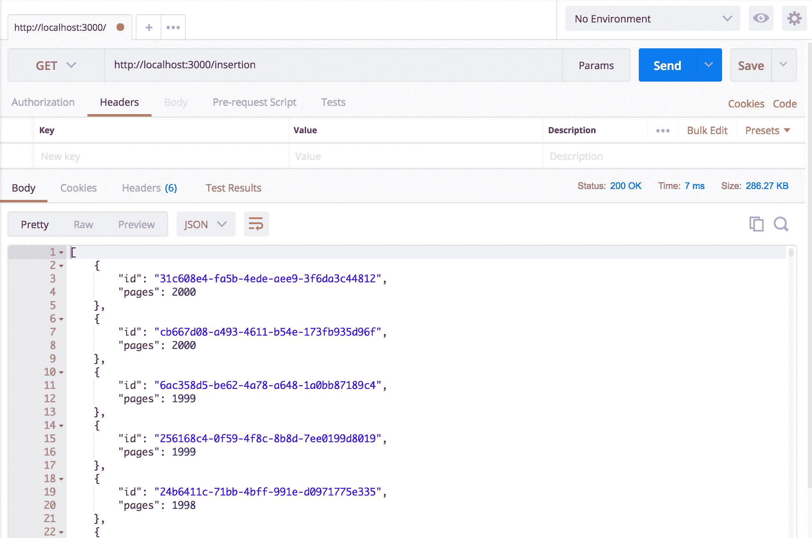
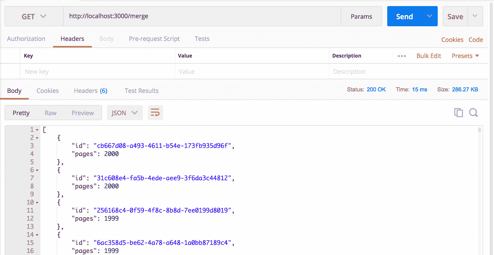
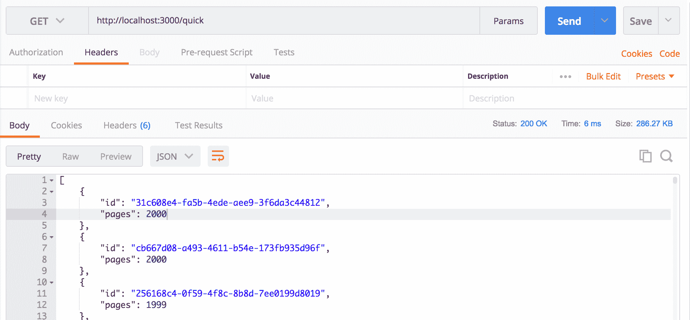

# 七、排序及其应用

排序是一种非常常见的算法，我们用它来按照升序或降序重新排列数字或对象的列表。排序更具技术性的定义如下:

In computer science, a sorting algorithm is an algorithm that puts elements of a list in a certain order.

现在，让我们假设您有一个 *n* 项的列表，并且您想要对它们进行排序。你取所有的`n`项，并确定你可以放置这些项的所有可能的顺序，在这种情况下，总共是`n!`。我们现在需要确定这些`n!`系列中的哪一个没有任何反转对来找出排序列表。反向对定义为一对元素，其在列表中的位置由`i, j`表示，其中`i < j`，但值为`x<sub>i</sub> > x<sub>j</sub>`。

当然，前面的方法很繁琐，需要一些繁重的计算。在本章中，我们将讨论以下主题:

*   排序算法的类型
*   为图书管理系统(如图书馆)创建应用编程接口
*   插入排序算法对图书数据进行排序
*   合并排序算法对图书数据进行排序
*   对图书数据进行排序的快速排序算法
*   不同排序算法的性能比较

让我们看看上面列出的一些更优化的排序类型，它们可以在各种场景中使用。

# 排序算法的类型

我们都知道有不同类型的排序算法，我们大多数人在编程生涯的不同时期都会听说过这些不同类型算法的名字。排序算法和数据结构的最大区别在于，前者总是有相同的目标，不管使用哪种类型的算法。这使得我们非常容易和重要地比较不同方面的不同排序算法，这在大多数情况下归结为速度和内存使用。在我们根据手头的数据类型选择特定的排序算法之前，我们需要做出这个决定。

记住以上内容，我们将比较和对比以下三种不同类型的算法:

*   插入分类
*   合并分类
*   快速分类

Mergesort 和 Quicksort 是 v8 引擎内部用来对数据进行排序的算法；当数据集太小(< 10)时，使用合并排序，否则使用快速排序。另一方面，Insertionsort 是一种实现起来简单得多的算法。

然而，在我们开始实现这些排序算法之前，让我们快速看一下用例，然后为它们设置先决条件。

# 不同排序算法的用例

为了测试不同的排序算法，我们将创建一个小型的 express 服务器，它将包含一个端点，以获取按每本书的页数排序的所有书籍的列表。在这个例子中，我们将从一个 JSON 文件中的无序书籍列表开始，它将作为我们的数据存储。

In production applications, the sorting should be deferred to your database query and should not be done as a part of the application logic to avoid pain and confusion when dealing with scenarios such as filtering and paginated requests.

# 创建快速服务器

我们设置项目的第一件事是创建我们想要编写应用的目录；为此，请在终端中运行以下命令:

```js
mkdir sorting
```

创建后，通过运行`cd`进入目录，然后运行 npm 初始化命令将其设置为 Node.js 项目:

```js
cd sorting
npm init
```

这会问你一系列的问题，你可以回答，也可以留空默认答案，两者都可以。项目初始化后，按照我们在前面章节中所做的那样添加以下 npm 包，以帮助我们设置快速服务器:

```js
npm install express --save
```

添加之后，我们现在就可以创建我们的服务器了。将以下代码添加到项目根目录下的新文件中，并将其称为`index.js`:

```js
var express = require('express');
var app = express();

app.get('/', function (req, res) {
   res.status(200).send('OK!')
});

app.listen(3000, function () {
   console.log('Chat Application listening on port 3000!')
});
```

我们设置了一个返回`OK`的单个端点，我们的服务器运行在端口`3000`上。让我们也在我们的`package.json`文件的脚本中添加一个快捷方式来轻松启动应用:

```js
...
"scripts": {
  "start": "node index.js",
  "test": "echo \"Error: no test specified\" && exit 1"
},
...
```

现在，要测试这些变化，从根文件夹运行`npm start`，并在浏览器中打开`localhost:3000`。您应该在屏幕上注意到一条`OK!`信息，该信息由`index.js`文件中的路线定义。

# 嘲笑图书馆书籍数据

现在，让我们创建图书馆图书的模拟数据，当用户请求图书列表时，我们希望对其进行排序并返回。在本章中，我们将重点按照每本书的页数对图书馆书籍进行排序，因此为了简单起见，我们只能添加页数和书籍的 ID，如以下代码所示:

```js
[
{"id":"dfa6cccd-d78b-4ea0-b447-abe7d6440180","pages":1133},
{"id":"0a2b0a9e-5b3d-4072-ad23-92afcc335c11","pages":708},
{"id":"e1a58d73-3bd2-4a3a-9f29-6cfb9f7a0007","pages":726},
{"id":"5edf9d36-9b5d-4d1f-9a5a-837ad9b73fe9","pages":1731},
...
]
```

我们想要测试这些算法中每一个的性能，所以让我们添加 5000 本这样的书，以确保我们有足够的数据来测试性能。此外，我们将在 300 到 2000 页之间随机添加这些页数，由于我们总共有 5000 本书，不同书籍之间的页面大小会有明显的重复。

以下是一个示例脚本，如果您想使用此脚本，可以使用它来生成此数据；确保您安装了`uuid` npm 模块:

```js
npm install uuid --save
```

另外，在项目的根目录下创建一个名为`generator.js`的文件，并添加以下代码:

```js
const fs = require('fs');
const uuid = require('uuid');
const books = [];

for(var i = 0; i < 5000; i++) {
   books.push({
      "id": uuid.v4(),
      "pages": Math.floor(Math.random() * (2000 - 300 + 1) + 300)
   })
}

fs.writeFile('books.json', JSON.stringify(books), (err) => {});
```

现在，要运行它，从根目录运行`node generator.js`命令，这将生成`books.json`文件，其数据类似于前面代码中显示的记录。

# insertionsort api

现在，让我们创建一个端点，它使用 Insertionsort 根据页数对数据进行排序和返回。

# 什么是插入排序

Insertionsort，顾名思义，是一种排序类型，我们从输入数据集中逐个提取元素，然后在确定元素应该放置的位置后，将它们插入排序后的结果数据集中。

我们可以直接确定这种方法需要一个额外的集合(与输入大小相同)来保存结果。因此，如果我们有一个 10 个元素的`Set`作为输入，我们将需要另一个`Set`作为输出，其大小也是 10。我们可以稍微改变一下这种方法，以便我们的排序在内存中进行。在内存中执行一个动作意味着我们将不再请求更多的内存(通过创建与输入大小相同的额外集合)。

# 伪代码

让我们快速记下 Insertionsort 的伪代码:

```js
LOOP over all data excluding first entry (i = 1)

    INITIALIZE variable j = i - 1

    COPY data at index i

    WHILE all previous values are less than current

        COPY previous value to next

        DECREMENT j

    ADD current data to new position

RETURN sorted data
```

# 实现插入端口应用编程接口

基于前面描述的伪代码，实现 Insertionsort 非常容易。让我们首先创建一个名为`sort`的文件夹，然后创建一个名为`insertion.js`的文件，我们将在其中添加我们的插入类，如下面的代码所示:

```js
class Insertion {

   sort(data) {
      // loop over all the entries excluding the first record
      for (var i = 1; i< data.length; ++i) {

         // take each entry
         var current = data[i];

         // previous entry
         var j = i-1;

         // until beginning or until previous data is lesser than
         current
         while (j >= 0 && data[j].pages < current.pages) {

            // shift entries to right
            data[j + 1] = data[j];

            // decrement position for next iteration
            j = j - 1;
         }

         // push current data to new position
         data[j+1] = current;
      }

      // return all sorted data
      return data;
   }
}

module.exports = Insertion;
```

正如伪代码和实际实现中所讨论的，我们将获取每个值，并将其与之前的值进行比较，当您有 5000 个随机顺序的项目时，这听起来不是一件非常好的事情；这是真的，只有当数据集几乎被排序并且整个数据集中有几个反转对时，Insertionsort 才是首选。

改进这一功能的一种方法是改变我们确定要在排序列表中插入的位置的方式。我们可以执行二分搜索法运算来确定数据应该移动到排序列表中的哪个位置，而不是将它与之前的所有值进行比较。因此，通过稍微修改前面的代码，我们可以得到以下结果:

```js
class Insertion {

   sort(data) {
      // loop over all the entries
      for (var i = 1; i < data.length; ++i) {

         // take each entry
         var current = data[i];

         // previous entry
         var j = i - 1;

         // find location where selected sould be inseretd
         var index = this.binarySearch(data, current, 0, j);

         // shift all elements until new position
         while (j >= index) {
            // shift entries to right
            data[j + 1] = data[j];

            // decrement position for next iteration
            j = j - 1;
         }

         // push current data to new position
         data[j + 1] = current;
      }

      // return all sorted data
      return data;
   }

   binarySearch(data, current, lowPos, highPos) {
      // get middle position
      var midPos = Math.floor((lowPos + highPos) / 2);

      // if high < low return low position;
      // happens at the beginning of the data set
      if (highPos <= lowPos) {

         // invert condition to reverse sorting
         return (current.pages < data[lowPos].pages) ? (lowPos + 1):
         lowPos;
      }

      // if equal, give next available position
      if(current.pages === data[midPos].pages) {
         return midPos + 1;
      }

      // if current page count is less than mid position page count,
      // reevaluate for left half of selected range
      // invert condition and exchange return statements to reverse
      sorting
      if(current.pages > data[midPos].pages) {
         return this.binarySearch(data, current, lowPos, midPos - 1);
      }

      // evaluate for right half of selected range
      return this.binarySearch(data, current, midPos + 1, highPos);
   }
}

module.exports = Insertion;
```

一旦实现，我们现在需要定义在数据集上使用这种排序的路径。为此，首先，我们将导入前面创建的 JSON 数据，然后在我们的端点中使用它，我们专门创建端点来使用 Insertionsort 对数据进行排序:

```js
var express = require('express');
var app = express();
var data = require('./books.json');
var Insertion = require('./sort/insertion');

app.get('/', function (req, res) {
   res.status(200).send('OK!')
});

app.get('/insertion', function (req, res) {
 res.status(200).send(new Insertion().sort(data));
});

app.listen(3000, function () {
   console.log('Chat Application listening on port 3000!')
});
```

现在，我们可以重新启动我们的服务器，并尝试从浏览器或邮递员中点击`localhost:3000/insertion`处的端点，如下图所示，以查看包含排序数据的响应:



# 合并排序应用编程接口

现在，让我们创建端点，它使用 Mergesort 根据页面计数对数据进行排序和返回。

# 什么是合并排序

Mergesort 是一种分治排序算法，其中整个数据集首先被分成每个元素的子集，然后这些子集被连接并重复排序，直到我们得到一个排序集。

该算法使用递归和分治法。让我们看看这样一个实现的伪代码。

# 伪代码

根据我们到目前为止对 mergesort 的了解，我们可以得出实现的伪代码，如下所示:

```js
MERGE_SORT(array)
    INITIALIZE middle, left_half, right_half

    RETURN MERGE(MERGE_SORT(left_half), MERGE_SORT(right_half))

MERGE(left, right)

    INITIALIZE response

    WHILE left and right exist 

        IF left[0] < right[0]

            INSERT left[0] in result

        ELSE

            INSERT right[0] in result

    RETURN result concatenated with remainder of left and right
```

注意在前面的代码中，我们首先递归地划分输入数据集，然后对数据集进行排序和组合。现在，让我们实现这个排序算法。

# 实现合并排序应用编程接口

现在让我们在前面创建的 Insertionsort 类旁边创建 Mergesort 类，并将其称为`merge.js`:

```js
class Merge {

   sort(data) {
      // when divided to single elements
      if(data.length === 1) {
         return data;
      }

      // get middle index
      const middle = Math.floor(data.length / 2);

      // left half
      const left = data.slice(0, middle);

      // right half
      const right = data.slice(middle);

      // sort and merge
      return this.merge(this.sort(left), this.sort(right));
   }

   merge(left, right) {
      // initialize result
      const result = [];

      // while data
      while(left.length && right.length) {

         // sort and add to result
         // change to invert sorting
         if(left[0].pages > right[0].pages) {
            result.push(left.shift());
         } else {
            result.push(right.shift());
         }
      }

      // concat remaining elements with result
      return result.concat(left, right);
   }
}

module.exports = Merge;
```

一旦我们有了这个类，我们现在可以添加一个新的端点来使用这个类:

```js
var express = require('express');
var app = express();
var data = require('./books.json');
var Insertion = require('./sort/insertion');
var Merge = require('./sort/merge');

app.get('/', function (req, res) {
   res.status(200).send('OK!')
});

app.get('/insertion', function (req, res) {
   res.status(200).send(new Insertion().sort(data));
});

app.get('/merge', function (req, res) {
 res.status(200).send(new Merge().sort(data));
});

app.listen(3000, function () {
   console.log('Chat Application listening on port 3000!')
});
```

现在，重新启动服务器并测试所做的更改:



# quicksort api

与 Mergesort 类似，Quicksort 也是一种分治算法。在本节中，我们将创建端点，该端点将使用该算法来排序和返回数据集。

# 什么是快速排序

Quicksort 根据预先选择的透视值将集合划分为两个较小的低值和高值子集，然后对这些较小的子集进行递归排序。

枢轴值的选择可以通过几种方式完成，这是算法最重要的方面。一种方法是简单地从集合中选择第一个、最后一个或中间值。然后，还有自定义分区方案，例如 Lomuto 或 Hoare(我们将在本章后面使用)，可以用来实现相同的效果。我们将在本节中探讨其中的一些实现。

让我们看看这个实现的伪代码。

# 伪代码

根据我们到目前为止讨论的内容，quicksort 的伪代码非常明显:

```js
QUICKSORT(Set, lo, high)

    GET pivot

    GENERATE Left, Right partitions

    QUICKSORT(SET, lo, Left - 1)

    QUICKSORT(SET, Right + 1, high)
```

正如您可以在前面的代码中注意到的，一旦我们抽象出逻辑来获得枢轴，算法就不是很复杂了。

# 实现快速排序应用编程接口

首先，让我们创建快速排序类，它将根据传递的集中的第一个元素的轴心对元素进行排序。让我们在`sort`文件夹下创建一个名为`quick.js`的文件:

```js
class Quick {

   simpleSort(data) {

      // if only one element exists
      if(data.length < 2) {
         return data;
      }

      // first data point is the pivot
      const pivot = data[0];

      // initialize low and high values
      const low = [];
      const high = [];

      // compare against pivot and add to
      // low or high values
      for(var i = 1; i < data.length; i++) {

         // interchange condition to reverse sorting
         if(data[i].pages > pivot.pages) {
            low.push(data[i]);
         } else {
            high.push(data[i]);
         }
      }

      // recursively sort and concat the
      // low values, pivot and high values
      return this.simpleSort(low)
         .concat(pivot, this.simpleSort(high));
   }

}

module.exports = Quick;
```

这很简单，现在，让我们快速添加端点来访问这个算法，以对我们的书籍进行排序，并将它们返回给请求的用户:

```js
var express = require('express');
var app = express();
var data = require('./books.json');
var Insertion = require('./sort/insertion');
var Merge = require('./sort/merge');
var Quick = require('./sort/quick');

....

app.get('/quick', function (req, res) {
 res.status(200).send(new Quick().simpleSort(data));
});

app.listen(3000, function () {
   console.log('Chat Application listening on port 3000!')
});
```

另外，现在，重新启动服务器以访问创建的新端点。我们可以在这里看到，这种方法并不理想，因为它需要额外的内存来包含与透视相比的低值和高值。

因此，相反，我们可以使用前面讨论的 Lomuto 或 Hoare 分区方案在内存中执行此操作，并降低内存成本。

# Lomuto 分区方案

Lomuto 分区方案与我们之前实现的简单排序函数非常相似。不同的是，一旦我们选择了最后一个元素作为轴心，我们就需要通过排序和交换内存中的元素来不断调整它的位置，如下面的代码所示:

```js
partitionLomuto(data, low, high) {

   // Take pivot as the high value
   var pivot = high;

   // initialize loop pointer variable
   var i = low;

   // loop over all values except the last (pivot)
   for(var j = low; j < high - 1; j++) {

      // if value greater than pivot
      if (data[j].pages >= data[pivot].pages) {

         // swap data
         this.swap(data, i , j);

         // increment pointer
         i++;
      }
   }

   // final swap to place pivot at correct
   // position by swapping
   this.swap(data, i, j);

   // return pivot position
   return i;
}
```

例如，让我们考虑以下数据:

```js
[{pages: 20}, {pages: 10}, {pages: 1}, {pages: 5}, {pages: 3}]
```

当我们用这个数据集调用我们的分区时，我们的 pivot 首先是最后一个元素`3`(表示`pages: 3`)，低值是 0(我们的指针也是)，高值是 4(最后一个元素的索引)。

现在，在第一次迭代中，我们看到`j<sup>th</sup>`元素的值大于枢轴，所以我们用当前指针的低位来交换`j<sup>th</sup>`值；因为它们都是相同的，所以交换时不会发生任何事情，但是我们会增加指针。因此，数据集保持不变:

```js
20, 10, 1, 5, 3
pointer: 1
```

在下一次迭代中，同样的事情发生了:

```js
20, 10, 1, 5, 3
pointer: 2
```

在第三次迭代中，值变小了，所以什么也没发生，循环继续:

```js
20, 10, 1, 5, 3
pointer: 2
```

在第四次迭代中，值(`5`)大于枢轴值，因此值交换，指针递增:

```js
20, 10, 5, 1, 3
pointer: 3
```

现在，控件脱离了`for`循环，我们最后一次通过交换枢轴将数据放在正确的位置，这给了我们以下信息:

```js
20, 10, 5, 3, 1

```

在这之后，我们可以返回指针的位置，这只是枢轴的新位置。在这个例子中，数据在第一次迭代中被排序，但是可能会有这样的情况，因此我们递归地对枢轴位置左右的子集重复这个过程。

# 霍尔分区方案

另一方面，Hoare Partition Scheme 从数据集的中间取一个枢轴值，然后从低端和高端开始解析这些值，以确定枢轴的实际位置；与 Lomuto 方案相比，这减少了操作次数:

```js
partitionHoare(data, low, high) {
   // determine mid point
   var pivot = Math.floor((low + high) / 2 );

   // while both ends do not converge
   while(low <= high) {

      // increment low index until condition matches
      while(data[low].pages > data[pivot].pages) {
         low++;
      }

      // decrement high index until condition matches
      while(data[high] && (data[high].pages < data[pivot].pages)) {
         high--;
      }

      // if not converged, swap and increment/decrement indices
      if (low <= high) {
         this.swap(data, low, high);
         low++;
         high--;
      }
   }

   // return the smaller value
   return low;
}
```

现在，我们可以将所有这些放入我们的`Quick`类中，并更新我们的 API 以使用新创建的方法，如以下代码所示:

```js
class Quick {

   simpleSort(data) {
        ...
   }

   // sort class, default the values of high, low and sort
   sort(data, low = 0, high = data.length - 1, sort = 'hoare') {
      // get the pivot
      var pivot =  (sort === 'hoare') ? this.partitionHoare(data, low,
      high)
                  : this.partitionLomuto(data, low, high);

      // sort values lesser than pivot position recursively
      if(low < pivot - 1) {
         this.sort(data, low, pivot - 1);
      }

      // sort values greater than pivot position recursively
      if(high > pivot) {
         this.sort(data, pivot, high);
      }

      // return sorted data
      return data;
   }

   // Hoare Partition Scheme
   partitionHoare(data, low, high) {
        ...
   }

   // Lomuto Partition Scheme
   partitionLomuto(data, low, high) {
        ...
   }

   // swap data at two indices
   swap(data, i, j) {
      var temp = data[i];
      data[i] = data[j];
      data[j] = temp;
   }

}

module.exports = Quick;
```

当我们更新我们的 API 调用签名时，我们在我们的`index.js`文件中得到以下内容:

```js
app.get('/quick', function (req, res) {
 res.status(200).send(new Quick().sort(data));
});
```

在重新启动服务器并访问端点时，我们会得到以下结果:



从前面的截图中我们可以看到，对于给定的数据集，快速排序比合并排序稍微快一点。

# 性能比较

现在我们已经列出并实现了几个排序算法，让我们快速看看它们的性能。在实现这些算法时，我们简要地讨论了一些性能增强；我们将尝试量化这种性能提升。

为此，我们将首先安装名为`benchmark`的节点模块来创建我们的测试套件:

```js
npm install benchmark --save
```

一旦我们安装了基准框架，我们就可以将我们的测试添加到项目根目录下一个名为`benchmark.js`的文件中，该文件将运行前面部分描述的不同排序算法:

```js
var Benchmark = require('benchmark');
var suite = new Benchmark.Suite();
var Insertion = require('./sort/insertion');
var Merge = require('./sort/merge');
var Quick = require('./sort/quick');
var data = require('./books.json');

suite
   .add('Binary Insertionsort', function(){
      new Insertion().sort(data);
   })
   .add('Mergesort', function(){
      new Merge().sort(data);
   })
   .add('Quicksort -> Simple', function(){
      new Quick().simpleSort(data);
   })
   .add('Quicksort -> Lomuto', function(){
      new Quick().sort(data, undefined, undefined, 'lomuto');
   })
   .add('Quicksort -> Hoare', function(){
      new Quick().sort(data);
   })
   .on('cycle', function(e) {
      console.log(`${e.target}`);
   })
   .on('complete', function() {
      console.log(`Fastest is ${this.filter('fastest').map('name')}`);
   })
   .run({ 'async': true });
```

现在让我们更新`package.json`文件的脚本标签，以更新和运行测试:

```js
...

"scripts": {
  "start": "node index.js",
  "test": "node benchmark.js"
},

...
```

要查看更改，请从项目的根目录运行`npm run test`命令，我们将在终端中看到类似的内容:

```js
Binary Insertionsort x 1,366 ops/sec ±1.54% (81 runs sampled)
Mergesort x 199 ops/sec ±1.34% (78 runs sampled)
Quicksort -> Simple x 2.33 ops/sec ±7.88% (10 runs sampled)
Quicksort -> Lomuto x 2,685 ops/sec ±0.66% (86 runs sampled)
Quicksort -> Hoare x 2,932 ops/sec ±0.67% (88 runs sampled)
Fastest is Quicksort -> Hoare
```

# 摘要

排序是我们经常使用的东西。重要的是要知道排序算法是如何工作的，以及我们如何根据数据集的类型来使用这些算法。我们对基本方法进行了一些重要的更改，以确保我们正在优化我们的算法，最后给出了一些统计数据，说明这些算法在并行比较时的效率。然而，当然，人们可能会考虑是否有必要进行性能测试来检查一个算法是否比另一个更好。我们将在下一章讨论这个问题。