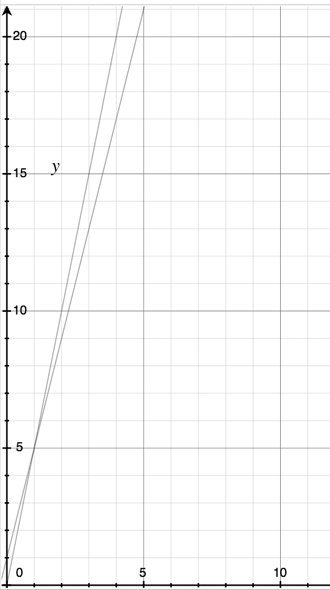
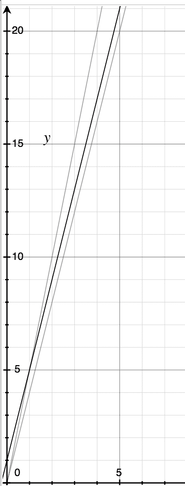

# 大 O 符号、空间和时间复杂性

在前面的章节中，我们经常谈到优化我们的代码/算法，并简要使用了术语空间和时间复杂性，以及我们希望如何降低它们。顾名思义，我们希望将代码的复杂性保持在最低限度，但这意味着什么呢？所说的复杂性有哪些不同的层次？我们如何计算一个算法的空间和时间复杂度？这些是我们将在本章讨论以下主题时讨论的问题:

*   不同程度的时间复杂性
*   空间复杂性与辅助空间

# 术语

作为开发人员，在讨论算法的空间和时间复杂性时，经常会遇到这样的术语。流行术语如 **Big-O** *、*又称 **O(某物)** *、*以及一些不太流行的术语如 **Omega(某物)**或 **Theta(某物)**常被用来描述算法的复杂性。O 实际上代表顺序，代表函数的顺序。

我们先只谈一个算法的时间复杂度。这基本上可以归结为我们试图找出一个系统为给定数据集(D)执行我们的算法需要多长时间。我们可以在所述系统上运行该算法，并记录其性能，但由于并非所有系统都相同(例如，操作系统、处理器数量和读写速度)，我们不一定能期望结果真实地表示为数据集 d 执行我们的算法所需的平均时间。同时，我们还需要知道我们的算法如何随着数据集 d 的大小而变化。10 个元素和 1000 个元素是否需要相同的时间？还是时间呈指数级增长？

综上所述，我们如何清楚地理解一个算法的复杂性？我们通过将一个算法分解成一组基本操作，然后将它们组合起来，得到每个操作的总数量/复杂性。这真正地将算法的时间复杂度定义为随着输入数据集的大小 d 的时间增长率。

现在，为了抽象地计算时间复杂度，让我们假设我们有一台机器，它需要一个时间单位来执行一些基本操作，如读、写、赋值、算术和逻辑计算。

说了这么多，让我们用一个简单的函数返回给定数字的平方:

```js
function square(num) {
    return num*num;
}
```

我们已经定义了我们的机器，它消耗一个单位的时间来执行乘法，另外 1 个单位来返回结果。不考虑输入，我们的算法总是只需要 2 个时间单位，由于这是不变的，所以被称为恒定时间算法。这里的时间常数是 k 个时间单位并不重要。我们可以将所有类似的函数表示为一组函数`O(1)`或`big-O(1)`，这些函数需要恒定的时间来执行。

让我们举另一个例子，在这个例子中，我们循环遍历大小为 n 的列表，并将每个元素乘以一个因子:

```js
function double(array) {
    for(var i = 0; i <  array.length; i++) {
        array[i] *= 2;
    }

    return array;
}
```

为了计算这个函数的时间复杂度，我们需要首先计算执行这个函数中每个语句的成本。

第一条语句执行 *n + 1* 次后才脱离，每次执行都要花费 1 个单位的增量和 1 个单位的比较检查等。换句话说，我们可以假设它在每次迭代中花费了我们*C*<sub xmlns:epub="http://www.idpf.org/2007/ops">T5【1】</sub>个时间单位，因此对于下面一行代码，总成本为 *C <sub>1</sub> *(n+1)* :

```js
for(var i = 0; i <  array.length; i++) {
```

在下一条语句中，我们将给定索引处数组中的值乘以因子 2。因为这是在循环内，所以这个语句被执行 n 次，每次都要花费我们*C<sub>2</sub>T3】个单位。所以，这条线的总执行成本是 *C <sub>2</sub> * n* :*

```js
array[i] *= 2;
```

然后，我们终于有了 return 语句，它也花费了恒定的时间量——C*<sub>3</sub>*—来将最终数组返回给调用者。将所有这些成本放在一起，我们得到该方法的总成本如下:

```js
Tdouble = C1*(n + 1) + C2* n + C3;
        = C5 * n + C4 // where C4 = C3 + C1 and C5 = C1 + C2
```

我们可以看到，在这种情况下，方法的成本与输入数组的大小成正比，`N`。因此，这组函数可以用`O(n)`表示，表示它们与输入大小成正比。

然而，在我们跳到更多的例子之前，让我们先来看看我们将如何在没有所有计算的情况下表示复杂性。

# 渐近符号

当我们想要推导和比较两个或更多算法的时间复杂度时，渐近符号就派上了用场。渐近符号的意思是，一旦我们计算出一个算法的时间复杂度，我们只需开始用一个非常大的数字(趋向于无穷大)替换 *n* (我们算法的输入大小)，然后从等式中去掉常数。这样做将留给我们唯一真正影响我们执行时间的因素。

让我们举一个与上一节相同的例子:

```js
Tdouble = C1*(n + 1) + C2* n + C3;
        = C5 * n + C4 // where C4 = C3 + C1 and C5 = C1 + C2
```

当我们应用我们刚刚描述的与渐近符号相关的规则，即 *n - > Infinity* 时，我们可以很快看到`C<sub>4</sub>`的影响相当小，可以忽略不计。对于乘法因子`C<sub>5</sub>`，我们也可以这么说。我们剩下的是，这一次，`T<sub>double</sub>`与输入数组`(n)`的大小成正比，因此我们能够用`O(n)`符号表示这一点，因为在这种情况下，大小 n 是唯一重要的变量。

渐近符号有三种主要类型，可用于对算法的运行时间进行分类:

*   **大 O** :代表运行时增长率的上限
*   **ω**:代表运行时间增长率的下限
*   **θ**:表示运行时间增长率的紧边界

# 大 0 符号

假设我们有一个`f(n)`方法，我们想用时间复杂度函数(即 Set) `g(n)`来表示:

`f(n)`是`O(g(n))`如果且仅当存在常数 c 和 n <sub>0</sub> ，其中`f(n) <= cg(n)`和输入大小`n >= n<sub>0</sub>`。

现在，让我们试着将它应用到前面的例子中:

```js
f(n) = Tdouble = C5 * n + C4 
f(n) = Tdouble = 4n + 1 // cause C5 and C4 can be any constants
```

对于这个例子，我们用集合`O(n)`表示，即`g(n) = n`。

为了使我们的时间复杂性断言成立，我们需要满足以下条件:

```js
4n + 1 <= c * n , where n >= n0
```

数值`c = 5`和`n<sub>0</sub> = 1`满足该方程。另外，既然符合定义，我们可以有把握地说`f(n)`函数是`big-O(g(n))`，也就是`O(g(n))`或者，在这种情况下，`O(n)`。当绘制在图表上时，我们也可以看到这一点，如下图所示；`n = 1`取值后，我们可以看到`c * g(n)`的值总是渐近大于`f(n)`。请看下图:



# 欧米茄符号

类似于前面讨论的大 O 表示法，Omega 表示法表示算法运行时间增长的下限。所以，如果我们有一个`f(n)`方法，我们想用时间复杂度函数(即集合)`g(n)`来表示，那么 Omega 符号可以定义如下:

`f(n)`是`O(g(n))`当且仅当存在常数 c 和 n <sub>0</sub> 其中`f(n) >= cg(n)`为输入尺寸`n >= n<sub>0</sub>`。

举前面同样的例子，我们有`f(n) = 4n + 1`然后`g(n) = n`。我们需要验证 c 和 n <sub>0</sub> 的存在，以便前面的条件成立，如下面的代码片段所示:

```js
4n + 1 >= c * n , where n >= n0 
```

我们可以看到这个条件适用于`c = 4`和`n<sub>0</sub> = 0`。因此，我们可以说我们的功能`f(n)`是`Ω(n)`。我们也可以在图表上绘制出来，看看它是如何表示我们的函数 f(n)及其上限和下限的:



从前面的图中，我们可以看到我们的函数——`f(n)`——(黑色)位于我们的渐近上下限(灰色)之间。 *x* 轴表示尺寸值( *n* )。

# θ符号

计算了我们函数`f(n)`的上限和下限增长率后，我们现在也可以确定我们函数`f(n)`的紧边界或θ。因此，如果我们有一个`f(n)`方法，我们想用时间复杂度函数(也称为集合)`g(n)`来表示，那么函数的紧界可以定义如下:

f(n) is O(g(n)) if , and only if , there exists constants c and n<sub>0,</sub> where c<sub>1</sub>g(n) < = f(n) <= c<sub>2</sub>g(n) where the input size n >= n<sub>0</sub>

前面的操作，从前面两个部分开始，已经为我们的函数计算过了，即`f(n) = 4n + 1`:`c<sub>1</sub> = 4`、`c<sub>2</sub> = 5`和`n<sub>0</sub> = 1`的值。

这为我们提供了函数`f(n)`的紧束缚，并且，由于函数总是位于`n = 1`之后的紧束缚内，我们可以有把握地说，我们的函数 f(n)具有与`θ(n)`一样的紧束缚增长率。

# 概述

在进入下一个主题之前，让我们快速了解一下我们讨论过的不同类型的符号:

*   `O`表示`f(n)`的增长率渐近小于或等于 *g(n)* 的增长率
*   `Ω`表示`f(n)`的增长率渐近大于或等于 *g(n)* 的增长率
*   `θ`表示`f(n)`的增长率渐近等于`g(n)`的增长率

# 时间复杂性的例子

现在让我们检查一些时间复杂度计算的例子，因为在 99%的情况下，我们需要知道函数执行可能需要的最长时间；我们将主要分析最坏情况下的时间复杂度，即基于函数输入的增长率上限。

# 恒定时间

恒定时间函数的执行时间相同，与传递给函数的输入大小无关:

```js
function square(num) {
    return num*num;
}
```

前面的代码片段是一个常数时间函数的例子，用 O(1)表示。恒定时间算法是最受欢迎的算法，原因显而易见，例如它们在恒定时间内运行，与输入的大小无关。

# 对数时间

对数时间函数的执行时间与输入大小的对数成正比。考虑以下示例:

```js
for(var i = 1; i < N; i *= 2) {
    // O(1) operations
}
```

我们可以看到，在任意给定的迭代中， *i = 2 <sup>i</sup>* 的值，因此在*n<sup>th</sup>T7】迭代中，*I = 2<sup>n</sup>T11】的值。另外，我们知道 *i* 的值总是小于环本身的大小( *N* )。由此，我们可以推导出以下结果:**

```js
2n < N

log(2n) < log(N)

n < log(N) 
```

从前面的代码中，我们可以看到迭代次数总是小于输入大小的日志。因此，这种算法最差的时间复杂度是`O(log(n))`。

让我们考虑另一个例子，在下一次迭代中，我们将`i`的值减半:

```js
for(var i = N; i >= 1; i /= 2) {
    // O(1) operations
}
```

这里`n<sup>th</sup>`迭代中`i`的值为`N/2<sup>n</sup>`，我们知道循环以`1`的值结束。所以，为了让我们的循环停止，`i`的值需要是`<= 1`；现在，通过结合这两个条件，我们得到以下结果:

```js
N/2n <= 1

N <= 2n

Log(N) <= n
```

我们可以再次得出与第一个示例类似的结论，迭代次数将始终小于输入大小或值的日志值。

需要注意的一点是，这不仅限于翻倍或减半现象。这可以应用于步骤数减少一个因子`k`的任何算法。这种算法最差的时间复杂度是`O(log<sub>k</sub>(N))`，在前面的例子中，`k`恰好是`2`。

对数时间复杂度算法是下一个热门算法，因为它们以对数方式消耗时间。即使输入的大小加倍，算法的运行时间也只会增加一个小的数字(这是对数的定义)。

# 线性时间

现在让我们讨论一个最常见的时间复杂性，线性时间。可以猜测，方法的线性时间复杂度表明该方法需要线性时间来执行:

```js
for(var i = 0; i < N; i += c) {
    // O(1) operations
}
```

这是一个非常基本的`for`循环，我们在其中执行一些恒定时间的操作。随着 N 的增加，循环执行的次数也增加。

如您所见，每次迭代中`i`的值由常数`c`递增，而不是由`1`递增。这是因为增量是什么并不重要，只要它们是线性的。

在第一次迭代中，`i = 0`的值；在第二次迭代中，`i = c`的值，然后在第三次迭代中它的`c + c = 2c`，以及在第四次迭代中的`3c`，以此类推。所以，在第 n 次迭代中，我们有`i = c(n-1)`的值，它渐近为`O(n).`

根据您的用例，线性时间复杂度可能好，也可能不好。这是一种灰色区域，如果你不确定是否有必要进一步优化，你有时可能想放开它。

# 二次时间

有了二次时间算法，我们现在已经进入了时间复杂性的黑暗面。顾名思义，输入的大小会二次影响算法的运行时间。一个常见的例子是嵌套循环:

```js
for (int i = 0; i <n; i += c) {
    for (int j = 0; j < n; j += c) {
        // some O(1) expressions
    }
}
```

从前面的例子可以看出，对于`i = 0`，内循环运行 *n 次*，对于`i = 1`和`i = 2`等等也是如此。内循环总是运行 n 次，并且不依赖于 n 的值，因此使得算法时间复杂`O(n<sup>2</sup>)`。

# 多项式时间

多项式时间复杂度是算法的运行时间复杂度，运行到`n<sup>k</sup>`的数量级。二次时间算法是某些类型的多项式时间算法，其中`k = 2`。这种算法的一个非常简单的例子如下:

```js
for (int i = 0; i <n; i += c) {
    for (int j = 0; j < n; j += c) {
        for (int k = 0; k < n; k += c) {
            // some O(1) expressions
        }
    }
}
```

如你所见，这个例子只是二次时间部分例子的扩展。这种情况的最坏情况复杂度是`O(n<sup>3</sup>)`。

# 多项式时间复杂度类

现在我们已经开始了这个对话，到目前为止我们在这里讨论的大多数时间复杂度类型都是`O(n<sup>k</sup>)`类型，例如，对于`n = 1`它是一个恒定的时间复杂度，而对于`k = 2`它是二次复杂度。

多项式时间复杂性的概念将我们引入一类问题，这些问题是根据其解的复杂性来定义的。以下是类的类型:

*   **P** :任何可以在多项式时间`O(n<sup>k</sup>)`内解决的问题。
*   **NP** :任何可以在多项式时间内验证的问题。可能存在可以在非确定性多项式时间内解决的问题(如数独求解)。如果这些问题的解可以在多项式时间内得到验证，那么这个问题就被归为 NP 类问题。NP 类问题是 P 类问题的超集。
*   **NP-Complete** :任何可以在多项式时间内化简为另一个 NP 问题的函数的 NP 问题都可以归为 NP-Complete 问题。这意味着如果我们知道某个 **NP** 问题的解，那么另一个 NP 问题的解可以在多项式时间内导出。
*   **NP-Hard** :如果存在可以在多项式时间内化简为 H 的 **NP-Complete** 问题(C)，则问题可以归为 NP-Hard 问题(H)。

在大多数现实场景中，我们会遇到很多 P 和 NP 问题，NP 类问题的一个经典例子是《旅行推销员》，一个推销员想去`n`个城市，从他家开始和结束他的旅行。有了限量的汽油和可行驶的总里程上限，销售员能走遍所有的城市而不耗尽汽油吗？

# 递归和加法复杂性

到目前为止，我们已经看到了一些非常简单的例子:它们都有一个循环或嵌套循环。然而，在很多情况下，我们将不得不处理源自同一算法的多个循环/函数调用/分支。让我们看一个例子，在这种情况下，我们如何计算复杂性？

1.  当我们有后续的循环/函数调用时，我们将需要计算每个步骤的单个复杂性，然后将它们相加以获得整体复杂性，如下所示:

```js
            function xyz() {

                abc(); // O(n) operation

                pqr(); // O(log(n)) operation

            }
```

这个代码的总体复杂性将是这两个部分复杂性的总和。因此，在这种情况下，整体复杂性将是`O(n + log n)`，渐近地将是`O(n)`。

2.  当我们的函数中有不同时间复杂度的分支时，取决于我们讨论的运行时复杂度的类型，我们需要选择正确的选项:

```js
        function xyz() {

            if (someCondition) {

                abc(); // O(n) operation

            } else {

                pqr(); // O(log(n)) operation

            }

        }
```

在这种情况下，最坏情况的复杂性将由两个分支中最差的一个来决定，它将是`O(n)`，但是最好情况的复杂性将是`O(log(n))`。

3.  与非递归算法相比，递归算法有点棘手，因为我们不仅需要确定算法的复杂性，还需要记住递归会被触发多少次，因为这会增加算法的整体复杂性，如下面的代码片段所示:

```js
        function rec1(array) {
            // O(1) operations

            if (array.length === 0) return;

            array.pop();

            return rec1(array);
        }
```

虽然我们的方法只执行一些`O(1)`操作，但它不断地改变输入并调用自己，直到输入数组的大小为零。因此，我们的方法最终执行了 n 次，使得`O(n)`的整体时间变得复杂。

# 空间复杂性与辅助空间

在谈论某个算法的空间复杂度时，空间复杂度和辅助空间是两个最常混淆和互换使用的术语:

*   **辅助空间:**算法为完成工作而临时占用的额外空间
*   **空间复杂度:**空间复杂度是算法相对于输入大小所占用的总空间加上算法使用的辅助空间。

当我们试图比较两个算法时，我们通常有一个相似类型的输入，也就是说，输入的大小可以忽略不计，因此我们最终比较的是算法的辅助空间。使用这两个术语都没什么大不了的，只要我们理解两者的区别并正确使用它们。

如果我们使用的是 C 这样的低级语言，那么我们可以根据数据类型来分解所需/消耗的内存，例如，2 个字节存储一个整数，4 个字节存储浮点，等等。然而，由于我们使用的是高级语言 JavaScript，这并不那么简单，因为我们没有明确区分不同的数据类型。

# 空间复杂性的例子

说到算法的空间复杂度，我们有类似于时间复杂度的类型，比如常数空间`S(1)`和线性空间`S(N)`。让我们看看下一节中的一些例子。

# 恒定空间

常数空间算法是这样一种算法，其中算法消耗的空间不会因输入的大小或算法输入参数而以任何方式改变。

在这一点上，我想重申，当我们谈论算法的空间复杂性时，我们谈论的是算法消耗的辅助空间。这意味着，即使我们的数组大小为 *n* ，算法消耗的辅助(或额外)空间也将保持不变，如以下代码片段所示:

```js
function firstElement(arr) {
    return arr[0];
}
```

这里我们可以看到`firstElement`方法不占用更多的空间，不管输入是什么。因此，我们可以称之为空间复杂性`S(1)`。

# 线性空间

线性空间算法是一种算法占用的空间量与输入的大小成正比的算法，例如，在数组上循环并在返回值之前将值推送到新数组的算法:

```js
function redundant(array) {
    var result = [];

    for(var i = 0, i < array.size; i++) {
        result.push(array[i]);
    }

    return result;
}
```

正如您所看到的，虽然冗余，但我们正在创建一个新数组，并将所有值推入该数组，这将占用与输入数组相同的空间。考虑您在`push`之前有条件的情况，如下代码所示:

```js
function notRedundant(array) {
    var result = [];

    for(var i = 0, i < array.size; i++) {
        if (someCondition) {
            result.push(array[i]);
        }
    }

    return result;
}
```

在最坏的情况下，`someCondition`标志始终为真，我们最终得到的结果再次与输入的大小相同。因此，我们可以断言前面方法的空间复杂度是`S(n)`。

# 摘要

在这一章中，我们触及了一种被称为计算复杂性的野兽的表面。计算的复杂性比我们在本章中讨论的要多得多。然而，本章讨论的主题和例子是我们大多数人在日常工作中面临的。在空间复杂度方面有更高级的话题，比如 LSPACE，这是一类可以在对数空间和 NLSPACE 中解决的问题，NLSPACE 是空间的量，但是使用的是非确定性的图灵机。本章的主要目标是确保我们理解算法的复杂性是如何计算的，以及它如何影响整体输出。在下一章中，我们将讨论我们可以对应用进行什么样的微优化，并了解浏览器(主要是 Chrome)的内部工作方式，以及我们如何利用它们来改进我们的应用。