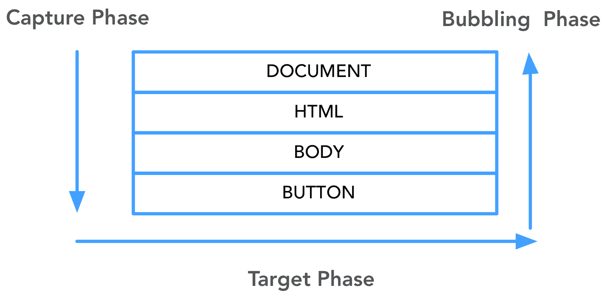
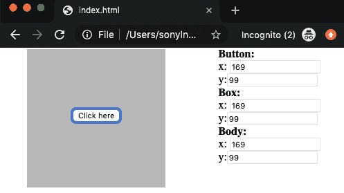
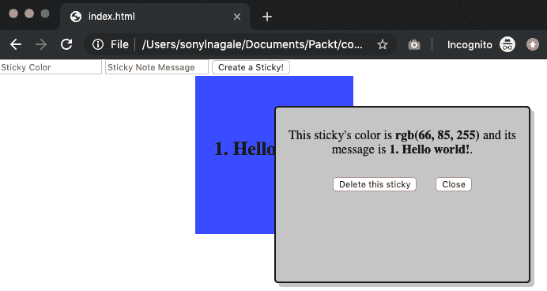

Events, Event-Driven Design, and APIs

前端应用程序的核心是*事件*。 JavaScript 允许我们监听和响应用户和浏览器事件，以一种直观的方式为用户更改内容，以创建优雅的用户界面和体验。 我们需要知道如何使用这些被丢弃的数据包。 浏览器事件是我们的面包和黄油-他们允许我们有更多的静态应用程序，相反，是动态的! 通过理解事件，您将成为一名完整的 JavaScript 开发人员。

本章将涵盖以下主题:

*   事件生命周期
*   捕获事件并读取其属性
*   使用 Ajax 和事件填充 API 数据
*   处理异步性

# 技术要求

准备使用存储库的`Chapter-7`目录中提供的代码:[https://github.com/PacktPublishing/Hands-on-JavaScript-for-Python-Developers/tree/master/chapter-7](https://github.com/PacktPublishing/Hands-on-JavaScript-for-Python-Developers/tree/master/chapter-7)。

# 事件生命周期

当一个事件在 JavaScript 中发生时，它不是简单地发生然后消失——它经历一个*生命周期*。 这个生命周期有三个阶段:

*   **俘获**相
*   **靶向**期
*   **冒泡**相

考虑以下 HTML:

```js
<!doctype html>
<html>

<head>
  <title>My great page</title>
</head>

<body>
  <button>Click here</button>
</body>

</html>
```

我们可以这样想象:



Figure 7.1 – The event life cycle

现在，当涉及到事件时，还有一些重要的事情需要考虑:它们不仅对确切的目标产生影响，而是对整个对象堆栈产生影响。 在我们描述捕获、目标和冒泡需要什么之前，先看看下面的代码表示:


Figure 7.2 – Event layering

如果我们把页面看作一个层蛋糕，我们可以看到这个事件(由箭头表示)必须通过 DOM 的所有层才能到达按钮。 这是我们的**俘获**阶段。 当单击按钮时，将事件*分派*到事件流中。 首先，事件查看文档对象。 然后它穿过 DOM 的各个层，直到到达预期的目的地:按钮。

现在事件已经到达按钮，我们开始**目标**阶段。 事件应该从按钮获取的任何信息都将被收集起来，例如事件类型(例如单击或鼠标悬停)和其他细节，例如游标的*X*/*Y*坐标。

最后，事件通过层返回到冒泡阶段的文档。 **冒泡**阶段允许我们通过父元素处理*上任何*元素上的事件。

让我们在实践中看看这个，并对我们的事件做一点小小的调整。 在浏览器中找到以下目录，打开`index.html`—[https://github.com/PacktPublishing/Hands-on-JavaScript-for-Python-Developers/tree/master/chapter-7/events](https://github.com/PacktPublishing/Hands-on-JavaScript-for-Python-Developers/tree/master/chapter-7/events):



Figure 7.3 – Events playground

如果我们看一看这个页面，并在上面玩上几分钟，我们会看到一些东西:

*   当鼠标在页面上移动时，右侧的*X*/*Y*坐标也会发生变化。
*   当我们打开控制台时，它将显示关于我们的点击事件以及*阶段*发生的消息。

让我们看一下[https://github.com/PacktPublishing/Hands-on-JavaScript-for-Python-Developers/blob/master/chapter-7/events/index.js](https://github.com/PacktPublishing/Hands-on-JavaScript-for-Python-Developers/blob/master/chapter-7/events/index.js)中的`index.js`代码。

从第 1 行到第 5 行，我们只是简单地设置了一个数据对象来将数字代码映射到字符串。 到目前为止，一切顺利。 现在，让我们看一下第 32 行，其中显示了`document.querySelector('html').addEventListener('click', logClick, true)`。 这个可选的布尔参数对我们来说是新的; 当将其放入事件监听器时，它只是说“让我在*捕获*阶段监听”。 因此，当我们单击页面上的任何位置时，我们将得到一个单击事件，其中包含在 HTML 捕获阶段触发的单击事件信息。 这个事件之前被处理为 undefined 因为它是第一次遇到这个事件。 它还没有形成泡沫，也没有成为目标。

让我们在下一节继续分析这个示例，了解代码的这些神秘部分。

# 捕获事件并读取其属性

我们将继续使用我们的`events`操场代码:[https://github.com/PacktPublishing/Hands-on-JavaScript-for-Python-Developers/blob/master/chapter-7/events/index.js](https://github.com/PacktPublishing/Hands-on-JavaScript-for-Python-Developers/blob/master/chapter-7/events/index.js)

在第 32-34 行，我们注册了三个单击事件监听器，如下所示:

```js
document.querySelector('html').addEventListener('click', logClick, true)
document.querySelector('body').addEventListener('click', logClick)
document.querySelector('button').addEventListener('click', logClick)
```

正如我们所讨论的，第一个是在捕获阶段监听，因为我们已经包含了最终的布尔参数。

在第 16-29 行我们也有三个`mousemove`事件。 让我们来看看其中的一个:

```js
document.querySelector('button').addEventListener('mousemove', (e) => {
  document.querySelector('#x').value = e.x
  document.querySelector('#y').value = e.y
})
```

我希望这大部分是有意义的——我们使用了一个新的事件类型`mousemove`，所以这个事件表示“当用户的鼠标移动到按钮上时，执行这段代码。” 就是这么简单。 我们正在执行的代码是将 id 为`x`和`y`的输入值设置为*事件*的*x 和 y 值。 事件物品的神奇之处在于:它携带了大量的信息。 继续，在这个函数中添加一行`console.log(e)`，看看记录了什么，如下面的截图所示:*


Figure 7.4 – Logging events

正如预期的那样，每次鼠标移动到 Click Here 上时，事件将被触发，MouseEvent 将注销。 打开其中一项活动。 您将看到类似于以下内容:


Figure 7.5 – MouseEvent

在这里，我们看到了关于事件的大量信息，包括(如预期的那样)鼠标当时的*X*和*Y*坐标。 这些属性中有许多是有用的，但其中一个特别要注意的是`target`。 事件的目标是我们放置事件监听器的节点。 从`target`属性中，我们可以获得它的 ID，如果我们对多个节点有一个事件处理程序，这很有用。

你还记得我们在[第 6 章](06.html)，*文档对象模型(DOM)*中的便利贴程序吗? 现在我们来扩充它。

## 便签重新审视

让我们仔细看看我们的便利贴程序[第 6 章](06.html)， *文档对象模型(DOM)——*[https://github.com/PacktPublishing/Hands-on-JavaScript-for-Python-Developers/tree/master/chapter-7/stickies/starter-code](https://github.com/PacktPublishing/Hands-on-JavaScript-for-Python-Developers/tree/master/chapter-7/stickies/starter-code)——包括能够创建一个模态窗口,信息粘性当点击删除,粘性的能力, 如下截图所示:



Figure 7.6 – New and improved sticky note creator

要成功地编写此代码，您需要使用一个新的 DOM 操作方法:`.remove()`。 查看[https://developer.mozilla.org/en-US/docs/Web/API/ChildNode/remove](https://developer.mozilla.org/en-US/docs/Web/API/ChildNode/remove)的文档。 你可能还想看一下 CSS 属性`visibility`来显示和隐藏模态窗口。

只是为了好玩，我还包含了一个小型 JavaScript 库，用于使用颜色选择器的粘性颜色字段，作为一个示例，说明包含第三方代码是多么简单。 你不需要使用`jscolor.js`脚本做任何事情; 它会自动工作的。

## 便利贴——解决方案 1

您是否得到了类似以下代码的内容?

```js
01: const container = document.querySelector('.container') // set 
    .container to a variable so we don't need to find it every time 
     we click
02: let noteCount = 1 // inital value
03: const messageBox = document.querySelector('#messageBox')
04: 
05: // access our button and assign a click handler
06: document.querySelector('.box-creator-button').addEventListener(
    'click', () => {
07:   // create our DOM element
08:   const stickyNote = document.createElement('div')
09: 
10:   // set our class name
11:   stickyNote.className = 'box'
12: 
13:   // get our other DOM elements
14:   const stickyMessage = document.querySelector('.box-color-note')
15:   const stickyColor = document.querySelector('.box-color-input')
16: 
17:   // get our variables
18:   const message = stickyMessage.value
19:   const color = stickyColor.style.backgroundColor
20: 
21:   // blank out the input fields
22:   stickyMessage.value = stickyColor.value = ''
23:   stickyColor.style.backgroundColor = '#fff'
24: 
25:   // define the attributes
26:   stickyNote.innerHTML = `${noteCount++}. ${message}`
27:   stickyNote.style.backgroundColor = color
28: 
29:   stickyNote.addEventListener('click', (e) => {
30:     document.querySelector('#color').innerHTML = 
        e.target.style.backgroundColor
31:     document.querySelector('#message').innerHTML = e.target.innerHTML
32: 
33:     messageBox.style.visibility = 'visible'
34: 
35:     document.querySelector('#delete').addEventListener('click', (event) => {
36:       messageBox.style.visibility = 'hidden'
37:       e.target.remove()
38:     })
39:   })
40: 
41:   // add the sticky
42:   container.appendChild(stickyNote)
43: })
44: 
45: document.querySelector('#close').addEventListener('click', (e) => {
46:   messageBox.style.visibility = 'hidden'
47: })
```

You can find this code file on GitHub at [https://github.com/PacktPublishing/Hands-on-JavaScript-for-Python-Developers/tree/master/chapter-7/stickies/solution-code-1](https://github.com/PacktPublishing/Hands-on-JavaScript-for-Python-Developers/tree/master/chapter-7/stickies/solution-code-1).

这里有一些有趣的部分，比如我们的 sticky click 处理程序从第 29 行开始。 加上一些新朋友，这些看起来应该很熟悉。 首先，单击处理程序使用事件的 target 属性在消息框中设置带有目标属性的文本。 我们不需要搜索整个 DOM 来找到我们的属性。 事实上，当已经通过事件对象传递给我们信息时，这样做将是一个昂贵且浪费的操作。 第 33 行修改模态窗口的 CSS 以显示它，在第 37 行，当单击模态的 delete 按钮时，我们删除了 sticky。

这工作得很好! 然而，由于事件的生命周期，我们可以使用事件的另一个特性来提高代码的效率:*事件委托*。

## 便利贴-解决方案 2 -事件委托

**事件委托**的原理是在父事件上注册一个事件监听器，并让事件传播告诉我们哪个元素被点击了。 还记得我们的事件生命周期图和事件所经过的层吗? 我们可以利用这一点。 看一下第 37 行，如下所示:

```js
container.addEventListener('click', (e) => {
 if (e.target.className === 'box') {
   document.querySelector('#color').innerHTML = 
    e.target.style.backgroundColor
   document.querySelector('#message').innerHTML = e.target.innerHTML
   messageBox.style.visibility = 'visible'
   document.querySelector('#delete').addEventListener('click', (event) => {
     messageBox.style.visibility = 'hidden'
     e.target.remove()
   })
 }
})
```

You can find this code on GitHub at [https://github.com/PacktPublishing/Hands-on-JavaScript-for-Python-Developers/blob/master/chapter-7/stickies/solution-code-2/script.js#L37](https://github.com/PacktPublishing/Hands-on-JavaScript-for-Python-Developers/blob/master/chapter-7/stickies/solution-code-2/script.js#L37).

在这段代码中，我们从粘性创建逻辑中删除了单击侦听器的附件，并将其抽象为要附加到整个容器。 当点击`container`时，我们检查目标是否有`box`作为其类。 如果是，则执行逻辑! 这是对事件监听器的更有效使用，特别是在动态创建元素时。 在某些情况下，事件委托将是您的最佳选择，并且在任何一种情况下都可以工作。

但现在我们有另一个问题:每次单击 sticky 时，一个新的单击处理程序就会添加到删除按钮中。 这不是很有效率。 看看您是否可以重构代码来消除这个问题。

## 便利贴——解决方案 3

这里有一个可能的解决方案:

```js
let target = {}

...

container.addEventListener('click', (e) => {
  if (e.target.className === 'box') {
    document.querySelector('#color').innerHTML = 
     e.target.style.backgroundColor
    document.querySelector('#message').innerHTML = e.target.innerHTML
    messageBox.style.visibility = 'visible'
    target = e.target
  }
})

document.querySelector('#delete').addEventListener('click', (event) => {
  messageBox.style.visibility = 'hidden'
  target.remove()
})
```

You can find this solution on GitHub at [https://github.com/PacktPublishing/Hands-on-JavaScript-for-Python-Developers/blob/master/chapter-7/stickies/solution-code-3/script.js](https://github.com/PacktPublishing/Hands-on-JavaScript-for-Python-Developers/blob/master/chapter-7/stickies/solution-code-3/script.js).

虽然这使用了一个全局变量，但它仍然更有效率。 通过将整个程序封装在一个函数或类中，我们可以消除全局变量，但这对这个概念并不重要。

现在我们来看看 Ajax 以及事件如何与程序的生命周期相关联。 让我们做个实验吧!

# 使用 Ajax 和事件填充 API 数据

让我们把它们放在一起。 在这个实验中，我们将使用 PokéAPI:[https://pokeapi.co/](https://pokeapi.co/)创建一个简化的 Pokémon 游戏。

下面是我们的游戏的结局:[https://sleepy-anchorage-53323.herokuapp.com/](https://sleepy-anchorage-53323.herokuapp.com/)。 打开这个站点，尝试一下它的功能。

请抵制住诱惑，不要查看完成的 JavaScript 文件(目前)。

以下是你访问前一个 URL 并开始玩游戏时所看到的截图:


Figure 7.7 – Pokémon game

所有的 HTML 和 CSS 已经提供给你。 您将在`main.js`文件中工作:[https://github.com/PacktPublishing/Hands-on-JavaScript-for-Python-Developers/tree/master/chapter-7/pokeapi/starter-code](https://github.com/PacktPublishing/Hands-on-JavaScript-for-Python-Developers/tree/master/chapter-7/pokeapi/starter-code)。

如果你不熟悉 Pokémon，不要担心! 这个游戏背后的逻辑是基本的。 (如果你*熟悉游戏，请原谅这种简化的方法。)*

下面是我们将要做的:

1.  查询所有“Pokémon”。
2.  用 Pokémon 的名称和它们的 API url 的值填充选择列表，如 API 所提供的。
3.  完成后，切换 CSS 属性以显示播放器选择。
4.  允许两个玩家各自选择自己的 Pokémon。
5.  创造功能，让每个玩家使用 Pokémon 的行动对抗对方。
6.  根据最大能量产生的随机数字减少其他玩家的 Pokémon 生命值。
7.  显示覆盖文字说明它是有效的。
8.  如果移动没有力量属性，显示覆盖，说明它无效。
9.  当一个 Pokémon 的生命值为`0`或更低时，显示对手晕倒的叠加。

让我们分解启动代码。

## 起动器代码

让我们一段一段地看一下初始代码，因为它引入了 JavaScript 的一个新公式:类! 如果你熟悉 Python 或其他语言中的类，这篇 ES6 介绍将作为 JavaScript 使用的一个受欢迎的提醒。 让我们开始:

```js
class Poke {
  ...
}
```

首先，在 JavaScript ES6 中声明类时，我们只需创建一个对象! 现在，物体的细节*与我们所习惯的有些不同，但许多原理是相同的。 要创建类的实例，我们可以在完成类代码后输入`const p = new Poke()`。*

在这之后，还有一些关于类的语法糖，比如构造函数、getter 和 setter。 请随意研究 JavaScript 中的类，因为它将帮助您实现总体目标。

我已经给了你一个构造函数的启动器，它是在你创建一个类的实例时执行的:

```js
constructor() {
    /**
      * Use the constructor as you would in other languages: Set up your 
        instance variables and globals
      */
  }
```

在构造函数中需要什么? 也许您想引用经常使用的 DOM 元素或事件处理程序? 然后，当然，问题出现了:我们如何*引用*我们创建的变量?

答案是`this`。 当使用类的全局变量时，可以在它前面加上`this.<variableName>`，这样所有方法都可以使用它。 这是最重要的部分:对于整个页面，它不是一个纯全局变量，而只是对于我们的类! 如果您回想一下前面的一些代码示例，我们没有处理这一部分; 这里有一种方法:

```js
choosePokemon(url, parent) {
…
const moves = data.moves.filter((move) => {
  const mymoves = move.version_group_details.filter((level) => {
    return level.level_learned_at === 1
  })
  return mymoves.length > 0
 })
}
```

因为每个 Pokémon 在游戏的不同阶段都有多个走法，这是在游戏开始时找到可用走法的逻辑。 您不必修改它，但请查看数组的`.filter()`方法。 我们之前没有讲过，但这是一个很有用的方法。 MDN 是一个很好的资源:[https://developer.mozilla.org/en-US/docs/Web/JavaScript/Reference/Global_Objects/Array/filter](https://developer.mozilla.org/en-US/docs/Web/JavaScript/Reference/Global_Objects/Array/filter)。

我们感兴趣的代码的下一部分是**setter**:

```js
set hp(event) {
  ...
  if (event.hp) {
    this[event.player].hp = event.hp
  }

  if (event.damage) {
    this[event.player].hp -= event.damage
  }
  const e = new CustomEvent("hp", {
    detail: {
      player: event.player,
      hp: this[event.player].hp
    }
  })
  document.dispatchEvent(e)
}
```

**setter**是一个处理设置或更改成员变量的类方法。 这个概念通常与**getter**一起使用，它允许我们抽象更改(或检索)变量时所需的操作逻辑。 在本例中，我们使用一些游戏逻辑来查看如何处理生命值。 但接着我们有了一个新的奇妙的想法:自定义事件。

## 自定义事件

使用`new CustomEvent()`指令，我们可以创建一个新的，命名的事件来在我们的程序中使用。 有时候，用户交互或页面行为并不能完全处理我们需要的内容。 定制事件可以帮助满足这一需求。 注意，在前面的代码中，`detail`对象包含要与事件一起传递的数据，我们使用`document.dispatchEvent()`将其发送到事件流。 为自定义事件创建事件监听器与使用内置事件相同:使用`.addEventListener()`。 我们将使用`doMove()`函数。

## 解决方案的代码

你的尝试结果如何? 你可以看看一个解决这个实验室的可能方法:[https://github.com/PacktPublishing/Hands-on-JavaScript-for-Python-Developers/tree/master/chapter-7/pokeapi/solution-code](https://github.com/PacktPublishing/Hands-on-JavaScript-for-Python-Developers/tree/master/chapter-7/pokeapi/solution-code)。

请记住，有多种方法可以解决编程问题，所以如果您的解决方案与提供的方法不匹配，也没关系! 主要的想法是解决问题。

# 处理异步性

正如我们在使用 api 时所看到的，Ajax 的异步特性需要两种创造性的方法。 在 Pokémon 游戏中，我们在调用完成时使用了加载转轮; 这种方法在现代网络中随处可见。 让我们以游戏中的一个例子为例:

```js
toggleLoader() {
  /**
    * As this is visual logic, here's the complete code for this function
    */
  if (this.loader.style.visibility === 'visible' || 
  this.loader.style.visibility === '') {
    this.loader.style.visibility = 'hidden'
  } else {
    this.loader.style.visibility = 'visible'
  }
}
```

所有的*这个*部分代码所做的是切换包含旋转图像的图层的可见性。 这都在 CSS 中(因为从技术上讲它不是一个图像，而是一个 CSS 动画)。 让我们看看它是如何使用的:

```js
getPokemon() {
    fetch('https://pokeapi.co/api/v2/pokemon?limit=1000')
      .then((response) => {
        return response.json()
      })
      .then((data) => {
        const pokeSelector = document.querySelector('.pokeSelector.main')

        data.results.forEach((poke) => {
          const option = document.createElement('option')
          option.value = poke.url
          option.innerHTML = poke.name
          pokeSelector.appendChild(option)
        })

        const selector = pokeSelector.cloneNode(true)
        document.querySelector('.pokeSelector.clone').replaceWith(selector)

        this.toggleLoader()

        document.querySelector('#Player1').style.visibility = 'visible'
        document.querySelector('#Player2').style.visibility = 'visible'
      })
  }
```

在这里，我们看到在我们的异步 Promise 调用`.then()`中，当一切都完成时，我们正在切换加载器! 这是一个漂亮的小包裹。 如果你想复习一下如何使用`fetch`和 Ajax 调用,再看一看[第四章](04.html),*数据和你的朋友,JSON*,在*API 调用 Ajax 前端——*部分。

在处理 Ajax 调用的固有异步特性时，重要的是要记住这样一个事实:我们不知道调用什么时候会带着数据返回——甚至不知道*和*是否会返回! 我们可以通过**错误处理**使代码更好。

## 错误处理

看看这段代码:

```js
fetch('/profile')
  .then(data => {
    if (data.status === 200) {
      return data.json()
    }
    throw new Error("Unable to get Profile.")
  })
  .then(json => {
    console.log(json)
  })
  .catch(error => {
    alert(error)
  })
```

我们这里有一些常见的疑点:一个`fetch`调用和`.then()`处理我们的结果。 现在看一下`new Error()`和`.catch()`。 就像在大多数语言中一样，JavaScript 有一种显式抛出错误的方法，在我们的`fetch`链的末尾，`.catch()`将在一个警告框中向用户显示错误。 最好的做法是在 Ajax 调用中包含错误处理，以防所调用的服务没有响应、没有及时响应或返回错误。 我们将在[第 9 章](09.html)，*decoding Error Messages and Performance Leaks*中进一步讨论错误。

## 星球大战 API 探索实验室

让我们开始更多的 Ajax 调用。 我们将使用流行的**星球大战 API**(**SWAPI**):[https://swapi.dev/](https://swapi.dev/)。 花几分钟熟悉文档和 API 的工作方式。

以下是我们将要构建的内容:


Figure 7.8 – Star Wars exploration

您可以在[https://packtpublishing.github.io/Hands-on-JavaScript-for-Python-Developers/chapter-7/swapi/solution-code/](https://packtpublishing.github.io/Hands-on-JavaScript-for-Python-Developers/chapter-7/swapi/solution-code/)进行功能试验。 在尝试重新创建功能之前，尽量克制仔细阅读解决方案代码的诱惑。

下面是我们的代码应该做的:

1.  在页面加载时显示加载器。 这个加载器是作为一个 CSS 动画提供给你的。
2.  调用`/people`SWAPI 端点来检索 API 中的所有人。 *提示:您将需要调用 SWAPI 多次获得所有的人。*
3.  用人员的名字填充选择列表并隐藏加载程序。
4.  当单击 Go 时，再次调用 SWAPI 来检索所选人员的详细信息并显示他们(至少是姓名)。

我们的方法是首先填充列表，然后为用户操作做准备，以便研究同步链接的事件和依赖于用户输入的异步操作。

初学者 HTML 和 CSS 不需要改变，我们的初学者 JavaScript 文件几乎是空的! 你准备好迎接挑战了吗? 好运！

### 一个解决方案

如果您查看解决方案代码，就会发现一种创建此功能的方法。 让我们分解一下。

就像在 Pokémon 游戏中一样，我们将使用一个类。 它的构造函数将存储一些不同的信息片段，并向 Go 按钮添加一个事件监听器:

```js
class SWAPI {
  constructor() {
    this.loader = document.querySelector('#loader')
    this.people = []

    document.querySelector('.go').addEventListener('click', (e) => {
      this.getPerson(document.querySelector('#peopleSelector').value)
    })
  }
```

接下来，正如我们所知道的，我们将对 SWAPI 进行多次调用，我们可以使自己成为一个帮助函数来促进这项工作。 它可能有四个参数:SWAPI API URL、以前结果的数组(如果我们正在分页的话很有用!)和类似 promise 的`resolve`和`reject`参数:

```js
  fetchThis(url, arr, resolve, reject) {
    fetch(url)
      .then((response) => {
        return response.json()
      })
      .then((data) => {
        arr = [...arr, ...data.results]
```

最后一行可能是新的。 `…`是扩展算子，它将数组扩展为数组的每个部分。 有了这个 ES6 特性，我们不需要遍历数组来将它连接到另一个数组或执行任何其他重分配魔法。 我们可以简单地分解结果，并将它们与现有结果结合起来:

```js
        if (data.next !== null) {
          this.fetchThis(data.next, arr, resolve, reject)
        } else {
          resolve(arr)
        }
```

在许多 api 中，如果数据集很大，则只返回有限的结果，并带有上一页和下一页数据的链接。 SWAPI 的命名法指定`.next`是查找是否有其他页面的属性。 否则，我们可以在`resolve`函数中返回结果:

```js
      })
      .catch((err) => {
        console.log(err)
      })
```

不要忘记错误处理!

```js
  }

  getPeople() {
    new Promise((resolve, reject) => {
        this.fetchThis('https://swapi.dev/api/people', this.people, 
        resolve, reject)
      })
      .then((response) => {
        this.people = response
        const peopleSelector = document.querySelector('#peopleSelector')

        this.people.forEach((person) => {
          const option = document.createElement('option')
          option.value = person.url
          option.innerHTML = person.name
          peopleSelector.appendChild(option)
        })
        this.toggleLoader()
        document.querySelector('#people').style.visibility = 'visible'
      })
      .catch((err) => {
        console.log(err)
      })
  }
```

试着通读`getPeople()`以了解它的作用。 有些是简单的操作，但`new Promise()`是这个功能的核心。 我们创建了一个新的 Promise，它使用了我们的`fetchThis`函数:

```js
  getPerson(url) {
    this.toggleLoader()
    fetch(url)
      .then((response) => {
        return response.json()
      })
      .then((json) => {
        document.querySelector('#person').style.visibility = 'visible'
        document.querySelector('#person h2').innerHTML = json.name
        this.toggleLoader()
      })
      .catch((err) => {
        console.log(err)
      })
  }
```

理论上，一旦点击按钮，我们也可以使用相同的`fetchThis`函数来获取单个的人，但只是为了我们的示例，这个解决方案将处理所有的事情:

```js
  toggleLoader() {
    if (this.loader.style.visibility === 'visible' ||
    this.loader.style.visibility === '') {
      this.loader.style.visibility = 'hidden'
    } else {
      this.loader.style.visibility = 'visible'
    }
  }
}
```

然后，所需要的就是实例化我们的类!

```js
const s = new SWAPI().getPeople()
```

此时，我们的程序已经完成并将运行! 访问该页面，您将看到我们的全面操作页面。 帕尔帕廷皇帝谢谢你帮我消灭叛军渣滓。 我们已经看到了类的强大功能、基于事件的编程以及利用事件为我们带来好处的能力。

# 总结

我们已经了解了事件、它们的生命周期以及事件驱动的设计是如何工作的。 **事件**由用户的操作触发(或根据程序逻辑以编程方式触发)，并进入**生命周期**。 在事件生命周期中，我们的程序可以获取由**事件对象**本身携带的许多信息，如鼠标位置或目标 DOM 节点。

通过理解 Ajax 如何处理事件，您将逐步成为一名成熟的 JavaScript 开发人员。 Ajax 非常重要，因为它是 JavaScript 和外部 api 之间的管道。 由于 JavaScript 是无状态的，客户端 JavaScript 没有会话的概念，因此 Ajax 调用本质上是**异步**是很重要的; 因此引入了`fetch`之类的工具。

恭喜你! 我们已经讲了很多非常密集的材料。 接下来是 JavaScript 框架和库。

# 问题

回答以下问题来衡量你对事件的理解:

1.  下面哪个是事件生命周期的第二阶段?
    1.  捕捉
    2.  针对
    3.  冒泡
2.  事件对象为我们提供了下列哪一项? -选择所有应用:
    1.  触发事件的类型
    2.  目标 DOM 节点(如果适用)
    3.  鼠标坐标(如果适用)
    4.  父 DOM 节点(如果适用)

请看下面的代码:

```js
container.addEventListener('click', (e) => {
  if (e.target.className === 'box') {
    document.querySelector('#color').innerHTML = 
     e.target.style.backgroundColor
    document.querySelector('#message').innerHTML = e.target.innerHTML
    messageBox.style.visibility = 'visible'
    document.querySelector('#delete').addEventListener('click', (event) => {
      messageBox.style.visibility = 'hidden'
      e.target.remove()
    })
  }
})
```

3.  在前面的代码中使用了哪些 JavaScript 特性? 选择所有应用:
    1.  DOM 操作
    2.  事件的代表团
    3.  事件注册
    4.  风格的变化
4.  当容器被点击时会发生什么?
    1.  `box`将是可见的。
    2.  `#color`将是红色的。
    3.  都是 1 和 2。
    4.  没有足够的背景。

5.  我们通常在事件生命周期的哪个阶段采取行动?
    1.  针对
    2.  捕捉
    3.  冒泡

# 进一步的阅读

*   *JavaScript:理解 DOM 事件生命周期*:[https://medium.com/prod-io/javascript-understanding-dom-event-life-cycle-49e1cf62b2ea](https://medium.com/prod-io/javascript-understanding-dom-event-life-cycle-49e1cf62b2ea)
*   w3schools.com - JavaScript events:[https://www.w3schools.com/js/js_events.asp](https://www.w3schools.com/js/js_events.asp)
*   MDN -事件参考:[https://developer.mozilla.org/en-US/docs/Web/Events](https://developer.mozilla.org/en-US/docs/Web/Events)