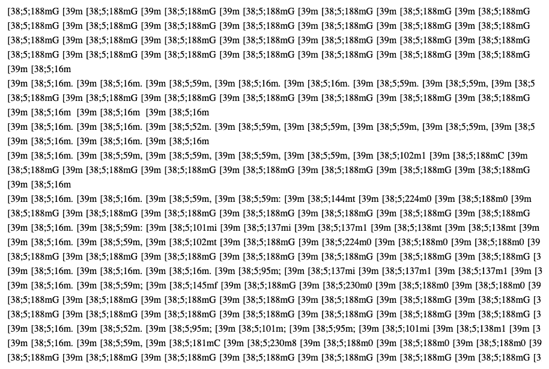

What Is Node.js?

现在我们已经在前端研究了 JavaScript 的使用，让我们使用 Node.js 深入研究它在“JavaScript 无处不在”范例中的作用。 ，*Can We Use JavaScript Server-Side? 当然! ，所以现在是时候深入研究如何使用它来创建丰富的服务器端应用了。*

本章将涵盖以下主题:

*   历史和使用
*   安装和使用
*   语法和结构
*   你好,世界!

# 技术要求

准备使用存储库的`Chapter-11`目录中提供的代码:[https://github.com/PacktPublishing/Hands-on-JavaScript-for-Python-Developers/tree/master/chapter-11](https://github.com/PacktPublishing/Hands-on-JavaScript-for-Python-Developers/tree/master/chapter-11)。 由于我们将使用命令行工具，还需要提供终端或命令行 shell。 我们需要一个现代化的浏览器和本地代码编辑器。

# 历史和使用

Node.js 首次发布于 2009 年，在业界被大公司和小公司广泛采用。 在 Node.js 中有成千上万的包可以使用，创造了一个丰富的用户生态系统和一个开发者社区。 与任何开放源码项目一样，社区支持对于技术的采用和寿命至关重要。

从技术角度来看，Node.js 是一个单线程事件循环中的运行时环境。 在实践中，这意味着它可以处理成千上万的并发连接，而无需在上下文中切换开销。 对于那些更熟悉其他架构模式的人来说，单个线程可能看起来违反直觉，它曾经被作为 Node.js 的断点的一个例子。 然而，可以认为 Node.js 系统的稳定性和可靠性已经证明了这种范式是可持续的。 有一些方法可以增加服务器处理请求的能力，但应该注意的是，这比在问题上抛出额外的硬件资源要微妙得多。 如何扩展 Node.js 有点超出了本书的范围，但是有一些涉及底层库 libuv 的技术。

在撰写本文时，Node.js 最大的亮点可能是它对 Twitter 的强大支持。 SimilarTech 称，43 亿的月访问量证明了它的力量。 现在，我敢肯定 Twitter 团队在过去的几年里已经做了一些令人难以置信的架构来支持这个平台，我们已经很少看到著名的 Twitter“失败鲸鱼”了; 我认为对 Node.js 的依赖是一件好事，它有助于提供可持续性和可靠性。

继续使用它!

# 安装和使用

安装 Node.js 最简单的方法是使用[https://nodejs.org](https://nodejs.org)提供的安装程序。 这些包将指导您在系统上安装 Node.js。 请确保还安装了`npm`，Node 的包管理器。 您可以参考[第 3 章](03.html)，*Nitty-Gritty Grammar*，了解更多的安装细节。

让我们试一试:

1.  打开终端窗口。
2.  键入`node`。 您将看到一个简单的`>`，表示 Node.js 正在运行。
3.  输入`console.log("Hi!")`，按*，输入*。

就是这么简单! 按*键+ C*两次或输入`.exit`退出命令提示符。

这是基本的。 让我们做一些更有趣的事情。 `chapter-11/guessing-game/guessing-game.js`内容如下:

```js
const readline = require('readline')
const randomNumber = Math.ceil(Math.random() * 10)

const rl = readline.createInterface({
 input: process.stdin,
 output: process.stdout
});

askQuestion()

function askQuestion() {
 rl.question('Enter a number from 1 to 10:\n', (answer) => {
   evaluateAnswer(answer)
 })
}

function evaluateAnswer(guess) {
 if (parseInt(guess) === randomNumber) {
   console.log("Correct!\n")
   rl.close()
   process.exit(1)
 } else {
   console.log("Incorrect!")
   askQuestion()
 }
}
```

使用`node guessing-game.js`运行程序。 从代码中您可能可以看出，程序将在 1 到 10 之间选择一个随机数，然后让您猜测它。 你可以在命令提示符处输入数字来猜测数字。

让我们在下一节详细分析这个示例。

# 语法和结构

关于 Node.js 的伟大之处在于你已经知道如何编写它了! 举个例子:

| **JavaScript** | **Node.js** |
| **`console.log("Hello!")`** | **`console.log("Hello!")`** |

这不是骗人的，是一样的。 Node.js 在语法上几乎与基于浏览器的 JavaScript 完全相同，就像我们之前讨论过的，ES5 和 ES6 之间的竞争也是如此。 以我的经验来看，Node.js 中使用的大多数是 es5 风格的代码，所以你会看到使用`var`而不是`let`或`const`的代码，以及分号的正常使用。 你可以复习[第 3 章](03.html)，*Nitty-Gritty Grammar*，了解更多关于这些区别的信息。

在我们的猜谜游戏例子中，我们看到了一个新东西——第一行:

`const readline = require('readline')`

Node.js 是一个*模块化*系统，这意味着该语言的所有部分不会立即引入。 相反，模块将在`require()`语句发布时被包含。 其中一些模块将内置到 Node.js 中，就像`readline`一样，还有一些模块将通过 npm 安装(更多的模块将在这部分进行安装)。 我们使用`readline.createInterface()`方法来创建一种使用输入和输出的方法，然后我们的猜测游戏程序的其余代码就应该有一些意义了。 它只会一遍又一遍地问这个问题，直到输入的数字等于程序生成的随机数:

```js
function evaluateAnswer(guess) {
 if (parseInt(guess) === randomNumber) {
   console.log("Correct!\n")
   rl.close()
   process.exit(1)
 } else {
   console.log("Incorrect!")
   askQuestion()
 }
}
```

让我们看一个从文件系统中读取文件的示例，这是我们在普通客户端 web 应用中无法做到的。

## 客户查询

查看客户查找目录[https://github.com/PacktPublishing/Hands-on-JavaScript-for-Python-Developers/tree/master/chapter-11/customer-lookup](https://github.com/PacktPublishing/Hands-on-JavaScript-for-Python-Developers/tree/master/chapter-11/customer-lookup)，并使用`node index.js`运行脚本。 这是相当简单的:

```js
const fs = require('fs')
const readline = require('readline')

const rl = readline.createInterface({
 input: process.stdin,
 output: process.stdout
});

const customers = []

getCustomers()
ask()

function getCustomers() {
 const files = fs.readdirSync('data')

 for (let i = 0; i < files.length; i++) {
   const data = fs.readFileSync(`data/${files[i]}`)
   customers.push(JSON.parse(data))
 }
}

function ask() {
 rl.question(`There are ${customers.length} customers. Enter a number to 
 see details:\n`, (customer) => {
   if (customer > customers.length || customer < 1) {
     console.log("Customer not found. Please try again")
   } else {
     console.log(customers[customer - 1])
   }
   ask()
 })
}
```

其中一些看起来很熟悉，比如`readline`界面。 这里有一些我们正在工作的新东西:`const fs = require('fs')`。 这将引入文件系统模块，以便我们能够处理存储在文件系统中的文件。 如果您查看 data 目录，您将发现四个基本的 JSON 文件。

我们在`getCustomers()`函数中做三件事:

1.  使用`readdirSync`获取数据目录中的文件列表。 在使用文件系统时，您可以以同步或异步的方式与系统交互，类似于与 api 和 Ajax 交互。 为了便于使用，我们将使用同步文件系统调用。
2.  现在，`files`将是数据目录中的文件列表。 循环遍历文件并将内容存储在`data`变量中。
3.  将解析后的 JSON 推入`customers`数组。

到目前为止还好。 `ask()`函数也应该很容易理解，因为我们只是查看用户输入的数字是否存在于数组中，然后返回相关文件中的数据。

现在让我们看看如何使用 Node.js 中的开源项目来实现一个(相当愚蠢的)目标:创建一张照片的文本艺术表示。

## ASCII 艺术和包装

我们将在[https://www.npmjs.com/package/asciify-image](https://www.npmjs.com/package/asciify-image)GitHub 存储库中使用说明:


Figure 11.1 - An ASCII art representation of me!

下面是安装的步骤:

1.  创建一个新目录`ascii-art`。
2.  `cd ascii-art`
3.  `npm init`。 你可以接受 npm 提供的默认值。
4.  `npm install asciify-image`

现在，让我们来找点乐子:

1.  在`ascii-art`目录中放置图像，如 JPEG 大小不超过 200 x 200 像素左右。 命名它`image.jpg`。
2.  在目录中创建`index.js`并打开。
3.  输入此代码:

```js
const asciify = require('asciify-image')

asciify(__dirname + '/image.jpg', { fit: 'box', width: 25, height: 25}, (err, converted) => {
 console.log(err || converted)
})
```

4.  使用`node index.js`执行程序，并查看您的精彩作品! 根据您的终端颜色，您可能必须使用一些选项来改变颜色以在浅色背景上显示。 这些在 GitHub 存储库中都有记录。

我们在这里展示了什么? 首先，我们使用 npm 初始化一个项目，然后安装一个依赖项。 如果您注意到，运行这些文件会为您创建一些文件和目录。 你的目录结构应该像这样:

```js
.
├── image.jpg
├── index.js
├── node_modules

├── package-lock.json
└── package.json
```

`node_modules`目录里面会有更多的文件。 如果您熟悉 Git 之类的源代码管理，您就会知道`node_modules`目录应该始终是*忽略*，而不是提交给源代码管理。

让我们来看看`package.json`，它看起来类似于这样:

```js
{
 "name": "ascii-art",
 "version": "1.0.0",
 "description": "",
 "main": "index.js",
 "dependencies": {
   "asciify-image": "^0.1.5"
 },
 "devDependencies": {},
 "scripts": {
   "test": "echo \"Error: no test specified\" && exit 1"
 },
 "author": "",
 "license": "ISC"
}
```

如果我们仔细分析一下，就会发现这个进入程序的 npm 入口点实际上相当简单。 这里有一些关于项目的元数据，一个与其版本相关的对象，以及一些我们可以用来控制项目的脚本。

如果你熟悉 npm，你可能会使用`npm start`命令来运行项目，而不是手动输入`node`。 然而，在我们的`package.json`中，我们没有一个开始脚本。 让我们添加一个。

修改`scripts`对象，使其看起来像这样:

```js
"scripts": {
   "test": "echo \"Error: no test specified\" && exit 1",
   "start": "node index.js"
 },
```

不要忘记注意逗号，因为这是有效的 JSON，如果逗号使用不当，则会中断。 现在，要启动我们的程序，我们只需键入`npm start`。

这是一个非常基本的 npm 脚本示例。 在 Node.js 中，通常使用`package.json`来控制所有用于构建和测试的脚本。 您可以按照自己的喜好命名命令，并像这样执行它们:`npm run my-fun-command`。

对于我们的下一个技巧，我们将从头创建一个“Hello, World!”应用。 然而，它所做的不仅仅是打个招呼。

# 你好,世界!

创建一个名为`hello-world`的新目录，并使用`npm init`初始化一个节点项目，类似于前面所做的。 在[第 13 章](13.html)，*Using Express*中，我们将使用 Express，一个流行的用于 Node.js 的 web 服务器。 不过，现在我们将使用一种非常简单的方法来创建页面。

开始你的`index.js`脚本如下:

```js
const http = require('http')

http.createServer((req, res) => {
 res.writeHead(200, {'Content-Type': 'text/plain'})
 res.end("Hello, World!")
}).listen(8080)

```

与`fs`和`readline`一样，`http`内置在 Node 中，所以我们不必使用`npm install`来获取它。 更确切地说，这将是开箱即用的。 在你的`package.json`文件中添加一个启动脚本:

```js
"scripts": {
   "test": "echo \"Error: no test specified\" && exit 1",
   "start": "node index.js"
 },
```

那就点火吧!


Figure 11.2 - Executing npm start

好的，我们的输出并不是非常有用，但是如果我们阅读我们的代码，我们可以看到我们已经做到了:“创建一个 HTTP 服务器监听端口`8080`。 发送一个 200 OK 消息，并输出‘Hello, World!’”。 现在让我们打开浏览器，进入[http://localhost:8080](http://localhost:8080)。 我们应该看到一个简单的页面欢迎我们。

太棒了! 到目前为止很简单。 用*Ctrl*+*C*停止服务器，让我们编写更多代码。

如果我们可以使用前面示例中使用的 ASCII 艺术生成器来请求用户输入，然后在浏览器中显示图像，会怎么样呢? 让我们试一试。

首先，我们需要运行`npm install asciify-image`，然后让我们尝试下面的代码:

```js
const http = require('http')
const asciify = require('asciify-image')

http.createServer((req, res) => {
 res.writeHead(200, {'Content-Type': 'text/html'})
 asciify(__dirname + '/img/image.jpg', { fit: 'box', width: 25, height: 25
  }, (err, converted) => {
   res.end(err || converted)
 })
}).listen(8080)
```

它类似于我们以前输出到命令行所做的，但是我们使用的是`http`服务器`res`对象来发送应答。 用`npm start`启动你的服务器，看看我们得到了什么:



Figure 11.3 - Raw output

好吧，这和我们想看到的差远了。 问题是:我们发送给浏览器的是*ansi 编码的*文本，而不是真正的 HTML。 我们需要做一些工作来转换它。 再次退出服务器…

一个时刻。 为什么我们必须不停地启动和停止服务器? 事实证明我们*不**真的*必须。 有一些工具可以在文件更改时重新加载服务器。 让我们安装一个叫**supervisor**的:

1.  `npm install supervisor`
2.  修改你的`package.json`启动脚本以读取`supervisor index.js`。

现在用`npm start`启动您的服务器，当您编写代码时，服务器将在保存后重新启动，使开发速度更快。

回到代码。 我们需要的是一个将 ANSI 转换为 HTML 的包。 用`npm install`安装`ansi-to-html`，让我们开始吧:

```js
const http = require('http')
const asciify = require('asciify-image')
const Convert = require('ansi-to-html')
const convert = new Convert()

http.createServer((req, res) => {
 res.writeHead(200, {'Content-Type': 'text/html'})
 asciify(__dirname + '/img/image.jpg', { fit: 'box', width: 25, height: 25 
  }, (err, converted) => {
   res.end(convert.toHtml(err || converted))
 })
}).listen(8080)
```

如果你刷新浏览器，你会看到我们越来越近了!


Figure 11.4 - It's HTML!

现在我们只需要一点 CSS:

```js
const css = `
<style>
body {
 background-color: #000;
}
* {
 font-family: "Courier New";
 white-space: pre-wrap;
}
</style>
`
```

将其添加到我们的`index.js`中，并将其连接到输出，如下所示:

```js
asciify(__dirname + '/img/image.jpg', { fit: 'box', width: 25, height: 25 }, (err, converted) => {
   res.write(css)
   res.end(convert.toHtml(err || converted))
 })
```

现在刷新，我们应该看到我们的图像!


Figure 11.5 - ANSI to HTML

太棒了! 这比仅仅打印“你好，世界!”更令人兴奋，你不觉得吗?

让我们通过回顾我们的 Pokémon 游戏[第 7 章](07.html)、*事件、事件驱动设计和 api*来构建我们的 Node.js 技能，但这次是在 Node.js 中。

## Pokéapi, revisited

我们将使用 Pokéapi([https://pokeapi.co](https://pokeapi.co))制作一个小终端**命令行界面**(**CLI**)游戏。 因为我们有游戏的基本逻辑在 https://github.com/PacktPublishing/Hands-on-JavaScript-for-Python-Developers/tree/master/chapter-7/pokeapi/solution-code,我们就会开始然后你可以完成游戏的挑战在逻辑从前端到后端移植 node . js。

从一个新目录开始，并开始一个新项目，如下所示:

1.  `mkdir pokecli`
2.  `npm init`
3.  `npm install asciify-image axios terminal-kit`
4.  将 Pokéapi logo 从[https://pokeapi.co](https://pokeapi.co)复制到一个新的`img`目录，并在浏览器中保存图像。
5.  创建一个新的`index.js`文件。
6.  用开始脚本修改`package.json`，就像我们之前做的`"start": "node index.js"`。

你的文件结构应该是这样的，减去`node_modules`目录:

```js
.
├── img
│   └── pokeapi_256.png
├── index.js
├── package-lock.json
└── package.json
```

让我们开始做我们的`index.js`。 首先，我们需要包含我们正在使用的包:

```js
const axios = require('axios')
const asciify = require('asciify-image')
const term = require('terminal-kit').terminal
```

接下来，因为我们将使用 API 来检索和存储 Pokémon，让我们创建一个新对象来将它们存储在顶层，这样我们就可以访问它们了:

```js
const pokes = {}
```

现在我们将使用 Terminal Kit([https://www.npmjs.com/package/terminal-kit](https://www.npmjs.com/package/terminal-kit))来创建比标准`console.log`输出和`readline`输入更好的 CLI 体验:

```js
function terminate() {
 term.grabInput(false);
 setTimeout(function () { process.exit() }, 100);
}
term.on('key', (name, matches, data) => {
 if (name === 'CTRL_C') {
   terminate();
 }
})
term.grabInput({ mouse: 'button' });
```

我们在这里做的是首先创建一个 terminate 函数，它将在停止`term`捕获输入后退出我们的 Node.js 程序，用于清理目的。 下一个方法指定当我们按*Ctrl*+*C*时，程序将调用`terminate()`函数退出。 *这是一个重要的部分，我们的程序，因为`term`不退出与 Ctrl + C**默认。* 最后，我们告诉`term`捕获输入。

要开始我们的游戏，先从 Pokéapi 标志的启动画面开始:

```js
term.drawImage(__dirname + '/img/pokeapi_256.png', {
 shrink: {
   width: term.width,
   height: term.height * 2
 }
})
```

我们可以直接使用`term`来代替`asciify-image`库(不要担心，我们稍后会使用它):


Figure 11.6 - Pokéapi splash screen

接下来，编写一个函数，使用 Axios Ajax 库从 API 中检索信息:

```js
async function getPokemon() {
 const pokes = await axios({
   url: 'https://pokeapi.co/api/v2/pokemon?limit=50'
 })

 return pokes.data.results
}
```

Axios([https://www.npmjs.com/package/axios](https://www.npmjs.com/package/axios))是一个包，通过减少所需的承诺数量，使请求比`fetch`更容易。 正如我们在前面的章节中看到的，`fetch`是强大的，但需要一些承诺和决心的链接来运作。 这一次，让我们使用 Axios。 注意，该函数是一个`async`函数，因为它将返回一个 promise。

用一个`start()`函数开始游戏:

```js
async function start() {
 const pokemon = await getPokemon()
}
```

我们将保持简单。 注意，该函数还使用 async/await 模式并调用我们的函数，该函数使用 API 检索 Pokémon 的列表。 此时，最好使用`console.log()`来输出`pokemon`的值来测试我们的程序。 您需要在程序中调用`start()`函数。 您应该看到 50 Pokémon 的 JSON 数据。

在我们的`start()`功能中，我们将要求玩家选择他们的 Pokémon 并发送信息:

```js
term.bold.cyan('Choose your Pokémon!\n')
```

现在我们将使用我们的`pokemon`变量创建一个带有`term`的网格菜单，询问玩家他们想要哪个 Pokémon，如下所示:

```js
term.gridMenu(pokemon.map(mon => mon.name), {}, async (error, response) => {
   pokes['player'] = pokemon[response.selectedIndex]
   pokes['computer'] = pokemon[(Math.floor(Math.random() *
    pokemon.length))]
})
```

你可以阅读`term`的文档，了解更多关于网格菜单的选项。 我们现在应该运行我们的代码，因此，为了做到这一点，在程序的末尾添加一个调用`start()`函数:

```js
start()
```

如果我们用`npm start`运行我们的代码，我们会看到这个新添加的:


Figure 11.7 - Menu

使用方向键，我们可以在网格周围导航，并通过点击*输入*选择 Pokémon。 在我们的代码中，我们给`pokes`对象的两个项赋值:`player`和`computer`。 现在，`computer`将是从`pokemon`变量中随机选择的项。

我们需要的不仅仅是 Pokémon 的名称和 URL 来播放，所以我们要创建一个 helper 函数。 将此添加到我们的`start`函数中:

```js
await createPokemon('player')
await createPokemon('computer')
```

现在我们将这样写`createPokemon`函数:

```js
async function createPokemon(person) {
 let poke = pokes[person]

 const myPoke = await axios({
   url: poke.url,
   method: 'get'
 })
 poke = myPoke.data
 const moves = poke.moves.filter((move) => {
   const mymoves = move.version_group_details.filter((level) => {
     return level.level_learned_at === 1
   })
   return mymoves.length > 0
 })
 const move1 = await axios({
   url: moves[0].move.url
 })
 const move2 = await axios({
   url: moves[1].move.url
 })
 pokes[person] = {
   name: poke.name,
   hp: poke.stats[5].base_stat,
   img: await createImg(poke.sprites.front_default),
   moves: {
     [moves[0].move.name]: {
       name: moves[0].move.name,
       url: moves[0].move.url,
       power: move1.data.power
     },
     [moves[1].move.name]: {
       name: moves[1].move.name,
       url: moves[1].move.url,
       power: move2.data.power
     }
   }
 }
}
```

让我们来解开这个函数在做什么。 首先，我们将从 API 中获得关于 Pokémon 的信息(一次针对玩家，一次针对计算机)。 Pokémon 的移动部分有点复杂，因为游戏玩法很复杂。 出于我们的目的，我们将简单地为我们的 Pokémon 的`pokes`对象分配前两个可能的动作。

对于图像，我们使用了一个小助手函数:

```js
async function createImg(url) {
 return asciify(url, { fit: 'box', width: 25 })
   .then((ascii) => {
     return ascii
   }).catch((err) => {
     console.error(err);
   });
}
```

我们几乎完成了游戏的开始部分! 我们需要添加一些行到我们的`gridMenu`方法在`start`:

```js
term.gridMenu(pokemon.map(mon => mon.name), {}, async (error, response) => {
   pokes['player'] = pokemon[response.selectedIndex]
   pokes['computer'] = pokemon[(Math.floor(Math.random() * 
    pokemon.length))]
   await createPokemon('player')
   await createPokemon('computer')
   term(`Your ${pokes['player'].name} is so 
    cute!\n${pokes['player'].img}\n`)
   term.singleLineMenu( ['Continue'], (error, response) => {
     term(`\nWould you like to continue against the computer's scary
     ${pokes['computer'].name}? \n ${pokes['computer'].img}\n`)
     term.singleLineMenu( ['Yes', 'No'], (error, response) => {
       term(`${pokes['computer'].name} is already attacking! No time to 
       decide!`)
     })
   })
 })
```

现在我们可以玩了!


Figure 11.8 - Introducing your Pokémon!

程序继续与计算机的选择 Pokémon:


Figure 11.9 - The scary enemy Pokémon

目前，我们还没有包含任何使用移动和生命值的实际游戏玩法。 基于[第 7 章](07.html)、*事件、事件驱动设计和 API**和*的逻辑来完成`play()`功能可能是一个挑战。

完整代码如下:[https://github.com/PacktPublishing/Hands-on-JavaScript-for-Python-Developers/tree/master/chapter-11/pokecli](https://github.com/PacktPublishing/Hands-on-JavaScript-for-Python-Developers/tree/master/chapter-11/pokecli)。

恭喜你! 我们做的远不止是“你好，世界!”

# 总结

在本章中，我们已经了解到 Node.js 是一种成熟的编程语言，能够做几乎所有与后端相关的事情。 我们将在[第 18 章](18.html)*，Node.js 和 MongoDB*中进入数据库，但同时，我们可以放心，它可以做我们期望从现代编程语言中得到的东西。

Node.js 的伟大之处在于它的语法和结构*是*常规的 JavaScript! 有一些术语是不同的，但总的来说，如果你能读和写 JavaScript，你就能读和写 Node.js。 虽然每种语言在术语和用法上都有所不同，但事实是 Node.js 和 JavaScript 是同一种语言!

在下一章中，我们将讨论 Node.js 和 Python，以及在哪些情况下使用其中一个有意义。

# 进一步的阅读

如需了解更多信息，可参考以下内容:

*   libuv:[https://en.wikipedia.org/wiki/Libuv](https://en.wikipedia.org/wiki/Libuv)
*   市场占有率及网络使用统计:[https://www.similartech.com/technologies/nodejs](https://www.similartech.com/technologies/nodejs)