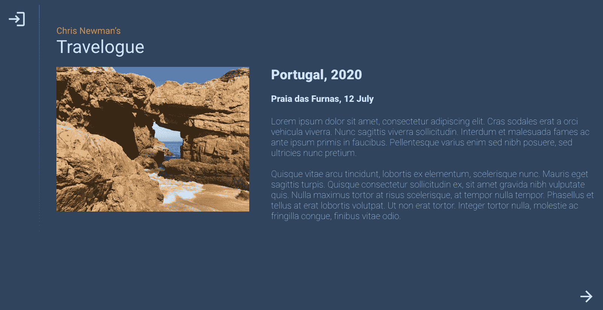
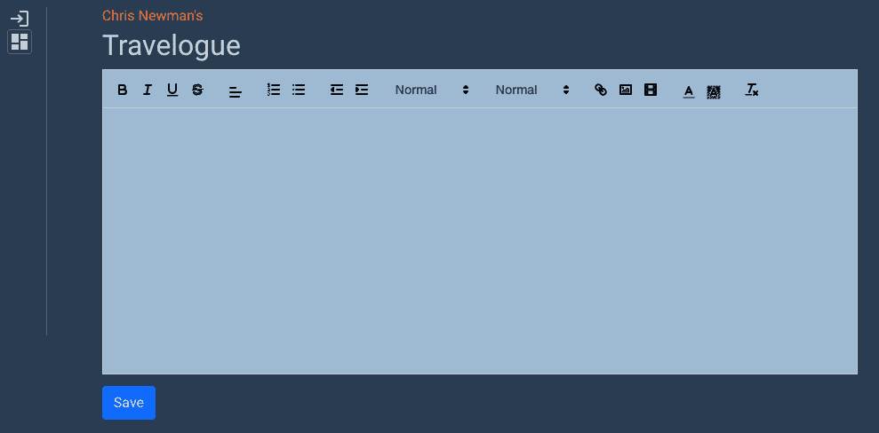

# 十九、把它放在一起

终于! 我们现在可以建立一个网站的前端和后端，并在两边使用 JavaScript ! 为了将这些整合在一起，让我们构建一个小型 web 应用，它使用 Express API 和 React 前端以及 MongoDB。

对于我们的最后一个项目，我们将使用我们的技能创建一个数据库支持的旅行日志或旅行日志，包括照片和故事。 我们的方法将采取这从最初的视觉布局，一直到前端和后端代码。 如果您的 HTML/CSS 技能不是很好，不要担心:代码在多个实例中为您提供，因此您可以在您想要的地方开始工作。

本章将涵盖以下主题:

*   该项目简要
*   脚手架,反应
*   后端——设置我们的 API
*   数据库-所有的 CRUD 操作

# 技术要求

准备使用存储库的`chapter-19`目录下的[https://github.com/PacktPublishing/Hands-on-JavaScript-for-Python-Developers/tree/master/chapter-19](https://github.com/PacktPublishing/Hands-on-JavaScript-for-Python-Developers/tree/master/chapter-19)提供的代码。 由于我们将使用命令行工具，还需要提供终端或命令行 shell。 我们需要一个现代化的浏览器和本地代码编辑器。

# 该项目简要

当开始一个真实世界的 web 项目时，从开始到结束收集**要求**是很重要的。 这可以以多种形式呈现:口头描述、功能项目列表、视觉线框图、完整的设计文件或这些内容的任何组合。 在检查需求时，为了最小化沟通错误、冗余或被放弃的工作以及流线化的工作流，尽可能明确是很重要的。 对于这个项目，我们将从视觉对比开始。

如果你曾经与平面设计师一起工作过，你可能对 comp 这个词很熟悉。一个视觉 comp，是*comprehensive layout*的缩写，是一个设计工件，是一个项目期望的最终状态的高保真视觉表现。 例如，打印项目的 comp 将是一个包含所有所需资产的数字文件，可以发送给打印机以供立即使用。 对于数字工作，您可能会收到 Adobe Photoshop、XD 或 Sketch 文件，或许多其他类型的设计文档格式。

让我们看一下图片，以便确定我们的需求:



Figure 19.1 – Main page

我们的应用将有*登录*和*退出*状态。 当登出时，用户将看到一个封面页，并可以通过导航按钮探索旅行记录的条目。 对于一个挑战，在页面加载时显示一个随机条目。

左上角的登录按钮将引导到下一个屏幕，登录屏幕:


Figure 19.2 – Log In

登录页面可以是简单的，也可以是复杂的。 也许输入任何用户名和密码组合都可以，或者为了更大的挑战，你可以合并谷歌或 Facebook 身份验证。 您甚至可以使用数据库存储凭据来编写自己的身份验证。

经过身份验证后，左侧栏中有一个新按钮:仪表板按钮。 这将我们带到应用的各个部分:


Figure 19.3 – Dashboard

当点击国家访问按钮时，我们将显示由 D3.js 图形库支持的矢量地图:


Figure 19.4 – Travel map

突出显示的国家是通过 JSON 清单控制的，该清单由条目数据库提供。

最后但同样重要的是，用户需要能够写条目和插入照片:


Figure 19.5 – New entry/edit entry screen

我们将使用一个名为 Quill 的 JavaScript 所见即所得(WYSIWYG)编辑器。

当你构建这个应用时，可以自由地对它的外观和感觉进行一些修改——自定义它，使它成为你自己的! 您可能还想添加更多的功能，例如管理上传照片的媒体库或搜索功能。

现在我们已经对视觉布局有了一个概念，让我们开始我们项目的前端。

# 脚手架,反应

我们的项目是使用 React 作为前端的首选，所以让我们概述一下我们对前端的需求:*一个单一的 React 应用，具有可重用的组件和**钩子，以及用于状态保存***的上下文。 与我们之前使用的 React 相比，钩子是一个新的概念。 在 React 16.8 中添加的钩子是一种函数，允许你在功能组件中操作状态和上下文进行状态管理。

除了我们手工制作的 React 应用，我们还将合并一些额外的预构建库，以简化我们的项目，并利用现成的工具。 js 是一个强大的图形和数据可视化库，我们将在我们的地图中使用它。 Quill 是一个富文本编辑器，允许你用文本格式编写条目，上传和放置照片。

您可以自行决定是从`npx create-react-app`开始，还是使用 GitHub 存储库`chapter-19`目录下的`Step 1`文件夹中提供的搭建代码。

我将对要使用的其他包提出一些建议; 当您完成项目时，可以随意添加或删除包。 我将使用以下方法:

*   引导(布局)
*   `d3`，`d3-queue`，`topojson-client`(我们的地图)
*   `node-sass`(对于使用 Sass 的更有效的样式表)
*   `quill`和`react-quilljs`(所见即所得编辑器)
*   `react-router-dom`(一个 React 扩展的 URL 路径变得简单)
*   `react-cookie`(一个方便使用的 cookie 包)

如果您是从头开始，现在可以使用`create-react-app`脚手架进行设置，或者开始使用`Step 1`目录。 对于本章的其余部分，将提供指导，让您一步一步地跟随。

在`Step 1`目录中，你会发现以下内容:

```js
.
├── README.md
├── package-lock.json
├── package.json
├── public
│ ├── favicon.ico
│ ├── index.html
│ ├── logo192.png
│ ├── logo512.png
│ ├── manifest.json
│ ├── robots.txt
│ └── uploads
├── src
│ ├── App.css
│ ├── App.js
│ ├── App.test.js
│ ├── components
│ │ ├── Dashboard
│ │ │ └── Dashboard.js
│ │ ├── Editor
│ │ │ └── Editor.js
│ │ ├── Header
│ │ │ └── Header.js
│ │ ├── Login
│ │ │ └── Login.js
│ │ ├── Main
│ │ │ └── Main.js
│ │ ├── Map
│ │ │ └── Map.js
│ │ └── Toolbar
│ │ ├── Toolbar.js
│ │ ├── dashboard.svg
│ │ └── login.svg
│ ├── index.css
│ ├── index.js
│ ├── logo.svg
│ ├── serviceWorker.js
│ ├── setupTests.js
│ └── styles
│ └── _App.scss
└── yarn.lock
```

这是一个标准的`create-react-app`支架，与我们以前做的有一些不同。 让我们看看一个组件:头文件。

## 功能组件

下面是我们的`Header.js`文件的代码:

```js
import React from 'react'

function Header() {
 return (
   <>
     <h2>Chris Newman's</h2>
     <h1>Travelogue</h1>
   </>
 )
}
export default Header
```

您应该注意到一些事情:首先，文件名以`js`、*而不是*`jsx`结尾。 接下来，我们的组件是一个返回 HTML 的函数，而不是一个扩展`React.Component`的类。 虽然基于类的组件和函数式组件在 React 中都是有效的，但是当使用 React 时，函数式组件被认为是更现代的，特别是使用最新的方法来利用状态和上下文。 我们现在不会讨论函数式编程和面向对象编程之间的区别，但只要指出它们之间的区别就足够了。 你可以在本章的末尾找到关于这些差异的有用资源。

## 下一个步骤

要将应用推进到下一个阶段，请考虑我们列出的功能需求。 下一步可能是实现一个登录系统。 此时，您可能不希望也不需要实际验证凭据，因此一个虚拟的登录页面就足够了。 您在`Login/Login.js`中有标记。

我们将采用的方法是使用**Hooks**和**context**。 由于这是一个相当复杂的主题，我们在这里就不详细介绍了，但是有很多文章解释了这些概念。 这里有一个:[https://www.digitalocean.com/community/tutorials/react-crud-context-hooks](https://www.digitalocean.com/community/tutorials/react-crud-context-hooks)。

我们将通过一个上下文的例子和几个 hook 的例子来让你开始:

1.  首先，我们需要创建一个`UserContext.js`文件，该文件将有助于在用户交互的整个生命周期中跟踪登录状态。 代码本身非常简单:

```js
import React from 'react'

export const loggedIn = false

const UserContext = React.createContext(loggedIn)

export default UserContext
```

2.  React 的**上下文 API**是一种向多个组件提供有状态信息的方法。 注意到我是怎么说“提供”的吗? 这正是我们接下来需要做的:提供我们的`App.js`上下文。 我们这样包装组件:

```js
import React, { useState } from 'react'
import './styles/_App.scss'
import Main from './components/Main/Main';
import UserContext, { loggedIn } from './components/UserContext'

function App() {

 const loginHook = useState(loggedIn)

 return (
   <UserContext.Provider value={loginHook}>
     <div className="App">
       <Main />
     </div>
   </UserContext.Provider>
 )
}

export default App
```

请注意我们是如何导入`UserContext`并将`App`组件包装在`UserContext.Provider`标签中，并为其提供`loginHook`有状态值，从而为其子组件提供`loginHook`有状态值。

3.  我们的`Main.js`文件也需要一些修改。 看一下这个片段:

```js
function Main() {
 const [loggedIn, setLoggedIn] = useContext(UserContext)
 const [cookies, setCookie] = useCookies(['logged-in'])
...
```

我们需要分别从 React 和`react-cookies`导入`useContext`和`useCookies`，然后我们可以使用这些**Hooks**来处理我们的登录状态。 除了内部上下文，我们还将在 cookie 中存储登录状态，以允许返回的会话保持登录状态。 我们还想从 React 中导入`useEffect`用于下一步:

```js
const setOrCheckLoggedIn = (status) => {
   if (cookies['logged-in'] === 'true' || status) {
     setLoggedIn(true)
   }

   if (status && cookies['logged-in'] !== 'true') {
     setCookie('logged-in', true)
   }
 }

 useEffect(() => {
 setOrCheckLoggedIn()
 })
```

你还记得在前面的章节中，我们是如何用`componentDidMount()`直接对 React 组件的挂载状态做出反应的吗? 使用 React 钩子，我们可以使用`useEffect`钩子来处理组件的状态。 在这里，我们将确保我们的用户上下文(`loggedIn`)和`logged-in`cookie 设置正确。

4.  我们的`setOrCheckLoggedIn`函数也需要传递给其他组件，即`Toolbar`和`Login`。 设置为`doLogin`道具。

从现在开始，当我们包含`UserContext`的上下文时，我们可以依靠`loggedIn`状态变量来确定我们的用户是否登录。 例如，我们简单的`Login`组件的逻辑可以像下面这样利用这些钩子:

```js
import React, { useContext } from 'react'
import UserContext from '../UserContext'

const Login = (props) => {

 let [loggedIn, setLoggedIn] = useContext(UserContext)

 const logMeIn = () => {
   loggedIn = !loggedIn
   props.doLogin(loggedIn)
 }

 return (
   <>
     <div className="Login">
       <h1>Log In</h1>

       <p><input type="text" name="username" id="username" /></p>
       <p><input type="password" name="password" id="password"
       /></p>
       <p><button type="submit" onClick={logMeIn}>Go</button></p>
     </div>
   </>
 )
}

export default Login
```

相当简单的! 首先，我们得到我们的上下文，点击`Go`按钮，我们翻转上下文。 您应该在登录图标的`Toolbar.js`文件中加入类似的逻辑，以处理注销。

现在，我们将需要一个后端与前端交互，并代理与 MongoDB 数据库的交易，该数据库将存储我们的故事条目，可能还有我们的用户身份验证数据。 它还需要创建一个端点来上传图像，因为单独的前端代码*不能*写入服务器的文件系统。

# 后端——设置我们的 API

让我们将我们需要的终点进行分类，使我们的旅行记录工作:

*   *Read (GET):像大多数 api 一样，我们需要一个端点来读取条目。 我们不会为此强制进行身份验证或登录。*
*   *Write (POST):*此端点将用于创建新的行程和编辑现有的行程。
*   *Upload (POST):我们将需要一个端点从我们的前端调用，以上传照片。*
*   *登录(POST)(可选):*如果你想自己进行认证，创建一个登录端点，可以使用来自数据库的证书或社交媒体登录端点。

*   *Media (GET)(可选):It will be useful to have an API that lists all the Media files upload to your server.*Media (GET)(可选):**
*   *国家(GET)(可选):*这也将是一个好主意，有一个端点专门列出你访问过的国家，以推动你的世界地图。

您可能会发现自己在工作时创建了更多端点，这很好! 从头到尾地规划 API 总是一个好主意，但如果您需要在此过程中进行更改，以便使用辅助端点或其他部分使您的生活更轻松，请放心。

现在我们准备转移到存储库中的`Step 3`目录。

## API 作为代理-步骤 3

因为我们使用的是 React 前端，所以我们将重新考虑使用 Express 作为后端，并用 React 代理我们的 API 请求，如下所示:

1.  我们需要做的第一件事是告诉我们的系统使用代理，将这一行添加到我们的`package.json`:`"proxy": "http://localhost:5000"`。
2.  添加之后，重新启动 React(你会注意到我们的前端主页发生了变化; 然后，在`api`目录下，执行`api`目录下的`npm install`，然后是`npm start`。
3.  我们应该测试我们的后端以确保我们的 API 是响应的。 将这个作为测试添加到导入后的`App.js`文件:

```js
fetch('/api')
 .then(res => res.text())
 .then(text => console.log(text))
```

这个非常基本的`fetch`调用应该调用 API 中`routes/index.js`组件的`get`方法:

```js
router.get('/', (req, res) => {
 res.sendStatus(200)
})
```

此时，我们的控制台应该显示`OK`。 如果您在这个阶段有任何问题，最好现在就调试它们。

4.  我们知道我们将建立一个数据库来处理我们的数据，但目前，我们可以构建 API 的方法，正如你在`routes/index.js`中看到的:

```js
router.get('/article', (req, res) => {
 res.send({ story: "A story from the database" })
})

router.post('/article/edit', (req, res) => {
 res.sendStatus(200)
})

router.post('/media/upload', (req, res) => {
 res.sendStatus(200)
})

router.get('/media', (req, res) => {
 res.send({ media: "A list of media" })
})

router.post('/login', (req, res) => {
 res.sendStatus(200)
})

router.get('/countries', (req, res) => {
 res.send({ countries: "A list of countries" })
})
```

现在我们已经在**步骤 2**中创建了登录系统的脚手架，我对`Step 3`目录做了一些修改。 如前所述，我们的主页略有不同，因为它是游记的索引页，用于在用户注销时显示故事。

5.  接下来检查`Story/Story.js`组件:

```js
import React from 'react'

function Story() {

 fetch('/api/article')
   .then(res => res.json())
   .then(json => console.log(json))

 return (
   <div className="Story">
     <h1>Headline</h1>
...
```

是的，另一个虚拟的 API 调用到我们的后端! 这个调用也是一个简单的 GET 请求，所以让我们做一些更复杂的事情。

6.  登录网站，你会在仪表盘上看到一些不同的东西:


Figure 19.6 – Our dashboard is taking shape...

7.  很好，现在仪表盘全了。 点击 ADD TRIP 按钮，你会看到一个编辑器，如下所示:



Figure 19.7 – Our text editor

如果在编辑器中输入富文本并保存它，您将在控制台上看到来自 API 的响应，其中包含提交的数据。 然后，我们需要使用 API 将数据保存到数据库中。 所以… 最后，但并非最不重要的是，我们需要设置数据库。

# 数据库-所有的 CRUD 操作

当然，我们需要一个数据存储来实现创建、读取、更新和删除功能，所以让我们返回 MongoDB 来存储这些文档。 你可以参考[第 18 章](18.html)，*Node.js 和 MongoDB，*，如果你需要重新设置你的记忆。

要从头开始设置数据库，首先要考虑您想要使用的数据库结构。 虽然 MongoDB 不需要模式，但规划 MongoDB 文档仍然是一个好主意，这样就不会在功能或节之间任意命名。

以下是每个系列可能的样子:

```js
settings:  {
  user
    firstname
    lastname
    username
    password
  title
  URL
  media directory
}

entry: {
  title
  location
  date
    month
    day
    year
  body
}

location: {
  city
  region
  country
  latitude
  longitude
  entries
}
```

保持数据库的简单是很好的，但是请记住，您总是可以对其进行扩展。

# 总结

现在，当然，我不能只是*交给*你一个期末项目，对吗? 在这一章中，我们完成了我们的旅程——剩下的就看你的了。 要拥有一个功能齐全的项目，还需要做一些工作。 毕竟，我们还没有完全坚持我们的视觉对比，不是吗? 为了完成项目，需要实现哪些类型的功能，以下是一些想法:

*   将信息持久化到数据库中。
*   工作的图像上传和保存。
*   编辑现有的文章。
*   创建`countries`端点来填充 D3.js 映射。
*   使真正的登录。
*   简化用户旅程。

当完成时，这个项目将成为你的作品集的一部分，以展示*你*，一个 Python 开发人员，如何掌握 JavaScript。 从数据类型、语法、循环和 Node.js 的开始，到最终创建一个功能齐全的项目，您已经走过了很长的一段路。

我怀着感激的心情感谢你陪我走过这段旅程! 坚持学习，长生不老。

# 进一步的阅读

关于函数式编程和面向对象编程的区别的有用资源可以在[https://www.geeksforgeeks.org/difference-between-functional-programming-and-object-oriented-programming/](https://www.geeksforgeeks.org/difference-between-functional-programming-and-object-oriented-programming/)中找到。