# 深度神经网络

在前一章中，我们讨论了神经网络及其基本操作。具体来说，我们讨论了全连接前馈神经网络，它只是许多可能的人工神经网络拓扑中的一种简单拓扑。在本章中，我们将重点介绍两种高级拓扑结构:**卷积神经网络** ( **CNN** )和一种形式的**递归神经网络** ( **RNN** )，称为**长短期记忆** ( **LSTM** )网络。CNNs 最常用于图像处理任务，如目标检测和图像分类。LSTM 网络常用于自然语言处理或语言建模问题。

这些奇异的人工神经网络拓扑被认为是深度神经网络。虽然这个术语没有很好的定义，但 dnn 通常被理解为在输入和输出层之间有多个隐藏层的人工神经网络。卷积网络体系结构可以变得相当深入，网络中有十层或更多层。递归架构也可以很深，但是，它们的深度很大程度上来自于信息可以通过网络向前或向后流动的事实。

在这一章中，我们将从美国有线电视新闻网和 RNN 架构的角度来看一下 TensorFlow 的功能。我们将讨论 TensorFlow 自己的这些拓扑示例，并看看它们在实践中是如何使用的。特别是，我们将讨论以下主题:

*   cnas
*   简单 RNNs
*   门控递归单位网络
*   LSTM 网络公司
*   美国有线电视新闻网-LSTM 高级应用网络

我们先来看一个经典的**机器学习** ( **ML** )问题:从图像中识别手写数字。

# 卷积神经网络

为了说明中枢神经系统的情况，让我们首先想象一下如何使用标准前馈全连接神经网络来完成图像分类任务。我们从一个 600 x 600 像素的图像开始，它有三个颜色通道。在这样的图像(600 x 600 x 3)中编码了 1，080，000 条信息，因此我们的输入层需要 1，080，000 个神经元。如果网络的下一层包含 1000 个神经元，仅前两层之间就需要保持 10 亿个权重。显然，这个问题已经变得站不住脚了。

假设这个例子中的人工神经网络可以训练，我们也会遇到具有比例和位置不变性的问题。如果您的任务是识别图像是否包含街道标志，网络可能难以理解街道标志可以位于图像中的任何位置。网络也可能存在颜色问题；如果大多数街道标志是绿色的，它可能很难识别蓝色标志。这样的网络需要许多训练示例来解决比例、颜色和位置变化的问题。

过去，在中枢神经系统流行之前，许多研究人员将这个问题视为降维问题。一种常见的策略是将所有图像转换为灰度，将数据量减少三倍。另一种策略是将图像缩小到更易于管理的尺寸，例如 100 x 100 像素，甚至更小，这取决于所需的处理类型。将我们的 600 x 600 图像转换为灰度和 100 x 100 会将输入神经元的数量减少 100 倍，从 100 万个减少到 10，000 个，并进一步将输入层和 1，000 个神经元的隐藏层之间的权重数量从 10 亿个减少到只有 1，000 万个。

即使采用了这些降维技术，我们仍然需要一个拥有数千万权重的非常大的网络。在处理之前将图像转换为灰度可以避免颜色检测的问题，但仍然不能解决比例和位置变化的问题。我们还在解决一个非常复杂的问题，因为阴影、梯度和图像的整体变化需要我们使用非常大的训练集。

另一种常用的预处理策略是对图像执行各种操作，如降噪、边缘检测和平滑。通过减少阴影和强调边缘，人工神经网络获得了更清晰的学习信号。这种方法的问题是预处理任务通常不智能；相同的边缘检测算法应用于集合中的每个图像，无论特定的边缘检测算法是否对特定的图像有效。

因此，挑战在于将图像预处理任务直接纳入人工神经网络。如果人工神经网络本身管理预处理任务，网络可以学习最好和最有效的方法来预处理图像，以优化网络的精度。回想一下[第八章](08.html)、*人工神经网络算法*我们可以在一个神经元中使用*任何*激活函数，只要我们能够区分激活函数并在反向传播算法中使用其梯度。

简而言之，美国有线电视新闻网是一个人工神经网络，有多个——也许是许多——预处理层，在最终到达执行实际分类的一两个最终完全连接的层之前，对图像执行变换。通过将预处理任务合并到网络中，反向传播算法可以将预处理任务调整为网络训练的一部分。该网络不仅将学习如何对图像进行分类，还将学习如何为您的任务对图像进行预处理。

除了标准的人工神经网络层类型之外，卷积网络还包含几种不同的层类型。两种类型的网络都包含一个输入层、一个输出层和一个或多个完全连接的层。然而，美国有线电视新闻网也包含卷积层、ReLU 层和池层。让我们依次看一下每一个。

# 卷积和卷积层

卷积是一种将两个函数组合成一个新函数的数学工具；具体来说，新函数表示曲线下的区域，该区域由一个函数的逐点乘法在另一个函数扫过时创建。如果这很难想象，不要担心；最容易想象成动画，不幸的是我们无法在书中打印出来。卷积的数学细节在本章中并不重要，但我鼓励你对这个主题做一些额外的阅读。

大多数图像滤镜(如模糊、锐化、边缘检测和浮雕)都可以通过卷积操作来完成。在图像上下文中，卷积由*卷积矩阵*表示，该矩阵通常是一个小矩阵(3×3、5×5 或类似的矩阵)。卷积矩阵比要处理的图像小得多，并且卷积矩阵扫过图像，因此应用于整个图像的卷积输出构建了具有应用效果的新图像。

考虑一下梵高的*睡莲*的下图。以下是原文:


我可以使用我的图像编辑器的*卷积矩阵*滤镜来创建锐化效果。这与图像编辑器的*锐化*滤镜效果相同，只是我手动编写卷积矩阵:

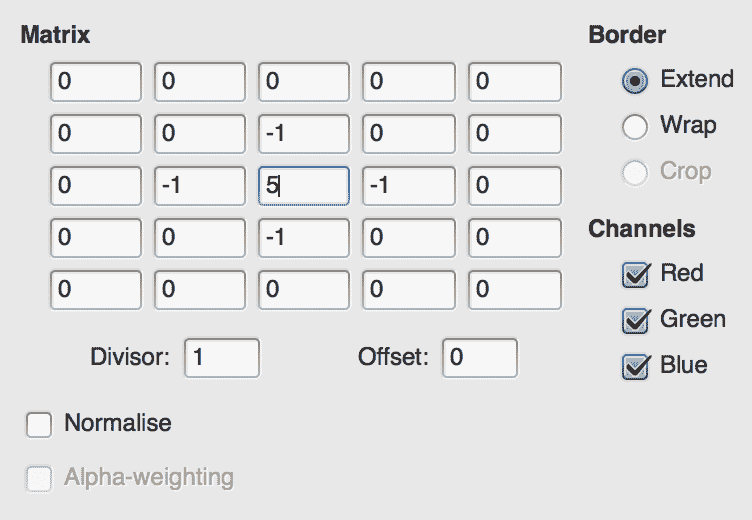

结果是原始图像的锐化版本:

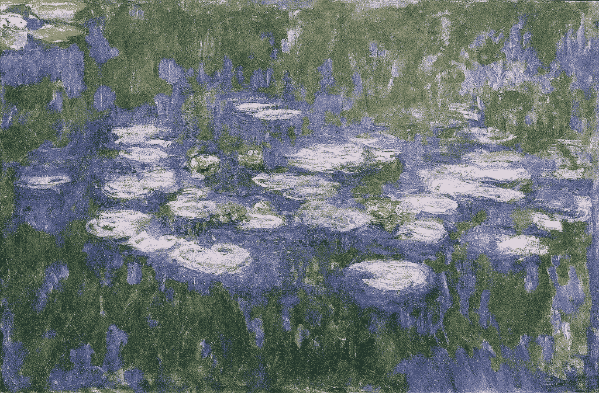

我还可以写一个卷积矩阵来模糊图像:

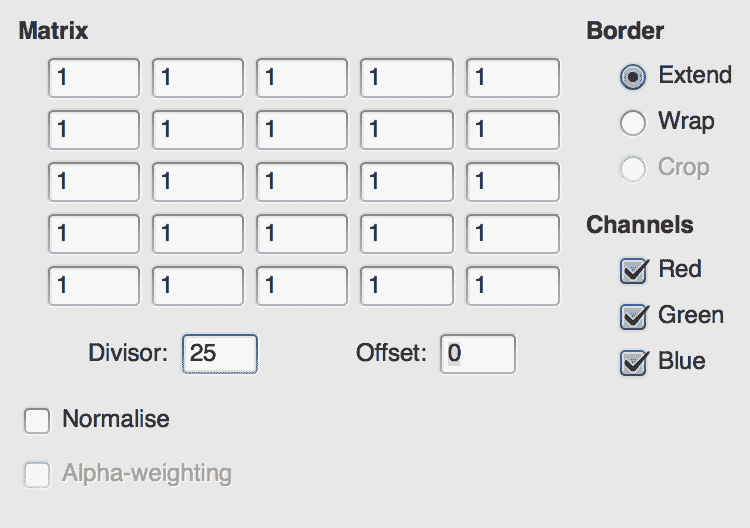

结果如下图所示。效果是微妙的，因为油气喘吁吁本身有点模糊，但效果是存在的:

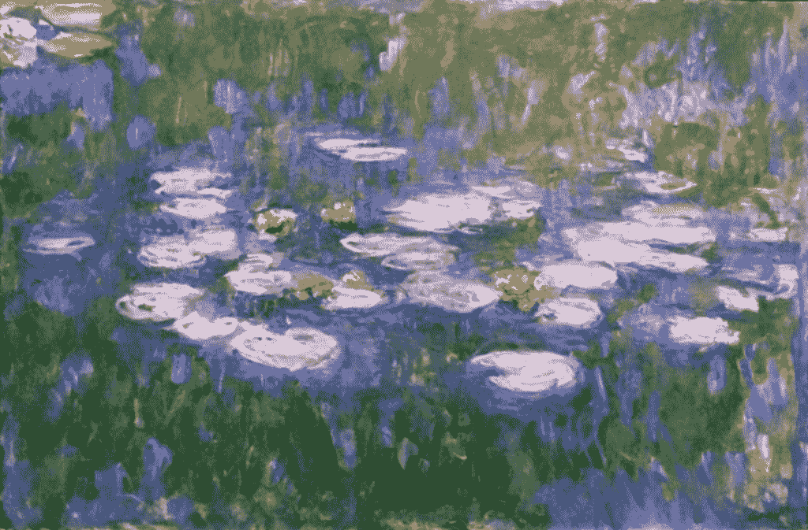

卷积也可用于浮雕或检测边缘:

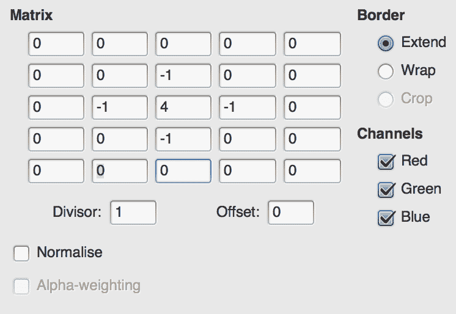

上述矩阵得出以下结果:


美国有线电视新闻网使用多个卷积层，每个卷积层都有多个卷积滤波器，来构建图像模型。卷积层和卷积滤波器本身由反向传播算法训练，并且网络将最终发现要使用的正确滤波器，以便增强网络试图识别的特征。与所有学习问题一样，CNN 开发的过滤器类型可能不一定容易被人类理解或解释，但在许多情况下，您会发现您的网络开发了许多卷积过滤器，用于执行模糊、边缘检测、颜色隔离和梯度检测。

除了从图像中提取有用的特征之外，卷积运算实际上提供了特征的空间和位置独立性。卷积层没有完全连接，因此能够检查图像的特定区域。这降低了层与层之间权重所需的维度，也有助于我们避免依赖特征的空间定位。

这些操作仍然涉及大量数据，因此卷积图层之后通常会立即进行图层合并，这实际上是对图像进行下采样。大多数情况下，您会使用诸如 *2 x 2 max pooling* 之类的东西，这意味着对于源要素中的每 2 x 2 个像素区域，pooling 图层会将 2 x 2 区域下采样为具有源 2 x 2 区域中最大像素值的单个像素。因此，一个 2 x 2 的池层将图像大小缩小了四倍；因为卷积运算(也可以降低维数)已经发生，所以这种下采样通常会减少所需的计算，而不会损失太多信息。

在某些情况下，美国有线电视新闻网将在卷积运算之后和汇集之前立即使用简单的 ReLU 激活函数；这些 ReLU 函数有助于避免卷积运算导致的图像或特征图的过饱和。

一个简单的美国有线电视新闻网的典型架构是这样的:

*   输入层，宽度 x 高度 x 色深神经元
*   卷积层，具有 M×M 大小的 N 个卷积滤波器
*   最大汇集层
*   第二卷积层
*   第二个最大池层
*   全连接输出层

用于中枢神经系统的更复杂的架构通常包括多组卷积层和汇聚层，并且在到达汇聚层之前还可能包括连续的两个卷积层。

网络中的每个连续卷积层都在比它之前的卷积层更高的级别上运行。第一个卷积层只能执行简单的卷积，例如边缘检测、平滑和模糊。然而，下一个卷积层能够将先前卷积的结果组合成更高级别的特征，例如基本形状或颜色模式。第三个卷积层可以进一步组合来自先前层的信息，以检测复杂的特征，如车轮、街道标志和手提包。最终的完全连接层的作用很像标准的前馈神经网络，并根据卷积层隔离的高级特征执行图像的实际分类。

现在让我们尝试在 MNIST 手写数字数据集上使用`TensorFlow.js`在实践中应用这种技术。

# 示例–MNIST 手写数字

与其从第一性原理中建立一个例子，不如让我们来看一个优秀的 MNIST 例子。这个例子的目标是训练一个美国有线电视新闻网对手写数字图像进行分类。更具体地说，这个例子的目标是在针对 MNIST 手写数字数据集进行的分类中实现高精度。在本节中，我们将通过对代码进行实验并观察其结果来了解代码和算法。

这个例子的当前版本可以在`TensorFlow.js`的 GitHub:[https://GitHub . com/tensorflow/tfjs-examples/tree/master/mnist](https://github.com/tensorflow/tfjs-examples/tree/master/mnist)上找到。然而，由于这个存储库可能会在本文完成后更新，我还在本书的示例存储库中添加了我作为 Git 子模块使用的版本。如果您正在使用本书的资源库，但尚未使用，请运行`git submodule init`；`git submodule update`从命令行中的存储库目录。

在终端中，导航至`Ch5-CNN`。该路径是一个符号链接，因此如果它在您的系统上不起作用，您可以交替导航到`tfjs-examples/mnist`。

接下来，从命令行发出`yarn`来构建代码，最后发出`yarn watch`，它将启动一个本地服务器，并将您的浏览器启动到`http://localhost:1234`。如果您有任何其他程序使用该端口，您必须首先终止它们。

该页面将从谷歌服务器下载 MNIST 图片开始。然后，它将训练 150 个时代的美国有线电视新闻网，定期更新两张显示损失和准确性的图表。回想一下，损失通常是一个指标，例如**均方误差** ( **均方误差**，而准确性是正确预测的百分比。最后，页面将显示几个预测示例，突出显示正确和不正确的预测。

我对这个页面的测试产生了一个准确度约为 92%的 CNN:

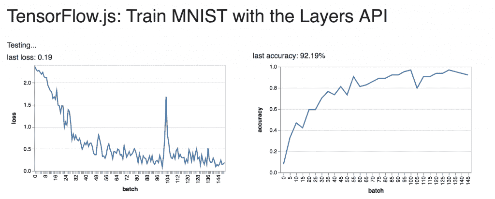

通常，不正确的预测是可以理解的。在这个例子中，数字 1 看起来确实有点像 2。人类不太可能会犯这个特别的错误，尽管我遇到过一些例子，我也可能会把预测弄错:


打开`index.js`，我们可以看到文件顶部的网络拓扑:

```js
model.add(tf.layers.conv2d({
  inputShape: [28, 28, 1],
  kernelSize: 5,
  filters: 8,
  strides: 1,
  activation: 'relu',
  kernelInitializer: 'varianceScaling'
}));
model.add(tf.layers.maxPooling2d({poolSize: [2, 2], strides: [2, 2]}));
model.add(tf.layers.conv2d({
  kernelSize: 5,
  filters: 16,
  strides: 1,
  activation: 'relu',
  kernelInitializer: 'varianceScaling'
}));
model.add(tf.layers.maxPooling2d({poolSize: [2, 2], strides: [2, 2]}));
model.add(tf.layers.flatten());
model.add(tf.layers.dense(
    {units: 10, kernelInitializer: 'varianceScaling', activation: 'softmax'}));
```

这个网络有两个卷积层，每个卷积层之后都有一个汇集层，然后是一个完全连接的层来进行预测。两个卷积层都使用`5`的`kernelSize`，这意味着卷积滤波器是 5×5 矩阵。第一个卷积层使用八个滤波器，而第二个使用 16 个。这意味着第一层将创建并使用八个不同的卷积滤波器，从而识别图像的八个独立图形特征。这些特征可能是抽象的，但在第一层中，通常会看到代表边缘检测、模糊或锐化或梯度识别的特征。

第二个卷积层使用 16 个要素，这可能比第一个层的要素级别更高。该层可以尝试识别直线、圆、曲线、俯冲等。高级功能比低级功能多，因此第一层使用的过滤器比第二层少是有意义的。

最后的致密层是 10 个神经元的完全连接层，每个神经元代表一个数字。softmax 激活功能确保输出归一化为 1。这个最终层的输入是第二个池层的展平版本。数据需要扁平化，因为卷积和汇集层通常是多维的。卷积层和汇集层使用表示高度、宽度和颜色深度的矩阵，这些矩阵本身又由于所使用的卷积滤波器而相互堆叠。例如，第一个卷积层的输出将是一个大小为[28 x 28 x 1] x 8 的体积。括号中的部分是一次卷积运算的结果(即过滤图像)，已经生成了八个。当将此数据连接到矢量图层(如标准密集或完全连接的图层)时，也必须将其展平为矢量。

进入最终密集层的数据比来自第一层的数据小得多。最大池层用于缩小图像。`[2, 2]`的`poolSize `参数意味着一个 2×2 的像素窗口将缩小到一个单一的值；由于我们使用的是最大池，这将是集合中最大的值(最轻的像素)。`strides`参数意味着汇集窗口将一次以两个像素的步长移动。这种池化将使图像的高度和宽度减少一半，这意味着图像和数据的面积减少了四倍。第一次池化操作后，图像缩小到 14 x 14，第二次后图像缩小到 7 x 7。因为第二个卷积层中有 16 个滤波器，这意味着展平层将有 *7 * 7 * 16 = 784 个*神经元。

让我们看看是否可以通过在输出之前添加另一个完全连接的层来从这个模型中挤出一些更高的精度。在最好的情况下，添加另一层将使我们更好地理解卷积生成的 16 个特征之间的相互作用。

然而，增加另一层会增加所需的训练时间，也可能不会提高结果。通过添加另一个层，完全有可能没有更多的信息可以被发现。永远记住，人工神经网络只是建立和导航一个数学景观，在数据中寻找形状。如果数据的维度不是很高，那么在我们的能力中增加另一个维度可能就没有必要了。

在代码的最后一个密集层之前添加以下行:

```js
model.add(tf.layers.dense(
    {units: 100, kernelInitializer: 'varianceScaling', activation: 'sigmoid'}));
```

在上下文中，代码现在应该如下所示，新的一行高亮显示:

```js
model.add(tf.layers.maxPooling2d({poolSize: [2, 2], strides: [2, 2]}));
model.add(tf.layers.flatten());
model.add(tf.layers.dense(
 {units: 100, kernelInitializer: 'varianceScaling', activation: 'sigmoid'}));
model.add(tf.layers.dense(
    {units: 10, kernelInitializer: 'varianceScaling', activation: 'softmax'}));

const LEARNING_RATE = 0.15;
```

既然已经从命令行发出`yarn watch`，代码应该会自动重建。刷新页面并观察结果:

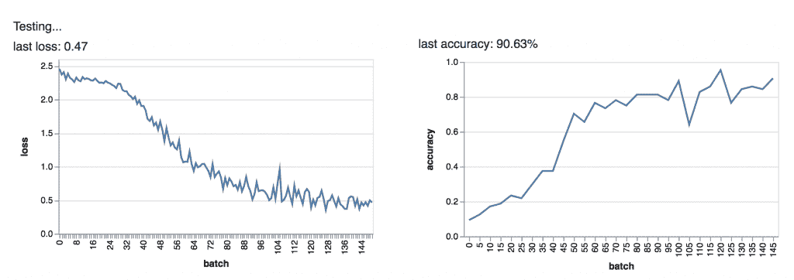

该算法的学习速度比原始版本慢，这是意料之中的，因为我们增加了一个新的层，因此增加了模型的复杂性。让我们稍微提高一下训练极限。

找到`TRAIN_BATCHES`变量，更新为`300`。该行现在应该如下所示:

```js
const TRAIN_BATCHES = 300;
```

保存文件以触发重建并重新加载页面。让我们看看我们能否超越底线:

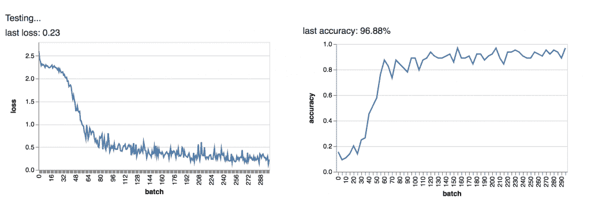

看起来我们确实超过了 92%的基线分数，但是我要提醒大家不要过于乐观。我们有可能对模型进行了过度训练和过度测试，它在现实生活中的表现可能不会那么好。此外，由于训练和验证是随机的，因此该网络的真实精度可能与基线相当。事实上，92%已经是一个很好的结果，我不会期望从任何模型中得到更好的结果。然而，这仍然是一个令人鼓舞的结果，因为新的层并没有增加太多的负担。

此时，恢复您的更改，以便使用文件的原始副本。让我们做一个不同的实验。看看我们能在不损失太多精度的情况下使网络变得多小，这将是很有趣的。

首先，让我们减少第二卷积层使用的卷积滤波器的数量。我的推理是数字使用非常简单的形状:圆形、直线和曲线。也许我们不需要捕捉 16 种不同的特征。也许八个就够了。在第二个卷积层，将`filters: 8`改为`filters: 2`。您的代码现在应该是:

```js
...
model.add(tf.layers.maxPooling2d({poolSize: [2, 2], strides: [2, 2]}));
model.add(tf.layers.conv2d({
  kernelSize: 5,
  filters: 2,
  strides: 1,
  activation: 'relu',
  kernelInitializer: 'varianceScaling'
}));
model.add(tf.layers.maxPooling2d({poolSize: [2, 2], strides: [2, 2]}));
...
```

重新运行代码，我们看到我们仍然获得了不错的准确性，尽管方差比基线高一点:

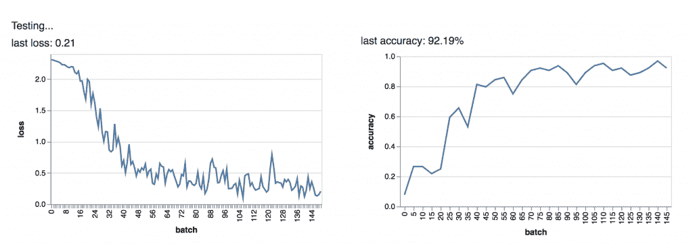

这支持了所使用的形状和特征相对较少的总体想法。然而，当我们看测试示例时，我们也发现错误比以前更少*可以理解*。也许我们并没有失去多少准确性，但我们的模型变得更加抽象:

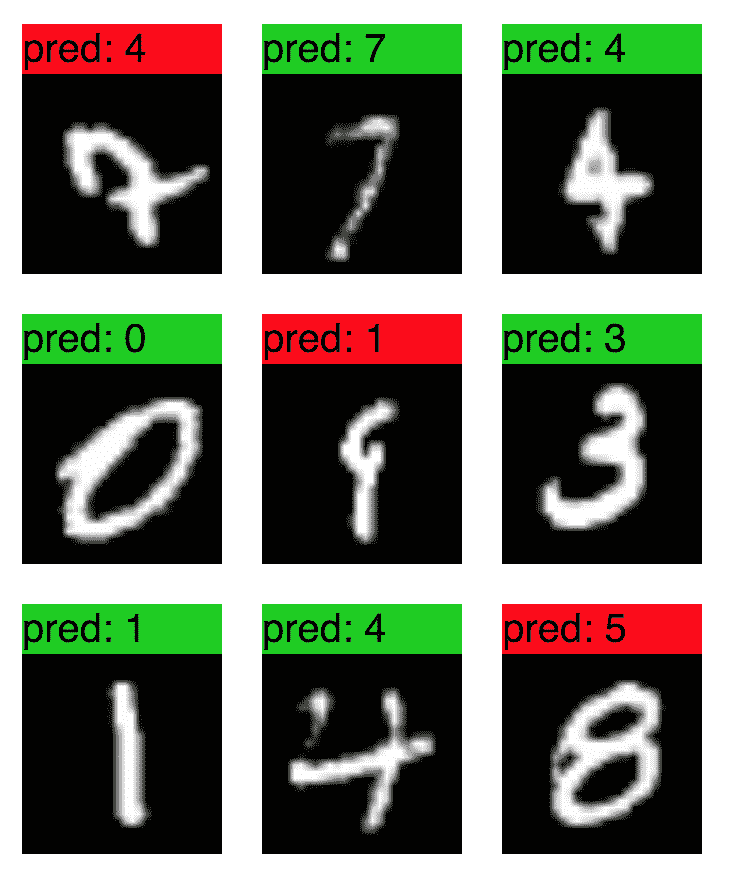

我鼓励你继续探索和试验这个例子，因为通过阅读代码你可以学到很多东西。这个例子的一个方面我想特别指出的是`data.js`文件，它管理 MNIST 数据集的处理。在您的实际应用程序中，您可能需要采用类似的方法，因为您的训练数据不会总是在本地机器上。该文件处理从远程源下载数据，将其拆分为测试和验证集，并维护由训练算法请求的批处理。如果您需要来自远程源的训练数据，这是一个很好的轻量级方法。我们将在[第 11 章](11.html)、*实时应用中使用机器学习*中深入讨论这个话题。

以下是一些你可以尝试的实验想法:

*   使网络尽可能小，同时保持 90%以上的精度。
*   使网络尽可能小，同时保持 85%以上的精度。
*   在不到 50 个时期内将模型训练到 90%以上的准确率。
*   发现达到 90%+准确率所需的最少训练示例数(减少`data.js `中`NUM_TRAIN_ELEMENTS `的值，使用更少的训练示例)

在下一节中，我们将探索用递归神经网络进行序列预测。

# 递归神经网络

神经网络需要记忆的情况很多。例如，当建模自然语言上下文很重要时，也就是说，一个单词在一个句子中较晚的意思会受到该句子中较早的单词的意思的影响。将此与朴素贝叶斯分类器使用的方法进行比较，朴素贝叶斯分类器只考虑单词包，而不考虑它们的顺序。类似地，时间序列数据可能需要一些内存来进行准确的预测，因为未来的值可能与当前或过去的值相关。

RNN 是一个神经网络拓扑家族，其中信息不一定只在一个方向上流动。与前馈神经网络相反，神经元网络允许神经元的输出被反馈到它们的输入中，从而形成反馈回路。递归网络几乎总是依赖于时间的。然而，时间的概念是灵活的；句子中的有序单词可以被认为是时间相关的，因为一个单词必须跟在另一个单词后面。RNNs 的时间相关性不需要与时钟上的实际时间流逝相关。

在最简单的情况下，RNN 所要求的就是神经元的输出值被连接起来——通常带有一个权重或衰减因子——不仅连接到下一层的神经元，还连接回它自己的输入。如果你熟悉数字信号处理中的**有限脉冲响应** ( **FIR** )滤波器，这种类型的神经元可以被认为是 FIR 滤波器的变体。这种类型的反馈产生了一种记忆，因为先前的激活值被部分保留并用作神经元下一个周期的输入。你可以想象这是由神经元产生的回声，变得越来越微弱，直到不再能听到回声。因此，以这种方式设计的网络将具有有限的记忆，因为最终回声将消失得无影无踪。

RNN 的另一种类型是完全递归神经网络，其中每个神经元都与其他神经元相连，无论是向前还是向后。在这种情况下，不仅仅是单个神经元能够听到自己的回声；每个神经元都能听到网络中其他神经元的回声。

虽然这些类型的网络功能强大，但在许多情况下，网络需要的内存比回声持续的时间更长。一种非常强大的奇异拓扑，叫做 **LSTM** ，是为了解决长期记忆问题而发明的。LSTM 拓扑结构使用一种奇异形式的神经元，称为 LSTM 单元，它能够存储所有以前的输入和激活值，并在计算未来的激活值时调用它们。当 LSTM 网络首次引入时，它打破了令人印象深刻的记录，尤其是在语音识别、语言建模和视频处理方面。

在下一节中，我们将简要讨论 TensorFlow.js 提供的三种不同类型的 RNN 拓扑:SimpleRNN(或全递归 RNN 网络)、**门控递归单元** ( **GRU** )网络和 LSTM 网络。

# 简单网络

`TensorFlow.js`开箱即用提供的第一个 RNN 层是 SimpleRNN 层类型，它是由 SimpleRNNCell 神经元组成的层。这是一种奇异的神经元，它能将输出反馈给输入。这种神经元的输入是时间相关值的向量；每个输入值的激活输出被反馈到下一个值的输入中，以此类推。可以指定介于 0 和 1 之间的*压差*系数；该值代表每个回声的强度。以这种方式设计的神经元在许多方面类似于 FIR 滤波器。

事实上，这种类型的 RNN 体系结构是由于早期在数字信号处理中对 FIR 滤波器的研究而成为可能。这种结构的优点是数学很好理解。有可能*展开*一个 RNN，这意味着有可能创建一个多层前馈神经网络，产生与具有较少层的 RNN 相同的结果。这是因为神经元反馈的回声是有限的。如果已知一个神经元回声 20 次，那么该神经元可以被建模为 21 个前馈神经元(包括源神经元)。训练这些网络的最初努力受到 FIR 滤波器工作的启发，因为分析基本相同。

考虑下面这张由弗朗索瓦·德洛奇(自己的作品，CC BY-SA 4.0)创建的图片，它展示了一个循环神经元的展开:


标记为 **V** 的回路代表神经元的反馈操作。当未来的输入值( **X** )被给予神经元时，来自先前激活的输出到达输入并成为输入因子。如图所示，这可以建模为简单神经元的线性序列。

从张量流的角度来看，递归层的操作被张量流层应用编程接口抽象掉了。让我们看看 TensorFlow.js 的另一个例子，它说明了各种 RNN 架构的可互换性。

从这本书的 GitHub 存储库中，导航到`Ch9-RNN`目录，这又是一个到`tfjs-examples/addition-rnn`目录的符号链接。(如果您仍然有前面的 RNN 示例运行，您将需要通过在运行纱线观察命令的终端中按下 *Ctrl* + *C* 来停止它。)首先，发出`yarn`命令构建代码，然后运行`yarn watch`再次启动本地服务器并导航至`http://localhost:1234`。

这个特殊的例子是通过例子来教 RNN 整数加法。训练数据将是一个问题列表，如`24 + 22`或`14 + 54`，以字符串形式表示，网络将需要能够解码字符串，用数字表示，学习答案，并能够将知识扩展到新的例子。

当页面加载时，您将看到以下表单。保留默认值，点击**列车模型**按钮:

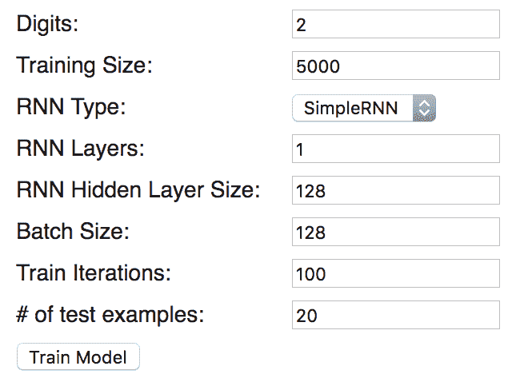

您将看到类似于下面的损失和准确性图表，显示经过 100 个时期的训练，该模型的准确性为 93.8%:


The loss and similarity graph

您还将看到模型验证的随机测试输入的测试结果:


让我们仔细看看这是如何在引擎盖下工作的。打开`index.js `文件，找到`createAndCompileModel `功能。我将假设您为本例选择了 SimpleRNN 网络类型，并省略了处理 GRU 和 LSTM 拓扑的交换机/案例语句:

```js
function createAndCompileModel(
    layers, hiddenSize, rnnType, digits, vocabularySize) {
    const maxLen = digits + 1 + digits;

    const model = tf.sequential();
    model.add(tf.layers.simpleRNN({
        units: hiddenSize,
        recurrentInitializer: 'glorotNormal',
        inputShape: [maxLen, vocabularySize]
    }));
    model.add(tf.layers.repeatVector({n: digits + 1}));
    model.add(tf.layers.simpleRNN({
        units: hiddenSize,
        recurrentInitializer: 'glorotNormal',
        returnSequences: true
    }));
    model.add(tf.layers.timeDistributed(
        {layer: tf.layers.dense({units: vocabularySize})}));
    model.add(tf.layers.activation({activation: 'softmax'}));
    model.compile({
        loss: 'categoricalCrossentropy',
        optimizer: 'adam',
        metrics: ['accuracy']
    });
    return model;
}
```

这段代码构建了一个具有两个循环层的模型，一个时间分布的、完全连接的层和一个输出层。`vocabularySize `参数表示所涉及的唯一字符的总数，即数字 0-9、加号和空格字符。`maxLen`参数表示输入字符串的最大长度；对于两位数加法问题，`maxLen `将是五个字符，因为加号必须包含在内。

本例中特别值得注意的是`timeDistributed`图层类型。这是 TensorFlow 应用编程接口中的一个层包装器，意在层中创建一个神经元卷，其中每个切片代表一个时间切片。这在精神上类似于前一个示例中中枢神经系统使用的体积，其中体积的深度表示单个卷积运算。然而，在这个例子中，体积的深度表示时间片。

`timeDistributed `包装器允许每个时间片由单独的密集或完全连接的层来处理，而不是试图仅用单个神经元向量来解释与时间相关的数据，在这种情况下，时间数据可能会丢失。需要`timeDistributed `包装器，因为之前的 *simpleRNN* 图层使用了`returnSequences: true`参数，这使得图层不仅输出当前时间步长，还输出图层历史中遇到的所有时间步长。

接下来，让我们看看 GRU 拓扑。

# 门控循环单位

GRU 拓扑结构由特殊的外来神经元组成，这些神经元使用几种内部机制来控制神经元的记忆和反馈。GRU 是最近的发明，2014 年才作为 LSTM 神经元的简化版本被开发出来。虽然 GRU 比 LSTM 新，但我首先介绍它，因为它稍微简单一些。

在 GRU 和 LSTM 神经元中，输入信号被发送到多个激活功能。每个内部激活函数可以被认为是一个标准的人工神经网络神经元；这些内部神经元被组合在一起，以赋予整个神经元记忆能力。从外部来看，GRU 和 LSTM 神经元看起来都像能够接收时间相关输入的神经元。在内部，这些奇特的神经元使用更简单的神经元来控制来自先前激活的反馈有多少被衰减或放大，以及有多少当前信号被存储到内存中。

与简单的 RNN 神经元相比，GRU 和 LSTM 神经元有两大优势。首先，这些神经元的记忆不会像简单的 RNN 神经元的回声那样随时间衰减。第二，记忆是可配置的和自我学习的，从这个意义上说，神经元可以通过训练来学习特定的记忆对当前的激活有多重要。

考虑以下插图，同样由弗朗索瓦·德罗什(自己的作品，CC BY-SA 4.0)创作:

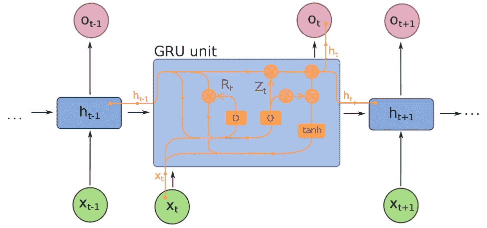

流程图刚开始可能有点难解读。 **Z <sub>t</sub>** 信号是一个控制有多少激活被存储到内存中并传递给未来值的向量，而 **R <sub>t</sub>** 信号控制有多少先前值应该从内存中被遗忘。这些信号中的每一个都被附加到标准激活函数上，而标准激活函数又有自己的权重。从某种意义上说，GRU 本身就是一个微小的神经网络。

在这一点上，可能很容易问为什么神经元的记忆不能简单地被编程，例如，神经元可以对其进行查找的键/值存储。使用这些架构的原因是因为反向传播算法需要数学上的可微性。即使是像 RNNs 这样的奇异拓扑，也仍然使用梯度下降等数学方法进行训练，因此整个系统必须在数学上具有代表性。为此，研究人员需要使用前面的技术来创建一个网络，其每个组成部分都是数学上可分析和可微分的。

在`http://localhost:1234`处的测试页面上，将 *RNN 类型*参数更改为 GRU，同时保持所有其他参数不变，再次点击**列车模型**。图表将会更新，您应该会看到如下内容:


在这种情况下，训练过程花费了更长的时间，但是与 SimpleRNN 类型相比，准确率从 92%提高到了 95%。训练时间的增加并不令人惊讶，因为 GRU 架构基本上将网络使用的激活功能数量增加了两倍。

虽然影响网络准确性的因素很多，但有两个明显的因素很突出。首先，GRU 拓扑结构具有长期记忆，不像简单神经网络那样，当回声衰减时，最终会忘记以前的值。其次，GRU 能够更精确地控制有多少激活信号被输入到未来的激活中，以及有多少信息被保留。网络的这些参数是通过反向传播算法训练的，因此神经元本身的遗忘是通过训练来优化的。

接下来，让我们来看看启发了 GRU 并开辟了全新研究领域的拓扑学:LSTM。

# 长短期记忆

LSTM 于 1997 年引入，由于其在解决历史难题方面令人印象深刻的准确性，在人工神经网络学术界引起了轰动。特别是，LSTM 擅长许多自然语言处理任务、手写识别和语音识别。在许多情况下，LSTM 网络公司都以巨大优势打破了之前的准确性记录。许多处于语音识别和语言建模前沿的系统使用 LSTM 网络。苹果的 Siri 和谷歌的 Assistant 等系统很可能在语音识别和语言解析模型中都使用了 LSTM 网络。

LSTM 网络之所以得名，是因为它可以长时间保留短期记忆(例如，对句子中较早使用的单词的记忆)。当训练时，这避免了一个被称为**消失梯度**的问题，这是简单的 RNNs 随着先前激活的回声逐渐消失而遭受的问题。

像 GRU 一样，LSTM 神经元是一种具有复杂内部运作的奇特神经元细胞。具体来说，LSTM 神经元内部使用三个*门*:控制允许多少值进入神经元的*输入门*，管理神经元内存的*遗忘门*，以及控制神经元输出允许多少信号的*输出门*。门的组合，加上神经元都相互连接的事实，使 LSTM 对神经元记住哪些信号以及如何使用这些信号进行了非常精细的控制。就像 GRU 的门一样，LSTM 的门也可以被认为是独立的标准神经元，每个神经元都有自己的权重。

考虑以下由弗朗索瓦·德罗什(自己的作品，CC BY-SA 4.0)绘制的图形:

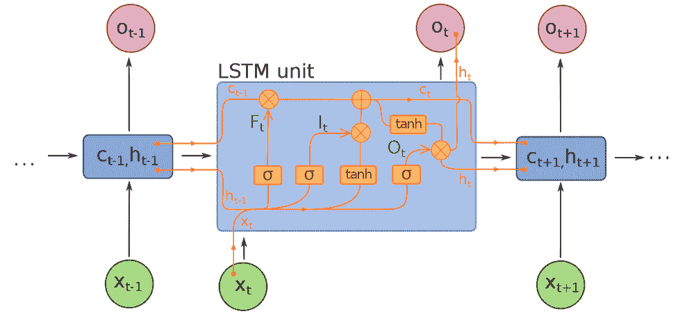

**I <sub>t</sub>** 信号控制允许进入细胞的输入信号的比例。 **O <sub>t</sub>** 信号控制有多少输出被允许出单元，而 **F <sub>t</sub>** 信号控制有多少先前的值被单元保留。请记住，这些都是矢量，因此可以按元素控制输入、输出和内存。

LSTM 擅长需要记忆和先验值知识的任务，尽管复杂的细胞内部工作(涉及五种不同的激活功能)导致更长的训练时间。返回浏览器测试页面，将 **RNN 类型**切换至 LSTM，点击**列车型号:**


LSTM 实现了接近 98%的精度，超过了 SimpleRNN 和 GRU RNN 拓扑。当然，这个网络比其他任何一个都需要更长的时间来训练，因为有更多的神经元(LSTM 细胞内部)需要训练。

LSTM 网络有许多最先进的用途。它们在音频分析中非常受欢迎，例如语音识别，因为音频严重依赖于时间。单个音频样本本身是没有意义的；只有当成千上万的音频样本被放在一起时，音频剪辑才开始有意义。被训练识别语音的 LSTM 首先被训练将短音频片段(大约 0.1-0.25 秒)解码成*音素*，或者语音的文本表示。然后训练另一个 LSTM 层将音素序列连接在一起，以确定说出的最可能的短语。第一 LSTM 层依赖于时间相关性来解释原始音频信号。第二个 LSTM 层依赖于时间相关性来给自然语言带来语境——例如，使用语境和语法来判断我们所处的地方或*是不是说了单词*。**

LSTM 的另一个最先进的用例是美国有线电视新闻网-LSTM。这种网络拓扑结合了美国有线电视新闻网和 LSTM；典型的应用是视频剪辑中的动作检测。该模型的美国有线电视新闻网部分分析单个视频帧(好像它们是独立的图像)，以识别一个对象及其位置或状态。模型的 LSTM 部分将各个帧集合在一起，并在它们周围生成一个依赖于时间的上下文。例如，如果没有 LSTM 部分，模型将无法判断棒球是静止的还是运动的。CNN 检测到的对象先前状态的记忆为确定视频中发生的动作提供了背景。该模型的美国有线电视新闻网部分识别出一个棒球，然后 LSTM 部分理解为球在移动，很可能被投掷或击中。

美国有线电视新闻网-LSTM 的另一个变种用于图像的自动描述。人们可以在美国有线电视新闻网 LSTM 频道上看到一个女人站在湖边码头上的画面。模型的美国有线电视新闻网部分将女子、码头和湖泊分别识别为图像中的物体。然后，LSTM 部分可以基于美国有线电视新闻网收集的信息生成图像的自然语言描述；语法上编译描述的是 LSTM 部分，湖边码头上的女人。请记住，自然语言描述是时间相关的，因为单词的顺序很重要。

关于 LSTM 网络的最后一点是关于 LSTM 细胞中使用的*门*。虽然输入、遗忘和输出门通常是标准的激活神经元，但也可以将整个神经网络用作门本身。通过这种方式，LSTM 人可以使用*其他*模型作为他们知识和记忆的一部分。这种方法的典型用例是自动语言翻译。例如，单个的 LSTM 可以用来模拟英语和法语，而整个 LSTM 可以管理这两种语言之间的翻译。

我个人认为，LSTM 网络或其变体，如 GRU 拓扑，将是通往 AGI 道路上的关键角色。当试图模仿一般人类智能时，拥有强大的内存是基本要求，LSTM 非常适合这个用例。这些网络拓扑处于人工神经网络研究的前沿，因此预计在未来几年内会有重大进展。

# 摘要

在这一章中，我们讨论了两种先进的神经网络拓扑:美国有线电视新闻网和 RNN。我们在图像识别的背景下讨论了 CNN，特别是手写数字识别的问题。在探索 CNN 的同时，我们还讨论了图像滤波背景下的卷积运算本身。

我们还讨论了如何通过 RNN 架构使神经网络保留记忆。我们了解到 RNNs 有许多应用，从时间序列分析到自然语言建模。我们讨论了几种 RNN 体系结构类型，如简单全递归网络和 GRU 网络。最后，我们讨论了最先进的 LSTM 拓扑，以及如何将其用于语言建模和其他高级问题，如图像字幕或视频注释。

在下一章中，我们将研究一些实用的自然语言处理方法，特别是最常用于 ML 算法的技术。