# 第九章。把这一切放在一起

前面的章节已经为我们提供了基础和元素来设计和组合我们的整个家庭系统，我们将在这一章进行研究。我希望我已经以一种相当有条理和合乎逻辑的方式引导你走过了这段旅程，这样你就准备好去做了。

作为构建整个系统的指南，在这一章中，我们将指导您如何集成，并为您提供一些将一切整合在一起的想法，同时也为您提供最终的细节。然后你可以用我们将在最后一章中提到的想法来制作你自己的项目。

在本章中，我们将涵盖以下主题:

*   集成系统开发项目
*   使用矩阵键盘控制访问
*   将系统控制与继电器和设备集成
*   如何设置电源

# 整合系统开发项目

在前面的章节中，我们已经看到了家庭自动化和家用的不同项目，即控制和监控家用电器。在这一章中，我们将给出一些想法来开发一些项目，这些项目可以在不同的领域使用电子设备、控制和监控来完成。

## 进入光传感器的细节

顾名思义，**光敏电阻(LDR)** 由一块暴露的半导体材料制成，例如硫化镉，通过在材料中产生空穴-电子对，它的电阻从黑暗中的几千欧姆变化到当光照射到它上面时只有几百欧姆。净效应是电导率的提高，随着光照的增加，电阻降低。此外，光敏电池具有长响应时间，需要许多秒来响应光强的变化。

在本节中，我们将了解如何使用光传感器来控制不同的设备:

*   需要时打开/关闭灯
*   当传感器检测到室内是否有光线时，调暗灯


你可以用信号传感器调暗灯；根据光传感器的测量结果，你可以调节它的强度。


## 运动传感器

运动传感器检测人体热量(红外线能量)。被动红外传感器是家庭安全系统中应用最广泛的运动。当你的系统启动时，你的运动传感器被激活。一旦传感器变暖，它就可以检测周围区域的热量和运动，从而形成一个保护网格。

如果一个移动物体阻挡了太多的网格区域，并且红外能量水平变化很快，传感器就会跳闸。使用这种传感器，我们可以控制灯光何时打开或关闭:

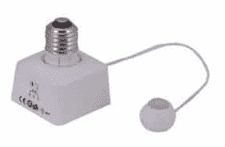

根据传感器测量的距离，它可以检测到物体，因此您可以控制灯:

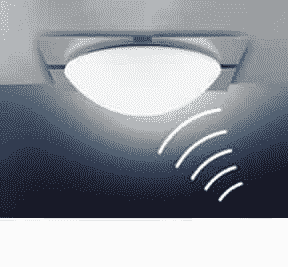

## 自动灯光控制器

当你不在家的时候，或者当你告诉系统你不在的时候，传感器就会工作。一些安全系统可以被编程为当检测到运动时通过安全摄像机记录事件。运动检测的主要目的是检测入侵者并向您的控制面板发送警报，从而向您的监控中心发出警报:

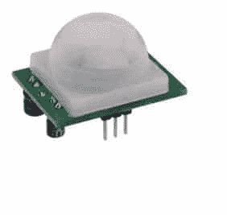

以下电路图显示了自动灯光控制的连接，其中我们使用了之前使用的所有元件，如 LDR 传感器、PIR 传感器和继电器模块:

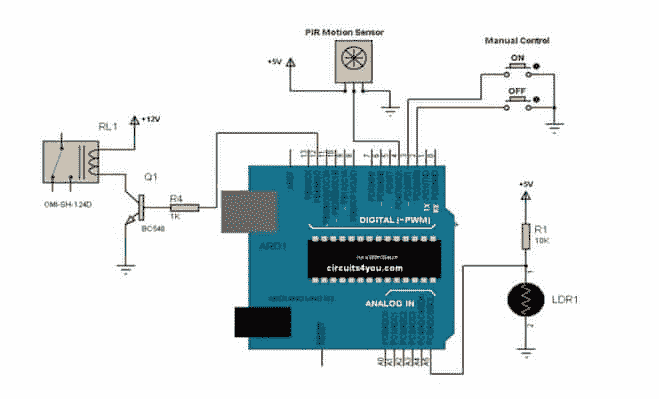

# 太阳能监控电路

这里我们有另一个真实的项目，显示了一个控制面板，它将使用 Arduino 板监控太阳能电池板的能量。下图显示了传感器和太阳能电池板与 Arduino 板的连接:

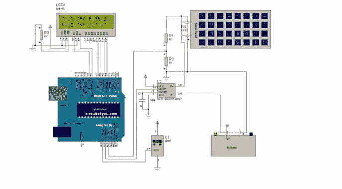

# 带土壤传感器的自动灌溉系统

下图中，我们有另一个项目；我们正在整合以前使用的工具。在这种情况下，我们将使用土壤传感器控制有无浇水:

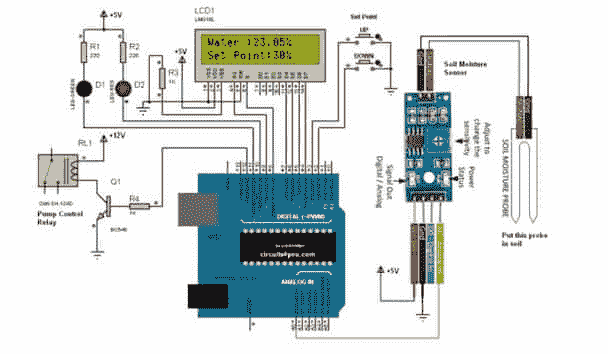

到目前为止，您已经看到了非常有趣和有价值的项目，这些项目可以应用于不同领域的真实情况，例如家庭、家庭自动化，甚至是花园。在接下来的章节中，我们将会看到更多的项目。开始吧！

# Arduino 水位控制器

在这个项目中，我们将使用您的 Arduino 板制作一个自动水位传感器来控制水位，如下图所示:


# 基于蓝牙的家庭自动化

在本节中，我们将研究一个可以用于家庭自动化的项目，使用蓝牙模块进行通信，使用中继模块并集成硬件作为软件工具来控制家中的设备。

下图显示了如何将继电器模块和 HC05 蓝牙模块连接到 Arduino 板上:

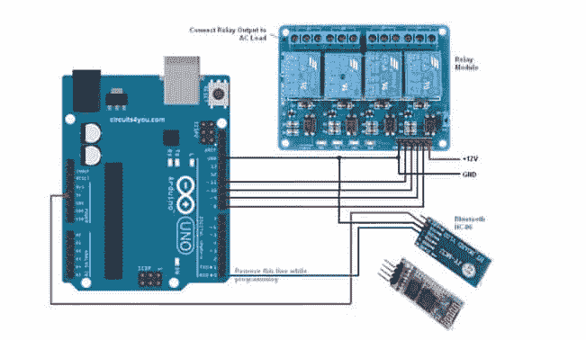

# 用矩阵键盘控制访问

在本节中，我们将了解如何使用矩阵键盘通过代码控制访问。在下图中，我们可以看到将要使用的键盘:

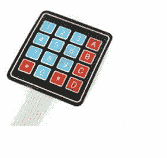

## 键盘

在下图中，我们看到了与 Arduino 板的硬件连接。它们连接到数字引脚:

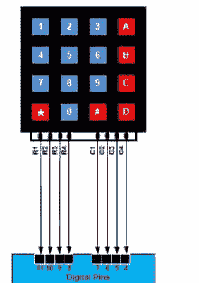

## 连接液晶屏显示代码

在下图中，我们显示了液晶屏与 Arduino 板的硬件连接:

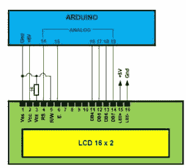

我们已经看到了一些有趣的项目，您可以通过添加新的传感器来控制其他设备来开发这些项目。在下一节中，我们将看一个非常有趣的项目。为下一步做好准备，这是一个伟大的目标。

# 用键盘控制门锁

在下图中，我们看到一个带锁的键盘。该部分可以与最后一个项目合并。该设备可以通过您的覆盆子 Pi Zero 或 Arduino 板进行控制:

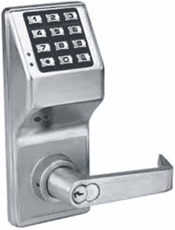

## 使用键盘进行访问的代码

您现在可以将代码复制到一个名为 Project _ keyboard _ Access _ control . ino 的文件中，或者使用 Arduino IDE 从这个项目的文件夹中获取完整的代码:

```js
void captura() 
{ 
  tecla = customKeypad.getKey(); 

  if (tecla) 
  { 
    digito = digito + 1; 
    if(tecla==35){tecla=0;digito=0;valorf=0;lcd.setCursor(0,0);lcd.print(valorf);
      lcd.print("          ");}          
    if(tecla==48){tecla=0;} 
    if(tecla==42){tecla=0;digito=0;valor = valorf;} 

   if(digito==1){valorf1 = tecla; valorf=valorf1;lcd.setCursor(0,0);
       lcd.print(valorf);lcd.print("          ");}  
     if(digito==2){valorf2 = tecla+(valorf1*10);valorf=valorf2;lcd.setCursor(0,0);
         lcd.print(valorf);lcd.print("          ");} 
    if(digito==3){valorf3 = tecla+(valorf2*10);valorf=valorf3;lcd.setCursor(0,0);
         lcd.print(valorf);lcd.print("          ");} 
    if(digito==4){valorf4 = tecla+(valorf3*10);valorf=valorf4;lcd.setCursor(0,0);
         lcd.print(valorf);lcd.print("          ");} 
    if(digito==5){valorf5 = tecla+(valorf4*10);valorf=valorf5;lcd.setCursor(0,0);
        lcd.print(valorf);lcd.print("          ");digito=0;} 
  } 

```

此函数检查键入的代码是否正确:

```js
void loop() 
{ 
  captura(); 
  if (valor == 92828) 
  { 
    digitalWrite(lock,HIGH); 
  } 
  if (valor == 98372) 
  { 
    digitalWrite(lock,LOW); 
  } 
} 

```

# 将系统控制与继电器和设备集成

在下图中，我们整合了本书的重要部分。我们将展示使用继电器的房屋中的连接，以及如何使用灯施加和控制实际负载:

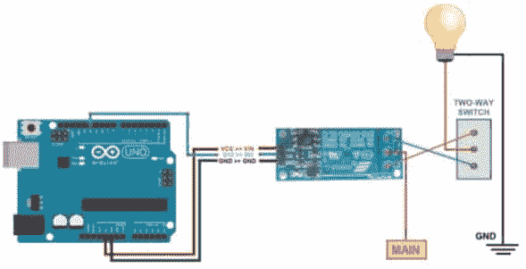

## 控制多个电器

在现实生活中，我们将看到设备连接并控制现实世界。在下图中，我们可以看到继电器模块，它可以通过电子器件控制负载:

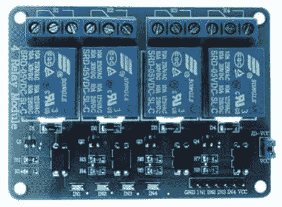

下图显示了最终电路。我们看到了与 Arduino 板的真正联系，以及它们如何控制现实世界。

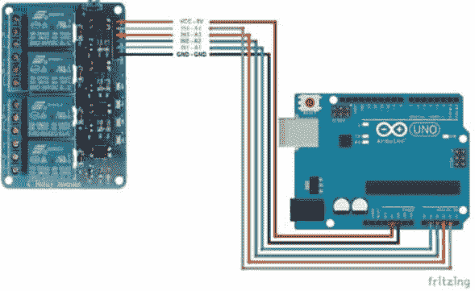

## 完整的系统

在下图中，我们看到了控制家庭自动化系统中真实设备的最终电路。这可以在家庭的所有区域使用，在每个房间我们可以有一个继电器模块，连接到每个模块与控制系统通信:

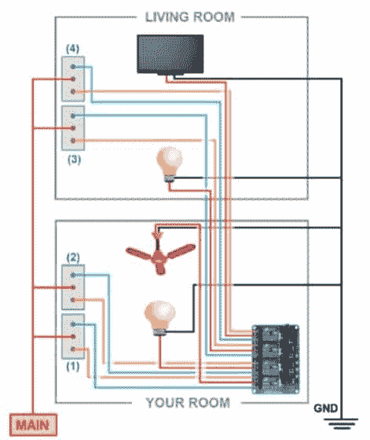

# 如何设置电源

对于我们的系统来说，设置将在系统中使用的电源非常重要。首先我们需要确保 Arduino 的电压约为 *5V* 。在下图中，我们展示了如何将电压配置为约 5 伏:

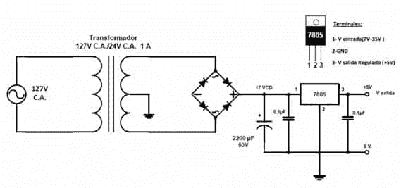

## 交流负载的电源

如果我们需要将交流负载连接到 Arduino 或树莓 Pi Zero 并制作工业控制系统，我们需要使用 24 V 的 DC 电压，如下图所示:


## 将 24 DC 伏特的继电器连接到 Arduino 板上

在下图中，我们有使用 24 伏 DC 继电器控制交流负载的电路:

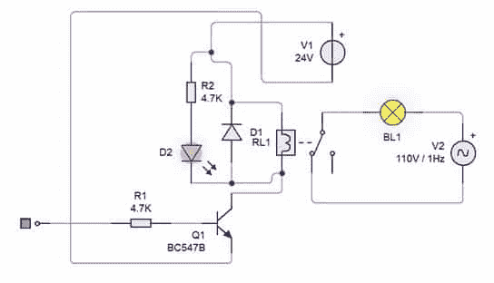

我们有最后一个电路，它代表控制交流负载的接口，连接到树莓 Pi Zero 或 Arduino 板的输出数字引脚:这并不常见，但有必要学习如何将一个可以用 24 伏 DC 电压供电的继电器连接到 Arduino 板:

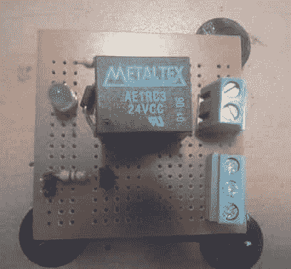

最后，我们在一块板上有了最后的电路。我们使用了一个有线圈的继电器，它必须用 24 伏电压供电。Arduino 或树莓 Pi 的数字输出可以连接到继电器模块。

# 总结

这是本书的最后一章，*用 JavaScript 进行物联网编程*。在这一章中，您学习了当您想要在我们向您展示的项目中应用硬件和软件工具时，如何集成您需要考虑的所有元素。这将帮助你继续开发你自己的项目，遵循本书中分享的基础知识。