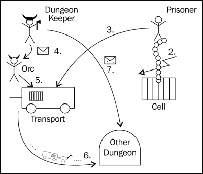
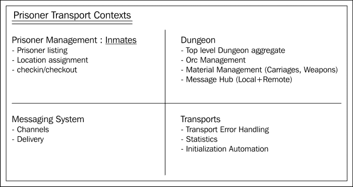
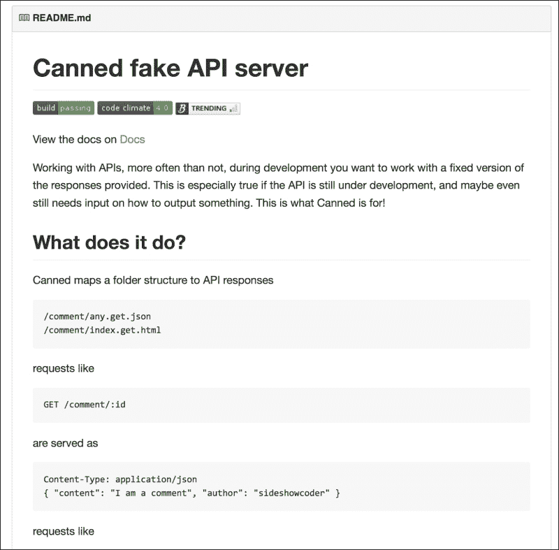

# 六、上下文地图——大概念

地下城管理员应用目前只包含管理囚犯运输的功能，但随着应用的发展，组织代码的需求也在增加。 能够同时在一个软件上工作的开发人员数量是有限的。 亚马逊创始人兼首席执行官杰夫·贝佐斯曾说过，团队的规模不能超过两个披萨的规模([http://www.wsj.com/news/articles/SB10001424052970203914304576627102996831200](http://www.wsj.com/news/articles/SB10001424052970203914304576627102996831200))。 这个想法是，任何比这个规模更大的团队都将在沟通方面遇到麻烦，因为团队内的连接数量增长得非常快。 随着我们加入更多的人，保持每个人最新信息所需的交流量也会增加，团队迟早会因为持续的会议需求而放慢速度。

这一事实在一定程度上造成了一种两难的局面，因为正如我们前面所描述的，完美的应用应该是每个人都知道开发是如何发生的，以及如何围绕更改做出决策的。 这让我们用很少的选择:我们不可以决定发展团队,构建应用,但选择一个开发周期慢,可以单独由这支球队(连同一个较小的特性在整个应用),或者我们可以尝试让多个团队工作在相同的应用。 就商业而言，这两种策略都是成功的。 保持小而自然的增长，虽然很可能不会带来像曲棍球棍一样的增长，但也能像 Basecamp Inc.和其他独立软件开发商所证明的那样，成为一家运营良好、成功的公司。 另一方面，这并不适用于那些本质上很复杂、目标范围更广的应用，所以像亚马逊和 Netflix 这样的公司，开始围绕着创建由较小部分组成的更大应用的想法来壮大他们的团队。

假设我们选择领域驱动设计的思想，我们的应用更有可能是固有的复杂领域的一部分，所以接下来的章节将介绍一些处理这种场景的常用方法。 在设计这样的应用时，有一点是不可忽视的，那就是我们应该总是尽可能地降低复杂性。 你将学习:

*   如何在技术上组织一个不断增长的应用
*   如何测试系统中应用的集成
*   如何组织应用中的扩展上下文

# 不要害怕巨石

最近，有一种强烈的趋势，将应用拆分，并将其设计为一组通过消息进行通信的服务。 对于大型应用来说，这是一个成熟的概念; 问题是找到拆分应用的正确时间，以及决定拆分应用是否是正确的做法。 当我们将一个应用分解为多个服务时，我们就增加了复杂性，因为我们现在必须处理跨多个服务的通信问题。 我们必须考虑服务的弹性，以及每个服务所具有的依赖性，以提供其特性。

另一方面，当我们在后期分解应用时，从应用中提取逻辑时就会出现问题。 没有理由说单一应用不能很好地分解，并保持很长时间的易于维护。 拆分应用总是会导致问题，长时间使用一个分解良好的应用是可行的。 问题是，大量开发人员参与的大型代码库更有可能恶化。

我们怎样才能避免这样的问题? 最好的方法是设计应用，使其尽可能简单地分解，但尽可能长时间地不涉及子系统之间的通信问题。 这是一个强大的领域模型所擅长的; 域将允许我们与底层框架有强烈的分离，但也使我们清楚地知道在必要的时候在哪里分离应用。

在领域模型中，我们已经建立了可以稍后分离的区域，因为我们将它们设计为独立的部分。 一个很好的例子是囚犯运输，它隐藏在一个接口后面，稍后可以提取。 可以有一个团队只致力于囚犯传输功能，只要没有对公开的公共接口进行更改，他们的工作就可以完成，而无需担心其他更改。

更进一步，从纯逻辑的角度来看，在哪里执行实际逻辑并不重要。 囚犯转移可能只是一个 façade，它调用到一个独立的后端，或者它可能运行在一个进程中。 这就是一个分解良好的应用所要做的——它提供接口子域功能，并以一种足够抽象的方式公开它，以使底层系统易于更改。

我们只想单独服务,如果它是必要的,如果有一个明显的好处,减少部署的复杂性和发展依赖的发展过程可以扩展,在最好的情况下,一个团队一起照顾服务的前进。

# 面向服务的体系结构和微服务

极端的形式是:**面向服务的体系结构**(**SOA**)以微服务结束; 在这种概念中，每个服务只负责非常有限的特性集，因此很少有更改的理由，而且易于维护。 就领域驱动设计而言，这意味着为应用中的每个有限上下文建立服务。 上下文最终可以分解为表示每个聚合由独立的服务管理。 管理聚合的服务可以确保内部一致性，而接口作为服务意味着访问点的定义非常清晰。 大多数问题都转移到了沟通层，这就需要处理弹性问题。 这对应用中的通信层可能是一个巨大的挑战，对服务本身也是如此，由于依赖项之间的通信失败，服务本身现在必须处理更多的故障模式。 微服务已经在一些场景中使用并取得了巨大的成功，但是总体概念还很年轻，需要在更广泛的用例中证明自己。

微服务体系结构或多或少是参与者模型的扩展，前提是让参与者提供自给自足的服务是对参与者模型的扩展。 这增加了通信开销以实现更好的隔离; 在领域驱动设计中，这可能意味着围绕实体构建服务，因为实体是应用各个部分生命周期的管理者。

总之，无论最终选择何种体系结构，考虑如何准备应用以备稍后分解都是有用的。 谨慎地构建灵活的域模型并利用有边界的上下文是以这种方式发展应用设计的关键。 即使在应用实际上从未被分割成几部分的情况下，清晰的分离也会使每个部分更容易处理，组合的应用更不容易出错，因为组件更易于理解，因此也更容易修改。

关键是要很好地识别核心领域，最好是将其从系统的其他部分中分离出来。 并不是软件的每个部分都设计得很好，但是将核心域及其子域隔离并定义，可以使应用作为一个整体随时准备发展，因为这些是应用的核心部分。

# 把这些都记在脑子里

每次我们打开选择的编辑器处理代码时，都需要知道从哪里开始，以及我们实际需要修改的部分。 了解从何处开始修改以实现某个目标，这通常是一个应用的区别，它是一个工作起来很愉快的应用，还是一个没有人喜欢碰的应用。

当我们开始编写一段代码时，在给定的时间内，我们能够记住的上下文数量是最大的。 尽管不可能给出确切的约束，但是很容易注意到代码的某个部分超过了这个限制。 这往往是重构变得更加困难的时候，测试开始变得脆弱，单元测试似乎失去了它们的价值，因为它们的通过不再确保系统的功能。 在开源世界中，这通常是项目的断点，由于其开放性，这是非常明显的。 如果人们投入时间去真正理解库或应用的内部工作方式，并继续朝着更加模块化的设计前进，或者停止开发，那么库或应用在这一点上都证明是足够有价值的。 企业应用也遭受同样的命运，只不过人们在放弃提供收入来源或其他重要业务方面的项目时更加犹豫。

当项目变得复杂时，人们通常害怕任何修改，也没有人真正理解正在发生的事情。 当痛苦和不确定性开始增长时，认识到这一点并开始分离应用的上下文以保持其大小可管理是很重要的。

## 认识语境

当我们绘制出应用时，我们已经识别了应用的某些部分以及它们相互通信的方式。 我们现在可以使用这些知识来确保我们知道应用的上下文是什么样子的:



在[Chapter 1](1.html "Chapter 1. A Typical JavaScript Project")，*A Typical JavaScript Project*中，我们在处理的领域中有大约 6 个上下文。 随着最近几章的理解，情况有所改变，但基本的东西还是存在的。 这些上下文被标识为它们之间通过交换消息而不是修改内部状态进行的通信。 情况我们正在构建一个 API,我们不能依赖于我们目前的形势下,内部状态可以被修改,也不应该有办法达到在一个上下文和修改其内部,由于这是一个很深的上下文之间的耦合,消除环境的有效性。

消息是易于建模的 API 的关键基础; 如果我们以消息的方式思考，很容易想象到应用的分裂，消息不再在本地发送，而是通过网络发送。 当然，拆分应用仍然不容易，因为突然之间要处理更多的复杂性，但是拥有处理消息的能力已经是复杂性的重要组成部分。

### 提示

函数式编程语言**Erlang**尽可能地采用了这个概念。 Erlang 使得将应用分解为所谓的进程变得很容易，这些进程只能通过发送的消息进行通信。 这允许 Erlang 将进程重新部署到不同的机器上，并抽象出多处理器机器或多机系统的大量问题。

拥有一个定义良好的API 允许我们在不破坏外部应用的情况下在上下文中进行重构更改。 上下文成为我们系统中的角色，我们可以将其视为黑盒，我们可以用它们封装抽象出来的知识对其他部分建模。 在上下文中，应用是一个连贯的整体，并以一种抽象的方式向外部表示其数据。 当我们将域和子域公开为接口时，我们将生成构建块到可塑系统。 当他们需要共享数据时，有一个明确的方法来实现它，目标应该始终是共享底层数据并公开该数据的不同视图。

## 上下文测试

当我们确定我们可以视为黑盒的上下文时，我们也应该开始在我们的测试中使用这些知识。 我们已经看到了 mock 是如何让我们基于不同的角色将自己分开的，而以这种方式模拟的上下文是在单元测试期间模拟角色的完美候选对象。 当我们将应用分解到不同的环境中时，当然，我们也可以在不同的环境中开始不同的测试风格，使开发过程随着我们的理解和应用的变化而发展。 当我们这样做时，我们需要记住应用作为一个整体需要继续运行，因此应用的集成也需要进行测试。

### 跨界整合

在上下文的边界上，我们需要从上下文开发者的角度来测试许多东西:

1.  我们这边的上下文需要遵守它的契约，这意味着 API。
2.  两个上下文的集成需要工作，因此需要进行跨边界测试。

对于第一点，我们可以将测试视为 API 的消费者。 例如，当我们考虑我们的消息传递 API 时，我们想要有一个测试来确认我们的 API 实现了它的承诺。 这最好通过在上下文一侧覆盖契约的由外到内测试来实现。 有一个虚拟的`Notifier`，工作如下，就像我们之前使用的通知发送消息通过`message`功能:

```js
function Notifier(backend) {
  this.backend = backend
}

function createMessageFromSubject(subject) {
  return {} // Not relevant for the example here.
}

Notifier.prototype.message = function (target, subject, cb) {
  var message = createMessageFromSubject(subject)
  backend.connectTo(target, function (err, connection) {
    connection.send(message)
    connection.close()
    cb()
  })
}
```

我们需要测试当使用公共 API 调用通知器时，后端是否以正确的方式调用:

```js
var sinon = require("sinon")

var connection = {
  send: function (message) {
    // NOOP
  },
  close: function () {
    // NOOP
  }

}

var backend = {
  connectTo: function (target, cb) {
    cb(null, connection)
  }
}

describe("Notifier", function () {
  it("calls the backend and sends a message", function () {
    var backendMock = sinon.mock(backend)
    mock.expects("connectTo").once()

    var notifier = new Notifier(backendMock)
    var dungeon = {}
    var transport = {}
    notifier.message(dungeon, transport, function (err) {
      mock.verify()
    })
  })
})
```

这不是一个广泛的测试，但基本的断言是，我们正在使用的后端(通知器将我们抽象出来的地方)被调用。 为了使它更有价值，我们还需要断言正确的调用方式，以及进一步调用依赖项。

第二点需要建立一个集成测试，以覆盖两个或更多上下文之间的交互，而不涉及模拟或存根。 当然，这意味着测试很可能比允许模拟和存根严格控制环境的测试更复杂，因此它通常仅限于相当简单的测试，以确保基本的交互工作。 在这种情况下，集成测试不应该涉及太多细节，因为这可能会使 API 更加僵化。 下面的代码测试了囚犯转移系统在整个系统中的集成，使用不同所需的子系统，如地牢作为集成点:

```js
var prisonerTransfer = require("../../lib/prisoner_transfer")
var dungeon = require("../../lib/dungeon")
var inmates = require("../../lib/inmates")
var messages = require("../../lib/messages")
var assert = require("assert")

describe("Prisoner transfer to other dungeons", function () {

  it("prisoner is moved to remote dungeon", function (done) {
    var prisoner = new inmates.Prisoner()
    var remoteDongeon = new dungeon.remoteDungeon()
    var localDungeon = new dungeon.localDungeon()
    localDungeon.imprison(prisoner)
    var channel = new messages.Channel(localDungeon, remoteDungeon)

    assert(localDungeon.hasPrioner(prisoner))
    prisonerTransfer(prisoner, localDungeon, remoteDungeon, channel, function (err) {
      assert.ifError(err)
      assert(remoteDungeon.hasPrioner(prisoner))
      assert(!localDungeon.hasPrioner(prisoner))
      done()
    })
  })
})
```

前面的代码显示了确保囚犯转移的端到端测试要复杂得多。 由于这种复杂性，只有测试简单的交互才有意义，否则端到端测试很快就会因为小的更改而变得难以维护，而且它们应该只覆盖在更高级别上的交互。

端到端或跨系统边界的集成测试的目标是确保基本交互工作。 单元测试的目标是使模块本身的行为符合我们的要求。 这将留下一个开放的级别，这在生产中运行服务时变得非常明显。

### 生产中的 TDD 和测试

测试驱动开发允许我们设计一个易于改变和发展的系统; 相反，它当然不能保证功能的完美。 我们首先编写一个“坏掉的”测试，在这个测试中底层的功能仍然缺失，然后编写代码来满足它。 我们编写测试并不是为了完全避免生产 bug，因为我们永远无法预料可能出现的所有并发症。 我们编写测试是为了让我们的系统更加灵活，也为了让系统能够准备好投入生产，因为我们可以内省它的行为，并合理地隔离上下文以处理故障。

当将代码转移到生产环境时，我们正在以一种新的方式来运行系统，为此，我们需要做好监视和内省的准备。 由于注入了日志模块和其他允许更简单断言集成测试的模块，这种内省和监视还允许更简单的测试。

现在我们已经看到了上下文系统如何帮助我们创建一个更稳定、更容易维护的系统。 在下一节中，我们将重点讨论如何在应用中实际维护上下文，以防止抽象的泄漏和跨上下文的泄漏，以及这与组织应用的不同方法之间的关系。

# 管理上下文的不同方法

到目前为止，我们应用中的上下文的主要目的是分离不同的模块，并通过抽象出 api 使整个应用的复杂性更易于管理。 独立上下文的另一个重要好处是，我们可以开始探索在那些分离的部分中管理应用开发的不同方法。

随着软件行业的快速发展，应用的开发方式也在不断发展。 几年前还处于发展阶段的开发原则现在已经不受欢迎了，开发人员希望转移到新的方法，在保证无 bug、更容易管理应用的同时，使其更高效。 当然，转换开发原则并不是免费的，而且通常新的方法并不一定与完整的组织能够或想要的工作方式相匹配。 通过分离应用的上下文，我们可以开始探索那些新的方法以及那些已经建立的方法，并让团队在他们维护的应用的同时不断发展和开发。

实现可管理上下文的第一步是绘制它们之间关系的地图，并开始使用我们建立的语言进行明确的分离。 有了这张图，我们可以开始考虑如何划分应用，并将其分解成不同的方式，以实现团队内最大的生产力。

## 绘制背景图

到目前为止，我们在整本书中一直在遵循的囚犯运输应用涉及多个上下文。 每个上下文都可以由一个清晰的 API 抽象出来，并聚合多个协作者，使囚徒传输作为一个整体能够工作。 我们可以在之前看到的集成测试中跟踪这些合作者，并将他们的关系绘制在地图上，以便项目中的每个人都能记住。 下图概述了在运送囚犯过程中涉及的不同情况，包括它们的作用:



现在的地图涉及四个主要上下文，正如我们在前面的集成测试中看到的:

*   囚犯管理
*   地牢
*   消息传递系统
*   的传输

每个上下文都负责提供协作者，以便在地下城之间实现实际的传输，如果 API 保持一致，就可以用不同的实现来替换它。

对上下文的研究表明，随着应用的发展，差异将会增加，这意味着需要不同的策略来管理上下文。 地下城是应用的主要入口点，它管理大部分原始资源。 地下城就像地下城管理太阳系中的太阳。 它提供了对资源的访问，然后可以使用这些资源完成不同的任务。 因此，地下城是应用的共享核心。

另一方面，有不同的子域使用地下城提供的资源。 例如，消息传递系统以一种基本分离的方式为不同的系统提供基础设施，以增强由其他系统完成的任务。 我们看到的囚犯转移是将其他子域捆绑在一起的子域之一。 我们使用地下城提供的资源来构建囚犯转移，并使用解耦的消息传递功能来增强转移任务。

这三个系统显示了我们如何使用不同的上下文一起工作，并提供资源来完成系统将要构建的任务。 在构建它们时，我们需要考虑如何将这些子域关联起来。 根据所构建的子系统的不同类型，不同形式的上下文关系是有用的，并且最好地支持开发。 要记住的一件事是，只要应用足够简单，其中大多数将为开发增加更多的开销，而不是增加灵活性，因为应用的共享方面将变得比以前更复杂。

## 单片架构

当从开始开发时，开发应用的团队很可能很小，而且应用本身的上下文还不大。 在这个阶段，打破应用领域的上下文很可能没有意义，因为它们仍然是灵活的，还没有发展到足以保证一个单独的团队来处理它们。 此外，这个阶段的 api 还不够稳定，无法实现可靠的抽象，无论事先对细节做了多少规划。

### 提示

Martin Fowler 也一直在讨论这个问题，他建议先建立一个整体，然后根据需要将其分解。 你可以在他的博客[http://martinfowler.com/bliki/MonolithFirst.html](http://martinfowler.com/bliki/MonolithFirst.html)上找到更多。

在这个阶段，应用开发最好使用提供对模型的共享访问的单片架构。 当然，这并不意味着所有东西都应该是一大堆代码，但尤其是在一个整体中，很容易分解对象，因为每个人都可以访问它们。 这将使以后分解应用变得更容易，因为边界在开发过程中往往会发展。

这也是我们目前正在开发的应用; 尽管我们认识到存在上下文，但这些上下文并不一定意味着要分离到不同的应用或领域，但目前它们是开发人员头脑中的一张地图，用于指导代码的位置和交互流程。 看一下囚犯运输，它看起来是这样的:

```js
prisonerTransfer = function (prisoner, otherDungeon, ourDungeon, notifier, callback) {
  var keeper = ourDungeon.getOrc()
  var carriage = ourDungeon.getCarriage()
  var transfer = prepareTransfer(carriage, keeper, prisoner)
  if (transfer) {
    notifier.message(dungeon, transfer)
    callback()
  } else {
    callback(new Error("Transfer initiation failed."))
  }
}

function prepareTransfer(carriage, keeper, prisoner) {
  return {} // as a placeholder for now
}
```

现在，代码直接访问应用的每个部分。 即使通信被包装到一个控制流的对象中，囚徒传输也会发生很多交互，如果应用被破坏，就需要通过网络访问这些交互。 这种类型的组织对于单个应用是典型的，当它被分解成不同的部分时将会改变，但整体上下文将保持不变。

## 共享内核

我们已经看到，地下城就像我们兽人地下城管理世界中的太阳，所以只有以某种方式与之交互的应用共享它的功能才有意义。

这种开发是一个**共享内核**。 地下城本身提供的功能需要在许多不同的地方复制，除非它以某种方式共享，因为功能是如此重要的部分，它不适合一个缓慢的接口，作为供应链的一部分。

地牢为使用它的不同部分提供了许多有用的界面，所以功能需要与消费者一起开发。 回到囚犯运输车，代码是这样的:

```js
var PrisonerTransfer = function (prisoner, ourDungeon) {
  this.prisoner = prisoner
  this.ourDungeon = ourDungeon
  this.assignDungeonRessources()
}

PrisonerTransfer.prototype.assignDungeonRessources = function () {
  var resources = this.ourDungeon.getTransferResources()
  this.carriage = resources.getCarriage()
  this.keeper = resources.getKeeper()
}

PrisonerTransfer.prototype.prepare = function () {
  // Make the transfer preparations
  return true;
}

PrisonerTransfer.init = function (prisoner, otherDungeon, ourDungeon, notifier, callback) {
  var transfer = new PrisonerTransfer(prisoner, ourDungeon)
  if (transfer.prepare()) {
    notifier.message(otherDungeon, transfer)
    callback()
  } else {
    callback(new Error("Transfer initiation failed."))
  }
}
```

在前面的代码中，我们使用了一个常见的模式，即使用和`init`方法来封装一些初始化地牢所需的逻辑。 这通常有助于使创建易于从外部使用，而不是在复杂的构造函数中处理它，我们将它移到单独的工厂方法。 其优点是简单方法的返回比使用复杂构造函数更容易处理，因为失败的构造函数可能以半初始化的对象结束。

重要的一点是，地下城现在支持一个特定的端点来提供转移所需的资源。 这很可能会锁定给定的资源并为它们初始化一个事务，这样它们就不会在没有可能在物理世界中重用的情况下被重用。

由于我们的共享内核特性，这种改变可以在囚犯转移和应用的地牢部分同时发生。 当然，共享内核并非没有问题，因为它会在各部分之间创建强耦合。 记住这一点总是很有用的，并仔细考虑是否真的需要共享内核中的部分，或者它们是否属于应用的其他部分。 共享数据并不意味着有共享代码的理由。 视图的一个囚犯转移可以在整个应用中不同:虽然转移本身可能更关心细节,信息服务共享的数据转移到创建一个消息发送只关心目标和源,以及所涉及的囚犯转移。 因此，在两个上下文之间共享代码会用不必要和不相关的知识混淆每个领域。

这样的共享环境的架构意味着在共享环境中工作的团队必须紧密合作，应用的这一部分必须大力重构和审查，这样才不会失控。 可以说，这是一个整体的直接进化，但它将应用进一步分裂为多个。

对于许多应用来说，分离出一些基本元素就足够了，并且使用开发团队协调的共享内核，应用可以发展得更快。 这当然力量团队信任彼此的决定一般工程师可以增长之间的通信开销和共享内核,进化在这一点上,应用固化阶段,团队可以接管应用部分的责任,他们在他们自己的。

## api

构建不同的应用需要一组可以依赖的api。 有了这样的 API，就可以从主域和应用中提取特定的子域，只要它们继续遵循与以前相同的 API，这些子域就可以开始完全独立地演化为主应用。

首先确定子域是很重要的，这样它就有了一个干净的 API 层来构建。 查看上下文映射将显示子域的交互，这些交互是 API 模型应该基于的基础。 以一种更整体的方式开始构建，并在它们在子领域中固化时将其分解，这将自然而然地导致这一结果。

### 提示

与以前一样，遵循相同的 API 通常只被视为接受相同的输入并产生相同的输出，还有更多这样的内容，以便提供替代。 新的应用需要为响应时间和其他服务级别(例如数据持久性)提供类似的保证。 在大多数情况下，drop-in 替换说起来容易做起来难，但是将应用发展到更好的服务级别通常是孤立地进行比较容易的。

当我们开发应用时，我们现在可以自由地进行分支，同时保持应用的使命。 我们为其他应用提供服务，这些应用需要遵循我们的操作方式，但仅限于应用的调用。

### 客户与供应商

提供服务的应用是某个服务的供应商。 我们可以将消息传递系统视为这样一种服务。 它为其他应用提供了一个入口点，以便跨某些端点发送消息。 如果这些端点希望在消息传递系统负责消息传递的同时接收消息，那么它们需要提供必要的调用。 使用消息传递系统的应用需要以某种方式调用系统。

这种交互方式是非常抽象的，像这样的一个好的应用一般不会提供很多端点，而是提供非常高级的系统入口点，以使使用尽可能容易。

### 开发客户

像这样使用内部的应用有多种方式。 接口可以非常简单，例如，一个非常基本的 HTTP 调用，像这样:

```js
$ curl –X POST --date ' {"receiver":1,"sender":2,"message":"new transfer of one prisoner"'  http://api.messaging.orc

```

对于大多数语言来说，这样的调用不需要单独的客户端，因为它很容易交互，并且会以任何被认为是最好的方式绑定到客户应用中。

当然，并不是每个应用都能提供这样简单的接口，因此在这个阶段需要提供一个客户机，这个客户机最多可以在应用的不同客户之间共享，以避免重复工作。 这可以由复杂客户端的开发应用提供，也可以由一个客户应用发起，然后以与共享内核相同的方式共享。 在大多数大系统看来,客户往往提供的应用开发团队,这未必是最好的方式,因为他们并不总是意识到使用他们的应用涉及的错综复杂,因此邀请每个消费者包装客户发展与内部客户。

## 因循守旧者

应用划分为 API 供应商和消费者是一个非常明显的划分，即使提供了客户端，这也意味着应用现在由多个部分组成，不再作为一个单元进行开发。 这种划分通常被建议用于提高开发速度，因为团队可以更小，不再需要如此强大的沟通。 然而，当两个独立的应用需要一起工作以提供新功能时，这是有代价的。

当我们需要跨国界交流时，它是昂贵的，不仅在网络和方法调用速度方面，而且在整个团队交流方面。 提供应用不同部分的团队并没有进行相互协作的设置，而设置这个结构所花费的时间是我们在每次协作开发特性时必须支付的开销。

|   | *设计系统的组织…* |   |
|   | ——*M. Conway* |

这种类型的开发是康威定律*的逆效应，因为组织将产生受其结构约束的系统，强制使用不同的结构会不经意地减慢团队的速度，因为它不适合开发这样的应用。*

当面对一个不断增长的应用时，我们需要做出选择:我们要么决定放弃应用，要么处理成长的烦恼。 处理遗留应用的痛苦并遵循它所采用的开发路线可能是一个很好的选择，这取决于整个系统的预期走向。 例如，如果应用在一段时间内处于维护模式，而且它不太可能在短时间内获得特性，那么决定继续沿着这条路走下去，即使模型并不完美，代码库似乎是遗留的，这可能是最好的选择。

遵奉者是不受欢迎的选择,但它遵循的“从不做改写”,毕竟,这是更有价值的工作实际上比在一个有用的应用,可能会很好地设计但不提供价值,因此迟早被忽视。

## 反腐层

在应用的生命周期中有一个点，仅仅添加更多的功能和符合已经存在的设计不再具有生产力。 在这个阶段，从主应用中分离出来并开始打破软件中不断增加的复杂性的循环是有意义的。 在这个阶段，最好也改革领域语言，看看遗留代码库在哪里适合模型，因为这允许您创建可靠的抽象并在其上设计一个良好的 API。 这种类型的开发在代码之上提供了一个 façade，我们的意思是提供一个层来保护应用不受可能泄漏的旧术语和问题的影响。

### 提示

在改进已经投入生产的应用时，反腐败层是一个非常重要的模式。 隔离新特性不仅使测试更容易，而且还可以提高可靠性并简化新模式的引入。

### 分离方法

当我们像这样构建一个层时，我们将自己与底层技术隔离开来; 当然，这意味着我们也应该将自己与下面展示的构建软件的方法隔离开来，并且我们可以开始使用自初始应用启动以来开发的所有新方法。

这有一个非常糟糕的副作用，那就是旧的应用会立即变成没有多少人愿意再继续工作的遗留程序，并且可能会有很多指责归咎于它。 为了这个原因，确保如此强烈的分裂是必要的。

在将外部应用集成到系统中(例如，由外部银行系统处理信用卡)的情况下，反腐败层可能也有意义。 外部依赖关系在与核心应用隔离时得到最好的服务，而且由于外部 API 可以更改和调整所有调用者，这很可能比调整内部抽象更复杂。 这正是反腐败层所擅长的，所以很快你的内部依赖就会像外部依赖一样得到最好的处理。

## 分开

类似于防贪层，在中采用了一种更独立的方式，试图解决应用在域内分散增长的问题。 当我们在整个系统中开发一种通用语言并将应用分解开来时，对于某些模型，该语言将变得更加精炼，而模型将在某些应用中增加复杂性，但在其他应用中不一定如此。 这可能会导致在使用共享核心时出现问题，因为这个核心需要包含每个子域所需的最大复杂性，因此在我们宁愿保持较小的情况下继续增长。

问题在于决定某个应用何时需要在域模型级别上进行分割，因为对某个部分增加的复杂性不再增强其他部分的可用性。 在我们的应用中，可能的候选者是在其他应用中共享的地下城模型。 我们希望它尽可能小，但应用的各个部分对它有不同的要求。 消息传递子系统将不得不专注于向地下城发送消息，并增加这部分的复杂性，而系统处理囚犯运输的先决条件将关心其他资源管理部分。

### 无关应用

由于不同的应用对核心域有不同的需求，所以可以不共享模型，而是为需要模型的应用构建一个特定的模型，只共享一个数据存储或其他方式来共享状态。 目标是减少依赖关系，这可能意味着只共享实际需要共享的内容，即使名称可能表明不是这样。 在共享数据存储时，重要的是要记住，只有拥有数据的子域应该能够修改它，而其他所有域应该使用 API 访问数据，或者只能进行只读访问。 这取决于 API 的开销是否可持续，或者是否需要直接集成来提高性能。

当应用开始使用模型以不同的方式和他们分享一个模型的唯一原因是模型命名是相同的,我们可以开始寻找适合目的更具体的名称,并在某种程度上我们甚至可以完全摆脱的主要模式。 在我们的地下城示例中，情况可能是，随着时间的推移，地下城本身会减少为应用的入口点，作为管理子域应用的路由器。

将更多的功能移到应用的初始共享上下文之外的其他上下文中，这意味着我们减少了共享子域的表层，并且我们在一开始就错误地确定了这个域的角色。 这并不是什么坏事，因为每个应用都应该被构建为不断发展的，并且随着上下文变得越来越清晰，这反过来可以澄清以前不清楚的子域边界。

### 提示

不要过于依赖于对域和子域边界的理解。 正如从业务专家那里获得经验可以提高您对子领域的理解一样，精炼有边界的上下文反过来也可以影响域。

## 开放协议

使应用真正独立的最后一步是将它们作为开放协议发布。 重点是使应用的核心功能作为发布的标准可以从外部公开访问。 这种情况很少发生，因为最初需要大量的维护和设置。 开放协议的最佳候选者是用于与应用通信以允许外部客户机的特殊通信层。

应用的 API 可以被认为是一个开放协议，当它邀请外部用户，甚至外部客户端。 在我们的地下城应用中，我们可能在某些时候希望使消息传递子系统成为一个开放协议，以允许其他地下城通过自己的本地应用插入，从而在地下城管理™中建立标准。

在这个阶段，当考虑开放协议时，我们需要关注的是如何以有效的方式分享协议的知识。

# 分享知识

我们将应用拆分为多个子域的子应用，我们这样做是为了增加团队的规模，并使他们之间能够更好地合作。 这也意味着团队需要找到一种方法，与新开发人员以及进入子域的开发人员共享关于应用及其用法的信息，以实现特定的目标。

领域语言是我们设计的一个重要部分，到目前为止，我们在整个开发过程中都投入了一些时间来构建它。 我们可以利用这一点，让其他开发人员也可以使用这种语言。 正如我们所看到的那样，该语言对每个模块都略有调整，是一个需要保持更新的工作文档，这意味着我们需要找到一种方法来保持它的发布。

## 出版语言

我们正在开发的语言是一个不断发展的文件，因此我们必须思考如何分享嵌入其中的知识。 让我们先定义一下在完美世界中我们该怎么做看看我们如何近似这种情况。

在理想的情况下，开始开发应用的团队会在应用的整个生命周期中都在一起，并继续成长，但核心开发人员会一直在那里。 这样的团队将拥有项目术语和假设的主要优势，因为他们一直在跟踪应用，新开发人员将加入核心团队，并通过渗透向核心团队学习。 他们会慢慢地适应团队，遵守规则，如果有必要，如果团队一致同意，他们会打破规则。

但我们并不是生活在一个完美的世界中，团队中可能会有一些核心开发者因为某些原因离开并被新面孔所取代。 当这种情况发生时，有可能会丢失应用的核心原则，项目的语言不能更多地遵循最初的规则，以及许多其他不好的事情。 幸运的是，与过去相比，我们不需要依赖口口相传，而是可以将我们的发现记录下来，供他人发现。

### 创建文档

文档通常不是软件开发中最受欢迎的部分，但这是因为很多文档在很多项目中都没有用处。 当我们创建文档时，重要的事情不是陈述显而易见的内容，而是实际记录开发过程中出现的问题和想法。

通常，在项目中找到的文档是方法的概要、它们接受的参数以及它们返回的内容。 这是一个好的开始，但不是所有必要文档的结束。 当不同的人使用项目时，他们需要理解项目背后的意图，以便正确使用 API。 当我们创建一个应用并决定我们想要什么样的功能以及它们如何工作时，这一点很重要。 到目前为止，在本书中，我们主要关注的是如何思考应用开发，以及如何确保它以一种可理解的形式供其他人遵循。 所有这些都是需要保存的文档。 我们想要确保下一个人能够遵循开发过程中的思路，知道这些术语的含义，以及它们之间的关系。

一种很好的开始方法是保持一个中心文档，其中这类信息位于应用附近，并且每个感兴趣的人都可以访问它。 使文档尽可能简短，并有办法看到它随着项目的发展而发展，这是关键，所以拥有某种版本控制是非常有用的功能。 在源代码中回溯时间是很常见的，可以发现某段代码是如何变化的，并且能够将正确的文档片段与之关联起来是非常有帮助的。

### 提示

保留一个简单的文本文件作为项目的 README 是一个很好的开始。 这个 README 可以存在于应用存储库中，使得文档和应用之间的关系非常紧密。

在下面的例子中，我们通过罐头的假 API 服务器看到这一点，可在[https://github.com/sideshowcoder/canned](https://github.com/sideshowcoder/canned):



文档的重要的点是:

*   在一个简短的声明项目的目标
*   设计理念贯穿整个项目，以指导新的开发人员
*   特性的用法示例
*   非常重要的代码段的实现说明
*   主要变化的变化历史
*   安装说明

### 更新文档

将文档与应用保持接近有一些基本的好处; 我们很容易忽视 wiki 中某些需要特殊权限才能访问的文件，而在项目中每天查看一些文件则更有可能保持最新。

文档是整个项目的一个鲜活的部分，因此它需要成为项目本身的一部分。 特别是在现代的、受开源启发的开发世界中，每个人都应该能够快速地为项目做出贡献的想法已经在开发人员文化中根深蒂固，这是一件好事。 可以说，代码比一千种架构规范更有说服力，因此，将文档限制在核心设计思想上，同时让代码解释特定的实现，使文档从长远来看更有用，并使开发人员参与到更新过程中。

### 测试不是唯一的文档

关于测试的一个侧面说明:通常，TDD 被认为具有将测试作为文档的一部分提供的好处，因为它们毕竟是如何使用代码的示例。 这通常是一个借口，不费心写任何示例之外，也不记录整体设计，因为阅读测试说明了设计。

这种方法的问题是，对于测试来说，所有方法都是同等重要的。 我们很难传达辅助决策，因为它似乎对项目的核心设计理念没有任何影响。 这使得重构变得困难，并且很容易偏离项目，维护那些一开始就不打算有的特性。 对于开发人员进入项目,文档应该指定的核心功能是什么,如果他或她发现外面使用一些模糊函数这样一个核心,这是伟大的和阅读测试的好地方,但有一种方法来区分功能,主应用和一个辅助的支持。

一种尝试使其更具交互性的方法是 README 驱动开发，我们首先编写 README 并使示例可执行，试图使我们的代码通过我们指定的作为第一层测试的示例。

### 提示

你可以在 Tom Preston-Werner 的博客[http://tom.preston-werner.com/2010/08/23/readme-driven-development.html](http://tom.preston-werner.com/2010/08/23/readme-driven-development.html)上阅读更多关于readme 驱动开发的内容。

# 小结

在本章中，我们重点讨论了不同子项目之间的相互作用，形成了子域，并通过不同的方式相互协作。 这种协作可以采用多种形式，并取决于整个应用的上下文和状态，其中一些可能比其他的更有价值。

当然，协作的正确选择总是有待讨论，而且随着项目的发展，很有可能改变这种模式。 我想要说明的重要一点是，这些合作理念并非一成不变; 这是一个可滑动的比例，每个团队都应该决定什么对他们最有效，什么可以降低应用和团队工作的实际复杂性。

在最后一部分中,章集中在重要的事情为一个项目创建文档时,我们如何让它有用,而不是深入的领域创造精致的规范,没有人触动,甚至理解当他们离开手中的建筑师创造了他们的初衷。

在下一章中，我们将探讨其他开发方法如何适应领域驱动设计，良好的面向对象结构如何一般地支持设计，以及领域驱动设计如何受到许多其他技术的影响。