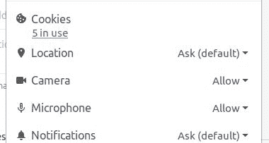
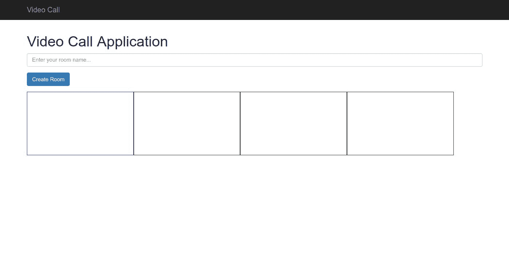
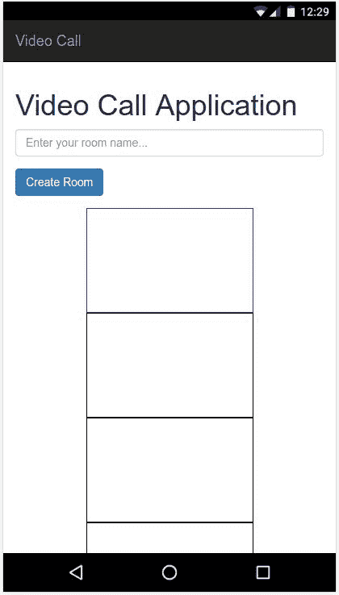
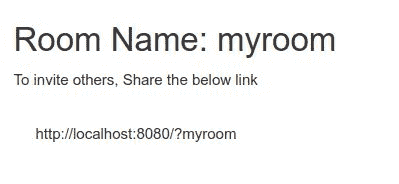
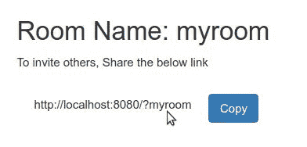
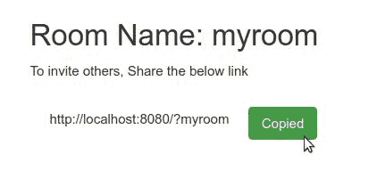
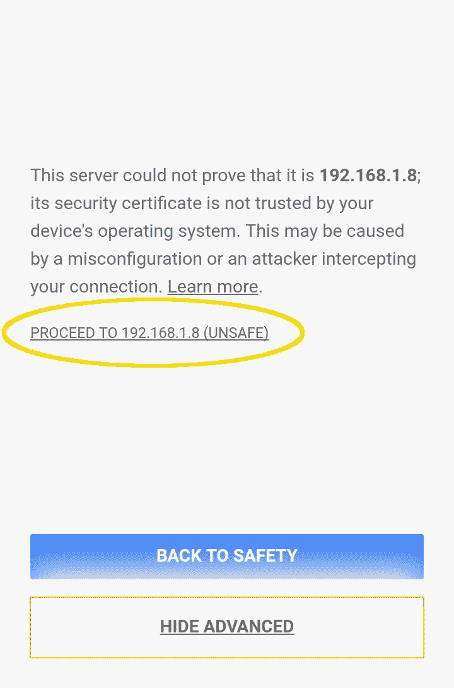

# 实时视频呼叫应用与 WebRTC

嘿! 只是让你知道，JS Meetup 是一个巨大的成功，它让后端开发人员完成了应用的服务器端。 但是你完成了应用的整个前端，做得很好。 你创建了一个完整的事件注册网站，它允许用户注册事件，同时学习一些非常重要的概念，如构建可重用的 ES6 模块，使用 promise 处理异步代码时发出 AJAX 请求，从数据中创建漂亮的图表，当然， 带有验证服务的经典表单验证。

后端代码也是用 JavaScript (Node.js)编写的，所以您可能真的对编写服务器端代码感兴趣。 但遗憾的是，正如我前面提到的，Node.js 超出了本书的范围。 实际上，你可以用普通的 JavaScript 做一些非常酷的事情，尽管许多人认为，“*它需要很多服务器端代码!”* “既然你已经读过这章的标题了——是的! 我们将在本章构建一个真正的视频通话应用，*几乎没有*服务器端代码。 最好的部分是，就像我们的其他应用一样，这一个也将是响应，并将与大多数移动浏览器工作。

让我们先看一看本章将要学习的概念列表:

*   介绍 WebRTC
*   JavaScript 的 WebRTC api
*   使用 SimpleWebRTC 框架
*   构建视频通话应用

除了这些主要的概念，在这一章还有很多要学习的东西。 所以，在我们开始之前，确保你有以下硬件:

*   带有网络摄像头和麦克风的个人电脑或笔记本电脑(你可能想用另一台电脑来体验视频通话)
*   Android 或 iPhone 设备(可选)
*   局域网连接，使您所有的设备都在同一个本地网络上测试开发中的应用(可以是 Wi-Fi 或有线以太网)

One of the dependencies used in this project requires you to have Python 2.7.x installed in your system. Linux and Mac users have Python pre-installed. Windows users can download Python 2.7.x version from [https://www.python.org/downloads/](https://www.python.org/downloads/)

# 介绍 WebRTC

在我们开始构建应用之前，最好了解一些关于 WebRTC 的事情，以便您对应用的工作有一个很好的了解。

# 历史的 WebRTC

实时通信能力已经成为我们现在使用的许多应用的共同特征。 比如说你想和朋友聊天或者看足球比赛。 对于这些应用来说，实时通信是必须的。 然而，在过去，在浏览器上进行实时视频通话对用户来说是一项相当困难的任务，因为他们必须为不同的应用安装插件，以便在 web 浏览器上使用视频通话，而插件带来了漏洞，因此需要定期更新。

为了克服这个问题，谷歌在 2011 年 5 月发布了一个基于浏览器的实时通信标准的开源项目，称为 WebRTC。 WebRTC 的概念很简单。 它定义了一组应该跨所有应用使用的标准，以便应用可以直接彼此通信(点对点通信)。 通过实现 WebRTC，将不再需要任何插件，因为通信平台是标准化的。

目前，WebRTC 正在由**World Wide Web Consortium**(**W3C**)和**Internet Engineering Task Force**(**IETF**)标准化。 大多数浏览器供应商都在积极实施 WebRTC，它也可以用于本地 Android 和 iOS 应用。 如果您想知道您的浏览器是否已经准备好支持 WebRTC，可以访问:[http://iswebrtcreadyyet.com/](http://iswebrtcreadyyet.com/)。

在撰写本书时，浏览器支持状态为:


WebRTC 即使最常用的浏览器支持,除了 Safari,仍然存在很多问题和缺陷的实现,因此,建议使用垫片,如`adapter.js`([https://github.com/webrtc/adapter](https://github.com/webrtc/adapter)),这样应用就不会遭受任何问题在修改规范或前缀。 当我们研究 WebRTC 的 JavaScript api 时，我们将看到更多关于这一点的内容。

移动版本的 Chrome 和 Firefox 也支持 WebRTC; 因此，即使在没有插件的移动浏览器中，也可以使用视频通话。

For iPhone users
Neither Safari mobile browser or Chrome support WebRTC on the iPhone yet. So, you either have to install Firefox or the Bowser app from the app store. Link for Bowser: [https://itunes.apple.com/app/bowser/id560478358?mt=8](https://itunes.apple.com/app/bowser/id560478358?mt=8).

# JavaScript WebAPIs

到目前为止，我们已经使用了一些 webapi，如`FileReader`、document(用于`document.querySelector()`方法)、`HTMLImageElement`(我们在 Meme Creator 中使用的`new Image()`构造函数)等等。 它们不是 JavaScript 语言的一部分，但它们是 webapi 的一部分。 当在浏览器中运行 JavaScript 时，将提供一个包含 webapi 的所有方法的`window`对象。 `window`对象的范围是全局的，`window`对象的属性和方法也是全局的。 这意味着，如果你想使用 navigator WebAPI，你可以做以下事情:

```js
window.navigator.getUserMedia()
```

或者，你可以简单地这样做:

```js
navigator.getUserMedia();
```

两者都可以很好地工作，实现相同的方法。 但是，请注意 WebAPI(`window`对象)只有在浏览器上运行 JavaScript 时才对 JavaScript 可用。 如果你在其他平台上使用 JavaScript，比如 Node.js 或 React Native，你将没有 webapi 可用。

webapi 现在变得越来越强大，它为 JavaScript 提供了执行更多功能的能力，比如直接从浏览器录制视频和音频。 先进的 web 应用就是这样一个例子，它由`ServiceWorker`WebAPI 提供支持。

We are going to use a lot of WebAPIs in this chapter and the upcoming chapters. For a full list of the WebAPIs available for JavaScript, visit the following MDN page: [https://developer.mozilla.org/en-US/docs/Web/API](https://developer.mozilla.org/en-US/docs/Web/API).

# JavaScript WebRTC API

由于浏览器本身支持 WebRTC，所以浏览器供应商已经创建了 JavaScript webapi，这样开发者就可以轻松地构建应用。 目前，WebRTC 实现了 JavaScript 使用的三个 api:

*   MediaStream
*   RTCPeerConnection
*   RTCDataChannel

# MediaStream

MediaStream API 用于访问用户的视频和音频设备。 一般来说，浏览器会提示用户是否允许网站访问他/她设备上的摄像头和麦克风。 尽管 MediaStream API 的底层概念是相同的，但是不同的浏览器厂商实现的 API 是不同的。

While using the `getUserMedia()` method with `{audio: true}` to access your own microphone, *either mute the speakers or mute the HTML video element*. Otherwise, *it might cause feedback that can damage your speakers*.

例如，在 Chrome 中，要使用 MediaStream API，你需要使用`navigator.getUserMedia()`方法。 此外，Chrome 允许 MediaStream 仅在本地主机或 HTTPS url 中工作。

`navigator.getUserMedia()`接受三个参数。 第一个是配置对象，它告诉浏览器网站需要访问什么。 另外两个是用于成功或失败响应的回调函数。

在一个空目录中创建一个简单的 HTML 文件，比如`chrome.html`。 在 HTML 文件中，添加以下代码:

```js
<video></video>
<script>
const $video = document.querySelector('video');
if (navigator.getUserMedia) {
  navigator.getUserMedia(
    {audio: true, video: true},
    stream => {
      $video.srcObject = stream;
      $video.muted = true; // Video muted to avoid feedback
      $video.onloadedmetadata = () => {
        $video.play();
      };
    },
    error => console.error(error)
  );
}
</script>
```

这段代码的作用如下:

*   它将在`$video`对象中创建一个对`<video>`元素的引用。
*   然后检查`navigator.getUserMedia`是否可用。 这样做是为了避免在使用与 WebRTC 不兼容的浏览器时出现错误。
*   然后，使用以下三个参数调用`navigator.getUserMedia()`方法:
    *   第一个参数指定网站对浏览器需要什么。 在我们的案例中，包括音频和视频。 因此，我们应该通过`{audio: true, video: true}`。
    *   第二个参数是成功回调函数。 从用户接收的视频和音频流在`stream`对象中可用，该对象作为参数传递给此函数。 它将`srcObject`属性添加到`<video>`元素中，其值作为从用户输入设备接收的视频和音频的`stream`对象。 将在流加载并开始播放视频时调用`$video.onloadedmetadata`，因为我们在它的回调函数中添加了`$video.play()`。
    *   当用户拒绝允许网站访问摄像头或麦克风，或发生其他错误，无法检索媒体流时，调用第三个参数。 这个函数有一个`error`对象作为它的参数，它包含错误的详细信息。

现在，用 Chrome 在本地主机上使用`http-server`打开文件。 首先，Chrome 会提示你允许使用设备的摄像头和麦克风。 它应该如下所示:


如果您单击允许，您应该看到您的视频流通过您的前置摄像头。 我已经建立了一个 JS 小提琴:[https://jsfiddle.net/1odpck45/](https://jsfiddle.net/1odpck45/)，与此你可以玩周围的视频流。

一旦你点击“允许”或“阻止”，Chrome 就会记住这个首选项。 若要更改网站的权限，您必须点击地址栏左侧的锁定或信息图标，它会显示一个菜单，如下所示，您可以再次更改权限:



Since we use http-server or the Webpack dev server for developments that are running on localhost, we can develop WebRTC apps in Chrome. However, if you want to deploy the app in production, you need to deploy them with an HTTPS URL. Otherwise, the application won't work on Chrome.

我们制作的视频在 Chrome 上运行得很好，但如果你试图在其他浏览器上运行这段代码，比如火狐，那就行不通了。 这是因为 Firefox 对 MediaStream API 有不同的实现。

在 Firefox 中，您需要使用返回 Promise 的`navigator.mediaDevices.getUserMedia()`方法。 `stream`对象可以使用`.then().catch()`链。

Firefox 浏览器的代码如下:

```js
<video></video>
<script>
const $video = document.querySelector('video');
navigator.mediaDevices.getUserMedia({audio: true, video: true})
.then(stream => {
  $video.srcObject = stream;
  $video.muted = true;
  $video.onloadedmetadata = function(e) {
    $video.play();
  };
})
.catch(console.error);
</script>
```

你可以在 Firefox 中运行这个代码，或者在你创建的`chrome.html`文件的相同目录中创建一个`firefox.html`文件，或者在你的 Firefox 浏览器中打开以下 JS:[https://jsfiddle.net/hc39mL5g/](https://jsfiddle.net/hc39mL5g/)。

Setting up the HTTPS server for production is beyond the scope of this book. But, depending on the type of server you want to use, it is fairly simple to find the instructions on the internet.

# 使用 Adapter.js 库

由于 WebRTC 的实现在不同的浏览器之间是不同的，建议使用一个垫片，例如`adapter.js`库([https://github.com/webrtc/adapter](https://github.com/webrtc/adapter))，它将代码与浏览器实现的差异隔离开来。 通过包含`adapter.js`库，您可以在 Firefox 浏览器中运行为 Chrome 编写的 WebRTC 代码。 尝试在 Firefox 中运行以下 JS，它有在 Chrome 上运行的 WebRTC 代码，但有`adapter.js`:[https://jsfiddle.net/1ydwr4tt/](https://jsfiddle.net/1ydwr4tt/)。

If you are wondering about the `<video>` element, it was introduced in HTML5\. To know more about using the video element, visit the w3schools page: [https://www.w3schools.com/html/html5_video.asp](https://www.w3schools.com/html/html5_video.asp) or the MDN page: [https://developer.mozilla.org/en/docs/Web/HTML/Element/video](https://developer.mozilla.org/en/docs/Web/HTML/Element/video).

# RTCPeerConnection 和 RTCDataChannel

MediaStream API 用于从用户设备中检索视频和音频流，RTCPeerConnection 和 rtcdatachnel API 用于建立对等连接并在它们之间传输数据。 在我们的视频通话应用中，我们将使用 SimpleWebRTC 框架，它将抽象这些 api，并为我们提供一个更简单的对象来建立与其他设备的连接。 因此，我们不打算研究这两个 api。

然而，在使用 WebRTC 时，有一件重要的事情需要知道。 虽然 WebRTC 的创建是为了让设备在没有任何服务器的情况下直接相互连接，但目前是不可能实现的，因为要连接到设备，你需要知道设备在互联网上的位置，即设备在互联网上的 IP 地址。 但是，通常情况下，设备只知道它们的本地 IP 地址(192.168.1)。 x 型)。 公网 IP 地址由防火墙或路由器管理。 为了克服这个问题并向其他设备发送准确的 IP 地址，我们需要信令服务器，如**STUN**或**TURN**。

该设备将向 STUN 服务器发送请求，以检索其公共 IP 地址，并将该信息发送给其他设备。 这被广泛使用，适用于大多数场景。 但是，如果路由器或防火墙的 NAT 服务为每个设备的连接分配了不同的端口号，或者设备的本地地址不断变化，从 STUN 服务器接收的数据可能不够，因此，必须使用 TURN 服务器。 TURN 服务器作为两台设备之间的中继，即设备将数据发送给 TURN 服务器，由 TURN 服务器将数据转发给其他设备。 然而，TURN 服务器的效率不如 STUN 服务器，因为它消耗了大量的服务器端资源。

通常，使用一个**ICE**实现，它决定是否需要在两个设备之间使用 STUN 或 TURN 服务器(它通常使用 STUN，而使用 TURN 作为最后的手段)，因此，保持连接更有效和稳定。

Real-time communication with WebRTC is quite a large topic to be covered in a chapter, but if you are interested in learning more about WebRTC, you can go to WebRTC's official website [https://webrtc.org/](https://webrtc.org/) to look into some of the various resources available to get started with WebRTC.

# 构建视频呼叫应用

我们将在本章构建的应用是一个简单的视频会议应用，你可以用它创建一个房间，然后将房间的 URL 共享给其他人。 任何点击 URL 的人都可以加入调用。 在 UI 部分，我们可以将参与者的视频安排在小框中，当你点击一个参与者的时候，我们可以放大视频。 这种类型的视频通话应用现在被广泛使用。 下面是应用在桌面浏览器上的样子:



蓝色框将显示您的视频，而其他框将显示其他参与者的视频。 当参与者的数量增加时，行会自动绕到新行(柔性绕行)。 在移动设备中，我们可以按列显示视频，而不是按行显示，因为这对于较小的屏幕更有效。 因此，对于移动设备，应用应该如下所示:



方框只是占位符。 对于真实的视频，我们可以使用边距/填充给每个视频之间的间距。 此外，为了分享链接，我们可以使用一个点击复制按钮，这将是真正的用户友好。 现在您已经很好地理解了我们将要构建的内容，让我们开始吧!

# 初始项目设置

初始设置与我们在之前的事件注册应用中所做的没有太大的不同。在 VSCode 中打开`Chapter04`文件夹中的启动器文件，并创建一个`.env`文件。 从`.env.example`文件中，您应该知道，对于这个应用，我们只需要一个环境变量`NODE_ENV`，它的值仅在生产环境中为`production`。 对于开发，我们可以简单地给它分配一些其他的值，例如`dev`。

一旦你创建了你的`.env`文件，打开终端在 VSCode 或你的本机终端(导航到项目根文件夹)，并运行`npm install`安装项目的所有依赖。 之后，在终端中运行`npm run webpack`，应该会启动 Webpack dev 服务器。

# 向页面添加样式

你知道如何使用 Webpack 开发服务器。 那么，让我们继续向页面添加样式。 首先，浏览`index.html`文件，了解页面的基本结构。

页面主体分为两部分:

*   Navbar
*   容器

该容器进一步分为三个部分:

1.  首先，`create-room-area`，它包含创建一个带有房间名称的新房间所需的输入字段。
2.  第二，`info-area`，包含关于房间的信息(房间名称和房间 URL)。 它也有两个按钮，将用于复制房间的 URL(目前隐藏使用`.hidden`Bootstrap 风格类)。
3.  最后是`video-area`，用于显示所有参与者的视频。

首先，在`src/css/styles.css`文件中添加以下代码，防止容器部分与导航栏重叠:

```js
body {
  padding-top: 65px;
}
```

启用 Webpack 热重载后，您应该会立即看到 CSS 的变化。 `create-room-area`与默认的引导样式看起来很好。 那么，让我们进入第二部分，信息区域。 要处理`info-area`，请暂时从 HTML 中删除`.hidden`类。 另外，从两个按钮中删除`.hidden`，并在段落元素中添加一些文本，其中将包含房间的 URL。 如果房间 URL 和按钮对齐在一行，那就太棒了。 为了使它们对齐，在`styles.css`文件中添加以下 CSS:

```js
.room-text {
  display: flex;
  flex-direction: row;
  padding: 10px;
  justify-content: flex-start;
  align-items: center;
  align-content: center;
}
.room-url {
  padding: 10px;
}
.copy {
  margin-left: 10px;
}
.copied {
  margin-left: 10px;
}
```

对于`video-area`，移动设备需要将视频排成一列，桌面设备需要将视频排成一列。 因此，我们可以使用媒体查询来为它分配不同的样式。 此外，对于视频元素的大小(`.video-player`)，我们可以设置`max-width`和`max-height`为 25 视口宽度，以便其尺寸将响应所有设备。 在你的`styles.css`文件中，添加以下样式:

```js
@media only screen and (max-width: 736px) {
  .video-area {
    display: flex;
    flex-direction: column;
    align-items: center;
    justify-content: center;
  }
}
@media only screen and (min-width: 736px) {
  .video-area {
    display: flex;
    flex-direction: row;
    flex-wrap: wrap;
  }
}
.video-player {
  max-height: 25vh;
  max-width: 25vh;
  margin: 20px;
}
```

现在需要的款式就这些了。 那么，让我们开始为应用编写 JavaScript。

# 构建视频通话应用

一切就绪，让我们开始编码吧。 和往常一样，就像我们在之前的应用中做的那样，打开你的`home.js`文件，并用一个构造函数创建你的`Home`类:

```js
class Home {
  constructor() {

  }
}
```

然后，创建一个`Home`类的实例，并将其分配给一个对象`home`，如下所示:

```js
const home = new Home();
```

我们以后会用到这个家居用品。 现在，我们在终端中从项目根目录中运行以下命令，将`SimpleWebRTC`包添加到项目中:

```js
npm install -S simplewebrtc
```

并在你的`home.js`文件的顶部添加以下导入语句:

```js
import SimpleWebRTC from 'simplewebrtc';
```

根据`SimpleWebRTC`文档，我们需要创建一个`SimpleWebRTC`类的实例，并进行一些配置，以便在应用中使用它。 在你的`home.js`文件中，在`Home`类之前，添加以下代码:

```js
const webrtc = new SimpleWebRTC({
  localVideoEl: 'localVideo',
  remoteVideosEl: '',
  autoRequestMedia: true,
  debug: false,
});
```

您的应用现在应该请求访问摄像机和麦克风的权限。 这是因为，在幕后，`SimpleWebRTC`已经开始设置发起视频通话所需的一切。 如果单击允许，您将看到视频出现在一个小矩形框中。 这就是你在前面代码中添加的对象中的配置:

*   `localVideoEl`:包含元素 ID，该元素应该包含您的本地视频。 在这里，来自我们的`index.html`文件的`video#localVideo`元素将显示我们自己的视频，因此，它被选择为它的值。
*   `remoteVideosEl`:添加远程视频的容器 ID。 我们还没有创建这个元素，最好稍后添加视频，所以把它作为空字符串。
*   `autoRequestMedia`:提示用户对摄像头和麦克风的访问权限，需要设置为`true`。
*   `debug`:如果为 true，它将在控制台中打印所有`webrtc`事件。 我已经将它设置为`false`，但是在您的系统中将它设置为 true，以便查看事件的发生。

默认情况下，`SimpleWebRTC`使用谷歌提供的免费 STUN 服务器`stun.l.google.com:19302`。 在大多数情况下，这个 STUN 服务器就足够了，除非您处于具有复杂路由协议的公司防火墙之后。 否则，您可以使用 STUN 和 TURN 服务器设置自己的 ICE 配置。 为此，您需要安装 signalmaster([https://github.com/andyet/signalmaster](https://github.com/andyet/signalmaster))，并将 ICE 配置细节添加到前面提到的构造函数中。 然而，这超出了本书的范围。 我们将继续使用默认配置。

第一步，我们将在构造函数中创建类变量和 DOM 元素的引用:

```js
constructor() {
  this.roomName = '';

  this.$createRoomSection = document.querySelector('#createRoomSection');
  this.$createRoomButton = document.querySelector('#createRoom');
  this.$roomNameInput = document.querySelector('#roomNameInput');

  this.$infoSection = document.querySelector('#infoSection');
  this.$roomName = document.querySelector('#roomNameText');
  this.$roomUrl = document.querySelector('#roomUrl');
  this.$buttonArea = document.querySelector('.room-text');
  this.$copy = document.querySelector('.copy');
  this.$copied = document.querySelector('.copied');

  this.$remotes = document.querySelector('.video-area');
  this.$localVideo = document.querySelector('#localVideo');
}
```

这是很多，但它们都是我们应用的不同步骤所需要的。 我们在这里创建的唯一变量是`roomName`，顾名思义，它包含房间的名称。 其他的都是对 DOM 元素的引用。

# 创建一个房间

这个应用的第一步是创建一个房间，这样其他成员就可以在房间里加入一个电话。 根据当前的 UI 设计，我们需要在用户点击 create room 按钮时创建房间。 让我们在那个按钮上注册一个点击事件处理程序。

到目前为止，我们已经使用了不同的方法来处理事件:

*   在我们的 ToDo 列表应用中，我们在 HTML 中添加了`onclick`属性来调用 JavaScript 函数`onclick`事件。
*   在 Meme Creator 中，我们为每个元素附加了事件监听器，以便侦听将要发生的特定事件(keyup、change 和 click 事件)。 对于 Event Registration 表单也是如此，我们在其中添加了一个事件监听器来监听表单提交操作。
*   还有另一种方法，您可以在其中向 DOM 元素的引用的事件属性添加一个回调函数。 在本例中，我们需要检测 Create Room 按钮上的单击事件。 我们可以按照以下方式处理:

```js
this.$createRoomButton.onclick = () => { 
}
```

因此，每当单击 Create Room 按钮时，它将执行前面函数中编写的代码。 使用哪个事件处理程序完全由您和您的需求决定。 通常，避免使用第一种方法，因为它将在 HTML 中公开 JavaScript 代码，而且在大型项目中很难跟踪 HTML 中调用的所有 JavaScript 函数。

如果您有大量的元素，比如在一个表中有大约 100 行，那么将 100 个事件监听器附加到每一行是低效的。 可以使用第三种方法通过附加一个函数的`onclick`方法参考每一行的 DOM 元素也可以附加一个事件监听器行父元素和使用的事件监听器听孩子的事件元素。

For a list of all the DOM events, visit the W3Schools page: [https://www.w3schools.com/jsref/dom_obj_event.asp](https://www.w3schools.com/jsref/dom_obj_event.asp).

在我们的应用中，我们需要处理大量的点击事件。 所以，让我们在`Home`类中创建一个方法来注册所有的点击事件:

```js
registerClicks() {
}
```

并在构造函数中调用这个方法:

```js
constructor() {
  ...
  this.registerClicks();
}
```

在`registerClicks()`方法中，添加以下代码:

```js
this.$createRoomButton.onclick = () => {
}
```

当用户单击 Create Room 按钮时，需要发生一些事情。 它们是:

*   问一下房间的名字。 但是房间名称不能包含任何会导致 URL 出现问题的特殊字符
*   使用`SimpleWebRTC`创建一个房间
*   将用户重定向到为房间创建的 URL(以房间名称作为查询字符串的 URL)
*   显示他/她可以与其他需要参与呼叫的人共享的 URL

你应该在前面代码中创建的`onclick`方法中编写以下代码:

```js
this.roomName = this.$roomNameInput.value.toLowerCase().replace(/\s/g, '-').replace(/[^A-Za-z0-9_\-]/g, '');
```

这将获得输入字段中键入的房间名称，并使用正则表达式将其转换为 url 友好字符。 如果房间名称不为空，我们可以继续在`SimpleWebRTC`中创建房间:

```js
if(this.roomName) {
  webrtc.createRoom(this.roomName, (err, name) => {
    if(!err) {
      // room created
    } else {
      // unable to create room
      console.error(err);
    }
  });
}
```

上述代码执行以下操作:

*   `if`条件将检查房间名称是否为空(空字符串为假)。
*   `webrtc.createRoom()`将创造房间。 它接受两个参数:第一个是房间名称字符串，第二个是在房间创建时执行的回调函数。
*   回调函数有参数`err`和`name`。 通常，我们应该检查这个过程是否成功。 因此，`if(!err) {}`将包含流程成功时要执行的代码。 `name`为`SimpleWebRTC`创建的房间名称。

在`if(!err)`条件中，添加以下代码:

```js
const newUrl = location.pathname + '?' + name;
history.replaceState({}, '', newUrl);
this.roomName = name;
this.roomCreated();
```

对象包含关于当前 URL 的信息。 `location.pathname`用于设置或获取当前网页的 URL。 因此，我们可以通过将房间名称附加到 URL 来构造 URL。 所以，如果你当前的 URL 是`http://localhost:8080/`，那么在创建房间之后，你的 URL 应该变成`http://localhost:8080/?roomName`。

要替换 URL 而不影响当前页面，我们可以使用 History Web API 提供的`history`对象。 对象用来操作浏览器的历史记录。 如果你想执行当用户点击浏览器的后退按钮时发生的后退动作，你可以做如下操作:

```js
history.back();
```

同样地，为了继续前进，你可以这样做:

```js
history.forward();
```

但我们在应用中需要的是在不影响浏览器历史记录的情况下更改当前 URL。 也就是说，我们需要在不影响浏览器后退或前进按钮的情况下，将 URL 从`http://localhost:8080/`更改为`http://localhost:8080/?roomName`。

对于这样复杂的操作，您可以使用 HTML5 中引入的`pushState()`和`replaceState()`方法来处理历史对象。 `pushState()`在浏览器上创建一个新的历史记录条目，并在不影响当前页面的情况下更改页面的 URL。 `replaceState()`做了同样的事，但它不是创建一个新的历史条目，而是取代了当前的条目，使之对我们的目的非常理想。

`pushState()`和`replaceState()`方法都接受三个参数。 第一个是`state`(一个 JSON 对象)，第二个是`title`(字符串)，第三个是新的 URL。 以下是`pushState()`和`replaceState()`的工作原理:

*   每次调用`pushState()`或`replaceState()`时，都会触发`window`对象中的`popstate`事件。 第一个参数 state 对象由该事件的回调函数使用。 我们现在不需要它了，所以我们将它设置为一个空对象。
*   目前，大多数浏览器只是忽略第二个参数，所以我们只是将它设置为空字符串。
*   第三个参数 URL 是我们真正需要的。 它将浏览器 URL 更改为提供的 URL 字符串。

由于房间已经创建，URL 已经更改，我们需要隐藏`.create-room-area`div，而显示`.info-area`div。 这就是我添加`this.roomCreated()`方法的原因。 在`Home`类中，创建一个新方法:

```js
roomCreated() {
  this.$infoSection.classList.remove('hidden');
  this.$createRoomSection.classList.add('hidden');
  this.$roomName.textContent = `Room Name: ${this.roomName}`;
  this.$roomUrl.textContent = window.location.href;
}
```

此方法将显示信息部分，同时隐藏创建房间部分。 此外，它将使用`textContent()`方法更改房间名称和 URL，该方法将更改相应 DOM 元素中的文本。

More information on location objects can be found on the w3schools page: [https://www.w3schools.com/jsref/obj_location.asp](https://www.w3schools.com/jsref/obj_location.asp). More information on the history object can be found on the MDN page: [https://developer.mozilla.org/en-US/docs/Web/API/History](https://developer.mozilla.org/en-US/docs/Web/API/History). Also, if you want to learn to manipulate the browser history, visit [https://developer.mozilla.org/en-US/docs/Web/API/History_API](https://developer.mozilla.org/en-US/docs/Web/API/History_API).

# 增加参与者到您的房间

您有一个活跃的房间和房间 URL，您需要用它邀请其他人。 但是如果你有一个点击复制功能来复制 URL 不是更简单吗? 这是一个很好的功能。 所以，在我们将参与者添加到房间之前，让我们创建一个点击复制功能。

# 点击复制文本

目前，这是信息区域的外观:



对于点击复制功能，如果你将鼠标悬停在房间 URL 上，它会显示一个复制按钮:



如果你点击复制按钮，它应该复制文本并进入复制按钮:



对于这个功能，我们需要添加一些事件监听器。 因此，在你的主类中，创建一个新方法`addEventListeners()`，并在构造函数中调用它:

```js
class Home {
  constructor() {
    ...
    this.addEventListeners();
  }

  addEventListeners() {
  }
}
```

对包含复制按钮的 div 的引用存储在`this.$buttonArea`变量中。 当鼠标进入 div 时，它将触发一个`mouseenter`事件。 当这个事件在`$buttonArea`中发生时，我们需要从复制按钮中删除`.hidden`类。

在你的`addEventListeners()`方法中，添加以下代码:

```js
this.$buttonArea.addEventListener('mouseenter', () => {
  this.$copy.classList.remove('hidden');
});
```

页面将重新加载，您将不得不再次创建一个房间。 如果您现在将鼠标指针悬停在房间的 URL 上，它应该使复制按钮可见。 当指针离开`div`时，我们还需要隐藏按钮。 与`mouseenter`类似，`div`将在指针离开时触发`mouseout`事件。 所以，再一次，在前面的代码后面添加以下代码:

```js
this.$buttonArea.addEventListener('mouseout', event => {
  this.$copy.classList.add('hidden');
  this.$copied.classList.add('hidden');
});
```

现在，再次尝试将指针悬停在房间 URL 上。 令人惊讶的是，它并没有像预期的那样工作。 它应该做到的，但它没有。 这是因为`mouseout`事件，当指针进入`$buttonArea`的子元素时，也会触发`mouseout`事件。 它将子元素视为`outside`和`div`。 为了解决这个问题，我们需要过滤回调函数中传递的`event`对象，这样当指针通过进入子元素移动`outside`时，就不会发生任何操作。

这是一个棘手的问题，但是如果您在控制台中打印事件对象，您将看到有许多属性和方法包含事件的所有细节。 `toElement`属性或`relatedTarget`属性将包含指针移动到的元素，具体取决于浏览器。 因此，我们需要检查该元素的父元素是否为`$buttonArea`。 如果是这样，我们应该阻止任何行动的发生。 要做到这一点，将前面的代码更改为以下代码:

```js
this.$buttonArea.addEventListener('mouseout', event => {
  const e = event.toElement || event.relatedTarget;
  if(e) {
    if (e.parentNode == this.$buttonArea || e == this.$buttonArea) {
      return;
    }
  }
  this.$copy.classList.add('hidden');
  this.$copied.classList.add('hidden');
});
```

注意:

```js
const e = event.toElement || event.relatedTarget;
```

这是一个短路评估。 它所做的是，如果第一个值为真，它将把它赋给常量`e`。 如果是假的，OR 运算符将计算第二个值，并将其值赋给`e`。 你可以像这样声明任意数量的值。 说:

```js
const fun = false || '' || true || 'test';
```

在这里，乐趣的价值将是列表中的第一个真实陈述，因此，它的价值将是真实的。 `'test'`也是一个真值，但它不会被计算，因为在它之前有一个真值。 这种类型的分配是常用的，对于某些任务是很方便的。

现在，`e`对象包含了目标元素。 因此，我们只需要检查`e`是否存在(防止异常)，如果存在，它的父元素或元素本身是`$buttonArea`。 如果它是真的，我们就返回。 这样，回调函数将停止执行，而不会隐藏复制和复制的按钮。 我们也隐藏了复制的按钮，因为我们要让它在用户点击复制按钮时可见。

尝试在应用中再次悬停在房间 URL 上，它应该会像预期的那样工作。 最后一步是在用户单击复制按钮时复制 URL。 所以，让我们注册一个点击，在我们之前创建的`Home`类`registerClicks()`方法。 在`registerClicks()`方法中，添加代码来处理 Copy 和 Copied 按钮的点击，并在`Home`类中创建一个新方法`copyUrl()`来执行复制操作:

```js
registerClicks() {
  ...
  this.$copy.onclick = () => {
    this.copyUrl();
  };
  this.$copied.onclick = () => {
    this.copyUrl();
  };
}

copyUrl() {

}
```

在前面的代码中，在`registerClicks()`方法中，单击 Copy 按钮和 Copied 按钮将调用类的`copyUrl()`方法。 我们需要添加代码在`copyUrl()`方法中复制文本。

要复制文本，首先，我们需要获取需要从其中复制文本的节点范围(DOM 元素)。 为此，创建一个范围对象并选择`this.$roomUrl`节点，该节点包含房间 URL 的文本。 在`copyUrl()`方法中，添加以下代码:

```js
const range = document.createRange();
range.selectNode(this.$roomUrl);
```

现在，range 对象包含元素`$roomUrl`作为选定节点。 然后，我们需要选择节点中的文本，就像用户通常用光标选择文本一样。 `window`对象有`getSelection()`方法，我们可以为此目的使用它。 我们必须删除所有的范围以清除之前的选择，然后选择一个新的范围(这是我们之前创建的范围对象)。 将以下代码添加到上述代码中:

```js
window.getSelection().removeAllRanges();
window.getSelection().addRange(range);
```

最后，我们不知道用户的浏览器是否支持执行 copy 命令，所以我们在`try{} catch(err){}`语句中进行复制，这样，如果发生任何错误，都可以在 catch 语句中处理。 `document.execCommand('copy')`方法将复制选定范围内的文本，并将其作为字符串返回。 此外，当复制成功时，我们需要隐藏复制按钮并显示复制按钮。 复制的代码如下:

```js
try {
  const successful = document.execCommand('copy');
  const msg = successful ? 'successful' : 'unsuccessful';
  console.log('Copying text command was ' + msg);
  this.$copy.classList.add('hidden');
  this.$copied.classList.remove('hidden');
} catch(err) {
  console.error(err);
}
```

添加上述代码后，在应用中创建一个房间，并再次尝试单击 Copy。 它应该变成“复制”按钮，房间的 URL 文本将高亮显示，因为我们选择文本的方式和选择它的方式一样，使用 JavaScript 游标。 但是，一旦复制完成，最好清除选择。 所以，在`copyUrl()`方法的末尾添加这一行:

```js
window.getSelection().removeAllRanges();
```

这将清除所选内容，因此下次单击复制时，房间 URL 文本将不会突出显示。 然后，您可以简单地将选定的 URL 粘贴到您希望与他人共享的任何地方。

# 加入一个房间

现在您有了一个链接，我们需要让用户使用该链接加入房间。 这个过程很简单:当用户打开链接时，他加入了房间，所有参与者的视频都显示给他。 要让用户加入一个房间，`SimpleWebRTC`有`joinRoom('roomName')`方法，其中房间名称字符串作为参数传递。 一旦用户进入房间，它将寻找房间中连接的其他用户的视频，并将为它找到的每个视频触发一个`videoAdded`事件，以及一个回调函数，该函数具有该用户的视频对象和对等对象。

让我们来规划一下这个过程应该如何工作:

*   首先，我们需要检查用户输入的 URL 是否在其查询字符串中包含房间名称。 也就是说，以`'?roomName'`结尾。
*   如果房间名称存在，那么我们应该让用户加入房间，同时隐藏`.create-room-area`div 并显示带有房间详细信息的`.info-area`div。
*   然后，我们需要听`videoAdded`事件，如果一个事件被触发，我们将视频添加到`.video-area div`。

`SimpleWebRTC`在完成加载时触发`readyToCall`事件。 它还有`on()`方法来监听所触发的事件。 我们可以使用`readyToCall`事件来检查 URL 中的房间名称。 这段代码应该在`Home`类之外。 因此，在你调用`Home`类构造函数的行后面，添加以下代码:

```js
webrtc.on('readyToCall', () => {
  if(location.search) {
    const locationArray = location.search.split('?');
    const room = locationArray[1];
  }
});
```

我们使用 location 对象来获取 URL。 首先，我们需要使用`location.search`检查 URL 是否包含查询字符串。 因此，我们在 if 条件中使用它，如果它包含查询字符串，我们就可以继续这个过程。

方法将字符串分割为子字符串数组，子字符串数组由传递给它的参数值分割。 URL 如下所示:

```js
http://localhost:8080/?myRoom
```

`location.search`将返回 URL 的查询字符串部分:

```js
'?myRoom'
```

因此，`location.search.split('?')`将把字符串转换为数组，如下所示:

```js
[ '', 'myRoom']
```

在数组的下标 1 处有房间名。 这样写是可行的，但这里我们可以使用短路计算。 之前我们使用 OR 运算符求值，它将取第一个真值。 在这种情况下，我们可以使用 AND 操作符来接受第一个假值，如果没有假值，则接受最后一个真值。 上述代码将简化为以下代码:

```js
webrtc.on('readyToCall', () => {
  const room = location.search && location.search.split('?')[1];
});
```

如果 URL 不包含查询字符串，`location.search`将是一个空字符串(`""`)，这是一个假值。 因此，room 的值将是一个空字符串。

如果 URL 包含带有房间名称的查询字符串，那么`location.search`将返回`'?roomName'`，这是一个真值，因此下一个语句`location.search.split('?')[1]`将被计算，它进行分割并返回数组中的第一个索引(房间名称)。 因为它是最后一个真值，房间常量现在将包含房间名称字符串! 我们只是使用短路计算将三行代码简化为一行。

Detailed information on short-circuit evaluation can be found at: [https://developer.mozilla.org/en-US/docs/Web/JavaScript/Reference/Operators/Logical_Operators#Short-circuit_evaluation](https://developer.mozilla.org/en-US/docs/Web/JavaScript/Reference/Operators/Logical_Operators#Short-circuit_evaluation).

# setter 和 getter

我们只需要再添加一行，让用户加入房间:

```js
webrtc.joinRoom(room);
```

这将用户添加到房间，然而，一旦用户进入房间，我们需要隐藏`.create-room-area`div 并显示`.info-area`div，这些在`Home`类的`roomCreated()`方法中可用。 但是该方法依赖于`this.roomName`类变量，该类变量应该包含房间名称。 因此，我们需要更新一个类变量，并从类外部调用`class`方法。

尽管我们可以通过使用我们之前创建的`home`对象来实现，但如果我们只更新类的 room 属性，它就会自动执行操作，这就更有意义了。 为此，我们可以使用 setter。 setter 是用于将新值赋给对象属性的特殊方法。 我们之前已经多次使用过 getter 和 setter。 还记得我们如何得到输入字段的值吗?

```js
const inputValue = this.$roomNameInput.value
```

在这里，value 属性是一个 getter。 它从`$roomNameInput`对象返回一个值。 但是，如果我们这样做:

```js
$roomNameInput.value = 'New Room Name'
```

然后，它将把输入字段的值更改为`'New Room Name'`。 这是因为 value 现在充当 setter 并更新`$roomNameInput`对象中的属性。

我们将为我们的`Home`类创建一个 setter 来加入一个房间。 创建 setter 很简单; 我们只需创建一个以`set`关键字为前缀的方法，该方法应该有*一个参数*。 在你的`Home`类中，添加以下代码:

```js
set room(room) {
  webrtc.joinRoom(room);
  this.roomName = room;
  this.roomCreated();
}
```

现在，在你的`readyToCall`事件处理程序中使用 setter(只有当房间不是空字符串时):

```js
const home = new Home();

webrtc.on('readyToCall', () => {
  const room = location.search && location.search.split('?')[1];
  if(room) home.room = room;
});
```

一旦你添加了代码，在你的视频通话应用中创建一个房间，然后复制 URL 并粘贴到一个新标签中。 它应该自动从 URL 获取房间名称并加入房间。 如果你能看到房间信息，那就没问题了。 我们已经接近应用的最后阶段——添加和删除视频。

If and else conditions do not require `{}` curly braces if there is only one statement after them. That is, `if (true) console.log('true'); else console.log('false');` will work just fine! But it should be avoided, since it is always better to use `if else` conditions with `{}` curly braces.

创建一个 getter,只需前缀的方法`get`,而不是`set`,但方法不应该包含*参数*【5】和*它应该返回一个值【显示】。 例如，在您的`Home`类中，您需要使用 getter 来知道房间名称。 然后可以添加如下方法:*

```js
get room() {
  return this.roomName;
}
```

如果您在类之外尝试`console.log(home.room)`，您应该得到存储在`roomName`类变量中的值。

# 添加和删除视频

与`readyToCall`事件类似，`SimpleWebRTC`将为它在房间中找到的每个视频触发`videoAdded`事件，回调函数具有视频对象和包含 ID(该用户的唯一 ID)的 peer 对象。

To test multiple videos, we are going to open two tabs on the same browser in the same system. This might cause feedback to damage your audio devices, so keep your volume muted!

在`Home`类`addRemoteVideo($video, peer)`中创建一个新方法，如下所示:

```js
class Home {
  ...
  addRemoteVideo($video, peer) {
  }
}
```

让我们为`videoAdded`事件添加另一个事件处理程序，就像我们为`readToCall`事件所做的那样:

```js
webrtc.on('videoAdded', ($video, peer) => home.addRemoteVideo($video, peer));

```

每当添加视频时，它将使用视频对象和对等对象调用`Home`类的`addRemoteVideo`方法。 我们有一个 div`.video-area`，它应该包含所有的视频。 因此，我们需要构造一个新的 div 元素，类似于本地视频中使用的那个，例如:

```js
<div class="video-container" id="container_peerid">
  <video class="video-player"></video>
</div>
```

我们应该将这个元素附加到`.video-area`div 中，该 div 目前被`this.$remotes`变量引用。 这非常简单，就像我们在前一章添加了`script`元素一样。 在你的`addRemoteVideo()`方法中，添加以下代码:

```js
addRemoteVideo($video, peer) {
  const $container = document.createElement('div');
  $container.className = 'video-container';
  $container.id = 'container_' + webrtc.getDomId(peer);

  $video.className = 'video-player';

  $container.appendChild($video);

  this.$remotes.appendChild($container);
}
```

上述代码执行以下操作:

*   首先，我们使用`document.createElement('div')`方法创建一个`div`元素，并将其赋值给`$container`对象。
*   然后，将`$container`的类名设置为`'video-container'`，将 ID 设置为`'container_peerid'`。 我们可以使用`webrtc.getDomId()`方法从接收到的 peer 对象中获取 peer ID。
*   我们接收到的`$video`对象是一个 HTML 元素，类似于`$container`。 因此，我们将类名赋给它`'video-player'`。
*   然后，对于最后一步，我们将`$video`作为子元素添加到`$container`中，最后，将`$container`作为子元素添加到`this.$remotes`中。

这将使用类和 id 构造我们需要的 html。 当用户离开房间时，会触发`videoRemoved`事件，类似于`videoAdded`事件。 每当用户离开房间时，我们需要使用 peer ID 来删除包含 ID`'container_peerid'`的 div，其中`peerid`是离开的用户的 ID。 为此，添加以下代码:

```js
class Home {
  ...

  removeRemoteVideo(peer) {
    const $removedVideo = document.getElementById(peer ? 'container_' + webrtc.getDomId(peer) : 'no-video-found');
    if ($removedVideo) {
      this.$remotes.removeChild($removedVideo);
    }
  }

}
...

webrtc.on('videoRemoved', ($video, peer) => home.removeRemoteVideo(peer));
```

`removeRemoteVideo()`方法将使用 peer ID 找到包含远程视频的 div，并使用`removeChild()`方法将其从`this.$remotes`对象中删除。

是时候测试我们的视频通话应用了。在 Chrome 中打开应用并创建房间。 复制房间的 URL，并粘贴到一个新标签(保持音量静音!) 这可能需要几秒钟，但除非 STUN 对你不起作用，否则你应该在每个标签中看到两个视频。 你在标签间播放视频。

第一个视频是你的视频。 如果你关闭其中一个选项卡，你应该会看到第二个视频将从其他选项卡中删除。 在我们在其他设备上测试这个应用之前，还有一个功能会在这个应用中看起来很棒。那就是增加所选视频的大小。

# 选择一个视频

目前，所有的视频都很小。 因此，我们需要一个功能来放大视频，如:

*   在桌面中，点击一个视频会增加视频的大小，并把它带到视频列表的第一个位置
*   在手机上，轻击视频只会增加视频的大小

这听起来很好。 为了做到这一点，让我们添加一些样式到我们的`styles.css`文件:

```js
@media only screen and (max-width: 736px) {
  .video-selected {
    max-height: 70vw;
    max-width: 70vw;
  }
}
@media only screen and (min-width: 736px) {
  .video-selected {
    max-height: 50vh;
    max-width: 50vh;
  }
  .container-selected {
    order: -1;
  }
}
```

我们使用媒体查询添加了两组样式。 一个用于移动设备(`max-width: 736px`)，另一个用于台式机(`min-width: 736px`)。

对于视频中的每一次点击，我们应该将`.video-selected`类添加到该视频中，`.container-selected`添加到该视频的父 div 中:

*   在移动设备中，它会将视频的大小增加到视口宽度的 70%。
*   在桌面,它将增加多达 50%的窗口宽度大小也将`order: -1`分配给它的父 div。这种方式,因为父 div flex 的一部分,它将成为第一项的 flex 元素(但不应该包含其他元素顺序样式)。

在你的`Home`类中，添加以下方法:

```js
clearSelected() {
  let $selectedVideo = document.querySelector('.video-selected');
  if($selectedVideo) {
    $selectedVideo.classList.remove('video-selected');
    $selectedVideo.parentElement.classList.remove('container-selected');
  }
}
```

这将找到包含`.video-selected`类的视频，并从该视频中删除`.video-selected`类，从该视频的父 div 中删除`.container-selected`类。

我们可以在`registerClicks()`方法中注册本地视频的点击事件。 在`registerClicks()`方法中，添加以下代码:

```js
this.$localVideo.onclick = () => {
  this.clearSelected();
  this.$localVideo.parentElement.classList.add('container-selected');
  this.$localVideo.classList.add('video-selected');
};
```

对于远程视频，我们不能在这里注册单击，因为我们是动态创建这些元素的。 因此，我们要么创建一个事件监听器，要么在创建远程视频元素时注册一个点击事件。

在这里为每个视频创建一个事件监听器不是很有效，因为当用户离开时视频将被删除，所以我们将为每个视频运行不需要的事件监听器。 我们必须使用`removeEventListener()`方法删除这些事件监听器，或者通过在父 div`.video-area`上创建一个事件监听器来代替 video 元素来避免这种情况。 尽管如此，这意味着我们需要过滤每个在`.video-area`div 中进行的点击，以检查该点击是否在视频中进行。

显然，在创建视频元素时使用`onclick()`方法注册点击更简单。 这为我们省去了处理事件监听器的麻烦。 在你的`addRemoteVideo()`方法中，在现有代码之后添加以下代码:

```js
$video.onclick = () => {
  this.clearSelected();
  $container.classList.add('container-selected');
  $video.classList.add('video-selected');
};
```

现在试着在 Chrome 中点击一个视频。 你应该看到视频将会增加它的大小并移动到列表的第一个位置。 恭喜你! 您已经成功构建了视频呼叫应用! 是时候测试视频通话了。

# 视频通话

您已经准备好了应用，所以让我们在本地测试它。 首先，为你的应用生成产品构建。你已经在事件注册应用中完成了这一点。你需要在你的`.env`文件中设置`NODE_ENV=production`。

之后，在项目根目录下，杀死 Webpack dev 服务器并运行`npm run webpack`命令。 它应该为你的 JS 和 CSS 文件生成生成版本。 该文件名将在`dist/manifest.json`文件中可用。 在你的`index.html`页面中包括那些 CSS 和 JS 文件。

现在，在你的项目根目录下运行`http-server`。 它应该打印两个 IP 地址。 在浏览器中打开以 192 开头的那个。 这个 IP 地址可以被您局域网中的所有设备访问，除非您已经使用防火墙阻止了该端口。 然而，Chrome 将不会显示您的视频! 这是因为`getUserMedia()`方法只在本地主机和 HTTPS url 中工作。 由于我们的本地地址只使用 HTTP，视频将无法工作。

我们可以通过使用来自证书颁发机构的 SSL 证书在公共服务器上部署 WebRTC 应用来添加 HTTPS。 但是，对于我们的本地开发环境，我们可以使用自签名证书。 来自证书颁发机构的 SSL 证书将被所有浏览器信任，但自签名证书将不受信任，因此会显示一个警告，我们应该手动选择浏览器上的网站信任选项。 由于这个原因，自签名证书不适合生产，应该只用于开发目的。

创建自签名证书是一个大的过程，但幸运的是，有一个`npm`包可以在一行中完成这一工作。 我们需要全局安装这个包，因为它是一个命令行工具，像`http-server`。 在终端中运行以下命令:

```js
npm install -g local-ssl-proxy
```

Linux 用户可能必须在他们的命令中添加`sudo`才能全局安装软件包。 默认情况下，`http-server`将从`8080`端口号提供文件。 例如，如果你的当前 URL 如下:

```js
http://192.168.1.8:8080
```

打开另一个终端，执行如下命令:

```js
local-ssl-proxy --source 8081 --target 8080
```

在这里，source 是新的端口号，而 target 是 http-server 运行的端口号。 然后，你应该打开相同的 IP 地址与新的端口号和`https://`前缀在 Chrome，如下所示的代码块:

```js
https://192.168.1.8:8081
```

如果你在 Chrome 中打开这个页面，你应该收到类似以下截图的警告。 此时，选择 Advanced，如下图所示:


一旦你点击高级，你会看到一个类似下图的页面，你应该点击 proceed 链接:



您现在可以使用此 HTTPS URL 在任何连接到局域网的设备中打开应用。 确保设备之间有足够的距离，这样就不会产生反馈。

# 总结

希望您在构建视频通话应用时度过了愉快的时光。 在这一章中，我们用 JavaScript 做了一些新事情，学习了一些新概念，比如 JavaScript WebRTC api 和 SimpleWebRTC 框架。 在此过程中，我们做了很多很酷的事情，比如操纵浏览器历史记录、使用 JavaScript 选择文本以及使用 url。 此外，我们通过短路求值缩短了一些代码，并学习了在 JavaScript 中操作类变量的 setter 和 getter 方法。

`SimpleWebRTC`附带了许多其他事件和动作，允许您在应用中做更多的事情，如静音您的麦克风，静音来自他人的音频，等等。 如果您感兴趣，可以查看 SimpleWebRTC 主页上的更多示例。

我们知道如何创建可重用的 JavaScript 模块，这是我们在前一章中做过的。 在下一章中，我们将更进一步，使用 web 组件构建我们自己的可重用 HTML 元素。