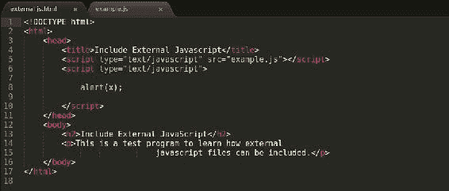
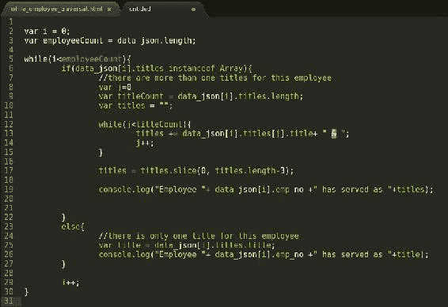
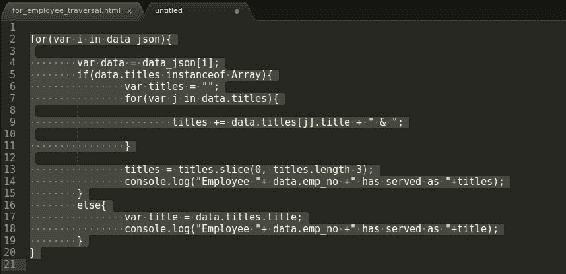

# 第三章。使用实时 JSON

在上一章中，我向您介绍了基本的 JSON，JSON 对象如何嵌入到 HTML 文件中，以及如何在简单的 JSON 对象上执行访问键等基本操作。现在让我们向前迈出一步，使用更大、更复杂、更接近我们在实时情况下使用的 JSON 的 JSON 对象。在现实应用中，可以从异步请求或 JSON 提要中检索 JSON 作为响应。网站使用 HTML、CSS 和 JavaScript 来提供视觉上漂亮的用户界面。但在某些情况下，数据供应商只专注于获取数据。一 **数据馈送**服务于他们的目的；feed 是一种提供数据的粗略方式，这样其他人就可以重用它来在他们的网站上显示数据，或者摄取数据并在其上运行他们的算法。这种数据馈送的大小很大，不能直接嵌入到`script`标签中。让我们看看外部 JavaScript 文件如何包含在一个 HTML 文件中。

下面的截图描述了`external-js.html`文件的代码:

在这个例子中，我们包括`example.js`，这是一个外部的 JavaScript 文件。

为了从`external-js.html`文件中访问`example.js`文件中的变量`x`，我们在 HTML 文件中的`script`标签内编写程序。

该文件必须创建在与`external-js.html`相同的文件夹中。遵循给定的文件夹结构:

# 访问 JSON 中的对象

现在我们已经理解了如何进行脚本调用来获取外部的 JavaScript 文件，让我们使用相同的技术来导入 JSON 提要。我生成了一个有 100 条记录的测试`employee` JSON 数据提要。要遍历任何 JSON 提要，记录数据是如何排列的非常重要。该数据馈送中的关键字是基本的员工信息，例如员工编号、出生日期、名字、姓氏、性别、雇用日期、他们拥有的职称以及他们拥有这些职称的日期。少数员工在整个任期内拥有相同的头衔，而有一些员工拥有不止一个头衔。

### 注

这个 JSON 文件将是练习代码文件的一部分。

当我们处理复杂的 JSON 数据馈送时，让我们将数据馈送保存到一个文件中。在`data_json_feed.html`文件中，我们已经导入了`data.json`文件，它和 HTML 文件在同一个文件夹中。值得注意的是，JSON 提要被分配给了一个名为 `data_json`的变量，要访问 JSON 提要，我们必须在`data_json_feed.html`文件中使用这个变量:

另一件需要注意的事情是使用了一种叫做`console.log`的新方法。Mozilla Firefox、谷歌 Chrome 和苹果 Safari 等浏览器为运行时 JavaScript 开发和调试配置了一个控制台面板。由于 JavaScript 函数`alert`的侵扰行为，不鼓励使用。另一方面，`console.log`不引人注目，它会将其信息记录到控制台。从这里开始，我们将不再使用`alert`方法，而是使用`console.log`将数据打印到控制台窗口中。谷歌 Chrome 和苹果 Safari 自带已经安装的开发者工具；要查看控制台，右键单击页面，然后单击**检查元素**。它们都带有一个**控制台**选项卡，允许我们进行日志记录。火狐依赖 Firebug 在[第八章](8.html "Chapter 8. Debugging JSON")、*调试 JSON* 中，我将为大家讲解 Firebug 的安装步骤。

当我们将 `data_json_feed.html`文件加载到火狐浏览器中，打开我们的控制台窗口，点击 **DOM** 选项卡，我们将看到 100 个`employee`对象的列表。如果我们的对象很小，有一个或两个子对象，我们更愿意使用它们的数字索引来访问它们；在这种情况下，由于我们有大量的子对象，基于静态索引来定位对象是不现实的。

# 执行复杂操作

为了处理一组对象，我们必须用迭代的方法来处理它们。我们必须想出一个迭代的解决方案，一次瞄准一个目标；一旦对象被访问，我们下次就不会再瞄准那个对象了。这允许我们保持数据完整性，因为我们可以避免多次访问同一个对象，从而避免任何冗余。JavaScript 中的循环语句是`while` 循环和`for`循环。让我们快速了解一下如何使用这些循环技术遍历员工的数组。

在`while_employees_traversal.html`文件中，我们正在导入`data.js`文件，我们在上一节中已经检查了。`data.js`文件中的`data_json` 变量由导入到这个 HTML 页面中的对象数组组成。在`script`标签中，我们设置了两个变量:保存起始计数器的`i`变量和保存`data_json`中对象总数的计数器的`employeeCount` 变量。要检索数组中存在的项数，我们可以使用 JavaScript 提供的`.length` 属性。`while`循环有三个重要的支持块:条件、`while`循环中的语句以及基于条件的递增或递减操作。让我们分别快速看一下这三个:

我们正在将变量`i`初始化为零，我们要寻找的条件是，如果零小于变量 `data_json`中的项目数，则进入循环。

如果条件为真，则执行循环中的语句，直到它们达到递增条件:

一旦递增运算符接近，`i`变量的值递增 1，它将返回到`while`循环的初始步骤。在初始步骤，再次验证条件以检查`i`是否仍然小于`data_json`中的项目数量。如果这是真的，它将再次进入循环并执行语句。这个过程继续重复，直到变量`i`的值等于`employeeCount`的值。此时，`while`循环的执行完成，`while`循环中的语句作为日志保存在浏览器的控制台窗口中。运行 HTML 文件`while_employees_traversal.html`前，确认`data.json`文件与 HTML 文件在同一个目录下。将此 HTML 文件加载到您选择的浏览器中(建议使用 Chrome、Firefox 或 Safari)，打开控制台窗口，方法是右键单击网页，如果您在 Chrome 或 Safari 上，单击**检查元素**。员工编号应显示在控制台窗口上:

要检索员工的名字和姓氏，我们将连接`employee`对象中的`first_name`和`last_name`键:

我们可以用同样的手法找回剩下的按键，比如`birth_date`、`gender`、`hire_date`，除了`titles`。快速浏览一下 JSON 提要可以发现，与其余的键不同，`titles`是一个对象或对象数组。`titles`对象包含员工入职以来拥有的所有职称。有的员工只有一个职称，有的员工不止一个；所以前者本身就是一个对象，而后者则是一个对象数组，每个对象包含一个`title`对象。为了处理这种情况，我们必须检查员工是否有一个头衔或多个头衔。如果这个人有一个头衔，我们应该打印数据，如果这个人有一个以上的头衔，我们必须通过`title`对象的数组来迭代它们，以打印员工拥有的所有头衔。

`script`标签中存在的代码必须替换为以前的代码，用于检索员工的头衔。在这个脚本中，我们使用了我们早期脚本中的变量`i`和`employeeCount`。我们引入了一个新条件来检查特定员工的`titles`键是否是 `Array`对象。该条件获取循环正在传入的值的类型，并验证它是否是`Array`对象的实例。让我们确定检查实例类型的条件:

一旦满足这个条件，条件中的语句就会被执行。在成功条件中，我们声明了三个变量。第一个变量`j`将保存第二个`while` 循环的计数器，该循环将遍历`titles`。第二个变量是`titleCount`；它将存储`titles`数组中可用的项目数。最后一个变量是`titles`，初始化为空字符串。该变量将保存员工拥有的所有头衔。它将标题列表存储为由`&`分隔的列表:

在这个`while`循环中，正在建立员工的职称；一次一个标题被添加到`titles`变量中。一旦标题被添加到 `titles`变量中，`j`的值增加，循环继续，直到所有的`title`对象被迭代。如果`titles`键不是数组，执行将进入`else`块，并且执行`else`块中的语句。由于该员工只有一个头衔，数据将直接打印到控制台上。现在让我们看看同一个例子，使用`for`循环。与`while`循环类似，`for`循环也从`data_json` 变量遍历员工数组。不管使用什么循环技术，业务逻辑都保持不变。让我们使用`for`循环重新创建相同的示例:

与`while`循环不同，我们不需要额外的计数器变量来保存当前索引和数组的长度，`for` 循环负责这些计数器。除了语法的基本变化之外，业务逻辑保持不变，正如我之前指出的那样。现在我们已经熟悉了如何访问对象和执行复杂的操作来提取数据，在下一节中，让我们看看如何修改 JSON 数据。

# 修改 JSON

从 JSON 提要中检索的 JSON总是只读的；因为这种数据馈送不提供从未经验证的来源修改其数据的功能。在许多情况下，我们希望从外部数据馈送中获取数据，然后根据我们的要求修改该内容。例如，一家公司正在使用由数据供应商提供的数据馈送，但提供的数据远远超出了公司的要求。在这种情况下，公司不会使用整个提要，而是只提取其中的一部分，按照他们的要求执行某些操作来修改它，并重用新的 JSON 对象。让我们获取我们的`employee` JSON 提要。假设公司的名称在不同时期不同。我们想按公司名称对员工进行分组，这是基于他们加入的时间。1987 年之前加入公司的员工属于公司 1，1987 年或之后加入公司的员工属于公司 2。为了表示这种变化，我们在 JSON 提要中添加了`company`键:

在`for_employee_company.html`文件中，我们遍历`employee`对象的数组，提取员工加入的年份。我们将它从一个字符串转换成一个整数，因此我们可以使用年份值进行比较。我们将解析后的年份分配给 `join_year`变量:

在下面的截图中，我们正在查看该员工是否在 1987 年之前加入公司；如果他们在 1987 年之前加入，我们将`company`属性添加到`employee`对象中，并指定`Company1`的值。如果他们在 1987 年或 1987 年以后加入，我们给`Company2`赋值:

为新添加的物业公司赋值后，我们构建一个通用消息，适用于所有员工，无论他们属于哪个公司。我们提取员工编号、员工加入的年份和公司名称来生成该消息:

当从网络浏览器运行`for_employee_company.html`时，运行执行修改的脚本，并将输出记录到控制台:

# 总结

本章讨论如何处理静态 JSON 提要的核心概念。我们首先将一个外部 JSON 对象导入到我们的 HTML 文件中，遍历复杂的对象数组来解析和提取所需的数据。我们使用`while`和`for`循环来遍历数组，并使用条件来定位我们的搜索。我们通过在本地修改现有的 JSON 提要并添加一个新属性`employee`对象来完成本章。现在我们已经掌握了从静态文件访问 JSON，是时候进行一些异步调用来通过 HTTP 获取一些活动的 JSON 了。