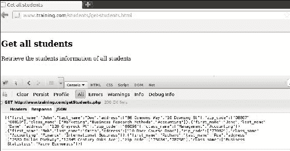
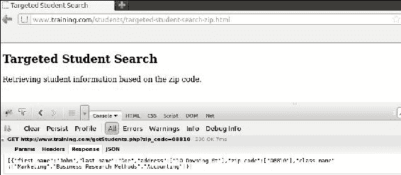
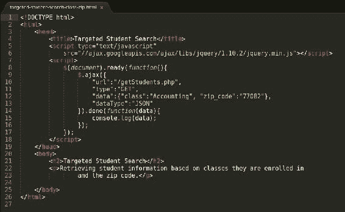
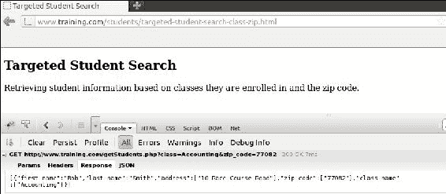
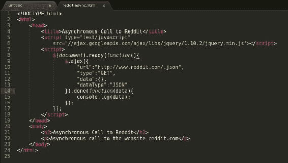

# 第五章。跨域异步请求

在前一章中，我们使用了 jQuery 的`getJSON`方法来摄取`students` JSON 提要；在本章中，我们将向前迈出一步，并将请求参数发送到服务器。数据馈送通常是大量可用的数据；此类提要中的数据通常是通用的，对于有针对性的搜索来说可能会被认为太重。例如，在`students` JSON 提要中，我们公开了所有可用的学生信息。对于正在寻找注册某些课程的学生或居住在给定邮政编码中的学生来雇佣他们作为实习生的数据供应商来说，这个提要将是通用的。开发团队构建**应用编程接口**或**应用接口**来为这些数据供应商提供多种定位搜索的方法是很常见的。这对于数据供应商和拥有信息的公司来说都是一个双赢的局面，因为数据供应商只获得他们正在寻找的信息，而数据供应商只发送请求的数据，从而节省了大量的带宽和服务器资源。

# 用 JSON 数据进行 GET 和 POST AJAX 调用

重要的是要明白同步和异步调用都是通过 HTTP 进行的，所以数据传输过程是一样的。将数据从客户端机器传输到服务器机器的流行方法是`GET`和`POST`。HTTP 中最常见的请求方式是`GET`。当客户端请求网页时，网页服务器使用网址来处理 HTTP 请求。附加到 URL 的任何其他参数都将作为从客户端发送到服务器的数据。因为参数是 URL 的一部分，所以明确区分何时使用和何时不使用`GET`请求方法很重要。`GET`方法应该用于传递幂等信息，如页码、链接地址或属于分页一部分的限制和偏移量。请记住，通过`GET`请求方法可以传输多少数据是有大小限制的。

`POST`请求方法是发送大数据时常用的方法，这种方法很重要。与`GET`方式不同，数据是通过 HTTP 消息体传输的；我们可以使用 Fiddler 等工具和浏览器中可用的开发人员工具来跟踪通过 HTTP 消息体发出的数据。与`GET`方法不同，通过`POST` 方法传递的数据不能被书签标记或缓存。`POST`方法通常用于在使用表单时发送数据。对于本章中的示例，让我们使用 jQuery 的`ajax`方法将数据以 JSON 格式发送到服务器。我们将使用修改后的`students`应用编程接口，在那里我们将能够查询完整的学生信息——他们居住的邮政编码、他们上的课等等——并使用组合搜索来查找居住在特定地区并正在上特定课的学生。我们的应用编程接口新增了一项功能，即通过`POST`请求添加学生；学生信息必须作为 JSON 对象发送。

### 注

这个 API 是用 PHP 和 MySQL 构建的。PHP 和 MySQL 文件将在代码包中的`scripts-chap5`文件夹中提供..

在我们开始构建脚本进行异步调用之前，让我们看看`students`应用编程接口提供的网址。第一个 API 调用将是通用搜索，它将检索数据库中所有学生的信息。

因为我们还没有开始我们的目标搜索，所以我们保留了这个网址作为通用搜索。现在让我们看看我们第一次有针对性搜索的网址——按邮政编码。这个 API 调用将返回所有居住在给定邮政编码区域的学生。

在本例中，网址将返回居住在邮政编码`08810`中的所有学生的信息。让我们将搜索标准从邮政编码切换到学生注册的班级。

在本例中，该网址将返回已注册该课程`Economics`的所有学生的信息。现在，我们有了通过邮政编码和类别来定位搜索的能力，让我们看看我们的应用编程接口中的另一个调用通过使用用户所在的邮政编码和他或她注册的类别来检索信息。

在本例中，对网址的调用将返回所有已注册课程`Accounting`并位于邮政编码`77082`中的学生的信息。

到目前为止，这些调用一直使用 HTTP `GET`方法将数据从客户端传输到服务器。我们的应用编程接口中的最后一次调用是由用于添加学生的 HTTP `POST`方法提供的。该呼叫需要大量的数据输入，因为用户可以有多个邮政编码和多个地址，并且可以注册多个课程。

由于这是一个 HTTP `POST`方法，所以传入的数据都不可见。让我们继续我们的脚本来访问这些调用；第一个脚本将是访问为所有学生提供信息的 API 调用。

以下是`get-students.html`的代码片段:

在这个调用中，我们从导入 jQuery 库开始；我们可以像页面上的 jQuery 一样开始使用`$`变量。我们从添加一个回调开始，当文档准备好的时候会触发这个回调。我们在这个例子中使用 `ajax`方法，因为它允许我们发出`GET`和`POST`请求，当需要时，我们可以修改`ajax`调用中的`datatype`属性，使`JSONP`到进行异步跨域调用。

### 注

当类型是 GET 时，没有必要明确提及，但是它可以帮助我们建立与代码的一致性。

在我们的`ajax`调用中，我们首先将`url`属性设置为指向我们的 API 调用的链接，以检索学生信息；我们指定这将通过 HTTP `GET`方法执行。我们设置的第四个属性是`dataType`属性；这用于提及我们期望返回的数据类型。当我们使用`students`提要时，我们必须将`dataType`属性设置为 JSON。重要的是要注意`done`回调，当服务器向我们的异步请求发回响应时会触发该回调。我们正在传递从服务器发送的数据作为响应，发起回调。

### 注

`done`同`readyState=4``request.status=200`；我们已经在[第 4 章](4.html "Chapter 4. AJAX Calls with JSON Data")、*使用 JSON 数据进行 AJAX 调用*中看到了这一点，同时使用 JavaScript 进行异步调用。

以下为输出:

在控制台窗口中，我们可以查看从服务器返回的 JSON 提要响应。这个 JSON 提要包含很多信息，因为它为所有学生获取数据。现在让我们根据邮政编码获取学生记录。在这个例子中，我们将使用`zip_code`参数，并将通过 HTTP `GET`方法向服务器异步传递一个值。这个应用编程接口调用将为希望搜索特定领域实习生的数据供应商服务。

在前面的例子中，我们从导入 jQuery 库开始，我们绑定了一个回调来准备当文档加载时触发的事件。需要注意的是，我们正在使用第 12 行的`data`属性发送邮政编码的键值对。

一旦调用被触发，我们将响应记录到控制台窗口。邮政编码`08810`匹配一个用户，学生信息通过 JSON 提要传回。有针对性的搜索帮助我们缩小结果的范围，从而为我们提供我们正在寻找的数据；下一个目标搜索将是使用学生注册的某个班级检索数据。

前面的例子和有邮政编码的定向搜索一样；这里我们用班级信息替换邮政编码信息。我们正在检索所有已经注册`Economics`的学生。

目标搜索返回那些已经注册了经济学课程的学生的信息。现在让我们将搜索的目标与类别和邮政编码结合起来。

在前面的例子中，我们添加类和邮政编码键值对，向服务器发送多个搜索参数。

该呼叫检索已注册`Accounting`课程并居住在邮政编码`77082`中的学生的学生信息。我们已经看到了通过 HTTP `GET`方法进行异步调用的多个例子；现在是时候将数据推送到服务器上，以便使用我们的 API 添加一名学生。我们将使用我们的`addUser`调用来动态添加一名学生。这有助于开发团队从外部资源将学生信息添加到我们的数据库中。例如，我们是一个学生信息聚合器，我们向多个数据供应商销售整合的学生信息。为了聚合所有这些信息，我们可能会通过蜘蛛来聚合信息，在蜘蛛中，脚本会访问网站并获取数据，或者外部资源，在外部资源中，数据是非结构化的。因此我们将构建我们的数据，并使用这个`addUser`应用编程接口调用将结构化的学生数据信息摄取到我们的数据存储中。同时，我们可以将这种方法展示给值得信赖的数据供应商，他们希望存储我们没有的学生信息，从而帮助他们将我们的数据存储作为单点数据位置。这对两家公司来说都是双赢的，因为我们可以获得更多的学生信息，我们的数据供应商可以将他们的学生信息存储在远程位置。现在我们来看看这个`addUser`岗位电话会怎么打。

在这次通话中，我们做了多件事；我们首先声明几个变量来保存本地数据。我们有保存学生名和姓的字符串值的局部变量，我们还有保存班级、邮政编码和地址数组的变量，因为超人必须在几分钟内到达多个位置。在我们的`ajax`调用中，首先要注意的变化是`type`属性；当我们推送大量用户数据时，使用 HTTP `POST`方法是很常见的。 `data`属性将使用为名字、姓氏、地址、邮政编码和类声明的本地变量。从 API 中，当用户成功添加到数据库中时，我们会发送一条成功消息作为响应，该消息将记录到我们的控制台窗口中。

现在，为了验证新学生已经添加到我们的数据库中，我们可以运行我们的`getStudents` API 调用来查看所有用户的列表。

`students` feed 最后一个学生是`Kent Clark`；测试我们的代码总是很重要的，以确保一切都像预期的那样运行。我们在处理动态数据的时候，保持数据的完整性是非常重要的。每当对用户或其依赖项执行 CRUD 操作时，必须通过查看检索到的数据和执行数据验证检查来验证该数据存储的数据完整性。

# 跨域 AJAX 调用的问题

我们到目前为止所做的所有异步调用都在同一个服务器上。在某些情况下，我们希望从不同的域加载数据，例如从其他 API 获取数据。服务器端程序被设计来处理这类调用；我们可以使用 cURL 对不同的域进行 HTTP 调用来获取这样的数据。这增加了我们对服务器端程序的依赖，因为我们必须调用我们的服务器，而服务器又会调用另一个域来获取数据，这些数据将返回给客户端程序。这可能看起来是一个微不足道的问题，但是我们正在给我们的 web 架构增加一个额外的层。为了避免进行服务器端调用，让我们试着看看是否可以对不同的域进行异步调用。对于这个例子，让我们使用 Reddit 的 JSON API 来获取数据。

这类似于我们之前为从`students`应用编程接口检索数据而进行的异步调用。重要的是要理解，在前面的案例中，我们不必提及整个网址，因为我们是在向同一个域进行呼叫。

Reddit 网站提供了一个优秀的 JSON 应用编程接口，我们可以将`.json`附加到网址上，并获得聚合网页的 JSON 提要，因为该网页是 Reddit 的一部分。让我们看一下跨域进行异步调用时生成的输出。

在我们的异步调用中，如果请求成功，数据将被记录到控制台窗口，但是我们在控制台窗口中看到一个错误。错误说明`XMLHTTPRequest`对象无法加载我们提供的网址，因为它不是来自我们的[www.training.com](http://www.training.com)域。 **同域策略**是网络浏览器遵循的一种安全措施，目的是防止一个域访问另一个域的信息。Web 应用使用 cookies 来存储关于用户会话的基本信息，以便在用户再次请求相同的网页或请求同一域上的不同网页时提供直观的用户体验。为了防止外部网站窃取这些信息，网络浏览器遵循**相同来源政策**。

同一个域策略在传入的请求中寻找三样东西；它们是主机、端口和协议。如果它们中的任何一个与现有域不同，请求将不会完成，并返回跨域错误。

<colgroup class="calibre102"><col class="calibre103"> <col class="calibre103"></colgroup> 
| 

http://www.training.com 的变体

 | 

结果

 |
| --- | --- |
| `http://www.training.com/index.php` | 及格 |
| `https://www.training.com/index.php` | 失败(协议) |
| `http://www.training:81.com/index.php` | 失败(端口) |
| `http://test.training.com.com/index.php` | 失败(主机) |
| `http://www.differentsite.com/index.php` | 失败(主机) |

# JSONP 简介

为了绕开相同的原点策略，我们将使用 JSONP，也就是带有 Padding 的 JSON。同一起源策略下的一个例外是`<script>`标签，这样脚本可以跨域传递。JSONP 使用这个异常，通过添加填充使 JSON 对象看起来像一个脚本，从而将数据作为脚本跨域传递。在 JavaScript 中，当调用带有参数的函数时，我们调用该函数并添加一个参数。使用 JSONP，我们将 JSON 提要作为参数传递给函数；因此，我们将对象填充到函数回调中。这个函数已经填充了 JSON 提要，必须在客户端使用它来检索 JSON 提要。让我们快速查看一个 JSONP 示例。

在这个例子中，我们将`students`对象填充到`myCallback`函数中，为了检索`students`对象，我们必须重用`myCallback` 函数。现在我们了解了 JSONP 是如何工作的，让我们使用 Reddit 的 JSON API 来获取数据。我们需要对我们访问数据的方式做一个改变——我们需要找到一种方法将提要填充到一个可以在客户端使用的回调中。Reddit 网站提供了一个`jsonp` `GET`参数，该参数将以的名称作为回调来提供数据。

# 实现 JSONP

我们使用与之前相同的网址来获取数据，但是我们添加了`jsonp`参数并将其设置为`getRedditData`；需要注意的是，提要现在被填充到我们的回调`getRedditData`中。现在，让我们替换前面脚本中的 URL 属性，创建一个新的脚本来获取 JSON 提要。

修改了`url`、`dataType`等几个属性，增加了`contentType`、`jsonpCallback`等几个新属性。我们已经讨论了`url`属性的变化，让我们看看其他属性。

早先，`dataType`属性被设置为`json`，因为传入的提要是类型`json`，但是现在 JSON 提要被填充到回调中，并且它必须被切换，以便浏览器期望回调而不是 JSON 本身。新增的属性有`contentType`和`jsonpCallback`；属性`contentType`指定发送到网络服务器的内容类型。`jsonpCallback`取回调函数的名称，JSON 提要已经填充到该回调函数中。

当脚本被激发时，来自 `getRedditData`回调的数据已经被检索并被传递到`success`属性，该属性将我们的 JSON 对象记录到控制台窗口上。需要注意的一个重要事实是，JSONP 调用是脚本调用，而不是 XHR 请求，因此 JSONP 调用将在`JS`或`<scripts>`选项卡中可用，而不在控制台窗口的`XHR`选项卡中可用。

# 总结

HTTP `GET`和`POST`请求方法是最流行的两种 HTTP 方法，用于将数据从客户端传输到服务器。本章深入了解了`GET`和`POST`请求方法是如何使用异步请求传输数据的。然后，我们继续研究跨域异步请求的问题；我们使用`<script>`标签的异常来执行我们的 JSONP 异步脚本调用，以从不同的域中获取数据。在下一章中，我们将构建我们的照片库应用。