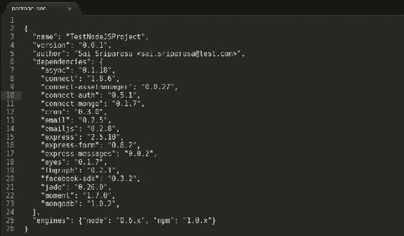
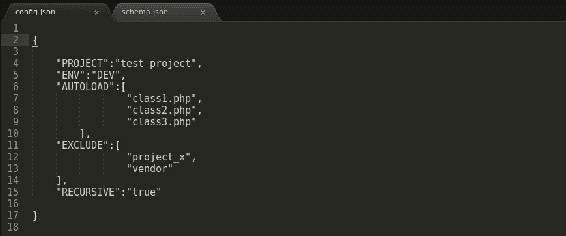

# 第七章。JSON 的替代实现

在到目前为止的章节中，我们已经使用 JSON 作为一种 HTTP 数据交换格式；现在让我们看看使用 JSON 的流行替代方法。在过去的几年里，所有编程和脚本语言的软件模块和包的数量都有了急剧的增长。众包软件开发一直在向上攀升。基于网络的托管服务，如 SourceForge、Pastebin 和 GitHub，在过去几年里越来越受欢迎，它们为开发人员打开了合作的大门，并为社区做出了贡献。这些模块和包可以独立集成，也可以作为现有软件框架的从属程序。这种行为在开源社区中已经成为一种常见的做法，在开源社区中，开发人员可以独立工作，贡献软件包来增强他们正在使用的框架。

脚本语言如 PHP、Python 和 JavaScript 有大量贡献的软件包和模块。这里的优势是使用预构建的软件包，该软件包提供了一些现成的功能，并且已经过社区的大量测试。将单个框架或多个框架引入软件项目的另一面是必须了解这些框架是如何加载到项目中的，如何从当前项目的不同部分访问它们，这些框架是否有任何依赖关系，最后，它们如何影响整个项目。这些问题可以通过使用**依赖关系管理器**来解决。

依赖管理器是一个软件程序，它跟踪依赖程序运行所需的所有必要的基础程序。软件开发生命周期中的一个常见实践是通过使用单元测试框架来执行单元测试；反过来，单元测试框架可能需要安装一些基础库，或者可能有一些设置来启用该框架的使用。

这些操作通常通过编写快速脚本来处理，但是随着项目越来越大，依赖关系也会随着项目一起增长。同样，跟踪这些变化并确保从事项目的不同团队获得这些更新是一项艰巨的任务，这是通过脚本来完成的。通过引入依赖关系管理器，我们将自动化整个过程，这增加了一致性并节省了时间。

# 依赖关系管理

依赖管理经常有点不稳定，对于新来的开发人员来说，在他们的项目中添加新的框架，设置他们的项目，并让他们运行可能是令人生畏的。像 PHP 的 Composer 这样的依赖管理器解决了这个问题。它被认为是“所有项目之间的粘合剂”，这是有充分理由的。Composer 使用 JSON 来跟踪给定项目的所有依赖关系。Composer 的主要工作是从远程位置下载库并将其存储在本地。为了通知 Composer 我们需要什么库，我们需要设置 `composer.json`文件。该文件跟踪所有特定的库、它们的版本以及给定库应该部署到的环境。例如，一个单元测试框架库永远不应该投入生产。有一个老公司的实例，我的一个同事在随机测试我们的生产实例，通过运行单元测试删除了整个用户表；我们必须从前一天晚上的数据库备份中恢复整个用户表。

让我们快速深入了解一下 JSON 是如何被用来处理依赖关系管理的。

composer.json

在`composer.json`文件中，我们增加了两个要求，安装特定版本的 PHP 和 PHPUnit。一旦文件被添加到项目中，我们可以使用 Composer 的`install`命令来安装这些依赖项。Composer还附带了一个`update`命令，用于处理给定包的任何更新。

### 注

关于作曲家的更多信息，请访问[http://www.getcomposer.org](http://www.getcomposer.org)。

`Node.js`是一个流行的软件平台，使用 JSON 数据格式来跟踪依赖关系。 **节点打包模块** ( **NPM** )是开发人员用于将外部模块安装和集成到其代码中的包管理器。对于每个`Node.js`项目，文档根中都有一个`package.json`文件，用于跟踪所有元数据，例如项目名称、作者姓名、版本号、运行该项目所需的模块以及运行项目所需的底层守护程序或引擎。让我们看一下我的一个`Node.js`项目中的一个示例`package.json`文件。

package.json

`package.json`文件是一个大的 JSON 对象，它跟踪元数据，例如项目的名称、作者的详细信息和所需的模块。

### 注

更多关于 NPM 的信息，请访问[https://www.npmjs.org](https://www.npmjs.org)。

# 用于存储元数据的 JSON

与依赖管理器相同，JSON 也用于存储软件项目的元数据。在 JSON 流行之前，配置和元数据要么存储在文本文件中，要么存储在特定于语言的文件中，例如 PHP 的`config.php`、Python 的`config.py`和 JavaScript 的`config.js`。所有这些现在都可以被一个独立于语言的`config.json`文件所取代；使用非 JavaScript 库的 JSON 库来解析它。让我们快速看一个例子`config.json`文件:

康菲格. json

在`config.json`文件中，我们将元数据存储为一个 JSON 对象。我们正在指定重要信息，例如项目名称、项目环境(根据文件所在的服务器而有所不同)、在引导应用程序期间必须自动加载的任何类，以及我们想要排除的任何类或文件夹。最后，使用 `RECURSIVE`键，我们还指定有文件夹，那些文件夹有文件。

### 注

引导是应用程序的启动过程，在这个过程中，我们准备应用程序来服务于它的目的。

一旦我们有了 `config.json`文件，我们就可以使用 Python 中的`json.loads`方法或者 PHP 中的 `json_decode`方法来解析配置对象以检索数据。JSON 对象也可以用来存储数据库模式；这有助于开发团队的其他成员在团队中的一名开发人员对数据库进行更改时更新他们的数据库模式。处理这个问题的一个聪明的方法是在这个`schema.json`文件上写一个触发器，如果这个文件有更新，数据库中的模式必须通过数据库迁移脚本更新以反映新的变化。让我们快速看一个例子 `schema.json`文件。

schema.json

在`schema.json`示例中，我们正在构建将存储数据库模式信息的模式 JSON 对象。`client`是我们模式中表的名称。`client`表有三列—客户端的标识、名称和状态，即客户端是启用还是禁用。每个列都包含提供模式信息的列 JSON 对象，例如列的数据类型和大小，它是有默认值还是主键约束。

# 与 YAML 的比较

YAML 是另一种软件语言无关的数据交换格式，正在慢慢普及。**【YAML】**是 **YAML 不是标记语言**的递归首字母缩写，通常用于存储配置、模式和属性等元数据。YAML 被认为是人类可读的数据序列化标准，它依赖于空格、定位和行终止符的简单字符，类似于流行的脚本语言，如 Ruby 和 Python。YAML 对元素之间的间距很挑剔，而且不太友好。与 JSON 类似，YAML 键/值对用冒号分隔。与文本格式类似，连字符用于指示列表项，与 JSON 不同，JSON 将列表项放在数组或子对象中。由于 YAML 是软件语言不可知的，我们需要解析器来理解文件中的内容。这种解析器适用于大多数流行的语言，如 PHP、Python、C++、Ruby 和 JavaScript。让我们在 YAML 建立文件，了解 YAML 是什么。

配置. yaml

类似于我们的配置 JSON 对象，YAML 文件包含了所有的数据；不同之处在于数据是如何排列的——作为项目列表——以及如何使用间距和定位来排列数据列表。互联网上有多种 YAML 资源可用于验证、序列化和反序列化 YAML 数据。

### 注

更多关于 YAML 的信息，请访问[http://www.yaml.org](http://www.yaml.org)，以 YAML 格式表示。

# 总结

JSON 正在迅速成为互联网上最流行的数据交换格式，但它并不限于数据交换。我们还可以使用 JSON 来存储依赖关系管理器、包管理器、配置管理器和模式数据存储的元数据。我们被介绍到 YAML，这被认为是 JSON 的一个替代品。在下一章中，我们将看看可以用来调试、验证和格式化 JSON 的不同资源。