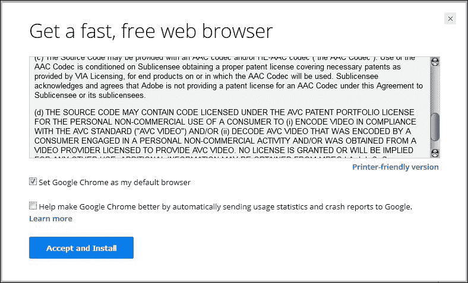
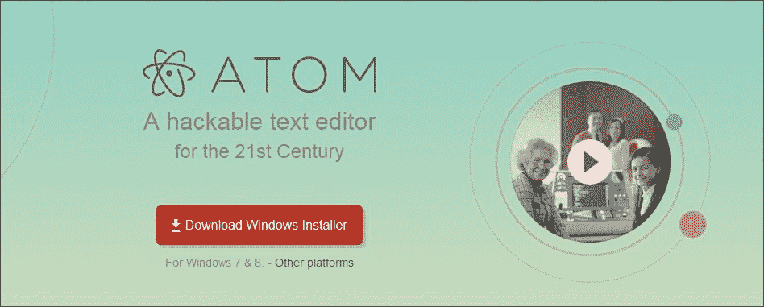
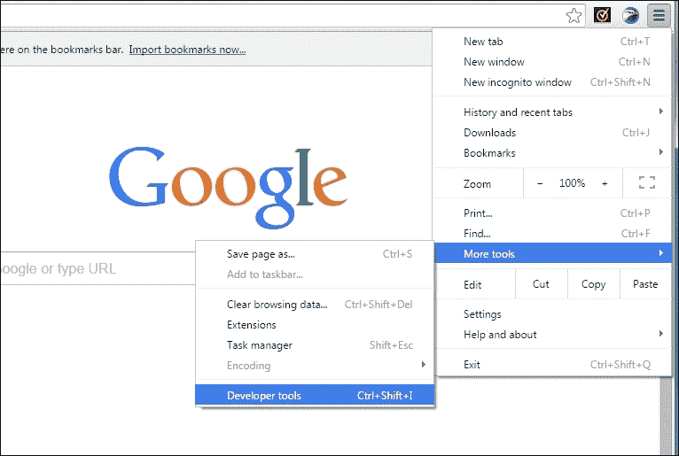
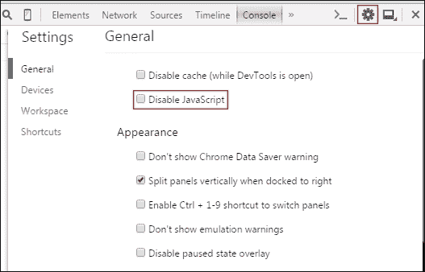

# 一、在控制台中探索 JavaScript

在我们开始讨论代码行、对象、变量等等之前，我们需要知道什么是 JavaScript。JavaScript 是一种编程语言，用于向网页添加交互活动和构建 web 应用。静态网站现在不是很流行，因此，我们使用 JavaScript 使我们的网站具有交互性。

有些人也称它为脚本语言，因为它是一种简单的语言，不像其他语言那样需要编译器。JavaScript 不是作为一种通用编程语言设计的，它是为了操纵网页而设计的。您可以使用 JavaScript 编写桌面应用。JavaScript 还可以访问您机器的硬件。你可以试着用一个**软件开发工具包** ( **软件开发工具包**)制作一个桌面应用，比如手机版的 PhoneGap 或者微软桌面版的 app SDK。JavaScript 代码在网页上被解释，然后由浏览器运行。任何现代的互联网浏览器，比如火狐、Safari、谷歌 Chrome、UC 浏览器、Opera 等等，都支持 JavaScript。

### 注

一个*编译器*是一个处理代码并将其转换成机器语言的计算机程序。使网站*互动*意味着在网站上添加用户控制的功能。比如网上报名表格，网上计算器等等。*静态*网站有固定的对象和内容，向所有访问者显示相同的信息。

基本上，JavaScript 包含在一个 HTML 页面上，或者写在一个扩展名为`.js`的单独文件上。如果你对 HTML 一无所知，不要担心，因为你会在[第三章](03.html#PNV62-71a55ef7ad8b4ea3bacc9276ca4546aa "Chapter 3. Introducing HTML and CSS")、*介绍 HTML 和 CSS* 中了解到。那么，在哪里可以使用 JavaScript 呢？

答案很简单，你可以做到以下几点:

*   您可以创建活动用户界面。
*   你可以控制网络浏览器。
*   您可以验证用户输入(如果输入错误)。
*   您可以创建可在浏览器上弹出的自定义网页，保存信息或图像。
*   无需**通用网关接口** ( **CGI** )即可创建动态页面。CGI 是网络服务器用来处理浏览器信息的。

### 注

大家要记住的是 JavaScript 不是 Java，不是 Sun 微系统开发的编程语言。

纵观本书，我们将使用**谷歌 Chrome** 作为默认浏览器，**Atom**T5 作为文本编辑器。

如果您的计算机上尚未安装这两个软件，则有必要下载并安装它们。

我们将使用 Atom 文本编辑器，因为它是一个跨平台编辑器，具有内置的包管理器，执行智能自动完成，并且具有许多其他优势。

# 安装谷歌 Chrome

要安装谷歌 Chrome，前往[http://www.google.com/chrome](http://www.google.com/chrome)点击**立即下载**，如下图截图所示:


然后按**接受并安装**按钮，如下图截图所示:



安装将根据您的网络速度和机器的硬件配置完成。

### 注

如果不想使用谷歌 Chrome 作为默认浏览器，取消勾选**设置谷歌 Chrome 为我的默认浏览器**。

# 安装原子

安装 Atom 文本编辑器，按照https://atom.io/链接，按下载 Windows Installer ，如下图截图所示:



一个名为`AtomSetup.exe`的文件将开始下载。

点击`AtomSetup.exe`文件上的开始安装 Atom。

### 类型

请确保在安装时授予管理权限，以获得更好的性能。

安装完成后，Atom 将自动启动。

如果您在另一个平台上，请使用**其他平台**链接:

*   如果你是 Mac 用户，去[https://github.com/atom/atom/releases/latest](https://github.com/atom/atom/releases/latest)链接下载`atom-X.X.X-full.nupkg`文件，其中`X.X.X`是 Atom 的版本号。双击文件进行安装。
*   If you are an Ubuntu user, you can follow the [https://github.com/atom/atom/releases/latest](https://github.com/atom/atom/releases/latest) link and download the `atom-amd64.deb` file. After downloading it, launch your **Terminal** in the same folder, where you placed the file after downloading it. Then, write the following code:

    ```js
    sudo dpkg --install atom-amd64.deb

    ```

    您可能需要管理密码来安装它。安装完成后，您可以通过输入`Atom`并按*进入*从终端运行 Atom。

# Chrome 开发者工具

我们来看看用于 JavaScript 的 **Chrome 开发者工具**，特别是*控制台*。由于谷歌 Chrome 已经下载安装在你的机器上，打开谷歌 Chrome 浏览器，进入菜单(右上角)，悬停在**更多工具**上，选择**开发者工具**，如下图截图所示:



您将看到以下工具:

*   **元素**
*   **网络**
*   **来源**
*   **时间线**
*   **轮廓**
*   **资源**
*   **审核**
*   **控制台**

# 我们的第一个节目

现在，让我们检查 JavaScript 是否在您的机器上工作。

从工具中，选择**控制台**。如果找不到**控制台**，点击 **> >** 符号，如下图:


打开控制台后，输入以下代码，然后在键盘上点击*进入*:

```js
document.write("Hello World");

```

如果您可以在左侧面板上看到如下所示的输出，那么您已经在浏览器上成功配置了 JavaScript:


您将看到如下输出:

**你好世界**

恭喜你！

### 注

**下载示例代码**

你可以下载你在[http://www.packtpub.com](http://www.packtpub.com)账户购买的所有 Packt 书籍的示例代码文件。如果您在其他地方购买了这本书，您可以访问[http://www.packtpub.com/support](http://www.packtpub.com/support)并注册，以便将文件直接通过电子邮件发送给您。

如果您看不到文本，请检查您的代码或安装具有管理权限的谷歌浏览器。

你也可以点击控制台的齿轮按钮。检查**禁用 JavaScript** 是否未选中:



您也可以使用这个工具调试您的 JavaScript 代码。

如果你打错了什么；考虑到您忘记了`Hello World`字符串的逗号，您将得到以下错误:


为了加快编写代码的速度，您可以学习一些控制台和 Atom 文本编辑器的键盘快捷键。

下面是控制台的几个键盘快捷键:

*   *Ctrl* + *L* :清除控制台
*   *标签*:自动完成常用前缀
*   右箭头:接受建议
*   *Ctrl* + *U* :清除控制台提示
*   向上/向下:下一行/上一行
*   *进入*:执行命令

以下是 Atom 文本编辑器的几个键盘快捷键:

*   *Ctrl* + *B* :浏览打开文件列表
*   #T0] Ctrl + T1] + t2] alt + T3] • *R = T5] ： 重新加载原子*
*   *Ctrl*+*Shift*+*L*:改变语法高亮
*   *Alt*+*Shift*+*S*:显示可用的代码片段
*   *Ctrl*+*Shift*+*M*:降价预览
*   *Ctrl*+*Alt*+*I*:切换开发工具
*   *Ctrl* + *N* :新文件
*   *Ctrl*+*Shift*+*N*:新窗口
*   *Ctrl* + *P* :打开文件(键入名称进行搜索)
*   *Ctrl* + *O* :打开文件
*   *Ctrl*+*Shift*+*O*:打开文件夹
*   *Ctrl* + *S* :保存
*   *Ctrl*+*Shift*+*S*:另存为
*   *Ctrl* + *W* :关闭标签
*   *Ctrl*+*Shift*+*W*:关窗
*   *Ctrl* + *G* :上线
*   *Ctrl* + *L* :选择线路
*   *Ctrl*+*Shift*+*D*:复线
*   *Ctrl*+*Shift*+*K*:删行
*   *Ctrl* +上/下:上移/下移一行
*   *Ctrl* + */* :切换评论行
*   *Ctrl* + *进入*:下方新行
*   *Ctrl* + *[* / *]* :缩进/取消缩进所选行
*   *Ctrl* + *J* :连线
*   *Ctrl* + *Alt* + *。*:完整支架
*   *Ctrl* + *M* :转到匹配括号
*   *Ctrl*+*Alt*+*M*:选择匹配括号内的代码
*   *Ctrl*+*Alt*+*/*:折叠/展开码
*   *Ctrl*+*Alt*+*F*:折叠选中代码
*   *Ctrl*+*Alt*+*[*/*]*:折叠/展开所有代码
*   *Ctrl* + *F* :在当前文件中查找
*   *Ctrl*+*Shift*+*F*:在项目中查找
*   *F3* :查找下一个
*   *Shift* + *F3* :查找上一个
*   *Ctrl* + *进入*:全部替换
*   *Ctrl*+*Alt*+*/*:搜索时使用 Regex
*   *Ctrl*+*Shift*+*=*/*-*:增加/减少文本大小
*   *Ctrl* + *0* (零):重置文本大小
*   *F11* :全屏切换

# 我们为什么要使用 Chrome 开发者工具？

以下是 Chrome 开发工具的使用要点:

*   容易看到错误
*   使用行号很容易编辑/调试代码
*   实时输出(无需刷新页面)

# 我们为什么用 Atom 作为文本编辑器？

以下是使用 Atom 作为文本编辑器的要点:

*   可黑客性和可用性的零妥协组合
*   一个打开的源文本编辑器
*   每个 Atom 窗口本质上都是一个本地呈现的网页

# 运动

为了提高你的 JavaScript 知识，写一个程序来打印你的名字。

# 总结

在这一章中，我们看到了如何下载谷歌 Chrome 和 Atom，并安装它们。

您学习了如何使用 Chrome 开发工具(**控制台**)编写第一个代码。您还学习了一些 Chrome 开发工具和 Atom 文本编辑器的键盘快捷键。

您还学习了什么是 JavaScript，为什么学习 JavaScript 很重要，以及 JavaScript 与其他语言有何不同。

我们现在可以进入 JavaScript 的世界了。

你的旅程从[第二章](02.html#KVCC2-71a55ef7ad8b4ea3bacc9276ca4546aa "Chapter 2. Solving Problems Using JavaScript")、*用 JavaScript* 解决问题开始。