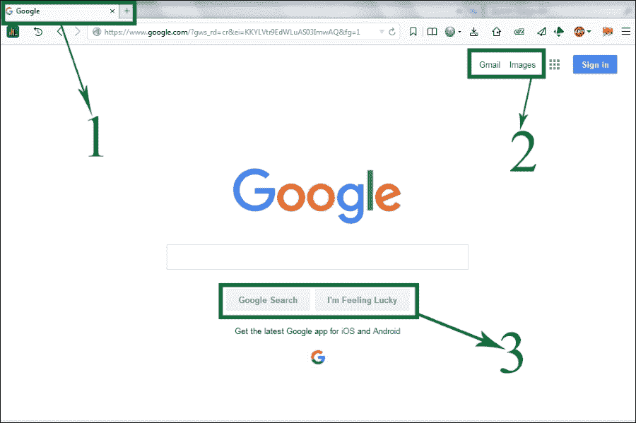
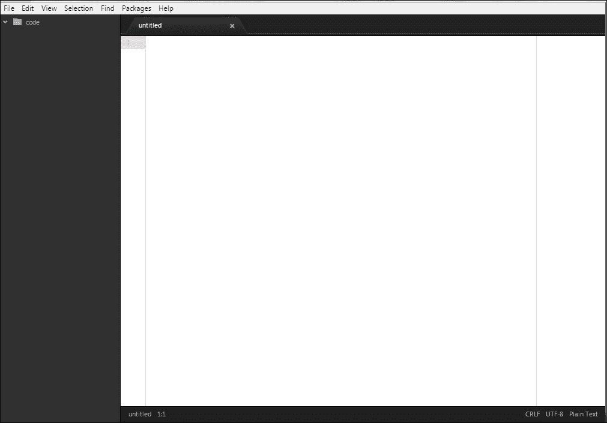
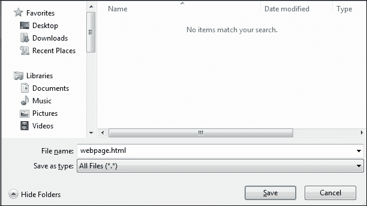
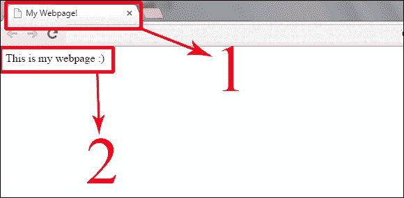
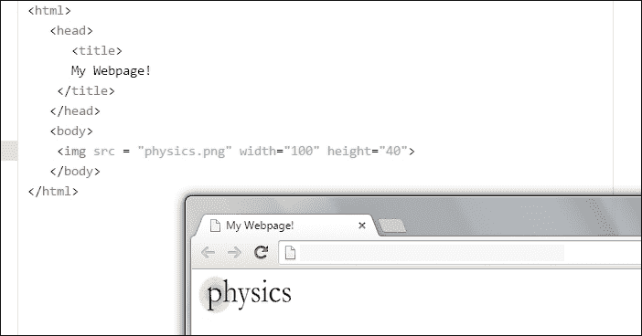
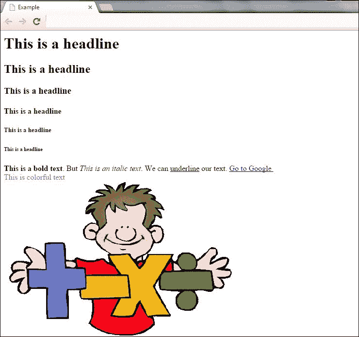
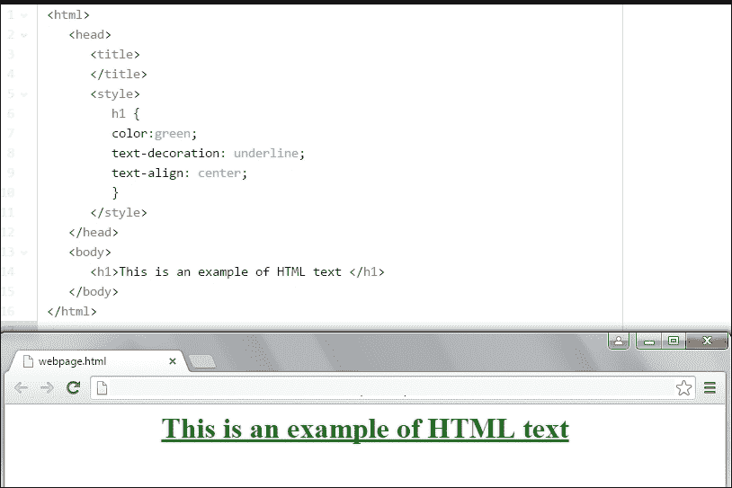

# 三、HTML 和 CSS 简介

在前一章中，您已经学习了 JavaScript 语法、算术运算符和注释。我们使用控制台来达到这些目的。现在，你学习一些有趣的东西怎么样，这将为你成为一名优秀的 JavaScript 程序员铺平道路？在这一章，我们将学习关于**超文本标记语言** ( **HTML** )语法、**层叠样式表** ( **CSS** )语法，以及如何在 HTML 页面中使用 JavaScript。

HTML 是网页的源代码。您在网络浏览器上加载的所有网页都是用 HTML 构建的。到任意一个网站(例如[https://www.google.com](https://www.google.com))按下键盘上的 *Ctrl* + *U* (在 Mac 上，点击*命令* + *U* ，就会得到网页的源代码。这适用于所有现代网络浏览器，如火狐、谷歌 Chrome、UC 等。

您将看到的整个代码都是 HTML 格式的。您可能还会发现几行 JavaScript 代码。因此，为了理解网页的结构(页面背后的代码)，您需要了解 HTML。这是网络上最简单的语言之一。

# HTML

HTML 是一种标记语言。这是什么意思？标记语言使用格式、样式和布局设计的特定代码来处理和呈现文本。标记语言有很多(例如，**商业叙事标记语言** ( **BNML** )，**冷融合标记语言** ( **CFML** )，**歌剧** **二进制标记语言** ( **OBML** )，**系统**T20】生物标记语言 ( **SBML** )然而在现代网页中，我们使用的是 HTML。HTML 基于**标准通用标记语言** ( **SGML** )。SGML 基本上是用来设计公文纸的。

### 注

有许多 HTML 版本。HTML 5 是最新版本。在本书中，我们将使用最新版本的 HTML。

在你开始学习 HTML 之前，让我请你想一想你最喜欢的网站。网站包含什么？几个网页？您可能会在每个网页上看到一些文本、一些图像、一个或两个文本字段、按钮以及更多元素。这些元素都是由 HTML 格式化的。

让我给你介绍一个网页。在你的网络浏览器上，进入[https://www.google.com](https://www.google.com)。您将看到如下图所示的页面:



您将在浏览器顶部看到的第一件事是网页的标题。让我们观察一下刚刚加载的页面:

*   这里标记的框 **1** 是我们加载的网页标题。
*   第二个框 **2** 表示一些链接或文字。
*   页面中间的**谷歌**这个词是一个图像。
*   第三个框 **3** 由两个按钮组成。
*   你能告诉我页面右上方的**签到**是什么吗？是的，它是一个按钮。

让我们演示一下 HTML 的基本结构。术语*标签*将被频繁使用来展示结构。

HTML 标记只不过是小于号(`<`)和大于号(`>`)之间的几个预定义单词。因此，标签的结构是`<WORD>`，其中`WORD`是互联网浏览器识别的预定义文本。这种类型的标记称为开放标记。还有另一种类型的标签，称为结束标签。紧密标签的结构类似于`</WORD>`。你只需要在小于号后面加一个正斜杠。

在这一节之后，您将能够使用 HTML 制作自己的带有一些文本的网页。HTML 页面的结构类似于下图。这张图片有八个标签。让我们介绍一下所有这些标签及其活动，如下图所示:


*   **1** :标签`<html>`为开放式标签，在第 **15** 行与`</html>`标签闭合。
    *   这些标签告诉您的互联网浏览器，这两个标签中的所有文本和脚本都是 HTML 文档。
*   **2** :这是`<head>`标签，是开放式标签，在 **7** 线与`</head>`标签闭合。
    *   这些标签包含网页的标题、脚本、样式和元数据。
*   **3** :这是`<title>`标签，以`</title>`标签在 **4** 线结束。
    *   这个标签包含网页的标题。上一张图片的标题是**谷歌**。要在网络浏览器上看到这一点，您需要键入以下内容:

        ```js
        <title> Google </title>
        ```

*   **4** :这是`<title>`标签的关闭标签。
*   **5** :这是`<head>`标签的结束标签。
*   **6**: This is the `<body>` tag, and closes at line **13** with the `</body>` tag.

    你在网页上看到的一切都写在这两个标签之间。每个元素、图像、链接等都在这里格式化。这是一个网页。在浏览器上，您需要键入以下内容:

    ```js
    <body>
    This is a web page.
    </body>
    ```

*   **7** :这里关闭`</body>`标签。
*   **8** :这里关闭`</html>`标签。

## 你的第一个网页

你刚刚学习了一个 HTML 页面的八个基本标签。现在，您可以制作自己的网页。怎么做？为什么不和我一起试试？

1.  打开你的文本编辑器(你已经在本书的[第 1 章](01.html#DB7S1-71a55ef7ad8b4ea3bacc9276ca4546aa "Chapter 1. Exploring JavaScript in the Console")、*控制台*中安装了 Atom 探索 JavaScript)。
2.  Press *Ctrl* + *N*, which will open a new `untitled` file as shown in the following image:

    

3.  在空白页上输入以下 HTML 代码:

    ```js
    <html>
      <head>
        <title>
          My Webpage!
        </title>
      </head>
      <body>
        This is my webpage :)
      </body>
    </html>
    ```

4.  Then, press *Ctrl* + *Shift* + *S*, which will tell you to save your code somewhere on your computer:

    

5.  Type a suitable name on the **File name:** field. I would like to name my HTML file `webpage`, therefore, I typed `webpage.html`. You may be wondering why I added an extension (`.html`).

    ### 注

    由于这是一个 HTML 文档，你需要在你给你的网页起的名字后面加上`.html`或`.htm`。`.htm`分机是`.html`的一种旧形式。文件扩展名仅限于三个字符，因此，人们使用了`.htm`而不是`.html`。也可以使用`.htm`。

6.  Press the **Save** button. This will create an HTML document on your computer. Go to the directory, where you just have saved your HTML file.

    ### 注

    记住，你可以给你的网页起任何名字。但是，此名称在您的浏览器上不可见。这不是你网页的标题。最好不要在网页名称中保留空格。比如你想给你的 HTML 文件命名`This is my first webpage.html`。您的计算机在互联网浏览器上显示结果不会有问题；但是，当您的网站位于服务器上时，此名称可能会遇到问题。因此，我建议您在需要添加空格的地方保留一个下划线(`_`)，如`This_is_my_first_webpage.html`。

7.  You will find a file similar to the following image:

    

8.  Now, double-click on the file. You will see your first web page on the Internet browser!

    

您在`<title>`和`</title>`标签之间键入了`My Webpage!`，这就是为什么您的浏览器在第一个选择框 **1** 中显示了这一点。您在`<body>`和`</body>`标签之间键入了`This is my webpage :)`。因此，您可以在浏览器的第二个选择框 **2** 中看到文本。

恭喜你！你创建了你的第一个网页！

### 注

您可以通过右键单击文件并选择**用原子打开**来编辑您的代码和`webpage.html`文件的其他文本。在浏览器中重新打开文件之前，您必须保存( *Ctrl* + *S* )您的代码和文本。

## 更多 HTML 标签

有个 HTML 标签来格式化你网页的文本和对象。我们现在研究几个怎么样？

<colgroup class="calibre16"><col class="calibre17"> <col class="calibre17"> <col class="calibre17"></colgroup> 
| 

描述

 | 

带示例的语法

 | 

浏览器上的结果

 |
| --- | --- | --- |
| 粗体文本 | `<b> This is bold </b>` | **这是加粗** |
| 斜体文本 | `<i> This is italic </i>` | *这是斜体* |
| 带下划线的文本 | `<u> Underline Text </u>` |  |
| 删除的文本 | `<del> Delete me </del>` |  |
| 下标文本 | `CO<sub>2</sub>` | 二氧化碳 |
| 上标 | `3x10<sup>8</sup>` | 3x108 |
| 最大标题 | `<h1> Hi Kids! </h1>` |  |
| 最小的标题 | `<h6> Hi Kids </h6>` |  |
| 段落文本 | `<p>This is a paragraph </p>` | 这是一个段落 |
| 断开标签 | `This <br>is <br>a break;` | 这是一次休息； |

### 注

有六个标题标签(`<h1>`到`<h6>`)。如果需要，可以为文本添加多个标签。例如:`<b><i><u> JavaScript </b></i></u>`将有以下输出:。关闭标签没有特定的顺序。最佳实践是遵循开放标签的顺序。

## 给 HTML 文本着色

要给 HTML 文本上色，我们可以键入以下内容:

```js
<font color = "Green"> I am green </font>
```

您可以在两个逗号(`" "`)之间键入任何标准颜色名称。您也可以使用十六进制颜色代码，如下所示:

```js
<font color = "#32CD32"> I am green </font>
```

这里，`32CD32`是绿色的十六进制代码。请看下图。左边是代码，我们使用了颜色名称和十六进制代码。在右边，我们得到了浏览器的输出:


### 注

十六进制色码由六位数字组成(是十六进制数)。它以磅符号或散列符号(`#`)开头，我们将六位十六进制数放在它后面。十六进制数表示红色、蓝色和绿色的数量。每两个数字代表`00`到`FF`(十六进制数)。在示例中，我们使用`#32CD32`表示绿色。`32`、`CD`、`32`为红、蓝、绿的量；分别；十六进制。

如果你不知道十六进制数是什么，记得我们用十进制数，其中用了 10 位数字(0，1，2，3，4，5，6，7，8，9)。但是，在十六进制数字中，我们使用 16 位数字(0、1、2、3、4、5、6、7、8、9、A、B、C、D、E 和 F)。

我会推荐你使用这个网站([http://html-color-codes.info/](http://html-color-codes.info/))来获取你喜欢的颜色的十六进制代码，而不用考虑十六进制代码。

## 链接 HTML 文本

要超链接文本，我们使用如下锚点标签:

```js
<a href = "http://www.google.com"> Go to Google </a>
```

这个代码的输出将是一个链接。如果你点击链接，它会把你发送到我们在引号之间使用的网址(这里，[http://www.google.com](http://www.google.com))。

如果您想在浏览器的新选项卡中打开链接，您需要添加一个目标，如下所示:

```js
<a href = "http://google.com" target = "_blank" > Go to Google </a>
```

这里，`target = "_blank"`是一个属性，告诉你的浏览器在一个新的选项卡中打开链接。几乎没有更多属性。你可以在家试试，让我们知道你在浏览器上看到了什么。

其他属性为`_parent`、`_self`、`_top`。下图中的代码具有`_blank`属性。它在一个新标签中打开了[http://google.com](http://google.com)。我建议您找出其他属性的作用:


## 插入图像

在一个 HTML 文档上插入一个图像是非常容易的。你只需要找到图像文件扩展名。我们用来插入图像的标签如下所示:

```js

```

`src`属性是你图像的来源。如果您的图像放在 HTML 文件的同一个目录中，您就不必编写整个文件源。在本书中，我们将把我们的图像文件保存在同一个目录中，在那里我们保存我们的 HTML 文件。

假设我在保存 HTML 文档的同一个文件夹中有一个图像。图像名称为`physics`，扩展名为`.png`。现在，要在 HTML 文档上添加这个，我需要添加以下代码:

```js

```


### 注

我们在一个 HTML 文档中使用三种类型的图像。**便携式网络图形** ( **PNG** )、**图形交换格式** ( **GIF** )和**联合摄影专家组** ( **JPG** 或 **JPEG** )。要找到您的图像的扩展名，右键单击您的图像，转到**属性**，然后单击**详细信息**选项卡向下滚动，直到找到**名称**字段。您将找到扩展名为的图像名称。根据您的操作系统，您的计算机上的过程可能会有所不同。

如果要设置图像的高度和宽度，需要使用两个属性，如下图所示:

```js
< img src = "physics.png" width="100" height="40">
```

这里，`100`和`40`是图像的像素。在 HTML 的早期版本中，它被定义为像素或百分比。

### 注

像素是图像的最小单位。如果你想在不同的屏幕尺寸上看到相同比例的图像，使用百分比(`%`)更好，否则，你可以使用像素(`px`)单位。

输出如下所示:



还有更多的 HTML 标签；但是，我们已经介绍了大多数用于构建网页的标签。你能想象以下代码的输出吗？

```js
<html>
  <head>
    <title>
      Example
    </title>
  </head>
  <body>
    <h1> This is a headline </h1>
    <h2> This is a headline </h2>
    <h3> This is a headline </h3>
    <h4> This is a headline </h4>
    <h5> This is a headline </h5>
    <h6> This is a headline </h6>
    <b>This is a bold text</b>. But <i>This is an italic text</i>. We can <u> underline</u> our text. <a href = "http://www.google.com">Go to Google </a> <br>
    <font color = "#AA2FF">This is colorful text</font>
    <br>
    
  </body>
</html>
```

输出将类似于下图:



# CSS

如果你想让你的网页变漂亮，你必须了解 CSS。CSS 是一种语言，它允许你描述你的网页，给你的文本着色，改变文本的字体，以及修改网页的布局。

CSS 语法有两个部分:

*   选择器
*   装饰者

在继续学习 CSS 之前，你需要用一个 HTML 标签介绍你自己:

```js
<style>

</style>
```

该标签应保持在`<head></head>`标签之间。因此，代码的结构将如下所示:

```js
<html>
  <head>
    <title>
    </title>
    <style>
      // your codes will be typed here
    </style>
  </head>
  <body>
  </body>
</html>
```

CSS 代码将写在`<style></style>`标签之间。

要格式化文本，您需要记住用于文本的标签。假设您在 HTML 文档正文的`<h1></h1>`标签中有一个文本，如下所示:

```js
<h1> This is an example of HTML text. </h1>
```

要应用 CSS，您需要在`<style> </style>`标签之间键入以下内容:

```js
<html>
  <head>
    <title>
    </title>
    <style>
      h1 {
      color:green;
      text-decoration: underline;
      text-align: center;
      }
    </style>
  </head>
  <body>
    <h1>This is an example of HTML text </h1>
  </body>
</html>
```

代码的输出如下:



仔细看代码。我们对`<h1></h1>`标签中的文本使用了以下 CSS:

```js
      h1 {
      color:green;
      text-decoration: underline;
      text-align: center;
      }
```

这里，我们使用了一些 CSS 语法(`color`、`text-decoration`等等)。有许多 CSS 语法，也称为属性(每个属性可能包含多个值)。

# HTML 页面上的 JavaScript

您已经学习了如何在控制台上使用 JavaScript 打印东西。不如我们在一个 HTML 页面上做？在此之前，让我们介绍一个 HTML 标签，`<script></script>`。我们的 JavaScript 代码将位于这些标签之间。

由于有许多脚本语言，我们需要定义在这些标签之间使用哪种语言。因此，我们键入以下内容:

```js
<script type = "text/javascript">
  // Our JavaScript Codes will be here. 
</script>
```

我们来看一个例子。在前一章中，您学习了如何在控制台上使用 JavaScript 进行基本操作。现在，我们将在一个 HTML 页面中的`<script></script>`标签之间执行一些操作。仔细查看以下代码:

```js
<html>
  <head>
    <title>
      JavaScript Example
    </title>
  </head>
  <body>
    <script type="text/javascript">
      var x = 34;
      var y = 93;
      var sum = x+y;
      document.write("The sum of "+x+" and "+y+" is "+sum);
    </script>
  </body>
</html>
```

代码的输出如下:


我希望你可以自己猜测的代码输出。

# 总结

在本章中，您学习了 HTML、CSS 及其语法和用法。我们还介绍了如何在 HTML 文档上实现 JavaScript。您现在可以构建自己的网页，并使用 JavaScript 让它变得很棒。我建议你不要跳过这一章的任何部分，以便更好地理解下一章，[第 4 章](04.html#TI1E1-71a55ef7ad8b4ea3bacc9276ca4546aa "Chapter 4. Diving a Bit Deeper")，*潜得更深一点*。