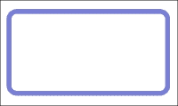
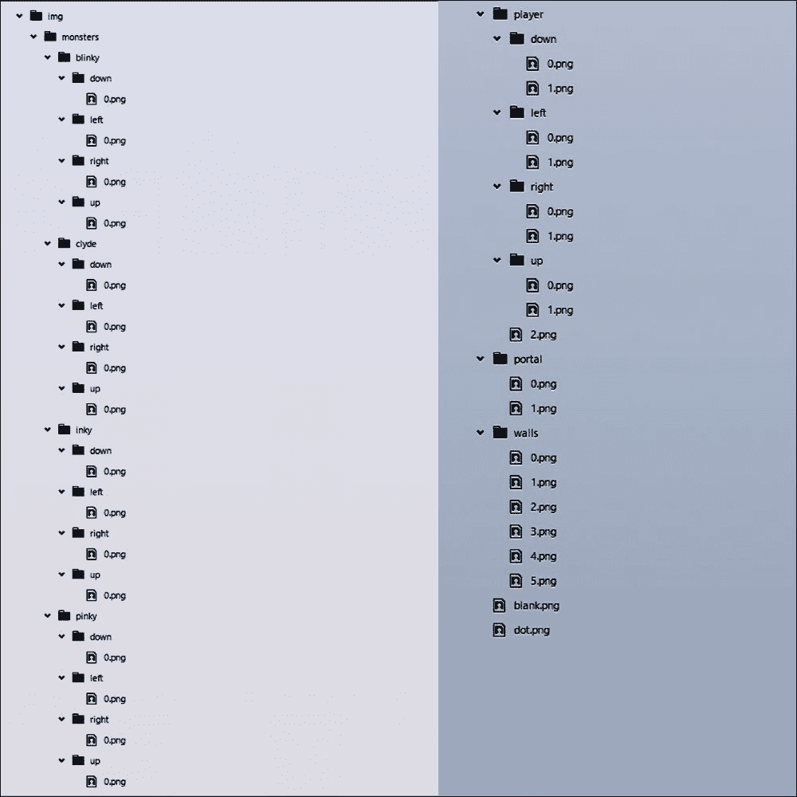
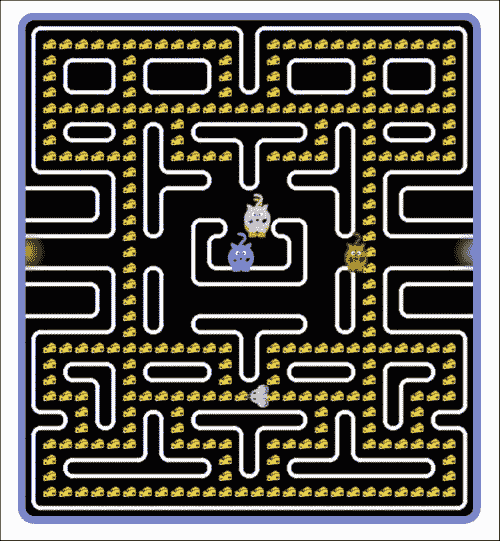
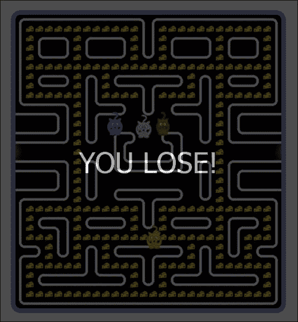
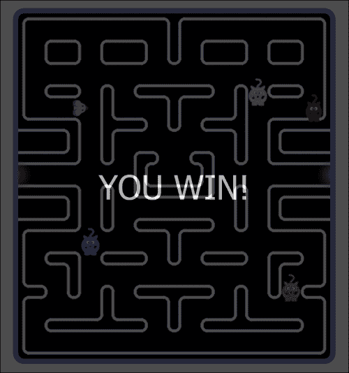

# 八、构建鼠人游戏

在本章中，我们将构建一个名为**鼠人**的游戏，它实际上是著名游戏**吃豆人**的修改版。我们将使用画布、JavaScript、CSS 和 HTML 来构建我们的游戏。

让我们从介绍我们游戏的角色开始:

*   我们的游戏会有一只老鼠。玩家将扮演老鼠。
*   会有四只猫试图抓住老鼠，还有很多奶酪给老鼠吃。
*   游戏的主要目标是吃掉所有的奶酪而不被怪物猫抓住。

听起来很有趣，对吧？让我们开门见山吧...

### 注

为了使我们的代码干净，我们将把我们的 JavaScript、CSS 和图像文件保存在不同的文件夹中。我们将有三个主要文件夹，命名如下:

*   `css`
*   `img`
*   `scripts`

# 游戏用户界面

要开始构建我们的游戏，我们需要准备画布。我们的超文本标记语言文件应该类似于下面的内容:

```js
<html>
  <head>
  </head>
  <body>
    <canvas id="main_canvas"></canvas>
  </body>
</html>
```

我们的游戏用户界面将在`<body></body>`标签中。我们将很快在画布上添加 JavaScript。

在`css`文件夹中，创建一个名为`styles.css`的 CSS 文件，该文件将包含以下代码用于我们的 HTML `body`、`canvas`和一个剧本`button`:

```js
body {
  position: absolute;
  top: 0;
  right: 0;
  bottom: 0;
  left: 0;
  background-color: #ffffff;
  -webkit-background-size: cover;
  -moz-background-size: cover;
  -o-background-size: cover;
  background-size: cover;
  overflow: hidden;
}

canvas {
  position: absolute;
  top: 0;
  right: 0;
  bottom: 0;
  left: 0;
  margin: auto;
  border: 10px solid rgba(63, 72, 204, 0.7);
  border-radius: 20px;
  box-shadow: 0 0 500px 100px #ffffff;
}

button {
  width: 100%;
  height: 100%;
  background-color: #000000;
  color: #FFFFFF;
  font-size: 60px;
  opacity: 0;
  z-index: 1000;
  transition: 5s ease;
  visibility: hidden;
}
```

在同一个文件夹中创建另一个名为`reset.css`的 CSS 文件，并将以下代码添加到 CSS 文件中。该文件将为游戏的初始屏幕设计用户界面:

```js
html, body, div, span, applet, object, iframe,
h1, h2, h3, h4, h5, h6, p, blockquote, pre,
a, abbr, acronym, address, big, cite, code,
del, dfn, em, img, ins, kbd, q, s, samp,
small, strike, strong, sub, sup, tt, var,
b, u, i, center,
dl, dt, dd, ol, ul, li,
fieldset, form, label, legend,
table, caption, tbody, tfoot, thead, tr, th, td,
article, aside, canvas, details, embed, 
figure, figcaption, footer, header, hgroup, 
menu, nav, output, ruby, section, summary,
time, mark, audio, video {
  margin: 0;
  padding: 0;
  border: 0;
  font-size: 100%;
  font: inherit;
  vertical-align: baseline;
}
article, aside, details, figcaption, figure, 
footer, header, hgroup, menu, nav, section {
  display: block;
}

body {
  line-height: 0;
}

ol, ul {
  list-style: none;
}

blockquote, q {
  quotes: none;
}

blockquote:before, blockquote:after,
q:before, q:after {
  content: '';
  content: none;
}

table {
  border-collapse: collapse;
  border-spacing: 0;
}
```

保存两个文件，并将它们包含在您的 HTML 文件中，在`<head></head>`标签中包含以下代码:

```js
<link href="css/styles.css" rel="stylesheet"/>
<link href="css/reset.css" rel="stylesheet"/>
```

如果您现在打开浏览器的 HTML 文件，您将看到以下图像:



我们将在前面的矩形中绘制我们的游戏界面。

# 为游戏增加功能

为了增加用户界面和游戏功能，我们将需要 JavaScript。我们需要`scripts`文件夹中的以下 JavaScript 文件:

*   `app.main.js`
*   `app.display_functions.js`
*   `app.init.js`
*   `app.key_handler.js`
*   `app.movement_functions.js`
*   `app.constants.js`

## app . main . js 文件

我们的`app.main.js`文件应该包含以下处理`app.key_handler.js`文件和你电脑键盘的功能。它还将调用`app.init.js`文件来初始化我们的变量。

### 注

这里我们用了`app.main.js`；您不需要像这样命名您的 JavaScript 文件。但是保持命名约定是一个很好的做法。

以下代码是`app.main.js`文件的内容:

```js
(function () {
  "use strict";
  APP.Init();
  APP.timer = setInterval(APP.Show_World, 1000 / APP.GAME_FPS);
  window.addEventListener("keydown", APP.Keydown_Handler, false);
  APP.Reset = function () {
    APP.map.Init();
    APP.player.Init();
    APP.monsters.Init();
    APP.blackout.style.transition = "0s";
    APP.blackout.style.visibility = "hidden";
    setTimeout(function () {
      APP.timer = setInterval(APP.Show_World, 1000 / APP.GAME_FPS);
      APP.blackout.style.opacity = 0;
      APP.blackout.style.transition = "5s ease";
    }, 100);
  };
}());
```

## app . display _ functions . js 文件

在我们的`app.display_functions.js`文件中，我们将编写一个函数，其中我们将包含`APP.Show_world`函数，该函数在`app.init.js`文件中使用。

该函数应包含以下代码(请参考注释以了解每个步骤的作用):

```js
  APP.Show_World = function () {
    var i,
    dots = 0; //initialized cheese number
    dots = APP.map.Draw(); //put our cheese on the canvas
    if (!dots) {
      APP.Game_Over("YOU WIN!"); //if all cheese are ate by the rat, then the screen should display this.
    }
    */This loop is determine if the rat is caught by the cats  */
    for (i = 0; i < APP.MONSTERS_QUANTITY; i++) {
      if (APP.monsters[i].x === APP.player.x) {
        if (APP.monsters[i].y === APP.player.y) {
          APP.Game_Over("YOU LOSE!");
        }
      }
    }
    APP.monsters.Move(); //cats' movement function
    APP.player.Move();  // rat's movement function
    APP.player.Check_For_Dots(); //This function will check number of chees. 
    APP.portals.Show(); //This will display two portals by using these the rat can escape. 
    APP.player.Show(); //This will show the rat on the canvas. 
      /* this function will show the monster on the canvas */
    for (i = 0; i < APP.MONSTERS_QUANTITY; i++) {
      APP.monsters[i].Show();
    }
  };
```

`APP.map.Draw`功能将保存以下代码:

```js
    APP.map.Draw = function () {
      var i, j, image, x, y, dot_counter = 0; //initialized variables. 
      /*this loop will create our game map/maze */
      for (i = 0; i < APP.MAP_WIDTH; i++) {
        for (j = 0; j < APP.MAP_HEIGHT; j++) {
          image = APP.images[APP.map.cells[j][i]];
          x = i * APP.CELL_WIDTH;
          y = j * APP.CELL_HEIGHT;
          APP.context.drawImage(image, x, y);
          if (APP.map.cells[j][i] === APP.DOT_CELL_DIGIT) {
            dot_counter++;
          }
        }
      }
      return dot_counter;
    };
```

对于猫的运动，我们将使用带有以下代码的`APP.monsters.Move`功能:

```js
    APP.monsters.Move = function () {
      var i;
      /*This loop will define the cats' quantity */
      for (i = 0; i < APP.MONSTERS_QUANTITY; i++) {
        if (APP.monsters[i].frame === APP.monsters[i].speed) {
          if (APP.monsters[i].direction !== APP.Direction.STOP) {
            APP.monsters[i].previus_direction =
            APP.monsters[i].direction;
          }
          APP.monsters[i].Select_Direction(); //Will select the cats' direction.
          APP.monsters[i].Check_Direction(); //Will check the cats' direction.
          APP.monsters[i].Check_Wall();//Will check the surroundings of the canvas or any block. 
        }
        /* These conditions will check the boundaries of the canvas and make the cats move. */
        if (APP.monsters[i].direction !== APP.Direction.STOP) {
          if (APP.monsters[i].up) {
            APP.monsters[i].Move_Up();
          }
          if (APP.monsters[i].down) {
            APP.monsters[i].Move_Down();
          }
          if (APP.monsters[i].left) {
            APP.monsters[i].Move_Left();
          }
          if (APP.monsters[i].right) {
            APP.monsters[i].Move_Right();
          }
        }
      }
    };
```

当使用以下代码调用`APP.player.Move()`函数时，我们的大鼠将移动:

```js
    APP.player.Move = function () {
      if (APP.player.frame === APP.player.speed) {
        APP.player.Check_Direction();
        APP.player.Check_Wall(); //This will check wall
      }
      /* these conditions will check our rat's valid movements */
      if (APP.player.direction !== APP.Direction.STOP) {
        if (APP.player.up) {
          APP.player.Move_Up(); 
        }
        if (APP.player.down) {
          APP.player.Move_Down();
        }
        if (APP.player.left) {
          APP.player.Move_Left();
        }
        if (APP.player.right) {
          APP.player.Move_Right();
        }
      }
    };
    /*this function will feed our rat the chees */
    APP.player.Check_For_Dots = function () {
      if (APP.map.marks[APP.player.y][APP.player.x] === APP.DOT_MARK) {
        APP.player.bonuses++;
        APP.map.marks[APP.player.y][APP.player.x] = APP.BLANK_MARK;
        APP.map.cells[APP.player.y][APP.player.x] = APP.BLANK_CELL_DIGIT;
      }
    };
```

现在，我们将通过调用具有以下代码的函数，使我们的 rat 在画布上可见，同时在块上移动 rat:

```js
APP.player.Show = function () {
  //initializing our needed variables. 
  var figure_offset = 5,
  frame_number = 2 - Math.floor(this.frame / 3),
  frame_offset = 1 - this.frame / this.speed,
  image, x, y;
  /* conditions for the rat's direction for up, down, left, right*/
  if (this.up) {
    image = this.up_images[frame_number];
    x = (this.x * APP.CELL_WIDTH) - figure_offset;
    y = ((this.y - frame_offset) * APP.CELL_HEIGHT) - figure_offset;

  } else if (this.down) {
    image = this.down_images[frame_number];
    x = (this.x * APP.CELL_WIDTH) - figure_offset;
    y = ((this.y + frame_offset) * APP.CELL_HEIGHT) - figure_offset;

  } else if (this.right) {
    image = this.right_images[frame_number];
    x = ((this.x + frame_offset) * APP.CELL_WIDTH) - figure_offset;
    y = (this.y * APP.CELL_HEIGHT) - figure_offset;

  } else {
    image = this.left_images[frame_number];
    x = ((this.x - frame_offset) * APP.CELL_WIDTH) - figure_offset;
    y = (this.y * APP.CELL_HEIGHT) - figure_offset;

  }
  APP.context.drawImage(image, x, y);
};
```

为了在画布上显示我们的猫，我们需要在我们的`APP.Show_Monster()`函数中使用以下代码:

```js
APP.Show_Monster = function () {
  //initializing needed variables. 
  var figure_offset = 15,
  frame_offset = 1 - this.frame / this.speed,
  image, x, y;
  /* binding the cats' directions for 4 directions*/
  if (this.up) {
    image = this.up_images[0];
    x = (this.x * APP.CELL_WIDTH) - figure_offset;
    y = ((this.y - frame_offset) * APP.CELL_HEIGHT) - figure_offset;

  } else if (this.down) {

    image = this.down_images[0];
    x = (this.x * APP.CELL_WIDTH) - figure_offset;
    y = ((this.y + frame_offset) * APP.CELL_HEIGHT) - figure_offset;

  } else if (this.right) {

    image = this.right_images[0];
    x = ((this.x + frame_offset) * APP.CELL_WIDTH) - figure_offset;
    y = (this.y * APP.CELL_HEIGHT) - figure_offset;

  } else {

    image = this.left_images[0];
    x = ((this.x - frame_offset) * APP.CELL_WIDTH) - figure_offset;
    y = (this.y * APP.CELL_HEIGHT) - figure_offset;

  }

  APP.context.drawImage(image, x, y);
};
```

要显示入口，我们需要编写另一个名为`APP.portals.Show ()`的函数，包括以下代码:

```js
    APP.portals.Show = function () {
      //initialized variables and incremented. 
      var offset, frame_offset, sw = +!this.raise;
      frame_offset = sw - this.frame_counter / (this.speed * APP.GAME_FPS); 
      /*controlled frame of the game */
      offset = Math.abs(this.width * frame_offset);
      APP.context.drawImage(this[0].image, this[0].x - offset, this[0].y);
      APP.context.drawImage(this[1].image, this[1].x + offset, this[1].y);
      this.frame_counter++;
      if (this.frame_counter === this.speed * APP.GAME_FPS) {
        this.frame_counter = 0;
        this.raise = !this.raise;
      }
    };
```

游戏结束后，用户需要看到一条消息，否则屏幕会变得模糊。为此，我们需要用以下代码声明另一个名为`APP.Game_Over()`的函数:

```js
    APP.Game_Over = function (condition) {
      clearInterval(APP.timer);
      APP.blackout = document.getElementById("blackout");
      APP.blackout.textContent = condition;
      APP.blackout.style.visibility = "visible";
      APP.blackout.style.opacity = 0.7;
    };
```

## app . init . js 文件

我们的`app.init.js`文件将包含一个函数。在函数中，我们将声明以下变量:

```js
  APP.map = {};
  APP.player = {};
  APP.monsters = [{}, {}, {}, {}];
  APP.portals = [{}, {}];
  APP.images = [];
  APP.timer = {};
  APP.canvas = {};
  APP.context = {};
  APP.blackout = document.getElementById("blackout");
```

编写一个包含较少变量的函数，如下所示:

```js
  APP.Init = function () {
    APP.map.Init();
    APP.player.Init();
    APP.portals.Init();
    APP.monsters.Init();
    APP.images.Init();
    APP.canvas.Init();
  };
```

现在，我们将初始化我们的游戏地图:

```js
APP.map.Init = function () {

  //initializing few variables ; few of them may look ugly, but don't worry they are a little bit random. 
  var i, j, map_in_strings = [
                "5000000000000250000000000002",
                "1777777777777117777777777771",
                "1750027500027117500027500271",
                "1716617166617117166617166171",
                "1740037400037437400037400371",
                "1777777777777777777777777771",
                "1750027527500000027527500271",
                "1740037117400250037117400371",
                "1777777117777117777117777771",
                "4000027140026116500317500003",
                "0000217150036436400217150000",
                "6666117116666666666117116666",
                "0000317116502665026117140000",
                "0000037436153664216437400000",
                "6666667666116666116667666666",
                "0000027526140000316527500000",
                "0000217116400000036117150000",
                "6666117116666666666117116666",
                "0000317116500000026117140000",
                "5000037436400250036437400002",
                "1777777777777117777777777771",
                "1750027500027117500027500271",
                "1740217400037437400037150371",
                "1777117777777777777777117771",
                "4027117527500000027527117503",
                "5037437117400250037117437402",
                "1777777117777117777117777771",
                "1750000340027117500340000271",
                "1740000000037437400000000371",
                "1777777777777777777777777771",
                "4000000000000000000000000003"
            ];
  APP.map.cells = [];
  for (i = 0; i < APP.MAP_HEIGHT; i++) {
    APP.map.cells[i] = [];
    for (j = 0; j < APP.MAP_WIDTH; j++) {
      APP.map.cells[i][j] = +map_in_strings[i].charAt(j);
    }
  }
  APP.map.marks = [];
  /* This loop will determine the map's size */
  for (i = 0; i < APP.MAP_HEIGHT; i++) {
    APP.map.marks[i] = [];
    for (j = 0; j < APP.MAP_WIDTH; j++) {
      if (APP.map.cells[i][j] <= APP.WALL_CELL_DIGIT) {
        APP.map.marks[i][j] = APP.WALL_MARK;
      } else if (APP.map.cells[i][j] === APP.BLANK_CELL_DIGIT) {
        APP.map.marks[i][j] = APP.BLANK_MARK;
      } else if (APP.map.cells[i][j] === APP.DOT_CELL_DIGIT) {
        APP.map.marks[i][j] = APP.DOT_MARK;
      }
    }
  }
};
```

# 鼠人的形象！

为了构建游戏，我们需要一些图片。我们将把所有图像保存在`img`文件夹中。在`img`文件夹中，我们将创建四个文件夹，如下图所示:

*   怪物
*   运动员
*   入口
*   墙壁

我们将在`img`文件夹中保存两张名为`dot.png`和`blank.png`的图片。

## 怪物文件夹

在`monsters`文件夹中，用我们猫咪的名字创建四个文件夹。

说我们的猫名字如下(你想叫什么就叫什么):

*   闪一下闪一下闪一下闪一下闪一下闪一下闪一下闪一下闪一下闪一下闪一下闪一下闪一下闪一下闪一下闪一下闪一下闪一下闪一下闪
*   漆黑的
*   小指
*   克莱德

每个猫文件夹将有四个文件夹，用于存放猫的定向图像。文件夹名称如下:

*   `up`
*   `down`
*   `left`
*   `right`

每个方向文件夹都应该包含我们的猫的图像。图像名称应为`0.png`。

你需要保持你的图像 50 x 50 像素。

## 玩家文件夹

`player`文件夹应该包含四个文件夹，用于我们老鼠的方向。文件夹的名称应如下所示:

*   `up`
*   `down`
*   `left`
*   `right`

每个文件夹都应该包含老鼠的定向图像。需要有两个图像，`0.png`和`1.png`。一张图片是张着嘴的老鼠，另一张是闭着嘴的老鼠。图像需要是 50 x 50 像素。

## 门户文件夹

`portal`文件夹应该包含我们的老鼠将从一端行进到另一端的门户的两幅图像。图像名称应为`0.png`和`1.png`。

## 墙壁文件夹

`walls`文件夹应该有五个图像来绘制画布中的墙壁。

图像应命名为`0.png`、`1.png`、`2.png`、`3.png`和`4.png`。图像将是墙的角和直线。

构建我们的游戏时使用的图像的层次表示如下:



# 给我们的猫添加图像

我们将编写四个函数，为我们的猫添加完美的图像。该函数应该类似于以下函数:

```js
  APP.monsters[0].Init = function () {
    APP.monsters[0].up_images = [];
    APP.monsters[0].right_images = [];
    APP.monsters[0].down_images = [];
    APP.monsters[0].left_images = [];
    APP.monsters[0].up_images[0] = new Image();
    APP.monsters[0].up_images[0].src = "img/monsters/blinky/up/0.png";
    APP.monsters[0].right_images[0] = new Image();
    APP.monsters[0].right_images[0].src = "img/monsters/blinky/right/0.png";
    APP.monsters[0].down_images[0] = new Image();
    APP.monsters[0].down_images[0].src = "img/monsters/blinky/down/0.png";
    APP.monsters[0].left_images[0] = new Image();
    APP.monsters[0].left_images[0].src = "img/monsters/blinky/left/0.png";
    APP.monsters[0].up = false;
    APP.monsters[0].right = true;
    APP.monsters[0].down = false;
    APP.monsters[0].left = false;
    APP.monsters[0].x = APP.INITIAL_BLINKY_X;
    APP.monsters[0].y = APP.INITIAL_BLINKY_Y;
    APP.monsters[0].frame = APP.INITIAL_BLINKY_FRAME;
    APP.monsters[0].speed = APP.BLINKY_SPEED;
  };
```

对于第二只猫，我们将将`APP.monsters[0].Init = function ();`功能的索引号更改为`APP.monsters[1].Init = function ();`。而`APP.monsters[2].Init = function ()` & `APP.monsters[3].Init = function ()`为第三和第四只猫。

我们还需要更改猫的图像位置和索引号。

为了用图像初始化墙壁和奶酪，我们需要编写一个函数，如下所示:

```js
  APP.images.Init = function () {
    var i;
    for (i = 0; i <= APP.DOT_CELL_DIGIT; i++) {
      APP.images[i] = new Image();
    }
    APP.images[0].src = "img/walls/0.png";
    APP.images[1].src = "img/walls/1.png";
    APP.images[2].src = "img/walls/2.png";
    APP.images[3].src = "img/walls/3.png";
    APP.images[4].src = "img/walls/4.png";
    APP.images[5].src = "img/walls/5.png";
    APP.images[6].src = "img/blank.png";
    APP.images[7].src = "img/dot.png";
  };
```

# 画画布

我们将通过在的`app.init.js`文件中添加以下功能来绘制画布:

```js
APP.canvas.Init = function () {
  APP.canvas = document.getElementById("main_canvas");
  APP.canvas.width = APP.MAP_WIDTH * APP.CELL_WIDTH;
  APP.canvas.height = APP.MAP_HEIGHT * APP.CELL_HEIGHT;
  APP.context = APP.canvas.getContext("2d");
  APP.context.fillStyle = APP.BG_COLOR;
  APP.context.fillRect(0, 0, APP.canvas.width, APP.canvas.height);
};
```

## app . key _ handler . js 文件

现在，在`app.key_handler.js`文件中，我们将编写代码，让玩家能够使用键盘移动我们的老鼠。代码应该如下所示:

```js
APP.Keydown_Handler = function (event) {
  "use strict";
  var KEYS = {
    /* We will initialize the arrow keys first. 37 = left key, 38 
      = up key, 39 = right key and 40 = down key. */
    LEFT    : 37,
    UP      : 38,
    RIGHT   : 39,
    DOWN    : 40
  }; 
  /* This switch-case will handle the key pressing and the rat's 
    movement. */
  switch (event.keyCode) {
    case KEYS.UP:
      APP.player.direction = APP.Direction.UP;
      break;
    case KEYS.RIGHT:
      APP.player.direction = APP.Direction.RIGHT;
      break;
    case KEYS.DOWN:
      APP.player.direction = APP.Direction.DOWN;
      break;
    case KEYS.LEFT:
      APP.player.direction = APP.Direction.LEFT;
      break;
  }
};
```

## app . move _ functions . js 文件

我们需要在按键的同时看看我们的墙在哪里结束或开始。当我们到达边缘时，我们需要停止移动老鼠。因此，我们必须为此设定一些条件。第一个是检查方向。该函数可以写成如下所示:

```js
  APP.Check_Direction = function () {
    switch (this.direction) {
      case APP.Direction.UP:
        if (APP.map.marks[this.y - 1][this.x] !== APP.WALL_MARK){
          this.up = true;
          this.down = false;
          this.right = false;
          this.left = false;
          return true;
        }
        break;
      case APP.Direction.DOWN:
        if (APP.map.marks[this.y + 1][this.x] !== APP.WALL_MARK) {
          this.up = false;
          this.down = true;
          this.right = false;
          this.left = false;
          return true;
        }
        break;
      case APP.Direction.RIGHT:
        if (APP.map.marks[this.y][this.x + 1] !== APP.WALL_MARK) {
          this.up = false;
          this.down = false;
          this.right = true;
          this.left = false;
          return true;
        }
        break;
      case APP.Direction.LEFT:
        if (APP.map.marks[this.y][this.x - 1] !== APP.WALL_MARK) {
          this.up = false;
          this.down = false;
          this.right = false;
          this.left = true;
          return true;
        }
        break;
    }
    return false;
  };
```

在检查方向的同时，我们也需要朝着正确的方向前进。选择方向的函数可以写成如下形式:

```js
APP.Select_Direction = function () {
  var possible_directions = [],
  direction_quantity = 9,
  rnd;
  switch (this.previus_direction) {
    case APP.Direction.UP:
      possible_directions[0] = APP.Direction.UP;
      possible_directions[1] = APP.Direction.UP;
      possible_directions[2] = APP.Direction.UP;
      possible_directions[3] = APP.Direction.UP;
      possible_directions[4] = APP.Direction.UP;
      possible_directions[5] = APP.Direction.UP;
      possible_directions[6] = APP.Direction.RIGHT;
      possible_directions[7] = APP.Direction.DOWN;
      possible_directions[8] = APP.Direction.LEFT;
      break;
    case APP.Direction.RIGHT:
      possible_directions[0] = APP.Direction.RIGHT;
      possible_directions[1] = APP.Direction.RIGHT;
      possible_directions[2] = APP.Direction.RIGHT;
      possible_directions[3] = APP.Direction.RIGHT;
      possible_directions[4] = APP.Direction.RIGHT;
      possible_directions[5] = APP.Direction.RIGHT;
      possible_directions[6] = APP.Direction.UP;
      possible_directions[7] = APP.Direction.DOWN;
      possible_directions[8] = APP.Direction.LEFT;
      break;
    case APP.Direction.DOWN:
      possible_directions[0] = APP.Direction.DOWN;
      possible_directions[1] = APP.Direction.DOWN;
      possible_directions[2] = APP.Direction.DOWN;
      possible_directions[3] = APP.Direction.DOWN;
      possible_directions[4] = APP.Direction.DOWN;
      possible_directions[5] = APP.Direction.DOWN;
      possible_directions[6] = APP.Direction.UP;
      possible_directions[7] = APP.Direction.RIGHT;
      possible_directions[8] = APP.Direction.LEFT;
      break;
    case APP.Direction.LEFT:
      possible_directions[0] = APP.Direction.LEFT;
      possible_directions[1] = APP.Direction.LEFT;
      possible_directions[2] = APP.Direction.LEFT;
      possible_directions[3] = APP.Direction.LEFT;
      possible_directions[4] = APP.Direction.LEFT;
      possible_directions[5] = APP.Direction.LEFT;
      possible_directions[6] = APP.Direction.UP;
      possible_directions[7] = APP.Direction.RIGHT;
      possible_directions[8] = APP.Direction.DOWN;
      break;
  }
  rnd = Math.floor(Math.random() * direction_quantity);
  this.direction = possible_directions[rnd];
};
```

现在，我们必须检查墙壁。我们可以通过向函数添加一些条件来实现这一点，如下所示:

```js
  APP.Check_Wall = function () {
    if (this.up) {
      if (APP.map.marks[this.y - 1][this.x] !== APP.WALL_MARK) {
        this.up = true;
        this.down = false;
        this.right = false;
        this.left = false;
      } else {
        this.direction = APP.Direction.STOP;
      }
    }

    if (this.right) {
      if (APP.map.marks[this.y][this.x + 1] !== APP.WALL_MARK) {
        this.up = false;
        this.down = false;
        this.right = true;
        this.left = false;
      } else {
        this.direction = APP.Direction.STOP;
      }
    }

    if (this.down) {
      if (APP.map.marks[this.y + 1][this.x] !== APP.WALL_MARK) {
        this.up = false;
        this.down = true;
        this.right = false;
        this.left = false;
      } else {
        this.direction = APP.Direction.STOP;
      }
    }

    if (this.left) {
      if (APP.map.marks[this.y][this.x - 1] !== APP.WALL_MARK) {
        this.up = false;
        this.down = false;
        this.right = false;
        this.left = true;
      } else {
        this.direction = APP.Direction.STOP;
      }
    }
  };
```

箭头键的移动应该被很好地定义。我们应该为箭头键创建以下函数:

```js
APP.Move_Up = function () {
  if (this.frame === 0) {
    this.frame = this.speed;
    this.y--;
  } else {
    this.frame--;
  }
  if (this.y < 0) {
    this.y = APP.MAP_HEIGHT - 1;
  }
};
APP.Move_Right = function () {
  if (this.frame === 0) {
    this.frame = this.speed;
    this.x++;
  } else {
    this.frame--;
  }
  if (this.x >= APP.MAP_WIDTH) {
    this.x = 0;
  }
};
APP.Move_Down = function () {
  if (this.frame === 0) {
    this.frame = this.speed;
    this.y++;
  } else {
    this.frame--;
  }
  if (this.y >= APP.MAP_HEIGHT) {
    this.y = 0;
  }
};
APP.Move_Left = function () {
  if (this.frame === 0) {
    this.frame = this.speed;
    this.x--;
  } else {
    this.frame--;
  }
  if (this.x < 0) {
    this.x = APP.MAP_WIDTH - 1;
  }
};
```

## app . constants . js 文件

为了保持我们游戏的画布干净整洁，状态良好，我们需要用几个固定变量初始化几个变量(例如，地图的高度、单元格的高度、地图的宽度、单元格的宽度等等)。我们可以通过在我们的`app.constants.js`文件中编写以下代码来做到这一点。检查代码的注释，以清楚地了解代码将如何工作:

```js
var APP = {};
(function () {
  "use strict";
  //used for map's size and each cell's size
  APP.MAP_WIDTH = 28;
  APP.MAP_HEIGHT = 31;
  APP.CELL_WIDTH = 20;
  APP.CELL_HEIGHT = 20;
  APP.BG_COLOR = "#000000";
  APP.GAME_FPS = 40;
  APP.PLAYER_SPEED = 8;
  APP.INITIAL_PLAYER_FRAME = 8;
  APP.INITIAL_PLAYER_X = 14;
  APP.INITIAL_PLAYER_Y = 23;
  APP.WALL_CELL_DIGIT = 5;
  APP.BLANK_CELL_DIGIT = 6;
  APP.DOT_CELL_DIGIT = 7;
  APP.WALL_MARK = "W";
  APP.BLANK_MARK = "B";
  APP.DOT_MARK = "D";
  APP.PORTAL_BLINKING_SPEED = 2;
  APP.PORTAL_WIDTH = 20;
  APP.FIRST_PORTAL_X = 0;
  APP.FIRST_PORTAL_Y = 265;
  APP.SECOND_PORTAL_X = 510;
  APP.SECOND_PORTAL_Y = 265;
  APP.MONSTERS_QUANTITY = 4;
  APP.INKY_SPEED = 7;
  //for the cat's speed and position. 
  APP.INITIAL_INKY_X = 12;
  APP.INITIAL_INKY_Y = 14;
  APP.INITIAL_INKY_FRAME = 7;
  APP.PINKY_SPEED = 7;
  APP.INITIAL_PINKY_X = 13;
  APP.INITIAL_PINKY_Y = 14;
  APP.INITIAL_PINKY_FRAME = 4;
  APP.BLINKY_SPEED = 7;
  APP.INITIAL_BLINKY_X = 14;
  APP.INITIAL_BLINKY_Y = 11;
  APP.INITIAL_BLINKY_FRAME = 4;
  APP.CLYDE_SPEED = 7;
  APP.INITIAL_CLYDE_X = 15;
  APP.INITIAL_CLYDE_Y = 14;
  APP.INITIAL_CLYDE_FRAME = 7;
  APP.Direction = {
    UP      : "UP",
    RIGHT   : "RIGHT",
    DOWN    : "DOWN",
    LEFT    : "LEFT",
    STOP    : "STOP"
  };
})();
```

# 玩游戏

如果您正确地集成了代码，并且您的 HTML 文件现在看起来类似于下面，那么您现在可以运行该 HTML 文件了:

```js
<html>
  <head>
    <link href="css/reset.css" rel="stylesheet"/>
    <link href="css/styles.css" rel="stylesheet"/>
  </head>
  <body>
    <canvas id="main_canvas"></canvas>
    <button id="blackout" onclick="APP.Reset()"></button>
    <script src="scripts/app.constants.js"></script>
    <script src="scripts/app.init.js"></script>
    <script src="scripts/app.display_functions.js"></script>
    <script src="scripts/app.movement_functions.js"></script>
    <script src="scripts/app.key_handler.js"></script>
    <script src="scripts/app.main.js"></script>
  </body>
</html>
```

在浏览器上运行 HTML 文件后，您将能够看到以下屏幕:



恭喜你！你成功建造了鼠人！

要玩这个游戏，点击画布上的任何地方，用箭头键移动你的老鼠。

如果您失去了所有的生命，您将看到以下屏幕:



如果赢了，会看到如下画面:



# 总结

我们建造了鼠人！我希望你现在正在玩你已经建立的游戏。如果你在编码几个小时后不能玩游戏，不要担心。保持冷静，再试一次。整个源代码和所需的图像都包含在书中。你可以下载并运行它。但是，在这样做之前，我建议你至少尝试两次。让我们进入[第 9 章](09.html#1S2JE1-71a55ef7ad8b4ea3bacc9276ca4546aa "Chapter 9. Tidying up Your Code Using OOP")、*使用 OOP* 整理代码，了解制作文件或文件夹以及访问它们的更好想法。