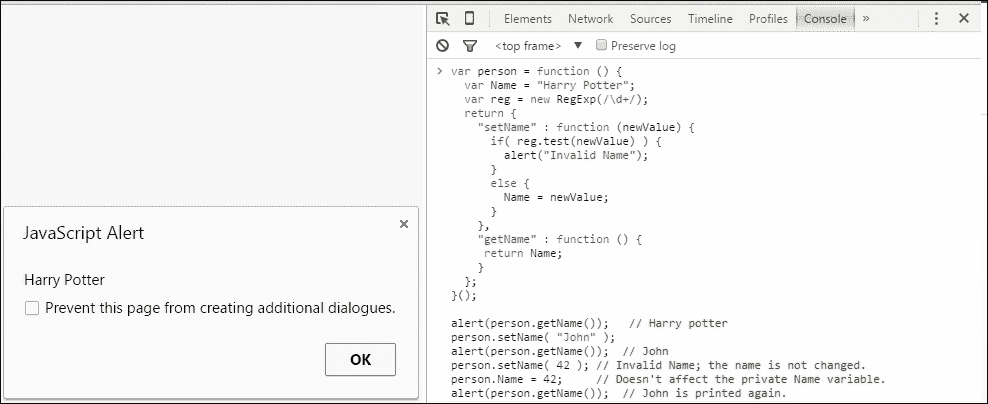
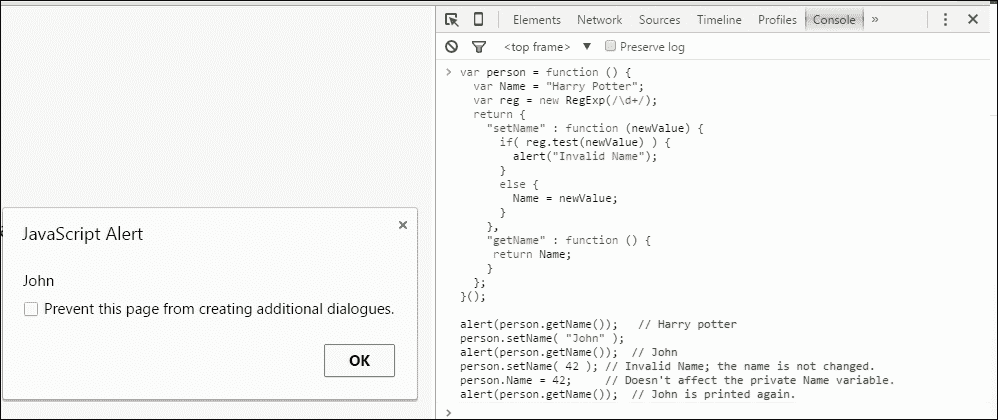
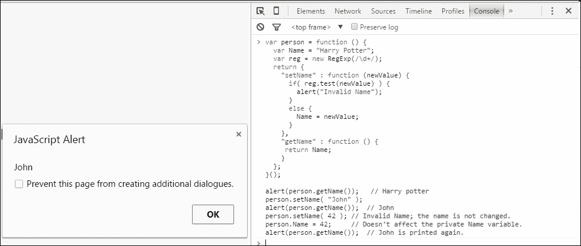
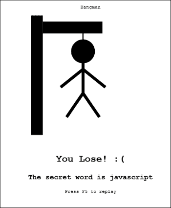

# 第九章。用面向对象的方法整理代码

在这一章，我们将学习**面向对象编程** ( **OOP** )和讨论著名游戏**刽子手**的代码。

“OOP 是一种编程范式，它使用抽象来创建基于现实世界的模型。OOP 使用了先前建立的范例中的几种技术，包括模块化、多态和封装。”或者“OOP 语言通常通过使用类来创建具有相同属性和方法的多个对象来识别。”

您可能已经假设 JavaScript 是一种面向对象的编程语言。是的，你完全正确。让我们看看为什么它是一种面向对象的语言。如果一种计算机编程语言有以下几个特点，我们称之为面向对象:

*   遗产
*   多态性
*   包装
*   抽象

在进一步讨论之前，让我们讨论一下**对象**。我们以下列方式在 JavaScript 中创建对象:

```js
var person = new Object();
person.name = "Harry Potter";
person.age = 22;
person.job = "Magician";
```

我们为一个人创造了一个物体。我们增加了一些人的属性。

如果我们想访问对象的任何属性，我们需要调用属性。

考虑您想要弹出前面的`person`对象的`name`属性。您可以通过以下方法做到这一点:

```js
person.callName = function(){
  alert(this.name);
};
```

我们可以编写前面的代码，如下所示:

```js
var person = {
  name: "Harry Potter",
  age: 22,
  job: "Magician",
  callName: function(){
  alert(this.name);
  }
};
```

# JavaScript 中的继承

继承是指从父母或祖先那里获得某种东西(如特征、品质等)。在编程语言中，当一个类或对象基于另一个类或对象以保持父类或对象的相同行为时被称为**继承**。

我们也可以说这是一个获得其他事物的属性或行为的概念。

假设，X 继承了 Y 的一些东西；就像 X 是 y 的一种类型

JavaScript 占据了继承能力。我们来看一个例子。鸟继承了动物，因为鸟是一种动物。因此，鸟可以做和动物一样的事情。

JavaScript 中的这种关系有点复杂，需要语法。我们需要使用一个名为`prototype`的特殊对象，它将属性分配给一个类型。我们需要记住，只有函数才有原型。我们的`Animal`功能应该如下所示:

```js
function Animal(){
//We can code here. 
}; 
```

要添加函数的一些属性，我们需要添加一个原型，如下所示:

```js
Animal.prototype.eat = function(){
  alert("Animal can eat.");
};
```

让我们为我们的`Bird`功能创建原型。我们的功能和原型应该如下所示:

```js
function Bird(){
};
Bird.prototype = new Animal();
Bird.prototype.fly = function(){
  alert("Birds can fly.");
};
Bird.prototype.sing = function(){
  alert("Bird can sing.");
};
```

原型和功能的结果是你创建的任何`Bird`都将具有`Animal`和`Bird`的属性。但是，如果你创建`Animal`，这只会有`Animal`的属性。`Animal`的属性由`Bird`继承。

因此，我们可以说 JavaScript 具有继承属性。

# JavaScript 中的封装

在 OOP 中，**封装**是最重要的概念之一，它允许对象将公共类和私有类的成员分组到一个名字下。我们使用封装来保护我们的类免受意外或故意的愚蠢行为的影响。封装是指将某物封装在胶囊中或好像某物在胶囊中。

现在，我们将看看 JavaScript 是否支持封装。如果是的话，我们可以说 JavaScript 是一种 OOP 语言。让我们看看下面的例子:

```js
var person = {
  "name" : "Harry Potter",
  "age" : 22,
};
alert(person.name);
person.name = "John";
alert(person.name);
```

如果我们在控制台上运行这个。第一个警告框将打印以下图像:


我们将变量`name`改为`John`。因此，第二个警告框类似于下图:


如果我们不小心给`name`变量分配了一个数字，会发生什么？

给`name`变量分配一个号是完全可以接受的。就 JavaScript 而言，变量可以接受任何类型的数据作为其值。然而，我们不想要一个数字代替一个名字。我们该怎么办？我们可以使用 JavaScript 的封装属性，如下所示:

```js
var person = function () {
  var Name = "Harry Potter";
  var reg = new RegExp(/\d+/);
  return { 
    "setName" : function (newValue) {
      if( reg.test(newValue) ) {
        alert("Invalid Name");
      }
      else {
        Name = newValue;
      }
    },
    "getName" : function () {
      return Name; 
    }
  }; 
}(); 

alert(person.getName());   // Harry potter
person.setName( "John" );
alert(person.getName());  // John
person.setName( 42 ); // Invalid Name; the name is not changed.
person.Name = 42;     // Doesn't affect the private Name variable.
alert(person.getName());  // John is printed again.
```

现在，如果我们在控制台上运行上述代码，第一个输出将显示一个带有**哈利波特**的弹出窗口，因为我们只调用了`getName()`函数。`getName()`函数有一个初始值，即`Harry Potter`:



第二个输出如下:我们将`person`的`Name`属性更改为`John`，并再次调用`getName()`函数:



第三个输出将如下所示，因为我们试图将一个数字推送到一个字符串变量。名称不能是整数，因此**无效名称**会弹出，因为我们在`if`语句下有一个条件:


第四个输出将如下所示，因为该数字没有添加到该人的`Name`属性中。因此，我们将获得最后一个推送到`Name`属性的数据:



我们现在可以确认 JavaScript 支持封装。

JavaScript 也支持**多态**和**抽象**。如果您想了解它们，可以参考以下链接:

[https://developer . Mozilla . org/en-US/docs/Web/JavaScript/Introduction _ to _ Object-Oriented _ JavaScript](https://developer.mozilla.org/en-US/docs/Web/JavaScript/Introduction_to_Object-Oriented_JavaScript)

让我们做一些有趣的事情。你可能听说过一个叫 Hangman 的游戏。我们将在那个游戏中讨论面向对象程序。首先给大家介绍一下游戏。

玩家需要猜一个词。如果他能正确猜出这个词，他就安全了；否则，他将被绞死。请看下图，了解游戏的清晰概念，如下所示:



# 解剖刽子手

刽子手游戏有两个文件夹和一个 HTML 文件。这两个文件夹分别命名为`css`和`js`。`index.html` HTML 文件应该包含以下代码:

```js
<html lang="en" ng-app="hangman"> 
  <head>
    <title>Hangman</title>
    <link rel="stylesheet" href="css/styles.css">
    <script src="js/angular.min.js"></script>
  </head>
  <body ng-controller="StartHangman">
    <p>Hangman</p>
    <svg width="400" height="400">
      <rect ng-show="failedGuess.length >= 1" x="0" y="0" width="40" height="400"></rect>
      <rect ng-show="failedGuess.length >= 2" x="40" y="20" width="200" height="40"></rect>
      <rect ng-show="failedGuess.length >= 3" x="173" y="50" width="4" height="100"></rect>
      <circle ng-show="failedGuess.length >= 3" cx="175" cy="120" r="40"></circle>
      <line ng-show="failedGuess.length >= 4" x1="175" y1="150" x2="175" y2="185" style="stroke:rgb(0,0,0)" stroke-width="10"></line>
      <line ng-show="failedGuess.length >= 4" x1="175" y1="180" x2="100" y2="240" style="stroke:rgb(0,0,0)" stroke-width="10"></line>
      <line ng-show="failedGuess.length >= 5" x1="175" y1="180" x2="250" y2="240" style="stroke:rgb(0,0,0)" stroke-width="10"></line>
      <line ng-show="failedGuess.length >= 6" x1="175" y1="180" x2="175" y2="265" style="stroke:rgb(0,0,0)" stroke-width="10"></line>
      <line ng-show="failedGuess.length >= 7" x1="175" y1="260" x2="120" y2="340" style="stroke:rgb(0,0,0)" stroke-width="10"></line>
      <line ng-show="failedGuess.length >= 8" x1="175" y1="260" x2="230" y2="340" style="stroke:rgb(0,0,0)" stroke-width="10"></line>
    </svg>

    <div ng-show="stage == 'initial'">
      <h2>Please enter your secret words:</h2>
      <input type="text" ng-model="secretWords" autofocus ng-keyup="$event.keyCode == 13 ? startGame() : null">
      <button ng-click="startGame()">Enter</button>
    </div>

    <div ng-show="stage == 'play'">
      <h1>{{ answer }}</h1>
      <h2>Failed guess ({{ failedGuess.length }}) = {{ failedGuess}}</h2>

      <input type="text" ng-model="charGuess" id="char-guess" ng-keyup="$event.keyCode == 13 ? guess(charGuess) : null" placeholder="Guess a letter">
      <button ng-click="guess(charGuess)">Enter</button>
    </div>

    <div ng-show="stage == 'won'">
      <h1>You Win! :)</h1>
      <h2>That's right, the secret words is {{ secretWords }}</h2>
      <p>Press F5 to replay</p>
    </div>

    <div ng-show="stage == 'lost'">
      <h1>You Lose! :(</h1>
      <h2>The secret word is {{ secretWords }}</h2>
      <p>Press F5 to replay</p>
    </div>

    <script src="js/hangman.js"></script>
  </body>
</html>
```

`css`文件夹应该有一个`styles.css`文件。`styles.css`文件应包含以下代码:

```js
body {
  font-family: monospace;
  text-align: center;
  font-size: 16px;
  line-height: 1.40;
}

input[type="text"] {
  padding: 5px;
  font-family: monospace;
  height: 30px;
  font-size: 1.8em;
  background-color: #fff;
  border: 2px solid #000;
  vertical-align: bottom;
}

svg {
  margin: 0 0 30px;
}

button {
  cursor: pointer;
  margin: 0;
  height: 44px;
  background-color: #fff;
  border: 2px solid #000;
}
```

`js`文件夹中应该有两个 JavaScript 文件，`angular.min.js`和`hangman.js`。

`angular.min.js`文件是一个框架。可以从[https://angularjs.org/](https://angularjs.org/)下载，也可以随书的代码包一起提供。

`hangman.js`文件应该有以下代码:

```js
var hangman = angular.module('hangman', []).controller('StartHangman', StartHangman);
  function StartHangman($scope, $document) {
    $scope.stage = "initial";
    $scope.secretWords = "";
    $scope.answer = "";
    $scope.failedGuess = [];
    var hasWon = function() {
      var foundDash = $scope.answer.search(/-/);
      return (foundDash == -1);
    }
    var hasLost = function() {
      return ($scope.failedGuess.length >= 8);
    }
    $scope.startGame = function() {
      $scope.secretWords = $scope.secretWords.toLowerCase();
      for(i in $scope.secretWords) {
        $scope.answer += $scope.secretWords[i] == ' ' ? ' ' : '-';
      }
      $scope.stage = "play"
    }
    $scope.guess = function(ch) {
      ch = ch.toLowerCase();
      $scope.charGuess = "";
      if(ch.length != 1) {
        if(ch.length > 1) {
          alert("Please only enter one character at a time");
        }
      return ;
    }
    /* If ch is already in the failed guess list */
    for(i in $scope.failedGuess) {
      if(ch == $scope.failedGuess[i]) return ;
    }
    /* Check if it's part of the answer */
    var found = false;
    $scope.answer = $scope.answer.split(""); /* convert to array of char */
    for(i in $scope.secretWords) {
      if($scope.secretWords[i] === ch) {
        found = true;
        $scope.answer[i] = ch;
      }
    }
    $scope.answer = $scope.answer.join(""); /* convert back to string */
    if(!found) {
      $scope.failedGuess.push(ch);
    }
    if(hasWon()) {
      $scope.stage = "won";
    }
    if(hasLost()) {
      $scope.stage = "lost";
    }
  }
}
```

我们来讨论一下代码。

我们使用`var hangman = angular.module('hangman', []).controller('StartHangman', StartHangman);`来导入我们的`angular.min.js`文件，并开始控制我们游戏的其余代码。

我们编写了一个`StartHangman($scope, $document) {}`函数，我们将在其中编写代码。我们从`angular.min.js`文件中传递了两个变量，`$scope`和`$document`。

我们初始化了几个变量，如下所示:

```js
$scope.stage = "initial";
$scope.secretWords = "";
$scope.answer = "";
$scope.failedGuess = [];
```

我们为游戏的输赢编写了两个函数，如下所示:

```js
var hasWon = function() {
  var foundDash = $scope.answer.search(/-/);
  return (foundDash == -1);
}
var hasLost = function() {
  return ($scope.failedGuess.length >= 8);
}
```

我们已经确定了这里的猜测次数。然后，我们写了一个函数来开始我们的游戏。我们创建了一个对象，并使用了 JavaScript 的继承属性，如下所示:

```js
$scope.startGame = function() {
  $scope.secretWords = $scope.secretWords.toLowerCase();
  for(i in $scope.secretWords) {
    $scope.answer += $scope.secretWords[i] == ' ' ? ' ' : '-';
  }
  $scope.stage = "play"
}
```

我们从玩家那里获得输入，以便存储为我们的秘密词。

游戏的提示页面看起来类似于下图:


然后，介绍了我们最重要的功能`$scope.guess = function(ch){}`。我们向函数传递了一个字符，并检查它是否与玩家输入的任何带有秘密单词的字母相匹配。

# 总结

在本章中，您学习了面向对象语言的特性。我们也在著名的游戏《刽子手》中看到了 OOP 特性的使用！我希望你喜欢创造和扮演刽子手。我们将在本书的下一章也是最后一章看到 JavaScript 的可能性。