# 第二章。基础知识

在前一章中，我们已经看到，为了匹配一个子字符串，您只需要在正则表达式中写入该字符串。例如，为了匹配`hello`，您可以创建这个变量:

```js
var pattern = /hello/;
```

我们还了解到，如果我们想要匹配正则表达式的所有字符串或字符，我们可以在 Regex 中使用`g`标志。然而，像这样有清晰模式的情况很少，即使出现了，是否需要 **Regex** 也是有争议的。当你掌握的具体信息较少时，你才能真正看到正则表达式的真正威力。

Regex 引擎实现了两个主要功能，允许您正确表示 80%的模式。我们将在本章中介绍这两个主要特性:

*   模糊的匹配者
*   乘数

# 在 Regex 中定义模糊匹配器

在本主题中，我们将介绍**字符类**，它们告诉正则表达式匹配一个单一的模糊字符。在**模糊匹配**中，可以有字符、数字或字母数字字符。

## 匹配通配符

假设我们想要找到一个序列，在这个序列中我们有`1`，然后有任何其他字符跟在`3`后面，这样它将包括`123`、`1b3`、`1 3`、`133`等等。对于这些类型的情况，我们需要在模式中使用*模糊匹配器*。

在前面的例子中，我们希望能够使用尽可能广泛的匹配器；如果我们愿意，我们可以选择不加任何限制，它可以包含任何字符。对于这种情况，我们有`.`匹配器。

Regex 中的句点将匹配除新行之外的任何字符，因此它可以包括字母、数字、符号等。为了测试这一点，让我们在我们的 HTML 工具中实现前面提到的例子。在文本字段中，让我们输入几个组合来对照`123 1b3 1 3 133 321`测试模式，然后对于模式，我们可以指定`/1.3/g`。运行它应该会给你类似这样的东西:


## 匹配数字

**通配符**不是唯一匹配模糊模式的字符，也不总是正确的选择。例如，继续前面的例子，假设`1`和`3`之间的字符是一个数字。在这种情况下，我们可能不关心哪个数字会在那里结束，我们只需要确保它是一个数字。

要做到这一点，我们可以使用`\d`。模糊匹配器`d`反斜杠或数字特殊字符将匹配 0 到 9 之间的任何字符。用反斜杠 d 字符替换句点将会得到以下结果:

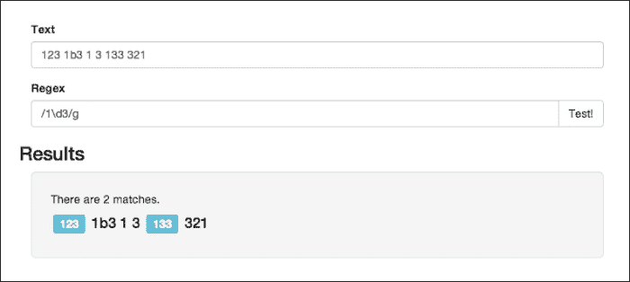

## 匹配字母数字字符

前面提到的四个匹配中只有两个符合新的约束。最后一个主要的模糊搭配者是`\w`，这是一个 **字的人物**。它将匹配下划线字符、数字或字母表中的 26 个字母中的任何一个(小写字母和大写字母)。在我们的应用中运行此程序会得到以下结果:

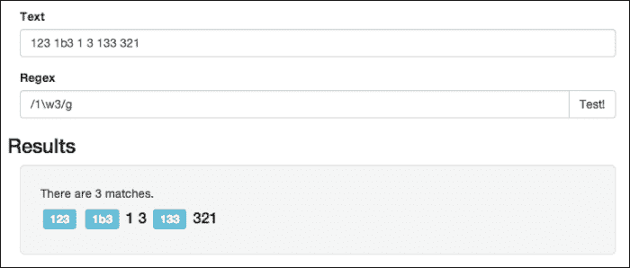

## 否定字母数字字符和数字

另外，如果你想要最后两个匹配器的否定版本，你可以只使用它们的大写对应物。我这样说的意思是`\d`可以匹配任何数字，但是`\D`可以匹配除了数字之外的任何东西，因为它们是对的赞美，同样的道理也适用于`\w`和`\W`。

# 在 Regex 中定义范围

Regex 中的**范围**允许您创建自己的自定义约束，就像我们刚刚经历的一样。在一个范围内，您可以精确地指定可以使用的字符，或者如果更快，您可以指定相反的字符，即不匹配的字符。

为了说明，假设我们只想匹配`abc`。在这种情况下，我们可以创建一个类似于`[abc]`的范围，它将匹配单个字符，即`a`、`b`或`c`。让我们用`bicycle`文本和`/[abc]/g`模式来测试一下:

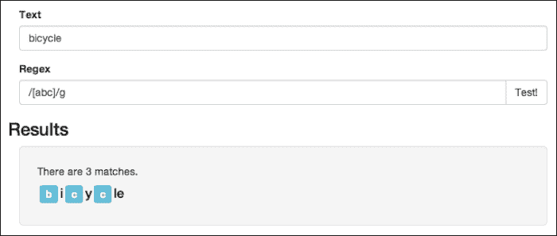

## 定义范围

现在，这将起作用，但是，如果你有很多需要匹配的角色，你的范围将很快变得长。幸运的是，Regex 允许您使用(`-`)破折号来指定一组字符，而无需列出它们。例如，假设我们想检查三个字母的名称是否格式正确，我们希望第一个字母是大写字母，后面是两个小写字母。我们可以将其缩写为`[a-z]` 或`[A-Z]`作为大写字母，而不是指定每个范围内的所有 26 个字母。因此，为了实现一个三字母名称验证器，我们可以创建一个类似于`/[A-Z][a-z][a-z]/g`的模式:

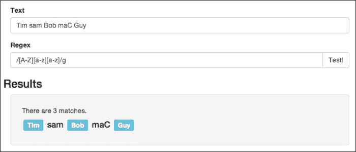

## 匹配破折号字符

如果您试图匹配破折号字符本身，并且不希望 JavaScript 将其解释为指定一个集合，您可以用破折号字符开始/结束该范围，或者用反斜杠转义该范围。例如，为了同时匹配`"hello world"`和`"hello-world`、`"`，我们可以编写一个类似于`/hello[- ]world/ or /hello[\- ]world/`的模式。

我们也可以用一个狂野的角色作为愤怒中的一个简单的点。例如，当我们想要匹配一个数字字符并且我们不介意有一个句点时(一秒钟内忘记了一个数字只能有一个句点)，这可能会发生。因此，为了匹配`123`以及`2.4`和`.45`，我们可以指定`/[\d.][\d.]\d/`模式，然后第一个和第二个数字都可以是句点。请注意，JavaScript 并不认为我们指的是范围内的通配符句点，因为这将违背范围的目的，所以 JavaScript 将其视为标准句点。

## 定义否定范围

最后一个被区间覆盖的是**否定区间**。否定范围正是它听起来的样子。我们不是指定匹配什么，而是指定不匹配什么。这非常类似于在 JavaScript 中给 **布尔值**添加一个 not ( `!`)字符，因为它只是翻转您之前得到的返回值。

要创建取反范围，可以用(`^`)插入符号字符开始该范围，以匹配任何字符；然而，对于字母表的前五个字母，您会使用类似于`/[^a-e]/`的东西。

这本身可能看起来没那么有用，但是例如，您可能想要删除文件名中所有非字母字符。在这种情况下，您可以键入`/[^a-z]/gi`并结合 JavaScript 的`replace`功能，您可以将它们全部删除。

# 在 Regex 中定义乘数

匹配者很棒，但他们只能在一个方向上“缩放”你的模式。我喜欢把匹配器看作是垂直缩放你的模式的东西，允许你匹配更多适合同一模式的字符串，但它们在长度上仍然受到限制，或者水平缩放模式。**倍增器**允许匹配任意大小的字符串，这些字符串可以作为输入接收，给你更大的自由度。

Regex 中有三个基本乘数:

*   `+`:这匹配一个或多个事件
*   `?`:这与零或一个匹配
*   `*`:这与零个或多个匹配

我们将在本节中介绍这三种乘数，并向您展示如何创建自定义乘数。

## 匹配一个或多个事件

最基本的乘数必须是(`+`)加运算符。它告诉 JavaScript，正则表达式中使用的模式必须出现一次或多次。例如，我们可以基于之前使用的格式化名称模式，而不仅仅是匹配三个字母的名称，我们可以使用`/[A-Z][a-z]+/g`匹配任意长度的名称:

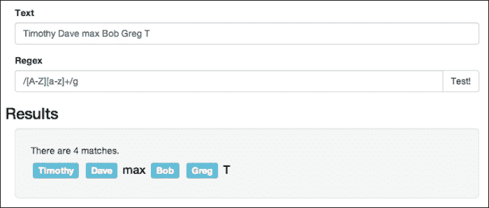

这个模式代表任何以大写字母开头，后面至少有一个小写字母的东西。加号将继续重复该模式，直到它不再匹配(在我们的例子中，当它到达一个空格字符时发生)。

## 匹配零或一次出现

下一个乘数是(`?`)问号，我猜测这个乘数更像是一个量词。合适的是，这个乘数允许前面的字符出现或不出现，几乎就像我们在说它的存在是有问题的。我认为最好的解释方法是看一个例子。假设我们想要接收`Apple`的单数或复数形式，为此，我们可以使用以下模式:

```js
/apples?/gi
```

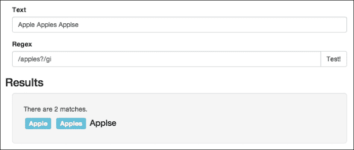

现在看起来这个问号更像是一个条件运算符，而不是乘数，但是它真正做的是说前面的字符可以出现一次，也可以出现零次。

## 匹配零个或多个事件

我们工具链中的下一个乘数是(`*`)星号。这个星号是前两个乘数的组合，允许前一个字符出现在零到无穷大之间的任何地方。因此，如果您的输入多次包含一个单词或字符，那么模式将匹配。如果您的输入不包含单词或字符，模式仍然会匹配。例如，如果您正在为`update`解析某种日志，这可能会派上用场。在这种情况下，你可能会得到`update`或`update!!!`，根据一天中的时间，你甚至可能得到`update!!!!!!!!!!!!!!!!`。为了匹配所有这些字符串，您可以简单地创建模式`/update!*/g`模式。

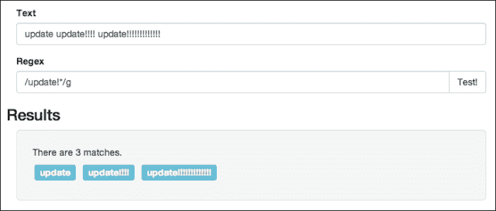

这是三个标准乘数，类似于那些内置了(`\d`)范围字符集的乘数。同样，Regex 允许您指定和创建自己的乘数。

# 定义自定义量词

只有一种语法可以指定您自己的乘数，但是由于可用的参数选项不同，您会得到三个不同的函数选项。

如果你想给定的字符匹配一个具体的次数，你可以简单地在花括号内指定允许的重复次数。这不会让你的模式更灵活，但会让它们读起来更短。例如，如果我们要实现一个电话号码，我们可以键入`/\d\d\d-\d\d\d\d/`。然而，这有点长，相反，我们可以使用自定义乘数并键入`/\d{3}-\d{4}/`，这实际上缩短了它，使其更具可读性。

## 匹配 n 次或更多次

接下来，如果只是想设置图案可以出现的最小次数，但并不真正关心实际长度，可以只在数字后面加一个逗号。例如，假设我们想要创建一个模式来确保用户的密码至少有六个字符长；在这种情况下，您可能不想强制执行最大字符限制，因此可以键入类似于`/.{6,}/`的内容:

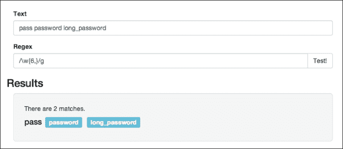

## 匹配 n 到 m 个事件

我们的自定义乘数的第三个变化是当你想要设置一套完整的选项，匹配最小和最大出现次数。您可以通过在逗号后添加另一个数字来实现。例如，如果我们有某种注释系统，并且希望将注释限制在 15 到 140 个字符之间，我们可以创建一个 Regex 字符串来匹配这个设置，例如`/.{15,140}/`。

现在，我不是说前面提到的两个例子是这种 Regex 的最佳用途，因为很明显，有一种更容易的方法来检查文本长度。然而，在更大的模式中，这可能非常有用。

# 匹配交替选项

在这个阶段，我们知道如何使用模糊匹配器匹配任何一组字符，并且我们有能力使用乘数为任何一种序列重复模式，这给了你一个非常好的匹配任何东西的基础。然而，即使所有这些都到位了，有一种情况有出现的趋势，这可能是一个问题。当处理两种不同且完全独立的可接受的输入形式时，就会出现这种情况。

假设我们正在解析某种形式的数据，对于每个问题，我们希望提取是或否来存储在某个地方。以我们目前的专业水平，我们可以创建一个类似于`/[yn][eo]s?/g`的模式，它将匹配`yes`和`no`。真正的问题是，它还将匹配这些字母的所有其他六种配置，这可能是我们的应用不知道如何处理的:

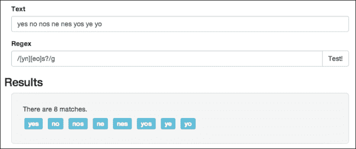

幸运的是，Regex 有一个完全不同的系统来处理这种情况，它是以(`|`)管道字符的形式出现的。它类似于您将在`if`语句中使用的*或*运算符，除了您在这里只使用一个而不是两个。它的工作原理是，你用管道把你想要匹配的不同模式分开，然后任何模式都可以返回一个匹配。用`/yes|no/g`改变我们之前的正则表达式模式将会显示正确的结果:

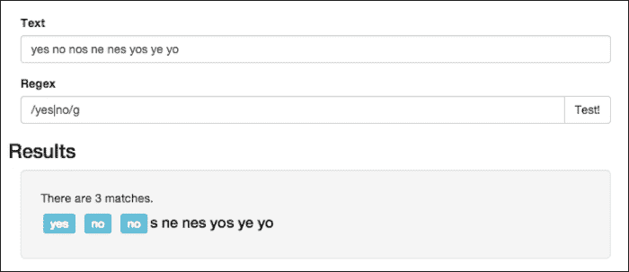

好吧，至少它几乎会，尽管它仍然会在`nos`中匹配`no`。然而，这是因为我们一直在使用开放模式，而不是真正强制执行完整的单词(这是下一章的主题)。

然而，管道字符并不仅限于两个选项，我们可以通过按管道字符分割每个选项来轻松匹配大量的值。此外，我们并不局限于只使用纯文本，我们的 Regex 分割中的每个片段都可以使用范围和乘数作为自己的模式。

# 为电话号码创建正则表达式

为了将这一章联系起来，让我们将刚刚学习到的一些特性放在一起，并构建我们在上一章中使用的电话号码模式。总而言之，我们希望能够匹配以下所有数字模式:

```js
123-123-1234
(123)-123-1234
1231231234
```

首先，我们可以看到前三个数字(区号)周围有可选的括号，数字之间也有可选的破折号。这是问号字符派上用场的情况。对于数字本身，我们可以使用一个内置的匹配器来指定它们必须是数字，并使用一个强大的乘数来指定我们到底需要多少。这里我们需要知道的唯一特殊的事情是括号包含特殊的字符，所以我们需要对它们进行转义(添加一个反斜杠):

```js
/\(?\d{3}\)?-?\d{3}-?\d{4}/g
```

### 注

圆括号用于定义正则表达式中的组，这就是为什么它们是特殊字符。我们将在[第 3 章](3.html "Chapter 3. Special Characters")、*特殊人物*中学习定义群组。

使用我们在[第 1 章](1.html "Chapter 1. Getting Started with Regex")、*中开发的测试应用测试这个正则表达式，并使用本主题开头提到的示例，将显示正则表达式匹配所有示例:*

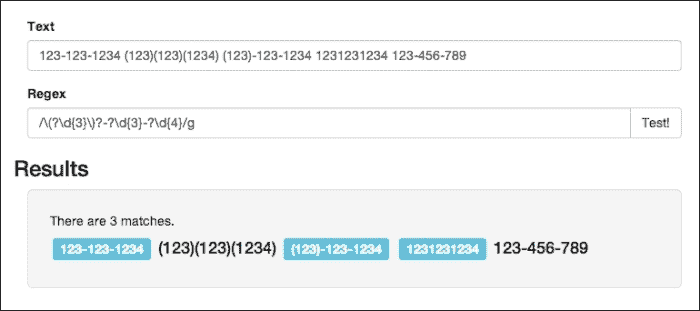

# 总结

在本章中，我们学习了如何使用字符类来定义通配符匹配、数字匹配和字母数字匹配。我们还学习了如何定义量词，它指定一个字符或组在一个输入中可以出现多少次。

在下一章中，我们将了解边界(可用于匹配 Regex 的位置)和定义组。