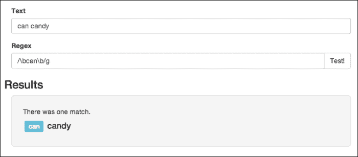
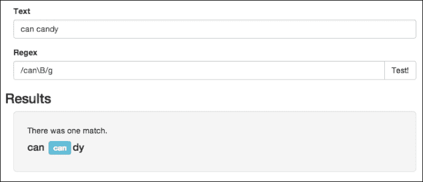
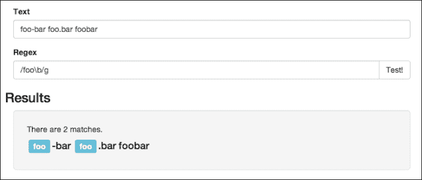
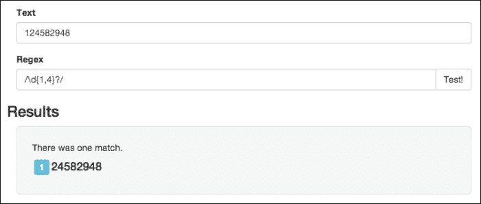
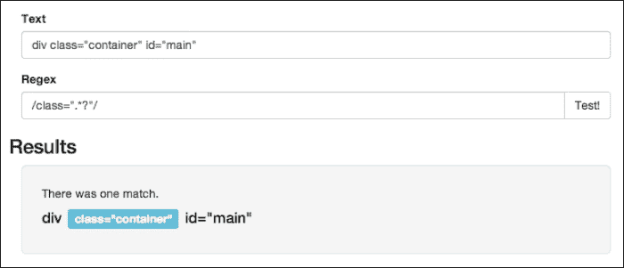

# 三、特殊字符

在这一章中，我们将了解一些特殊的角色和一些更先进的技术，它们将帮助我们创建更详细的 **Regex** 模式。我们也将慢慢地从使用我们的 Regex 测试环境过渡到使用标准的 JavaScript 来构建更多的*完整的*真实世界的例子。

在我们超越自己之前，仍然有一些事情我们可以使用当前的设置来学习，从一些约束开始。

在本章中，我们将涵盖以下主题:

*   为 Regex 定义边界
*   定义非 reedy 量词
*   用组定义 Regex

# 非视觉约束

到目前为止，我们在模式上设置的所有约束都与可以显示或不能显示的字符有关，但是 Regex 提供了一些位置约束，允许您过滤掉一些误报。

## 匹配输入的开始和结束

第一套是火柴的*起点*和*终点*。使用(`^` ) *插入符号字符*来匹配字符串的开头，使用(`$`)美元符号来匹配结尾，我们可以强制将一个模式定位在这些位置，例如，您可以在一个单词的末尾添加美元符号，以确保它是提供的字符串中的最后一个。在下一个例子中，我使用了`/^word|word$/g`模式来匹配`word`的出现，它要么开始一个字符串，要么结束一个字符串。下图举例说明了给定**文本**输入时正则表达式的匹配情况:


同时使用开始和结束字符可以确保您的模式是字符串中唯一的东西。例如，如果您有一个`/world/`模式，它将匹配`world`字符串以及任何其他仅包含`world`的字符串，如`hello world`。但是，如果你想确定字符串只包含`world`，你可以将模式修改为`/^world$/`。这意味着 Regex 将试图找到开始和结束字符串的模式。当然，只有当它是字符串中唯一的东西时，才会发生这种情况。

这是默认行为，但值得一提的是，情况并非总是如此。在前一章中，我们看到了`m`或多行标志，这个标志的作用是使插入符号字符不仅匹配字符串的开头，而且匹配任何一行的开头。美元符号也是如此:它将匹配每一行的结尾，而不是整个字符串的结尾。所以，这真的可以归结为你在特定情况下需要什么。

## 匹配单词边界

**单词边界** 与我们刚才看到的**字符串边界**非常相似，只是它们在单个单词的上下文中工作。比如我们想匹配`can`，但这里指的是单独指`can`，而不是`candy`中的`can`。我们在前面的例子中看到，如果你只是输入一个模式，比如`/can/g`，那么即使是另一个单词的一部分，你也会得到`can`的匹配，比如用户输入`candy`的情况。使用反斜杠(`\b`)字符，我们可以表示单词边界(在开头或结尾)，这样我们就可以使用类似于`/\bcan\b/g`的模式来修复这个问题，如下所示:



## 匹配非单词边界

与`\b`字符配对，我们有`\B`符号，这是它的逆符号。和我们在多个场合看到的类似，一个大写符号通常指的是相反的功能，也不例外。大写版本将对模式设置一个限制，使其不在单词的边缘。现在，我们将运行相同的示例文本，除了`/can\B/g`，它将交换匹配；这是因为`can`中的`n`处于其边界:



## 匹配空白字符

您可以使用反斜杠`s`字符匹配一个空白字符，它匹配空格和制表符等内容。它类似于一个词的边界，但是它确实有一些区别。首先，单词边界匹配单词的结尾，即使它是模式中的最后一个单词，这与需要额外空间的空白字符不同。所以，`/foo\b/`会匹配`foo`。但是，`/foo\s/`不会，因为字符串末尾没有后续的空格字符。另一个区别是，边界匹配器将把类似句点或破折号的内容算作实际边界，尽管空白字符仅在有空白时才匹配字符串:



### 注

值得一提的是，空白字符有一个`\S`反向匹配器，它可以匹配除空白字符以外的任何字符。

# 定义非复数量词

在前面的部分，我们看了乘数，在这里你可以指定一个模式应该重复一定的次数。默认情况下，JavaScript 会尝试匹配尽可能多的字符，这意味着它将是**贪婪匹配**。假设我们有一个类似于`/\d{1,4}/`的模式，它将匹配任何文本，并且有一个到四个数字。默认情况下，如果我们使用`124582948`，它将返回`1245`，因为它将采取最大数量的选项(贪婪方法)。但是，如果我们愿意，我们可以添加(`?`)问号运算符，告诉 JavaScript 不要使用贪婪匹配，而是返回尽可能少的字符数:



贪婪匹配是一种很难在代码中发现 bug 的东西。考虑以下示例文本:

```js
<div class="container" id="main">
   Site content  
<div>
```

如果我们想要提取类，您可以考虑用这种方式编写一个模式:

```js
/class=".*"/
```

这里的问题是`*`角色会尝试匹配尽可能多的角色，所以我们不会得到我们想要的`container`，而是得到`"container" id="main"`。由于点字符匹配任何内容，正则表达式将从`class`单词前的第一个引号匹配到`id`单词前的右引号。要解决这个问题，我们可以使用不吉利的问号，并将模式更改为`/class=".*?"/`。这将导致它停止在最低要求的匹配，也就是当我们到达第一个引号时:



# 正则表达式中的匹配组

我到现在为止遗漏的最后一个主要话题是**组**。然而，为了与组一起工作，我们必须返回到一个 JavaScript 控制台，因为这将提供我们需要查看的实际结果对象。

组显示我们如何从提供的输入中提取数据。如果没有分组，您可以检查是否匹配，或者给定的输入文本是否遵循特定的模式。然而，你不能利用模糊的定义来提取相关内容。语法相当简单:将您想要的模式包装在括号中，然后表达式的这一部分将被提取到它自己的属性中。

## 将字符组合在一起以创建子句

让我们从一些基本的东西开始——一个人的名字——在标准的 JavaScript 中。如果您有一个带有某人姓名的字符串，您可能会按空格字符分割它，并检查其中是否有两个或三个组件。如果有两个，第一个由名字组成，第二个由姓氏组成；但是，如果有三个组件，那么第二个组件将包括中间名，第三个组件将包括姓氏。

我们可以创建一个如图所示的简单模式，而不是强加这样的条件:

```js
/(\S+) (\S*) ?\b(\S+)/
```

第一组包含一个强制的非空格单词。加号将再次无限地增加模式。接下来，我们想要一个有第二个单词的空格；这一次，我用星号表示它的长度可以是零，在这之后，我们有了另一个空间，尽管这一次，它是可选的。

### 注

如果没有中间名，就不会有第二个空格，后面跟一个字边界。这是因为空格是可选的，但我们仍然希望确保出现一个新单词，然后是最后一个单词。

现在，打开一个 JavaScript 控制台(在 Chrome 中)，为这个模式创建一个变量:

```js
var pattern = /(\S+) (\S*) ?\b(\S+)/
```

然后，尝试在这个具有不同名称的模式上运行`exec`命令，有中间名称和没有中间名称，并查看这个结果输出:


不管字符串是否有中间名，它都会有我们可以分配给变量的三种模式，因此，我们可以用别的东西来代替它:

```js
var res = name.split(" ");
first_name = res[0];

if (res.length == 2) {
   middle_name = "";
   last_name = res[1];
} else {
   middle_name = res[1];
   last_name = res[2];
}
```

我们可以从前面的代码中删除条件语句(`if` - `else`)，并编写类似如下的代码:

```js
var res = /(\S+) (\S*) ?\b(\S+)/.exec(name);

first_name = res[1];
middle_name = res[2];
last_name = res[3];
```

如果省略中间的名字，我们的表达式仍然会有组，它只是一个空字符串。

还有一点值得一提的是，各组的指数都是从`1`开始的，所以第一组在结果`1`指数，结果`0`指数掌握着整场比赛。

### 捕获组和非捕获组

在第一章中，我们看到了一个例子，其中我们想要解析某种 **XML** 标记，我们说我们需要一个额外的约束，其中结束标记必须与开始标记匹配才能有效。例如，这应该被解析:

```js
<duration>5 Minutes</duration>
```

这里，这不应该被解析:

```js
<duration>5 Minutes</title>
```

由于结束标记与开始标记不匹配，引用模式中先前组的方法是使用反斜杠字符，后跟组的索引号。例如，让我们编写一个小脚本，它将接受一系列以行分隔的 **XML** 标签，然后将其转换为一个 JavaScript 对象。

首先，让我们创建一个输入字符串:

```js
var xml = [
   "<title>File.js</title>",
   "<size>36 KB</size>",
   "<language>JavaScript</language>",
   "<modified>5 Minutes</name>"
].join("\n");
```

这里，我们有四个属性，但是最后一个属性没有有效的结束标记，所以不应该被拾取。接下来，我们将循环这个模式并设置一个`data`对象的属性:

```js
var data = {};

xml.split("\n").forEach(function(line){
   match = /<(\w+)>([^<]*)<\/\1>/.exec(line);
   if (match) {
      var tag = match[1];
      data[tag] = match[2];
   }
});
```

如果我们在控制台中输出数据，您会看到我们确实获得了三个有效的属性:


不过，让我们花一个的时间来考察一下格局；我们寻找一些里面有名字的开始标签，然后我们拾取所有的字符，除了使用否定范围的开始三角形括号。之后，我们使用(`\1`)反向引用来查找结束标记，以确保它匹配。您可能还意识到我们需要转义正斜杠，所以它不会认为我们正在关闭 Regexp 模式。

### 注

一个 back 引用，当添加到正则表达式模式的末尾时，允许你在一个模式内反向引用一个子模式，这样子模式的值被记住并作为匹配的一部分。例如，`/(no)\1/`匹配`nono`中的`nono`。`\1`并被替换为模式内第一个子模式的值，或者替换为(`no`)，从而形成最终的模式。

到目前为止，我们看到的所有组都是捕获组“T2”，它们告诉正则表达式将模式的这一部分提取到自己的变量中。但是，括号还有其他组或用途，可以用来实现更多功能，其中第一个是非捕获组。

#### 匹配非捕获组

一个**非捕获组** 对一个模式的一部分进行分组，但是它实际上并没有将这个数据提取到结果数组中，或者在反向引用中使用它。这样做的一个好处是，它允许您在模式的整个部分使用字符修饰符。例如，如果我们想得到一个无限重复`world`的模式，我们可以这样写:

```js
/(?:world)*/
```

这将匹配`world`以及`worldworldworld`等等。非 capture 组的语法类似于标准组，只是它以问号和(`?:`)冒号开头。对它进行分组可以让我们将整个事物视为一个单独的对象，并使用修饰符，这些修饰符通常只对单个字符起作用。

非捕获组的另一个最常见的用法(也可以在捕获组中实现)与管道字符结合使用。管道字符允许您在图案中一个接一个地插入多个选项，例如，在我们想要匹配`yes`或`no`的情况下，我们可以创建该图案:

```js
/yes|no/
```

然而，大多数时候，这组选项只是你模式的一小部分。例如，如果我们正在解析日志消息，我们可能想要提取日志级别和消息。日志级别可以是仅有的几个选项之一(如`debug`、`info`、`error`等)，但消息将一直存在。现在，你可以写一个模式来代替这个:

```js
/[info] - .*|[debug] - .*|[error] - .*/
```

我们可以将公共部分提取到自己的非适应组中:

```js
/[(?:info|debug|error)] - .*/
```

通过这样做，我们删除了大量重复的代码。

## 匹配前瞻组

代码中最后几组组是**前瞻**组。这些组允许我们对一个模式设置一个约束，但并不是真正的在实际匹配中包含这个约束。对于非 capture 组，JavaScript 不会为一个部分创建特殊的索引，尽管它会将其包含在完整的结果中(结果的第一个元素)。对于前瞻组，我们希望能够确保在比赛后有或没有一些文本，但我们不希望在结果中出现这些文本。

例如，假设我们有一些输入文本，我们想要解析出所有的文本。com 域名。我们可能不一定想要`.com`在比赛中，只是实际的域名。在这种情况下，我们可以创建以下模式:

```js
/\w+(?=\.com)/g
```

带有`?=`字符的组将意味着我们希望它在我们的模式末尾有这个文本，但我们实际上并不想包含它；我们也必须逃离这个时期，因为它是一个特殊的角色。现在，我们可以使用这个模式来提取域:

```js
text.match(/\w+(?=\.com)/g)
```

我们可以假设我们有一个类似这样的可变文本:


### 使用负前瞻

最后，如果我们想要使用**负前瞻**，作为前瞻组中的，以确保包含的文本不遵循某个模式，我们可以简单地使用感叹号而不是等号:

```js
var text = "Mr. Smith & Mrs. Doe";

text.match(/\w+(?!\.)\b/g);
```

这将匹配所有不以句点结尾的单词，也就是说，它将从该文本中拉出名称:


# 总结

在本章中，我们学习了如何处理贪婪和非贪婪匹配。我们还学习了如何使用组来创建更复杂的正则表达式。在学习如何对 Regex 进行分组的同时，我们还学习了捕获组、非捕获组和前瞻组。

在下一章中，我们将实现本书迄今为止所学的一切，并创建一个真实的例子来匹配和验证用户输入的信息。