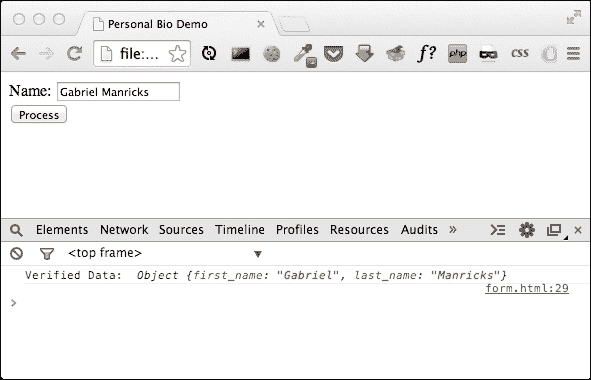

# 四、正则表达式实战

在前两章中，我们深入讨论了 Regex 的语法，现在，我们已经拥有了构建真实项目所需的所有部分，这将是本章的目标。

了解 Regex 的语法可以让您对文本模式进行建模，但是有时想出一个好的可靠的模式可能会更加困难，所以看一看一些实际的用例确实可以帮助您学习一些常见的设计模式。

因此，在本章中，我们将开发一个表单，并探讨以下主题:

*   验证名称
*   验证电子邮件
*   验证推特用户名
*   验证密码
*   正在验证网址
*   操作文本

# 正则表达式和表单验证

到目前为止，前端正则表达式最常见的用途之一是用于用户提交的表单，所以这就是我们将要构建的。我们将要构建的表单将包含所有的公共字段，例如姓名、电子邮件、网站等等，但是除了所有的验证之外，我们还将尝试一些文本处理。

在现实应用中，您通常不会手动实现解析和验证代码。您可以创建一个正则表达式并依赖一些 JavaScript 库，例如:

*   **jQuery 验证** :参考[http://jqueryvalidation.org/](http://jqueryvalidation.org/)
*   **Parsely.js**: Refer to [http://parsleyjs.org/](http://parsleyjs.org/)

    ### 注

    即使是最流行的框架也支持使用自带验证引擎的正则表达式，比如 **AngularJS** (参考[http://www.ng-newsletter.com/posts/validations.html](http://www.ng-newsletter.com/posts/validations.html))。

## 设置表单

这个演示将是一个允许用户创建在线简历的网站的，同样地，由不同类型的字段组成。然而，在我们开始之前(因为我们不会构建后端来处理表单)，我们将设置一些 HTML 和 JavaScript 代码来捕获表单提交，并提取/验证其中输入的数据。

为了保持代码整洁，我们将创建一个包含所有验证函数的数组，以及一个保存所有最终数据的数据对象。

下面是 HTML 代码的基本概要，我们从添加字段开始:

```js
<!DOCTYPE HTML>
<html>
    <head>
        <title>Personal Bio Demo</title>
    </head>
    <body>
        <form id="main_form">
            <input type="submit" value="Process" />
        </form>

        <script>
            // js goes here
        </script>
    </body>
</html>
```

接下来，我们需要编写一些 JavaScript 来捕获表单并运行我们将要编写的函数列表。如果函数返回 false，这意味着验证没有通过，我们将停止处理表单。如果我们完成了整个函数列表并且没有出现问题，我们将注销控制台和数据对象，其中包含我们提取的所有字段:

```js
<script>
    var fns = [];
    var data = {};

    var form = document.getElementById("main_form");

    form.onsubmit = function(e) {
        e.preventDefault();

        data = {};

        for (var i = 0; i < fns.length; i++) {
            if (fns[i]() == false) {
                return;
            }
        }

        console.log("Verified Data: ", data);
    }
</script>
```

JavaScript 从创建我之前提到的两个变量开始，然后我们从 DOM 中提取表单的对象并设置提交处理程序。`submit`处理程序从阻止页面实际提交开始(因为在这个例子中我们没有任何后端代码)，然后我们一个接一个地查看运行它们的函数列表。

# 验证字段

在本节中，我们将探讨如何手动验证不同类型的字段，如名称、电子邮件、网站网址等。

## 匹配完整的名称

为了让我们的脚变湿，让我们从一个简单的名称字段开始。这是我们过去短暂经历过的事情，所以它应该让你知道我们的系统将如何工作。下面的代码进入脚本标签内部，但只是在我们编写完所有内容之后:

```js
function process_name() {
    var field = document.getElementById("name_field");
    var name = field.value;

    var name_pattern = /^(\S+) (\S*) ?\b(\S+)$/;

    if (name_pattern.test(name) === false) {
        alert("Name field is invalid");
        return false;
    }

    var res = name_pattern.exec(name);
    data.first_name = res[1];
    data.last_name = res[3];

    if (res[2].length > 0) {
        data.middle_name = res[2];
    }

    return true;
}

fns.push(process_name);
```

我们获取名称字段的方式类似于获取表单的方式，然后，我们提取值，并根据模式对其进行测试，以匹配全名。如果名称与模式不匹配，我们只需提醒用户并返回`false`让表单处理程序知道验证失败。如果名称字段的格式正确，我们可以在数据对象上设置相应的字段(记住，中间的名称在这里是可选的)。最后一行只是将此函数添加到函数数组中，因此在提交表单时将调用它。

最后一件需要完成的事情是为这个表单域添加 HTML，所以在表单标签里面(就在提交按钮之前)，你可以添加这个文本输入:

```js
Name: <input type="text" id="name_field" /><br />
```

在浏览器中打开这个页面，你应该可以通过在**名称**框中输入不同的值来测试它。如果您输入有效的名称，您应该用正确的参数打印出数据对象，否则您应该能够看到以下警告消息:



### 理解完整名称 Regex

让我们回到用于匹配用户输入的名称的正则表达式:

```js
/^(\S+) (\S*) ?\b(\S+)$/
```

以下是 Regex 的简要解释:

*   `^`字符声明它在字符串开头的位置
*   第一捕捉组`(\S+)`
    *   `\S+`匹配非空白字符[ `^\r\n\t\f` ]
    *   一次和无限次之间的`+`量词
*   第二捕捉组`(\S*)`
    *   `\S*`匹配任何非空白字符[ `^\r\n\t\f` ]
    *   零到无限次数之间的`*`量词
*   `" ?"`匹配空白字符
    *   零到一次之间的`?`量词
    *   `\b`声明其在(`^\w|\w$|\W\w|\w\W`)字边界的位置
*   第三捕捉组`(\S+)`
    *   `\S+`匹配非空白字符[ `^\r\n\t\f` ]
    *   一次和无限次之间的`+`量词
*   `$`在弦的末端声明其位置

## 将电子邮件与 Regex 匹配

我们可能想添加的下一个字段类型是电子邮件字段。乍一看，电子邮件可能很简单，但是电子邮件种类繁多。你可能只是想到创建一个`word@word.word`模式，但是第一部分除了仅仅包含字母之外，还可以包含很多额外的字符，域可以是一个子域，或者后缀可以有多个部分(比如英国的`.co.uk`)。

我们的模式将简单地寻找一组字符，这些字符不是空格，也不是第一部分中使用了`@`符号的实例。然后，我们需要一个`@`符号，后跟另一组至少有一个句点的字符，后跟后缀，后缀本身可能包含另一个后缀。因此，这可以通过以下方式实现:

```js
/[^\s@]+@[^\s@.]+\.[^\s@]+/
```

### 注

我们示例的模式非常简单，不会匹配每个有效的电子邮件地址。电子邮件地址的正则表达式有一个官方标准叫做 **RFC 5322** 。更多信息，请阅读[http://www.regular-expressions.info/email.html](http://www.regular-expressions.info/email.html)。

因此，让我们将该字段添加到页面中:

```js
Email: <input type="text" id="email_field" /><br />
```

然后我们可以添加这个函数来验证它:

```js
function process_email() {
    var field = document.getElementById("email_field");
    var email = field.value;

    var email_pattern = /^[^\s@]+@[^\s@.]+\.[^\s@]+$/;

    if (email_pattern.test(email) === false) {
        alert("Email is invalid");
        return false;
    }

    data.email = email;
    return true;
}

fns.push(process_email);
```

### 注

有一个专门为电子邮件设计的 HTML5 字段类型，但是这里我们手动验证，因为这是一个 Regex 书籍。更多信息请参考[http://www.w3.org/TR/html-markup/input.email.html](http://www.w3.org/TR/html-markup/input.email.html)。

### 了解电子邮件规则

让我们回到用于匹配用户输入的名称的正则表达式:

```js
/^[^\s@]+@[^\s@.]+\.[^\s@]+$/
```

以下是对 Regex 的简要解释:

*   `^`声明字符串开头的位置
*   `[^\s@]+`匹配以下列表中不存在的单个字符:
    *   一次和无限次之间的`+`量词
    *   `\s`匹配任何空白字符[ `\r\n\t\f` ]
    *   `@`匹配`@`文字字符
*   `[^\s@.]+`匹配以下列表中不存在的单个字符:
    *   一次和无限次之间的`+`量词
    *   `\s`匹配一个[ `\r\n\t\f` ]空白字符
    *   `@.`是`@.`列表中的单个字符，字面意思
    *   `\.`字面上与`.`字符匹配
*   `[^\s@]+`匹配以下列表中不存在的单个字符:
    *   一次和无限次之间的`+`量词
    *   `\s`匹配[ `\r\n\t\f` ]一个空白字符
    *   `@`是`@`的字面字符
*   `$`声明其在字符串末尾的位置

## 匹配推特名称

我们要添加的下一个字段是推特用户名字段。对于不熟悉的人来说，推特用户名是`@username`格式，但是当人们输入这个时，他们有时会包含前面的`@`符号，而在其他情况下，他们只会自己写用户名。显然，在内部，我们希望所有的东西都被统一存储，所以我们需要提取用户名，不管`@`符号是什么，然后手动在它前面加上一个，所以不管它是否在那里，最终结果看起来都是一样的。

因此，让我们再次为此添加一个字段:

```js
Twitter: <input type="text" id="twitter_field" /><br />
```

现在，让我们编写函数来处理它:

```js
function process_twitter() {
    var field = document.getElementById("twitter_field");
    var username = field.value;

    var twitter_pattern = /^@?(\w+)$/;

    if (twitter_pattern.test(username) === false) {
        alert("Twitter username is invalid");
        return false;
    }

    var res = twitter_pattern.exec(username);
    data.twitter = "@" + res[1];
    return true;
}

fns.push(process_twitter);
```

如果用户输入`@` 符号，它将被忽略，因为我们将在检查用户名后手动添加它。

### 了解推特用户名 Regex

让我们回到用于匹配用户输入的名称的常规表达式:

```js
/^@?(\w+)$/
```

这是对 Regex 的简单解释:

*   `^`声明其在字符串开头的位置
*   `@?`与`@`字符匹配，字面意思
    *   零到一次之间的`?`量词
*   第一捕捉组`(\w+)`
    *   `\w+` 匹配[ `a-zA-Z0-9_` ]单词字符
    *   一次和无限次之间的`+`量词
*   `$`声明其在字符串末尾的位置

## 匹配密码

另一个流行的字段可以有一些独特的约束，那就是密码字段。现在，不是每个密码字段都有趣；只要该字段没有留空，您可以只允许作为密码。但是，在有些网站上，每个案例至少需要一个字母、一个数字和至少一个其他字符。考虑到所有这些可以组合的方式，创建一个可以验证这一点的模式可能会非常复杂。一个更好的解决方案是创建四个独立的模式，并确保每个模式的密码都匹配，这样可以让我们的错误信息更加详细。

对于输入，它几乎是相同的:

```js
Password: <input type="password" id="password_field" /><br />
```

`process_password`函数与前面的例子没有太大区别，我们可以看到它的代码如下:

```js
function process_password() {
    var field = document.getElementById("password_field");
    var password = field.value;

    var contains_lowercase = /[a-z]/;
    var contains_uppercase = /[A-Z]/;
    var contains_number = /[0-9]/;
    var contains_other = /[^a-zA-Z0-9]/;

    if (contains_lowercase.test(password) === false) {
        alert("Password must include a lowercase letter");
        return false;
    }

    if (contains_uppercase.test(password) === false) {
        alert("Password must include an uppercase letter");
        return false;
    }

    if (contains_number.test(password) === false) {
        alert("Password must include a number");
        return false;
    }

    if (contains_other.test(password) === false) {
        alert("Password must include a non-alphanumeric character");
        return false;
    }

    data.password = password;
    return true;
}

fns.push(process_password);
```

总的来说，你可能会说这是一个非常基本的验证，我们已经讨论过了，但是我认为这是一个聪明工作而不是努力工作的好例子。当然，我们可能已经创建了一个长模式来检查所有的东西，但是它会不那么清晰和灵活。因此，通过将其分解成更小且更易管理的验证，我们能够明确模式，同时，通过更有用的警报消息提高它们的可用性。

## 匹配网址

接下来，让我们为用户的网站创建一个字段；该字段的 HTML 为:

```js
Website: <input type="text" id="website_field" /><br />
```

一个 URL 可以有许多不同的协议，但是对于这个例子，让我们把它限制在只有 http 或 https 链接。接下来，我们有一个可选子域的域名，我们需要用后缀来结束它。后缀本身可以是一个单词，例如。或者它可以有多个细分市场，比如 as.co.uk。

总之，我们的模式看起来类似于这样:

```js
/^(?:https?:\/\/)?\w+(?:\.\w+)?(?:\.[A-Z]{2,3})+$/i
```

在这里，我们使用多个非片段组，既用于片段可选的情况，也用于我们想要重复片段的情况。您可能还注意到，我们在正则表达式的末尾使用了不区分大小写的标志(`/i`)，因为链接可以用小写或大写书写。

现在，我们将实现实际功能:

```js
function process_website() {
    var field = document.getElementById("website_field");
    var website = field.value;

    var pattern = /^(?:https?:\/\/)?\w+(?:\.\w+)?(?:\.[A-Z]{2,3})+$/i

    if (pattern.test(website) === false) {
        alert("Website is invalid");
        return false;
    }

    data.website = website;
    return true;
}

fns.push(process_website);
```

此时，您应该非常熟悉向我们的表单中添加字段并添加函数来验证它们的过程。因此，对于我们剩下的例子，让我们把我们的焦点从验证输入转移到操纵数据上。

### 了解网址正则表达式

让我们回到用于匹配用户输入的名称的正则表达式:

```js
/^(?:https?:\/\/)?\w+(?:\.\w+)?(?:\.[A-Z]{2,3})+$/i
```

这是对 Regex 的简单解释:

*   `^`在一个字符串的开头声明它的位置
*   `(?:https?:\/\/)?`为非捕捉组
    *   零到一次之间的`?`量词
    *   `http`字面匹配 http 字符(不区分大小写)
*   `s?`字面匹配`s`字符(不区分大小写)
    *   零到一次之间的`?`量词
    *   `:`字面上与`:`字符匹配
    *   `\/`字面上与`/`字符匹配
    *   `\/`字面上与`/`字符匹配
*   `\w+`匹配[ `a-zA-Z0-9_` ]单词字符
    *   一次和无限次之间的`+`量词
*   `(?:\.\w+)?`为非捕捉组
    *   零到一次之间的`?`量词
    *   `\.`字面上与`.`字符匹配
*   `\w+`匹配[ `a-zA-Z0-9_` ]单词字符
    *   一次和无限次之间的`+`量词
*   `(?:\.[A-Z]{2,3})+`为非捕捉组
    *   一次和无限次之间的`+`量词
    *   `\.`字面上与`.`字符匹配
*   `[A-Z]{2,3}`匹配列表中的单个字符
    *   `2`和`3`之间的`{2,3}`量词
    *   `A-Z`是介于 A 和 Z 之间的单个字符(不区分大小写)
*   `$`声明其在字符串末尾的位置
*   `i`修饰词:不敏感。不区分大小写的字母，意味着它将匹配 a-z 和 A-Z。

# 操纵数据

我们将在表单中再添加一个输入，用于用户描述。在描述中，我们将解析诸如电子邮件之类的东西，然后创建用户描述的纯文本和 HTML 版本。

这个表单的 HTML 非常简单；我们将使用一个标准文本框，并给它一个适当的字段:

```js
Description: <br />
<textarea id="description_field"></textarea><br />
```

接下来，让我们从开始处理表单数据所需的裸支架开始:

```js
function process_description() {
    var field = document.getElementById("description_field");
    var description = field.value;

    data.text_description = description;

    // More Processing Here

    data.html_description = "<p>" + description + "</p>";

    return true;
}

fns.push(process_description);
```

这段代码从页面上的文本框中获取文本，然后保存它的纯文本版本和 HTML 版本。在这个阶段，HTML 版本只是包装在一对段落标签之间的纯文本版本，但这是我们现在要做的。我想做的第一件事是在段落之间拆分，在文本区域中，用户可能有不同的拆分——行和段落。例如，假设用户只输入了一个新的行字符，那么我们将添加一个`<br />`标签，如果有多个字符，我们将使用`<p>`标签创建一个新段落。

## 使用字符串替换方法

我们将在字符串对象上使用 JavaScript 的 replace 方法这个函数可以接受一个 Regex 模式作为它的第一个参数，接受一个函数作为它的第二个参数；每次找到模式时，它都会调用函数，函数返回的任何内容都将被插入到匹配的文本中。

因此，对于我们的示例，我们将寻找新的行字符，在函数中，我们将根据它能够拾取多少个新的行字符来决定是用换行符还是实际的新段落来替换新行:

```js
var line_pattern = /\n+/g;
description = description.replace(line_pattern, function(match) {
    if (match == "\n") {
        return "<br />";
    } else {
        return "</p><p>";
    }
});
```

您可能注意到的第一件事是，我们需要在模式中使用`g`标志，这样它将寻找所有可能的匹配，而不是只寻找第一个。除此之外，其余的都很简单。考虑这种形式:


如果您查看前面代码的控制台输出，您应该会得到类似如下的结果:


## 匹配描述字段

下一步我们需要做的是尝试从文本中提取电子邮件，并自动将它们包装在链接标签中。我们已经介绍了一个捕获电子邮件的 Regeexp模式，但是我们需要稍微修改一下，因为我们之前的模式预期电子邮件是文本中唯一存在的东西。在这种情况下，我们对包含在大量文本中的所有电子邮件感兴趣。

如果你只是简单地寻找一个单词，你可以使用`\b`匹配器，它匹配任何边界(可以是一个单词的结尾/一个句子的结尾)，所以代替我们之前用来表示字符串结尾的美元符号，我们将放置边界字符来表示一个单词的结尾。然而，在我们的例子中，这还不够好，因为有边界字符是有效的电子邮件字符，例如，句点字符是有效的。为了避免这种情况，我们可以将边界字符与前瞻组结合使用，并说我们希望它以单词边界结束，但前提是它后面有空格或句子/字符串的结尾。这将确保我们不会切断一个子域或一个域的一部分，如果有一些无效的信息通过中间的地址。

现在，我们不是在创造一种无论电子邮件是如何输入的都可以尝试解析的东西；创建验证器和模式的目的是迫使用户输入一些合乎逻辑的东西。也就是说，我们假设如果用户写了一个电子邮件地址，然后写了一个句点，那么他/她没有输入无效的地址，而是输入了一个地址，然后结束了一个句子(句点不是地址的一部分)。

在我们的代码中，我们假设在一个地址的末尾，用户要么在后面有一个空格，比如某种标点符号，要么他/她在结束字符串`/`行。我们不再需要处理行，因为我们将它们转换成了 HTML，但是我们确实需要担心我们的模式在这个过程中没有获得一个 HTML 标签。

最后，我们的模式将如下所示:

```js
/\b[^\s<>@]+@[^\s<>@.]+\.[^\s<>@]+\b(?=.?(?:\s|<|$))/g
```

我们从单词边界开始，然后，我们寻找之前的模式。我将(`>`)大于和(`<`)小于字符添加到不允许的字符组中，这样它就不会拾取任何 HTML 标记。在模式的末尾，您可以看到我们希望以单词边界结束，但前提是它后面有一个空格、一个 HTML 标记或一个字符串的结尾。完成所有匹配的完整函数如下:

```js
function process_description() {
    var field = document.getElementById("description_field");
    var description = field.value;

    data.text_description = description;

    var line_pattern = /\n+/g;
    description = description.replace(line_pattern, function(match) {
        if (match == "\n") {
            return "<br />";
        } else {
            return "</p><p>";
        }
    });

    var email_pattern = /\b[^\s<>@]+@[^\s<>@.]+\.[^\s<>@]+\b(?=.?(?:\s|<|$))/g;
    description = description.replace(email_pattern, function(match){
        return "<a href='mailto:" + match + "'>" + match + "</a>";
    });

    data.html_description = "<p>" + description + "</p>";

    return true;
}
```

我们可以继续添加字段，但我认为重点已经被理解了。您有一个与您想要的匹配的模式，使用提取的数据，您能够提取数据并将其处理成您可能需要的任何格式。

### 理解描述 Regex

让我们回到用于匹配用户输入的名称的正则表达式:

```js
/\b[^\s<>@]+@[^\s<>@.]+\.[^\s<>@]+\b(?=.?(?:\s|<|$))/g
```

这是对 Regex 的简单解释:

*   `\b`声明其在(`^\w|\w$|\W\w|\w\W`)字边界的位置
*   `[^\s<>@]+`匹配列表中不存在的单个字符:
    *   一次和无限次之间的`+`量词
    *   `\s`匹配一个[ `\r\n\t\f` ]空白字符
    *   `<>@`是`<>@`列表中的单个字符(区分大小写)
    *   `@`字面上与`@`字符匹配
*   `[^\s<>@.]+`匹配列表中不存在的单个字符:
    *   一次和无限次之间的`+`量词
    *   `\s`匹配任何[ `\r\n\t\f` ]空白字符
    *   `<>@.`是`<>@.`列表中的单个字符(区分大小写)
    *   `\.`字面上与`.`字符匹配
*   `[^\s<>@]+`匹配列表中不存在的单个字符:
    *   一次和无限次之间的`+`量词
    *   `\s`匹配一个[ `\r\n\t\f` ]空白字符
    *   `<>@` 是`<>@`列表中的单个字符(区分大小写)
    *   `\b`声明其在(`^\w|\w$|\W\w|\w\W`)字边界的位置
*   `(?=.?(?:\s|<|$))`正向前瞻-断言下面的正则表达式可以匹配
    *   `.?`匹配任何字符(新行除外)
    *   零到一次之间的`?`量词
    *   `(?:\s|<|$)`为非捕获组:
*   第一种选择:`\s` 匹配任何空白字符[ `\r\n\t\f` ]
*   第二种选择:`<`与字符`<`字面匹配
*   第三种选择:`$`断言字符串末尾的位置
*   `g`修改器:全局匹配。返回正则表达式的所有匹配项，而不仅仅是第一个

### 解释降价示例

更多正则表达式的例子可以从流行的 **标记**语法中看到(参考[http://en.wikipedia.org/wiki/Markdown](http://en.wikipedia.org/wiki/Markdown))。这是一种用户被迫以自定义格式写东西的情况，虽然还是一种格式，省去了打字，更容易理解。例如，要在 Markdown 中创建链接，您可以键入类似如下的内容:

```js
[Click Me](http://gabrielmanricks.com)
```

这将被转换为:

```js
<a href="http://gabrielmanricks.com">Click Me</a>
```

不考虑对 URL 本身的任何验证，这可以使用以下模式轻松实现:

```js
/\[([^\]]*)\]\(([^(]*)\)/g
```

看起来有点复杂，因为方括号和括号都是需要转义的特殊字符。基本上，我们说的是，我们想要一个开方括号，直到结束方括号，然后我们想要一个开括号，再次，直到结束括号的任何东西。

### 类型

写减价文件的好网站是[http://dillinger.io/](http://dillinger.io/)。

由于我们将每个部分包装到它自己的捕获组中，我们可以编写这个函数:

```js
text.replace(/\[([^\]]*)\]\(([^(]*)\)/g, function(match, text, link){
    return "<a href='" + link + "'>" + text + "</a>";
});
```

在我们的操作示例中，我们没有使用捕获组，但是如果您使用它们，那么回调的第一个参数是整个匹配(类似于我们一直在使用的匹配)，然后所有的单个组作为后续参数传递，按照它们在模式中出现的顺序。

# 总结

在本章中，我们介绍了几个例子，向我们展示了如何验证用户输入以及如何操作它们。我们还研究了一些常见的设计模式，并发现有时简化问题比在一个模式中使用暴力来创建验证更好。

在下一章中，我们将通过开发一个带有 **Node.js** 的应用来继续探索一些现实世界的问题，该应用可以用来读取一个文件并提取其信息，以更加用户友好的方式显示它。