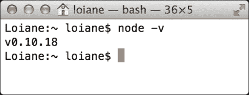
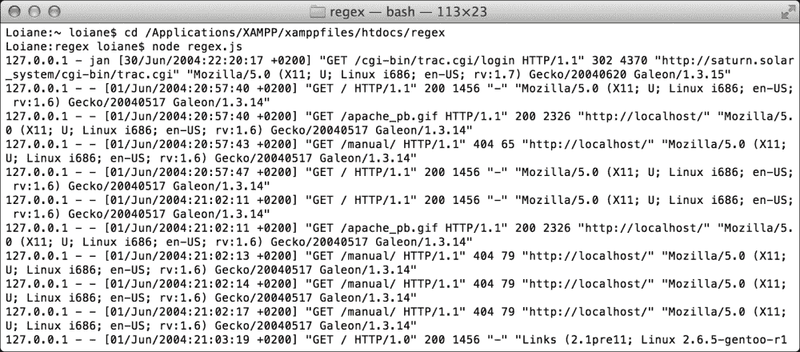
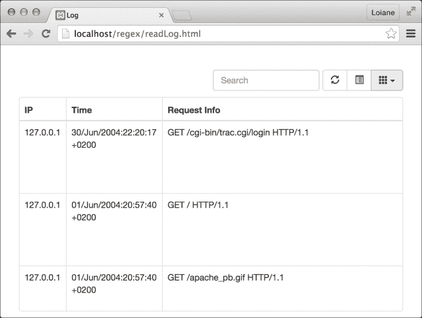
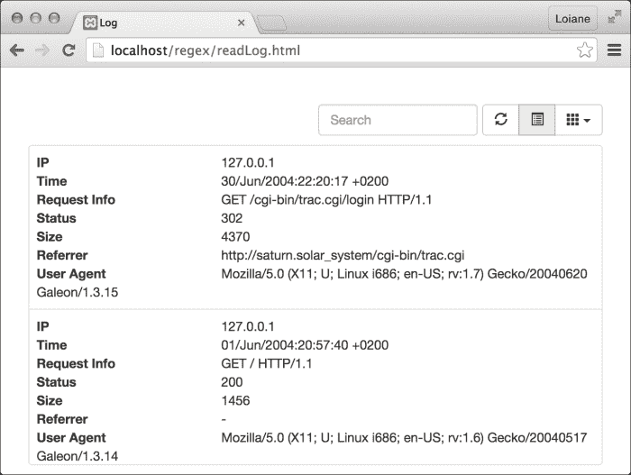

# 第五章。Node.js 和 Regex

到目前为止，我们已经从学习如何为不同的情况创建正则表达式中获得了乐趣。但是，您可能想知道在现实世界中应用正则表达式会是什么样子，例如读取日志文件并以用户友好的格式呈现其信息？

在本章中，我们将学习如何实现一个简单的 **Node.js** 应用程序，该应用程序读取一个日志文件并使用正则表达式对其进行解析。这样，我们可以从中检索特定的信息，并以不同的格式输出。我们将测试从本书前几章中获得的所有知识。

在本章中，我们将涵盖以下主题:

*   安装开发我们示例所需的软件
*   用 Node.js 读取文件
*   分析 Apache 日志文件的结构
*   使用正则表达式创建解析来读取 Apache 日志文件

# 设置节点

既然我们将开发一个 Node.js 应用程序，那么第一步就是安装 Node.js。我们可以从[http://nodejs.org/download/](http://nodejs.org/download/)获得。只需按照下载说明，我们将在我们的计算机上设置它。

### 注

如果这是你第一次使用 Node.js，请浏览 https://nodejs.org/ T2 的教程。

为了确保我们安装了 Node.js，请打开终端应用程序(命令提示符，如果您使用的是 Windows)，然后键入`node –v`。安装的 Node.js 版本应该显示如下:



我们现在可以走了！

# 开始使用我们的应用程序

让我们开始用 Node.js 开发我们的示例应用程序，它将读取一个日志文件，并使用正则表达式解析其信息。我们将在一个 JavaScript 文件中创建所有需要的代码，我们将其命名为`regex.js`。在我们开始编码之前，我们将执行一个简单的测试。在`regex.js`内增加以下内容:

```js
console.log('Hello, World!');
```

接下来，在终端应用程序中，从创建文件的目录中执行`regex.js`命令节点。**你好，世界！**信息应显示如下:


带有 Node.js 的 hello world 应用程序被创建，并且它可以工作！我们现在可以开始编写我们的应用程序了。

## 用 Node.js 读取文件

由于我们应用的主要目标是读取文件，所以我们需要应用将要读取的文件！我们将使用一个示例 Apache 日志文件。互联网上有很多文件，但是我们将使用可以从[http://fossies.org/linux/source-highlight/tests/access.log](http://fossies.org/linux/source-highlight/tests/access.log)下载的日志文件。将文件放在创建`regex.js`文件的同一目录中。

### 注

本书的源代码包中也提供了这个示例 Apache 日志文件。

要用 Node.js 读取文件，我们需要导入 Node.js 文件系统模块。删除我们放在`regex.js`文件中的`console.log`消息，并添加以下代码行:

```js
var fs = require('fs');
```

### 注

要了解更多关于 Node.js 文件系统模块的信息，请阅读 http://nodejs.org/api/fs.html T2 的文档。

下一步是打开文件并读取其内容。我们将使用以下代码来实现这一点:

```js
fs.readFile('access.log', function (err, data) {//#1

  if (err) throw err;//#2

  var text = data.toString();//#3

  var lines = text.split('\n');//#4

  lines.forEach(function(line) {//#5
    console.log(line);//#6
  });
});
```

根据 Node.js 文档，`readFile`函数(`#1`)可以接收三个参数:文件名(`access.log`)、某些选项(在本例中我们没有使用)以及当文件内容加载到内存中时将执行的回调函数。

### 注

要了解更多关于`readLine`功能的，请访问[http://nodejs . org/API/fs . html # fs _ fs _ readfile _ filename _ options _ callback](http://nodejs.org/api/fs.html#fs_fs_readfile_filename_options_callback)。

回调函数接收两个参数。第一个是错误。万一出了问题，就会抛出异常(`#2`)。第二个参数是`data`，包含文件内容。我们将把一个包含所有文件内容的字符串存储在一个名为`text` ( `#3`)的变量中。

然后，日志的每条记录都被放在文件的一行中。因此，我们可以将文件记录进行分离，并将其存储到一个数组中(`#4`)。我们现在可以迭代保存日志行(`#5`)的数组，并在每行中执行一个操作。在这种情况下，我们现在只是输出`console` ( `#6`)中每一行的内容。我们将在下一节用不同的逻辑替换代码的第`#6`行。

如果我们执行`regex.js` 命令节点，所有的文件内容应该是显示如下:



# 阿帕奇日志文件的剖析

在我们创建与 Apache 文件的一行匹配的正则表达式之前，我们需要了解它包含什么样的信息。

我们来看看`access.log`的一句台词:

```js
127.0.0.1 - jan [30/Jun/2004:22:20:17 +0200] "GET /cgi-bin/trac.cgi/login HTTP/1.1" 302 4370 "http://saturn.solar_system/cgi-bin/trac.cgi" "Mozilla/5.0 (X11; U; Linux i686; en-US; rv:1.7) Gecko/20040620 Galeon/1.3.15"
```

我们正在读取的 Apache 访问日志遵循`%h %l %u %t \"%r\" %>s %b \"%{Referer}i\" \"%{User-agent}i\"`格式。让我们来看看每个部分:

*   `%h`:日志的第一部分是(`127.0.0.1` ) IP 地址
*   `%l`:在第二部分，输出中的连字符表示请求的信息不可用
*   `%u`:第三部分是请求(`jan`)文档的人的用户 ID。
*   `%t`:第四部分是接收请求所花费的时间，如(`[30/Jun/2004:22:20:17 +0200]`)。它采用`[day/month/year:hour:minute:second zone]`格式，其中:
    *   `day`= 2 *位
    *   `month`= 3 *个字母
    *   `year`= 4 *位
    *   `hour`= 2 *位
    *   `minute`= 2 *位
    *   `second`= 2 *位
    *   `zone`=(``+' | `-'`)4 *位
*   `\"%r\"`:第五部分是来自客户端的用双引号给出的请求行，如(`"GET /cgi-bin/trac.cgi/login HTTP/1.1"`)
*   `%>s`:第六部分是服务器发回(`302`)客户端的状态码
*   `%b`:第七部分是返回给(`4370`)客户端的对象大小
*   `\"%{Referer}i\"`:第八部分是客户报告被引用的站点，用双引号给出，如(`"http://saturn.solar_system/cgi-bin/trac.cgi"`)
*   `\"%{User-agent}i\"`:第九个也是最后一个部分是用户代理 HTTP 请求头，也用双引号给出，比如(`"Mozilla/5.0 (X11; U; Linux i686; en-US; rv:1.7) Gecko/20040620 Galeon/1.3.15"`)

所有的部分都被一个空格隔开。有了这些信息和之前给出的信息，我们可以开始创建我们的正则表达式。

### 注

有关 Apache 日志格式的更多信息，请阅读[http://httpd.apache.org/docs/2.2/logs.html](http://httpd.apache.org/docs/2.2/logs.html)。

## 创建 Apache 日志正则表达式

在 Apache 访问日志文件中，我们有九个部分要从文件的每一行中识别和提取。在创建 Regex 时，我们可以尝试两种方法:我们可以非常具体或更通用。如前所述，最强大的正则表达式是通用的。我们也将在本章中尝试实现这些表达。

例如，对于日志的第一部分，我们知道它是一个 IP 地址。我们可以具体一点，对(`^\b\d{1,3}\.\d{1,3}\.\d{1,3}\.\d{1,3}\b`)IP 使用一个 Regex，或者如我们所知，日志以我们可以使用的 IP 开头，例如`^(\S+)`，其中，`^`表示它匹配输入的开头，`\S`匹配除空白之外的单个字符。`^(\S+)`表达式将与日志的第一部分完全匹配，该部分由一些特定的信息组成，直到找到一个空间(如 IP 地址)。而且`^(\S+)`比使用`^\b\d{1,3}\.\d{1,3}\.\d{1,3}\.\d{1,3}\b`更简单，我们还是达到了同样的效果。

让我们继续测试迄今为止造成的常规衰退:


为了概括我们在[第 1 章](1.html "Chapter 1. Getting Started with Regex")、*中所学的内容，开始使用 Regex* ，`exec`方法执行字符串匹配的搜索。它返回一个信息数组，因为它是字符串匹配的第一个位置，然后是 Regex 每个部分的后续位置。

对于第二和第三部分，我们可以继续使用`^(\S+)`正则表达式。第二和第三部分可以包含某些信息(包括一组字母数字字符)，也可以包含连字符。我们对每个部分的信息感兴趣，直到它找到一个空间。因此，我们可以在我们的 Regex 中再添加两个【T1:`^(\S+) (\S+) (\S+)`并测试它:


识别测井曲线的前三个部分。

### 为时间部分创建正则表达式

第四部分是括号内给出的时间。将与日志中的时间匹配的正则表达式是`\[([^:]+):(\d+:\d+:\d+) ([^\]]+)\]`。

让我们看看如何才能达到这个结果。

首先，我们有开括号和闭括号。我们不能简单地使用`[]`作为正则表达式的一部分，因为正则表达式中的括号代表一组字符(我们在[第三章](3.html "Chapter 3. Special Characters")、*特殊字符*中学习的组)。因此，我们需要在每个括号前使用(`\` ) scape 字符，这样我们就可以将括号表示为正则表达式的一部分。

Regex 的下一段时间是`"([^:]+):"`。在左括号之后，我们希望匹配任何字符，直到找到(`:`)冒号。我们在[第 2 章](2.html "Chapter 2. The Basics")、*基础知识*中学习了否定范围，这正是我们要使用的。我们期望除了冒号之外的任何字符都存在，所以我们使用`[ˆ:]`来表示它。此外，它可以由一个或多个字符组成，如(`+`)。接下来，我们期待一个(`:`)冒号。有了这个正则表达式，我们就可以匹配`"[30/Jun/2004:" from "[30/Jun/2004:22:20:17 +0200]"`。

同一个 Regex 可以表示为`"(\d{2}\/\w{3}\/\d{4}):"`，由于日以两位数的形式给出，月以三位字符给出，年以四位数字给出，用`\`隔开。

Regex 的下一个片段是`(\d+:\d+:\d+)`。它将与示例中的`22:20:17`相匹配。`\d`字符匹配任意数字(`+`匹配一个或多个数字)，后跟一个(`:`)冒号。我们也可以使用(`\d{2}:\d{2}:\d{2}`)，因为小时、分钟和秒各由两位数字表示。

最后一段是`([^\]]+)\]`。我们期待除`"]" ([^\]] – negate ] )`以外的任何角色。这将匹配时区(+0200)。我们也可以使用`([\+|-]\d{4})`作为 Regex，因为区域格式是`+`或`-`，后跟四位数字。

当我们测试正则表达式时，我们会得到这样的结果:


### 注

请注意，每段时间都被一个子集分割(日期、时间和区域)，由括号组“()”分隔。如果我们想把时间作为一个整体，我们可以删除子集:`\[(\d{2}\/\w{3}\/\d{4}:\d{2}:\d{2}:\d{2} [\+|-]\d{4})\]`。

### 为请求信息创建正则表达式

在我们分开的部分之后(在这个部分之前的几个部分)，让我们处理日志的第五部分，也就是请求信息。

让我们看一下“`GET /cgi-bin/trac.cgi/login HTTP/1.1`”示例，这样我们就可以从中创建一个正则表达式。

请求用双引号给出，这样我们就知道要在`\" \"`内部创建一个正则表达式。从前面的例子来看，有三个部分(`GET`、`/cgi-bin/trac.cgi/login`和`HTTP/1.1`)。所以，`GET`可以用`(\S+)`来代表。

接下来，我们有`/cgi-bin/trac.cgi/login`。我们将使用`(.*?)`，意思是，它可以是任何字符，也可以不是别的。我们将使用这个，因为我们不知道这个信息的格式。

然后，我们有`HTTP/1.1`协议，为了匹配它，我们也将使用`(\S+)`。

这将是我们尝试匹配正则表达式时的结果:


### 类型

如果我们想要分别检索请求的每个部分(例如方法、资源和协议)，我们可以暂时使用`()`，就像我们在第一种方法中使用的那样。

### 为状态代码和对象大小创建正则表达式

接下来日志的两部分很简单。第一个是状态，用`2xx`、`3xx`、`4xx`或者`5xx`表示，所以基本上是三位数。我们可以用两种方式来表示:`(\S+)`，它将匹配任何字符，直到它找到一个空格，或者`(\d{3})`。当然，我们可以更具体一些，只允许第一个数字是`2`、`3`、`4`或`5`，不过，我们不要把它复杂化。

数字也可以表示对象的大小。但是如果没有返回信息，会用连字符表示，所以`(\S+)`代表最好。或者我们也可以使用`([\d|-]+)`。

输出如下:


### 为推荐人和用户代理创建正则表达式

这两部分都是用双引号引起来的。我们可以使用`"([^"]*)"`表达式来表示信息，这意味着包括除`"`之外的任何字符。我们可以把它应用于两个部分。

加上日志最后两部分的，我们将得到如下输出:


我们匹配 Apache 访问日志的最后一行的 Regex 在这里给出:

```js
^(\S+) (\S+) (\S+) \[(\d{2}\/\w{3}\/\d{4}:\d{2}:\d{2}:\d{2} [\+|-]\d{4})\] \"(\S+ .*? \S+)\" (\d{3}) ([\d|-]+) "([^"]*)" "([^"]*)"
```

试图一次创建一个正则表达式可能是棘手和复杂的。然而，我们已经分割了每个部分，并创建了一个 Regex。在这一切结束时，我们所要做的就是把所有这些部分结合在一起。

我们现在准备继续编写我们的应用程序。

### 解析每个 Apache 日志行

我们现在知道了想要使用的正则表达式，所以我们需要做的就是在代码中添加(`#1`)正则表达式，用每一行(`#2`)执行正则表达式，并获得结果(`#3`)。我们现在只需在控制台中输出结果(`#4`)。代码如下所示:

```js
var fs = require('fs');

fs.readFile('access.log', function (err, logData) {

  if (err) throw err;

  var text = logData.toString(),
    lines = text.split('\n'),
    results = {},
    regex = /^(\S+) (\S+) (\S+) \[(\d{2}\/\w{3}\/\d{4}:\d{2}:\d{2}:\d{2} [\+|-]\d{4})\] \"(\S+ .*? \S+)\" (\d{3}) ([\d|-]+) "([^"]*)" "([^"]*)"/; //#1

  lines.forEach(function(line) {

    results = regex.exec(line); //#2

    for (i=0; i<results.length; i++){ //#3
      console.log(results[i]); //#4
    }

  });  //#5
});
```

### 类型

**这是让 Regex 与 Node.js 协同工作的唯一方法吗？**

在这个例子中，我们使用了 JavaScript Regex，这是我们在本书中学习到的。然而，Node.js 还有其他一些包，可以让我们在使用正则表达式时更轻松。`node-regexp`包是提供了一种在使用 Node.js 时使用正则表达式的新方法的包之一。它值得一看，并在[https://www.npmjs.com/package/node-regexp](https://www.npmjs.com/package/node-regexp)花点时间玩一下。

我们将在接下来的两节中继续完成我们的代码。

#### 为每行创建一个 JSON 对象

让我们尝试对 Apache 日志的每一行做一些更有用的事情。我们将为每行创建一个 **JavaScript 对象符号** ( **JSON** )对象，并将其添加到一个数组中。为了包装我们的应用程序，我们将把 JSON 内容保存到一个文件中。

### 注

欲了解更多 JSON，请参考[http://www.json.org/](http://www.json.org/)。

因此，在正则表达式声明(位于`var`声明内部)之后，我们将添加一个新的变量，该变量将保存我们要创建的 **JSON** 对象的集合:

```js
jsonObject = [],
row;
```

代替行`#3`和`#4`，如前一节的代码所示，我们将放置这个代码:

```js
if (results){
  row = {
    ip: results[1],
    available: results[2],
    userid: results[3],
    time: results[4],
    request: results[5],
    status: results[6],
    size: results[7],
    referrer: results[8],
    userAgent: results[9],
  }

  jsonObject.push(row);
}
```

这段代码将验证正则表达式的执行是否会产生任何结果，并将创建一个名为**行**的 JSON 对象。然后，我们只需要将 JSON 对象添加到`jsonObject`数组中。

接下来，我们将构建 Node.js 应用程序的最后一部分。我们将使用我们创建的 JSON 数组创建一个 JSON 文件。我们需要在代码的`#5`行放置以下代码，如前一节所示:

```js
var outputFilename = 'log.json';
fs.writeFile(outputFilename, JSON.stringify(jsonObject, null, 4), function(err) {
  if(err) {
    console.log(err);
  } else {
    console.log("JSON saved to " + outputFilename);
  }
});
```

### 注

欲了解更多 `writeFile`功能，请参考[http://nodejs . org/API/fs . html # fs _ fs _ write file _ filename _ data _ options _ callback](http://nodejs.org/api/fs.html#fs_fs_writefile_filename_data_options_callback)。

结果将是一个 JSON，其内容类似于以下内容:

```js
[
  {
    "ip": "127.0.0.1",
    "available": "-",
    "userid": "jan",
    "time": "30/Jun/2004:22:20:17 +0200",
    "request": "GET /cgi-bin/trac.cgi/login HTTP/1.1",
    "status": "302",
    "size": "4370",
    "referrer": "http://saturn.solar_system/cgi-bin/trac.cgi",
    "userAgent": "Mozilla/5.0 (X11; U; Linux i686; en-US; rv:1.7) Gecko/20040620 Galeon/1.3.15"
  }
  //more content
]
```

#### 在表格中显示 JSON

最后一步是创建一个简单的 HTML 页面来显示 Apache 日志内容。我们将创建一个 HTML 文件，并在其中放置以下代码:

```js
<!DOCTYPE html>
<html lang="en">
  <head>
    <title>Log</title>
    <link rel="stylesheet" href="http://netdna.bootstrapcdn.com/bootstrap/3.0.3/css/bootstrap.min.css">
    <link rel="stylesheet" href="https://cdnjs.cloudflare.com/ajax/libs/bootstrap-table/1.5.0/bootstrap-table.min.css">
    <script src="http://cdnjs.cloudflare.com/ajax/libs/jquery/2.0.3/jquery.min.js"></script>
    <script src="https://cdnjs.cloudflare.com/ajax/libs/bootstrap-table/1.5.0/bootstrap-table.min.js"></script>
    <style>
      body{
        margin-top: 30px;
        margin-right: 30px;
        margin-left: 30px;
      }
    </style>
  </head>
```

前面的代码包含了所需的 JavaScript 和 CSS 导入，这样我们就可以显示 Apache 日志了。

### 注

本例的表是使用引导表创建的。有关其用法和示例的更多信息，请访问[http://wenzhixin . net . cn/p/bootstrap-table/docs/examples . html](http://wenzhixin.net.cn/p/bootstrap-table/docs/examples.html)。

下一段也是最后一段代码是 HTML 的主体:

```js
  <body>
    <table data-toggle="table" data-url="log.json" data-cache="false" data-height="400" data-show-refresh="true" data-show-toggle="true" data-show-columns="true" data-search="true" data-select-item-name="toolbar1" >
      <thead>
        <tr>
          <th data-field="ip">IP</th>
          <th data-field="time">Time</th>
          <th data-field="request">Request Info</th>
          <th data-field="status">Status</th>
          <th data-field="size">Size</th>
          <th data-field="referrer">Referrer</th>
          <th data-field="userAgent">User Agent</th>
        </tr>
      </thead>
    </table>
  </body>
</html>
```

正文将包含一个表，该表将读取`log.json`文件的内容，解析它，并显示它。

为了能够在浏览器中打开 html 文件，我们需要一个服务器。这是因为我们的代码正在使用一个 Ajax 请求来加载由 Node.js 应用程序创建的 JSON 文件。由于我们安装了 Node.js，我们可以使用它最简单的服务器来执行我们的代码。

在终端中，执行以下命令安装服务器:

```js
npm install http-server –g

```

然后，将目录更改为您为 HTML 文件创建的目录:

```js
cd chapter05

```

最后，启动服务器:

```js
http-server

```

您将能够从`http://localhost:8080/`网址看到结果。我们可以在下图中看到最终结果:



我们还可以切换表中的结果并查看完整的数据:



现在我们已经完成了我们的示例 Node.js 应用程序，它已经读取并解析了一个 Apache 日志文件，并且可以以更友好的方式显示。

# 总结

在本章中，我们学习了如何创建一个简单的 Node.js 应用程序，该应用程序读取一个 Apache 日志文件，并使用正则表达式提取日志信息。我们能够将在本书前几章中获得的知识付诸实践。

我们还了解到，要创建一个非常复杂的 Regex，最好分部分进行。我们了解到，在创建正则表达式时，我们可以非常具体，或者我们可以更通用并获得相同的结果。

随着新版本 **EcmaScript** 的创建(EcmaScript 6，它将为 JavaScript 增加许多新功能)，熟悉一下与正则表达式相关的改进也是很好的。更多信息请访问[http://www.ecmascript.org/dev.php](http://www.ecmascript.org/dev.php)。

我们希望你喜欢这本书！祝创建正则表达式愉快！