# 二、组成三维场景的基本组件

在上一章中，您学习了Three.js 的基础知识。我们展示了几个例子，您创建了第一个完整的Three.js 场景。在这一章中，我们将更深入地探讨Three.js，并解释组成Three.js 场景的基本组件。在本章中，您将探讨以下主题:

*   在三维场景中使用的组件
*   你能用`THREE.Scene`对象做什么
*   几何图形和网格是如何关联的
*   正投影相机和透视相机的区别

我们先来看看如何创建场景和添加对象。

# 创建场景

在上一章中，你创建了`THREE.Scene`，所以你已经知道了 Three.js 的基础知识。我们看到，为了让场景显示任何东西，我们需要三种类型的组件:

<colgroup><col style="text-align: left"> <col style="text-align: left"></colgroup> 
| 

成分

 | 

描述

 |
| --- | --- |
| 照相机 | 这决定了屏幕上呈现的内容。 |
| 光 | 这些对创建阴影效果时如何显示和使用材质有影响(在[第 3 章](03.html "Chapter 3. Working with the Different Light Sources Available in Three.js")、*中详细讨论了使用Three.js* 中可用的不同光源)。 |
| 目标 | 这些是从相机视角渲染的主要对象:立方体、球体等。 |

`THREE.Scene`作为所有这些不同物体的容器。这个对象本身没有那么多选项和功能。

### 注

`THREE.Scene`是一种结构，有时也称为场景图。场景图是一种能够保存图形场景的所有必要信息的结构。在 Three.js 中，这意味着`THREE.Scene`包含渲染所需的所有对象、灯光和其他对象。有趣的是，场景图，顾名思义，不仅仅是一组对象；场景图由树形结构中的一组节点组成。您可以在Three.js 中添加到场景中的每个对象，甚至`THREE.Scene`本身，都是从名为`THREE.Object3D`的基础对象延伸而来的。一个`THREE.Object3D`对象也可以有自己的子对象，你可以用它来创建一个由Three.js 解释和渲染的对象树。

## 场景的基本功能

探索场景功能的最佳方式是看一个例子。在本章的源代码中，可以找到`01-basic-scene.html`的例子。我将用这个例子来解释场景的各种功能和选项。当我们在浏览器中打开这个示例时，输出将看起来有点像下一个屏幕截图中显示的内容:

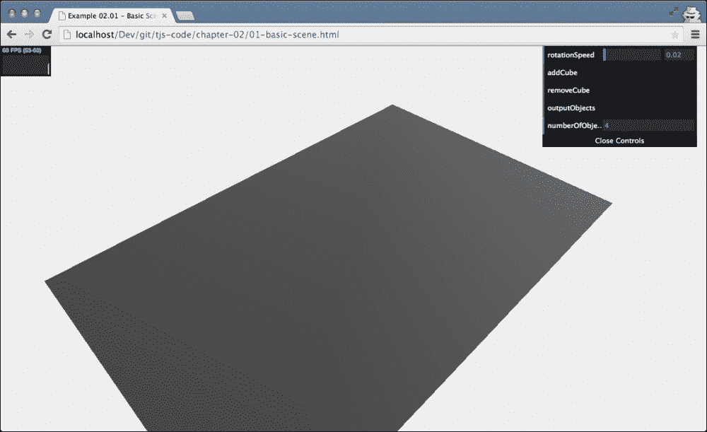

这看起来很像我们在上一章看到的例子。尽管场景看起来很空，但它已经包含了几个对象。看下面的来源，我们可以看到我们使用了`THREE.Scene`对象的`scene.add(object)`功能来添加`THREE.Mesh`(你看到的地平面)`THREE.SpotLight`和`THREE.AmbientLight`。`THREE.Camera`对象是在渲染场景时由 Three.js 自动添加的，但是手动添加到场景中是一个很好的做法，尤其是在使用多个相机时。看看下面这个场景的源代码:

```js
var scene = new THREE.Scene();
var camera = new THREE.PerspectiveCamera(45, window.innerWidth / window.innerHeight, 0.1, 1000);
scene.add(camera);
...
var planeGeometry = new THREE.PlaneGeometry(60,40,1,1);
var planeMaterial = new THREE.MeshLambertMaterial({color: 0xffffff});
var plane = new THREE.Mesh(planeGeometry,planeMaterial);
...
scene.add(plane);
var ambientLight = new THREE.AmbientLight(0x0c0c0c);
scene.add(ambientLight);
...
var spotLight = new THREE.SpotLight( 0xffffff );
...
scene.add( spotLight );

```

在我们更深入地研究`THREE.Scene`对象之前，我将首先解释您可以在演示中做什么，然后，我们将查看一些代码。在浏览器中打开`01-basic-scene.html`示例，查看右上角的控件，如下图所示:


使用这些控件，您可以将立方体添加到场景中，移除上次添加到场景中的立方体，并在浏览器的控制台中显示场景包含的所有当前对象。控制部分的最后一个条目显示了场景中对象的当前数量。启动场景时，您可能会注意到场景中已经有四个对象。这些是地平面、环境光和聚光灯，以及我们前面提到的摄像机。我们将查看控制部分的每个功能，从最简单的功能`addCube`开始，如下所示:

```js
this.addCube = function() {

  var cubeSize = Math.ceil((Math.random() * 3));
  var cubeGeometry = new THREE.BoxGeometry(cubeSize,cubeSize,cubeSize);
  var cubeMaterial = new THREE.MeshLambertMaterial({color: Math.random() * 0xffffff });
  var cube = new THREE.Mesh(cubeGeometry, cubeMaterial);
  cube.castShadow = true;
 cube.name = "cube-" + scene.children.length;
  cube.position.x=-30 + Math.round(Math.random() * planeGeometry.width));
  cube.position.y= Math.round((Math.random() * 5));
  cube.position.z=-20 + Math.round((Math.random() * planeGeometry.height));

  scene.add(cube);
 this.numberOfObjects = scene.children.length;
};
```

这段代码现在应该很容易阅读了。这里介绍的新概念不多。当您点击**添加立方体**按钮时，会创建一个新的`THREE.BoxGeometry`对象，其宽度、高度和深度设置为 1 到 3 之间的随机值。除了随机的大小，立方体还获得随机的颜色和随机的位置。

### 注

我们在这里介绍的一个新元素是，我们还使用立方体的`name`属性为其命名。其名称被设置为`cube-`，并附加当前场景中的对象数量(`scene.children.length`)。名称对于调试非常有用，但也可以用来直接访问场景中的对象。如果你使用`THREE.Scene.getObjectByName(name)`函数，你可以直接检索一个特定的对象，例如，改变它的位置，而不必使 JavaScript 对象成为一个全局变量。你可能想知道最后一行是干什么的。我们的控制图形用户界面使用`numberOfObjects`变量来列出场景中的对象数量。因此，每当我们添加或移除一个对象时，我们都将这个变量设置为更新后的计数。

我们可以从控制 GUI 调用的下一个函数是`removeCube`。顾名思义，点击**移除立方体**按钮从场景中移除最后添加的立方体。在代码中，它看起来像这样:

```js
  this.removeCube = function() {
    var allChildren = scene.children;
    var lastObject = allChildren[allChildren.length-1];
    if (lastObject instanceof THREE.Mesh) {
      scene.remove(lastObject);
      this.numberOfObjects = scene.children.length;
    }
  }
```

为了给场景添加一个对象，我们使用`add`功能。要从场景中移除对象，我们使用`remove`功能，这并不奇怪。由于 Three.js 将其子对象存储为一个列表(在末尾添加新的子对象)，因此我们可以使用`children`属性，该属性包含场景中所有对象的数组，从`THREE.Scene`对象中获取最后一个添加的对象。我们还需要检查那个物体是否是`THREE.Mesh`物体，以避免移除相机和灯光。移除对象后，我们再次更新图形用户界面属性`numberOfObjects`，它保存场景中对象的数量。

我们的图形用户界面上的最后一个按钮被标记为**输出对象**。你可能已经点击了这个，但似乎什么都没发生。该按钮将当前场景中的所有对象打印到 web 浏览器控制台，如下图所示:


向控制台日志输出信息的代码利用了内置的`console`对象:

```js
  this.outputObjects = function() {
    console.log(scene.children);
  }
```

这对于调试非常有用，尤其是当您命名对象时，发现场景中特定对象的问题非常有用。例如，`cube-17`的属性看起来是这样的(如果事先已经知道名称，也可以使用`console.log(scene.getObjectByName("cube-17")`只输出那个单个对象):

```js
__webglActive: true
__webglInit: true
_listeners: Object
_modelViewMatrix: THREE.Matrix4
_normalMatrix: THREE.Matrix3
castShadow: true
children: Array[0]
eulerOrder: (...)
frustumCulled: true
geometry: THREE.BoxGeometryid: 8
material: THREE.MeshLambertMaterial
matrix: THREE.Matrix4
matrixAutoUpdate: true
matrixWorld: THREE.Matrix4
matrixWorld
NeedsUpdate: false
name: "cube-17"
parent: THREE.Scene
position: THREE.Vector3
quaternion: THREE.Quaternion
receiveShadow: false
renderDepth: null
rotation: THREE.Euler
rotationAutoUpdate: true
scale: THREE.Vector3
type: "Mesh"
up: THREE.Vector3
useQuaternion: (...)
userData: Object
uuid: "DCDC0FD2-6968-44FD-8009-20E9747B8A73"
visible: true
```

直到现在，我们已经看到了以下场景相关的功能:

*   `THREE.Scene.Add`:这将一个对象添加到场景中
*   `THREE.Scene.Remove`:这将从场景中移除一个对象
*   `THREE.Scene.children`:这会得到场景中所有孩子的列表
*   `THREE.Scene.getObjectByName`:这将从场景中按名称获取一个特定的对象

这些都是最重要的场景相关功能，大多数情况下，你不需要更多。然而，有几个助手函数可能会派上用场，我想基于处理立方体旋转的代码来展示它们。

正如你在上一章看到的，我们使用了*渲染循环*来渲染场景。让我们看看这个例子的循环:

```js
function render() {
  stats.update();
  scene.traverse(function(obj) {
    if (obj instanceof THREE.Mesh && obj != plane ) {
      obj.rotation.x+=controls.rotationSpeed;
      obj.rotation.y+=controls.rotationSpeed;
      obj.rotation.z+=controls.rotationSpeed;
   }
  });

  requestAnimationFrame(render);
  renderer.render(scene, camera);
}
```

这里，我们看到正在使用`THREE.Scene.traverse()`功能。我们可以将一个函数传递给`traverse()`函数，该函数将为场景的每个子对象调用。如果一个孩子本身有个孩子，记住一个`THREE.Scene`对象可以包含一个对象树。也将为该对象的所有子对象调用`traverse()`函数。你遍历整个场景图。

我们使用`render()`函数来更新每个立方体的旋转(注意我们明确忽略了地平面)。我们也可以通过使用`for`循环迭代`children`属性数组来实现这一点，因为我们只向`THREE.Scene`添加了对象，而没有创建嵌套结构。

在我们深入`THREE.Mesh`和`THREE.Geometry`的细节之前，我想展示两个你可以在`THREE.Scene`对象上设置的有趣属性:`fog`和`overrideMaterial`。

## 给场景添加雾

**雾**属性让给完整的场景添加一个雾效果；物体离得越远，就越看不见，如下图所示:

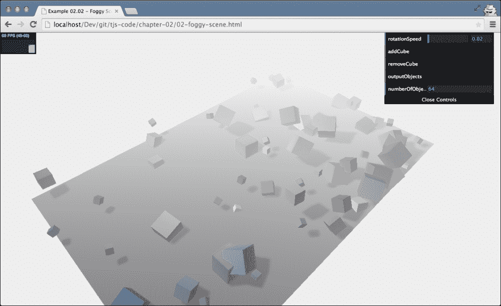

在Three.js 中启用雾真的很容易。在定义场景后，只需添加以下行代码:

```js
scene.fog=new THREE.Fog( 0xffffff, 0.015, 100 );
```

这里，我们定义一个白雾(`0xffffff`)。前面两个属性可用于调整雾的出现方式。`0.015`值设置`near`属性，`100`值设置`far`属性。有了这些属性，你可以确定雾从哪里开始，以及它变得多快变得更浓。有了`THREE.Fog`物体，雾气线性增加。也有不同的方式为场景设置薄雾；为此，请使用以下定义:

```js
scene.fog=new THREE.FogExp2( 0xffffff, 0.01 );
```

这次我们不指定`near`和`far`，只指定颜色(`0xffffff`)和雾的密度(`0.01`)。最好尝试一下这些属性，以获得您想要的效果。请注意，`THREE.FogExp2`的雾不是线性增加的，而是随着距离的增加而呈指数增加。

## 使用 overrideMaterial 属性

我们为场景讨论的最后一个属性是 **overrideMaterial** 。使用此属性时，场景中的所有对象都将使用设置为`overrideMaterial`属性的材质，而忽略设置在对象本身上的材质。

像这样使用它:

```js
scene.overrideMaterial = new THREE.MeshLambertMaterial({color: 0xffffff});
```

使用上述代码所示的`overrideMaterial`属性时，场景将呈现如下截图所示:


在上图中，您可以看到所有的立方体都是使用相同的材质和颜色渲染的。在这个例子中，我们使用了一个`THREE.MeshLambertMaterial`对象作为素材。使用这种材质类型，我们可以创建对场景中存在的灯光做出响应的不闪亮的对象。在[第 4 章](04.html "Chapter 4. Working with Three.js Materials")*使用Three.js 材质*中，您将了解到更多关于此材质的信息。

在这一节中，我们看了三个核心概念中的第一个。场景最重要的一点需要记住的是，它基本上是一个容器，包含了渲染时要使用的所有对象、灯光和相机。下表总结了最重要的功能和`THREE.Scene`对象的属性:

<colgroup><col style="text-align: left"> <col style="text-align: left"></colgroup> 
| 

功能/属性

 | 

描述

 |
| --- | --- |
| `add(object)` | 这个用来给场景添加一个对象。您也可以使用这个函数来创建对象组，我们将在后面看到。 |
| `children` | 这个返回已经添加到场景中的所有对象的列表，包括摄像机和灯光。 |
| `getObjectByName(name, recursive)` | 当你创建一个对象时，你可以给它一个不同的名字。场景对象具有一个功能，您可以使用该功能直接返回具有特定名称的对象。如果将递归参数设置为`true`，Three.js 还会搜索完整的对象树，找到具有指定名称的对象。 |
| `remove(object)` | 如果对场景中的对象有引用，也可以使用该功能将其从场景中移除。 |
| `traverse(function)` | 子属性返回场景中所有子的列表。通过遍历函数，我们还可以访问这些子对象。使用 traverse，所有的子对象都被一个接一个地传递给提供的函数。 |
| `fog` | 这个属性允许你设置场景的雾。雾会产生一层薄雾，遮住远处的物体。 |
| `overrideMaterial` | 使用此属性，您可以强制场景中的所有对象使用相同的材质。 |

在下一节中，我们将仔细查看可以添加到场景中的对象。

# 几何图形和网格

在到目前为止的每个例子中，你已经看到几何图形和网格被使用。例如，为了给场景添加一个球体，我们执行了以下操作:

```js
var sphereGeometry = new THREE.SphereGeometry(4,20,20);
var sphereMaterial = new THREE.MeshBasicMaterial({color: 0x7777ff);
var sphere = new THREE.Mesh(sphereGeometry,sphereMaterial);
```

我们定义了对象的形状和它的几何形状(`THREE.SphereGeometry`)，我们定义了这个对象看起来像什么(`THREE.MeshBasicMaterial`)和它的材质，我们将这两者组合在一个网格中(`THREE.Mesh`)这样就可以添加到场景中了。在这一节中，我们将进一步了解什么是几何图形，什么是网格。我们从几何开始。

## 几何的性质和功能

Three.js 自带了一大套开箱即用的几何图形，你可以在你的三维场景中使用。只需添加一种材质，创建一个网格，你就基本完成了。以下截图来自示例`04-geometries`，显示了Three.js 中可用的几个标准几何图形:

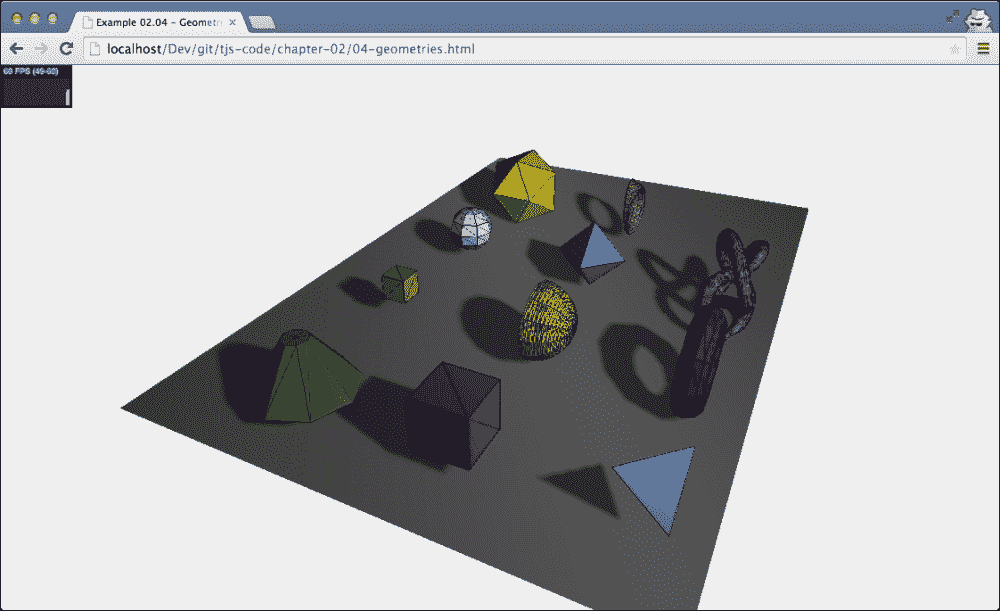

在[第 5 章](05.html "Chapter 5. Learning to Work with Geometries")、*学习使用几何图形*和[第 6 章](06.html "Chapter 6. Advanced Geometries and Binary Operations")、*高级几何图形和二元运算*中，我们将探索 trial . js 提供的所有基本和高级几何图形。现在，我们将更详细地了解几何实际上是什么。

Three.js 和大多数其他三维库中的几何图形基本上是三维空间中点的集合，也称为顶点，以及将这些点连接在一起的多个面。以立方体为例:

*   立方体有八个角。每个角都可以定义为一个 *x* 、 *y* 和 *z* 坐标。所以每个立方体在三维空间中有八个点。在 Three.js 中，这些点称为顶点，单个点称为顶点。
*   立方体有六条边，每个角都有一个顶点。在 Three.js 中，一个面总是由三个顶点组成一个三角形。所以，在立方体的情况下，每条边由两个三角形组成完整的边。

当你使用 Three.js 提供的一个几何图形时，你没有自己定义所有的顶点和面。对于立方体，您只需要定义宽度、高度和深度。Three.js 使用这些信息，创建了一个几何图形，其中八个顶点位于正确的位置，并且有正确数量的面(在立方体的情况下为 12 个)。即使您通常会使用 trial . js 提供的几何图形或自动生成几何图形，您仍然可以使用顶点和面完全手工创建几何图形。这在下面几行代码中显示:

```js
var vertices = [
  new THREE.Vector3(1,3,1),
  new THREE.Vector3(1,3,-1),
  new THREE.Vector3(1,-1,1),
  new THREE.Vector3(1,-1,-1),
  new THREE.Vector3(-1,3,-1),
  new THREE.Vector3(-1,3,1),
  new THREE.Vector3(-1,-1,-1),
  new THREE.Vector3(-1,-1,1)
];

var faces = [
  new THREE.Face3(0,2,1),
  new THREE.Face3(2,3,1),
  new THREE.Face3(4,6,5),
  new THREE.Face3(6,7,5),
  new THREE.Face3(4,5,1),
  new THREE.Face3(5,0,1),
  new THREE.Face3(7,6,2),
  new THREE.Face3(6,3,2),
  new THREE.Face3(5,7,0),
  new THREE.Face3(7,2,0),
  new THREE.Face3(1,3,4),
  new THREE.Face3(3,6,4),
];

var geom = new THREE.Geometry();
geom.vertices = vertices;
geom.faces = faces;
geom.computeFaceNormals();
```

这段代码展示了如何创建一个简单的立方体。我们在`vertices`数组中定义组成这个立方体的点。这些点被连接以创建三角形面，并存储在`faces`阵列中。例如，`new THREE.Face3(0,2,1)`使用来自`vertices`数组的点`0`、`2`和`1`创建一个三角形面。请注意，您必须注意用于创建`THREE.Face`的顶点的序列。定义它们的顺序决定了 Three.js 认为它是正面(面向相机的面)还是背面。如果创建面，则应使用顺时针顺序创建正面，如果要创建背面，则应使用逆时针顺序。

### 类型

在这个例子中，我们使用了`THREE.Face3`元素来定义立方体的六条边，每个面有两个三角形。在早期版本的 Three.js 中，您也可以使用四边形来代替三角形。四边形使用四个顶点而不是三个来定义面。使用四边形还是三角形更好是 3D 建模界的一个激烈争论。不过基本上，在建模过程中使用四边形通常是首选，因为它们比三角形更容易增强和平滑。不过对于渲染和游戏引擎来说，处理三角形通常更容易，因为每个形状都可以非常有效地渲染为三角形。

使用这些顶点和面，我们现在可以创建`THREE.Geometry`的新实例，并将顶点分配给`vertices`属性，面分配给`faces`属性。我们需要采取的最后一步是在我们创建的几何图形上调用`computeFaceNormals()`。当我们调用这个函数时，Three.js 为每个人脸确定*法线*向量。这是 Three.js 用来确定如何根据场景中的各种灯光给人脸上色的信息。

有了这个几何图形，我们现在可以像前面看到的那样创建一个网格。我创建了一个例子，你可以用它来处理顶点的位置，它也显示了各个面。在示例`05-custom-geometry`中，您可以更改立方体所有顶点的位置，并查看面的反应。如下图所示(如果控制图形用户界面挡道，可以按 *H* 隐藏):


这个示例使用了与我们所有其他示例相同的设置，有一个渲染循环。每当您在下拉式控制方块中变更其中一个属性时，都会根据其中一个顶点的变更位置来呈现立方结构。这不是开箱即用的东西。出于性能原因，Three.js 假设网格的几何形状在其生命周期内不会改变。对于大多数几何图形和用例，这是一个非常有效的假设。然而，为了让我们的示例正常工作，我们需要确保将以下内容添加到渲染循环的代码中:

```js
mesh.children.forEach(function(e) {
  e.geometry.vertices=vertices;
  e.geometry.verticesNeedUpdate=true;
  e.geometry.computeFaceNormals();
});
```

在第一行中，我们将屏幕上看到的网格顶点指向一组更新的顶点。我们不需要重新配置面部，因为它们仍然连接到与以前相同的点。在我们设置了更新的顶点之后，我们需要告诉几何图形这些顶点需要更新。我们通过将几何图形的`verticesNeedUpdate`属性设置为`true`来实现。最后，我们使用`computeFaceNormals`功能重新计算人脸以更新完整的模型。

我们将看到的最后一个几何功能是`clone()`功能。我们提到几何定义了一个对象的形式和形状，结合一个材质，我们创建了一个对象，可以通过Three.js 添加到要渲染的场景中，通过`clone()`功能，顾名思义，我们可以制作一个几何的副本，例如，使用它来创建一个不同材质的不同网格。在同一个例子`05-custom-geometry`中，你可以在控制 GUI 的顶部看到一个**克隆**按钮，如下图截图所示:

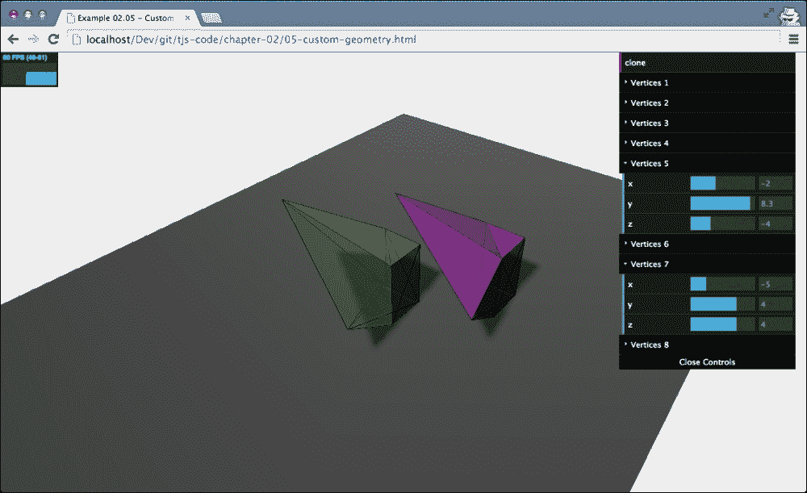

如果您单击此按钮，将按当前几何图形制作一个克隆(副本)，用不同的材质创建一个新对象，并将其添加到场景中。这个代码相当简单，但由于我使用的材质，它变得有点复杂。让我们后退一步，首先看看立方体的绿色材质是如何创建的，如以下代码所示:

```js
var materials = [
  new THREE.MeshLambertMaterial( { opacity:0.6, color: 0x44ff44, transparent:true } ),
  new THREE.MeshBasicMaterial( { color: 0x000000, wireframe: true } )
];
```

如您所见，我没有使用单一材质，而是使用了两种材质的数组。原因是，除了显示一个透明的绿色立方体，我还想给你看线框，因为它非常清楚地显示了顶点和面的位置。

当然，Three.js 支持在创建网格时使用多种材质。您可以使用`SceneUtils.createMultiMaterialObject`功能，如以下代码所示:

```js
var mesh = THREE.SceneUtils.createMultiMaterialObject( geom, materials);
```

这个函数中所做的是，它不创建一个`THREE.Mesh`对象，而是为您指定的每个材质创建一个，并将这些网格放在一个组中(一个`THREE.Object3D`对象)。该组可以像使用场景对象一样使用。您可以添加网格，按名称获取对象，等等。例如，要确保该组的所有子代都投射阴影，请执行以下操作:

```js
mesh.children.forEach(function(e) {e.castShadow=true});
```

现在，让我们回到刚才讨论的`clone()`函数:

```js
this.clone = function() {

  var clonedGeom = mesh.children[0].geometry.clone();
  var materials = [
    new THREE.MeshLambertMaterial( { opacity:0.6, color: 0xff44ff, transparent:true } ),
    new THREE.MeshBasicMaterial({ color: 0x000000, wireframe: true } )
  ];

  var mesh2 = THREE.SceneUtils.createMultiMaterialObject(clonedGeom, materials);
  mesh2.children.forEach(function(e) {e.castShadow=true});
  mesh2.translateX(5);
  mesh2.translateZ(5);
  mesh2.name="clone";
  scene.remove(scene.getObjectByName("clone"));
  scene.add(mesh2);
}
```

点击**克隆**按钮时调用这段 JavaScript。在这里，我们克隆我们立方体的第一个孩子的几何图形。记住，网格变量包含两个子变量；它包含两个网格，一个用于我们指定的每种材质。基于这个克隆的几何图形，我们创建了一个新的网格，恰当地命名为`mesh2`。我们使用平移功能移动这个新的网格(在[第 5 章](05.html "Chapter 5. Learning to Work with Geometries")、*学习使用几何图形*中有更多内容)，移除之前的克隆(如果存在)，并将克隆添加到场景中。

### 类型

在前面的部分中，我们使用了`THREE.SceneUtils`对象中的`createMultiMaterialObject`来为我们创建的几何图形添加线框。Three.js 还提供了一种使用`THREE.WireFrameHelper`添加线框的替代方法。要使用这个助手，首先像这样实例化这个助手:

```js
var helper = new THREE.WireframeHelper(mesh, 0x000000);

```

您提供了要显示线框的网格和线框的颜色。Three.js 现在将创建一个可以添加到场景中的辅助对象`scene.add(helper)`。因为这个助手在内部只是一个`THREE.Line`对象，你可以设置线框的样式。例如，要设置线框线的宽度，使用`helper.material.linewidth = 2;`。

这就足够了。

## 网格的功能和属性

我们已经了解到，要创建一个网格，我们需要一个几何图形和一种或多种材质。一旦我们有了一个网格，我们就把它添加到场景中并渲染它。有几个属性可以用来改变这个网格在场景中出现的位置和方式。在第一个示例中，我们将查看以下一组属性和函数:

<colgroup><col style="text-align: left"> <col style="text-align: left"></colgroup> 
| 

功能/属性

 | 

描述

 |
| --- | --- |
| `position` | 这个决定了这个物体相对于其父物体的位置。大多数情况下，对象的父对象是`THREE.Scene`对象或`THREE.Object3D`对象。 |
| `rotation` | 通过这个属性，你可以设置一个物体围绕它的任何一个轴的旋转。Three.js 还提供了绕轴旋转的特定功能:`rotateX()`、`rotateY()`和`rotateZ()`。 |
| `scale` | 此属性允许您围绕其 *x* 、 *y* 和 *z* 轴缩放对象。 |
| `translateX(amount)` | 该属性将对象在 *x* 轴上移动指定的量。 |
| `translateY(amount)` | 该属性在 *y* 轴上将对象移动指定的量。 |
| `translateZ(amount)` | 该属性将对象在 *z* 轴上移动指定的量。对于平移功能，您也可以使用`translateOnAxis(axis, distance)`功能，该功能允许您沿特定轴平移网格一段距离。 |
| `visible` | 如果将该属性设置为`false`，`THREE.Mesh`不会被Three.js 渲染 |

一如既往，我们为您准备了一个示例，允许您使用这些属性。如果在浏览器中打开`06-mesh-properties.html`，会出现一个下拉菜单，可以修改所有这些属性，直接看到结果，如下图截图所示:

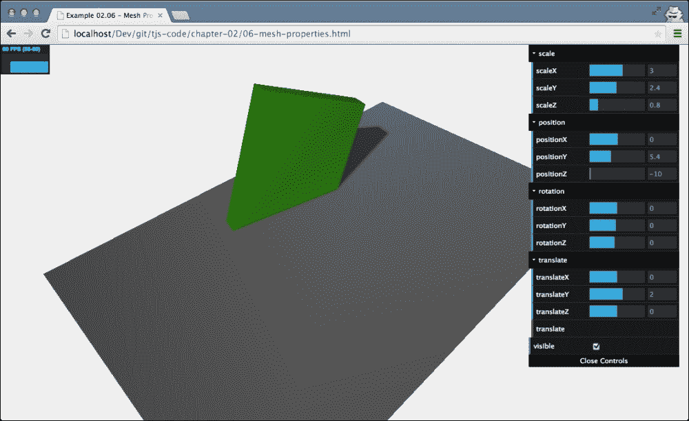

让我带您浏览一下，我将从 position 属性开始。我们已经见过这个属性几次了，所以让我们快速解决这个问题。使用此属性，您可以设置对象的 *x* 、 *y* 和 *z* 坐标。该位置相对于其父对象，父对象通常是添加对象的场景，但也可能是一个`THREE.Object3D`对象或另一个`THREE.Mesh`对象。当我们看分组对象时，我们将在[第 5 章](05.html "Chapter 5. Learning to Work with Geometries")、*学习使用几何图形*中回到这一点。我们可以用三种不同的方式设置对象的位置属性。我们可以直接设置每个坐标:

```js
cube.position.x=10;
cube.position.y=3;
cube.position.z=1;
```

但是，我们也可以一次设置全部，如下所示:

```js
cube.position.set(10,3,1);
```

还有第三种选择。`position`属性是一个`THREE.Vector3`对象。这意味着，我们还可以执行以下操作来设置该对象:

```js
cube.postion=new THREE.Vector3(10,3,1)
```

在看这个网格的其他属性之前，我想先做一个快速的回避。我提到这个位置是相对于它的父位置设置的。在上一节`THREE.Geometry`中，我们使用`THREE.SceneUtils.createMultiMaterialObject`创建了一个多材质对象。我解释说这并没有真正返回一个单独的网格，而是一组包含一个基于每个材质相同几何的网格；在我们的例子中，它是一个包含两个网格的组。如果我们改变其中一个创建的网格的位置，你可以清楚地看到它确实是两个不同的`THREE.Mesh`对象。但是，如果我们现在移动组，偏移量将保持不变，如下图所示。在[第 5 章](05.html "Chapter 5. Learning to Work with Geometries")、*学习使用几何图形*中，我们更深入地研究了父子关系以及分组如何影响变换，例如缩放、旋转和平移。


好的，接下来是`rotation`属性。在本章和上一章中，您已经看到这个属性被使用了几次。使用此属性，可以设置对象围绕其轴之一的旋转。您可以像设置位置一样设置该值。一个完整的旋转，你可能还记得数学课，是*2×π*。您可以用两种不同的方式在三个. js 中配置它:

```js
cube.rotation.x = 0.5*Math.PI;
cube.rotation.set(0.5*Math.PI, 0, 0);
cube.rotation = new THREE.Vector3(0.5*Math.PI,0,0);
```

如果你想用度数(从 0 到 360)来代替，我们必须把它们转换成弧度。这样做很容易:

```js
Var degrees = 45;
Var inRadians = degrees * (Math.PI / 180);
```

您可以使用`06-mesh-properties.html`示例来玩这个属性。

我们列表中的下一个属性是我们还没有讨论过的:`scale`。这个名字几乎概括了你可以用这个房产做什么。您可以沿着特定的轴缩放对象。如果将比例设置为小于 1 的值，对象将缩小，如下图所示:

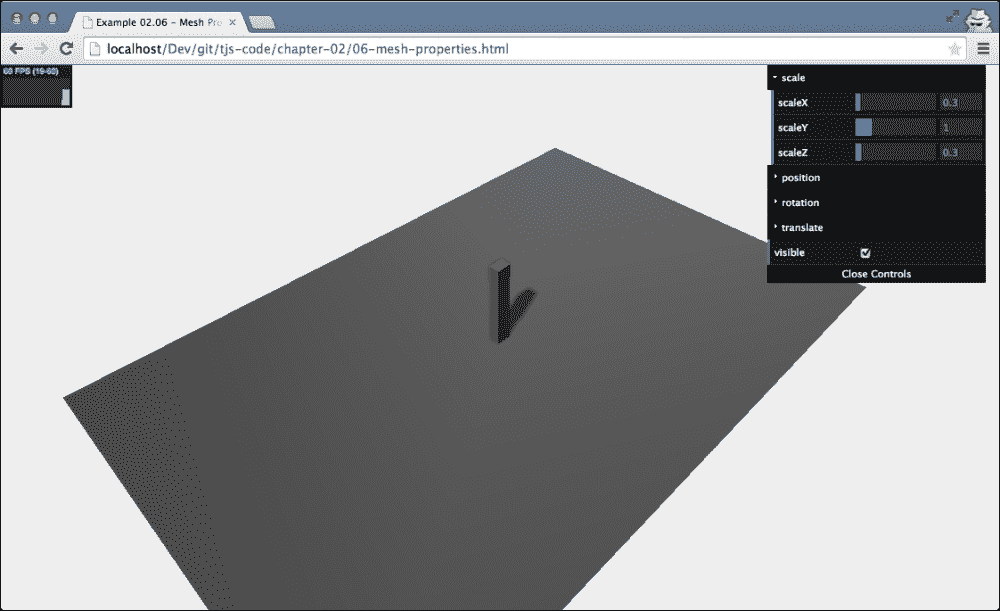

当您使用大于 1 的值时，对象会变大，如下图所示:


我们将在本章中看到的网格的下一个部分是**翻译**功能。使用平移，您也可以更改对象的位置，但是您可以定义对象相对于其当前位置应该移动到的位置，而不是定义对象的绝对位置。例如，我们有一个添加到场景中的球体，它的位置被设置为`(1,2,3)`。接下来，我们沿着对象的 *x* 轴`translateX(4)`平移对象。它现在的位置将是`(5,2,3)`。如果我们想将对象恢复到其原始位置，我们可以这样做:`translateX(-4)`。在`06-mesh-properties.html`的例子中，有一个菜单标签叫做**翻译**。从那里，您可以尝试这个功能。只需设置 *x* 、 *y* 、 *z* 的平移值，点击**平移**按钮。您将看到对象基于这三个值被移动到一个新的位置。

右上角菜单中最后一个可以使用的属性是**可见的**属性。如果点击**可见**菜单项，你会看到立方体变得不可见，如下图:


当你再次点击时，立方体再次变得可见。有关网格、几何图形以及如何使用这些对象的更多信息，请参见[第 5 章](05.html "Chapter 5. Learning to Work with Geometries")、*学习使用几何图形*和[第 7 章](07.html "Chapter 7. Particles, Sprites, and the Point Cloud")、*粒子、精灵和点云*。

# 不同用途的不同摄像头

Three.js 中有两种不同的相机类型:正投影相机和透视相机。在[第 3 章](03.html "Chapter 3. Working with the Different Light Sources Available in Three.js")、*中，我们将更详细地了解如何使用这些相机，因此在这一章中，我将坚持基础知识。解释这些相机之间差异的最好方法是看几个例子。*

## 正投影相机与透视相机

在本章的示例中，您可以找到一个名为`07-both-cameras.html`的演示。当您打开这个示例时，您会看到如下内容:

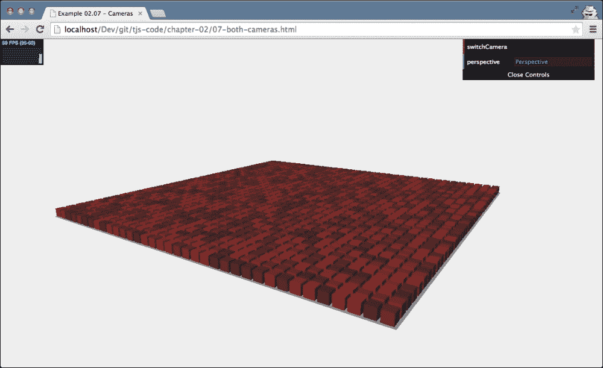

这就是所说的透视图，是最自然的视图。从这个图中可以看到，立方体离相机越远，渲染的越小。

如果我们将摄像机更改为 Three.js 支持的另一种类型，即正交摄像机，您将看到同一场景的以下视图:

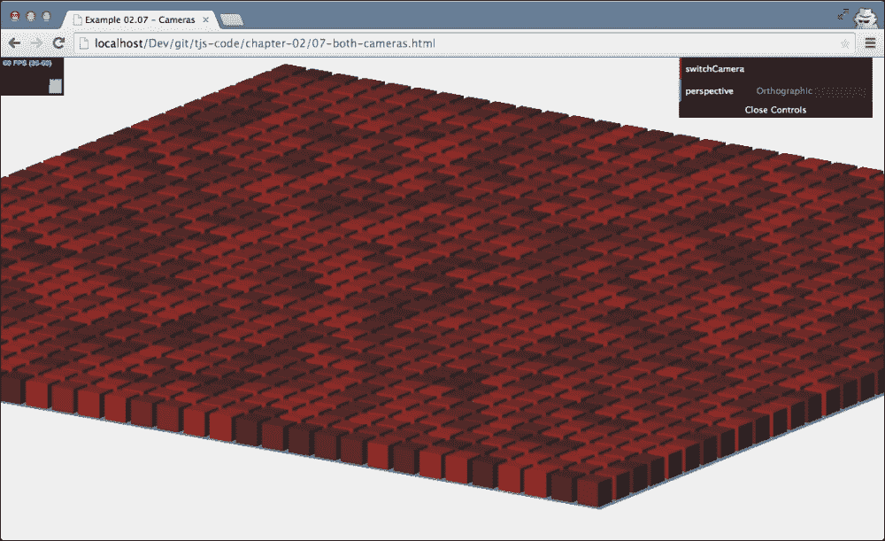

使用正投影相机，所有的立方体都渲染成相同的大小；物体和相机之间的距离并不重要。这在*模拟城市 4* 和旧版*文明*等 2D 游戏中经常用到。

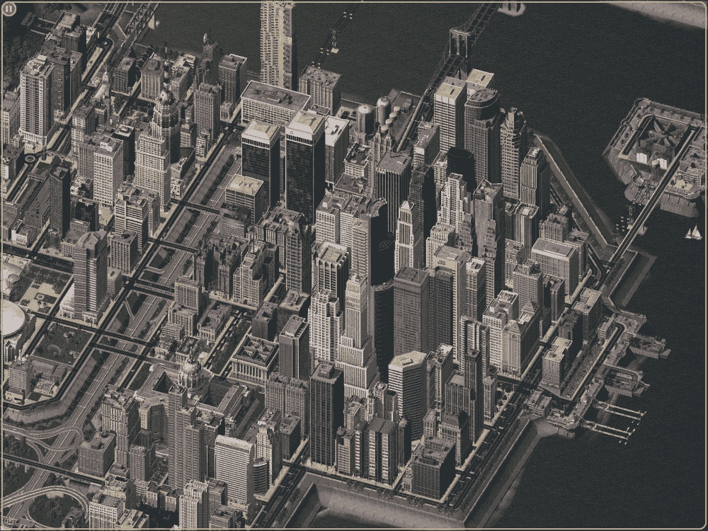

在的例子中，我们将最常使用透视相机，因为它最像真实世界。换相机真的很容易。每当您按下`07-both-cameras`示例上的切换相机按钮时，都会调用以下代码:

```js
this.switchCamera = function() {
  if (camera instanceof THREE.PerspectiveCamera) {
    camera = new THREE.OrthographicCamera( window.innerWidth / - 16, window.innerWidth / 16, window.innerHeight / 16, window.innerHeight / - 16, -200, 500 );
    camera.position.x = 120;
    camera.position.y = 60;
    camera.position.z = 180;
    camera.lookAt(scene.position);
    this.perspective = "Orthographic";
  } else {
    camera = new THREE.PerspectiveCamera(45, window.innerWidth / window.innerHeight, 0.1, 1000);

    camera.position.x = 120;
    camera.position.y = 60;
    camera.position.z = 180;

    camera.lookAt(scene.position);
    this.perspective = "Perspective";
  }
};
```

在这个表中，可以看到我们创建相机的方式是有区别的。先来看看`THREE.PerspectiveCamera`。该摄像机采用以下参数:

<colgroup><col style="text-align: left"> <col style="text-align: left"></colgroup> 
| 

争吵

 | 

描述

 |
| --- | --- |
| `fov` | **FOV** 代表**视野**。这是从摄像头的位置可以看到的场景部分。例如，人类有一个几乎 180 度的 FOV，而一些鸟类甚至可能有一个完整的 360 度 FOV。但是由于普通的电脑屏幕不能完全填满我们的视野，通常会选择较小的值。通常，在游戏中，会选择 60 到 90 度之间的 FOV。*良好默认:50* |
| `aspect` | 这个是我们要渲染输出的区域的水平和垂直尺寸之间的纵横比。在我们的例子中，因为我们使用整个窗口，所以我们只使用这个比率。纵横比决定了水平 FOV 和垂直 FOV 之间的差异，如下图所示。*好默认:窗.内宽/窗.内高* |
| `near` | `near`属性定义了渲染场景的距离。通常，我们将它设置为一个非常小的值，以便从相机的位置直接渲染所有内容。*良好默认值:0.1* |
| `far` | `far`属性定义了摄像机从摄像机的位置可以看到多远。如果设置得太低，场景的一部分可能无法渲染，如果设置得太高，在某些情况下，可能会影响渲染性能。*好默认:1000* |
| `zoom` | `zoom`属性允许您放大和缩小场景。当使用比`1`低的数字时，缩小场景，如果使用比`1`高的数字，放大场景。请注意，如果指定负值，场景将被上下颠倒渲染。*良好默认值:1* |

下图很好地概括了这些属性如何协同工作来确定您所看到的内容:

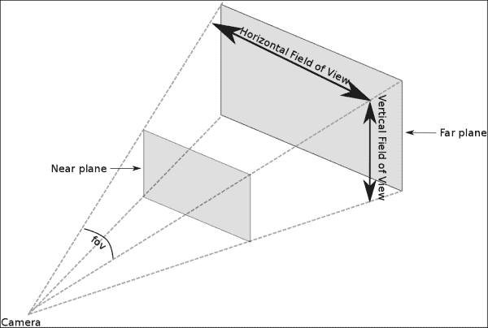

相机的`fov`属性决定了水平 FOV。基于`aspect`属性，确定垂直 FOV。`near`属性用于确定近平面的位置，`far`属性用于确定远平面的位置。将渲染近平面和远平面之间的区域。

要配置正交相机，我们需要使用其他属性。正交投影对使用的长宽比或我们观察场景的 FOV 不感兴趣，因为所有的对象都以相同的大小渲染。当你定义一个正交相机时，你所做的就是定义需要渲染的长方体区域。正交相机的属性反映了这一点，如下所示:

<colgroup><col style="text-align: left"> <col style="text-align: left"></colgroup> 
| 

争吵

 | 

描述

 |
| --- | --- |
| `left` | 这是*相机平截头体左平面*在Three.js 文档中描述的。您应该将此视为将要呈现的内容的左边界。如果您将该值设置为`-100`，您将看不到更靠左侧的任何对象。 |
| `right` | `right`属性的工作方式类似于`left`属性，但是这次在屏幕的另一边。再往右一点就不会被渲染了。 |
| `top` | 这个是要渲染的顶部位置。 |
| `bottom` | 这是要渲染的底部位置。 |
| `near` | 从这一点开始，基于摄像机的位置，场景将被渲染。 |
| `far` | 到此点，基于摄像机的位置，场景将被渲染。 |
| `zoom` | 这个可以让你放大缩小场景。当你使用低于`1`的数字时，你会缩小场景；如果你使用高于`1`的数字，你会放大。请注意，如果指定负值，场景将被上下颠倒渲染。默认值为`1`。 |

所有这些属性可以总结如下图:


## 看具体点

到目前为止，你已经看到了如何创建一个相机，以及各种各样的论点意味着什么。在前一章中，您还看到您需要将相机放置在场景中的某个位置，并且渲染了来自该相机的视图。通常，摄像机指向场景的中心:位置(0，0，0)。然而，我们可以很容易地改变相机的视角，如下所示:

```js
camera.lookAt(new THREE.Vector3(x,y,z));
```

我添加了一个相机移动的例子，它正在看的点用红点标记，如下所示:


如果打开`08-cameras-lookat`示例，会看到场景从左向右移动。场景并没有真正移动。相机在看不同的点(见中间的红点)，给人的感觉是场景从左向右移动。在本例中，您也可以将摄像机切换到正交摄像机。在这里，你可以看到改变摄像机的视角和`THREE.PerspectiveCamera`有着几乎相同的效果。不过，有趣的是，通过`THREE.OrthographicCamera`，你可以清楚地看到所有立方体的大小都保持不变，不管相机在看哪里。

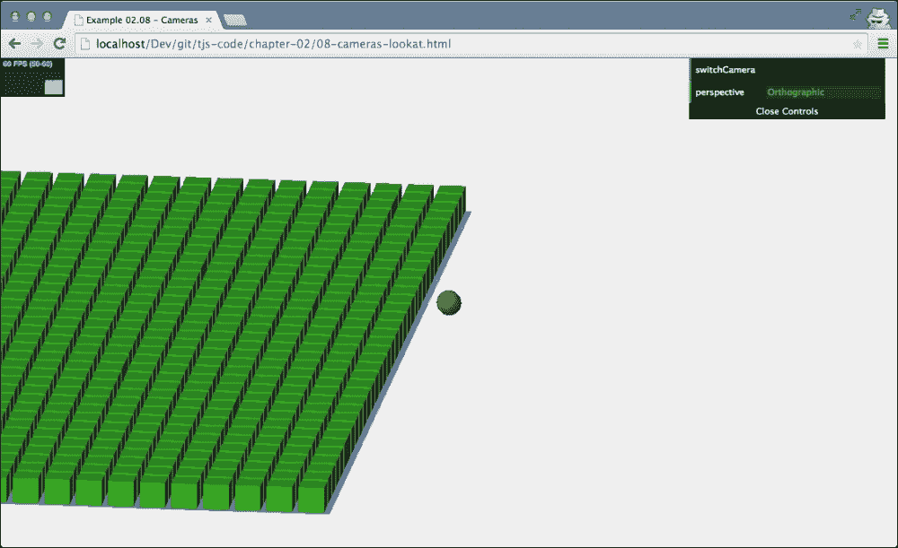

### 类型

使用`lookAt`功能时，将摄像头指向特定位置。您也可以使用它来使相机跟随场景周围的对象。由于每个`THREE.Mesh`对象都有一个属于`THREE.Vector3`对象的位置，因此可以使用`lookAt`功能指向场景中的特定网格。你所需要做的就是:`camera.lookAt(mesh.position)`。如果你在渲染循环中调用这个，你将使摄像机跟随一个物体在场景中移动。

# 总结

在第二个介绍章节中，我们讨论了很多项目。我们展示了`THREE.Scene`的所有功能和属性，并解释了如何使用这些属性来配置您的主场景。我们还向您展示了如何创建几何图形。您可以使用`THREE.Geometry`对象从头开始创建它们，也可以使用Three.js 提供的任何内置几何图形。最后，我们向您展示了如何配置 Three.js 提供的两个摄像头。`THREE.PerspectiveCamera`使用真实世界的视角渲染场景，`THREE.OrthographicCamera`提供了游戏中常见的假 3D 效果。我们还介绍了几何图形在Three.js 中是如何工作的。

在下一章中，我们将看看三个. js 中可用的各种光源。您将了解各种光源的行为，如何创建和配置它们，以及它们如何影响特定的材质。