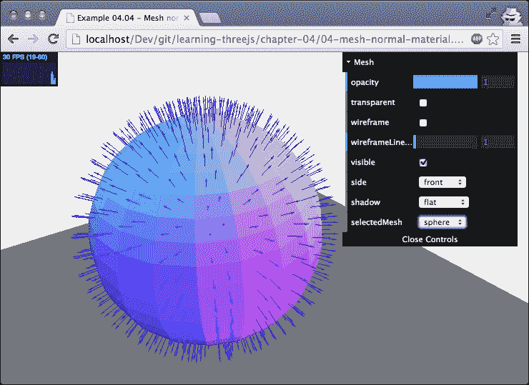
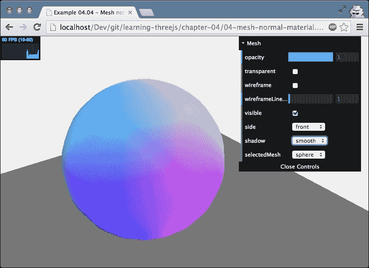
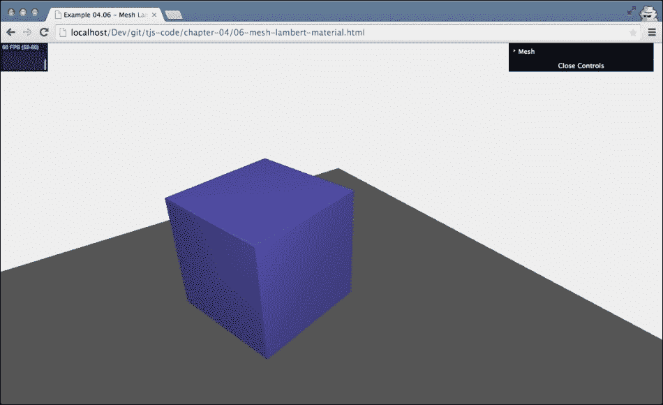
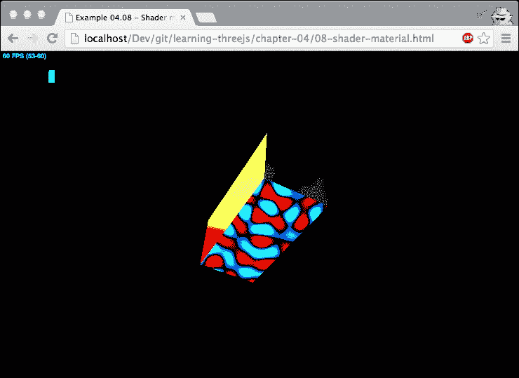
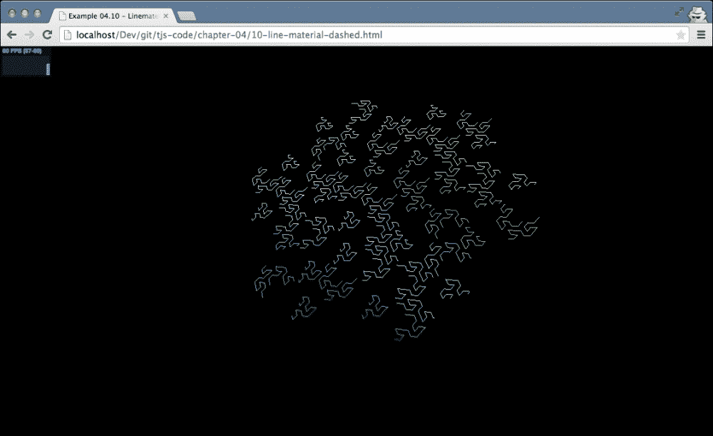

# 四、使用Three.js 材质

在前几章中，我们谈到了一些材质。你知道了一种材质和`THREE.Geometry`一起形成`THREE.Mesh`。材质就像物体的表皮，定义了几何图形的外部。例如，蒙皮定义了几何体是看起来像金属的、透明的还是显示为线框的。生成的`THREE.Mesh`对象可以添加到场景中，由Three.js 渲染。到目前为止，我们还没有真正详细地查看材质。在这一章中，我们将深入研究 Three.js 提供的所有材质，您将了解如何使用这些材质来创建好看的 3D 对象。我们将在本章中探讨的材质如下表所示:

<colgroup><col style="text-align: left"> <col style="text-align: left"></colgroup> 
| 

名字

 | 

描述

 |
| --- | --- |
| `MeshBasicMaterial` | 这个是一个基本的材质，你可以用来给你的几何图形一个简单的颜色或者显示你的几何图形的线框。 |
| `MeshDepthMaterial` | 这是一个使用与相机的距离来决定如何给你的网格着色的材质。 |
| `MeshNormalMaterial` | 这是一个简单的材质，它将人脸的颜色建立在它的法向量上。 |
| `MeshFacematerial` | 这是一个容器，允许您为几何图形的每个面指定唯一的材质。 |
| `MeshLambertMaterial` | 这是一种考虑到光照的材质，用于创建*暗淡的*不闪亮的物体。 |
| `MeshPhongMaterial` | 这个也是一种考虑到光照的材质，可以用来打造闪亮的物体。 |
| `ShaderMaterial` | 这个材质允许你指定你自己的着色器程序来直接控制顶点的位置和像素的颜色。 |
| `LineBasicMaterial` | 这个是一种可以在`THREE.Line`几何图形上用来创建彩色线条的材质。 |
| `LineDashMaterial` | 这个和`LineBasicMaterial`是一样的，但是这个材质也可以让你创建一个虚线效果。 |

如果你浏览一下Three.js 的源代码，你可能会遇到`THREE.RawShaderMaterial`。这是一种只能和`THREE.BufferedGeometry`一起使用的专用材质。此几何图形是一种专门的形式，针对静态几何图形进行了优化(例如，顶点和面不会改变)。我们不会在这一章探讨这个材质，但是我们将在[第 11 章](11.html "Chapter 11. Custom Shaders and Render Postprocessing")、*自定义着色器和渲染后处理*中使用它，当我们谈论创建自定义着色器时。在代码中，还可以找到`THREE.SpriteCanvasMaterial`、`THREE.SpriteMaterial`和`THREE.PointCloudMaterial`。这些是设定单个点的样式时使用的材质。我们不会在本章中讨论这些，但我们将在[第 7 章](07.html "Chapter 7. Particles, Sprites, and the Point Cloud")、*粒子、精灵和点云*中探讨它们。

材质有许多共同的属性，所以在我们看第一种材质`MeshBasicMaterial`之前，我们先来看看所有材质共有的属性。

# 了解常见材质特性

您可以很快看到所有材质共享哪些属性。Three.js 提供了一个材质基类`THREE.Material`，它列出了所有的公共属性。我们将这些常见的材质属性分为以下三类:

*   **基本属性**:这些是你最常使用的属性。例如，使用这些属性，您可以控制对象的不透明度，它是否可见，以及如何引用它(通过标识或自定义名称)。
*   **混合属性**:每个对象都有一组混合属性。这些属性定义了对象与其背景的组合方式。
*   **高级属性**:有多个高级属性控制低级 WebGL 上下文如何渲染对象。在大多数情况下，您不需要弄乱这些属性。

请注意，在本章中，我们将跳过任何与纹理和贴图相关的属性。大多数材质允许您使用图像作为纹理(例如，类似木头或石头的纹理)。在[第 10 章](10.html "Chapter 10. Loading and Working with Textures")、*加载和处理纹理*中，我们将深入了解各种可用的纹理和贴图选项。有些材质还具有与动画相关的特定属性(蒙皮和`morphTargets`)；我们也将跳过这些属性。这些将在[第 9 章](09.html "Chapter 9. Animations and Moving the Camera")、*动画和移动相机*中讨论。

我们从列表中的第一个开始:基本属性。

## 基本属性

`THREE.Material`对象的基本属性如下表所列(您可以在`THREE.BasicMeshMaterial`部分看到这些属性的作用):

<colgroup><col style="text-align: left"> <col style="text-align: left"></colgroup> 
| 

财产

 | 

描述

 |
| --- | --- |
| `id` | 此用于识别材质，并在创建材质时分配。对于第一个材质，从`0`开始，对于创建的每个附加材质，增加`1`。 |
| `uuid` | 这是一个唯一生成的 ID，内部使用。 |
| `name` | 您可以为具有该属性的材质指定名称。这可用于调试目的。 |
| `opacity` | 这个定义了一个物体有多透明。与`transparent`属性一起使用。该房产的范围从`0`到`1`。 |
| `transparent` | 如果此设置为`true`，Three.js 将以设置的不透明度渲染此对象。如果设置为`false`，对象将不会是透明的——只是颜色更浅。如果使用使用 alpha(透明度)通道的纹理，该属性也应该设置为`true`。 |
| `overdraw` | 当使用`THREE.CanvasRenderer`时，多边形会渲染得更大一点。使用此渲染器时，当您看到间隙时，将其设置为`true`。 |
| `visible` | 这个定义了这个材质是否可见。如果设置为`false`，就看不到场景中的物体。 |
| `Side` | 使用此属性，您可以定义将材质应用到几何图形的哪一侧。默认为`THREE.Frontside`，将材质应用到对象的前面(外部)。您也可以将其设置为`THREE.BackSide`，适用于背部(内侧)，或`THREE.DoubleSide`，适用于两侧。 |
| `needsUpdate` | 对于对素材的一些更新，你需要告诉 Three.js 素材已经更改。如果该属性设置为`true`，Three.js 将用新的材质属性更新其缓存。 |

对于每种材质，您还可以设置许多混合属性。

## 混合属性

材质有几个通用的混合相关属性。混合决定了我们渲染的颜色如何与它们后面的颜色相互作用。当我们谈论材质组合时，我们会稍微涉及这个主题。下表列出了混合特性:

<colgroup><col style="text-align: left"> <col style="text-align: left"></colgroup> 
| 

名字

 | 

描述

 |
| --- | --- |
| `blending` | 这个决定了这个物体上的材质如何与背景融合。正常模式为`THREE.NormalBlending`，只显示顶层。 |
| `blendsrc` | 除了使用标准混合模式的，您还可以通过设置`blendsrc`、`blenddst`和`blendequation`来创建自定义混合模式。此属性定义如何将此对象(源)混合到背景(目标)中。默认的`THREE.SrcAlphaFactor`设置使用 alpha(透明度)通道进行混合。 |
| `blenddst` | 该属性定义了背景(目的地)在混合中的使用方式，默认为`THREE.OneMinusSrcAlphaFactor`，这意味着该属性也使用源的 alpha 通道进行混合，但使用`1`(源的 alpha 通道)作为值。 |
| `blendequation` | 这定义了如何使用`blendsrc`和`blenddst`值。默认是添加它们(`AddEquation`)。有了这三个属性，您可以创建自己的自定义混合模式。 |

最后一组属性主要在内部使用，控制如何使用 WebGL 渲染场景的细节。

## 高级属性

我们就不深入这些属性的细节了。这些与 WebGL 内部的工作方式有关。如果你想知道更多关于这些属性的信息，那么 OpenGL 规范是一个很好的起点。您可以在[http://www . khronos . org/registry/gles/specs/2.0/es _ full _ spec _ 2 . 0 . 25 . pdf](http://www.khronos.org/registry/gles/specs/2.0/es_full_spec_2.0.25.pdf)上找到该规范。下表简要描述了这些高级属性:

<colgroup><col style="text-align: left"> <col style="text-align: left"></colgroup> 
| 

名字

 | 

描述

 |
| --- | --- |
| `depthTest` | 这个是一个高级的 WebGL 属性。使用该属性，您可以启用或禁用`GL_DEPTH_TEST`参数。该参数控制像素的*深度*是否用于确定新像素的值。通常，你不需要改变这一点。更多信息可以在我们前面提到的 OpenGL 规范中找到。 |
| `depthWrite` | 这个是另一个内在属性。此属性可用于确定此材质是否影响 WebGL 深度缓冲区。如果您将对象用于 2D 叠加(例如，集线器)，您应该将此属性设置为`false`。不过，通常情况下，您不需要更改该属性。 |
| `polygonOffset`、`polygonOffsetFactor`和`polygonOffsetUnits` | 有了这些属性，你就可以控制`POLYGON_OFFSET_FILL` WebGL 功能。这些通常是不需要的。要详细了解它们的功能，您可以查看 OpenGL 规范。 |
| `alphatest` | 该值可以设置为特定值(`0`至`1`)。每当一个像素的 alpha 值小于这个值时，它就不会被绘制。您可以使用此属性移除一些与透明度相关的工件。 |

现在，让我们看看所有可用的材质，以便您可以看到这些属性对渲染输出的影响。

# 从简单的网格开始

在这一节，我们来看几个简单的材质:`MeshBasicMaterial`、`MeshDepthMaterial`、`MeshNormalMaterial`和`MeshFaceMaterial`。我们从`MeshBasicMaterial`开始。

在我们研究这些材质的属性之前，这里有一个关于如何传入属性来配置材质的快速注释。有两种选择:

*   您可以将构造函数中的参数作为参数对象传递，如下所示:

    ```js
    var material = new THREE.MeshBasicMaterial(
    {
      color: 0xff0000, name: 'material-1', opacity: 0.5, transparency: true, ...
    });
    ```

*   或者，您也可以创建一个实例并单独设置属性，如下所示:

    ```js
    var material = new THREE.MeshBasicMaterial();
    material.color = new THREE.Color(0xff0000);
    material.name = 'material-1';
    material.opacity = 0.5;
    material.transparency = true;
    ```

通常，如果我们在创建材质时知道所有属性的值，最好的方法是使用构造函数。这两种样式中使用的参数使用相同的格式。这条规则的唯一例外是`color`属性。在第一种样式中，我们可以只传入十六进制值，而 Three.js 会自己创建一个`THREE.Color`对象。在第二种风格中，我们必须明确地创建一个`THREE.Color`对象。在本书中，我们将使用这两种风格。

## 三。网状基础材质

`MeshBasicMaterial`是一个非常简单的材质，没有考虑场景中可用的灯光。使用此材质的网格将被渲染为简单的平面多边形，并且您还可以选择显示几何图形的线框。除了我们在前面关于这种材质的章节中看到的常见属性之外，我们还可以设置以下属性:

<colgroup><col style="text-align: left"> <col style="text-align: left"></colgroup> 
| 

名字

 | 

描述

 |
| --- | --- |
| `color` | 这个属性允许你设置材质的颜色。 |
| `wireframe` | 这允许你将材质渲染为线框。这对调试非常有用。 |
| `Wireframelinewidth` | 如果您启用线框，此属性定义线框的焊线宽度。 |
| `Wireframelinecap` | 该属性定义了线的端点在线框模式下的外观。可能的值有`butt`、`round`和`square`。默认值为`round`。实际上，改变这个属性的结果很难看到。`WebGLRenderer`不支持该属性。 |
| `wireframeLinejoin` | 这个定义了如何可视化线关节。可能的值有`round`、`bevel`和`miter`。默认值为`round`。如果你仔细观察，你可以在使用低`opacity`和非常大的`wireframeLinewidth`值的例子中看到这一点。`WebGLRenderer`不支持该属性。 |
| `Shading` | 定义如何应用阴影。可能的值有`THREE.SmoothShading`、`THREE.NoShading`和`THREE.FlatShading`。默认值为`THREE.SmoothShading`，这将产生一个平滑的对象，在该对象中，您将看不到各个面。此材质的示例中未启用此属性。例如，请看`MeshNormalMaterial`一节。 |
| `vertexColors` | 您可以使用此属性定义要应用于每个顶点的单独颜色。默认值为`THREE.NoColors`。如果将该值设置为`THREE.VertexColors`，渲染器将考虑在`THREE.Geometry`的颜色属性上设置的颜色。该属性在`CanvasRenderer`上不起作用，但在`WebGLRenderer`上起作用。看看`LineBasicMaterial`的例子，我们用这个属性来给一条线的各个部分上色。您也可以使用此属性为此材质类型创建渐变效果。 |
| `fog` | 该属性决定该材质是否受全局雾设置的影响。这在动作中没有显示，但是如果设置为`false`，我们在[第 2 章](02.html "Chapter 2. Basic Components That Make Up a Three.js Scene")、*组成Three.js 场景的基本组件*中看到的全局雾不会影响该对象的渲染方式。 |

在前面的章节中，我们看到了如何创建材质并将其分配给对象。对于`THREE.MeshBasicMaterial`，我们是这样做的:

```js
var meshMaterial = new THREE.MeshBasicMaterial({color: 0x7777ff});
```

这会创建一个新的`THREE.MeshBasicMaterial`并将`color`属性初始化为`0x7777ff`(紫色)。

我增加了一个例子，你可以用它来玩`THREE.MeshBasicMaterial`属性和我们在前面讨论过的基本属性。如果打开`chapter-04`文件夹中的`01-basic-mesh-material.html`示例，您将看到一个旋转立方体，如下图所示:


这是一个非常简单的对象。通过右上角的菜单，您可以玩转属性并选择不同的网格(您也可以更改渲染器)。例如，将`0.2`、`transparent`设置为`true`、`wireframe`设置为`true`、`wireframeLinewidth`设置为`9`，并使用`CanvasRenderer`的球体渲染如下:


本例中可以设置的属性之一是`side`属性。使用此属性，您可以定义将材质应用到`THREE.Geometry`的哪一侧。选择平面网格时，可以测试该属性的工作方式。因为通常一种材质只应用于材质的正面，所以旋转平面有一半时间是不可见的(当它显示它回到你身边时)。如果将`side`属性设置为`double`，平面将始终可见，因为材质应用于几何图形的两侧。请注意，当`side`属性设置为`double`时，渲染器需要做更多的工作，因此这可能会影响场景的性能。

## 三。网状深度材质

列表中的下一个素材是`THREE.MeshDepthMaterial`。使用这种材质，物体的外观不是由灯光或特定的材质属性定义的；它由物体到摄像机的距离定义。您可以将此材质与其他材质结合，轻松创建褪色效果。此材质唯一相关的属性是以下两个属性，它们控制是否要显示线框:

<colgroup><col style="text-align: left"> <col style="text-align: left"></colgroup> 
| 

名字

 | 

描述

 |
| --- | --- |
| `wireframe` | 这决定是否显示线框。 |
| `wireframeLineWidth` | 这决定了线框的宽度。 |

为了演示这一点，我们修改了来自[第 2 章](02.html "Chapter 2. Basic Components That Make Up a Three.js Scene")、*组成Three.js 场景的基本组件*(来自`chapter-04`文件夹的`02-depth-material`)的立方体示例。请记住，您必须单击**添加立方体**按钮来填充场景。以下屏幕截图显示了修改后的示例:


即使材质没有许多附加属性来控制对象的渲染方式，我们仍然可以控制对象颜色淡出的速度。在这个例子中，我们暴露了相机的`near`和`far`属性。您可能还记得[第 2 章](02.html "Chapter 2. Basic Components That Make Up a Three.js Scene")、*组成三维场景的基本组件*，通过这两个属性，我们设置了摄像机的可视区域。任何比`near`属性更靠近相机的对象都不会显示，任何比`far`属性更远的对象也会落在相机的可视区域之外。

相机的`near`和`far`属性之间的距离定义了亮度和对象淡出的速率。如果距离很大，对象在远离相机时只会稍微淡出。如果距离很小，淡出效果会明显得多(如下图所示):


创建`THREE.MeshDepthMaterial`非常简单，对象不需要任何参数。对于这个例子，我们使用了`scene.overrideMaterial`属性来确保场景中的所有对象都使用该材质，而不必为每个`THREE.Mesh`对象明确指定它:

```js
var scene = new THREE.Scene();
scene.overrideMaterial = new THREE.MeshDepthMaterial();
```

本章的下一部分实际上不是关于特定的材质，而是展示了一种将多种材质组合在一起的方法。

## 结合材质

如果你回头看`THREE.MeshDepthMaterial`的属性，可以看到没有设置立方体颜色的选项。一切都是由材质的默认属性决定的。然而，Three.js 可以选择将材质组合在一起以创建新的效果(这也是混合发挥作用的地方)。下面的代码展示了如何将材质组合在一起:

```js
var cubeMaterial = new THREE.MeshDepthMaterial();
var colorMaterial = new THREE.MeshBasicMaterial({color: 0x00ff00, transparent: true, blending: THREE.MultiplyBlending})
var cube = new THREE.SceneUtils.createMultiMaterialObject(cubeGeometry, [colorMaterial, cubeMaterial]);
cube.children[1].scale.set(0.99, 0.99, 0.99);
```

我们得到以下绿色立方体，其使用来自`THREE.MeshDepthMaterial`的亮度和来自`THREE.MeshBasicMaterial`的颜色(本例中打开`03-combined-material.html`)。下面的截图显示了这个例子:


让我们看看您需要采取哪些步骤来获得这个特定的结果。

首先，我们需要来创建我们的两种材质。对于`THREE.MeshDepthMaterial`，我们不做什么特别的事情；然而对于`THREE.MeshBasicMaterial`，我们将`transparent`设置为`true`并定义了一个`blending`模式。如果我们不将`transparent`属性设置为`true`，我们将只有实心的绿色对象，因为Three.js 不知道将已经渲染的颜色考虑在内。当`transparent`设置为`true`时，Three.js 将检查`blending`属性，查看绿色`THREE.MeshBasicMaterial`对象应该如何与背景交互。这种情况下的背景是`THREE.MeshDepthMaterial`渲染的立方体。在[第 9 章](09.html "Chapter 9. Animations and Moving the Camera")、*动画和移动相机*中，我们将更详细地讨论各种可用的混合模式。

然而对于这个的例子，我们使用了`THREE.MultiplyBlending`。此混合模式将前景色与背景色相乘，并为您提供所需的效果。这个代码片段的最后一行也是很重要的一行。当我们用`THREE.SceneUtils.createMultiMaterialObject()`函数创建一个网格时，几何图形被复制，两个完全相同的网格被成组返回。如果我们渲染这些没有最后一行，你应该会看到闪烁的效果。当对象一个在另一个上面呈现，并且其中一个是透明的时，有时会发生这种情况。通过缩小用`THREE.MeshDepthMaterial`创建的网格，我们可以避免这种情况。为此，请使用以下代码:

```js
cube.children[1].scale.set(0.99, 0.99, 0.99);
```

下一个材质也是我们不会对渲染中使用的颜色有任何影响的材质。

## 三。网状材质

理解如何渲染这个素材的最简单的方法是首先看一个例子。从`chapter-04`文件夹打开`04-mesh-normal-material.html`示例。如果你选择球体作为网格，你会看到类似这样的东西:


正如你所看到的，网格的每个面都是用稍微不同的颜色渲染的，即使球体旋转，颜色也几乎保持在同一个地方。出现这种情况是因为每张脸的颜色都基于从脸上指出的*法线*。这个法线是垂直于面的向量。法向量用于三个不同的部分。它用于确定光反射，有助于将纹理映射到 3D 模型，并提供关于如何照亮、着色和着色表面像素的信息。不过幸运的是，Three.js 处理这些向量的计算并在内部使用它们，所以您不必自己计算它们。以下截图显示了`THREE.SphereGeometry`的所有法向量:



这个法线指向的方向决定了你使用`THREE.MeshNormalMaterial`时一张脸的颜色。因为球体表面的所有法线指向不同的方向，所以我们得到了你可以在例子中看到的彩色球体。快速补充一下，要添加这些普通箭头，可以这样使用`THREE.ArrowHelper`:

```js
for (var f = 0, fl = sphere.geometry.faces.length; f < fl; f++) {
  var face = sphere.geometry.faces[ f ];
  var centroid = new THREE.Vector3(0, 0, 0);
  centroid.add(sphere.geometry.vertices[face.a]);
  centroid.add(sphere.geometry.vertices[face.b]);
  centroid.add(sphere.geometry.vertices[face.c]);
  centroid.divideScalar(3);

  var arrow = new THREE.ArrowHelper(face.normal, centroid, 2, 0x3333FF, 0.5, 0.5);
  sphere.add(arrow);
}
```

在这个代码片段中，我们遍历`THREE.SphereGeometry`的所有面。对于这些`THREE.Face3`对象中的每一个，我们通过添加构成该面的顶点并将结果除以 3 来计算中心(质心)。我们用这个质心，加上脸部的法向量，来画一个箭头。`THREE.ArrowHelper`采用以下论点:`direction`、`origin`、`length`、`color`、`headLength`和`headWidth`。

您还可以在`THREE.MeshNormalMaterial`上设置其他几个属性:

<colgroup><col style="text-align: left"> <col style="text-align: left"></colgroup> 
| 

名字

 | 

描述

 |
| --- | --- |
| `wireframe` | 这决定是否显示线框。 |
| `wireframeLineWidth` | 这决定了线框的宽度。 |
| `shading` | 这个用`THREE.FlatShading`配置平底纹，用`THREE.SmoothShading`配置平滑底纹。 |

我们已经看到了`wireframe`和`wireframeLinewidth`，但是在我们的`THREE.MeshBasicMaterial`示例中跳过了`shading`属性。利用`shading`属性，我们可以告诉 Three.js 如何渲染我们的对象。如果你使用`THREE.FlatShading`，每张脸都会按原样渲染(正如你在前面几张截图中所看到的)，或者你可以使用`THREE.SmoothShading`，这将平滑我们对象的脸。例如，如果我们使用`THREE.SmoothShading`渲染球体，结果如下:



我们几乎用完了简单的材质。最后一个是`THREE.MeshFaceMaterial`。

## 三。MeshFaceMaterial

最后一种基本材质并不是真正意义上的“T2”材质，而是其他材质的容器。`THREE.MeshFaceMaterial`允许您为几何图形的每个面指定不同的材质。例如，如果您有一个立方体，它有 12 个面(请记住，Three.js 只适用于三角形)，您可以使用此材质为立方体的每一侧指定不同的材质(例如，不同的颜色)。从下面的代码中可以看出，使用这些材质非常简单:

```js
var matArray = [];
matArray.push(new THREE.MeshBasicMaterial( { color: 0x009e60 }));
matArray.push(new THREE.MeshBasicMaterial( { color: 0x009e60 }));
matArray.push(new THREE.MeshBasicMaterial( { color: 0x0051ba }));
matArray.push(new THREE.MeshBasicMaterial( { color: 0x0051ba }));
matArray.push(new THREE.MeshBasicMaterial( { color: 0xffd500 }));
matArray.push(new THREE.MeshBasicMaterial( { color: 0xffd500 }));
matArray.push(new THREE.MeshBasicMaterial( { color: 0xff5800 }));
matArray.push(new THREE.MeshBasicMaterial( { color: 0xff5800 }));
matArray.push(new THREE.MeshBasicMaterial( { color: 0xC41E3A }));
matArray.push(new THREE.MeshBasicMaterial( { color: 0xC41E3A }));
matArray.push(new THREE.MeshBasicMaterial( { color: 0xffffff }));
matArray.push(new THREE.MeshBasicMaterial( { color: 0xffffff }));

var faceMaterial = new THREE.MeshFaceMaterial(matArray);

var cubeGeom = new THREE.BoxGeometry(3,3,3);
var cube = new THREE.Mesh(cubeGeom, faceMaterial);
```

我们首先创建一个数组，命名为`matArray`，来保存所有的材质。接下来，我们创建一个新的材质，在这个例子中是`THREE.MeshBasicMaterial`，每个面都有不同的颜色。有了这个数组，我们实例化`THREE.MeshFaceMaterial`并将其与立方体几何图形一起使用来创建网格。让我们更深入地研究一下代码，看看您需要做些什么来重新创建以下示例:一个简单的 3D 魔方。你可以在`05-mesh-face-material.html`找到这个例子。下面的截图显示了这个例子:


这个魔方由许多较小的立方体组成:三个立方体沿 *x* 轴，三个立方体沿 *y* 轴，三个立方体沿 *z* 轴。这是如何做到的:

```js
var group = new THREE.Mesh();
// add all the rubik cube elements
var mats = [];
mats.push(new THREE.MeshBasicMaterial({ color: 0x009e60 }));
mats.push(new THREE.MeshBasicMaterial({ color: 0x009e60 }));
mats.push(new THREE.MeshBasicMaterial({ color: 0x0051ba }));
mats.push(new THREE.MeshBasicMaterial({ color: 0x0051ba }));
mats.push(new THREE.MeshBasicMaterial({ color: 0xffd500 }));
mats.push(new THREE.MeshBasicMaterial({ color: 0xffd500 }));
mats.push(new THREE.MeshBasicMaterial({ color: 0xff5800 }));
mats.push(new THREE.MeshBasicMaterial({ color: 0xff5800 }));
mats.push(new THREE.MeshBasicMaterial({ color: 0xC41E3A }));
mats.push(new THREE.MeshBasicMaterial({ color: 0xC41E3A }));
mats.push(new THREE.MeshBasicMaterial({ color: 0xffffff }));
mats.push(new THREE.MeshBasicMaterial({ color: 0xffffff }));

var faceMaterial = new THREE.MeshFaceMaterial(mats);

for (var x = 0; x < 3; x++) {
  for (var y = 0; y < 3; y++) {
    for (var z = 0; z < 3; z++) {
      var cubeGeom = new THREE.BoxGeometry(2.9, 2.9, 2.9);
      var cube = new THREE.Mesh(cubeGeom, faceMaterial);
      cube.position.set(x * 3 - 3, y * 3, z * 3 - 3);

      group.add(cube);
    }
  }
}
```

在这段代码中，我们首先创建`THREE.Mesh`，它将保存所有的单个立方体(`group`)；接下来，我们为每个面创建材质，并将它们推送到`mats`数组。记住，立方体的每一面都由两个面组成，所以我们需要 12 种材质。从这些材质中，我们创造出`THREE.MeshFaceMaterial`。然后，我们创建三个循环来确保创建正确数量的立方体。在这个循环中，我们创建每个单独的立方体，分配材质，定位它们，并将它们添加到组中。你应该记住的是立方体的位置是相对于这个组的位置的。如果我们移动或旋转该组，所有的立方体都会随之移动和旋转。有关如何使用组的更多信息，请参见[第 8 章](08.html "Chapter 8. Creating and Loading Advanced Meshes and Geometries")、*创建和加载高级网格和几何图形*。

如果您已经在浏览器中打开了该示例，您可以看到完整的魔方在旋转，而不是单个的立方体。这是因为我们在渲染循环中使用了以下内容:

```js
group.rotation.y=step+=0.01;
```

这会导致整个组围绕其中心(0，0，0)旋转。当我们定位单个立方体时，我们确保它们围绕这个中心点定位。这就是为什么你会在前面代码的`cube.position.set(x * 3 - 3, y * 3, z * 3 - 3);`行看到-3 偏移量。

### 类型

如果您查看这段代码，您可能会想知道Three.js 是如何确定特定面部使用哪种材质的。为此，Three.js 使用`materialIndex`属性，您可以在`geometry.faces`数组的每个单独面上设置该属性。该属性指向我们在`THREE.FaceMaterial`对象的构造函数中添加的材质的数组索引。当您使用标准的三个几何图形之一创建几何图形时，三个几何图形提供了合理的默认值。如果您想要其他行为，您只需将每个面的`materialIndex`属性设置为指向所提供的材质之一。

`THREE.MeshFaceMaterial`是我们最后的基础材质。在下一节中，我们将看看Three.js 中可用的一些更高级的材质

# 先进材质

在这一节中，我们将看看 Three.js 提供的更高级的材质。我们先来看看`THREE.MeshPhongMaterial`和`THREE.MeshLambertMaterial`。这两种材质对光源起反应，可以分别用来制造有光泽和无光泽的材质。在本节中，我们还将了解一种用途最广泛但最难使用的材质:`THREE.ShaderMaterial`。借助`THREE.ShaderMaterial`，您可以创建自己的着色器程序，定义如何显示材质和对象。

## 三。网状材质

这种材质可以用来创建看起来暗淡无光的表面。这是一种非常易于使用的材质，可以响应场景中的光源。这种材质可以配置许多我们以前见过的属性:`color`、`opacity`、`shading`、`blending`、`depthTest`、`depthWrite`、`wireframe`、`wireframeLinewidth`、`wireframeLinecap`、`wireframeLineJoin`、`vertexColors`和`fog`。我们不会深入这些属性的细节，但会集中在特定于这种材质的属性。这就给我们留下了以下四个属性:

<colgroup><col style="text-align: left"> <col style="text-align: left"></colgroup> 
| 

名字

 | 

描述

 |
| --- | --- |
| `ambient` | 这个是材质的*环境*颜色。这与我们在上一章中看到的环境光一起工作。该颜色与环境光提供的颜色相乘。默认为白色。 |
| `emissive` | 这是这种材质发出的颜色。它并不真正充当光源，但这是一种不受其他照明影响的纯色。默认为黑色。 |
| `wrapAround` | 如果该属性设置为`true`，则启用半朗伯照明技术。使用半兰伯特照明，光线的衰减更加微妙。如果你有一个粗糙，黑暗的区域网格，启用这个属性将软化阴影，更均匀地分布光线。 |
| `wrapRGB` | 当 `wrapAround`设置为真时，可以使用`THREE.Vector3`控制灯光熄灭的速度。 |

这种材质就像所有其他材质一样被创造出来。它是这样完成的:

```js
var meshMaterial = new THREE.MeshLambertMaterial({color: 0x7777ff});
```

这种材质的例子，请看`06-mesh-lambert-material.html`。下面的截图显示了这个例子:



正如你在前面的截图中看到的，素材看起来相当枯燥。还有另一种材质，我们可以用来创造闪亮的表面。

## 三。网状材质

借助 `THREE.MeshPhongMaterial`，我们可以创建一个有光泽的材质。您可以使用的属性与不发光的`THREE.MeshLambertMaterial`对象基本相同。我们将再次跳过基本属性和已经讨论过的属性:`color`、`opacity`、`shading`、`blending`、`depthTest`、`depthWrite`、`wireframe`、`wireframeLinewidth`、`wireframeLinecap`、`wireframelineJoin`和`vertexColors`。

下表显示了这种材质的有趣特性:

<colgroup><col style="text-align: left"> <col style="text-align: left"></colgroup> 
| 

名字

 | 

描述

 |
| --- | --- |
| `ambient` | 这个是材质的*环境*颜色。这与我们在上一章中看到的环境光一起工作。该颜色与环境光提供的颜色相乘。默认为白色。 |
| `emissive` | 这个就是这种材质发出的颜色。它并不真正充当光源，但这是一种不受其他照明影响的纯色。默认为黑色。 |
| `specular` | 这个属性定义了材质有多闪亮以及它以什么颜色发光。如果将其设置为与`color`属性相同的颜色，您将获得一种看起来更像金属的材质。如果设置为灰色，会产生更像塑料的材质。 |
| `shininess` | 这个属性定义了镜面高光有多亮。闪亮的默认值是`30`。 |
| `metal` | 当这个属性设置为`true`时，Three.js 使用稍微不同的方式计算像素的颜色，使对象看起来更像金属。请注意，影响非常小。 |
| `wrapAround` | 如果此属性设置为`true`，则启用半朗伯照明技术。使用半兰伯特照明，光线的衰减更加微妙。如果你有一个粗糙，黑暗的区域网格，启用这个属性将软化阴影，更均匀地分布光线。 |
| `wrapRGB` | 当 `wrapAround`设置为`true`时，可以使用`THREE.Vector3`控制灯光熄灭的速度。 |

初始化`THREE.MeshPhongMaterial`对象的方式与我们已经看到的所有其他材质相同，如下面一行代码所示:

```js
var meshMaterial = new THREE.MeshPhongMaterial({color: 0x7777ff});
```

为了给你最好的比较，我们已经为这个素材创建了与`THREE.MeshLambertMaterial`相同的例子。您可以使用控制图形用户界面来玩这个材质。例如，以下设置创建了一个看起来像塑料的材质。你可以在`07-mesh-phong-material.html`找到这个例子。下面的截图显示了这个例子:


我们要探索的最后一种高级材质是`THREE.ShaderMaterial`。

## 用三创建自己的着色器。ShaderMaterial

`THREE.ShaderMaterial` 是 Three.js 中最通用的和复杂的材质之一。有了这个材质，你可以传入你自己的自定义着色器，这些着色器直接在 WebGL 上下文中运行。着色器将三维 JavaScript 网格转换为屏幕上的像素。有了这些自定义着色器，您可以精确定义对象应该如何渲染，以及如何覆盖或更改三个. js 的默认值。在本节中，我们还不会详细讨论如何编写自定义着色器。有关更多信息，请参见[第 11 章](11.html "Chapter 11. Custom Shaders and Render Postprocessing")、*自定义着色器和渲染后处理*。现在，我们只看一个非常基本的例子，它展示了如何配置这种材质。

`THREE.ShaderMaterial`有很多属性你可以设置，我们已经看到了。有了`THREE.ShaderMaterial`，Three.js 传入了所有关于这些属性的信息，但是您仍然需要在自己的着色器程序中处理这些信息。以下是我们已经看到的`THREE.ShaderMaterial`的属性:

<colgroup><col style="text-align: left"> <col style="text-align: left"></colgroup> 
| 

名字

 | 

描述

 |
| --- | --- |
| `wireframe` | 这将材质渲染为线框。这对调试非常有用。 |
| `Wireframelinewidth` | 如果您启用线框，此属性定义线框的焊线宽度。 |
| `linewidth` | 这个定义了要画的线的宽度。 |
| `Shading` | 这个定义了如何应用阴影。可能的值是`THREE.SmoothShading`和`THREE.FlatShading`。此材质的示例中未启用此属性。例如，请看`MeshNormalMaterial`一节。 |
| `vertexColors` | 您可以使用此属性定义要应用于每个顶点的单独颜色。该属性在`CanvasRenderer`上不起作用，但在`WebGLRenderer`上起作用。看看`LineBasicMaterial`的例子，我们用这个属性来给一条线的各个部分上色。 |
| `fog` | 这个决定了这个材质是否受到全局雾设置的影响。这在行动中没有表现出来。如果设置为`false`，我们在[第 2 章](02.html "Chapter 2. Basic Components That Make Up a Three.js Scene")、*组成Three.js 场景的基本组件*中看到的全局雾不会影响该对象的渲染方式。 |

除了传递到着色器中的这些属性之外，`THREE.ShaderMaterial`还提供了许多特定属性，您可以使用这些属性将附加信息传递到自定义着色器中(目前它们可能看起来有点模糊；有关更多详细信息，请参见第 11 章、*自定义着色器和渲染后处理*，如下所示:

<colgroup><col style="text-align: left"> <col style="text-align: left"></colgroup> 
| 

名字

 | 

描述

 |
| --- | --- |
| `fragmentShader` | 该着色器定义传入的每个像素的颜色。这里，您需要传入片段着色器程序的字符串值。 |
| `vertexShader` | 该着色器允许您更改传入的每个顶点的位置。这里，您需要传入顶点着色器程序的字符串值。 |
| `uniforms` | 这允许你发送信息到你的着色器。相同的信息被发送到每个顶点和片段。 |
| `defines` | 转换为#define 代码片段。有了这些片段，你可以在着色器程序中设置一些额外的全局变量。 |
| `attributes` | 这些可以在每个顶点和片段之间变化。它们通常用于传递位置和法线相关的数据。如果您想要使用它，您需要为几何图形的所有顶点提供信息。 |
| `lights` | 这决定了光线数据是否应该传递到着色器中。这默认为`false`。 |

在我们看一个例子之前，我们先快速解释一下`ShaderMaterial`最重要的部分。要使用该材质，我们必须传入两个不同的着色器:

*   `vertexShader`:这个运行在几何图形的每个顶点上。您可以使用此着色器通过移动顶点的位置来变换几何图形。
*   `fragmentShader`:这个运行在几何图形的每个片段上。在`vertexShader`中，我们返回这个特定片段应该显示的颜色。

对于本章到目前为止我们讨论的所有材质，Three.js 提供了`fragmentShader`和`vertexShader`，所以你不用担心这些。

对于这个部分，我们将看一个简单的例子，它使用一个非常简单的`vertexShader`程序来改变立方体顶点的 *x* 、 *y* 和 *z* 坐标，以及一个`fragmentShader`程序，它使用来自[http://glslsandbox.com/](http://glslsandbox.com/)的着色器来创建动画材质。

接下来，您可以看到我们将使用的`vertexShader`的完整代码。请注意，编写着色器不是在 JavaScript 中完成的。您可以使用名为 **GLSL** 的 C 语言编写着色器(WebGL 支持 OpenGL ES 着色语言 1.0-有关 GLSL 的更多信息，请参见[https://www.khronos.org/webgl/](https://www.khronos.org/webgl/)，如下所示:

```js
<script id="vertex-shader" type="x-shader/x-vertex">
  uniform float time;

  void main()
  {
    vec3 posChanged = position;
    posChanged.x = posChanged.x*(abs(sin(time*1.0)));
    posChanged.y = posChanged.y*(abs(cos(time*1.0)));
    posChanged.z = posChanged.z*(abs(sin(time*1.0)));

    gl_Position = projectionMatrix * modelViewMatrix * vec4(posChanged,1.0);
  }
</script>
```

我们在这里不赘述，只关注这段代码最重要的部分。为了与 JavaScript 中的着色器进行通信，我们使用了一种叫做制服的东西。在这个例子中，我们使用`uniform float time;`语句传入一个外部值。基于此值，我们更改传入顶点的 *x* 、 *y* 和 *z* 坐标(作为位置变量传入):

```js
vec3 posChanged = position;
posChanged.x = posChanged.x*(abs(sin(time*1.0)));
posChanged.y = posChanged.y*(abs(cos(time*1.0)));
posChanged.z = posChanged.z*(abs(sin(time*1.0)));
```

`posChanged`矢量现在包含了基于传入时间变量的该顶点的新坐标。我们需要执行的最后一步是将这个新位置传递回 Three.js，通常是这样完成的:

```js
gl_Position = projectionMatrix * modelViewMatrix * vec4(posChanged,1.0);
```

`gl_Position`变量是用于返回最终位置的特殊变量。接下来，我们需要创建`shaderMaterial`并传入`vertexShader`。为此，我们创建了一个简单的助手函数，我们在下面的代码中这样使用:`var meshMaterial1 = createMaterial("vertex-shader","fragment-shader-1");`:

```js
function createMaterial(vertexShader, fragmentShader) {
  var vertShader = document.getElementById(vertexShader).innerHTML;
  var fragShader = document.getElementById(fragmentShader).innerHTML;

  var attributes = {};
  var uniforms = {
    time: {type: 'f', value: 0.2},
    scale: {type: 'f', value: 0.2},
    alpha: {type: 'f', value: 0.6},
    resolution: { type: "v2", value: new THREE.Vector2() }
  };

  uniforms.resolution.value.x = window.innerWidth;
  uniforms.resolution.value.y = window.innerHeight;

  var meshMaterial = new THREE.ShaderMaterial({
    uniforms: uniforms,
    attributes: attributes,
    vertexShader: vertShader,
    fragmentShader: fragShader,
    transparent: true

  });
  return meshMaterial;
}
```

参数指向 HTML 页面中`script`元素的标识。在这里，您还可以看到我们设置了一个制服变量。这个变量用于将信息从渲染器传递到着色器中。下面的代码片段显示了这个示例的完整呈现循环:

```js
function render() {
  stats.update();

  cube.rotation.y = step += 0.01;
  cube.rotation.x = step;
  cube.rotation.z = step;

  cube.material.materials.forEach(function (e) {
    e.uniforms.time.value += 0.01;
  });

  // render using requestAnimationFrame
  requestAnimationFrame(render);
  renderer.render(scene, camera);
}
```

您可以看到，每次运行渲染循环时，我们都会将时间变量增加 0.01。该信息被传递到`vertexShader`并用于计算我们立方体顶点的新位置。现在打开`08-shader-material.html`示例，您将看到立方体围绕其轴收缩和增长。下面的截图给出了这个例子的静态图像:



在这个的例子中，你可以看到立方体的每个面都有一个动画图案。分配给立方体每个面的片段着色器创建这些图案。正如您可能已经猜到的，我们已经为此使用了`THREE.MeshFaceMaterial`(以及前面解释的`createMaterial`函数):

```js
var cubeGeometry = new THREE.CubeGeometry(20, 20, 20);

var meshMaterial1 = createMaterial("vertex-shader", "fragment-shader-1");
var meshMaterial2 = createMaterial("vertex-shader", "fragment-shader-2");
var meshMaterial3 = createMaterial("vertex-shader", "fragment-shader-3");
var meshMaterial4 = createMaterial("vertex-shader", "fragment-shader-4");
var meshMaterial5 = createMaterial("vertex-shader", "fragment-shader-5");
var meshMaterial6 = createMaterial("vertex-shader", "fragment-shader-6");

var material = new THREE.MeshFaceMaterial([meshMaterial1, meshMaterial2, meshMaterial3, meshMaterial4, meshMaterial5, meshMaterial6]);

var cube = new THREE.Mesh(cubeGeometry, material);
```

我们唯一没有解释的部分是关于`fragmentShader`的。本例中，所有的`fragmentShader`对象都是从[http://glslsandbox.com/](http://glslsandbox.com/)复制的。这个网站提供了一个你可以写和分享`fragmentShader`物品的实验场。这里就不赘述了，但是这个例子中用到的`fragment-shader-6`是这样的:

```js
<script id="fragment-shader-6" type="x-shader/x-fragment">
  #ifdef GL_ES
  precision mediump float;
  #endif

  uniform float time;
  uniform vec2 resolution;

  void main( void )
  {

    vec2 uPos = ( gl_FragCoord.xy / resolution.xy );

    uPos.x -= 1.0;
    uPos.y -= 0.5;

    vec3 color = vec3(0.0);
    float vertColor = 2.0;
    for( float i = 0.0; i < 15.0; ++i ) {
      float t = time * (0.9);

      uPos.y += sin( uPos.x*i + t+i/2.0 ) * 0.1;
      float fTemp = abs(1.0 / uPos.y / 100.0);
      vertColor += fTemp;
      color += vec3( fTemp*(10.0-i)/10.0, fTemp*i/10.0, pow(fTemp,1.5)*1.5 );
    }

    vec4 color_final = vec4(color, 1.0);
    gl_FragColor = color_final;
  }
</script>
```

最后传回Three.js 的颜色是`gl_FragColor = color_final`设定的颜色。对`fragmentShader`有更多感觉的一个好方法是探索[http://glslsandbox.com/](http://glslsandbox.com/)有哪些可用的东西，并将代码用于您自己的对象。在我们进入下一组材质之前，这里有一个定制的`vertexShader`程序([https://www.shadertoy.com/view/4dXGR4](https://www.shadertoy.com/view/4dXGR4))的可能的例子:


关于片段和顶点着色器的更多信息可以在[第 11 章](11.html "Chapter 11. Custom Shaders and Render Postprocessing")、*自定义着色器和渲染后处理*中找到。

# 可用于线几何图形的材质

我们要看的最后两种材质只能用于一种特定的几何图形:`THREE.Line`。顾名思义，这只是一条仅由顶点组成的线，不包含任何面。Three.js 提供了两种可以在线使用的不同材质，如下所示:

*   `THREE.LineBasicMaterial`:一条线的基础材质可以设置`colors`、`linewidth`、`linecap`和`linejoin`属性
*   `THREE.LineDashedMaterial`:这个和`THREE.LineBasicMaterial`有相同的属性，但是允许你通过指定破折号和间距大小来创建*破折号*效果

我们将从基本变体开始，然后看虚线变体。

## 三。线条基本材质

可用于`THREE.Line`几何图形的材质非常简单。下表显示了这种材质的可用特性:

<colgroup><col style="text-align: left"> <col style="text-align: left"></colgroup> 
| 

名字

 | 

描述

 |
| --- | --- |
| `color` | 这个决定了线条的颜色。如果指定`vertexColors`，则忽略该属性。 |
| `linewidth` | 这决定了线条的宽度。 |
| `linecap` | 该属性定义线的端点在线框模式下的外观。可能的值有`butt`、`round`和`square`。默认为`round`。实际上，改变这个属性的结果很难看到。`WebGLRenderer`不支持该属性。 |
| `linejoin` | 定义如何可视化线关节。可能的值有`round`、`bevel`和`miter`。默认值为`round`。如果你仔细观察，你可以在使用低`opacity`和非常大的`wireframeLinewidth`的例子中看到这一点。`WebGLRenderer`不支持该属性。 |
| `vertexColors` | 通过将此属性设置为`THREE.VertexColors`值，您可以为每个顶点提供特定的颜色。 |
| `fog` | 此确定该对象是否受到全局雾属性的影响。 |

在看之前，我们先来看一下`LineBasicMaterial`的一个例子，我们如何从一组顶点创建`THREE.Line`网格，并将其与`LineMaterial`相结合来创建网格，如下面的代码所示:

```js
var points = gosper(4, 60);
var lines = new THREE.Geometry();
var colors = [];
var i = 0;
points.forEach(function (e) {
  lines.vertices.push(new THREE.Vector3(e.x, e.z, e.y));
  colors[ i ] = new THREE.Color(0xffffff);
  colors[ i ].setHSL(e.x / 100 + 0.5, (  e.y * 20 ) / 300, 0.8);
  i++;
});

lines.colors = colors;
var material = new THREE.LineBasicMaterial({
  opacity: 1.0,
  linewidth: 1,
  vertexColors: THREE.VertexColors });

var line = new THREE.Line(lines, material);
```

这个代码片段的第一个 部分`var points = gosper(4, 60);`作为例子得到一组 *x* 和 *y* 坐标。该函数返回一条高斯珀曲线(更多信息，请查看[http://en.wikipedia.org/wiki/Gosper_curve](http://en.wikipedia.org/wiki/Gosper_curve)，这是一个填充 2D 空间的简单算法。接下来我们要做的是创建一个`THREE.Geometry`实例，对于每个坐标，我们创建一个新的顶点，并将其推入这个实例的直线属性中。对于每个坐标，我们还计算一个用于设置`colors`属性的颜色值。

### 类型

在这个例子中，我们已经使用`setHSL()`方法设置了颜色。使用 HSL，我们提供色调、饱和度和亮度，而不是提供红色、绿色和蓝色的值。使用 HSL 比 RGB 直观得多，创建匹配颜色集也容易得多。在 CSS 规范:[http://www.w3.org/TR/2003/CR-css3-color-20030514/#hsl-color](http://www.w3.org/TR/2003/CR-css3-color-20030514/#hsl-color)中可以找到对 HSL 非常好的解释。

现在我们有了我们的几何图形，我们可以创建`THREE.LineBasicMaterial`并将其与几何图形一起使用来创建`THREE.Line`网格。你可以在`09-line-material.html`的例子中看到结果。下面的截图显示了这个例子:


我们将在本章讨论的下一篇和上一篇材质与`THREE.LineBasicMaterial`仅略有不同。有了`THREE.LineDashedMaterial`，不仅可以给线条上色，还可以增加一个*突进*的效果。

## 三。线状材质

该材质具有与`THREE.LineBasicMaterial`相同的属性，您可以使用另外两个属性来定义虚线宽度和虚线之间的间隙宽度，如下所示:

<colgroup><col style="text-align: left"> <col style="text-align: left"></colgroup> 
| 

名字

 | 

描述

 |
| --- | --- |
| `scale` | 这个缩放`dashSize`和`gapSize`。如果规模小于`1`，`dashSize`和`gapSize`增加，如果规模大于`1`，`dashSize`和`gapSize`减少。 |
| `dashSize` | 这个就是破折号的大小。 |
| `gapSize` | 这个就是差距的大小。 |

这种材质的工作原理几乎与`THREE.LineBasicMaterial`完全相同。以下是它的工作原理:

```js
lines.computeLineDistances();
var material = new THREE.LineDashedMaterial({ vertexColors: true, color: 0xffffff, dashSize: 10, gapSize: 1, scale: 0.1 });
```

唯一的区别是你必须调用`computeLineDistances()`(用于确定组成一条线的顶点之间的距离)。如果不这样做，间隙将无法正确显示。这种材质的一个例子可以在`10-line-material-dashed.html`中找到，看起来像下面的截图:



# 总结

Three.js 为您提供了许多可以用来修饰几何图形的材质。材质从很简单的`(THREE.MeshBasicMaterial`到复杂的`(THREE.ShaderMaterial`，可以提供自己的`vertexShader`和`fragmentShader`程序。材质具有许多基本特性。如果你知道如何使用一种材质，你可能也会知道如何使用其他材质。请注意，并非所有材质都响应场景中的灯光。如果你想要一种能产生照明效果的材质，使用`THREE.MeshPhongMaterial`或`THREE.MeshLamberMaterial`。仅仅从代码中确定某些材质属性的影响是非常困难的。通常，一个好主意是使用 dat。用图形用户界面的方法来试验这些属性。

此外，请记住，材质的大多数属性都可以在运行时修改。有些虽然(例如`side`)不能在运行时修改。如果更改这样的值，需要将`needsUpdate`属性设置为`true`。有关运行时可以更改和不可以更改的内容的完整概述，请参见以下页面:[https://github.com/mrdoob/three.js/wiki/Updates](https://github.com/mrdoob/three.js/wiki/Updates)。

在这一章和前几章中，我们讨论了几何。我们在例子中使用了这些，并探索了其中的一些。在下一章中，你将学习关于几何的一切，以及如何使用它们。