# 第八章。创建和加载高级网格和几何图形

在这一章中，我们将看几个不同的方法，你可以创建高级和复杂的几何图形和网格。在[第 5 章](05.html "Chapter 5. Learning to Work with Geometries")、*学习使用几何图形*和[第 6 章](06.html "Chapter 6. Advanced Geometries and Binary Operations")、*高级几何图形和二进制运算*中，我们向您展示了如何使用 Three.js 中的内置对象创建一些高级几何图形。在本章中，我们将使用以下两种方法来创建高级几何图形和网格:

*   **分组和合并**:我们解释的第一种方法使用了 Three.js 的内置功能来分组和合并现有的几何图形。这将从现有对象创建新的网格和几何图形。
*   **从外部加载**:在本节中，我们将解释如何从外部源加载网格和几何图形。例如，我们将向您展示如何使用 Blender 以 Three.js 支持的格式导出网格。

我们从*组开始，合并*方法。通过这种方法，我们使用标准的三. js 分组和`THREE.Geometry.merge()`函数来创建新的对象。

# 几何图形分组和合并

在这一节中，我们将看看 Three.js 的两个基本特性:将对象组合在一起，并将多个网格合并成一个网格。我们将从分组对象开始。

## 将对象分组在一起

在前几章的部分中，你已经在处理多种材质时看到了这一点。当使用多种材质从几何图形创建网格时，Three.js 会创建一个组。几何图形的多个副本被添加到该组中，每个副本都有自己特定的材质。这个组被返回，所以它看起来像一个使用多种材质的网格。然而，事实上，它是一个包含许多网格的组。

创建组非常容易。您创建的每个网格都可以包含子元素，这些子元素可以使用 add 函数添加。将子对象添加到组中的效果是，您可以移动、缩放、旋转和平移父对象，所有子对象也会受到影响。我们来看一个例子(`01-grouping.html`)。下面的截图显示了这个例子:

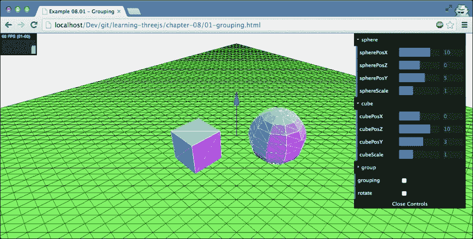

在本例中，您可以使用菜单来移动球体和立方体。如果您选中**旋转**选项，您将看到这两个网格围绕其中心旋转。这不是什么新鲜事，也不是很令人兴奋。然而，这两个对象并没有直接添加到场景中，而是作为一个组添加的。下面的代码概括了这一讨论:

```js
sphere = createMesh(new THREE.SphereGeometry(5, 10, 10));
cube = createMesh(new THREE.BoxGeometry(6, 6, 6));

group = new THREE.Object3D();
group.add(sphere);
group.add(cube);

scene.add(group);
```

在这段代码片段中，可以看到我们创建了`THREE.Object3D`。这是`THREE.Mesh`和`THREE.Scene`的基类，但是它本身并不包含任何东西，也不会导致任何东西被渲染。请注意，在最新的版本的 Three.js 中，引入了一个名为`THREE.Group`的新对象来支持分组。这个对象和一个`THREE.Object3D`对象完全一样，你可以用`new THREE.Group()`代替之前代码中的`new THREE.Object3D()`达到同样的效果。在本例中，我们使用`add`功能将`sphere`和`cube`添加到该对象中，然后将其添加到`scene`中。如果你看看这个例子，你仍然可以移动立方体和球体，缩放和旋转这两个对象。你也可以在他们所在的小组里做这些事情。如果您查看组菜单，您会看到位置和比例选项。您可以使用这些来缩放和移动整个组。该组中对象的比例和位置与组本身的比例和位置相关。

规模和位置非常简单。不过，要记住的一点是，当你旋转一个组时，它不会单独旋转其中的对象；它围绕自己的中心旋转整个组(在我们的示例中，您围绕`group`对象的中心旋转整个组)。在本例中，我们使用组中心的`THREE.ArrowHelper`对象放置了一个箭头来指示旋转点:

```js
var arrow = new THREE.ArrowHelper(new THREE.Vector3(0, 1, 0), group.position, 10, 0x0000ff);
scene.add(arrow);
```

如果同时选中**分组**和**旋转**复选框，该组将旋转。您将看到球体和立方体围绕组的中心旋转(由箭头指示)，如下所示:


当使用组时，您仍然可以参照、修改和定位单个几何图形。唯一需要记住的是，所有的位置、旋转和平移都是相对于父对象进行的。在下一节中，我们将研究合并，您将组合多个独立的几何图形，最终得到一个`THREE.Geometry`对象。

## 将多个网格合并为单个网格

在大多数情况下，使用组允许您轻松操作和管理大量网格。然而，当您处理大量对象时，性能将成为一个问题。对于组，您仍然在处理单个对象，每个对象都需要单独处理和渲染。使用`THREE.Geometry.merge()`，您可以将几何图形合并在一起，并创建一个组合的几何图形。在下面的示例中，您可以看到这是如何工作的，以及它对性能的影响。如果打开`02-merging.html`示例，您会看到一个场景，其中有一组随机分布的半透明立方体。使用菜单中的滑块，您可以设置场景中想要的立方体数量，并通过单击**重绘**按钮来重绘场景。根据您运行的硬件，随着多维数据集数量的增加，您将看到性能下降。在我们的例子中，正如您在下面的截图中看到的，这发生在大约 4000 个对象上，其中刷新率下降到大约 40 fps，而不是正常的 60 fps:


正如你所看到的，T2 对你可以添加到场景中的网格数量有一定的限制。不过，通常情况下，你可能不需要那么多网格，但是在创建特定游戏(例如像*《我的世界》*这样的游戏)或高级可视化时，你可能需要管理大量的单个网格。有了`THREE.Geometry.merge()`，就可以解决这个问题。在我们看代码之前，让我们运行这个相同的例子，但是这次，勾选了**组合**框。标记了该选项后，我们将所有立方体合并为一个`THREE.Geometry`并添加该立方体，如下图所示:

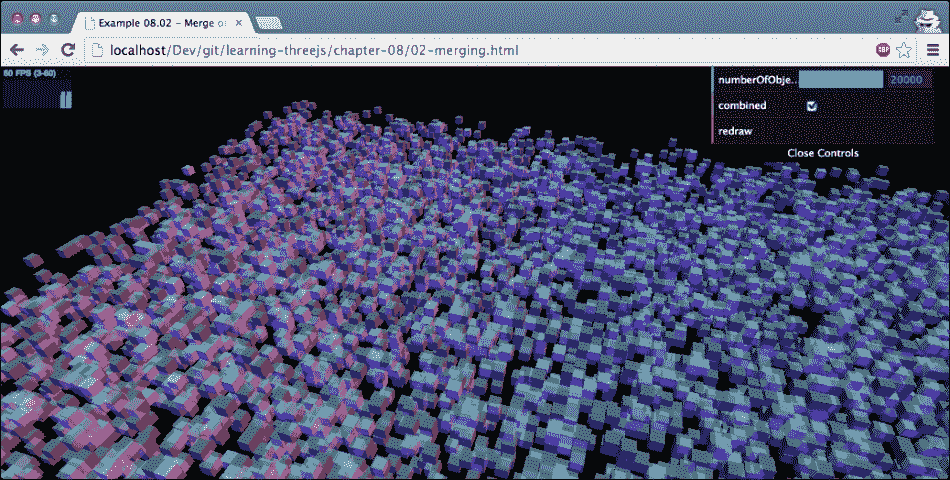

正如你看到的，我们可以轻松渲染 20000 个立方体，性能没有任何下降。为此，我们使用以下几行代码:

```js
var geometry = new THREE.Geometry();
for (var i = 0; i < controls.numberOfObjects; i++) {
  var cubeMesh = addcube();
  cubeMesh.updateMatrix();
  geometry.merge(cubeMesh.geometry,cubeMesh.matrix);
}
scene.add(new THREE.Mesh(geometry, cubeMaterial));
```

在这段代码中，`addCube()`函数返回`THREE.Mesh`。在早期版本的 Three.js 中，我们可以使用`THREE.GeometryUtils.merge`功能将`THREE.Mesh`对象合并到`THREE.Geometry`对象中。在最新版本中，该功能已被弃用，取而代之的是`THREE.Geometry.merge`功能。为了确保合并后的`THREE.Geometry`对象被正确定位和旋转，我们不仅为`merge`函数提供了`THREE.Geometry`，还提供了它的变换矩阵。当我们将这个矩阵添加到`merge`函数中时，我们合并的立方体将被正确定位。

我们这样做了 20，000 次，只剩下一个我们添加到场景中的几何图形。如果您查看代码，您可能会看到这种方法的一些缺点。因为只剩下一个几何图形，所以不能对每个立方体应用一个材质。然而，这一点可以通过`THREE.MeshFaceMaterial`来解决。然而，最大的缺点是你失去了对单个立方体的控制。如果您想要移动、旋转或缩放单个立方体，则不能(除非您搜索正确的面和顶点并单独定位它们)。

使用分组和合并方法，您可以使用 Three.js 提供的基本几何图形创建大型和复杂的几何图形。如果您想要创建更高级的几何图形，那么使用 Three.js 提供的编程方法并不总是最好和最容易的选择。幸运的是，Three.js 提供了一些创建几何图形的其他选项。在下一节中，我们将了解如何从外部资源加载几何图形和网格。

## 从外部资源加载几何图形

Three.js 可以读取多种 3D 文件格式，并导入这些文件中定义的几何图形和网格。下表显示了三个 js 支持的文件格式:

<colgroup><col style="text-align: left"> <col style="text-align: left"></colgroup> 
| 

格式

 | 

描述

 |
| --- | --- |
| JSON | 三. js 有自己的 JSON 格式可以用来声明定义一个几何图形或者场景。尽管这不是官方格式，但它非常容易使用，当您想要重用复杂的几何图形或场景时，它会非常方便。 |
| OBJ 还是 MTL | OBJ 是由 **波前技术**首次开发的简单 3D 格式。这是最广泛采用的 3D 文件格式之一，用于定义对象的几何形状。MTL 是 OBJ 的配套形式。在 MTL 文件中，指定了 OBJ 文件中对象的材质。如果你想把你的模型从三号出口到 OBJ，三号还有一个定制的 OBJ 出口器，叫做 OBJExporter.js |
| 科拉达 | Collada 是一种格式，用于以基于 XML 的格式定义*数字资产*。这也是几乎所有 3D 应用和渲染引擎都支持的一种广泛使用的格式。 |
| 标准模板库 | **STL** 代表**立体光刻**广泛用于快速成型。例如，3D 打印机的模型通常被定义为 STL 文件。如果你想把你的模型从 Three.js 导出到 STL，Three.js 也有一个定制的 STL 导出器，叫做 STLExporter.js。 |
| 通信终端模件(Communication Terminal Module) | CTM 是由 **openCTM** 创建的文件格式。它被用作以紧凑格式存储三维三角形网格的格式。 |
| VTK | VTK 是 **可视化工具包**定义的文件格式，用于指定顶点和面。有两种可用的格式:二进制格式和基于文本的 ASCII 格式。Three.js 只支持基于 ASCII 的格式。 |
| （汽车）全时四轮驱动 | AWD 是一种用于 3D 场景的二进制格式，最常用于[http://away3d.com/](http://away3d.com/)引擎。请注意，该加载程序不支持压缩的 AWD 文件。 |
| Assimp | 打开资产导入库(也叫 **Assimp** )是导入各种 3D 模型格式的标准方式。使用该加载器，您可以从使用 **assimp2json** 转换的大量 3D 格式中导入模型，其详细信息可在[https://github.com/acgessler/assimp2json](https://github.com/acgessler/assimp2json)获得。 |
| 虚拟现实建模语言 | **VRML** 代表**虚拟现实建模语言**。这个是一个基于文本的格式，允许你指定三维物体和世界。它已经被 X3D 文件格式所取代。Three.js 不支持加载 X3D 模型，但是这些模型很容易转换成其他格式。更多信息可在[http://www.x3dom.org/?page_id=532#](http://www.x3dom.org/?page_id=532#)找到。 |
| 巴比伦 | 巴比伦是一个 3D JavaScript 游戏库。它以自己的内部格式存储模型。更多的信息可以在[http://www.babylonjs.com/](http://www.babylonjs.com/)找到。 |
| 物理数据库 | 这是一个非常专业的格式，由 **蛋白质数据库**创建，用于指定蛋白质的外观。Three.js 可以加载并可视化以这种格式指定的蛋白质。 |
| 使用 | 这种格式称为**多边形**文件格式。这个最常用于存储来自 3D 扫描仪的信息。 |

在下一章中，当我们看动画时，我们将重温其中的一些格式(并且看另外两个，MD2 和 glTF)。现在，我们从列表中的第一个开始，三个. js 的内部格式

## 保存并加载三. js JSON 格式

对于三个 js 中的两个不同场景，可以使用三个 js 的 JSON 格式，可以使用它保存和加载单个`THREE.Mesh`，也可以使用它保存和加载一个完整的场景。

### 保存并加载三。网状物

为了演示的保存和加载，我们基于`THREE.TorusKnotGeometry`创建了一个简单的例子。通过这个例子，你可以创建一个环面结，就像我们在[第 5 章](05.html "Chapter 5. Learning to Work with Geometries")、*学习使用几何图形*中所做的那样，使用**保存&加载**菜单中的**保存**按钮，你可以保存当前的几何图形。对于这个例子，我们使用 HTML5 本地存储 API 进行保存。这个应用编程接口允许我们轻松地将持久信息存储在客户端的浏览器中，并在以后检索它(即使浏览器已经关闭并重新启动)。

我们来看看`03-load-save-json-object.html`的例子。下面的截图显示了这个例子:


从 Three.js 导出 JSON 中的非常简单，不需要包含任何额外的库。将`THREE.Mesh`导出为 JSON 唯一需要做的事情如下:

```js
var result = knot.toJSON();
localStorage.setItem("json", JSON.stringify(result));
```

在保存它之前，我们首先使用`JSON.stringify`函数将`toJSON`函数(一个 JavaScript 对象)的结果转换成字符串。这将产生一个类似如下的 JSON 字符串(大部分顶点和面都被省略了):

```js
{
  "metadata": {
    "version": 4.3,
    "type": "Object",
    "generator": "ObjectExporter"
  },
  "geometries": [{
    "uuid": "53E1B290-3EF3-4574-BD68-E65DFC618BA7",
    "type": "TorusKnotGeometry",
    "radius": 10,
    "tube": 1,
    "radialSegments": 64,
    "tubularSegments": 8,
    "p": 2,
    "q": 3,
    "heightScale": 1
  }],
  ...
}
```

正如你所看到的，三个 js 保存了所有关于`THREE.Mesh`的信息。要使用 HTML5 本地存储 API 保存这些信息，我们所要做的就是调用`localStorage.setItem`函数。第一个参数是键值(`json`)，稍后我们可以使用它来检索作为第二个参数传入的信息。

将`THREE.Mesh`加载回 Three.js 也只需要几行代码，如下所示:

```js
var json = localStorage.getItem("json");

if (json) {
  var loadedGeometry = JSON.parse(json);
  var loader = new THREE.ObjectLoader();

  loadedMesh = loader.parse(loadedGeometry);
  loadedMesh.position.x -= 50;
  scene.add(loadedMesh);
}
```

在这里，我们首先使用保存它的名称(在本例中为`json`)从本地存储中获取 JSON。为此，我们使用 HTML5 本地存储 API 提供的`localStorage.getItem`函数。接下来，我们需要将字符串转换回 JavaScript 对象(`JSON.parse`)并将 JSON 对象转换回`THREE.Mesh`。Three.js 提供了一个名为`THREE.ObjectLoader`的辅助对象，可以用来将 JSON 转换为`THREE.Mesh`。在这个例子中，我们使用加载器上的`parse`方法直接解析一个 JSON 字符串。加载器还提供了一个`load`函数，您可以在其中将网址传递给包含 JSON 定义的文件。

这里可以看到，我们只救了`THREE.Mesh`。我们失去了一切。如果想要保存完整的场景，包括灯光和摄像头，可以使用`THREE.SceneExporter`。

### 保存和加载场景

如果您想要保存一个完整的场景，您可以使用与我们在上一节中看到的相同的方法来保存几何图形。`04-load-save-json-scene.html`就是一个说明这一点的工作实例。下面的截图显示了这个例子:


在这个的例子中，你有三个选项:**导出场景**、**清除场景**和**导入场景**。使用 **exportScene** ，场景的当前状态将保存在浏览器的本地存储中。要测试导入功能，您可以通过点击**清除场景**按钮移除场景，并使用**导入场景**按钮从本地存储中加载场景。完成这一切的代码非常简单，但是在使用之前，您必须从 Three.js 发行版中导入所需的导出器和加载器(查看`examples/js/exporters`和`examples/js/loaders`目录):

```js
<script type="text/javascript" src="../libs/SceneLoader.js"></script>
<script type="text/javascript" src="../libs/SceneExporter.js"></script>
```

页面中包含这些 JavaScript 导入后，您可以使用以下代码导出场景:

```js
var exporter = new THREE.SceneExporter();
var sceneJson = JSON.stringify(exporter.parse(scene));
localStorage.setItem('scene', sceneJson);
```

这种方法与我们在上一节中使用的方法完全相同——只是这次，我们使用`THREE.SceneExporter()`导出一个完整的场景。生成的 JSON 如下所示:

```js
{
  "metadata": {
    "formatVersion": 3.2,
    "type": "scene",
    "generatedBy": "SceneExporter",
    "objects": 5,
    "geometries": 3,
    "materials": 3,
    "textures": 0
  },
  "urlBaseType": "relativeToScene", "objects": {
    "Object_78B22F27-C5D8-46BF-A539-A42207DDDCA8": {
      "geometry": "Geometry_5",
      "material": "Material_1",
      "position": [15, 0, 0],
      "rotation": [-1.5707963267948966, 0, 0],
      "scale": [1, 1, 1],
      "visible": true
    }
    ... // removed all the other objects for legibility
  },
  "geometries": {
    "Geometry_8235FC68-64F0-45E9-917F-5981B082D5BC": {
      "type": "cube",
      "width": 4,
      "height": 4,
      "depth": 4,
      "widthSegments": 1,
      "heightSegments": 1,
      "depthSegments": 1
    }
    ... // removed all the other objects for legibility
  }
  ... other scene information like textures
```

当您再次加载这个 JSON 时，Three.js 只是完全按照导出的方式重新创建对象。加载场景是这样完成的:

```js
var json = (localStorage.getItem('scene'));
var sceneLoader = new THREE.SceneLoader();
sceneLoader.parse(JSON.parse(json), function(e) {
  scene = e.scene;
}, '.');
```

传入加载器的最后一个参数(`'.'`)定义了相对网址。例如，如果你有使用纹理的材料(例如，外部图像)，这些将使用这个相对网址检索。在这个例子中，我们不使用纹理，我们只是传入当前目录。就像`THREE.ObjectLoader`一样，你也可以使用`load`功能从一个网址加载一个 JSON 文件。

有许多不同的 3D 程序可以用来创建复杂的网格。一个流行的开源软件是 Blender([www.blender.org](http://www.blender.org))。Three.js 有一个 Blender 的导出器(也适用于 Maya 和 3D Studio Max)，直接导出为 Three.js 的 JSON 格式。在下一节中，我们将引导您将 Blender 配置为使用这个导出器，并向您展示如何在 Blender 中导出复杂的模型并在 Three.js 中显示它

## 与搅拌机一起工作

在开始配置之前，我们将展示我们想要的结果。在下面的截图中，你可以看到一个简单的 Blender 模型，我们用 Three.js 插件导出，用`THREE.JSONLoader`在 Three.js 中导入:


### 在搅拌机中安装三个 js 导出器

要让 Blender 导出三. js 模型，我们首先需要将三. js 导出器添加到 Blender 中。以下步骤适用于苹果 OS X，但在视窗和 Linux 上基本相同。您可以从[www.blender.org](http://www.blender.org)和下载 Blender，并按照特定平台的安装说明进行操作。安装后，您可以添加三. js 插件。首先，使用终端窗口从您的 Blender 安装中找到`addons`目录:


在我的 Mac 上，它位于这里:`./blender.app/Contents/MacOS/2.70/scripts/addons`。对于 Windows，可以在以下位置找到该目录:`C:\Users\USERNAME\AppData\Roaming\Blender Foundation\Blender\2.7X\scripts\addons`。对于 Linux，你可以在这里找到这个目录:`/home/USERNAME/.config/blender/2.7X/scripts/addons`。

接下来，您需要获取三. js 发行版，并在本地将其解包。在这个分布中，可以找到以下文件夹:`utils/exporters/blender/2.65/scripts/addons/`。在这个目录中，有一个名为`io_mesh_threejs`的子目录。将此目录复制到搅拌机安装的`addons`文件夹中。

现在，我们需要做的就是启动 Blender 并启用导出器。在搅拌机中，打开**搅拌机用户首选项** ( **文件** | **用户首选项**)。在打开的窗口中，选择**插件**选项卡，在搜索框中输入`three`。这将显示以下屏幕:

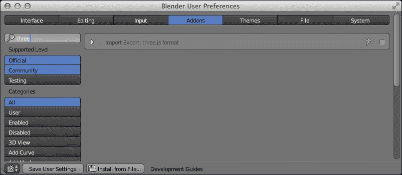

此时点，找到三. js 插件，但仍被禁用。选中右边的小复选框，将启用三个. js 导出器。最后检查一下是否一切正常，打开**文件** | **导出**菜单选项，你会看到三个. js 被列为导出选项。这显示在下面的截图中:


安装插件后，我们可以加载第一个模型。

### 从 Blender 加载和导出模型

作为一个的例子，我们在`img/models`文件夹中添加了一个名为`misc_chair01.blend`的简单 Blender 模型，你可以在这本书的来源中找到。在本节中，我们将加载这个模型，并展示将这个模型导出到 Three.js 所需的最少步骤

首先，我们需要在 Blender 中加载这个模型。使用**文件** | **打开**并导航到包含`misc_chair01.blend`文件的文件夹。选择该文件，点击**打开**。这将向您显示一个屏幕，看起来有点像这样:


将这个模型导出为三. js JSON 格式非常简单。在**文件**菜单中，打开**导出** | **三. js** ，输入导出文件的名称，选择**导出三. js** 。这将创建一个格式为 Three.js 理解的 JSON 文件。该文件的部分内容如下所示:

```js
{

  "metadata" :
  {
    "formatVersion" : 3.1,
    "generatedBy"   : "Blender 2.7 Exporter",
    "vertices"      : 208,
    "faces"         : 124,
    "normals"       : 115,
    "colors"        : 0,
    "uvs"           : [270,151],
    "materials"     : 1,
    "morphTargets"  : 0,
    "bones"         : 0
  },
...
```

然而，我们还没有完全完成。在之前的截图中，可以看到椅子包含木质纹理。如果浏览 JSON 导出，可以看到椅子的导出也指定了一种材质，如下所示:

```js
"materials": [{
  "DbgColor": 15658734,
  "DbgIndex": 0,
  "DbgName": "misc_chair01",
  "blending": "NormalBlending",
  "colorAmbient": [0.53132, 0.25074, 0.147919],
  "colorDiffuse": [0.53132, 0.25074, 0.147919],
  "colorSpecular": [0.0, 0.0, 0.0],
  "depthTest": true,
  "depthWrite": true,
  "mapDiffuse": "misc_chair01_col.jpg",
  "mapDiffuseWrap": ["repeat", "repeat"],
  "shading": "Lambert",
  "specularCoef": 50,
  "transparency": 1.0,
  "transparent": false,
  "vertexColors": false
}],
```

该材质为`mapDiffuse`属性指定了纹理`misc_chair01_col.jpg`。所以，除了导出模型之外，我们还需要确保纹理文件对 Three.js 也可用。幸运的是，我们可以直接从 Blender 保存这个纹理。

在搅拌机中，打开**紫外线/图像编辑器**视图。您可以从**文件**菜单选项左侧的下拉菜单中选择该视图。这将用以下内容替换顶部菜单:


确保选择了您想要导出的纹理，在我们的例子中为`misc_chair_01_col.jpg`(您可以使用小图像图标选择不同的纹理)。接下来，点击**图像**菜单，使用**另存为图像**菜单选项保存图像。使用 JSON 导出文件中指定的名称将其保存在保存模型的同一文件夹中。此时，我们已经准备好将模型加载到三个

此时将它加载到三个. js 中的代码如下所示:

```js
var loader = new THREE.JSONLoader();
loader.load('../img/models/misc_chair01.js', function (geometry, mat) {
  mesh = new THREE.Mesh(geometry, mat[0]);

  mesh.scale.x = 15;
  mesh.scale.y = 15;
  mesh.scale.z = 15;

  scene.add(mesh);

}, '../img/models/');
```

我们之前已经看过了`JSONLoader`，但是这次用的是`load`功能，而不是`parse`功能。在这个函数中，我们指定要加载的 URL(指向导出的 JSON 文件)、加载对象时调用的回调，以及可以找到纹理的位置`../img/models/`(相对于页面)。该回调采用两个参数:`geometry`和`mat`。`geometry`参数包含模型，`mat`参数包含一组材质对象。我们知道只有一种材料，所以我们在创建`THREE.Mesh`的时候，直接引用那种材料。如果打开`05-blender-from-json.html`示例，可以看到我们刚从 Blender 导出的椅子。

使用三. js 导出器不是将模型从 Blender 加载到三. js 中的唯一方法。三. js 了解许多 3D 文件格式，Blender 可以以其中的几种格式导出。然而，使用 Three.js 格式非常容易，如果出现问题，通常会很快被发现。

在下一节中，我们将研究 Three.js 支持的几种格式，并展示一个基于 Blender 的 OBJ 和 MTL 文件格式的例子。

## 从 3D 文件格式导入

在本章的开头，我们列出了三个 js 支持的许多格式。在这一节中，我们将快速浏览这些格式的几个示例。请注意，对于所有这些格式，需要包含一个额外的 JavaScript 文件。您可以在`examples/js/loaders`目录中的 Three.js 发行版中找到所有这些文件。

### OBJ 和 MTL 模式

OBJ 和 MTL 是相伴格式，经常一起使用。 OBJ 文件定义几何图形，MTL 文件定义使用的材料。OBJ 和 MTL 都是基于文本的格式。OBJ 文件的一部分是这样的:

```js
v -0.032442 0.010796 0.025935
v -0.028519 0.013697 0.026201
v -0.029086 0.014533 0.021409
usemtl Material
s 1
f 2731 2735 2736 2732
f 2732 2736 3043 3044
```

MTL 文件这样定义材料:

```js
newmtl Material
Ns 56.862745
Ka 0.000000 0.000000 0.000000
Kd 0.360725 0.227524 0.127497
Ks 0.010000 0.010000 0.010000
Ni 1.000000
d 1.000000
illum 2
```

Three.js 的 OBJ 和 MTL 格式很好理解，也得到 Blender 的支持。因此，作为替代，您可以选择从 Blender 以 OBJ/MTL 格式导出模型，而不是以 Three.js JSON 格式。Three.js 有两种不同的加载器可以使用。如果只想加载几何图形，可以使用`OBJLoader`。我们在示例中使用了这个加载器(`06-load-obj.html`)。下面的截图显示了这个例子:

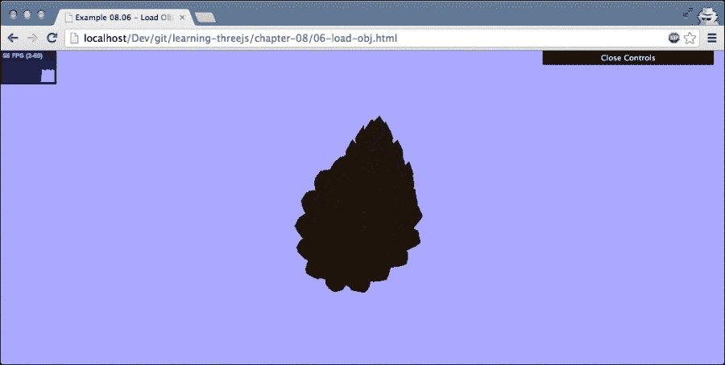

要在 Three.js 中导入这个，你必须添加 OBJLoader JavaScript 文件:

```js
<script type="text/javascript" src="../libs/OBJLoader.js"></script>
```

像这样导入模型:

```js
var loader = new THREE.OBJLoader();
loader.load('../img/models/pinecone.obj', function (loadedMesh) {
  var material = new THREE.MeshLambertMaterial({color: 0x5C3A21});

  // loadedMesh is a group of meshes. For
  // each mesh set the material, and compute the information
  // three.js needs for rendering.
  loadedMesh.children.forEach(function (child) {
    child.material = material;
    child.geometry.computeFaceNormals();
    child.geometry.computeVertexNormals();
  });

  mesh = loadedMesh;
  loadedMesh.scale.set(100, 100, 100);
  loadedMesh.rotation.x = -0.3;
  scene.add(loadedMesh);
});
```

在这段代码中，我们使用`OBJLoader`从一个 URL 加载模型。一旦模型被加载，我们提供的回调就被调用，我们将模型添加到场景中。

### 类型

通常，一个好的第一步是打印出回调到控制台的响应，以了解加载的对象是如何构建的。通常在这些加载器中，几何或网格作为组的层次结构返回。理解这一点可以更容易地放置和应用正确的材料，并采取任何其他额外的步骤。此外，查看几个顶点的位置，以确定是否需要上下缩放模型以及相机的位置。在这个例子中，我们还调用了`computeFaceNormals`和`computeVertexNormals`。这是确保正确渲染所用材料(`THREE.MeshLambertMaterial`)所必需的。

下一个示例(`07-load-obj-mtl.html`)使用`OBJMTLLoader`加载模型并直接指定材质。下面的截图显示了这个例子:

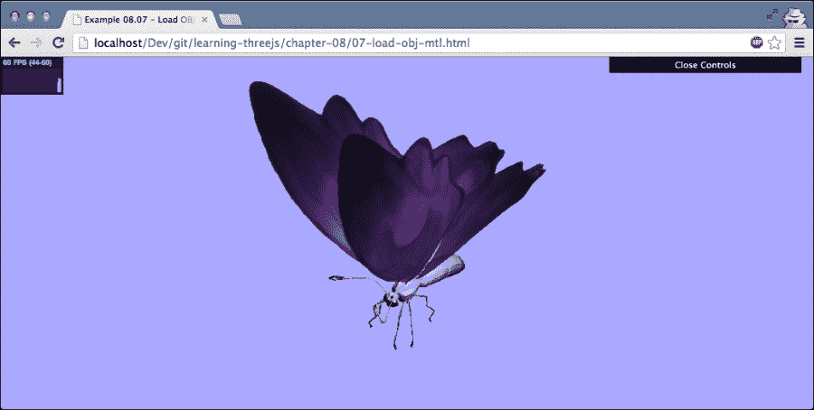

首先，我们需要向页面添加正确的加载器:

```js
<script type="text/javascript" src="../libs/OBJLoader.js"></script>
<script type="text/javascript" src="../libs/MTLLoader.js"></script>
<script type="text/javascript" src="../libs/OBJMTLLoader.js"></script>
```

我们可以从 OBJ 和 MTL 文件中加载模型，如下所示:

```js
var loader = new THREE.OBJMTLLoader();
loader.load('../img/models/butterfly.obj', '../img/models/butterfly.mtl', function(object) {
  // configure the wings
  var wing2 = object.children[5].children[0];
  var wing1 = object.children[4].children[0];

  wing1.material.opacity = 0.6;
  wing1.material.transparent = true;
  wing1.material.depthTest = false;
  wing1.material.side = THREE.DoubleSide;

  wing2.material.opacity = 0.6;
  wing2.material.depthTest = false;
  wing2.material.transparent = true;
  wing2.material.side = THREE.DoubleSide;

  object.scale.set(140, 140, 140);
  mesh = object;
  scene.add(mesh);

  mesh.rotation.x = 0.2;
  mesh.rotation.y = -1.3;
});
```

在我们查看代码之前，首先要提到的是，如果您收到一个 OBJ 文件、一个 MTL 文件和所需的纹理文件，您必须检查 MTL 文件是如何引用纹理的。这些应该是相对于 MTL 文件引用的，而不是绝对路径。代码本身和我们看到的`THREE.ObjLoader`没有太大区别。我们指定 OBJ 文件的位置，MTL 文件的位置，以及加载模型时要调用的函数。我们在这个例子中使用的模型是一个复杂的模型。因此，我们在回调中设置了一些特定的属性来修复一些呈现问题，如下所示:

*   源文件中的不透明度设置不正确，导致翅膀不可见。因此，为了解决这个问题，我们自己设置了`opacity`和`transparent`属性。
*   默认情况下，Three.js 只呈现对象的一面。因为我们从两侧看翅膀，所以我们需要将`side`属性设置为`THREE.DoubleSide`值。
*   当翅膀需要一个在另一个上面渲染时，会产生一些不需要的人工产物。我们通过将`depthTest`属性设置为`false`来解决这个问题。这对性能有轻微影响，但通常可以解决一些奇怪的渲染工件。

但是，正如所见，可以很容易地将复杂的模型直接加载到 Three.js 中，并在浏览器中实时渲染。不过，您可能需要微调一些材料属性。

### 加载 Collada 模型

Collada 模型(扩展名为`.dae`)是定义场景和模型(以及动画，我们将在下一章中看到)的另一种非常常见的格式。在 Collada 模型中，定义的不仅仅是几何图形，还有材料。甚至可以定义光源。

要加载 Collada 模型，您必须采取与 OBJ 和 MTL 模型基本相同的步骤。首先包含正确的加载程序:

```js
<script type="text/javascript" src="../libs/ColladaLoader.js"></script>
```

对于本例，我们将加载以下模型:


装载卡车模型再次变得非常简单:

```js
var mesh;
loader.load("../img/models/dae/Truck_dae.dae", function (result) {
  mesh = result.scene.children[0].children[0].clone();
  mesh.scale.set(4, 4, 4);
  scene.add(mesh);
});
```

这里的主要区别是返回回调的对象的结果。`result`对象具有以下结构:

```js
var result = {

  scene: scene,
  morphs: morphs,
  skins: skins,
  animations: animData,
  dae: {
    ...
  }
};
```

在本章中，我们对`scene`参数中的对象感兴趣。我先把场景打印到控制台上，看我感兴趣的网格在哪里，就是`result.scene.children[0].children[0]`。剩下要做的就是将其缩放到合理的大小，并将其添加到场景中。关于这个具体例子的最后一点——当我第一次加载这个模型时，材质没有正确渲染。原因是纹理使用了`.tga`格式，这在 WebGL 中是不支持的。为了解决这个问题，我必须将`.tga`文件转换为`.png`，并编辑`.dae`模型的 XML 以指向这些`.png`文件。

如你所见，对于大多数复杂的模型，包括材料，你经常需要采取一些额外的步骤才能得到想要的结果。通过仔细观察材料是如何配置的(使用`console.log()`)或用测试材料替换它们，问题往往很容易被发现。

### 加载 STL、CTM、VTK、AWD、阿西姆普、VRML 和巴比伦模型

我们将快速浏览这些文件格式，因为它们都遵循相同的原则:

1.  在你的网页中加入`[NameOfFormat]Loader.js`。
2.  使用`[NameOfFormat]Loader.load()`加载一个网址。
3.  检查回调的响应格式，并呈现结果。

我们包含了所有这些格式的示例:

<colgroup><col style="text-align: left"> <col style="text-align: left"> <col style="text-align: left"></colgroup> 
| 

名字

 | 

例子

 | 

屏幕上显示程序运行的图片

 |
| --- | --- | --- |
| STL〔t0〕 | `08-load-STL.html` |  |
| CTM〔t0〕 | `09-load-CTM.html` | 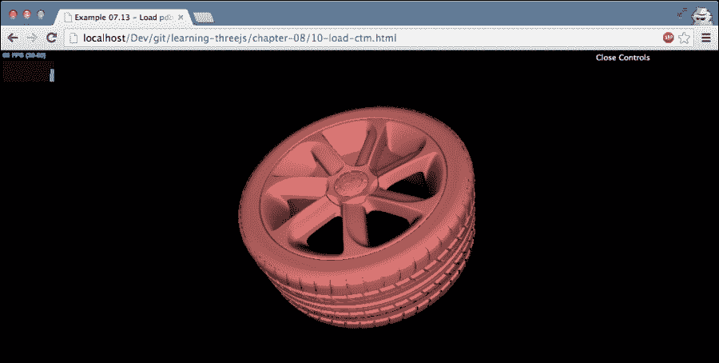 |
| VTK〔t0〕 | `10-load-vtk.html` | 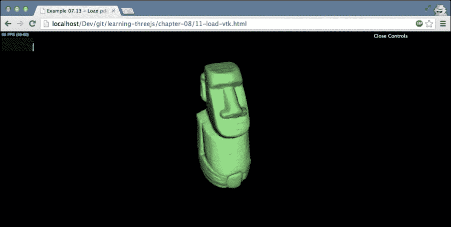 |
| awd〔t0〕 | `11-load-awd.html` |  |
| asimp〔t0〕 | `12-load-assimp.html` | 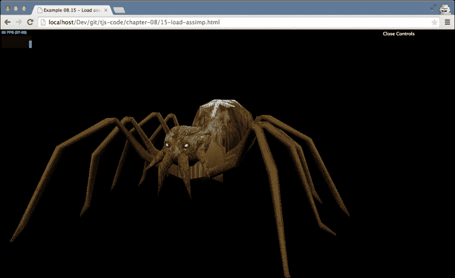 |
| VRML〔t0〕 | `13-load-vrml.html` | 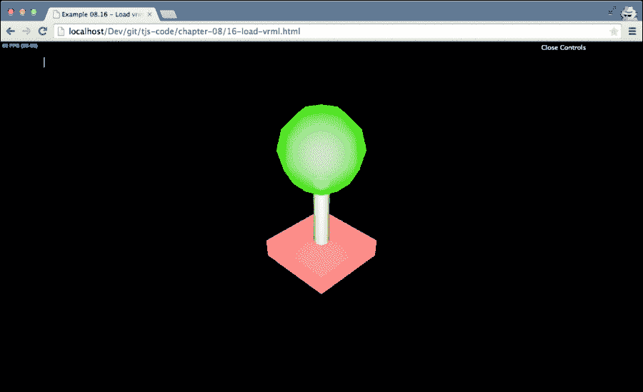 |
| 巴比伦 | 巴比伦装载机与本表中的其他装载机略有不同。使用这个加载器，您不会加载单个`THREE.Mesh`或`THREE.Geometry`实例，但是使用这个加载器，您可以加载一个完整的场景，包括灯光。`14-load-babylon.html` |  |

如果您查看这些示例的源代码，您可能会发现对于其中一些示例，我们需要在模型正确渲染之前更改一些材质属性或进行一些缩放。我们需要这样做的原因是因为模型是在其外部应用中创建的，给了它不同于我们通常在三个. js 中使用的维度和分组

我们几乎展示了所有支持的文件格式。在接下来的两节中，我们将采用不同的方法。首先，我们将了解如何从蛋白质数据库(PDB 格式)渲染蛋白质，最后我们将使用 PLY 格式中定义的模型来创建粒子系统。

### 显示蛋白质数据库中的蛋白质

蛋白质数据银行([www.rcsb.org](http://www.rcsb.org))包含关于许多不同分子和蛋白质的详细信息。除了对这些蛋白质的解释之外，它们还提供了一种以 PDB 格式下载这些分子结构的方法。Three.js 为以 PDB 格式指定的文件提供了一个加载器。在这一节中，我们将给出一个例子，说明如何解析 PDB 文件并用三个. js 可视化它们

要以新的文件格式加载，我们总是需要做的第一件事是在 Three.js 中包含正确的加载器，如下所示:

```js
<script type="text/javascript" src="../libs/PDBLoader.js"></script>
```

有了这个加载器，我们将创建下面提供的分子描述的三维模型(参见`15-load-ptb.html`示例):

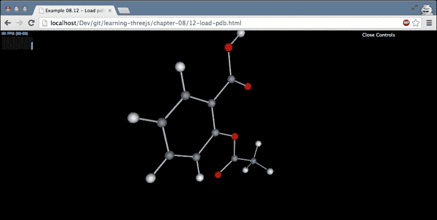

加载一个 PDB 文件的方式与前面的格式相同，如下所示:

```js
var loader = new THREE.PDBLoader();
var group = new THREE.Object3D();
loader.load("../img/models/diamond.pdb", function (geometry, geometryBonds) {
  var i = 0;

  geometry.vertices.forEach(function (position) {
    var sphere = new THREE.SphereGeometry(0.2);
    var material = new THREE.MeshPhongMaterial({color: geometry.colors[i++]});
    var mesh = new THREE.Mesh(sphere, material);
    mesh.position.copy(position);
    group.add(mesh);
  });

  for (var j = 0; j < geometryBonds.vertices.length; j += 2) {
    var path = new THREE.SplineCurve3([geometryBonds.vertices[j], geometryBonds.vertices[j + 1]]);
    var tube = new THREE.TubeGeometry(path, 1, 0.04)
    var material = new THREE.MeshPhongMaterial({color: 0xcccccc});
    var mesh = new THREE.Mesh(tube, material);
    group.add(mesh);
  }
  console.log(geometry);
  console.log(geometryBonds);

  scene.add(group);
});
```

正如你可以从这个例子中看到的，我们实例化`THREE.PDBLoader`，传入我们想要加载的模型文件，并提供一个在模型加载时调用的回调。对于这个特定的加载器，回调函数用两个参数调用:`geometry`和`geometryBonds`。提供的`geometry`参数的顶点包含单个原子的位置，`geometryBounds`用于原子之间的连接。

对于每个顶点，我们用模型提供的颜色创建一个球体:

```js
var sphere = new THREE.SphereGeometry(0.2);
var material = new THREE.MeshPhongMaterial({color: geometry.colors[i++]});
var mesh = new THREE.Mesh(sphere, material);
mesh.position.copy(position);
group.add(mesh)
```

每个连接的定义如下:

```js
var path = new THREE.SplineCurve3([geometryBonds.vertices[j], geometryBonds.vertices[j + 1]]);
var tube = new THREE.TubeGeometry(path, 1, 0.04)
var material = new THREE.MeshPhongMaterial({color: 0xcccccc});
var mesh = new THREE.Mesh(tube, material);
group.add(mesh);
```

对于连接，我们首先使用`THREE.SplineCurve3`对象创建一个三维路径。该路径用作`THREE.Tube`的输入，并用于创建原子之间的连接。所有的连接和原子被添加到一个组中，这个组被添加到场景中。你可以从蛋白质数据库下载很多模型。

下图显示了钻石的结构:


### 从 PLY 模型创建粒子系统

使用 PLY 格式与其他格式没有太大区别。您包括加载器，提供一个回调，可视化模型。然而，对于这个的最后一个例子，我们将做一些不同的事情。我们将使用来自该模型的信息来创建粒子系统，而不是将模型渲染为网格(参见`15-load-ply.html`示例)。下面的截图显示了这个例子:

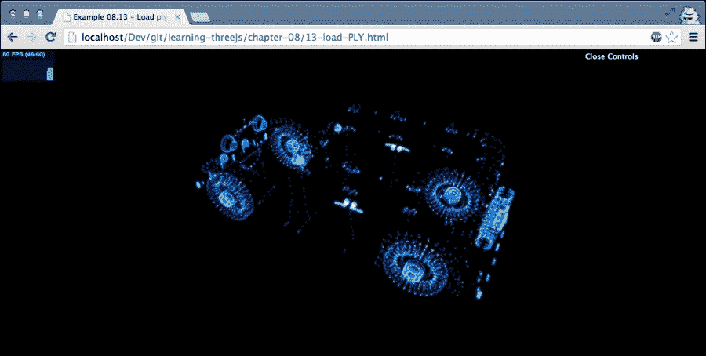

渲染前面截图的 JavaScript 代码其实很简单，如下所示:

```js
var loader = new THREE.PLYLoader();
var group = new THREE.Object3D();
loader.load("../img/models/test.ply", function (geometry) {
  var material = new THREE.PointCloudMaterial({
    color: 0xffffff,
    size: 0.4,
    opacity: 0.6,
    transparent: true,
    blending: THREE.AdditiveBlending,
    map: generateSprite()
  });

  group = new THREE.PointCloud(geometry, material);
  group.sortParticles = true;

  scene.add(group);
});
```

如您所见，我们使用`THREE.PLYLoader`加载模型。回调返回`geometry`，我们使用这个几何图形作为`THREE.PointCloud`的输入。我们使用的材料与上一章最后一个例子中使用的材料相同。如您所见，使用 Three.js，可以非常容易地组合来自各种来源的模型，并以不同的方式渲染它们，所有这些都只需几行代码。

# 总结

使用外部来源的模型在 Three.js 中并不难做到，尤其是对于简单的模型，你只需要采取一些简单的步骤。当使用外部模型时，或者使用分组和合并来创建它们时，最好记住几件事。您需要记住的第一件事是，当您将对象分组时，它们仍然作为单个对象可用。应用于父对象的变换也会影响子对象，但是您仍然可以单独变换子对象。除了分组，您还可以将几何图形合并在一起。使用这种方法，您会丢失单个几何图形，而获得一个新的几何图形。当您处理数千个需要渲染的几何图形并且遇到性能问题时，这尤其有用。

Three.js 支持大量的外部格式。当使用这些格式加载器时，查看源代码并注销回调中收到的信息是一个好主意。这将帮助您了解获得正确网格并将其设置为正确位置和比例所需的步骤。通常，当模型没有正确显示时，这是由其材质设置造成的。可能是使用了不兼容的纹理格式，不透明度定义不正确，或者该格式包含到纹理图像的不正确链接。通常，使用测试材料来确定模型本身是否被正确加载是一个好主意，并将加载的材料记录到 JavaScript 控制台，以检查意外的值。也可以导出网格和场景，但是记住三个 js 的`GeometryExporter`、`SceneExporter`、`SceneLoader`还在工作中。

您在本章和前几章中使用的模型大多是静态模型。它们没有动画，不移动，也不改变形状。在下一章中，您将学习如何制作模型动画，让它们栩栩如生。除了动画之外，下一章还将解释 Three.js 提供的各种相机控件。使用相机控件，您可以围绕场景移动、平移和旋转相机。